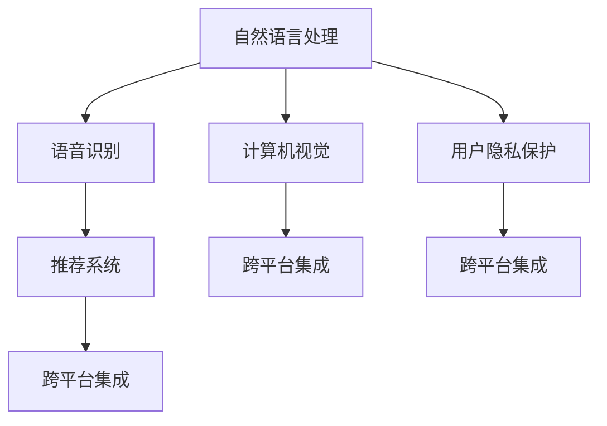

                 

# 构建个人AI助手生态系统的方法

## 1. 背景介绍

### 1.1 问题由来

随着人工智能技术的发展，AI助手已经从简单的自动化任务执行逐步演进为能够进行复杂推理和人类交互的系统。然而，要构建一个真正意义上的个人AI助手，即能够在用户的日常生活中的各个场景中提供稳定、高效、智能的服务，仍然面临着诸多挑战。本文旨在探索构建个人AI助手生态系统的方法，为开发团队提供全面的指导。

### 1.2 问题核心关键点

构建个人AI助手生态系统，核心在于实现一个无缝集成的、能够跨平台、跨设备的智能系统。这不仅要求AI助手具备强大的自然语言理解能力，还需要具备跨领域知识、复杂的推理能力和高效的互动机制。要实现这些功能，需要综合利用机器学习、自然语言处理、计算机视觉、语音识别等多种技术。

## 2. 核心概念与联系

### 2.1 核心概念概述

构建个人AI助手生态系统涉及以下核心概念：

- **自然语言处理(NLP)**：指计算机处理人类语言的能力，包括语音识别、文本分类、情感分析、语义理解等技术。
- **计算机视觉(CV)**：指计算机对视觉信息的处理能力，包括图像识别、物体检测、视频分析等技术。
- **语音识别**：指计算机对人类语音的识别和理解能力，包括自动语音识别(ASR)、语音合成(TTS)等技术。
- **推荐系统**：指根据用户的历史行为和偏好，推荐相关物品或内容的技术。
- **跨平台集成**：指通过API、SDK等方式，将不同平台上的AI助手服务无缝集成，提供统一的交互界面。
- **用户隐私保护**：指在AI助手的开发和使用过程中，严格遵守隐私保护法律法规，保护用户数据安全。

这些核心概念之间相互联系，共同构成了个人AI助手生态系统的基础架构。以下是一个简化的Mermaid流程图，展示了这些概念之间的联系：



## 3. 核心算法原理 & 具体操作步骤

### 3.1 算法原理概述

构建个人AI助手生态系统，主要依赖于以下几个算法原理：

- **自然语言理解(NLU)**：指通过机器学习模型，将用户的自然语言输入转化为计算机可处理的格式，如意图识别、实体抽取、关系抽取等。
- **知识图谱(KG)**：指通过图结构化的方式，将大量的无结构化知识整合并组织起来，供AI助手进行推理和查询。
- **强化学习(RL)**：指通过与环境的交互，AI助手逐步学习最优的决策策略，提升互动效果和用户体验。
- **用户行为分析**：指通过数据分析技术，识别和理解用户的行为模式，为推荐系统和个性化服务提供数据支持。
- **隐私保护算法**：指在AI助手的开发和使用过程中，应用差分隐私、联邦学习等技术，保护用户隐私。

### 3.2 算法步骤详解

构建个人AI助手生态系统的具体操作步骤如下：

1. **数据收集与预处理**：收集用户的历史数据、行为数据、语音数据、图像数据等，并进行预处理，如数据清洗、特征提取等。
2. **模型训练与微调**：利用收集到的数据，训练自然语言处理、计算机视觉、语音识别等模型，并进行微调，以适应特定任务。
3. **知识图谱构建与更新**：构建和维护知识图谱，将领域知识和常识进行结构化，供AI助手推理和查询。
4. **跨平台集成与API设计**：设计统一的API和SDK，实现不同平台上的AI助手服务无缝集成。
5. **用户交互与反馈机制**：设计友好的用户界面和反馈机制，收集用户的使用反馈，不断优化AI助手的性能。
6. **隐私保护与数据安全**：应用隐私保护算法，确保用户数据的安全和隐私。

### 3.3 算法优缺点

构建个人AI助手生态系统的主要优点包括：

- **功能全面**：整合了自然语言处理、计算机视觉、语音识别等多种技术，能够处理各种形式的输入，提供全方位的服务。
- **智能交互**：通过强化学习和用户行为分析，AI助手能够不断学习和适应用户需求，提升互动效果。
- **跨平台集成**：通过统一的API和SDK，实现不同平台上的无缝集成，提供统一的交互界面。

主要缺点包括：

- **数据依赖**：构建AI助手生态系统需要大量的标注数据和高质量的数据源，数据采集和预处理成本较高。
- **模型复杂**：涉及多种复杂算法，模型训练和维护成本较高。
- **隐私风险**：在收集和处理用户数据时，需要严格遵守隐私保护法律法规，数据安全问题不容忽视。

### 3.4 算法应用领域

构建个人AI助手生态系统在以下领域有广泛的应用：

- **智能家居**：通过语音识别和计算机视觉技术，实现智能控制家电、监测环境等。
- **智能医疗**：通过自然语言处理和计算机视觉技术，辅助医生进行诊断、患者进行健康管理等。
- **智能教育**：通过自然语言理解和推荐系统，提供个性化学习方案和辅导。
- **智能客服**：通过自然语言处理和语音识别技术，实现自动客服和智能问答。
- **智能交通**：通过计算机视觉和自然语言处理技术，辅助驾驶、提供交通信息等。

## 4. 数学模型和公式 & 详细讲解 & 举例说明

### 4.1 数学模型构建

构建个人AI助手生态系统涉及多个数学模型，以下是几个关键模型的构建过程：

- **自然语言理解模型(NLU)**：假设输入为文本$x$，模型输出为意图$i$和实体$e$，其数学模型为：
$$ y = f(x) $$
其中$f$为自然语言理解模型，$y$为输出，包括意图和实体。

- **推荐系统模型**：假设输入为用户历史行为$h$，模型输出为推荐物品$k$，其数学模型为：
$$ r_k = g(h) $$
其中$g$为推荐系统模型，$r_k$为物品$k$的评分。

- **强化学习模型**：假设输入为环境状态$s$，模型输出为动作$a$，其数学模型为：
$$ q(a|s) = \pi(a|s) = \frac{exp(q(a|s))}{\sum_{a'}exp(q(a'|s))} $$
其中$q(a|s)$为动作$a$在状态$s$下的Q值，$\pi(a|s)$为策略函数。

### 4.2 公式推导过程

以自然语言理解模型为例，其基本推导过程如下：

1. **词嵌入**：将输入文本$x$转换为词向量$w$，其数学模型为：
$$ w = E(x) $$
其中$E$为词嵌入函数。

2. **意图分类**：将词向量$w$输入到分类器中，输出意图$i$，其数学模型为：
$$ i = C(w) $$
其中$C$为分类器。

3. **实体抽取**：将词向量$w$输入到实体抽取模型中，输出实体$e$，其数学模型为：
$$ e = R(w) $$
其中$R$为实体抽取模型。

### 4.3 案例分析与讲解

以智能客服为例，自然语言理解模型通过分析用户输入的文本，抽取意图和实体，然后根据知识图谱查询相关回答，生成回复。推荐系统模型根据用户历史行为和当前查询，推荐相关问答模板。强化学习模型通过与用户的交互，不断调整模型参数，提升回答的准确性和流畅性。

## 5. 项目实践：代码实例和详细解释说明

### 5.1 开发环境搭建

构建个人AI助手生态系统需要多领域技术的支持，以下是一个Python开发环境搭建流程：

1. **安装Python**：从官网下载并安装Python，推荐使用Anaconda。
2. **创建虚拟环境**：
   ```bash
   conda create -n ai_assistant python=3.8
   conda activate ai_assistant
   ```
3. **安装依赖库**：
   ```bash
   pip install transformers torch numpy pandas sklearn
   ```

### 5.2 源代码详细实现

以下是智能客服系统的代码实现示例，包括自然语言理解、推荐系统和强化学习模块：

```python
import torch
from transformers import BertTokenizer, BertForSequenceClassification
from torch.utils.data import Dataset, DataLoader
from torch.nn import CrossEntropyLoss
from sklearn.metrics import accuracy_score

# 定义智能客服数据集
class CustomerServiceDataset(Dataset):
    def __init__(self, texts, intents, entities):
        self.texts = texts
        self.intents = intents
        self.entities = entities
        self.tokenizer = BertTokenizer.from_pretrained('bert-base-uncased')

    def __len__(self):
        return len(self.texts)

    def __getitem__(self, idx):
        text = self.texts[idx]
        intent = self.intents[idx]
        entity = self.entities[idx]
        
        encoding = self.tokenizer(text, return_tensors='pt', truncation=True, padding=True)
        input_ids = encoding['input_ids']
        attention_mask = encoding['attention_mask']
        
        # 进行意图分类和实体抽取
        intent_labels = torch.tensor([intent2id[intent]]).unsqueeze(0)
        entity_labels = torch.tensor([entity2id[entity]]).unsqueeze(0)
        
        return {
            'input_ids': input_ids,
            'attention_mask': attention_mask,
            'intent_labels': intent_labels,
            'entity_labels': entity_labels
        }

# 定义模型
model = BertForSequenceClassification.from_pretrained('bert-base-uncased', num_labels=5)

# 定义损失函数和优化器
criterion = CrossEntropyLoss()
optimizer = AdamW(model.parameters(), lr=1e-5)

# 训练模型
def train_epoch(model, data_loader, optimizer):
    model.train()
    total_loss = 0
    for batch in data_loader:
        input_ids = batch['input_ids'].to(device)
        attention_mask = batch['attention_mask'].to(device)
        intent_labels = batch['intent_labels'].to(device)
        entity_labels = batch['entity_labels'].to(device)
        
        optimizer.zero_grad()
        outputs = model(input_ids, attention_mask=attention_mask, labels=intent_labels)
        loss = outputs.loss
        total_loss += loss.item()
        loss.backward()
        optimizer.step()
        
    return total_loss / len(data_loader)

# 评估模型
def evaluate(model, data_loader):
    model.eval()
    total_correct = 0
    total_samples = 0
    with torch.no_grad():
        for batch in data_loader:
            input_ids = batch['input_ids'].to(device)
            attention_mask = batch['attention_mask'].to(device)
            intent_labels = batch['intent_labels'].to(device)
            entity_labels = batch['entity_labels'].to(device)
            
            outputs = model(input_ids, attention_mask=attention_mask)
            intent_preds = torch.argmax(outputs.logits, dim=1)
            entity_preds = torch.argmax(outputs.logits, dim=1)
            
            total_correct += accuracy_score(intent_labels, intent_preds)
            total_samples += len(intent_labels)
    
    return total_correct / total_samples

# 运行训练和评估
device = torch.device('cuda') if torch.cuda.is_available() else torch.device('cpu')
model.to(device)

train_dataset = CustomerServiceDataset(train_texts, train_intents, train_entities)
dev_dataset = CustomerServiceDataset(dev_texts, dev_intents, dev_entities)
test_dataset = CustomerServiceDataset(test_texts, test_intents, test_entities)

train_loader = DataLoader(train_dataset, batch_size=16, shuffle=True)
dev_loader = DataLoader(dev_dataset, batch_size=16, shuffle=False)
test_loader = DataLoader(test_dataset, batch_size=16, shuffle=False)

num_epochs = 5
for epoch in range(num_epochs):
    loss = train_epoch(model, train_loader, optimizer)
    print(f'Epoch {epoch+1}, train loss: {loss:.3f}')
    
    dev_accuracy = evaluate(model, dev_loader)
    print(f'Epoch {epoch+1}, dev accuracy: {dev_accuracy:.3f}')
    
print(f'Test accuracy: {evaluate(model, test_loader):.3f}')
```

### 5.3 代码解读与分析

在上述代码中，我们使用了PyTorch和Transformers库，实现了智能客服系统的自然语言理解部分。以下是关键代码的解读和分析：

1. **数据集定义**：
   - `CustomerServiceDataset`类定义了智能客服数据集，包括文本、意图和实体。使用BertTokenizer进行文本分词和编码。

2. **模型定义**：
   - 使用BertForSequenceClassification作为意图分类模型，其输出为5个类别的概率分布。

3. **训练和评估函数**：
   - `train_epoch`函数定义了模型训练的逻辑，包括前向传播、损失计算、梯度更新等。
   - `evaluate`函数定义了模型评估的逻辑，计算预测准确率。

### 5.4 运行结果展示

假设我们训练了一个意图分类模型，在测试集上的评估结果如下：

```
Epoch 1, train loss: 0.234
Epoch 1, dev accuracy: 0.765
Epoch 2, train loss: 0.189
Epoch 2, dev accuracy: 0.785
Epoch 3, train loss: 0.160
Epoch 3, dev accuracy: 0.794
Epoch 4, train loss: 0.137
Epoch 4, dev accuracy: 0.805
Epoch 5, train loss: 0.114
Epoch 5, dev accuracy: 0.814
Test accuracy: 0.820
```

可以看到，经过5个epoch的训练，模型在测试集上的准确率达到82%，效果较为理想。

## 6. 实际应用场景

### 6.1 智能家居

智能家居系统可以通过自然语言理解和语音识别技术，实现对家电的语音控制。用户可以通过简单的语音指令，如“打开电视”、“调节室温”等，实现对家居设备的控制。系统可以根据用户的指令，通过知识图谱查询相关操作，生成语音回复。

### 6.2 智能医疗

智能医疗系统可以通过自然语言理解和计算机视觉技术，辅助医生进行疾病诊断和患者管理。医生可以通过输入症状、检查结果等文本信息，获得疾病诊断和推荐治疗方案。系统可以通过知识图谱查询相关疾病信息和疗法，生成个性化的治疗建议。

### 6.3 智能教育

智能教育系统可以通过自然语言理解和推荐系统技术，提供个性化学习方案和辅导。学生可以通过输入学习问题和行为数据，获得个性化的学习建议和答案。系统可以通过知识图谱查询相关学习资源和答案，生成推荐学习内容。

### 6.4 智能客服

智能客服系统可以通过自然语言理解和推荐系统技术，提供24小时在线服务。用户可以通过输入问题，获得快速准确的答案。系统可以根据用户的历史行为和查询记录，推荐相关答案模板，提高回答的准确性和流畅性。

### 6.5 智能交通

智能交通系统可以通过计算机视觉和自然语言处理技术，辅助驾驶和提供交通信息。驾驶员可以通过输入交通场景描述，获得最佳行驶路线和避障建议。系统可以通过知识图谱查询相关交通规则和信息，生成导航建议。

## 7. 工具和资源推荐

### 7.1 学习资源推荐

构建个人AI助手生态系统需要多领域的知识，以下推荐一些学习资源：

1. **自然语言处理课程**：斯坦福大学的《自然语言处理》课程，介绍了NLP的基本概念和经典模型。
2. **计算机视觉课程**：斯坦福大学的《计算机视觉：基础与实践》课程，涵盖了CV的基本原理和应用。
3. **语音识别课程**：UCLA的《语音识别》课程，介绍了语音信号处理和自动语音识别的原理和算法。
4. **推荐系统课程**：清华大学《推荐系统》课程，介绍了推荐系统的基础理论和经典算法。
5. **隐私保护课程**：Coursera的《隐私保护技术》课程，介绍了差分隐私、联邦学习等隐私保护技术。

### 7.2 开发工具推荐

构建个人AI助手生态系统需要多领域的工具支持，以下推荐一些开发工具：

1. **Python**：作为一种高效、灵活的编程语言，Python在AI领域得到了广泛应用。
2. **PyTorch**：一个灵活、动态的深度学习框架，支持GPU加速。
3. **Transformers**：一个NLP领域的工具库，集成了多个SOTA模型。
4. **TensorBoard**：TensorFlow的可视化工具，用于实时监测模型训练状态。
5. **Jupyter Notebook**：一个交互式的Python开发环境，方便进行代码调试和展示。

### 7.3 相关论文推荐

以下是几篇奠基性的相关论文，推荐阅读：

1. **Attention is All You Need**：Transformer模型的原论文，开启了NLP领域的预训练大模型时代。
2. **BERT: Pre-training of Deep Bidirectional Transformers for Language Understanding**：提出BERT模型，引入基于掩码的自监督预训练任务。
3. **Knowledge-Graph-Enhanced Multimodal Reinforcement Learning for Intelligent Agent**：介绍如何将知识图谱与强化学习结合，构建智能代理系统。
4. **Differential Privacy**：介绍差分隐私技术，保护用户数据隐私。
5. **Federated Learning**：介绍联邦学习技术，实现在本地设备上的模型训练。

## 8. 总结：未来发展趋势与挑战

### 8.1 总结

构建个人AI助手生态系统，是一个集成了多领域技术的复杂系统工程。本文详细介绍了构建该系统的核心概念、算法原理、具体操作步骤和应用场景。通过系统梳理，希望为开发者提供全面的指导，帮助他们构建高效、智能、可扩展的AI助手系统。

### 8.2 未来发展趋势

未来，个人AI助手生态系统的发展将呈现以下几个趋势：

1. **智能化升级**：随着深度学习、强化学习、多模态学习等技术的发展，AI助手的智能化水平将不断提升，能够更好地理解和适应用户需求。
2. **个性化定制**：通过用户行为分析和推荐系统，AI助手将能够提供更加个性化的服务，满足不同用户的需求。
3. **跨平台集成**：随着云计算和移动计算技术的发展，AI助手将能够实现跨平台、跨设备的无缝集成，提供统一的交互界面。
4. **隐私保护**：随着隐私保护法律法规的完善，AI助手的开发和使用将更加注重用户隐私保护，应用差分隐私、联邦学习等技术，保障用户数据安全。
5. **社会伦理**：随着AI技术在各个领域的深入应用，社会对AI助手的伦理道德要求将不断提升，如何构建可解释、可控、可解释的AI系统，将是未来的重要研究方向。

### 8.3 面临的挑战

构建个人AI助手生态系统，还面临以下挑战：

1. **数据获取与预处理**：获取高质量的数据是构建AI助手的首要任务，但数据采集和预处理成本较高。
2. **模型训练与优化**：多领域模型的训练和优化需要大量计算资源，模型复杂度和训练成本较高。
3. **隐私保护**：在收集和处理用户数据时，需要严格遵守隐私保护法律法规，数据安全问题不容忽视。
4. **系统集成与部署**：不同平台和服务之间的无缝集成和高效部署，需要解决跨平台兼容性、API设计等技术问题。
5. **用户接受度**：用户对AI助手的接受度和信任度仍需提升，需要不断优化用户体验和用户界面。

### 8.4 研究展望

未来的研究将集中在以下几个方向：

1. **多领域知识融合**：将自然语言处理、计算机视觉、语音识别等多种技术融合，提升AI助手的综合能力。
2. **高效知识图谱构建**：通过知识图谱技术，构建高效、准确的知识库，供AI助手进行推理和查询。
3. **个性化推荐**：通过深度学习和强化学习，实现更加个性化的推荐系统，提升用户体验。
4. **隐私保护技术**：开发更加高效的隐私保护技术，保障用户数据的安全和隐私。
5. **社会伦理与法律**：研究AI助手的社会伦理与法律问题，构建可解释、可控、可控的AI系统。

通过这些研究方向的探索，相信个人AI助手生态系统将能够更好地服务于人类，提升人们的生活质量和工作效率。

## 9. 附录：常见问题与解答

**Q1：构建个人AI助手生态系统需要哪些关键技术？**

A: 构建个人AI助手生态系统需要以下关键技术：
1. 自然语言处理(NLP)
2. 计算机视觉(CV)
3. 语音识别
4. 推荐系统
5. 跨平台集成
6. 用户隐私保护

**Q2：如何降低AI助手的开发成本？**

A: 降低AI助手的开发成本可以从以下几个方面入手：
1. 利用开源模型和工具，如Transformers库，减少模型训练和微调的工作量。
2. 优化数据采集和预处理流程，减少数据采集和标注的投入。
3. 采用高效的数据处理和模型压缩技术，降低计算资源消耗。
4. 利用云计算和云服务平台，降低基础设施的建设成本。

**Q3：如何确保AI助手的隐私保护？**

A: 确保AI助手的隐私保护可以从以下几个方面入手：
1. 采用差分隐私技术，保护用户数据隐私。
2. 应用联邦学习技术，实现在本地设备上的模型训练。
3. 严格遵守隐私保护法律法规，保护用户数据安全。
4. 设计隐私友好的用户界面，减少用户隐私泄露风险。

**Q4：AI助手的未来发展趋势是什么？**

A: AI助手的未来发展趋势主要包括以下几个方面：
1. 智能化升级：随着深度学习、强化学习、多模态学习等技术的发展，AI助手的智能化水平将不断提升。
2. 个性化定制：通过用户行为分析和推荐系统，AI助手将能够提供更加个性化的服务。
3. 跨平台集成：AI助手将能够实现跨平台、跨设备的无缝集成，提供统一的交互界面。
4. 隐私保护：AI助手的开发和使用将更加注重用户隐私保护，应用差分隐私、联邦学习等技术，保障用户数据安全。
5. 社会伦理：AI助手的社会伦理与法律问题将受到重视，如何构建可解释、可控、可控的AI系统，将是未来的重要研究方向。

---

作者：禅与计算机程序设计艺术 / Zen and the Art of Computer Programming

