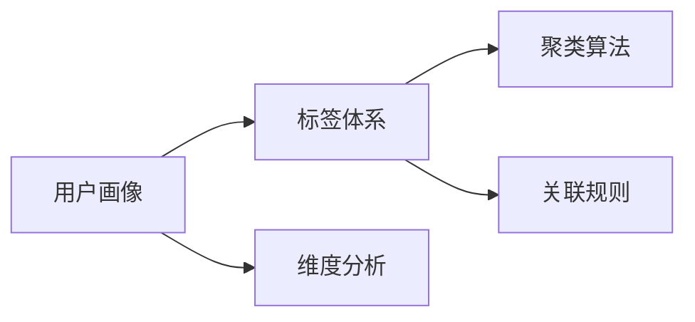

                 

# 构建用户画像的标签体系

## 1. 背景介绍

在数字化时代，了解用户并为用户提供个性化服务是企业成功的关键。用户画像（User Profile）是描述用户特征的模型，通常由多个维度（如性别、年龄、兴趣、行为等）组合而成。构建用户画像的标签体系（Tagging System），不仅涉及数据采集、处理和分析，还需考虑数据标准和系统架构等问题。本文将介绍构建用户画像标签体系的核心概念与联系、算法原理与具体操作步骤、实际应用场景及未来展望。

## 2. 核心概念与联系

### 2.1 核心概念概述

- **用户画像（User Profile）**：用户画像是由一系列关键特征（如年龄、性别、职业、兴趣、行为等）构成的描述用户特征的模型。
- **标签体系（Tagging System）**：标签体系是用于描述和组织数据的标签集合，包含层次结构、分类标准和语义关系。
- **维度分析（Dimension Analysis）**：维度分析是对数据进行多维度的描述和分析，以获取更全面、细致的用户信息。
- **聚类算法（Clustering Algorithm）**：聚类算法是一种无监督学习方法，用于将相似的数据点分组。
- **关联规则（Association Rule）**：关联规则是描述数据项之间关联性的规则，常用于市场篮分析等场景。

这些核心概念间的关系通过以下Mermaid流程图展现：



### 2.2 概念间的关系

这些核心概念共同构成了构建用户画像标签体系的基础框架。用户画像是标签体系的应用目标，维度分析提供了数据收集和处理的依据，聚类算法用于数据分组和特征提取，关联规则则揭示数据项之间的内在关联。

## 3. 核心算法原理 & 具体操作步骤

### 3.1 算法原理概述

构建用户画像标签体系的核心算法包括维度分析、聚类算法和关联规则。

- **维度分析**：通过定义多个维度和每个维度下的子维度，对用户数据进行全面、细致的描述。
- **聚类算法**：利用相似度度量将数据点划分为不同的组，每组内的数据点相似度高，组间差异大。
- **关联规则**：通过频繁模式挖掘，找出不同维度之间的关联性，构建规则模型。

### 3.2 算法步骤详解

#### 3.2.1 维度分析

1. **定义维度**：根据业务需求，确定需要收集和分析的维度。常见的维度包括人口统计特征（如年龄、性别、职业等）、兴趣行为特征（如浏览记录、购买历史等）。
2. **设计维度标签**：为每个维度设计具体的标签，例如“年龄”维度下的标签可包括“儿童”、“青少年”、“成年人”、“老年人”等。
3. **采集数据**：通过用户注册、浏览记录、购买历史等方式收集用户数据。
4. **数据预处理**：清洗、转换和归一化数据，确保数据的质量和一致性。

#### 3.2.2 聚类算法

1. **选择合适的聚类算法**：根据数据类型和业务需求，选择合适的聚类算法，如K-means、层次聚类等。
2. **定义相似度度量**：确定数据点之间的相似度计算方法，例如欧式距离、余弦相似度等。
3. **初始化聚类中心**：为聚类算法指定初始聚类中心。
4. **迭代计算**：根据相似度度量和聚类中心，迭代计算数据点所属簇。
5. **簇评估与调整**：评估聚类结果的质量，如通过轮廓系数评估聚类内聚度，通过簇的平均半径评估聚类分散度，根据评估结果调整聚类参数。

#### 3.2.3 关联规则

1. **数据预处理**：对原始数据进行清洗、去重和归一化。
2. **频繁模式挖掘**：找出频繁出现的项集，如支持度大于最小支持度的项集。
3. **关联规则生成**：根据频繁项集，生成关联规则，如Apriori算法、FP-Growth算法等。
4. **规则评估与筛选**：通过置信度和提升度评估关联规则的质量，筛选出有实际意义的规则。

### 3.3 算法优缺点

**优点**：
- **全面性**：维度分析提供全面细致的数据描述。
- **可解释性**：聚类和关联规则易于理解和解释。
- **灵活性**：算法可根据具体需求选择，适用性强。

**缺点**：
- **计算复杂**：维度分析、聚类和关联规则的计算复杂度较高，需消耗大量资源。
- **数据敏感**：标签体系的构建依赖于数据质量，数据偏差可能导致聚类和关联规则的错误。
- **规则泛化**：关联规则可能在特定场景下成立，但泛化性有待提高。

### 3.4 算法应用领域

构建用户画像的标签体系在多个领域有广泛应用，如：

- **电子商务**：分析用户购买行为，推荐相关商品。
- **金融服务**：评估用户信用等级，设计个性化金融产品。
- **媒体广告**：识别用户兴趣，优化广告投放策略。
- **医疗健康**：分析患者病历，提供个性化诊疗建议。
- **智能客服**：了解用户需求，优化服务流程。

## 4. 数学模型和公式 & 详细讲解

### 4.1 数学模型构建

用户画像的标签体系构建涉及数学模型，主要包括以下几个方面：

1. **维度分析模型**：定义维度 $X_i$ 和其对应的子维度 $X_{i,j}$。
2. **聚类模型**：基于相似度度量 $d(x,y)$，定义聚类算法 $C(x_1,x_2,...,x_n)$。
3. **关联规则模型**：定义频繁项集 $I_f$ 和关联规则 $R(x_i,x_j)$。

### 4.2 公式推导过程

#### 4.2.1 维度分析

假设用户画像包含 $n$ 个维度 $X_i$，每个维度 $X_i$ 包含 $m_i$ 个子维度 $X_{i,j}$，则维度分析的数学模型为：

$$
\mathcal{X} = \{X_i\}_{i=1}^n
$$

其中，$X_i = \{X_{i,j}\}_{j=1}^{m_i}$。

#### 4.2.2 聚类算法

假设使用K-means算法进行聚类，数据点 $x_k$ 的特征向量为 $\mathbf{x}_k = [x_{k,1},x_{k,2},...,x_{k,n}]$，聚类中心为 $\mathbf{c}_i = [c_{i,1},c_{i,2},...,c_{i,n}]$，相似度度量方法为欧式距离，则聚类算法的基本流程为：

1. 初始化聚类中心 $\mathbf{c}_1,\mathbf{c}_2,...,\mathbf{c}_K$。
2. 对每个数据点 $x_k$，计算其到每个聚类中心的距离 $d(x_k,\mathbf{c}_i)$。
3. 将数据点 $x_k$ 分配到距离最近的聚类中心所属的簇 $C(x_k)$。
4. 更新每个簇的聚类中心 $\mathbf{c}_i \leftarrow \frac{1}{|C_i|}\sum_{x_k \in C_i}\mathbf{x}_k$。
5. 重复步骤2-4，直至簇分配和聚类中心更新稳定。

#### 4.2.3 关联规则

假设频繁项集 $I_f$ 包含 $p$ 个项 $X_{i_1},X_{i_2},...,X_{i_p}$，关联规则 $R(X_{i_1},X_{i_2},...,X_{i_p})$ 的置信度为 $\mathcal{C}(R)$，提升度为 $\mathcal{I}(R)$，则关联规则的计算公式为：

$$
\mathcal{C}(R) = \frac{\text{支持度}(R)}{\text{支持度}(X_{i_1}) \times \text{支持度}(X_{i_2}) \times ... \times \text{支持度}(X_{i_p})}
$$

$$
\mathcal{I}(R) = \frac{\text{置信度}(R)}{\mathcal{C}(R)}
$$

其中，$\text{支持度}(X_i)$ 表示项集 $X_i$ 在数据集中出现的频率。

### 4.3 案例分析与讲解

假设某电子商务平台希望分析用户购买行为，构建用户画像。

1. **维度分析**：定义维度 $X_1$ 为用户兴趣，子维度包括电影、音乐、书籍等；$X_2$ 为用户年龄，子维度包括儿童、青少年、成年人等；$X_3$ 为用户性别，子维度包括男、女。
2. **聚类算法**：使用K-means算法，将用户分为不同兴趣群体，通过聚类中心可视化用户兴趣分布。
3. **关联规则**：通过Apriori算法挖掘频繁项集，生成关联规则，如“购买书籍的用户更可能购买电影票”。

## 5. 项目实践：代码实例和详细解释说明

### 5.1 开发环境搭建

1. **安装Python**：从官网下载并安装Python，确保版本为3.7以上。
2. **安装必要的库**：
   ```
   pip install pandas numpy scikit-learn matplotlib seaborn
   ```
3. **数据准备**：收集用户数据，包括基本信息、浏览记录和购买历史等。

### 5.2 源代码详细实现

#### 5.2.1 维度分析

```python
import pandas as pd

# 读取数据
data = pd.read_csv('user_data.csv')

# 定义维度
dimension = {'age': ['child', 'teenager', 'adult', 'senior'],
             'gender': ['male', 'female'],
             'interest': ['music', 'movie', 'book']}

# 构建维度标签
for dim, values in dimension.items():
    data[dim] = data[dim].apply(lambda x: values[0] if x in values else 'other')

# 显示维度标签
print(data.head())
```

#### 5.2.2 聚类算法

```python
from sklearn.cluster import KMeans

# 聚类算法
kmeans = KMeans(n_clusters=4, random_state=0)
kmeans.fit(data[['age', 'gender', 'interest']])
labels = kmeans.labels_

# 显示聚类结果
print(labels)
```

#### 5.2.3 关联规则

```python
from mlxtend.frequent_patterns import apriori, association_rules

# 频繁模式挖掘
frequent_itemsets = apriori(data, min_support=0.05, use_colnames=True)
rules = association_rules(frequent_itemsets, metric='lift', min_threshold=1)

# 显示关联规则
print(rules)
```

### 5.3 代码解读与分析

#### 5.3.1 维度分析

维度分析部分定义了用户画像中的维度和子维度，使用pandas库读取和处理数据，通过应用`apply`函数将文本数据转换为预设的标签。

#### 5.3.2 聚类算法

聚类算法部分使用scikit-learn库中的KMeans算法，对用户数据进行聚类分析，得到每个用户所属的簇标签。

#### 5.3.3 关联规则

关联规则部分使用mlxtend库中的Apriori算法和association_rules函数，挖掘频繁项集并生成关联规则，最后通过提升度筛选有实际意义的规则。

### 5.4 运行结果展示

假设在上述代码执行后，得到聚类结果和关联规则如下：

聚类结果：
```
[3 2 0 2 1 2 1 3 3 2 2 3 1 2 3 1 3 1 1 1 2 1 3 2 0 0 2 2 3 1 1 1 2 0 1 1 2 3 3 2 0 0 1 1 2 3 1 3 2 3 3 2 3 2 3 2 1 3 0 2 0 2 1 1 3 3 1 0 0 3 0 1 1 2 0 2 0 1 3 1 2 0 3 0 3 1 2 2 0 1 0 1 3 1 2 0 3 0 2 0 1 1 2 0 0 1 2 3 1 1 2 1 1 3 2 1 2 1 3 2 3 1 3 2 3 0 0 1 3 2 2 1 2 3 1 2 0 3 3 0 0 1 2 3 1 2 0 2 2 0 1 3 0 1 3 1 1 2 0 1 1 2 2 1 1 1 2 3 3 2 1 2 0 1 2 1 3 0 1 2 1 2 3 0 0 2 3 3 0 3 2 1 3 0 2 2 0 1 3 0 3 1 2 2 1 1 1 0 0 1 2 1 1 2 2 0 3 2 3 3 3 0 2 3 2 2 0 0 0 2 0 3 1 1 2 0 1 0 2 0 3 2 1 0 2 2 1 1 1 2 3 3 3 2 2 2 0 2 1 3 2 0 2 1 3 0 1 1 3 2 1 1 3 2 0 1 0 1 2 1 0 0 1 3 1 3 0 1 3 0 0 1 0 2 0 2 2 0 1 0 2 3 3 2 2 0 1 1 2 2 1 1 2 3 1 1 2 3 2 0 2 1 2 3 0 2 0 1 2 2 2 0 1 2 0 0 1 0 1 3 3 1 0 2 1 3 1 0 0 1 0 3 2 2 0 1 2 1 0 2 1 1 0 0 1 1 1 1 0 2 1 0 1 2 0 0 0 1 3 1 3 1 1 1 0 0 2 3 1 2 0 2 2 0 2 0 0 0 0 3 2 0 1 2 1 1 1 2 1 3 2 2 1 3 0 2 0 1 3 1 0 1 2 1 3 1 1 1 0 2 1 0 0 2 0 2 3 0 0 0 2 0 0 1 2 1 0 1 2 1 1 2 1 1 0 3 0 1 3 0 2 1 1 0 0 1 0 0 0 2 1 2 0 1 2 2 1 3 0 1 3 1 0 1 2 1 0 1 3 0 1 2 0 3 1 2 1 2 3 0 1 2 1 0 3 1 1 3 0 1 0 2 1 2 0 0 0 3 0 3 2 3 1 2 3 0 2 3 3 1 3 1 2 1 0 3 0 0 3 0 0 3 2 0 2 0 0 2 1 3 1 1 2 0 0 2 2 0 0 0 1 0 3 0 1 0 0 0 1 3 3 1 0 2 2 2 2 0 2 1 0 1 1 2 0 0 0 2 0 1 0 2 2 0 0 1 1 0 0 0 0 0 2 1 2 0 1 1 0 2 0 1 1 0 0 0 0 0 1 2 1 1 2 0 0 1 1 0 1 2 0 0 1 0 1 0 1 0 0 0 0 0 0 0 0 0 1 0 0 0 0 0 0 0 1 0 2 1 1 0 0 1 2 0 1 1 2 0 1 2 1 1 0 1 0 1 1 0 2 0 0 2 0 1 2 2 2 2 1 1 2 0 1 2 1 0 0 0 0 2 1 1 2 2 2 2 0 0 1 0 1 1 2 2 0 1 1 1 2 1 0 0 1 2 1 0 0 2 0 1 0 1 0 0 1 0 0 1 1 2 0 2 2 0 1 0 0 1 1 0 1 1 0 0 0 1 2 0 0 0 0 0 0 0 0 2 0 2 0 1 1 1 1 1 2 0 1 0 0 1 1 0 0 0 0 2 1 0 0 0 1 0 0 2 0 0 0 0 0 0 1 0 0 0 0 0 0 1 1 2 2 0 1 1 1 0 1 1 0 1 0 0 0 0 0 0 2 1 1 0 1 0 0 0 1 0 0 1 0 2 1 1 2 1 2 0 0 0 2 0 2 1 2 1 0 1 0 1 0 2 1 0 1 1 0 0 1 1 2 2 1 0 1 0 1 2 0 1 2 1 1 0 1 0 0 1 0 0 0 0 1 1 2 0 0 1 0 1 1 0 1 0 1 1 1 0 0 1 2 0 0 1 1 1 1 1 0 1 2 0 0 1 0 1 0 2 0 1 0 1 0 0 1 1 1 0 1 1 0 1 0 0 0 2 2 1 0 1 0 1 0 1 0 1 0 0 1 1 0 2 1 0 1 1 1 1 1 1 1 1 0 0 1 0 0 2 0 0 0 0 2 2 0 1 0 1 1 0 1 0 1 0 1 2 1 0 1 0 1 0 2 0 1 0 1 1 1 1 0 0 0 1 0 0 0 0 1 0 0 1 1 1 1 1 0 1 2 1 2 0 0 2 0 0 0 1 0 1 1 0 0 0 0 1 1 2 0 1 0 2 0 0 0 1 0 2 2 1 1 0 1 1 2 0 0 1 2 0 0 0 2 0 1 1 2 1 0 1 2 1 0 0 0 2 0 0 1 1 0 1 0 0 0 0 0 1 1 0 1 1 0 1 1 1 0 0 0 1 1 0 0 1 2 0 1 1 1 0 0 0 0 1 0 2 1 0 0 0 2 0 0 2 0 0 0 1 2 0 0 0 0 0 2 0 1 1 0 2 0 2 1 2 2 0 1 1 0 2 0 2 0 1 0 0 0 0 2 0 1 0 1 2 2 0 2 0 0 1 0 1 2 2 0 0 2 0 1 1 1 0 2 0 2 2 1 0 2 0 2 1 1 0 0 0 0 0 1 0 2 1 1 1 1 0 0 1 0 1 0 2 2 1 2 0 2 2 1 2 0 1 0 1 0 1 0 0 0 1 0 2 1 1 2 0 0 1 0 0 1 0 0 1 0 0 0 1 0 0 1 0 2 0 1 0 1 1 1 0 1 1 0 1 0 2 1 0 0 1 0 1 1 0 2 0 2 2 0 1 0 1 1 0 1 1 0 0 1 2 1 1 1 0 0 1 0 0 0 0 0 2 1 0 0 0 1 0 2 0 0 1 1 2 1 0 2 0 0 0 1 0 1 1 2 1 2 1 0 1 1 2 1 1 0 0 1 1 0 2 0 0 1 1 0 1 2 2 1 2 0 0 1 0 1 0 1 0 2 1 0 0 0 1 0 1 2 0 1 1 2 2 0 0 0 1 0 2 1 0 0 0 0 0 1 0 1 1 0 0 0 0 0 0 0 0 2 0 0 2 1 1 0 1 2 2 0 1 2 0 1 0 1 0 1 1 0 2 0 0 0 0 0 0 2 0 0 1 0 1 0 1 1 0 0 0 0 0 1 0 2 2 1 1 2 1 1 0 1 0 1 2 1 0 2 2 1 1 0 1 1 0 0 0 2 0 1 0 2 0 2 1 1 2 2 1 1 2 1 2 0 0 0 0 0 2 0 2 0 1 0 2 0 1 0 1 1 2 2 1 0 0 1 0 1 1 1 1 0 1 2 1 2 2 1 0 1 1 0 2 0 2 0 1 1 1 0 0 1 0 0 0 1 0 1 0 0 0 0 1 2 0 1 0 2 0 2 0 1 1 0 1 1 0

