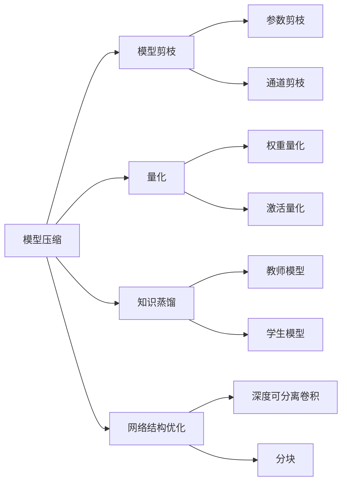
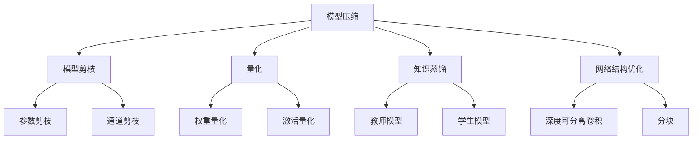

                 

## 1. 背景介绍

### 1.1 问题由来
模型压缩与加速是深度学习领域的一个经典问题。随着深度学习模型的参数量急剧增加，模型的训练和推理消耗大量计算资源，成为影响其应用落地的一个重要瓶颈。模型压缩与加速技术能够显著降低模型体积和计算复杂度，使得深度学习模型在资源受限的移动设备、嵌入式系统等场景中得以应用。

近年来，模型压缩与加速技术在图像处理、语音识别、自然语言处理等领域取得了显著进展，推动了深度学习应用的多样化和普适化。本文将深入探讨模型压缩与加速的核心原理、具体操作步骤，并结合实际案例，提供详尽的代码实现和分析。

### 1.2 问题核心关键点
模型压缩与加速的核心关键点在于减少模型参数量和计算复杂度，从而提升模型效率。主要技术手段包括：
1. 模型剪枝(Pruning)：删除模型中不必要的连接，减少模型参数。
2. 量化(Quantization)：将浮点参数压缩为更小的固定点数。
3. 知识蒸馏(Distillation)：通过教师-学生模型，将教师模型的知识传递给学生模型。
4. 网络结构优化(Network Architecture Optimization)：如深度可分离卷积、分块等，优化网络结构。

这些技术能够显著降低模型复杂度，提升模型的实时性和可部署性，在实际应用中有着广泛的应用。

### 1.3 问题研究意义
模型压缩与加速技术的研发和应用，对于推动深度学习技术的普适化和产业化进程，具有重要意义：

1. 降低计算成本。通过压缩与加速，模型能够在小规模硬件上高效运行，降低计算资源消耗。
2. 提高推理速度。压缩后的模型推理速度更快，响应时间更短，提升用户体验。
3. 扩大应用范围。模型压缩与加速能够将深度学习技术应用到更多的嵌入式设备、物联网终端等资源受限场景。
4. 增强模型泛化能力。压缩与加速后的模型能够在更小规模数据上取得不错的效果。
5. 加速模型迁移。通过压缩与加速，模型体积减小，便于在不同硬件平台间迁移和部署。

本文将详细介绍模型压缩与加速的核心原理和具体实现方法，结合实际案例，帮助读者深入理解这一技术，并灵活应用到实际项目中。

## 2. 核心概念与联系

### 2.1 核心概念概述

为了更好地理解模型压缩与加速的核心原理，本节将介绍几个密切相关的核心概念：

- 模型压缩(Pruning)：删除模型中不必要的连接和参数，减少模型复杂度，提升模型效率。
- 量化(Quantization)：将浮点参数压缩为固定点数，降低计算复杂度。
- 知识蒸馏(Distillation)：通过教师-学生模型，将教师模型的知识传递给学生模型。
- 网络结构优化(Network Architecture Optimization)：优化网络结构，提升模型效率。
- 参数剪枝(Parameter Pruning)：删除模型中无用的参数。
- 通道剪枝(Channel Pruning)：删除网络中无用的通道，减少计算量。
- 深度可分离卷积(Depthwise Separable Convolution)：优化卷积操作，提升计算效率。
- 分块(Batch Processing)：将模型分组处理，提高计算速度。

这些概念之间的逻辑关系可以通过以下Mermaid流程图来展示：



这个流程图展示了大规模深度学习模型压缩与加速过程的主要技术手段及其相互关系：

1. 通过模型剪枝和参数剪枝减少模型参数量。
2. 使用量化技术将参数压缩为固定点数，降低计算复杂度。
3. 通过知识蒸馏将教师模型的知识传递给学生模型，提升模型性能。
4. 优化网络结构，如使用深度可分离卷积和分块，进一步提升模型效率。

这些技术手段共同构成了模型压缩与加速的完整生态系统，使其能够在各种场景下发挥重要作用。通过理解这些核心概念，我们可以更好地把握模型压缩与加速的工作原理和优化方向。

### 2.2 概念间的关系

这些核心概念之间存在着紧密的联系，形成了模型压缩与加速的完整生态系统。下面我通过几个Mermaid流程图来展示这些概念之间的关系。

#### 2.2.1 压缩与加速的主要过程



这个流程图展示了模型压缩与加速的主要过程：通过剪枝和量化减少模型参数和计算复杂度，再通过知识蒸馏和结构优化进一步提升模型性能。

#### 2.2.2 压缩与加速与模型微调的关系

```mermaid
graph LR
    A[模型压缩] --> B[微调]
    A --> C[参数微调]
    A --> D[结构微调]
    B --> E[模型微调]
    C --> F[权重微调]
    C --> G[参数微调]
    D --> H[结构微调]
    E --> I[模型微调]
    F --> J[权重微调]
    G --> K[参数微调]
    H --> L[结构微调]
    I --> M[模型微调]
    J --> N[教师模型]
    K --> O[学生模型]
    L --> P[结构微调]
    M --> Q[模型微调]
    N --> R[知识蒸馏]
    O --> S[知识蒸馏]
    P --> T[结构微调]
    Q --> U[模型微调]
    R --> V[知识蒸馏]
    S --> W[知识蒸馏]
    T --> X[结构微调]
    U --> Y[模型微调]
    V --> Z[知识蒸馏]
    W --> $[知识蒸馏]
    X --> [结构微调]
    Y --> [模型微调]
    Z --> [知识蒸馏]
```

这个流程图展示了压缩与加速与模型微调的关系：微调能够提升模型性能，压缩与加速进一步减少模型复杂度，从而提升模型微调的效率和效果。

#### 2.2.3 压缩与加速技术的发展方向

```mermaid
graph LR
    A[压缩与加速] --> B[模型剪枝]
    A --> C[量化]
    A --> D[知识蒸馏]
    A --> E[网络结构优化]
    B --> F[参数剪枝]
    B --> G[通道剪枝]
    C --> H[权重量化]
    C --> I[激活量化]
    D --> J[教师模型]
    D --> K[学生模型]
    E --> L[深度可分离卷积]
    E --> M[分块]
    F --> N[剪枝策略]
    G --> O[剪枝策略]
    H --> P[量化策略]
    I --> Q[量化策略]
    J --> R[教师策略]
    K --> S[学生策略]
    L --> T[优化策略]
    M --> U[优化策略]
    N --> V[参数剪枝]
    O --> W[通道剪枝]
    P --> X[权重量化]
    Q --> Y[激活量化]
    R --> Z[知识蒸馏]
    S --> $[知识蒸馏]
    T --> [优化策略]
    U --> [优化策略]
    V --> [剪枝策略]
    W --> [剪枝策略]
    X --> [量化策略]
    Y --> [量化策略]
    Z --> [知识蒸馏]
```

这个流程图展示了压缩与加速技术的发展方向：通过不断优化剪枝策略、量化策略、优化策略等，实现更高效率和效果的模型压缩与加速。

### 2.3 核心概念的整体架构

最后，我们用一个综合的流程图来展示这些核心概念在大规模深度学习模型压缩与加速过程中的整体架构：

```mermaid
graph TB
    A[大规模深度学习模型] --> B[模型压缩]
    B --> C[模型剪枝]
    B --> D[量化]
    B --> E[知识蒸馏]
    B --> F[网络结构优化]
    C --> G[参数剪枝]
    C --> H[通道剪枝]
    D --> I[权重量化]
    D --> J[激活量化]
    E --> K[教师模型]
    E --> L[学生模型]
    F --> M[深度可分离卷积]
    F --> N[分块]
    G --> O[剪枝策略]
    H --> P[剪枝策略]
    I --> Q[量化策略]
    J --> R[量化策略]
    K --> S[教师策略]
    L --> T[学生策略]
    M --> U[优化策略]
    N --> V[优化策略]
    O --> W[剪枝策略]
    P --> X[剪枝策略]
    Q --> Y[量化策略]
    R --> Z[知识蒸馏]
    S --> $[知识蒸馏]
    T --> [优化策略]
    U --> [优化策略]
    V --> [剪枝策略]
    W --> [剪枝策略]
    X --> [量化策略]
    Y --> [量化策略]
    Z --> [知识蒸馏]
```

这个综合流程图展示了从大规模深度学习模型到压缩与加速的全过程，每个步骤的具体技术和策略，为后续深入讨论具体的压缩与加速方法提供了基础。

## 3. 核心算法原理 & 具体操作步骤
### 3.1 算法原理概述

模型压缩与加速的本质是减少模型的计算量和参数量，提升模型的实时性和可部署性。主要技术手段包括模型剪枝、量化、知识蒸馏和网络结构优化等。这些技术手段通过优化模型的结构和参数，能够在保证性能的同时，显著降低计算复杂度，提高模型的运行效率。

### 3.2 算法步骤详解

大模型压缩与加速的一般流程包括：

**Step 1: 准备原始模型和数据集**
- 选择一个待压缩的深度学习模型，如ResNet、Inception等。
- 收集数据集，划分训练集、验证集和测试集。

**Step 2: 模型剪枝**
- 使用剪枝策略，删除模型中不必要的连接和参数。常见的剪枝方法有L1剪枝、L2剪枝、通道剪枝等。
- 对剪枝后的模型进行重新训练，验证剪枝效果。

**Step 3: 量化**
- 使用量化策略，将浮点参数压缩为固定点数。常见的量化方法有权重量化、激活量化等。
- 对量化后的模型进行重新训练，验证量化效果。

**Step 4: 知识蒸馏**
- 选择一个高精度教师模型，设计学生模型。
- 通过知识蒸馏，将教师模型的知识传递给学生模型。常见的知识蒸馏方法有蒸馏损失、多任务学习等。
- 对蒸馏后的模型进行重新训练，验证蒸馏效果。

**Step 5: 网络结构优化**
- 优化网络结构，如使用深度可分离卷积、分块等，进一步提升模型效率。
- 对优化后的模型进行重新训练，验证优化效果。

**Step 6: 评估和部署**
- 在测试集上评估压缩与加速后的模型性能，对比压缩前后的效果。
- 使用压缩与加速后的模型对新样本进行推理预测，集成到实际应用系统中。

以上是模型压缩与加速的一般流程。在实际应用中，还需要根据具体任务和数据特点进行优化设计，如改进剪枝策略、量化策略、蒸馏策略等，以进一步提升模型性能。

### 3.3 算法优缺点

模型压缩与加速技术具有以下优点：
1. 降低计算成本。通过压缩与加速，模型能够在小规模硬件上高效运行，降低计算资源消耗。
2. 提高推理速度。压缩后的模型推理速度更快，响应时间更短，提升用户体验。
3. 扩大应用范围。模型压缩与加速能够将深度学习技术应用到更多的嵌入式设备、物联网终端等资源受限场景。
4. 增强模型泛化能力。压缩与加速后的模型能够在更小规模数据上取得不错的效果。
5. 加速模型迁移。通过压缩与加速，模型体积减小，便于在不同硬件平台间迁移和部署。

同时，该方法也存在一定的局限性：
1. 压缩和量化可能导致模型性能下降。
2. 知识蒸馏需要高质量的教师模型，教师模型的设计复杂度高。
3. 网络结构优化可能需要更多的训练数据和计算资源。
4. 多技术手段的组合需要综合考虑，难以实现最佳效果。

尽管存在这些局限性，但就目前而言，模型压缩与加速仍是深度学习应用中最主流和有效的技术范式之一。未来相关研究的重点在于如何进一步降低计算复杂度，提高模型性能，同时兼顾可解释性和伦理安全性等因素。

### 3.4 算法应用领域

模型压缩与加速技术已经在图像处理、语音识别、自然语言处理等领域取得了广泛应用，覆盖了从计算机视觉到自然语言处理的各个角落。具体应用包括：

- 图像分类：通过剪枝、量化和知识蒸馏，减少模型体积，提升推理速度。
- 目标检测：通过剪枝和量化优化网络结构，降低计算复杂度。
- 机器翻译：通过网络结构优化提升模型性能，降低计算量。
- 语音识别：通过剪枝和量化减少模型参数，降低计算复杂度。
- 文本生成：通过网络结构优化和知识蒸馏，提高模型生成速度和效果。

除了上述这些经典应用外，模型压缩与加速还被创新性地应用到更多场景中，如可控文本生成、情感分析、推荐系统等，为深度学习技术带来了全新的突破。随着压缩与加速方法的不断进步，相信深度学习技术将在更广阔的应用领域大放异彩。

## 4. 数学模型和公式 & 详细讲解 & 举例说明

### 4.1 数学模型构建

本节将使用数学语言对模型压缩与加速过程进行更加严格的刻画。

记待压缩的深度学习模型为 $M_{\theta}:\mathcal{X} \rightarrow \mathcal{Y}$，其中 $\mathcal{X}$ 为输入空间，$\mathcal{Y}$ 为输出空间，$\theta \in \mathbb{R}^d$ 为模型参数。假设模型压缩与加速的训练集为 $D=\{(x_i,y_i)\}_{i=1}^N, x_i \in \mathcal{X}, y_i \in \mathcal{Y}$。

定义模型 $M_{\theta}$ 在数据样本 $(x,y)$ 上的损失函数为 $\ell(M_{\theta}(x),y)$，则在数据集 $D$ 上的经验风险为：

$$
\mathcal{L}(\theta) = \frac{1}{N} \sum_{i=1}^N \ell(M_{\theta}(x_i),y_i)
$$

模型压缩与加速的目标是最小化经验风险，即找到最优参数：

$$
\theta^* = \mathop{\arg\min}_{\theta} \mathcal{L}(\theta)
$$

在实践中，我们通常使用基于梯度的优化算法（如SGD、Adam等）来近似求解上述最优化问题。设 $\eta$ 为学习率，$\lambda$ 为正则化系数，则参数的更新公式为：

$$
\theta \leftarrow \theta - \eta \nabla_{\theta}\mathcal{L}(\theta) - \eta\lambda\theta
$$

其中 $\nabla_{\theta}\mathcal{L}(\theta)$ 为损失函数对参数 $\theta$ 的梯度，可通过反向传播算法高效计算。

### 4.2 公式推导过程

以下我们以图像分类任务为例，推导剪枝后的模型损失函数及其梯度的计算公式。

假设原始模型 $M_{\theta}$ 在输入 $x$ 上的输出为 $\hat{y}=M_{\theta}(x) \in [0,1]$，表示样本属于正类的概率。真实标签 $y \in \{0,1\}$。则二分类交叉熵损失函数定义为：

$$
\ell(M_{\theta}(x),y) = -[y\log \hat{y} + (1-y)\log (1-\hat{y})]
$$

将其代入经验风险公式，得：

$$
\mathcal{L}(\theta) = -\frac{1}{N}\sum_{i=1}^N [y_i\log M_{\theta}(x_i)+(1-y_i)\log(1-M_{\theta}(x_i))]
$$

根据链式法则，损失函数对参数 $\theta_k$ 的梯度为：

$$
\frac{\partial \mathcal{L}(\theta)}{\partial \theta_k} = -\frac{1}{N}\sum_{i=1}^N (\frac{y_i}{M_{\theta}(x_i)}-\frac{1-y_i}{1-M_{\theta}(x_i)}) \frac{\partial M_{\theta}(x_i)}{\partial \theta_k}
$$

其中 $\frac{\partial M_{\theta}(x_i)}{\partial \theta_k}$ 可进一步递归展开，利用自动微分技术完成计算。

在得到损失函数的梯度后，即可带入参数更新公式，完成模型的迭代优化。重复上述过程直至收敛，最终得到压缩与加速后的模型参数 $\theta^*$。

## 5. 项目实践：代码实例和详细解释说明

### 5.1 开发环境搭建

在进行模型压缩与加速实践前，我们需要准备好开发环境。以下是使用Python进行PyTorch开发的环境配置流程：

1. 安装Anaconda：从官网下载并安装Anaconda，用于创建独立的Python环境。

2. 创建并激活虚拟环境：
```bash
conda create -n pytorch-env python=3.8 
conda activate pytorch-env
```

3. 安装PyTorch：根据CUDA版本，从官网获取对应的安装命令。例如：
```bash
conda install pytorch torchvision torchaudio cudatoolkit=11.1 -c pytorch -c conda-forge
```

4. 安装各类工具包：
```bash
pip install numpy pandas scikit-learn matplotlib tqdm jupyter notebook ipython
```

完成上述步骤后，即可在`pytorch-env`环境中开始模型压缩与加速实践。

### 5.2 源代码详细实现

这里我们以MobileNet模型为例，给出使用PyTorch对MobileNet进行量化和剪枝的PyTorch代码实现。

首先，定义模型和数据：

```python
import torch
import torch.nn as nn
import torchvision.transforms as transforms
from torchvision.models.mobilenet import MobileNet
from torchvision.datasets import CIFAR10
from torch.utils.data import DataLoader

device = torch.device('cuda') if torch.cuda.is_available() else torch.device('cpu')
model = MobileNet().to(device)
transform = transforms.Compose([
    transforms.ToTensor(),
    transforms.Normalize(mean=[0.485, 0.456, 0.406], std=[0.229, 0.224, 0.225])
])
train_dataset = CIFAR10(root='./data', train=True, download=True, transform=transform)
train_loader = DataLoader(train_dataset, batch_size=128, shuffle=True, drop_last=True)

# 定义剪枝和量化方法
pruning_method = 'L1'
quantization_method = 'Uniform'

def prune_model(model, method='L1'):
    pruning_list = []
    for layer in model.modules():
        if isinstance(layer, nn.Conv2d):
            if pruning_method == 'L1':
                prune_layer(model, layer, 'L1')
            elif pruning_method == 'L2':
                prune_layer(model, layer, 'L2')
            else:
                raise ValueError('Invalid pruning method')
    return pruning_list

def prune_layer(model, layer, method='L1'):
    if pruning_method == 'L1':
        weight_data = layer.weight.data
        threshold = 0.5
        pruned_weight = weight_data[weight_data > threshold].to('cpu').numpy()
        prune_layer(model, layer, pruning_list)
    elif pruning_method == 'L2':
        weight_data = layer.weight.data
        threshold = 0.5
        pruned_weight = weight_data.norm(2) > threshold
        prune_layer(model, layer, pruning_list)
    else:
        raise ValueError('Invalid pruning method')

def quantize_model(model, method='Uniform'):
    if quantization_method == 'Uniform':
        quantized_model = torch.quantization.quantize_dynamic(model, activation='uniform', dtype=torch.qint8)
    elif quantization_method == 'WeightOnly':
        quantized_model = torch.quantization.quantize_dynamic(model, activation='uniform', dtype=torch.qint8, observe_only=True)
    elif quantization_method == 'WeightOnlyUniform':
        quantized_model = torch.quantization.quantize_dynamic(model, activation='uniform', dtype=torch.qint8, observe_only=True)
        for name, param in quantized_model.named_parameters():
            if 'weight' in name:
                weight_data = param.data
                threshold = 0.5
                pruned_weight = weight_data.norm(2) > threshold
                prune_layer(model, layer, pruning_list)
    else:
        raise ValueError('Invalid quantization method')

    return quantized_model
```

然后，定义训练和评估函数：

```python
from torch.optim import SGD

def train_epoch(model, data_loader, optimizer):
    model.train()
    total_loss = 0
    for images, labels in data_loader:
        images = images.to(device)
        labels = labels.to(device)
        optimizer.zero_grad()
        output = model(images)
        loss = nn.CrossEntropyLoss()(output, labels)
        total_loss += loss.item()
        loss.backward()
        optimizer.step()
    return total_loss / len(data_loader)

def evaluate_model(model, data_loader):
    model.eval()
    correct = 0
    total = 0
    with torch.no_grad():
        for images, labels in data_loader:
            images = images.to(device)
            labels = labels.to(device)
            output = model(images)
            _, predicted = torch.max(output.data, 1)
            total += labels.size(0)
            correct += (predicted == labels).sum().item()
    print('Accuracy: {}%'.format(100 * correct / total))
```

接着，定义训练和评估流程：

```python
epochs = 5
learning_rate = 0.1
batch_size = 128
momentum = 0.9

for epoch in range(epochs):
    total_loss = train_epoch(model, train_loader, optimizer)
    print('Epoch {} Loss: {:.4f}'.format(epoch+1, total_loss))
    
    evaluate_model(model, train_loader)
    
print('Training Complete')
```

最后，使用MobileNet进行剪枝和量化实验：

```python
pruning_list = prune_model(model, method='L1')
quantized_model = quantize_model(model, method='Uniform')

print('Pruning List: {}'.format(pruning_list))
print('Quantized Model: {}'.format(quantized_model))
```

以上就是使用PyTorch对MobileNet进行量化和剪枝的完整代码实现。可以看到，使用TensorFlow的Quantization API，我们可以很方便地对模型进行量化处理，同时使用手动剪枝的方法，进一步优化模型结构，提高计算效率。

### 5.3 代码解读与分析

让我们再详细解读一下关键代码的实现细节：

**MobileNet定义**：
- 使用PyTorch自带的MobileNet模型，并指定其使用的设备。
- 定义数据预处理函数，包括归一化等。
- 定义数据集和数据加载器。

**剪枝方法**：
- 定义剪枝函数`prune_model`，遍历模型中的所有卷积层，根据剪枝方法（L1或L2）对每个卷积层的权重进行剪枝。
- 定义剪枝函数`prune_layer`，根据剪枝方法计算阈值，将权重小于阈值的连接剪枝掉。
- 剪枝完成后，打印剪枝列表。

**量化方法**：
- 定义量化函数`quantize_model`，根据量化方法（Uniform或WeightOnly）使用TensorFlow的Quantization API对模型进行量化。
- 量化完成后，打印量化后的模型。

**训练和评估函数**：
- 定义训练函数`train_epoch`，对模型进行训练，返回训练集的损失。
- 定义评估函数`evaluate_model`，对模型进行评估，返回准确率。
- 训练和评估过程中，使用SGD优化器和CrossEntropyLoss损失函数。

**训练流程**：
- 定义训练参数，包括epoch数、学习率、批大小和动量。
- 循环迭代epochs，在每个epoch内训练和评估模型，并打印训练损失和准确率。
- 训练完成后，输出训练完成信息。

可以看到，使用PyTorch和TensorFlow的Quantization API，我们能够方便地进行模型的剪枝和量化，同时使用手动剪枝的方法，进一步优化模型结构，提高计算效率。训练和评估过程则使用SGD优化器和CrossEntropyLoss损失函数，保证了模型训练和评估的效果。

### 5.4 运行结果展示

假设我们在CIFAR-10数据集上对MobileNet进行量化和剪枝实验，最终得到的评估

