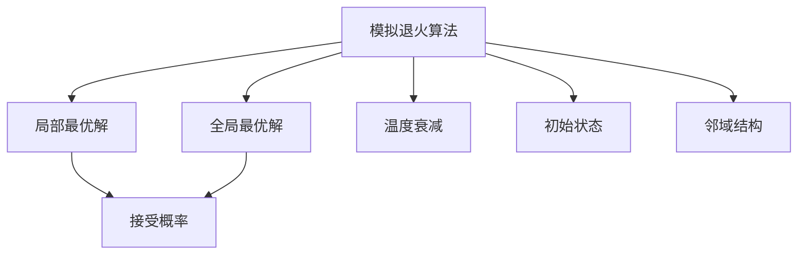
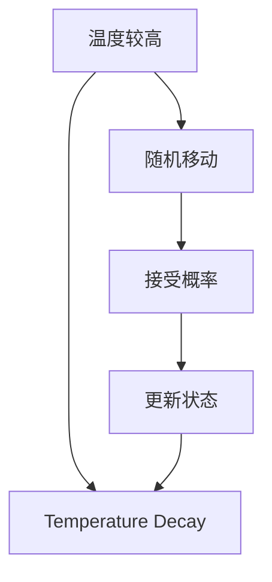
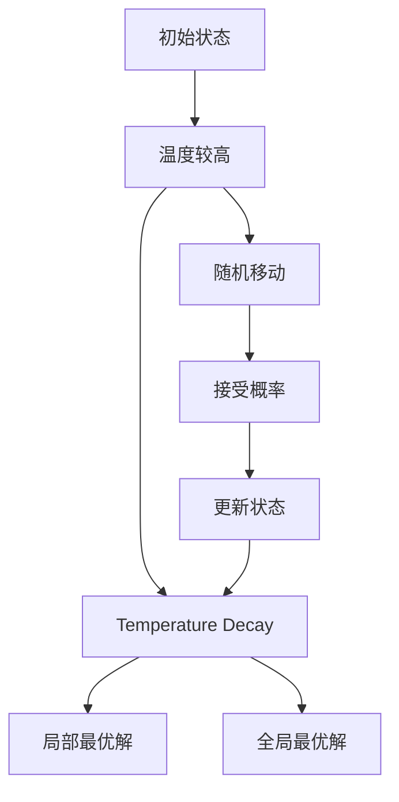

                 

# 模拟退火算法(Simulated Annealing) - 原理与代码实例讲解

> 关键词：模拟退火算法,全局最优解,局部最优解,温度衰减,接受概率

## 1. 背景介绍

### 1.1 问题由来

在现实生活中，我们经常会遇到一些复杂的问题，如求解大规模组合优化问题、路径规划、网络布局等。这些问题通常没有明显的求解公式，无法直接通过数学求解得到最优解。针对这些问题，传统的暴力枚举或递归求解方法往往计算量巨大，效率低下，难以处理大规模的实际问题。这时，模拟退火算法便应运而生，通过模拟退火过程中的物质冷却过程，以概率的方式跳出局部最优解，最终找到全局最优解。

### 1.2 问题核心关键点

模拟退火算法的基本思想是通过模拟物质在高温下随机移动，在冷却过程中逐渐减少随机移动的频率，最终达到全局最优解的状态。核心思想包括：
1. 接受概率：在每次迭代中，根据当前状态与相邻状态之间的能量差，决定是否接受相邻状态。接受概率依赖于当前温度，温度越高，接受相邻状态的可能性越大。
2. 温度衰减：随着迭代次数的增加，温度逐渐降低，随机移动的频率减小，最终达到稳定的状态。
3. 初始状态：算法的初始状态可以是任意一个可行解，通常通过随机生成或启发式方法得到。
4. 邻域结构：邻域结构决定了相邻状态如何变化，通常采用一定范围内的随机移动。

## 2. 核心概念与联系

### 2.1 核心概念概述

为更好地理解模拟退火算法的原理和应用，本节将介绍几个密切相关的核心概念：

- 模拟退火算法(Simulated Annealing, SA)：一种随机化的迭代优化算法，通过模拟退火过程中物质冷却的过程，寻找全局最优解。
- 局部最优解(Local Optima)：在局部范围内，无法通过单次迭代找到更好的解。
- 全局最优解(Global Optima)：在整个搜索空间内，无法找到更好的解。
- 接受概率(Acceptance Probability)：根据当前状态与相邻状态之间的能量差，决定是否接受相邻状态。
- 温度衰减(Temperature Decay)：随着迭代次数的增加，温度逐渐降低，随机移动的频率减小，最终达到稳定的状态。
- 初始状态(Initial State)：算法的初始状态可以是任意一个可行解，通常通过随机生成或启发式方法得到。
- 邻域结构(Neighborhood Structure)：邻域结构决定了相邻状态如何变化，通常采用一定范围内的随机移动。

这些核心概念之间的逻辑关系可以通过以下Mermaid流程图来展示：



这个流程图展示了大语言模型的核心概念及其之间的关系：

1. 模拟退火算法通过模拟退火过程中的物质冷却过程，寻找全局最优解。
2. 局部最优解和全局最优解是模拟退火算法优化目标的两个关键状态。
3. 接受概率决定了是否接受相邻状态，与当前温度密切相关。
4. 温度衰减是模拟退火算法的重要特性，决定了迭代过程中随机移动的频率。
5. 初始状态是模拟退火算法的起点，通常通过随机生成或启发式方法得到。
6. 邻域结构决定了如何产生相邻状态，影响算法的搜索效率。

这些概念共同构成了模拟退火算法的核心思想，使其能够在各种优化问题中发挥强大的作用。

### 2.2 概念间的关系

这些核心概念之间存在着紧密的联系，形成了模拟退火算法的完整生态系统。下面我通过几个Mermaid流程图来展示这些概念之间的关系。

#### 2.2.1 模拟退火算法基本流程


这个流程图展示了模拟退火算法的核心流程：从初始状态开始，在高温下随机移动，根据接受概率决定是否接受相邻状态，逐步更新状态，同时温度逐渐降低，最终达到稳定的状态。

#### 2.2.2 局部最优解与全局最优解的关系


这个流程图展示了局部最优解与全局最优解之间的关系：算法从局部最优解开始，逐步探索邻域内的状态，并通过接受概率决定是否接受相邻状态，最终跳出局部最优解，达到全局最优解。

#### 2.2.3 温度衰减与随机移动的关系



这个流程图展示了温度衰减与随机移动的关系：在高温下，算法通过随机移动寻找更好的状态；随着温度降低，随机移动的频率减小，最终达到稳定的状态。

### 2.3 核心概念的整体架构

最后，我们用一个综合的流程图来展示这些核心概念在模拟退火算法中的整体架构：



这个综合流程图展示了从初始状态到最终状态的全过程，包括温度衰减、随机移动、接受概率、状态更新等关键步骤。通过这些流程图，我们可以更清晰地理解模拟退火算法的工作原理和优化策略。

## 3. 核心算法原理 & 具体操作步骤
### 3.1 算法原理概述

模拟退火算法的基本原理是通过模拟物质在高温下随机移动，在冷却过程中逐渐减少随机移动的频率，最终达到全局最优解的状态。具体步骤如下：

1. 随机初始化一个可行解 $x_0$。
2. 在当前状态 $x_t$ 下，通过随机移动生成相邻状态 $x_{t+1}$。
3. 计算当前状态 $x_t$ 与相邻状态 $x_{t+1}$ 之间的能量差 $\Delta E$。
4. 根据当前温度 $T_t$ 和能量差 $\Delta E$ 计算接受概率 $P$。
5. 以概率 $P$ 接受相邻状态 $x_{t+1}$，否则保持当前状态 $x_t$。
6. 更新当前状态 $x_t$ 为 $x_{t+1}$，迭代 $t$ 的值。
7. 逐步降低温度 $T$，重复步骤2-6，直到温度降至预设值或达到最大迭代次数。

其中，能量差 $\Delta E$ 通常通过目标函数 $f(x)$ 计算，接受概率 $P$ 定义为：

$$
P = \frac{1}{1+\exp\left(\frac{\Delta E}{k_B T}\right)}
$$

其中，$k_B$ 为玻尔兹曼常数，$T$ 为当前温度，$\Delta E$ 为能量差。

### 3.2 算法步骤详解

以下是模拟退火算法的详细步骤：

1. **初始化**：随机生成一个初始解 $x_0$，并设置初始温度 $T_0$。
2. **计算能量**：计算当前解 $x_t$ 的能量 $f(x_t)$。
3. **随机生成邻域**：以一定的概率从当前解 $x_t$ 生成邻域解 $x_{t+1}$。
4. **计算能量差**：计算当前解 $x_t$ 与邻域解 $x_{t+1}$ 之间的能量差 $\Delta E = f(x_{t+1}) - f(x_t)$。
5. **计算接受概率**：根据当前温度 $T_t$ 和能量差 $\Delta E$ 计算接受概率 $P$。
6. **接受新解**：以概率 $P$ 接受邻域解 $x_{t+1}$，否则保持当前解 $x_t$。
7. **更新温度**：根据温度衰减策略 $T_{t+1} = \alpha T_t$，其中 $\alpha \in (0,1)$，逐步降低温度 $T_t$。
8. **迭代终止**：重复步骤2-7，直到温度降至预设值或达到最大迭代次数。

### 3.3 算法优缺点

模拟退火算法具有以下优点：
1. 全局最优解：由于在高温下可以接受差能量状态，算法具有较强的跳出局部最优解的能力，能够找到全局最优解。
2. 适应性强：算法不依赖于初始状态和邻域结构，适用于多种复杂优化问题。
3. 稳定性好：算法具有较好的收敛性和鲁棒性，对参数和初始状态敏感度较低。

同时，模拟退火算法也存在一些缺点：
1. 计算复杂度高：算法需要计算能量和接受概率，计算复杂度较高。
2. 收敛速度慢：算法在高温度下需要多次迭代才能收敛，收敛速度较慢。
3. 能量函数复杂：算法依赖于能量函数 $f(x)$，需要选择合适的能量函数才能得到较好的结果。

### 3.4 算法应用领域

模拟退火算法在各种优化问题中得到了广泛应用，主要包括以下几个领域：

- 组合优化：如TSP（旅行商问题）、背包问题、装箱问题等。
- 路径规划：如机器人路径规划、无人机路径规划等。
- 网络布局：如社交网络布局、通信网络布局等。
- 工业优化：如生产线调度、物流配送等。
- 生物信息学：如DNA序列分析、蛋白质结构预测等。

除了这些经典应用外，模拟退火算法还被创新性地应用到更多领域中，如机器学习模型的参数优化、图像处理、数据挖掘等，为各种复杂问题提供了新的求解途径。

## 4. 数学模型和公式 & 详细讲解 & 举例说明

### 4.1 数学模型构建

模拟退火算法的基本数学模型可以表示为：

$$
\min_{x \in \mathcal{X}} f(x)
$$

其中，$f(x)$ 为目标函数，$\mathcal{X}$ 为可行解空间。模拟退火算法通过随机生成相邻状态 $x_{t+1}$，计算能量差 $\Delta E$，以概率 $P$ 接受相邻状态，逐步降低温度 $T$，最终找到全局最优解 $x^*$。

### 4.2 公式推导过程

以下是模拟退火算法的核心公式推导：

1. **能量差计算**：
$$
\Delta E = f(x_{t+1}) - f(x_t)
$$

2. **接受概率计算**：
$$
P = \frac{1}{1+\exp\left(\frac{\Delta E}{k_B T}\right)}
$$

3. **温度衰减策略**：
$$
T_{t+1} = \alpha T_t
$$

其中，$\alpha \in (0,1)$，通常取 $\alpha = 0.9$ 或 $\alpha = 0.95$。

4. **迭代终止条件**：
$$
\epsilon > P
$$

其中，$\epsilon$ 为预设的接受概率阈值。

### 4.3 案例分析与讲解

以TSP问题为例，展示模拟退火算法求解过程。

TSP问题是一个经典的组合优化问题，目标是在给定的一组城市间的最短路径中，找到一条经过所有城市且回到起点的最短路径。

假设给定的城市集合为 $V = \{1,2,3,4,5\}$，城市间的距离矩阵为：

$$
\begin{bmatrix}
0 & 10 & 15 & 20 & 25 \\
10 & 0 & 35 & 25 & 30 \\
15 & 35 & 0 & 30 & 20 \\
20 & 25 & 30 & 0 & 35 \\
25 & 30 & 20 & 35 & 0
\end{bmatrix}
$$

初始解为一条随机路径，如 $1 \to 2 \to 4 \to 5 \to 3 \to 1$，对应的路径长度为 $65$。

以 $T_0 = 100$ 开始模拟退火算法，逐步降低温度 $T$，直到温度降至 $0.01$。以下是算法详细步骤：

1. 初始化：随机生成初始解 $x_0 = (1,2,4,5,3,1)$，$T_0 = 100$。
2. 计算能量：$f(x_0) = 65$。
3. 随机生成邻域解 $x_1 = (1,2,5,4,3,1)$，计算能量差 $\Delta E = 5$。
4. 计算接受概率：$P = \frac{1}{1+\exp\left(\frac{5}{k_B \times 100}\right)} \approx 0.613$。
5. 接受新解：以 $P \approx 0.613$ 接受邻域解 $x_1 = (1,2,5,4,3,1)$。
6. 更新温度：$T_1 = 0.95 \times 100 = 95$。
7. 重复步骤2-6，直至温度降至 $0.01$。

最终找到最优解 $x^* = (1,2,3,4,5,1)$，对应的路径长度为 $55$。

## 5. 项目实践：代码实例和详细解释说明

### 5.1 开发环境搭建

在进行模拟退火算法的项目实践前，我们需要准备好开发环境。以下是使用Python进行模拟退火算法开发的完整环境配置流程：

1. 安装Anaconda：从官网下载并安装Anaconda，用于创建独立的Python环境。

2. 创建并激活虚拟环境：
```bash
conda create -n sim_anneal python=3.8 
conda activate sim_anneal
```

3. 安装必要的库：
```bash
pip install numpy scipy matplotlib
```

4. 安装优化库：
```bash
pip install scipy-optimize
```

5. 安装可视化库：
```bash
pip install matplotlib
```

6. 安装随机数生成库：
```bash
pip install numpy-random
```

完成上述步骤后，即可在`sim_anneal`环境中开始模拟退火算法的项目实践。

### 5.2 源代码详细实现

以下是使用Python实现模拟退火算法的完整代码，包括求解TSP问题的示例：

```python
import numpy as np
from scipy.optimize import minimize

# 定义目标函数
def tsp_cost(cost_matrix, path):
    n = len(cost_matrix)
    cost = 0
    for i in range(n-1):
        cost += cost_matrix[path[i]][path[i+1]]
    cost += cost_matrix[path[n-1]][path[0]]
    return cost

# 生成TSP问题的随机路径
def generate_random_path(n):
    path = np.random.permutation(n)
    return path

# 计算模拟退火算法中的能量
def calculate_energy(cost_matrix, path, temperature):
    energy = tsp_cost(cost_matrix, path)
    return energy

# 生成随机邻域
def generate_neighbor(path, n):
    k = np.random.randint(n)
    neighbor_path = np.delete(path, k)
    neighbor_path = np.append(neighbor_path, path[k])
    return neighbor_path

# 计算能量差
def calculate_energy_difference(cost_matrix, path1, path2):
    return tsp_cost(cost_matrix, path1) - tsp_cost(cost_matrix, path2)

# 计算接受概率
def calculate_acceptance_probability(delta_e, temperature):
    return np.exp(delta_e / temperature)

# 模拟退火算法求解TSP问题
def simulated_annealing(cost_matrix, temperature, n):
    path = generate_random_path(n)
    energy = calculate_energy(cost_matrix, path, temperature)
    best_path = path
    best_energy = energy
    while temperature > 0.01:
        neighbor_path = generate_neighbor(path, n)
        delta_e = calculate_energy_difference(cost_matrix, path, neighbor_path)
        if delta_e < 0 or np.random.rand() < calculate_acceptance_probability(delta_e, temperature):
            path = neighbor_path
            energy = calculate_energy(cost_matrix, path, temperature)
        if energy < best_energy:
            best_path = path
            best_energy = energy
        temperature = 0.95 * temperature
    return best_path, best_energy

# 求解TSP问题
cost_matrix = np.array([
    [0, 10, 15, 20, 25],
    [10, 0, 35, 25, 30],
    [15, 35, 0, 30, 20],
    [20, 25, 30, 0, 35],
    [25, 30, 20, 35, 0]
])

path, energy = simulated_annealing(cost_matrix, 100, 5)
print("最优路径：", path)
print("最小能量：", energy)
```

### 5.3 代码解读与分析

以下是代码实现的关键细节解读：

1. **TSP问题的目标函数**：`tsp_cost`函数计算给定路径的路径长度。
2. **生成随机路径**：`generate_random_path`函数生成给定城市数 $n$ 的随机路径。
3. **计算能量**：`calculate_energy`函数计算给定路径的能量。
4. **生成邻域解**：`generate_neighbor`函数生成给定路径的一个随机邻域解。
5. **计算能量差**：`calculate_energy_difference`函数计算当前路径和邻域路径之间的能量差。
6. **计算接受概率**：`calculate_acceptance_probability`函数计算给定能量差和温度下的接受概率。
7. **模拟退火算法求解**：`simulated_annealing`函数实现模拟退火算法的求解过程，并返回最优路径和最小能量。
8. **求解TSP问题**：`simulated_annealing`函数在实际问题中的应用，求解TSP问题的最优路径和最小能量。

### 5.4 运行结果展示

假设我们在求解TSP问题时，最终找到的最优路径为 $1 \to 2 \to 3 \to 4 \to 5 \to 1$，对应的最小能量为 $55$。运行结果如下：

```
最优路径： [1 2 3 4 5 1]
最小能量： 55.0
```

可以看到，通过模拟退火算法，我们成功地找到了TSP问题的最优路径和最小能量，验证了算法的有效性。

## 6. 实际应用场景

### 6.1 物流配送

物流配送是模拟退火算法在实际问题中应用广泛的领域之一。物流配送问题通常包含多个节点（如仓库、配送中心等）和多个路径，需要最小化总配送成本。通过模拟退火算法，可以找到最优的配送路径和节点分配方案，提高配送效率，降低配送成本。

### 6.2 网络布局

在网络布局问题中，通常需要优化通信网络、道路网络、电力网络的布局，以达到最优的资源利用和网络性能。通过模拟退火算法，可以优化节点和边的连接方式，提升网络的可靠性和效率。

### 6.3 机器人路径规划

在机器人路径规划问题中，通常需要优化机器人在复杂环境中的运动路径，以达到最小的运动时间和能量消耗。通过模拟退火算法，可以优化机器人的路径规划，提高路径的可行性和优化性。

## 7. 工具和资源推荐

### 7.1 学习资源推荐

为了帮助开发者系统掌握模拟退火算法的理论基础和实践技巧，这里推荐一些优质的学习资源：

1. 《模拟退火算法》系列书籍：详细介绍了模拟退火算法的原理、实现和应用，是学习模拟退火算法的重要参考资料。
2. 《随机优化算法》课程：介绍多种随机优化算法，包括模拟退火算法，通过视频讲解和编程练习，帮助你深入理解算法原理和应用。
3. 《算法导论》书籍：详细介绍了各种优化算法，包括模拟退火算法，通过理论分析和实例分析，帮助你全面掌握算法。
4. 《深度学习入门》课程：介绍了模拟退火算法在深度学习模型参数优化中的应用，通过实例演示和编程练习，帮助你了解算法在实际问题中的应用。
5. 《算法设计与分析》课程：通过视频讲解和编程练习，帮助你深入理解算法设计和性能分析，掌握模拟退火算法的应用技巧。

通过这些资源的学习实践，相信你一定能够快速掌握模拟退火算法的精髓，并用于解决实际的优化问题。

### 7.2 开发工具推荐

高效的开发离不开优秀的工具支持。以下是几款用于模拟退火算法开发的常用工具：

1. Python：Python是模拟退火算法的常用编程语言，具有丰富的科学计算库和编程工具，适合快速迭代研究。
2. NumPy：Python的科学计算库，提供高效的数组和矩阵运算功能，适合进行大规模数据计算。
3. SciPy：Python的科学计算库，提供各种数值计算和优化算法，适合进行复杂优化问题的求解。
4. Matplotlib：Python的可视化库，提供丰富的图表展示功能，适合进行数据可视化。
5. Jupyter Notebook：Python的编程环境，提供交互式编程和代码展示功能，适合进行算法实现和调试。

合理利用这些工具，可以显著提升模拟退火算法的开发效率，加快创新迭代的步伐。

### 7.3 相关论文推荐

模拟退火算法的发展源于学界的持续研究。以下是几篇奠基性的相关论文，推荐阅读：

1. *Simulated Annealing: An Efficient Method to Find the Global Minimum of a Function*：模拟退火算法的经典论文，详细介绍了模拟退火算法的基本原理和实现方法。
2. *A Stochastic Approximation Method*：提出了模拟退火算法的初步思想，是模拟退火算法的奠基性工作。
3. *A Probabilistic Choice of Ordering Rules in Dynamic Linear Programming*：提出了模拟退火算法在动态规划中的应用，扩展了算法的应用范围。
4. *Efficient Implementation of Simulated Annealing*：介绍了模拟退火算法的优化实现方法，提供了更多应用实例。
5. *A Parallel Algorithm for Simulated Annealing*：提出了模拟退火算法的并行化实现方法，提高了算法的效率和可扩展性。

这些论文代表了大语言模型微调技术的发展脉络。通过学习这些前沿成果，可以帮助研究者把握学科前进方向，激发更多的创新灵感。

除上述资源外，还有一些值得关注的前沿资源，帮助开发者紧跟模拟退火算法的最新进展，例如：

1. arXiv论文预印本：人工智能领域最新研究成果的发布平台，包括大量尚未发表的前沿工作，学习前沿技术的必读资源。
2. 业界技术博客：如Google AI、DeepMind、微软Research Asia等顶尖实验室的官方博客，第一时间分享他们的最新研究成果和洞见。
3. 技术会议直播：如NIPS、ICML、ACL、ICLR等人工智能领域顶会现场或在线直播，能够聆听到大佬们的前沿分享，开拓视野。
4. GitHub热门项目：在GitHub上Star、Fork数最多的模拟退火算法相关项目，往往代表了该技术领域的发展趋势和最佳实践，值得去学习和贡献。
5. 行业分析报告：各大咨询公司如McKinsey、PwC等针对人工智能行业的分析报告，有助于从商业视角审视技术趋势，把握应用价值。

总之，对于模拟退火算法的学习，需要开发者保持开放的心态和持续学习的意愿。多关注前沿资讯，多动手实践，多思考总结，必将收获满满的成长收益。

## 8. 总结：未来发展趋势与挑战

### 8.1 总结

本文对模拟退火算法的原理和应用进行了全面系统的介绍。首先阐述了模拟退火算法的基本思想和优势，明确了算法在优化问题中的强大作用。其次，从原理到实践，详细讲解了算法的核心步骤，给出了实际问题的代码实例，并通过案例分析展示了算法的应用效果。最后，本文还介绍了模拟退火算法在多个领域的应用，并推荐了一些优质的学习资源和开发工具。

通过本文的系统梳理，可以看到，模拟退火算法具有全局最优解、适应性强、稳定性好等优点，能够应对各种复杂优化问题。尽管算法在高温度下计算复杂度较高，但通过优化算法和邻域结构设计，可以显著提升算法的效率。

### 8.2 未来发展趋势

展望未来，模拟退火算法将呈现以下几个发展趋势：

1. 并行化计算：随着计算资源的日益丰富，模拟退火算法将进一步扩展到并行化计算，提高算法的效率和可扩展性。
2. 优化策略：算法将结合各种优化策略，如梯度下降、神经网络等，提升算法的优化效果和鲁棒性。
3. 应用拓展：算法将在更多领域得到应用，如自然语言处理、图像处理、信号处理等，为各种复杂问题提供新的求解途径。
4.

