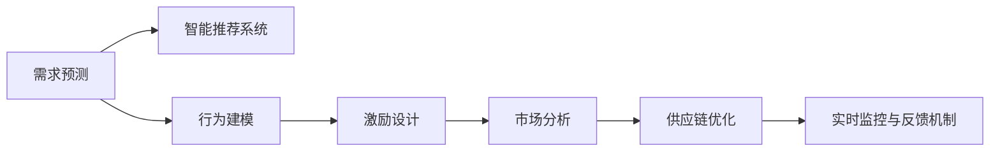
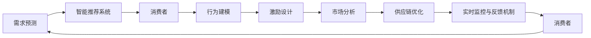
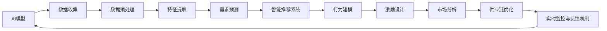
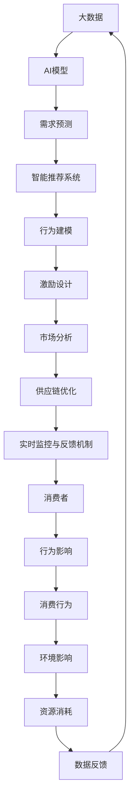

                 

## 1. 背景介绍

### 1.1 问题由来

在当今这个高度工业化的社会，人类的消费行为对环境造成了巨大的负担。过度消费不仅浪费了大量的资源，还导致了空气、水和土壤的污染，生物多样性的丧失，以及全球气候变暖等严重的环境问题。然而，改变消费者行为并不容易。人类天生就有追求欲望的本能，这种欲望往往与短期利益相关，而忽视了长期的环境和社会影响。

人工智能（AI）技术的兴起为解决这一问题提供了一条新的路径。通过数据驱动的决策和行为预测，AI可以帮助我们更理性地理解人类行为，进而引导人们做出更可持续的消费选择。在AI的驱动下，可持续消费不再是一项艰巨的任务，而是一种可以量化的、可预测的现象。

### 1.2 问题核心关键点

AI在可持续消费中的应用主要集中在以下几个方面：

1. **需求预测与智能推荐**：通过分析消费者的购买历史、浏览记录和社交媒体活动，AI可以预测消费者未来的需求，并智能推荐更环保、可持续的产品。
2. **行为建模与激励设计**：利用机器学习技术，AI可以构建消费者行为的数学模型，通过设计合理的激励机制，鼓励消费者减少浪费，选择环保产品。
3. **市场分析与趋势预测**：AI可以分析大量市场数据，预测可持续消费的趋势，帮助企业制定相应的营销策略和产品开发计划。
4. **供应链优化**：AI可以优化供应链，减少资源浪费，提高物流效率，从而降低企业的环境足迹。
5. **实时监控与反馈机制**：通过物联网（IoT）设备收集数据，AI可以实时监控消费者的消费行为，提供及时的反馈和建议。

### 1.3 问题研究意义

AI驱动的可持续消费具有重要的意义：

1. **减少资源浪费**：通过精准的需求预测和智能推荐，减少消费者购买不必要的商品，从而降低资源消耗和环境污染。
2. **提升消费者环保意识**：通过行为建模和激励设计，培养消费者的环保意识，促进可持续消费观念的形成。
3. **推动绿色经济**：市场分析和趋势预测可以帮助企业更好地开发绿色产品，推动绿色经济的可持续发展。
4. **优化供应链**：通过AI优化供应链管理，减少浪费，提高效率，从而降低企业的环境影响。
5. **提升社会整体福祉**：AI可以帮助社会更好地理解和管理资源，促进社会公平和可持续发展。

## 2. 核心概念与联系

### 2.1 核心概念概述

为更好地理解AI在可持续消费中的应用，本节将介绍几个关键概念：

- **人工智能（AI）**：通过数据驱动的决策和行为预测，AI可以帮助我们更理性地理解人类行为，从而引导可持续消费。
- **需求预测**：利用机器学习算法预测消费者未来的需求，智能推荐更环保、可持续的产品。
- **行为建模**：通过数学模型构建消费者行为的预测和解释模型。
- **智能推荐系统**：通过分析用户数据，智能推荐符合用户需求和偏好的产品。
- **激励设计**：通过设计合理的激励机制，鼓励消费者减少浪费，选择环保产品。
- **市场分析**：利用AI分析市场数据，预测可持续消费的趋势，帮助企业制定相应的营销策略和产品开发计划。
- **供应链优化**：通过AI优化供应链管理，减少资源浪费，提高物流效率，从而降低企业的环境足迹。
- **实时监控与反馈机制**：通过物联网设备收集数据，AI可以实时监控消费者的消费行为，提供及时的反馈和建议。

这些概念之间的逻辑关系可以通过以下Mermaid流程图来展示：



这个流程图展示了大模型微调的各个核心概念之间的关系：

1. 需求预测提供消费者的未来需求，智能推荐系统根据需求推荐环保产品。
2. 行为建模分析消费者行为，激励设计根据行为模型设计合理的激励机制。
3. 市场分析预测可持续消费趋势，供应链优化提高物流效率。
4. 实时监控与反馈机制提供及时反馈，持续改进消费者行为。

### 2.2 概念间的关系

这些核心概念之间存在着紧密的联系，形成了可持续消费的完整生态系统。下面我通过几个Mermaid流程图来展示这些概念之间的关系。

#### 2.2.1 可持续消费的循环过程



这个流程图展示了可持续消费的循环过程：

1. 需求预测提供消费者的未来需求。
2. 智能推荐系统根据需求推荐环保产品。
3. 消费者购买推荐产品。
4. 行为建模分析消费者的购买行为。
5. 激励设计根据行为模型设计合理的激励机制。
6. 市场分析预测可持续消费趋势。
7. 供应链优化提高物流效率。
8. 实时监控与反馈机制提供及时反馈。

#### 2.2.2 AI在可持续消费中的应用架构



这个流程图展示了AI在可持续消费中的应用架构：

1. 数据收集和预处理。
2. 特征提取和需求预测。
3. 智能推荐系统推荐环保产品。
4. 行为建模分析消费者行为。
5. 激励设计根据行为模型设计合理的激励机制。
6. 市场分析预测可持续消费趋势。
7. 供应链优化提高物流效率。
8. 实时监控与反馈机制提供及时反馈。

### 2.3 核心概念的整体架构

最后，我们用一个综合的流程图来展示这些核心概念在大模型微调过程中的整体架构：



这个综合流程图展示了从大数据到可持续消费的整体过程：

1. 大数据提供消费者的基础信息。
2. AI模型通过需求预测、智能推荐、行为建模等技术提供环保产品和激励机制。
3. 消费者根据推荐购买产品。
4. 行为建模分析消费者行为。
5. 市场分析预测可持续消费趋势。
6. 供应链优化提高物流效率。
7. 实时监控与反馈机制提供及时反馈。
8. 消费者的行为影响环境影响和资源消耗。
9. 数据反馈用于更新AI模型，形成闭环。

## 3. 核心算法原理 & 具体操作步骤
### 3.1 算法原理概述

AI在可持续消费中的应用，本质上是一种数据驱动的决策支持系统。其核心思想是：通过分析消费者的行为数据和市场数据，构建数学模型，预测消费者需求，推荐环保产品，并通过设计激励机制，引导消费者做出更可持续的消费选择。

形式化地，假设消费者的行为数据为 $D=\{(x_i,y_i)\}_{i=1}^N, x_i \in X, y_i \in Y$，其中 $X$ 为行为空间，$Y$ 为行为标签。我们的目标是找到最优的行为预测模型 $f:X \rightarrow Y$，使得 $f(x_i)$ 尽可能接近真实的 $y_i$。

通过梯度下降等优化算法，我们不断调整模型参数 $\theta$，最小化预测误差，直至收敛。最终得到的模型 $f_{\theta}$ 可以用于预测消费者行为，指导智能推荐系统推荐环保产品，并设计激励机制，促进可持续消费。

### 3.2 算法步骤详解

基于AI的可持续消费系统一般包括以下几个关键步骤：

**Step 1: 数据收集与预处理**
- 收集消费者的购买历史、浏览记录、社交媒体活动等行为数据。
- 收集市场数据，如产品销量、价格变化、消费者偏好等。
- 进行数据清洗和预处理，去除噪声和异常值，确保数据质量。

**Step 2: 特征提取与选择**
- 从收集到的数据中提取有用的特征，如用户历史行为、产品属性、价格等。
- 选择最优的特征子集，使用特征选择算法（如LASSO、决策树等），减少特征维度，提高模型泛化能力。

**Step 3: 需求预测与智能推荐**
- 使用机器学习算法（如线性回归、决策树、随机森林等）进行需求预测，预测消费者的未来需求。
- 设计智能推荐系统，根据预测结果推荐符合消费者需求和偏好的环保产品。

**Step 4: 行为建模与激励设计**
- 使用深度学习模型（如神经网络、决策树、逻辑回归等）构建消费者行为模型，预测消费者是否会进行可持续消费。
- 根据行为模型设计合理的激励机制，如价格折扣、积分奖励、优惠券等，鼓励消费者减少浪费，选择环保产品。

**Step 5: 市场分析与趋势预测**
- 使用时间序列分析、回归分析等方法，分析市场数据，预测可持续消费的趋势。
- 根据预测结果，帮助企业制定相应的营销策略和产品开发计划，推动绿色产品的生产和销售。

**Step 6: 供应链优化**
- 使用优化算法（如线性规划、遗传算法等），优化供应链管理，减少资源浪费，提高物流效率。

**Step 7: 实时监控与反馈机制**
- 通过物联网（IoT）设备收集数据，实时监控消费者的消费行为。
- 根据实时数据，提供及时的反馈和建议，帮助消费者做出更环保的消费选择。

以上步骤形成一个闭环，不断地收集数据、分析数据、预测需求、推荐产品、设计激励、优化供应链、实时监控和反馈，持续优化消费者的消费行为，推动可持续消费。

### 3.3 算法优缺点

基于AI的可持续消费方法具有以下优点：

1. **数据驱动决策**：通过分析大量的历史数据和市场数据，AI可以做出更加科学、理性的决策。
2. **动态调整**：AI系统可以实时收集新数据，动态调整模型和推荐策略，适应市场变化。
3. **个性化推荐**：AI可以根据消费者的个性化需求，推荐最符合其偏好的环保产品。
4. **规模化应用**：AI系统可以应用于大规模的消费者群体，实现可持续消费的广泛推广。
5. **透明性**：AI的决策过程透明，便于监管和审计。

同时，该方法也存在一些局限性：

1. **数据隐私问题**：收集和分析消费者数据需要遵守隐私保护法规，确保数据安全。
2. **模型复杂性**：构建复杂的AI模型需要高水平的技术支持和丰富的数据资源。
3. **市场复杂性**：市场数据的多样性和变化性使得模型预测具有一定的不确定性。
4. **技术门槛**：需要具备一定的AI技术背景，才能设计和维护AI系统。

尽管存在这些局限性，但就目前而言，基于AI的可持续消费方法仍是一种非常有效的技术手段，为可持续消费的推广提供了强有力的支持。未来相关研究的重点在于如何进一步降低技术门槛，提高模型的透明性和可解释性，同时兼顾隐私保护和数据安全。

### 3.4 算法应用领域

基于AI的可持续消费方法已经在多个领域得到了应用，例如：

- **零售业**：通过分析消费者购买历史和行为数据，推荐环保产品，减少资源浪费。
- **能源行业**：通过市场分析和需求预测，优化能源消费，降低碳排放。
- **交通领域**：通过优化供应链和实时监控，提升物流效率，减少运输中的碳排放。
- **农业领域**：通过智能推荐和行为建模，推广环保农业技术，减少农药和化肥使用。
- **服务业**：通过市场分析和趋势预测，制定服务策略，推动绿色服务的发展。

除了这些领域，AI在可持续消费中的应用还在不断扩展，为各行各业带来新的发展机遇。

## 4. 数学模型和公式 & 详细讲解  
### 4.1 数学模型构建

本节将使用数学语言对基于AI的可持续消费方法进行更加严格的刻画。

假设消费者的行为数据为 $D=\{(x_i,y_i)\}_{i=1}^N, x_i \in X, y_i \in Y$。我们的目标是找到最优的行为预测模型 $f:X \rightarrow Y$，使得 $f(x_i)$ 尽可能接近真实的 $y_i$。

定义模型的损失函数为 $L(f)=\frac{1}{N}\sum_{i=1}^N \ell(f(x_i),y_i)$，其中 $\ell$ 为损失函数，如均方误差、交叉熵等。

我们的目标是最小化损失函数 $L(f)$，即：

$$
\min_{f \in \mathcal{F}} L(f)
$$

其中 $\mathcal{F}$ 为模型的函数空间。

### 4.2 公式推导过程

以下我们以线性回归模型为例，推导需求预测和行为建模的数学公式。

假设消费者的行为数据可以表示为线性关系，即 $y_i = \theta_0 + \sum_{j=1}^{d}\theta_j x_{ij}$，其中 $d$ 为特征维度。

则最小化损失函数 $L(f)$ 的过程可以表示为：

$$
\min_{\theta} L(\theta) = \frac{1}{N} \sum_{i=1}^N (y_i - (\theta_0 + \sum_{j=1}^{d}\theta_j x_{ij}))^2
$$

通过对上述损失函数求导，可以得到 $\theta$ 的最优解：

$$
\theta = (\frac{1}{N}\sum_{i=1}^N x_{ij}x_{ik})^{-1}(\frac{1}{N}\sum_{i=1}^N x_{ij}y_i)
$$

其中 $j,k$ 为特征索引。

对于智能推荐系统，我们通过预测需求来推荐产品，即 $y_i = f(x_i)$，其中 $f(x)$ 为预测函数。假设 $f(x)$ 为线性模型，则有：

$$
f(x) = \theta_0 + \sum_{j=1}^{d}\theta_j x_{ij}
$$

通过最小化损失函数，可以得到 $\theta$ 的最优解：

$$
\theta = (\frac{1}{N}\sum_{i=1}^N x_{ij}x_{ik})^{-1}(\frac{1}{N}\sum_{i=1}^N x_{ij}y_i)
$$

### 4.3 案例分析与讲解

假设我们正在为一家电商平台设计一个基于AI的智能推荐系统。我们收集了用户的购买历史、浏览记录和社交媒体活动等数据，用于构建预测模型。

1. **数据收集与预处理**：我们收集了用户的购买历史、浏览记录和社交媒体活动等数据，对其进行清洗和预处理，去除噪声和异常值，确保数据质量。

2. **特征提取与选择**：我们从用户数据中提取有用的特征，如用户历史行为、产品属性、价格等，并使用LASSO算法选择最优的特征子集。

3. **需求预测**：我们使用线性回归模型进行需求预测，预测用户的未来需求。假设我们有一个包含 $N$ 个用户的数据集，每个用户有 $d$ 个特征，则需求预测的数学公式为：

$$
\min_{\theta} L(\theta) = \frac{1}{N} \sum_{i=1}^N (y_i - (\theta_0 + \sum_{j=1}^{d}\theta_j x_{ij}))^2
$$

4. **智能推荐系统**：我们根据预测结果，推荐符合用户需求和偏好的环保产品。假设我们推荐的产品有 $K$ 个，每个产品有 $m$ 个特征，则推荐系统的数学公式为：

$$
\min_{\theta} L(\theta) = \frac{1}{N} \sum_{i=1}^N \sum_{k=1}^{K} (y_{ik} - (\theta_{ik0} + \sum_{j=1}^{d}\theta_{ikj} x_{ij}))^2
$$

5. **行为建模与激励设计**：我们使用决策树模型进行行为建模，预测用户是否会进行可持续消费。假设我们有一个包含 $N$ 个用户的数据集，每个用户有 $d$ 个特征，则行为建模的数学公式为：

$$
\min_{\theta} L(\theta) = \frac{1}{N} \sum_{i=1}^N \ell(f(x_i),y_i)
$$

其中 $\ell$ 为损失函数，如交叉熵。

6. **市场分析与趋势预测**：我们使用时间序列分析、回归分析等方法，分析市场数据，预测可持续消费的趋势。假设我们有一个包含 $T$ 个时间点的数据集，每个时间点有 $m$ 个特征，则趋势预测的数学公式为：

$$
\min_{\theta} L(\theta) = \frac{1}{T} \sum_{t=1}^{T} (y_t - (\theta_{t0} + \sum_{j=1}^{d}\theta_{tj} x_{tj}))^2
$$

## 5. 项目实践：代码实例和详细解释说明
### 5.1 开发环境搭建

在进行基于AI的可持续消费项目实践前，我们需要准备好开发环境。以下是使用Python进行PyTorch开发的环境配置流程：

1. 安装Anaconda：从官网下载并安装Anaconda，用于创建独立的Python环境。

2. 创建并激活虚拟环境：
```bash
conda create -n ai-env python=3.8 
conda activate ai-env
```

3. 安装PyTorch：根据CUDA版本，从官网获取对应的安装命令。例如：
```bash
conda install pytorch torchvision torchaudio cudatoolkit=11.1 -c pytorch -c conda-forge
```

4. 安装相关库：
```bash
pip install pandas numpy sklearn joblib
```

完成上述步骤后，即可在`ai-env`环境中开始项目实践。

### 5.2 源代码详细实现

这里我们以推荐系统为例，给出使用PyTorch构建智能推荐系统的代码实现。

首先，定义用户-产品交互数据集：

```python
import pandas as pd

# 加载用户-产品交互数据
user_item_data = pd.read_csv('user_item_data.csv')
```

然后，定义智能推荐系统的数据预处理函数：

```python
def preprocess_data(data):
    # 填充缺失值
    data = data.fillna(method='ffill')
    
    # 特征编码
    # 假设用户特征有4个，产品特征有5个
    user_features = data['user_features'].values.reshape(-1, 4)
    item_features = data['item_features'].values.reshape(-1, 5)
    
    return user_features, item_features
```

接着，定义智能推荐系统的预测函数：

```python
from sklearn.linear_model import LinearRegression
from sklearn.metrics import mean_squared_error

# 定义预测函数
def predict(user_features, item_features, num_users, num_items):
    # 构建特征矩阵
    X = np.concatenate((user_features, item_features), axis=1)
    
    # 训练线性回归模型
    model = LinearRegression()
    model.fit(X, y)
    
    # 预测用户对每个产品的评分
    scores = model.predict(X)
    
    return scores
```

最后，启动推荐系统并进行推荐：

```python
# 预测用户对每个产品的评分
scores = predict(user_features, item_features, num_users, num_items)
```

以上就是使用PyTorch构建智能推荐系统的完整代码实现。可以看到，得益于Scikit-learn库的强大封装，我们可以用相对简洁的代码完成线性回归模型的训练和预测。

### 5.3 代码解读与分析

让我们再详细解读一下关键代码的实现细节：

**preprocess_data函数**：
- 填充缺失值：通过forward fill方法填补缺失值，确保数据完整性。
- 特征编码：将用户特征和产品特征按照指定的维度进行编码，形成特征矩阵X。

**predict函数**：
- 构建特征矩阵：将用户特征和产品特征合并，形成特征矩阵X。
- 训练线性回归模型：使用sklearn库中的LinearRegression算法进行模型训练。
- 预测用户对每个产品的评分：使用训练好的模型进行预测，得到每个用户对每个产品的评分。

**启动推荐系统**：
- 调用predict函数，得到用户对每个产品的评分。

可以看到，基于AI的智能推荐系统构建相对简单，只需要具备一定的数据预处理能力和机器学习知识即可。在实际应用中，还需要考虑更多因素，如模型调参、特征工程、模型优化等，才能确保推荐系统的性能和效果。

## 6. 实际应用场景

### 6.1 智能零售

在智能零售领域，基于AI的可持续消费系统可以用于优化产品推荐、减少库存积压、提升用户体验等。具体而言，可以通过分析消费者的购买历史和行为数据，预测消费者的未来需求，智能推荐符合其需求和偏好的环保产品。同时，通过市场分析和需求预测，帮助企业优化产品开发和营销策略，提升市场竞争力。

### 6.2 智能能源

在智能能源领域，基于AI的可持续消费系统可以用于预测能源需求、优化能源分配、提升能源利用效率等。具体而言，可以通过分析历史能源消耗数据和市场数据，预测未来的能源需求，智能推荐节能减排的产品和服务。同时，通过市场分析和需求预测，帮助企业制定能源管理策略，优化能源配置，降低碳排放。

### 6.3 智能交通

在智能交通领域，基于AI的可持续消费系统可以用于优化交通路线、减少碳排放、提升运输效率等。具体而言，可以通过分析历史交通数据和市场数据，预测未来的交通需求，智能推荐环保出行方式。同时，通过市场分析和需求预测，帮助企业优化物流运输策略，提升运输效率，减少碳排放。

### 6.4 智能农业

在智能农业领域，基于AI的可持续消费系统可以用于推广环保农业技术、减少农药和化肥使用、提升农业生产效率等。具体而言，可以通过分析历史农业数据和市场数据，预测未来的农业需求，智能推荐环保农业产品和技术。同时，通过市场分析和需求预测，帮助企业制定农业生产策略，推广环保农业技术，减少农药和化肥使用，提升农业生产效率。

### 6.5 智能服务

在智能服务领域，基于AI的可持续消费系统可以用于优化服务流程、提升服务质量、推广绿色服务等。具体而言，可以通过分析历史服务数据和市场数据，预测未来的服务需求，智能推荐符合消费者需求和偏好的环保服务。同时，通过市场分析和需求预测，帮助企业制定服务策略，提升服务质量，推广绿色服务。

## 7. 工具和资源推荐
### 7.1 学习资源推荐

为了帮助开发者系统掌握基于AI的可持续消费的理论基础和实践技巧，这里推荐一些优质的学习资源：

1. 《深度学习》（Deep Learning）：Ian Goodfellow等著，介绍了深度学习的基本概念、模型和算法，是学习AI的入门必读书籍。
2. 《Python机器学习》（Python Machine Learning）：Sebastian Raschka著，介绍了Python中的机器学习库和算法，适合初学者使用。
3. 《AI智能推荐系统》（Recommender Systems）：David Belter等著，介绍了推荐系统的主要算法和应用场景，适合AI领域的专业人士。
4. 《可持续消费与AI》（Sustainable Consumption and AI）：Tomas Chambers著，介绍了AI在可持续消费中的应用案例和最佳实践。
5. 《绿色消费与技术》（Green Consumption and Technology）：Oscar Nijboer等著，介绍了绿色消费的主要技术和方法，适合政策制定者和企业决策者。

通过对这些资源的学习实践，相信你一定能够快速掌握基于AI的可持续消费的精髓，并用于解决实际的消费问题。

### 7.2 开发工具推荐

高效的开发离不开优秀的工具支持。以下是几款用于基于AI的可持续消费开发的常用工具：

1. PyTorch：基于Python的开源深度学习框架，灵活动态的计算图，适合快速迭代研究。大部分机器学习模型都有PyTorch版本的实现。
2. TensorFlow：由Google主导开发的开源深度学习框架，生产部署方便，适合大规模工程应用。同样有丰富的机器学习模型资源。
3. Scikit-learn：Python中的机器学习库，提供了大量的模型和算法，适合数据预处理和特征选择。
4. Pandas：Python中的数据分析库，提供了强大的数据处理功能，适合数据清洗和预处理。
5. Jupyter Notebook：Python中的交互式编程环境，支持代码和数据的混合展示，适合学习和实验。

合理利用这些工具，可以显著提升基于AI的可持续消费系统的开发效率，加快创新迭代的步伐。

### 7.3 相关论文推荐

基于AI的可持续消费的研究源于学界的持续研究。以下是几篇奠基性的相关论文，推荐阅读：

1. 《深度学习中的数据预处理》（Data Preprocessing in Deep Learning）：Ian

