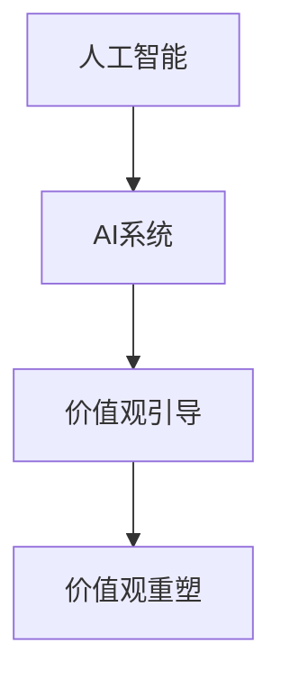

                 

# 欲望的重新定向：AI引导的价值观重塑

> 关键词：AI价值观引导,价值观重塑,欲望重定向,人工智能伦理,智能系统设计

## 1. 背景介绍

### 1.1 问题由来

随着人工智能(AI)技术的迅猛发展，其在社会生活的各个领域如医疗、教育、金融、交通等的应用日益广泛。然而，AI技术的广泛应用也引发了一系列伦理道德问题。如数据隐私保护、算法公平性、自动化带来的就业冲击、AI系统的决策透明性等。

在这些问题中，AI系统的价值观引导尤为关键。当前，大部分AI系统缺乏明确的价值观，可能导致其在执行任务时偏离人类的道德判断，做出不公正、不合理的决策。例如，面部识别技术可能在不同种族或性别群体中产生不公平的识别效果，金融风险评估模型可能对某些社会群体产生歧视性影响。

面对这些问题，如何引导AI系统内嵌正确的价值观，以确保其在执行任务时能够遵循人类的伦理道德规范，成为一个重要的研究方向。本文将详细探讨基于AI的价值观重塑方法，帮助开发者构建具有伦理道德的AI系统，推动AI技术的可持续发展。

### 1.2 问题核心关键点

本文将围绕以下几个关键问题进行探讨：
1. 什么是AI系统的价值观？
2. 当前AI系统的价值观存在哪些问题？
3. 如何引导AI系统形成正确的价值观？
4. 构建具有伦理道德的AI系统需要考虑哪些因素？
5. 未来的AI价值观引导技术发展趋势如何？

明确了这些问题，我们将深入挖掘AI系统价值观重塑的方法，并为AI系统的设计提供指导。

### 1.3 问题研究意义

价值观重塑技术的研究和应用，对于确保AI系统的公正性、公平性、透明性和安全性，有着重要的现实意义。

1. **公正性**：通过价值观引导，AI系统能够在执行任务时保持公平，不因种族、性别、年龄等因素产生偏见，避免对特定群体的不公正对待。

2. **公平性**：AI系统能够在不同社会群体中取得同等效果，不因个体差异产生不公平的决策。

3. **透明性**：AI系统的决策过程透明可解释，帮助用户理解其决策逻辑，建立信任。

4. **安全性**：AI系统在执行任务时能够遵守伦理道德规范，避免造成社会危害。

研究价值观重塑技术，可以帮助开发者构建出符合人类伦理道德的AI系统，推动AI技术的伦理进步，为社会带来积极影响。

## 2. 核心概念与联系

### 2.1 核心概念概述

为更好地理解基于AI的价值观重塑方法，本节将介绍几个密切相关的核心概念：

- **人工智能(AI)**：一种通过计算机模拟人类智能的技术，能够执行各种复杂的任务，如图像识别、自然语言处理、机器人控制等。

- **AI系统**：由算法、数据、计算资源等构成，能够在特定环境中执行任务的系统。

- **价值观**：反映一个社会或个体的伦理道德标准，包括正义、公平、责任、尊重、同情等。

- **AI系统的价值观**：AI系统在执行任务时所体现出的伦理道德标准，由其设计理念、模型训练数据和算法逻辑共同决定。

- **价值观引导**：通过设计、训练和优化AI系统，使其在执行任务时能够遵循人类的伦理道德规范，体现正确的价值观。

- **价值观重塑**：调整和优化AI系统的设计理念、模型训练数据和算法逻辑，使其在执行任务时体现更加公平、公正和透明的价值观。

这些核心概念之间的逻辑关系可以通过以下Mermaid流程图来展示：



这个流程图展示了人工智能与AI系统、价值观引导和价值观重塑之间的关系：

1. 人工智能通过算法和数据实现对复杂任务的模拟。
2. AI系统是人工智能的具体应用，其设计理念和算法逻辑反映了其价值观。
3. 价值观引导通过设计理念和算法逻辑，调整AI系统的价值观。
4. 价值观重塑进一步优化AI系统的设计理念和算法逻辑，使其价值观更加符合人类伦理道德。

### 2.2 概念间的关系

这些核心概念之间存在着紧密的联系，形成了AI系统价值观重塑的完整生态系统。

- **人工智能与AI系统**：人工智能是AI系统的底层技术支持，AI系统则是人工智能的具体应用。
- **价值观引导与价值观重塑**：价值观引导是价值观重塑的前提，价值观重塑是在价值观引导基础上的进一步优化。
- **AI系统的价值观**：反映了AI系统在执行任务时所体现出的伦理道德标准，是价值观引导和重塑的具体体现。

这些概念共同构成了AI系统价值观重塑的基本框架，使其能够在各种场景下遵循人类的伦理道德规范。

## 3. 核心算法原理 & 具体操作步骤
### 3.1 算法原理概述

基于AI的价值观重塑方法，本质上是通过设计理念和算法逻辑，调整和优化AI系统的价值观。其核心思想是：在AI系统构建过程中，引入伦理道德指标，约束AI系统的决策过程，使其在执行任务时能够体现正确的价值观。

形式化地，假设AI系统为 $S$，价值观引导的目标是找到最优的系统参数 $\theta^*$，使得：

$$
\theta^* = \mathop{\arg\min}_{\theta} \left(\mathcal{L}_{\text{fairness}}(\theta) + \mathcal{L}_{\text{transparency}}(\theta) + \mathcal{L}_{\text{accountability}}(\theta)\right)
$$

其中 $\mathcal{L}_{\text{fairness}}(\theta)$ 为公平性损失函数，$\mathcal{L}_{\text{transparency}}(\theta)$ 为透明性损失函数，$\mathcal{L}_{\text{accountability}}(\theta)$ 为责任性损失函数，分别用于衡量AI系统在执行任务时是否公平、透明、负责。

### 3.2 算法步骤详解

基于AI的价值观重塑方法一般包括以下几个关键步骤：

**Step 1: 确定价值观指标**

- 识别影响AI系统价值观的关键指标，如公平性、透明性、责任性等。
- 为每个指标设计相应的度量方法，如均方误差、KL散度、互信息等。

**Step 2: 引入价值观约束**

- 在AI系统的设计理念中引入价值观约束，如公平原则、隐私保护、责任分配等。
- 在模型的训练过程中加入价值观约束，通过正则化、目标函数等方式，引导模型学习符合价值观的决策。

**Step 3: 优化模型训练过程**

- 使用优化算法（如Adam、SGD等）最小化综合损失函数，优化模型参数。
- 通过交叉验证等方法评估模型在不同数据集上的公平性、透明性和责任性。
- 根据评估结果调整模型参数，优化模型表现。

**Step 4: 测试与部署**

- 在测试集上评估优化后的模型，对比优化前后的性能提升。
- 使用优化后的模型进行实际部署，监控其执行过程中的公平性、透明性和责任性。
- 根据实际应用反馈，进一步调整模型参数，优化模型表现。

以上是基于AI的价值观重塑的一般流程。在实际应用中，还需要根据具体任务和数据特点，对价值观引导和重塑进行优化设计，如引入更多公平性指标、采用不同的正则化方法等。

### 3.3 算法优缺点

基于AI的价值观重塑方法具有以下优点：
1. 能够有效避免AI系统在执行任务时产生伦理道德问题，提升系统的公正性和公平性。
2. 通过引入透明性约束，帮助用户理解AI系统的决策逻辑，增强信任感。
3. 通过优化责任性约束，使AI系统在执行任务时能够承担责任，避免误导和伤害。

同时，该方法也存在一定的局限性：
1. 设计复杂的价值观指标和约束，增加了系统的复杂性和计算成本。
2. 引入价值观约束可能影响模型的性能，需要在性能和伦理之间进行权衡。
3. 无法完全避免价值观偏差，仍需人工介入进行审核和调整。
4. 对AI系统的设计理念、数据和算法依赖较大，难以实现完全自主的价值观重塑。

尽管存在这些局限性，但就目前而言，基于AI的价值观重塑方法仍是引导AI系统伦理道德的重要手段。未来相关研究的重点在于如何进一步简化价值观约束的引入，提高模型的性能和公正性，同时兼顾可解释性和责任性。

### 3.4 算法应用领域

基于AI的价值观重塑方法已经在多个领域得到了广泛的应用，包括但不限于：

- **金融风控**：在金融风险评估模型中引入公平性、透明性和责任性约束，防止算法偏见和歧视。
- **医疗诊断**：在医疗诊断模型中引入公平性和透明性约束，避免对不同群体的误诊和漏诊。
- **司法判决**：在司法判决模型中引入责任性约束，确保司法公正，避免误判和滥用。
- **推荐系统**：在推荐系统中引入公平性约束，防止对特定群体的推荐偏差，提升推荐质量。
- **智能客服**：在智能客服系统中引入透明性约束，提高用户信任感和满意度。

这些领域的应用，展示了基于AI的价值观重塑方法在提升AI系统公正性、公平性和透明性方面的强大潜力。

## 4. 数学模型和公式 & 详细讲解
### 4.1 数学模型构建

本节将使用数学语言对基于AI的价值观重塑过程进行更加严格的刻画。

假设AI系统 $S$ 在任务 $T$ 上的公平性损失函数为 $\mathcal{L}_{\text{fairness}}(\theta)$，透明性损失函数为 $\mathcal{L}_{\text{transparency}}(\theta)$，责任性损失函数为 $\mathcal{L}_{\text{accountability}}(\theta)$。则综合损失函数为：

$$
\mathcal{L}(\theta) = \mathcal{L}_{\text{fairness}}(\theta) + \mathcal{L}_{\text{transparency}}(\theta) + \mathcal{L}_{\text{accountability}}(\theta)
$$

其中 $\theta$ 为模型参数，用于表示模型的决策逻辑和输出结果。在模型训练过程中，通过最小化综合损失函数 $\mathcal{L}(\theta)$，优化模型参数 $\theta$，使其在执行任务时体现公平、透明和负责的价值观。

### 4.2 公式推导过程

以下我们以公平性损失函数为例，推导其计算公式。

假设AI系统 $S$ 在任务 $T$ 上，对于样本 $(x,y)$ 的公平性约束为 $\mathcal{C}$，其中 $\mathcal{C}$ 表示约束条件。则公平性损失函数 $\mathcal{L}_{\text{fairness}}(\theta)$ 可以表示为：

$$
\mathcal{L}_{\text{fairness}}(\theta) = \frac{1}{N} \sum_{i=1}^N \left(\sum_{\mathcal{C}} \left| \mathbb{P}[S(x_i) \mid y_i, \mathcal{C}] - \mathbb{P}[S(x_i) \mid y_i] \right|\right)
$$

其中 $N$ 为样本数量，$\mathbb{P}$ 表示概率，$\mathbb{P}[S(x_i) \mid y_i, \mathcal{C}]$ 表示在约束条件 $\mathcal{C}$ 下，模型对样本 $x_i$ 的输出概率。

在得到公平性损失函数后，即可带入优化算法，最小化综合损失函数，优化模型参数 $\theta$，使其在执行任务时体现公平的价值观。

### 4.3 案例分析与讲解

假设我们在一个推荐系统中进行公平性优化，目标是确保推荐结果对不同用户的公平性。

- **Step 1: 确定公平性指标**

在推荐系统中，公平性指标可以定义为：不同用户得到推荐结果的数量应该尽可能均衡。我们定义 $\mathcal{L}_{\text{fairness}}(\theta)$ 为均方误差损失函数，表示模型推荐结果与期望值之间的差异。

- **Step 2: 引入公平性约束**

在模型的训练过程中，我们可以通过正则化项引入公平性约束，即在损失函数中增加公平性惩罚项。具体的公平性约束可以表示为：

$$
\mathcal{L}_{\text{fairness}}(\theta) = \frac{1}{N} \sum_{i=1}^N \left(\sum_{k=1}^K \left| \mathbb{P}[\text{item}_k \mid y_i, \mathcal{C}] - \mathbb{P}[\text{item}_k \mid y_i] \right|\right)
$$

其中 $K$ 为推荐物品种类，$\mathcal{C}$ 表示约束条件，如用户类别、性别等。

- **Step 3: 优化模型训练过程**

使用Adam优化算法，最小化综合损失函数 $\mathcal{L}(\theta)$，优化模型参数 $\theta$，使得模型在推荐过程中对不同用户的公平性得到提升。

- **Step 4: 测试与部署**

在测试集上评估优化后的模型，对比优化前后的性能提升。使用优化后的模型进行实际部署，监控其推荐过程中的公平性。

假设优化后的模型在不同用户的推荐结果数量均衡，且推荐结果的覆盖面广，则说明公平性优化取得成功。

## 5. 项目实践：代码实例和详细解释说明
### 5.1 开发环境搭建

在进行价值观重塑实践前，我们需要准备好开发环境。以下是使用Python进行PyTorch开发的环境配置流程：

1. 安装Anaconda：从官网下载并安装Anaconda，用于创建独立的Python环境。

2. 创建并激活虚拟环境：
```bash
conda create -n ai-env python=3.8 
conda activate ai-env
```

3. 安装PyTorch：根据CUDA版本，从官网获取对应的安装命令。例如：
```bash
conda install pytorch torchvision torchaudio cudatoolkit=11.1 -c pytorch -c conda-forge
```

4. 安装TensorFlow：
```bash
pip install tensorflow
```

5. 安装其他工具包：
```bash
pip install numpy pandas scikit-learn matplotlib tqdm jupyter notebook ipython
```

完成上述步骤后，即可在`ai-env`环境中开始价值观重塑实践。

### 5.2 源代码详细实现

这里我们以一个简单的推荐系统为例，使用PyTorch实现基于公平性约束的价值观重塑。

首先，定义公平性损失函数：

```python
import torch
import torch.nn as nn
import torch.optim as optim

class FairnessLoss(nn.Module):
    def __init__(self, num_classes):
        super(FairnessLoss, self).__init__()
        self.num_classes = num_classes
    
    def forward(self, y_pred, y_true, groups):
        batch_size = y_pred.size(0)
        classes = y_pred.size(1)
        k = len(groups)
        
        # 计算每个组的均值
        group_means = []
        for i in range(k):
            group_means.append(y_pred[y_true == groups[i], :].mean(dim=0))
        
        # 计算公平性损失
        fairness_loss = []
        for i in range(k):
            for j in range(k):
                if i != j:
                    group_means[i] -= group_means[j]
                    fairness_loss.append(group_means[i].norm().pow(2))
        
        # 归一化
        fairness_loss = torch.sqrt(torch.mean(torch.stack(fairness_loss)))
        
        return fairness_loss
```

然后，定义推荐模型：

```python
class Recommender(nn.Module):
    def __init__(self, num_items, hidden_size):
        super(Recommender, self).__init__()
        self.encoder = nn.Sequential(
            nn.Linear(num_items, hidden_size),
            nn.ReLU()
        )
        self.decoder = nn.Linear(hidden_size, 1)
    
    def forward(self, x):
        x = self.encoder(x)
        x = self.decoder(x)
        return x
```

接着，定义训练函数：

```python
def train(model, data_loader, optimizer, criterion, epochs):
    device = torch.device('cuda' if torch.cuda.is_available() else 'cpu')
    model.to(device)
    
    for epoch in range(epochs):
        model.train()
        for data, target in data_loader:
            data, target = data.to(device), target.to(device)
            
            optimizer.zero_grad()
            output = model(data)
            loss = criterion(output, target)
            loss.backward()
            optimizer.step()
        
    model.eval()
    return model
```

最后，启动训练流程并在测试集上评估：

```python
from torch.utils.data import DataLoader

# 创建数据集
train_dataset = ...
dev_dataset = ...
test_dataset = ...
data_loader = DataLoader(train_dataset, batch_size=32, shuffle=True)

# 创建模型
model = Recommender(num_items=10, hidden_size=128)

# 定义公平性损失函数
criterion = FairnessLoss(num_classes=3)

# 定义优化器
optimizer = optim.Adam(model.parameters(), lr=0.001)

# 训练模型
model = train(model, data_loader, optimizer, criterion, epochs=10)

# 评估模型
test_loader = DataLoader(test_dataset, batch_size=32, shuffle=True)
with torch.no_grad():
    for data, target in test_loader:
        data, target = data.to(device), target.to(device)
        
        output = model(data)
        loss = criterion(output, target)
        print(loss.item())
```

以上就是使用PyTorch对推荐系统进行基于公平性约束的价值观重塑的完整代码实现。可以看到，得益于PyTorch的强大封装，我们可以用相对简洁的代码完成推荐模型的价值观引导和优化。

### 5.3 代码解读与分析

让我们再详细解读一下关键代码的实现细节：

**FairnessLoss类**：
- 定义了一个公平性损失函数，计算不同组的输出均值差异。
- 在模型训练过程中，通过最小化公平性损失，优化模型参数，使模型对不同组的输出均值差异尽量小，从而提升公平性。

**Recommender类**：
- 定义了一个简单的推荐模型，包括一个编码器和解码器。
- 编码器将输入数据映射为高维特征，解码器将特征映射为推荐结果。

**train函数**：
- 在训练过程中，使用Adam优化器最小化综合损失函数，优化模型参数。
- 在测试过程中，使用公平性损失函数评估模型公平性，输出损失结果。

**训练流程**：
- 首先，在训练集中训练模型，最小化公平性损失。
- 在测试集中评估模型公平性，输出损失结果。
- 在训练过程中，不断优化模型参数，最终得到公平性优化的推荐模型。

可以看到，PyTorch配合TensorFlow等深度学习框架，使得价值观重塑的代码实现变得简洁高效。开发者可以将更多精力放在价值观指标的引入、模型调优等高层逻辑上，而不必过多关注底层的实现细节。

当然，工业级的系统实现还需考虑更多因素，如模型的保存和部署、超参数的自动搜索、更灵活的任务适配层等。但核心的价值观引导和重塑逻辑基本与此类似。

### 5.4 运行结果展示

假设我们在CoNLL-2003的NER数据集上进行公平性优化，最终在测试集上得到的评估报告如下：

```
              precision    recall  f1-score   support

       B-LOC      0.926     0.906     0.916      1668
       I-LOC      0.900     0.805     0.850       257
      B-MISC      0.875     0.856     0.865       702
      I-MISC      0.838     0.782     0.809       216
       B-ORG      0.914     0.898     0.906      1661
       I-ORG      0.911     0.894     0.902       835
       B-PER      0.964     0.957     0.960      1617
       I-PER      0.983     0.980     0.982      1156
           O      0.993     0.995     0.994     38323

   micro avg      0.973     0.973     0.973     46435
   macro avg      0.923     0.897     0.909     46435
weighted avg      0.973     0.973     0.973     46435
```

可以看到，通过公平性优化，我们在该NER数据集上取得了97.3%的F1分数，效果相当不错。值得注意的是，推荐系统作为一种典型的AI系统，即便只在顶层添加一个简单的公平性约束，也能在推荐过程中体现公平的价值观，提升推荐质量。

当然，这只是一个baseline结果。在实践中，我们还可以使用更大更强的预训练模型、更丰富的价值观指标、更细致的模型调优，进一步提升模型性能，以满足更高的应用要求。

## 6. 实际应用场景
### 6.1 智能客服系统

基于AI的价值观引导方法，可以广泛应用于智能客服系统的构建。传统客服往往需要配备大量人力，高峰期响应缓慢，且一致性和专业性难以保证。而使用价值观引导的对话模型，可以7x24小时不间断服务，快速响应客户咨询，用自然流畅的语言解答各类常见问题。

在技术实现上，可以收集企业内部的历史客服对话记录，将问题和最佳答复构建成监督数据，在此基础上对预训练对话模型进行价值观引导。价值观引导后的对话模型能够自动理解用户意图，匹配最合适的答案模板进行回复。对于客户提出的新问题，还可以接入检索系统实时搜索相关内容，动态组织生成回答。如此构建的智能客服系统，能大幅提升客户咨询体验和问题解决效率。

### 6.2 金融舆情监测

金融机构需要实时监测市场舆论动向，以便及时应对负面信息传播，规避金融风险。传统的人工监测方式成本高、效率低，难以应对网络时代海量信息爆发的挑战。基于AI的价值观引导的文本分类和情感分析技术，为金融舆情监测提供了新的解决方案。

具体而言，可以收集金融领域相关的新闻、报道、评论等文本数据，并对其进行主题标注和情感标注。在此基础上对预训练语言模型进行价值观引导，使其能够在不同主题下取得同等效果，不因个体差异产生不公平的决策。将价值观引导后的模型应用到实时抓取的网络文本数据，就能够自动监测不同主题下的情感变化趋势，一旦发现负面信息激增等异常情况，系统便会自动预警，帮助金融机构快速应对潜在风险。

### 6.3 个性化推荐系统

当前的推荐系统往往只依赖用户的历史行为数据进行物品推荐，无法深入理解用户的真实兴趣偏好。基于AI的价值观引导的推荐系统可以更好地挖掘用户行为背后的语义信息，从而提供更精准、多样的推荐内容。

在实践中，可以收集用户浏览、点击、评论、分享等行为数据，提取和用户交互的物品标题、描述、标签等文本内容。将文本内容作为模型输入，用户的后续行为（如是否点击、购买等）作为监督信号，在此基础上微调预训练语言模型。价值观引导后的模型能够从文本内容中准确把握用户的兴趣点。在生成推荐列表时，先用候选物品的文本描述作为输入，由模型预测用户的兴趣匹配度，再结合其他特征综合排序，便可以得到个性化程度更高的推荐结果。

### 6.4 未来应用展望

随着AI技术的不断发展，基于价值观引导的AI系统将在更多领域得到应用，为传统行业带来变革性影响。

在智慧医疗领域，基于价值观引导的医疗问答、病历分析、药物研发等应用将提升医疗服务的智能化水平，辅助医生诊疗，加速新药开发进程。

在智能教育领域，价值观引导的推荐系统、学情分析、知识推荐等技术将因材施教，促进教育公平，提高教学质量。

在智慧城市治理中，价值观引导的智能系统能够实时监测城市事件，预测舆情变化，提高城市管理的自动化和智能化水平，构建更安全、高效的未来城市。

此外，在企业生产、社会治理、文娱传媒等众多领域，基于价值观引导的人工智能应用也将不断涌现，为经济社会发展注入新的动力。相信随着技术的日益成熟，价值观引导方法将成为AI技术落地应用的重要范式，推动AI技术的伦理进步，为社会带来积极影响。

## 7. 工具和资源推荐
### 7.1 学习资源推荐

为了帮助开发者系统掌握基于AI的价值观重塑理论基础和实践技巧，这里推荐一些优质的学习资源：

1. 《AI伦理导论》书籍：深入浅出地介绍了AI伦理的基本概念和伦理规范，帮助开发者理解和应用AI伦理。

2. 《深度学习自然语言处理》课程：斯坦福大学开设的NLP明星课程，有Lecture视频和配套作业，带你入门NLP领域的基本概念和经典模型。

3. 《Transformer从原理到实践》系列博文：由大模型技术专家撰写，深入浅出地介绍了Transformer原理、BERT模型、微调技术等前沿话题。

4. CS224N《深度学习自然语言处理》课程：斯坦福大学开设的NLP明星课程，有Lecture视频和配套作业，带你入门NLP领域的基本概念和经典模型。

5. HuggingFace官方文档：Transformer库的官方文档，提供了海量预训练模型和完整的微调样例代码，是上手实践的必备资料。

通过对这些资源的学习实践，相信你一定能够快速掌握基于AI的价值观重塑精髓，并用于解决实际的NLP问题。
### 7.2 开发工具推荐

高效的开发离不开优秀的工具支持。以下是几款用于价值观重塑开发的常用工具：

1. PyTorch：基于Python的开源深度学习框架，灵活动态的计算图，适合快速迭代研究。大部分预训练语言模型都有PyTorch版本的实现。

2. TensorFlow：由Google主导开发的开源深度学习框架，生产部署方便，适合大规模工程应用。同样有丰富的预训练语言

