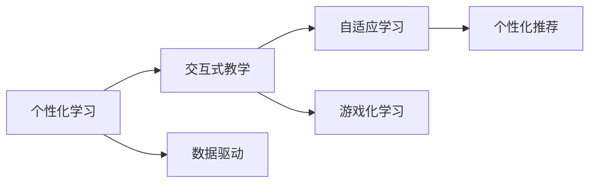

                 

## 1. 背景介绍

### 1.1 问题由来
随着人工智能(AI)技术的快速发展，尤其是深度学习和大数据分析的应用，教育行业正经历着一场深刻的变革。传统的教育模式面临诸多挑战：知识更新速度快，教学内容更新不及时；学生学习差异大，难以因材施教；教学资源分散，难以整合共享。而沉浸式学习作为AI技术在教育领域的重要应用之一，通过虚拟现实(VR)、增强现实(AR)、混合现实(MR)等多种技术手段，为教育带来了全新的体验和解决方案。

### 1.2 问题核心关键点
沉浸式学习通过虚拟现实、增强现实、混合现实等技术手段，为学习者提供沉浸式的学习体验，极大地提高了学习者的参与度和学习效率。其核心关键点包括：
- **虚拟现实(VR)**：通过3D环境和互动模拟，为学习者提供身临其境的学习体验。
- **增强现实(AR)**：将数字信息叠加到现实世界中，增强学习者的认知体验。
- **混合现实(MR)**：结合VR和AR技术，实现虚拟世界和现实世界的无缝融合。
- **个性化学习**：通过数据驱动的个性化推荐和自适应学习，适应每个学习者的需求和特点。
- **交互式教学**：通过模拟实验、互动游戏等方式，增强学习者的实践能力和创新思维。

### 1.3 问题研究意义
沉浸式学习通过将AI技术与教育深度融合，为传统教育带来了颠覆性的变革，具有重要意义：

1. **提高学习效果**：通过沉浸式学习环境，学习者可以更深刻地理解知识和技能，提高学习效率。
2. **促进创新思维**：虚拟现实和增强现实技术为学习者提供了丰富的想象空间，培养其创新思维和问题解决能力。
3. **增强学习动机**：沉浸式学习提供了丰富的互动体验，激发了学习者的学习兴趣和动机。
4. **拓展学习边界**：沉浸式学习突破了时间和空间的限制，为学习者提供了更为广阔的学习平台和资源。
5. **支持教育公平**：通过技术手段，特别是远程教育和在线学习平台，为边远地区和弱势群体提供了更多接受优质教育的机会。

## 2. 核心概念与联系

### 2.1 核心概念概述

沉浸式学习涉及多个核心概念，包括虚拟现实、增强现实、混合现实、个性化学习和交互式教学等。以下是这些概念的简要介绍：

- **虚拟现实(VR)**：通过3D渲染和互动模拟，创建一个完全虚拟的学习环境，学习者可以在其中自由探索和操作。
- **增强现实(AR)**：在现实世界中添加虚拟元素，增强学习者的认知体验，如虚拟实验室、历史场景重现等。
- **混合现实(MR)**：结合VR和AR技术，创建虚拟与现实交织的学习场景，如虚拟角色在现实世界中的互动。
- **个性化学习**：通过学习者的行为数据和偏好，定制个性化的学习计划和推荐，满足不同学习者的需求。
- **交互式教学**：利用游戏化、模拟实验等互动方式，增强学习者的实践能力和问题解决能力。

这些概念之间存在着紧密的联系，形成了一个完整的沉浸式学习生态系统。下面通过一个Mermaid流程图来展示这些概念之间的关系：

```mermaid
graph LR
    A[虚拟现实(VR)] --> B[增强现实(AR)]
    B --> C[混合现实(MR)]
    A --> D[个性化学习]
    D --> E[交互式教学]
    E --> F[学习效果]
    A --> G[学习动机]
    G --> H[学习边界]
    G --> I[教育公平]
```

这个流程图展示了虚拟现实、增强现实、混合现实、个性化学习和交互式教学之间的联系及其对学习效果、学习动机、学习边界和教育公平的影响。

### 2.2 概念间的关系

这些核心概念之间存在着复杂的相互作用和依赖关系，形成了一个动态的沉浸式学习系统。以下是详细的概念间关系分析：

#### 2.2.1 虚拟现实与增强现实的关系

```mermaid
graph LR
    A[虚拟现实(VR)] --> B[增强现实(AR)]
    B --> C[虚拟与现实的融合]
```

虚拟现实和增强现实技术虽然有所不同，但它们都是通过数字技术和传感设备，创建虚拟与现实融合的学习环境。虚拟现实主要强调完全虚拟的体验，而增强现实则是在现实世界中叠加虚拟元素。这两种技术的结合，可以创造出更加丰富和沉浸式的学习体验。

#### 2.2.2 个性化学习与交互式教学的关系



个性化学习通过数据分析和算法推荐，为学习者提供个性化的学习计划和资源。而交互式教学则通过游戏化、模拟实验等方式，增强学习者的实践能力和创新思维。二者结合，可以提供更加灵活和高效的学习体验。

#### 2.2.3 学习效果与学习动机之间的关系


学习效果和学习动机之间存在正反馈关系。良好的学习效果可以增强学习动机，而强烈的学习动机则可以促进持续学习，进一步提高学习效果。因此，通过沉浸式学习技术，可以提升学习效果，激发学习动机，形成良性循环。

## 3. 核心算法原理 & 具体操作步骤

### 3.1 算法原理概述

沉浸式学习的核心算法原理主要包括虚拟现实、增强现实和混合现实技术，以及个性化学习算法。这些技术手段的结合，实现了沉浸式学习的全场景应用。

#### 3.1.1 虚拟现实技术

虚拟现实技术主要通过3D渲染和交互模拟，创建完全虚拟的学习环境。其核心算法包括：

- **空间定位和追踪**：通过摄像头、传感器等设备，实现空间定位和跟踪，为虚拟元素在现实世界中的定位和交互提供基础。
- **3D建模和渲染**：使用三维建模软件和渲染引擎，创建逼真的虚拟场景和对象。
- **交互界面设计**：设计友好的交互界面，实现虚拟元素与学习者的互动，如点击、拖拽、旋转等操作。

#### 3.1.2 增强现实技术

增强现实技术主要通过数字信息叠加到现实世界中，增强学习者的认知体验。其核心算法包括：

- **图像识别和注册**：通过摄像头和计算机视觉技术，实现对现实世界的图像识别和注册，将虚拟元素准确叠加到现实场景中。
- **场景渲染和合成**：使用图像处理和渲染技术，将虚拟元素与现实场景无缝合成。
- **交互设计**：设计可交互的虚拟元素，实现与学习者的互动，如虚拟实验、历史场景重现等。

#### 3.1.3 混合现实技术

混合现实技术主要通过结合VR和AR技术，实现虚拟与现实的无缝融合。其核心算法包括：

- **空间融合**：将虚拟世界和现实世界的数据融合，实现虚拟元素在现实世界中的定位和交互。
- **实时渲染**：实现虚拟元素与现实世界的实时渲染和交互，提高用户体验。
- **跨平台适配**：适配多种设备和平台，确保虚拟与现实场景在不同设备上的无缝切换和体验。

### 3.2 算法步骤详解

#### 3.2.1 虚拟现实技术

1. **空间定位和追踪**：使用摄像头和传感器对学习者的动作和位置进行实时跟踪。
2. **3D建模和渲染**：创建虚拟场景和对象，并使用渲染引擎进行渲染。
3. **交互界面设计**：设计友好的交互界面，实现虚拟元素与学习者的互动。
4. **测试和优化**：测试虚拟现实系统的性能和用户体验，进行必要的优化和改进。

#### 3.2.2 增强现实技术

1. **图像识别和注册**：使用摄像头和计算机视觉技术，实现对现实世界的图像识别和注册。
2. **场景渲染和合成**：将虚拟元素与现实场景无缝合成，实现增强现实效果。
3. **交互设计**：设计可交互的虚拟元素，实现与学习者的互动。
4. **测试和优化**：测试增强现实系统的性能和用户体验，进行必要的优化和改进。

#### 3.2.3 混合现实技术

1. **空间融合**：将虚拟世界和现实世界的数据融合，实现虚拟元素在现实世界中的定位和交互。
2. **实时渲染**：实现虚拟元素与现实世界的实时渲染和交互，提高用户体验。
3. **跨平台适配**：适配多种设备和平台，确保虚拟与现实场景在不同设备上的无缝切换和体验。
4. **测试和优化**：测试混合现实系统的性能和用户体验，进行必要的优化和改进。

### 3.3 算法优缺点

#### 3.3.1 虚拟现实技术的优缺点

**优点**：
- **沉浸感强**：提供完全虚拟的学习环境，学习者可以身临其境地体验学习内容。
- **交互性强**：支持多种交互方式，增强学习者的参与度和实践能力。

**缺点**：
- **技术复杂**：需要较高的硬件要求和复杂的算法实现。
- **成本高**：设备、软件和维护成本较高，普及性有待提高。

#### 3.3.2 增强现实技术的优缺点

**优点**：
- **易于普及**：设备和软件成本相对较低，易于推广和普及。
- **场景多样**：支持多种应用场景，如虚拟实验、历史场景重现等。

**缺点**：
- **交互性有限**：虚拟元素与现实场景的交互性有限，难以提供沉浸式体验。
- **易受环境干扰**：环境光线、角度等因素会影响增强现实效果。

#### 3.3.3 混合现实技术的优缺点

**优点**：
- **融合性强**：结合了虚拟现实和增强现实技术，提供更加丰富的学习体验。
- **适应性广**：适用于多种设备和场景，具有较好的灵活性和可扩展性。

**缺点**：
- **技术复杂**：需要较高的硬件和软件支持，实现难度较大。
- **成本高**：设备、软件和维护成本较高，普及性有待提高。

### 3.4 算法应用领域

沉浸式学习技术广泛应用于多个领域，包括教育、医疗、军事、游戏等。以下是几个典型的应用场景：

#### 3.4.1 教育领域

- **虚拟实验室**：通过虚拟现实技术，创建逼真的实验环境，增强学习者的实践能力和创新思维。
- **历史场景重现**：通过增强现实技术，重现历史场景，增强学习者的历史认知和兴趣。
- **虚拟课堂**：通过混合现实技术，创建虚拟教室，实现跨地域的教学和学习。

#### 3.4.2 医疗领域

- **手术模拟**：通过虚拟现实技术，创建逼真的手术场景，增强学习者的实践能力和技能。
- **远程会诊**：通过增强现实技术，实现远程会诊和实时交互，提高医疗服务的覆盖范围和质量。
- **心理健康**：通过虚拟现实技术，创建心理治疗环境，增强治疗效果和体验。

#### 3.4.3 军事领域

- **作战模拟**：通过虚拟现实技术，创建逼真的作战场景，增强学习者的实战能力和决策能力。
- **情报分析**：通过增强现实技术，实时展示情报信息，增强情报分析的准确性和效率。
- **军事训练**：通过混合现实技术，实现虚拟与现实的融合，增强军事训练的实效性和安全性。

## 4. 数学模型和公式 & 详细讲解 & 举例说明

### 4.1 数学模型构建

沉浸式学习的数学模型主要涉及虚拟现实、增强现实和混合现实技术，以及个性化学习算法。以下是这些数学模型的简要介绍：

#### 4.1.1 虚拟现实技术

**空间定位和追踪**：
- **模型**：基于视觉传感器和惯性传感器的定位算法，如视觉SLAM和惯性SLAM。
- **公式**：
  $$
  \begin{aligned}
  \mathbf{x} &= \mathbf{R}\mathbf{p} + \mathbf{t} \\
  \mathbf{v} &= \mathbf{R}\mathbf{w} + \mathbf{b} \\
  \mathbf{a} &= \mathbf{R}\mathbf{u} + \mathbf{n} \\
  \mathbf{R} &= \mathbf{R}_0\mathbf{R}_k \\
  \mathbf{p} &= \mathbf{p}_0 + \int_0^t \mathbf{v}(\tau)d\tau \\
  \mathbf{R} &= \mathbf{R}_0\exp\left(\int_0^t \mathbf{b}(\tau)d\tau\right) \\
  \mathbf{w} &= \mathbf{w}_0 + \int_0^t \mathbf{a}(\tau)d\tau
  \end{aligned}
  $$

**3D建模和渲染**：
- **模型**：基于三维建模软件和渲染引擎的渲染算法，如ray tracing和lighting models。
- **公式**：
  $$
  \begin{aligned}
  \mathbf{I}(\mathbf{r}) &= \int_S f(\mathbf{r}, \mathbf{l}) \mathbf{l} \mathbf{n}(\mathbf{r})\delta(\mathbf{r}-\mathbf{r}_0)dS \\
  \mathbf{I}(\mathbf{r}) &= \sum_k \frac{\mathbf{A}_k(\mathbf{r})}{\mathbf{d}_k(\mathbf{r})}L(\mathbf{r}, \mathbf{l}_k)f(\mathbf{l}_k)
  \end{aligned}
  $$

**交互界面设计**：
- **模型**：基于交互设计工具和用户行为分析的算法，如UI/UX设计、用户行为建模。
- **公式**：
  $$
  \mathbf{r} = \mathbf{r}_0 + \mathbf{v}t + \frac{1}{2}\mathbf{a}t^2 \\
  \mathbf{v} = \mathbf{v}_0 + \mathbf{a}t
  $$

#### 4.1.2 增强现实技术

**图像识别和注册**：
- **模型**：基于计算机视觉技术的图像识别和注册算法，如SIFT、SURF和ORB。
- **公式**：
  $$
  \mathbf{r} = \mathbf{R} \mathbf{p} + \mathbf{t}
  $$

**场景渲染和合成**：
- **模型**：基于图像处理和渲染技术的渲染算法，如GPU渲染、OpenGL。
- **公式**：
  $$
  \mathbf{I}(\mathbf{r}) = \int_S f(\mathbf{r}, \mathbf{l}) \mathbf{l} \mathbf{n}(\mathbf{r})\delta(\mathbf{r}-\mathbf{r}_0)dS
  $$

**交互设计**：
- **模型**：基于游戏化设计和用户行为分析的算法，如交互式游戏、虚拟实验。
- **公式**：
  $$
  \mathbf{r} = \mathbf{r}_0 + \mathbf{v}t + \frac{1}{2}\mathbf{a}t^2 \\
  \mathbf{v} = \mathbf{v}_0 + \mathbf{a}t
  $$

#### 4.1.3 混合现实技术

**空间融合**：
- **模型**：基于虚拟现实和增强现实技术的融合算法，如real-time rendering、visual-inertial SLAM。
- **公式**：
  $$
  \mathbf{x} = \mathbf{R}\mathbf{p} + \mathbf{t} \\
  \mathbf{v} = \mathbf{R}\mathbf{w} + \mathbf{b} \\
  \mathbf{a} = \mathbf{R}\mathbf{u} + \mathbf{n} \\
  \mathbf{R} = \mathbf{R}_0\mathbf{R}_k \\
  \mathbf{p} = \mathbf{p}_0 + \int_0^t \mathbf{v}(\tau)d\tau \\
  \mathbf{R} = \mathbf{R}_0\exp\left(\int_0^t \mathbf{b}(\tau)d\tau\right) \\
  \mathbf{w} = \mathbf{w}_0 + \int_0^t \mathbf{a}(\tau)d\tau
  $$

**实时渲染**：
- **模型**：基于GPU渲染和实时渲染算法的渲染算法，如ray tracing、lighting models。
- **公式**：
  $$
  \mathbf{I}(\mathbf{r}) = \int_S f(\mathbf{r}, \mathbf{l}) \mathbf{l} \mathbf{n}(\mathbf{r})\delta(\mathbf{r}-\mathbf{r}_0)dS
  $$

**跨平台适配**：
- **模型**：基于多设备兼容性和实时交互的适配算法，如跨平台渲染、实时传输。
- **公式**：
  $$
  \mathbf{r} = \mathbf{r}_0 + \mathbf{v}t + \frac{1}{2}\mathbf{a}t^2 \\
  \mathbf{v} = \mathbf{v}_0 + \mathbf{a}t
  $$

### 4.2 公式推导过程

#### 4.2.1 虚拟现实技术

**空间定位和追踪**：
- **推导**：
  $$
  \begin{aligned}
  \mathbf{x} &= \mathbf{R}\mathbf{p} + \mathbf{t} \\
  \mathbf{v} &= \mathbf{R}\mathbf{w} + \mathbf{b} \\
  \mathbf{a} &= \mathbf{R}\mathbf{u} + \mathbf{n} \\
  \mathbf{R} &= \mathbf{R}_0\mathbf{R}_k \\
  \mathbf{p} &= \mathbf{p}_0 + \int_0^t \mathbf{v}(\tau)d\tau \\
  \mathbf{R} &= \mathbf{R}_0\exp\left(\int_0^t \mathbf{b}(\tau)d\tau\right) \\
  \mathbf{w} &= \mathbf{w}_0 + \int_0^t \mathbf{a}(\tau)d\tau
  \end{aligned}
  $$

**3D建模和渲染**：
- **推导**：
  $$
  \begin{aligned}
  \mathbf{I}(\mathbf{r}) &= \int_S f(\mathbf{r}, \mathbf{l}) \mathbf{l} \mathbf{n}(\mathbf{r})\delta(\mathbf{r}-\mathbf{r}_0)dS \\
  \mathbf{I}(\mathbf{r}) &= \sum_k \frac{\mathbf{A}_k(\mathbf{r})}{\mathbf{d}_k(\mathbf{r})}L(\mathbf{r}, \mathbf{l}_k)f(\mathbf{l}_k)
  \end{aligned}
  $$

**交互界面设计**：
- **推导**：
  $$
  \mathbf{r} = \mathbf{r}_0 + \mathbf{v}t + \frac{1}{2}\mathbf{a}t^2 \\
  \mathbf{v} = \mathbf{v}_0 + \mathbf{a}t
  $$

#### 4.2.2 增强现实技术

**图像识别和注册**：
- **推导**：
  $$
  \mathbf{r} = \mathbf{R} \mathbf{p} + \mathbf{t}
  $$

**场景渲染和合成**：
- **推导**：
  $$
  \mathbf{I}(\mathbf{r}) = \int_S f(\mathbf{r}, \mathbf{l}) \mathbf{l} \mathbf{n}(\mathbf{r})\delta(\mathbf{r}-\mathbf{r}_0)dS
  $$

**交互设计**：
- **推导**：
  $$
  \mathbf{r} = \mathbf{r}_0 + \mathbf{v}t + \frac{1}{2}\mathbf{a}t^2 \\
  \mathbf{v} = \mathbf{v}_0 + \mathbf{a}t
  $$

#### 4.2.3 混合现实技术

**空间融合**：
- **推导**：
  $$
  \mathbf{x} = \mathbf{R}\mathbf{p} + \mathbf{t} \\
  \mathbf{v} = \mathbf{R}\mathbf{w} + \mathbf{b} \\
  \mathbf{a} = \mathbf{R}\mathbf{u} + \mathbf{n} \\
  \mathbf{R} = \mathbf{R}_0\mathbf{R}_k \\
  \mathbf{p} = \mathbf{p}_0 + \int_0^t \mathbf{v}(\tau)d\tau \\
  \mathbf{R} = \mathbf{R}_0\exp\left(\int_0^t \mathbf{b}(\tau)d\tau\right) \\
  \mathbf{w} = \mathbf{w}_0 + \int_0^t \mathbf{a}(\tau)d\tau
  $$

**实时渲染**：
- **推导**：
  $$
  \mathbf{I}(\mathbf{r}) = \int_S f(\mathbf{r}, \mathbf{l}) \mathbf{l} \mathbf{n}(\mathbf{r})\delta(\mathbf{r}-\mathbf{r}_0)dS
  $$

**跨平台适配**：
- **推导**：
  $$
  \mathbf{r} = \mathbf{r}_0 + \mathbf{v}t + \frac{1}{2}\mathbf{a}t^2 \\
  \mathbf{v} = \mathbf{v}_0 + \mathbf{a}t
  $$

### 4.3 案例分析与讲解

#### 4.3.1 虚拟现实技术

**虚拟实验室**：
- **案例**：某大学化学系使用虚拟现实技术，创建虚拟实验室，供学生进行化学实验。学生通过虚拟实验室进行实验操作，观察实验现象，记录实验数据。
- **讲解**：
  - **空间定位和追踪**：使用摄像头和传感器对学生的操作进行实时跟踪。
  - **3D建模和渲染**：创建逼真的实验场景和实验器材，渲染效果逼真。
  - **交互界面设计**：设计友好的交互界面，实现虚拟元素与学生的操作互动。

#### 4.3.2 增强现实技术

**历史场景重现**：
- **案例**：某历史博物馆使用增强现实技术，创建历史场景，供游客互动。游客通过增强现实眼镜，观察历史场景中的虚拟元素和文字说明。
- **讲解**：
  - **图像识别和注册**：使用摄像头和计算机视觉技术，实现对历史场景的图像识别和注册。
  - **场景渲染和合成**：将虚拟元素与历史场景无缝合成，增强现实效果逼真。
  - **交互设计**：设计可交互的虚拟元素，实现与游客的互动。

#### 4.3.3 混合现实技术

**虚拟与现实的融合**：
- **案例**：某军事训练中心使用混合现实技术，创建虚拟与现实的融合场景，供士兵进行军事训练。士兵通过增强现实眼镜，观察虚拟元素和现实场景的融合效果。
- **讲解**：
  - **空间融合**：将虚拟世界和现实世界的数据融合，实现虚拟元素在现实世界中的定位和交互。
  - **实时渲染**：实现虚拟元素与现实世界的实时渲染和交互，提高用户体验。
  - **跨平台适配**：适配多种设备和平台，确保虚拟与现实场景在不同设备上的无缝切换和体验。

## 5. 项目实践：代码实例和详细解释说明

### 5.1 开发环境搭建

在进行沉浸式学习项目实践前，我们需要准备好开发环境。以下是使用Unity和C#进行开发的环境配置流程：

1. **安装Unity Hub**：从官网下载并安装Unity Hub，用于创建和部署Unity项目。
2. **安装Unity编辑器**：选择相应的Unity编辑器版本，并进行安装。
3. **安装VR设备和SDK**：安装VR设备（如Oculus Rift）和相关SDK（如Unity SDK）。
4. **安装ARSDK**：安装增强现实SDK（如ARKit、ARCore），用于实现增强现实功能。
5. **安装混合现实SDK**：安装混合现实SDK（如MR Kit），用于实现虚拟与现实的融合。
6. **安装交互设计工具**：安装游戏设计工具（如Unity Asset Store），用于

