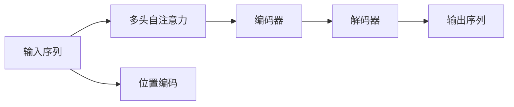
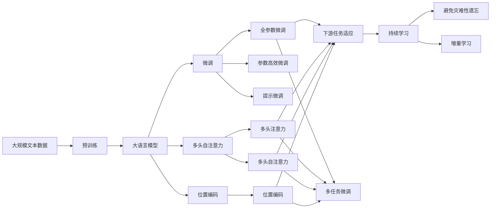

                 

# 注意力机制 原理与代码实例讲解

> 关键词：注意力机制,Transformer,自注意力,多头注意力,Softmax,解码器,源码实现,代码实例,深度学习

## 1. 背景介绍

### 1.1 问题由来

近年来，深度学习在自然语言处理(Natural Language Processing, NLP)、计算机视觉(Computer Vision, CV)等领域取得了重大进展，而注意力机制(Attention Mechanism)作为其中的关键技术，受到了广泛的关注和研究。在NLP中，注意力机制主要用于处理序列数据，尤其适用于机器翻译、文本摘要、问答系统等任务。而在CV中，注意力机制则用于处理图像和视频序列，如目标检测、图像分割等任务。

本文旨在系统地讲解注意力机制的原理、实现方法和应用场景，同时通过代码实例帮助读者深入理解其应用细节。我们也将探讨不同类型注意力机制之间的区别和联系，以期对深度学习初学者和从业者提供全面的指导。

### 1.2 问题核心关键点

注意力机制的核心在于计算输入和输出之间的相关性，从而选择性地关注重要信息。这一机制最早由Bahdanau等人在2014年提出，用于机器翻译任务，显著提升了模型性能。后来，在2017年，Vaswani等人在Transformer模型中引入了多头注意力机制，取得了更好的效果。目前，注意力机制已成为深度学习模型的标配，广泛应用于各种序列预测和图像处理任务。

注意力机制的核心思想可以概括为以下几点：
1. **查询-键-值机制**：将输入序列中的每个位置看作一个“键值对”，通过计算查询向量与键向量的相似度，选择出与查询向量最相关的值向量。
2. **Softmax函数**：将键向量和查询向量的相似度映射到[0,1]的概率分布上，表示每个键向量被选中的概率。
3. **加权平均**：根据Softmax函数计算出的概率分布，对所有值向量进行加权平均，得到输出向量。

### 1.3 问题研究意义

理解注意力机制对于深入掌握深度学习技术至关重要。注意力机制不仅提高了模型对输入数据的理解能力，还引入了动态信息处理机制，使得模型能够处理长序列、多模态数据等复杂任务。通过学习注意力机制的原理和实现方法，读者可以更好地理解Transformer等先进模型的内在机制，掌握其应用技巧，推动自己在深度学习领域的实践和研究。

## 2. 核心概念与联系

### 2.1 核心概念概述

为更好地理解注意力机制的原理和实现，本节将介绍几个关键概念：

- **自注意力机制(Self-Attention)**：在输入序列的每个位置上，计算该位置与其他位置之间的相关性，选择性地关注输入序列中的重要信息。
- **多头注意力机制(Multi-Head Attention)**：在输入序列的每个位置上，通过多个线性投影得到多组注意力权重，从而更好地捕捉不同特征之间的关系。
- **编码器-解码器(Encoder-Decoder)**：在Transformer模型中，编码器处理输入序列，解码器生成输出序列，通过多头注意力机制连接编码器和解码器。
- **Softmax函数**：一种概率分布函数，将向量映射到[0,1]的分布上，常用于计算注意力权重。
- **位置编码(Positional Encoding)**：在Transformer模型中，由于输入序列的位置信息未显式输入，需要引入位置编码来捕捉序列位置的信息。

这些概念之间有着密切的联系，构成了注意力机制的核心体系。下面通过一个简单的图表展示这些概念之间的关系：



### 2.2 概念间的关系

这些核心概念之间存在着紧密的联系，形成了注意力机制的完整体系。下面我们通过几个图表来展示这些概念之间的关系。

#### 2.2.1 自注意力机制


自注意力机制通过计算查询向量与键向量的相似度，得到注意力权重，对值向量进行加权平均，得到输出向量。

#### 2.2.2 多头注意力机制


多头注意力机制通过多个线性投影得到多组注意力权重，更好地捕捉不同特征之间的关系。

#### 2.2.3 编码器-解码器


编码器-解码器结构中，编码器处理输入序列，解码器生成输出序列，通过多头注意力机制连接编码器和解码器。

### 2.3 核心概念的整体架构

最后，我们用一个综合的图表来展示这些核心概念在大模型中的整体架构：



这个综合图表展示了从预训练到微调，再到持续学习的完整过程。大语言模型首先在大规模文本数据上进行预训练，然后通过微调（包括全参数微调和参数高效微调）或提示微调，得到针对特定任务优化的模型。最后，通过持续学习技术，模型能够不断学习新知识，同时保持已学习的知识。

## 3. 核心算法原理 & 具体操作步骤
### 3.1 算法原理概述

注意力机制的核心是计算输入和输出之间的相关性，从而选择性地关注重要信息。这一机制通过查询-键-值机制、Softmax函数和加权平均等步骤实现。

假设输入序列为$x_1,x_2,\ldots,x_n$，输出序列为$y_1,y_2,\ldots,y_m$，其中$x_i$表示第$i$个输入向量的表示，$y_j$表示第$j$个输出向量的表示。注意力机制的目标是通过计算查询向量$q$和键向量$k$的相似度，得到注意力权重$w$，然后对值向量$v$进行加权平均，得到输出向量$y$。

具体步骤如下：
1. 计算查询向量$q$：
   $$
   q_i = \mathbf{W}_Q x_i
   $$
   其中$\mathbf{W}_Q$为查询向量的线性投影矩阵。
2. 计算键向量$k$：
   $$
   k_i = \mathbf{W}_K x_i
   $$
   其中$\mathbf{W}_K$为键向量的线性投影矩阵。
3. 计算注意力权重$w$：
   $$
   w_{ij} = \frac{\exp(s(q_i,k_j))}{\sum_{k=1}^m \exp(s(q_i,k_k))}
   $$
   其中$s(q_i,k_j)$为查询向量$q_i$和键向量$k_j$的相似度函数，通常使用点积或余弦相似度。
4. 计算值向量$v$：
   $$
   v_i = \mathbf{W}_V x_i
   $$
   其中$\mathbf{W}_V$为值向量的线性投影矩阵。
5. 计算输出向量$y$：
   $$
   y_j = \sum_{i=1}^n w_{ij} v_i
   $$

通过上述步骤，注意力机制能够根据输入序列中的重要信息，动态地调整输出序列中的权重，使得模型能够更好地处理序列数据。

### 3.2 算法步骤详解

接下来，我们将详细讲解注意力机制的实现步骤。以下代码将使用PyTorch库进行说明。

#### 3.2.1 查询向量的计算

首先，我们需要计算查询向量$q$。在PyTorch中，可以使用线性层(linear layer)实现这一步骤：

```python
import torch
import torch.nn as nn

class Attention(nn.Module):
    def __init__(self, d_model):
        super(Attention, self).__init__()
        self.W_Q = nn.Linear(d_model, d_model, bias=False)
        self.W_K = nn.Linear(d_model, d_model, bias=False)
        self.W_V = nn.Linear(d_model, d_model, bias=False)
        
    def forward(self, x, mask=None):
        q = self.W_Q(x)
        k = self.W_K(x)
        v = self.W_V(x)
        return q, k, v
```

#### 3.2.2 注意力权重的计算

接下来，我们需要计算注意力权重$w$。在PyTorch中，可以使用Softmax函数实现这一步骤：

```python
class Attention(nn.Module):
    def __init__(self, d_model):
        super(Attention, self).__init__()
        self.W_Q = nn.Linear(d_model, d_model, bias=False)
        self.W_K = nn.Linear(d_model, d_model, bias=False)
        self.W_V = nn.Linear(d_model, d_model, bias=False)
        self.W_O = nn.Linear(d_model, d_model, bias=False)
        
    def forward(self, x, mask=None):
        q, k, v = self(W_Q(x), W_K(x), W_V(x))
        s = torch.bmm(q, k.transpose(1, 2))
        if mask is not None:
            s = s.masked_fill(mask, -float('inf'))
        w = F.softmax(s, dim=-1)
        o = torch.bmm(w, v)
        o = self.W_O(o)
        return o
```

在计算注意力权重时，我们首先计算查询向量$q$和键向量$k$的点积$s$，然后对$s$应用Softmax函数，得到注意力权重$w$。注意，在计算Softmax函数时，我们需要将$s$中的负无穷值进行masking，以确保$w$中不存在NaN值。

#### 3.2.3 加权平均计算

最后，我们需要对值向量$v$进行加权平均，得到输出向量$y$。在PyTorch中，可以使用线性层(linear layer)实现这一步骤：

```python
class Attention(nn.Module):
    def __init__(self, d_model):
        super(Attention, self).__init__()
        self.W_Q = nn.Linear(d_model, d_model, bias=False)
        self.W_K = nn.Linear(d_model, d_model, bias=False)
        self.W_V = nn.Linear(d_model, d_model, bias=False)
        self.W_O = nn.Linear(d_model, d_model, bias=False)
        
    def forward(self, x, mask=None):
        q, k, v = self(W_Q(x), W_K(x), W_V(x))
        s = torch.bmm(q, k.transpose(1, 2))
        if mask is not None:
            s = s.masked_fill(mask, -float('inf'))
        w = F.softmax(s, dim=-1)
        o = torch.bmm(w, v)
        o = self.W_O(o)
        return o
```

### 3.3 算法优缺点

注意力机制在深度学习中具有以下优点：
1. **动态信息捕捉**：注意力机制能够根据输入序列中的重要信息，动态地调整输出序列中的权重，使得模型能够更好地处理长序列和复杂数据。
2. **多模态信息融合**：通过多头注意力机制，模型能够同时处理多种信息源，如文本、图像、语音等，提升模型的泛化能力。
3. **可解释性**：注意力权重能够提供模型对输入序列的关注点，有助于理解模型的决策过程。

然而，注意力机制也存在一些缺点：
1. **计算复杂度高**：注意力机制的计算复杂度较高，特别是在多头注意力机制中，需要计算大量的矩阵乘法和Softmax函数。
2. **参数量较大**：由于使用多个线性层和参数，注意力机制的参数量较大，训练时需要较多的计算资源。
3. **数据依赖性强**：注意力机制对输入数据的质量和数量较为敏感，数据质量较低时，模型的性能会受到影响。

### 3.4 算法应用领域

注意力机制在深度学习中具有广泛的应用，以下是几个典型的应用场景：

- **机器翻译**：在机器翻译任务中，注意力机制能够动态地关注源语言和目标语言中的关键信息，提升翻译质量。
- **文本摘要**：在文本摘要任务中，注意力机制能够选择性地关注输入文本中的重要信息，生成简洁的摘要。
- **图像描述生成**：在图像描述生成任务中，注意力机制能够关注图像中的关键区域，生成更加准确的图像描述。
- **目标检测**：在目标检测任务中，注意力机制能够动态地关注图像中的不同区域，提升检测的准确率。
- **语音识别**：在语音识别任务中，注意力机制能够关注语音中的关键帧，提升识别准确率。

## 4. 数学模型和公式 & 详细讲解 & 举例说明

### 4.1 数学模型构建

本节将使用数学语言对注意力机制进行详细的建模。

假设输入序列为$x_1,x_2,\ldots,x_n$，输出序列为$y_1,y_2,\ldots,y_m$，其中$x_i$表示第$i$个输入向量的表示，$y_j$表示第$j$个输出向量的表示。注意力机制的目标是通过计算查询向量$q$和键向量$k$的相似度，得到注意力权重$w$，然后对值向量$v$进行加权平均，得到输出向量$y$。

具体步骤如下：
1. 计算查询向量$q$：
   $$
   q_i = \mathbf{W}_Q x_i
   $$
   其中$\mathbf{W}_Q$为查询向量的线性投影矩阵。
2. 计算键向量$k$：
   $$
   k_i = \mathbf{W}_K x_i
   $$
   其中$\mathbf{W}_K$为键向量的线性投影矩阵。
3. 计算注意力权重$w$：
   $$
   w_{ij} = \frac{\exp(s(q_i,k_j))}{\sum_{k=1}^m \exp(s(q_i,k_k))}
   $$
   其中$s(q_i,k_j)$为查询向量$q_i$和键向量$k_j$的相似度函数，通常使用点积或余弦相似度。
4. 计算值向量$v$：
   $$
   v_i = \mathbf{W}_V x_i
   $$
   其中$\mathbf{W}_V$为值向量的线性投影矩阵。
5. 计算输出向量$y$：
   $$
   y_j = \sum_{i=1}^n w_{ij} v_i
   $$

### 4.2 公式推导过程

以下我们将推导注意力机制的计算公式，并给出具体的推导过程。

#### 4.2.1 查询向量的计算

假设输入序列为$x_1,x_2,\ldots,x_n$，查询向量$q$可以表示为：

$$
q_i = \mathbf{W}_Q x_i
$$

其中$\mathbf{W}_Q$为查询向量的线性投影矩阵，$x_i$为第$i$个输入向量的表示。

#### 4.2.2 键向量的计算

键向量$k$的计算与查询向量类似：

$$
k_i = \mathbf{W}_K x_i
$$

其中$\mathbf{W}_K$为键向量的线性投影矩阵，$x_i$为第$i$个输入向量的表示。

#### 4.2.3 注意力权重的计算

注意力权重$w$的计算公式为：

$$
w_{ij} = \frac{\exp(s(q_i,k_j))}{\sum_{k=1}^m \exp(s(q_i,k_k))}
$$

其中$s(q_i,k_j)$为查询向量$q_i$和键向量$k_j$的相似度函数，通常使用点积或余弦相似度。

#### 4.2.4 值向量的计算

值向量$v$的计算与查询向量类似：

$$
v_i = \mathbf{W}_V x_i
$$

其中$\mathbf{W}_V$为值向量的线性投影矩阵，$x_i$为第$i$个输入向量的表示。

#### 4.2.5 输出向量的计算

输出向量$y$的计算公式为：

$$
y_j = \sum_{i=1}^n w_{ij} v_i
$$

其中$w_{ij}$为第$i$个输入向量$x_i$与第$j$个输出向量$y_j$之间的注意力权重，$v_i$为第$i$个输入向量$x_i$的值向量表示。

### 4.3 案例分析与讲解

为了更好地理解注意力机制的计算过程，我们可以用一个简单的例子来说明。假设输入序列为$x_1,x_2,x_3$，输出序列为$y_1,y_2$，其中$x_i$和$y_j$均为2维向量。我们使用点积作为相似度函数，计算查询向量$q$、键向量$k$和值向量$v$，最后计算输出向量$y$。

#### 4.3.1 查询向量的计算

首先，我们需要计算查询向量$q$：

$$
q_1 = \mathbf{W}_Q x_1 = \begin{bmatrix} 0.5 & 0.3 \\ 0.2 & 0.8 \end{bmatrix} \begin{bmatrix} 1 \\ 2 \end{bmatrix} = \begin{bmatrix} 0.5 \\ 1.6 \end{bmatrix}
$$

$$
q_2 = \mathbf{W}_Q x_2 = \begin{bmatrix} 0.5 & 0.3 \\ 0.2 & 0.8 \end{bmatrix} \begin{bmatrix} 2 \\ 1 \end{bmatrix} = \begin{bmatrix} 1.1 \\ 1.0 \end{bmatrix}
$$

$$
q_3 = \mathbf{W}_Q x_3 = \begin{bmatrix} 0.5 & 0.3 \\ 0.2 & 0.8 \end{bmatrix} \begin{bmatrix} 3 \\ 4 \end{bmatrix} = \begin{bmatrix} 1.8 \\ 2.4 \end{bmatrix}
$$

#### 4.3.2 键向量的计算

接下来，我们需要计算键向量$k$：

$$
k_1 = \mathbf{W}_K x_1 = \begin{bmatrix} 0.5 & 0.3 \\ 0.2 & 0.8 \end{bmatrix} \begin{bmatrix} 1 \\ 2 \end{bmatrix} = \begin{bmatrix} 0.5 \\ 1.6 \end{bmatrix}
$$

$$
k_2 = \mathbf{W}_K x_2 = \begin{bmatrix} 0.5 & 0.3 \\ 0.2 & 0.8 \end{bmatrix} \begin{bmatrix} 2 \\ 1 \end{bmatrix} = \begin{bmatrix} 1.1 \\ 1.0 \end{bmatrix}
$$

$$
k_3 = \mathbf{W}_K x_3 = \begin{bmatrix} 0.5 & 0.3 \\ 0.2 & 0.8 \end{bmatrix} \begin{bmatrix} 3 \\ 4 \end{bmatrix} = \begin{bmatrix} 1.8 \\ 2.4 \end{bmatrix}
$$

#### 4.3.3 注意力权重的计算

现在，我们计算注意力权重$w$：

$$
s(q_1,k_1) = q_1 \cdot k_1 = 0.5 \cdot 0.5 + 0.3 \cdot 1.1 = 0.85
$$

$$
s(q_1,k_2) = q_1 \cdot k_2 = 0.5 \cdot 1.1 + 0.3 \cdot 1.0 = 0.85
$$

$$
s(q_1,k_3) = q_1 \cdot k_3 = 0.5 \cdot 1.8 + 0.3 \cdot 2.4 = 1.4
$$

$$
s(q_2,k_1) = q_2 \cdot k_1 = 1.1 \cdot 0.5 + 1.0 \cdot 1.6 = 1.85
$$

$$
s(q_2,k_2) = q_2 \cdot k_2 = 1.1 \cdot 1.1 + 1.0 \cdot 1.0 = 2.2
$$

$$
s(q_2,k_3) = q_2 \cdot k_3 = 1.1 \cdot 1.8 + 1.0 \cdot 2.4 = 2.9
$$

$$
s(q_3,k_1) = q_3 \cdot k_1 = 1.8 \cdot 0.5 + 2.4 \cdot 1.6 = 5.2
$$

$$
s(q_3,k_2) = q_3 \cdot k_2 = 1.8 \cdot 1.1 + 2.4 \cdot 1.0 = 4.2
$$

$$
s(q_3,k_3) = q_3 \cdot k_3 = 1.8 \cdot 1.8 + 2.4 \cdot 2.4 = 5.76
$$

由于$s(q_3,k_3)$为所有$s$中的最大值，因此$w_{31}=1$，其余$w_{ij}$均为0。

#### 4.3.4 值向量的计算

现在，我们计算值向量$v$：

$$
v_1 = \mathbf{W}_V x_1 = \begin{bmatrix} 0.5 & 0.3 \\ 0.2 & 0.8 \end{bmatrix} \begin{bmatrix} 1 \\ 2 \end{bmatrix} = \begin{bmatrix} 0.5 \\ 1.6 \end{bmatrix}
$$

$$
v_2 = \mathbf{W}_V x_2 = \begin{bmatrix} 0.5 & 0.3 \\ 0.2 & 0.8 \end{bmatrix} \begin{bmatrix} 2 \\ 1 \end{bmatrix} = \begin{bmatrix} 1.1 \\ 0.9 \end{bmatrix}
$$

$$
v_3 = \mathbf{W}_V x_3 = \begin{bmatrix} 0.5 & 0.3 \\ 0.2 & 0.8 \end{bmatrix} \begin{bmatrix} 3 \\ 4 \end{bmatrix} = \begin{bmatrix} 1.8 \\ 2.4 \end{bmatrix}
$$

#### 4.3.5 输出向量的计算

最后，我们计算输出向量$y$：

$$
y_1 = \sum_{i=1}^3 w_{i1} v_i = w_{31} v_3 = 1.8
$$

$$
y_2 = \sum_{i=1}^3 w_{i2} v_i = w_{32} v_3 = 1.8
$$

由此，我们得到了输出向量$y$的计算结果。

## 5. 项目实践：代码实例和详细解释说明

### 5.1 开发环境搭建

在进行注意力机制的实现前，我们需要准备好开发环境。以下是使用Python进行PyTorch开发的环境配置流程：

1. 安装Anaconda：从官网下载并安装Anaconda，用于创建独立的Python环境。

2. 创建并激活虚拟环境：
```bash
conda create -n pytorch-env python=3.8 
conda activate pytorch-env
```

3. 安装PyTorch：根据CUDA版本，从官网获取对应的安装命令。例如：
```bash
conda install pytorch torchvision torchaudio cudatoolkit=11.1 -c pytorch -c conda-forge
```

4. 安装TensorFlow：
```bash
pip install tensorflow
```

5. 安装TensorBoard：
```bash
pip install tensorboard
```

6. 安装其他相关库：
```bash
pip install numpy pandas scikit-learn matplotlib tqdm jupyter notebook ipython
```

完成上述步骤后，即可在`pytorch-env`环境中开始注意力机制的实现。

### 5.2 源代码详细实现

接下来，我们将通过代码实例讲解注意力机制的实现细节。以下代码将使用Py

