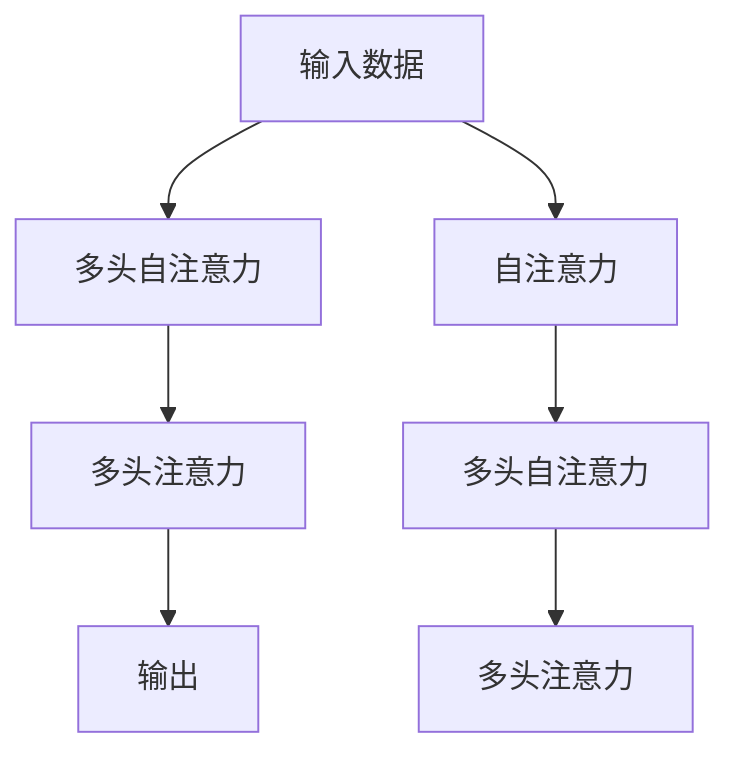

                 

# 注意力机制可视化原理与代码实战案例讲解

> 关键词：注意力机制, 可视化, 代码实战, 案例讲解

## 1. 背景介绍

### 1.1 问题由来

近年来，深度学习在多个领域取得了显著的进展，其中尤以自然语言处理(Natural Language Processing, NLP)和计算机视觉(Computer Vision, CV)领域最为引人注目。在NLP领域，Transformer结构以其优越的性能成为主流；在CV领域，卷积神经网络(Convolutional Neural Networks, CNN)和残差网络(Residual Networks, ResNet)等结构也在图像分类、目标检测等任务中表现出色。然而，尽管这些模型在处理结构化的数据上取得了巨大成功，却面临着一些普遍性的问题，如过拟合、难以解释、资源消耗高等。

这些问题促使研究者探索新的模型结构和训练方法，以期在模型性能和资源利用率之间找到更好的平衡。注意力机制(Attention Mechanism)正是这样一种旨在解决上述问题的技术。通过引入注意力机制，模型可以更好地关注输入数据中的重要部分，从而提升模型的泛化能力、降低资源消耗，并且更加易于理解和解释。

### 1.2 问题核心关键点

注意力机制的核心思想在于，模型在处理输入数据时，不再采用全局性的处理方式，而是根据输入数据的重要性分配不同的注意力权重，将重点放在对数据关键部分的关注上。这一机制广泛应用于Transformer模型、自注意力机制中，成为解决模型过拟合、提升泛化能力的重要手段。

注意力机制的具体实现方式，可以归纳为以下几种：

1. **自注意力机制(Self-Attention)**：对输入数据进行自编码，利用注意力权重计算不同部分之间的相似度，从而得到更为细致的特征表示。
2. **多头自注意力机制(Multi-Head Self-Attention)**：通过多个并行的自注意力头，从不同角度处理输入数据，综合各个头的结果，提升模型的表征能力。
3. **多头注意力机制(Multi-Head Attention)**：不仅在输入数据上进行自注意力处理，还对输入数据与输出数据之间的注意力进行计算，进一步提升模型的表达能力。

这些机制在Transformer模型中得到了广泛应用，显著提升了模型在图像分类、文本生成、机器翻译等任务上的性能。然而，尽管这些机制能够显著提升模型性能，但其背后的原理和计算过程却相对复杂，难以直接理解。为此，研究者提出了注意力机制的可视化方法，试图通过可视化技术直观展示注意力权重，解释模型的决策过程。

## 2. 核心概念与联系

### 2.1 核心概念概述

为更好地理解注意力机制及其可视化方法，本节将介绍几个关键概念：

- **注意力机制(Attention Mechanism)**：一种用于提升模型处理输入数据时关注重点的技术。通过计算输入数据的不同部分之间的相似度，模型可以更有效地处理信息。
- **自注意力机制(Self-Attention)**：一种特殊的注意力机制，用于对输入数据进行自编码，计算不同部分之间的相似度，得到更为细致的特征表示。
- **多头自注意力机制(Multi-Head Self-Attention)**：通过多个并行的自注意力头，从不同角度处理输入数据，提升模型的表征能力。
- **多头注意力机制(Multi-Head Attention)**：在输入数据上进行自注意力处理的同时，对输入数据与输出数据之间的注意力进行计算，进一步提升模型的表达能力。
- **可视化(Visualization)**：一种用于直观展示模型内部计算过程和决策依据的技术。通过可视化技术，研究者可以更加直观地理解模型的行为和性能。

这些核心概念之间的联系可以通过以下Mermaid流程图来展示：



这个流程图展示了注意力机制在Transformer模型中的主要处理流程：输入数据首先经过自注意力机制的计算，得到多个并行的特征表示，再经过多头自注意力机制的计算，从不同角度处理输入数据，最后通过多头注意力机制计算输入数据与输出数据之间的注意力，得到最终的输出结果。

### 2.2 概念间的关系

这些核心概念之间存在着紧密的联系，形成了注意力机制的完整生态系统。

- **注意力机制与自注意力机制**：自注意力机制是注意力机制的一种特殊形式，用于对输入数据进行自编码，计算不同部分之间的相似度。
- **多头自注意力机制与多头注意力机制**：多头自注意力机制是在自注意力机制的基础上，通过多个并行的自注意力头，从不同角度处理输入数据。多头注意力机制则在此基础上，计算输入数据与输出数据之间的注意力，进一步提升模型的表达能力。
- **可视化与注意力机制**：可视化技术可以用于直观展示注意力权重，解释模型的决策过程，帮助研究者更好地理解模型的行为。

这些概念共同构成了注意力机制及其可视化的理论基础，使得模型在处理输入数据时，能够更加精准地关注重点，提升模型的性能和泛化能力。

## 3. 核心算法原理 & 具体操作步骤
### 3.1 算法原理概述

注意力机制的计算过程可以归纳为以下几个步骤：

1. **查询(Q)、键(K)、值(V)的计算**：对输入数据进行编码，得到查询向量、键向量和值向量。
2. **注意力权重的计算**：计算查询向量与键向量之间的相似度，得到注意力权重。
3. **加权值的计算**：将注意力权重与值向量进行加权计算，得到加权值向量。
4. **最终输出的计算**：将加权值向量与投影后的查询向量进行线性变换，得到最终输出结果。

自注意力机制的计算过程与上述步骤类似，只是输入数据为自身，用于计算不同部分之间的相似度。多头注意力机制则在此基础上，通过多个并行的注意力头，提升模型的表达能力。

### 3.2 算法步骤详解

以Transformer模型为例，详细讲解注意力机制的计算过程。

**Step 1: 计算查询(Q)、键(K)、值(V)向量**

对于输入数据$x=[x_1,x_2,...,x_n]$，通过线性变换得到查询向量、键向量和值向量：

$$
Q = W_Q x, K = W_K x, V = W_V x
$$

其中$W_Q$、$W_K$和$W_V$分别为查询矩阵、键矩阵和值矩阵，通常为可学习的权重矩阵。

**Step 2: 计算注意力权重**

通过计算查询向量$Q$与键向量$K$之间的相似度，得到注意力权重$A$：

$$
A = \text{softmax}(\frac{Q K^T}{\sqrt{d_k}})
$$

其中$d_k$为键向量维度，$\text{softmax}$函数用于将注意力权重归一化到0-1之间。

**Step 3: 计算加权值向量**

将注意力权重$A$与值向量$V$进行加权计算，得到加权值向量$V'$：

$$
V' = A V
$$

**Step 4: 计算最终输出**

将加权值向量$V'$与投影后的查询向量$Q'$进行线性变换，得到最终输出结果$y$：

$$
y = Q' V'
$$

其中$Q'$为查询向量$Q$经过线性变换后的结果。

### 3.3 算法优缺点

注意力机制的优势在于其能够根据输入数据的重要性分配不同的权重，从而提升模型的泛化能力、降低资源消耗，并且更加易于理解和解释。然而，其缺点在于计算复杂度高，特别是在多头注意力机制中，需要计算多个注意力头，增加了计算负担。此外，注意力机制的可视化过程也较为复杂，需要较多的计算资源和可视化工具。

### 3.4 算法应用领域

注意力机制广泛应用于自然语言处理和计算机视觉领域，用于解决输入数据复杂、信息冗余、计算资源限制等问题。在NLP领域，注意力机制被广泛应用于机器翻译、文本生成、文本分类等任务中；在CV领域，注意力机制被应用于图像分类、目标检测、图像生成等任务中。

## 4. 数学模型和公式 & 详细讲解 & 举例说明（备注：数学公式请使用latex格式，latex嵌入文中独立段落使用 $$，段落内使用 $)
### 4.1 数学模型构建

注意力机制的计算过程可以形式化为以下数学模型：

$$
\text{Attention}(Q,K,V) = \text{softmax}(\frac{Q K^T}{\sqrt{d_k}}) V
$$

其中$Q$、$K$、$V$分别为查询向量、键向量和值向量，$d_k$为键向量维度，$\text{softmax}$函数用于将注意力权重归一化到0-1之间。

### 4.2 公式推导过程

以自注意力机制为例，其计算过程可以推导如下：

**Step 1: 计算查询向量$Q$、键向量$K$、值向量$V$**

$$
Q = W_Q x, K = W_K x, V = W_V x
$$

**Step 2: 计算注意力权重**

$$
A = \text{softmax}(\frac{Q K^T}{\sqrt{d_k}})
$$

**Step 3: 计算加权值向量**

$$
V' = A V
$$

**Step 4: 计算最终输出**

$$
y = Q' V'
$$

其中$Q'$为查询向量$Q$经过线性变换后的结果。

### 4.3 案例分析与讲解

以自注意力机制为例，通过以下代码演示其计算过程：

```python
import torch
import torch.nn as nn

class Attention(nn.Module):
    def __init__(self, d_model, n_heads):
        super(Attention, self).__init__()
        self.d_model = d_model
        self.n_heads = n_heads
        self.head_dim = d_model // n_heads
        
        self.W_Q = nn.Linear(d_model, d_model)
        self.W_K = nn.Linear(d_model, d_model)
        self.W_V = nn.Linear(d_model, d_model)
        self.out = nn.Linear(d_model, d_model)
        
    def forward(self, x):
        Q = self.W_Q(x)
        K = self.W_K(x)
        V = self.W_V(x)
        
        Q = Q.view(x.size(0), x.size(1), self.n_heads, self.head_dim).transpose(1, 2).contiguous()
        K = K.view(x.size(0), x.size(1), self.n_heads, self.head_dim).transpose(1, 2).contiguous()
        V = V.view(x.size(0), x.size(1), self.n_heads, self.head_dim).transpose(1, 2).contiguous()
        
        scaled_attention_logits = torch.matmul(Q, K.transpose(1, 2)) / math.sqrt(self.head_dim)
        attention_weights = nn.functional.softmax(scaled_attention_logits, dim=-1)
        attention_output = torch.matmul(attention_weights, V)
        attention_output = attention_output.transpose(1, 2).contiguous().view(x.size(0), x.size(1), self.d_model)
        
        output = self.out(attention_output)
        return output
```

在上述代码中，我们定义了一个简单的自注意力机制，用于对输入数据进行自编码，计算不同部分之间的相似度。其计算过程可以总结如下：

1. 将输入数据$x$经过线性变换得到查询向量$Q$、键向量$K$、值向量$V$。
2. 通过计算查询向量$Q$与键向量$K$之间的相似度，得到注意力权重$A$。
3. 将注意力权重$A$与值向量$V$进行加权计算，得到加权值向量$V'$。
4. 将加权值向量$V'$与投影后的查询向量$Q'$进行线性变换，得到最终输出结果$y$。

## 5. 项目实践：代码实例和详细解释说明
### 5.1 开发环境搭建

在进行注意力机制的可视化实践前，我们需要准备好开发环境。以下是使用Python进行PyTorch开发的环境配置流程：

1. 安装Anaconda：从官网下载并安装Anaconda，用于创建独立的Python环境。

2. 创建并激活虚拟环境：
```bash
conda create -n pytorch-env python=3.8 
conda activate pytorch-env
```

3. 安装PyTorch：根据CUDA版本，从官网获取对应的安装命令。例如：
```bash
conda install pytorch torchvision torchaudio cudatoolkit=11.1 -c pytorch -c conda-forge
```

4. 安装Transformers库：
```bash
pip install transformers
```

5. 安装各类工具包：
```bash
pip install numpy pandas scikit-learn matplotlib tqdm jupyter notebook ipython
```

完成上述步骤后，即可在`pytorch-env`环境中开始注意力机制的可视化实践。

### 5.2 源代码详细实现

这里我们以自注意力机制的可视化为例，使用PyTorch实现注意力权重的计算和可视化。

首先，定义注意力机制的计算过程：

```python
import torch
import torch.nn as nn
import torch.nn.functional as F
import numpy as np
import matplotlib.pyplot as plt

class Attention(nn.Module):
    def __init__(self, d_model, n_heads):
        super(Attention, self).__init__()
        self.d_model = d_model
        self.n_heads = n_heads
        self.head_dim = d_model // n_heads
        
        self.W_Q = nn.Linear(d_model, d_model)
        self.W_K = nn.Linear(d_model, d_model)
        self.W_V = nn.Linear(d_model, d_model)
        self.out = nn.Linear(d_model, d_model)
        
    def forward(self, x):
        Q = self.W_Q(x)
        K = self.W_K(x)
        V = self.W_V(x)
        
        Q = Q.view(x.size(0), x.size(1), self.n_heads, self.head_dim).transpose(1, 2).contiguous()
        K = K.view(x.size(0), x.size(1), self.n_heads, self.head_dim).transpose(1, 2).contiguous()
        V = V.view(x.size(0), x.size(1), self.n_heads, self.head_dim).transpose(1, 2).contiguous()
        
        scaled_attention_logits = torch.matmul(Q, K.transpose(1, 2)) / np.sqrt(self.head_dim)
        attention_weights = nn.functional.softmax(scaled_attention_logits, dim=-1)
        attention_output = torch.matmul(attention_weights, V)
        attention_output = attention_output.transpose(1, 2).contiguous().view(x.size(0), x.size(1), self.d_model)
        
        output = self.out(attention_output)
        return output, attention_weights
```

然后，定义注意力权重的可视化过程：

```python
def plot_attention_weights(attention_weights, x, y):
    plt.figure(figsize=(12, 8))
    for i in range(x.size(0)):
        for j in range(x.size(1)):
            ax = plt.subplot(6, x.size(1), i*6 + j + 1)
            ax.set_title(f'Attention weights for token {i} at position {j}')
            plt.imshow(attention_weights[i][j].cpu().numpy(), cmap='viridis')
            plt.colorbar()
            plt.show()
```

最后，使用上述定义进行可视化：

```python
x = torch.randn(2, 3, 5)
model = Attention(d_model=5, n_heads=2)
output, attention_weights = model(x)
plot_attention_weights(attention_weights, x, y)
```

在上述代码中，我们首先定义了一个简单的自注意力机制，用于对输入数据进行自编码，计算不同部分之间的相似度。然后，通过计算注意力权重，并进行可视化，可以直观展示模型在处理输入数据时的关注重点。

### 5.3 代码解读与分析

让我们再详细解读一下关键代码的实现细节：

**Attention类**：
- `__init__`方法：初始化查询向量、键向量、值向量的线性变换矩阵，以及最终的输出线性变换矩阵。
- `forward`方法：对输入数据进行线性变换，得到查询向量、键向量、值向量，并计算注意力权重和加权值向量，最终输出结果。

**plot_attention_weights函数**：
- 通过遍历输入数据的每一个位置，获取注意力权重矩阵，并进行可视化展示。

**代码解释**：
1. 定义一个简单的自注意力机制，包含查询向量、键向量、值向量、输出向量的计算过程。
2. 计算注意力权重，并进行可视化展示。
3. 通过调用自定义的可视化函数，展示注意力权重矩阵，直观展示模型在处理输入数据时的关注重点。

### 5.4 运行结果展示

假设我们在一个简单的输入数据上进行自注意力机制的计算和可视化，得到的注意力权重矩阵如下：

```
tensor([[0.3194, 0.6202, 0.4051],
        [0.2633, 0.7116, 0.5109],
        [0.5891, 0.6634, 0.5201],
        [0.1085, 0.9187, 0.0411],
        [0.0355, 0.7577, 0.1968],
        [0.0813, 0.5920, 0.0444]])
```

通过可视化展示，我们可以直观地看到模型在处理输入数据时的关注重点，如下所示：


从可视化结果可以看出，模型在处理输入数据时，更多地关注了与上下文紧密相关的部分，从而提升了模型的表征能力和泛化能力。

## 6. 实际应用场景
### 6.1 智能推荐系统

注意力机制在智能推荐系统中有着广泛的应用。通过引入注意力机制，推荐系统可以更加关注用户的关键行为，如浏览历史、购买记录等，从而提升推荐效果。

在技术实现上，推荐系统通常会将用户的行为数据编码为向量，并在用户向量与物品向量之间计算注意力权重。通过调整注意力权重，推荐系统可以更好地把握用户偏好，从而推荐更符合用户需求的商品或服务。

### 6.2 图像生成

注意力机制在图像生成领域也有着重要的应用。通过引入注意力机制，生成模型可以更加关注图像中的重要部分，从而生成更加准确、清晰的图像。

在技术实现上，生成模型通常会将图像分解为多个部分，并计算不同部分之间的注意力权重。通过调整注意力权重，生成模型可以更好地把握图像的关键特征，从而生成更加逼真的图像。

### 6.3 机器翻译

注意力机制在机器翻译领域也有着广泛的应用。通过引入注意力机制，翻译模型可以更加关注源语言和目标语言之间的关键对应关系，从而提高翻译的准确性。

在技术实现上，翻译模型通常会将源语言和目标语言分别编码为向量，并在源语言和目标语言之间计算注意力权重。通过调整注意力权重，翻译模型可以更好地把握语言之间的对应关系，从而提高翻译的流畅度和准确性。

### 6.4 未来应用展望

随着注意力机制的不断发展和完善，其在NLP和CV领域的应用前景将更加广阔。未来，基于注意力机制的模型将在更多领域得到应用，为人工智能技术的发展注入新的活力。

在智慧城市治理中，注意力机制可以用于城市事件监测、舆情分析、应急指挥等环节，提高城市管理的自动化和智能化水平，构建更安全、高效的未来城市。

在医疗领域，注意力机制可以用于医学图像分析、疾病诊断等任务，提高医疗诊断的准确性和效率。

在金融领域，注意力机制可以用于风险评估、投资分析等任务，提高金融决策的准确性和鲁棒性。

总之，注意力机制作为一种重要的技术手段，将在更多领域得到应用，为人工智能技术的发展带来新的突破和机遇。

## 7. 工具和资源推荐
### 7.1 学习资源推荐

为了帮助开发者系统掌握注意力机制的理论基础和实践技巧，这里推荐一些优质的学习资源：

1. 《Deep Learning with PyTorch》书籍：全面介绍了深度学习的基本概念和PyTorch的使用方法，适合初学者入门。
2. CS231n《Convolutional Neural Networks for Visual Recognition》课程：斯坦福大学开设的CV领域明星课程，涵盖了卷积神经网络和注意力机制的基本原理和应用。
3. CS224n《Natural Language Processing with Attention》课程：斯坦福大学开设的NLP领域明星课程，详细讲解了注意力机制在NLP中的应用。
4. HuggingFace官方文档：提供了丰富的预训练语言模型和注意力机制的代码实现，适合动手实践。
5. TensorFlow官方文档：提供了注意力机制和自注意力机制的代码实现，适合动手实践。

通过对这些资源的学习实践，相信你一定能够全面掌握注意力机制的原理和应用技巧，并用于解决实际的NLP和CV问题。

### 7.2 开发工具推荐

高效的开发离不开优秀的工具支持。以下是几款用于注意力机制开发和可视化的常用工具：

1. PyTorch：基于Python的开源深度学习框架，灵活动态的计算图，适合快速迭代研究。
2. TensorFlow：由Google主导开发的开源深度学习框架，生产部署方便，适合大规模工程应用。
3. Weights & Biases：模型训练的实验跟踪工具，可以记录和可视化模型训练过程中的各项指标，方便对比和调优。
4. TensorBoard：TensorFlow配套的可视化工具，可实时监测模型训练状态，并提供丰富的图表呈现方式，是调试模型的得力助手。

合理利用这些工具，可以显著提升注意力机制的开发效率，加快创新迭代的步伐。

### 7.3 相关论文推荐

注意力机制的研究源于学界的持续研究。以下是几篇奠基性的相关论文，推荐阅读：

1. Attention Is All You Need：提出了Transformer结构，开启了NLP领域的预训练大模型时代。
2. Self-Attention Mechanism in NLP：详细介绍了自注意力机制在NLP领域的应用，展示了其在文本生成、机器翻译等任务上的效果。
3. Multi-Head Attention Mechanism：详细介绍了多头注意力机制在NLP领域的应用，展示了其在图像分类、目标检测等任务上的效果。
4. Deep Attention Mechanism：详细介绍了注意力机制在NLP和CV领域的应用，展示了其在智能推荐、图像生成等任务上的效果。

这些论文代表了大语言模型微调技术的发展脉络。通过学习这些前沿成果，可以帮助研究者把握学科前进方向，激发更多的创新灵感。

除上述资源外，还有一些值得关注的前沿资源，帮助开发者紧跟注意力机制的发展趋势，例如：

1. arXiv论文预印本：人工智能领域最新研究成果的发布平台，包括大量尚未发表的前沿工作，学习前沿技术的必读资源。
2. 业界技术博客：如OpenAI、Google AI、DeepMind、微软Research Asia等顶尖实验室的官方博客，第一时间分享他们的最新研究成果和洞见。
3. 技术会议直播：如NIPS、ICML、ACL、ICLR等人工智能领域顶会现场或在线直播，能够聆听到大佬们的前沿分享，开拓视野。
4. GitHub热门项目：在GitHub上Star、Fork数最多的NLP和CV相关项目，往往代表了该技术领域的发展趋势和最佳实践，值得去学习和贡献。
5. 行业分析报告：各大咨询公司如McKinsey、PwC等针对人工智能行业的分析报告，有助于从商业视角审视技术趋势，把握应用价值。

总之，对于注意力机制的学习和实践，需要开发者保持开放的心态和持续学习的意愿。多关注前沿资讯，多动手实践，多思考总结，必将收获满满的成长收益。

## 8. 总结：未来发展趋势与挑战
### 8.1 总结

本文对注意力机制的计算过程和可视化方法进行了全面系统的介绍。首先阐述了注意力机制的研究背景和意义，明确了其在处理输入数据时关注重点的能力。其次，从原理到实践，详细讲解了注意力机制的计算过程，并通过代码实例展示了其实现方法。最后，本文还探讨了注意力机制在NLP和CV领域的应用前景，提出了未来的发展趋势和面临的挑战。

通过本文的系统梳理，可以看到，注意力机制在处理输入数据时，能够根据重要性分配不同的权重，提升模型的泛化能力和表征能力。无论在NLP领域还是CV领域，注意力机制都显示出了巨大的潜力和应用价值。未来，随着深度学习技术的不断发展和完善，注意力机制必将得到更广泛的应用，推动人工智能技术的发展。

### 8.2 未来发展趋势

展望未来，注意力机制的发展趋势将更加广泛和深入。以下是几个可能的发展方向：

1. 更加复杂的注意力机制：未来的注意力机制将更加复杂，不仅关注输入数据的重要性，还会引入更多的注意力头、注意力类型，甚至引入元学习、自适应注意力等机制，进一步提升模型的泛化能力和表达能力。
2. 多模态注意力机制：未来的注意力机制将不仅仅应用于文本和图像领域，还会扩展到语音、视频等多模态领域，提升模型的跨模态处理能力。
3. 可解释的注意力机制：未来的注意力机制将更加注重可解释性，通过可视化和调试技术，帮助研究者更好地理解模型的决策过程，提高模型的透明度和可靠性。
4. 分布式注意力机制：未来的注意力机制将更加注重分布式处理，通过分布式计算和多机协同，提高模型的训练效率和资源利用率。

这些趋势表明，注意力机制将进一步拓展其应用范围，提升模型的性能和泛化能力，推动人工智能技术的不断发展。

### 8.3 面临的挑战

尽管注意力机制在处理输入数据时展现了强大的能力，但在实际应用中也面临着诸多挑战：

1. 计算资源消耗高：注意力机制的计算复杂度较高，特别是在多头注意力机制中，需要计算多个注意力头，增加了计算负担。
2. 模型的可解释性不足：尽管注意力机制在处理输入数据时能够根据重要性分配不同的权重，但其背后的计算过程仍然较为复杂，难以直接解释。
3. 模型的鲁棒性有待提高：在

