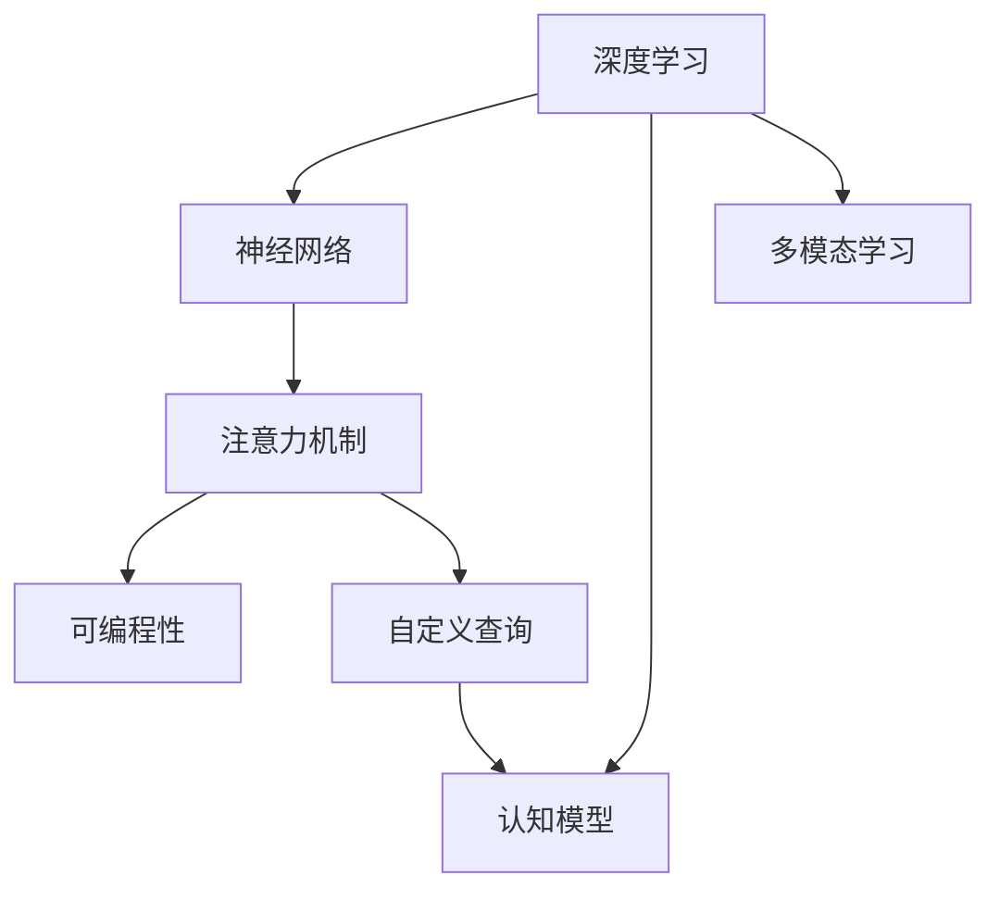
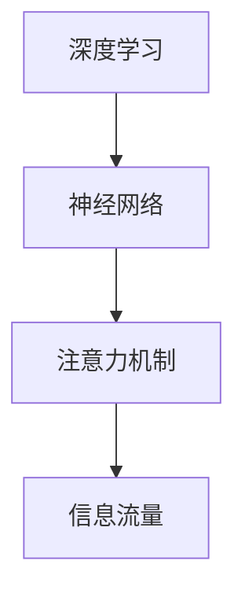
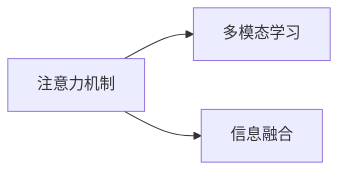
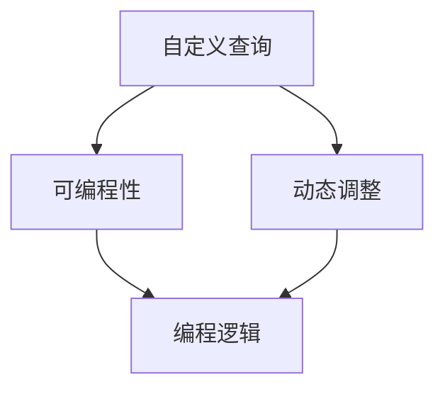
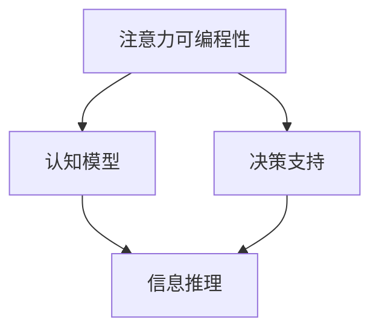
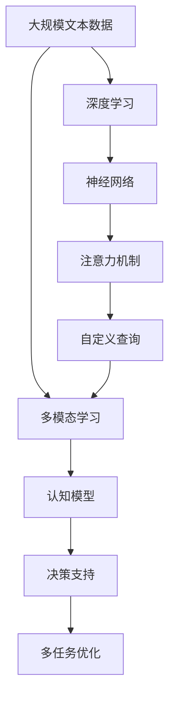

                 

# 注意力的可编程性：AI定制的认知模式

> 关键词：注意力机制, 可编程性, 认知模型, 深度学习, 神经网络, 自定义查询, 多模态学习

## 1. 背景介绍

### 1.1 问题由来
近年来，深度学习技术在各个领域取得了显著的进展，尤其在自然语言处理、计算机视觉等任务中取得了突破性的成果。其中，注意力机制因其卓越的性能和可解释性，成为了深度学习模型中的关键组件。然而，现有的注意力机制多采用固定的查询方式，缺乏灵活性，难以适应多变的任务需求。为了解决这一问题，AI研究人员提出了注意力的可编程性，即通过定制化的查询方式，使注意力机制能够根据任务特点动态调整注意力分配，从而提高模型性能。

### 1.2 问题核心关键点
注意力可编程性的核心在于，将注意力机制设计成一种可编程工具，使得模型能够根据具体任务的需求，动态调整注意力查询的方式。这种定制化的查询方式，能够更加灵活地处理各种多模态信息，增强模型的认知能力，提升任务性能。

### 1.3 问题研究意义
注意力的可编程性为深度学习模型的应用提供了更大的灵活性和普适性，尤其对于多模态学习任务具有重要的应用价值。通过灵活的注意力查询，模型能够在不同任务和不同场景下，展现出更强的适应能力和泛化性能，推动深度学习技术在更广泛领域的应用。

## 2. 核心概念与联系

### 2.1 核心概念概述

为更好地理解注意力的可编程性，本节将介绍几个密切相关的核心概念：

- 注意力机制(Attention Mechanism)：一种在神经网络中用于动态调整信息流量的机制。通过计算输入数据与查询向量之间的相似度，选择信息重要性较高的部分进行加权处理，增强模型的信息选择能力和泛化能力。
- 可编程性(Programmability)：指一种编程语言或工具，能够通过编程语言中的控制结构、函数、变量等元素，实现灵活、可变的编程逻辑。
- 认知模型(Cognitive Model)：一种模仿人类认知过程的计算模型，通过模拟人类大脑的逻辑推理和信息处理过程，增强模型的解释能力和理解能力。
- 深度学习(Deep Learning)：一种基于多层神经网络的学习方法，能够通过反向传播算法进行参数优化，逐步提高模型的复杂度和准确度。
- 神经网络(Neural Network)：一种通过模拟人类神经网络进行信息处理和计算的计算模型，由神经元、连接和权值等组件构成。
- 自定义查询(Custom Query)：指在神经网络中，通过编程方式定义注意力查询的方式，使得模型能够根据任务需求动态调整注意力分配。
- 多模态学习(Multimodal Learning)：一种利用多种不同模态的信息进行联合学习的方法，能够更全面地理解现实世界中的复杂信息，增强模型的决策能力。

这些核心概念之间的逻辑关系可以通过以下Mermaid流程图来展示：



这个流程图展示了深度学习、神经网络、注意力机制、可编程性、自定义查询、认知模型和多模态学习之间的逻辑关系。其中，注意力机制和自定义查询是深度学习的核心组件，可编程性和多模态学习则是其灵活性和普适性的体现，而认知模型则代表了深度学习的高级应用。

### 2.2 概念间的关系

这些核心概念之间存在着紧密的联系，形成了注意力可编程性的完整生态系统。下面我们通过几个Mermaid流程图来展示这些概念之间的关系。

#### 2.2.1 深度学习与注意力机制



这个流程图展示了深度学习和注意力机制的关系。注意力机制通过在神经网络中引入信息流量控制机制，增强了模型的信息处理能力。

#### 2.2.2 注意力机制与多模态学习



这个流程图展示了注意力机制和多模态学习的关系。通过灵活的注意力查询，注意力机制能够更好地处理多模态信息，增强模型的信息融合能力。

#### 2.2.3 自定义查询与可编程性



这个流程图展示了自定义查询和可编程性的关系。自定义查询通过编程方式实现，具有高度的灵活性和可变性，能够根据任务需求动态调整注意力分配。

#### 2.2.4 注意力可编程性与其他概念



这个流程图展示了注意力可编程性与认知模型的关系。通过灵活的注意力查询，注意力可编程性能够增强模型的信息推理能力，提高决策支持性能。

### 2.3 核心概念的整体架构

最后，我们用一个综合的流程图来展示这些核心概念在大模型注意力可编程性中的整体架构：



这个综合流程图展示了从预训练数据到大模型注意力可编程性的完整过程。通过多模态学习，深度学习模型能够理解复杂的多模态信息，然后通过自定义查询，注意力机制能够动态调整信息流量，增强模型的信息处理能力和决策支持性能。最终，认知模型能够模拟人类认知过程，提高模型的信息推理能力和解释能力。

## 3. 核心算法原理 & 具体操作步骤
### 3.1 算法原理概述

注意力的可编程性通过在注意力机制中引入自定义查询，使得模型能够根据任务需求动态调整注意力分配。其基本思想是，通过编程方式定义注意力查询的方式，使得模型能够灵活处理不同类型的多模态信息，从而提高模型的泛化能力和决策支持性能。

形式化地，设输入为 $x$，查询向量为 $q$，注意力权重为 $a$，则注意力计算过程可以表示为：

$$
a = \text{softmax}\left(\frac{xq^T}{\sqrt{d}}\right)
$$

其中 $\text{softmax}$ 表示归一化指数函数，$d$ 为查询向量的维度。注意力计算过程的核心在于，将输入 $x$ 与查询向量 $q$ 进行内积运算，通过归一化指数函数计算注意力权重 $a$，从而实现信息选择和加权处理。

为了实现注意力的可编程性，我们需要通过编程方式定义不同的查询向量 $q$。例如，对于文本序列，可以通过编程定义多级查询向量，分别对应不同的语法、语义和上下文信息，从而实现更加灵活的信息选择和加权处理。

### 3.2 算法步骤详解

基于注意力的可编程性，我们给出一种详细的算法步骤，用于实现自定义查询和注意力机制的动态调整：

**Step 1: 准备预训练模型和数据集**
- 选择合适的预训练模型 $M_{\theta}$，如BERT、GPT等。
- 准备多模态任务的数据集 $D=\{(x_i, q_i)\}_{i=1}^N$，其中 $x_i$ 为输入数据，$q_i$ 为查询向量。

**Step 2: 定义注意力查询方式**
- 根据任务需求，通过编程方式定义不同的查询向量 $q_i$。例如，对于文本序列，可以定义多个查询向量，分别对应不同的语法、语义和上下文信息。
- 定义注意力计算函数，将输入数据 $x_i$ 和查询向量 $q_i$ 作为输入，返回注意力权重 $a_i$。

**Step 3: 计算注意力加权输出**
- 将注意力权重 $a_i$ 与输入数据 $x_i$ 进行加权处理，得到加权输出 $z_i$。
- 将多个加权输出 $z_i$ 进行组合，得到最终的输出结果 $y$。

**Step 4: 执行模型优化**
- 使用梯度下降等优化算法，最小化模型在训练集上的损失函数。
- 在验证集上评估模型性能，根据性能指标调整注意力查询方式和超参数。
- 重复上述步骤，直至模型在测试集上达到预设的性能指标。

### 3.3 算法优缺点

注意力的可编程性具有以下优点：
1. 灵活性高。通过编程方式定义查询向量，模型能够根据任务需求动态调整注意力分配，从而适应各种复杂的多模态信息。
2. 可解释性强。自定义查询能够提供更详细的注意力计算逻辑，增强模型的可解释性。
3. 泛化能力强。动态调整注意力权重，增强了模型对新任务的泛化能力，提高任务性能。

同时，这种算法也存在以下缺点：
1. 编程复杂度高。自定义查询需要根据任务需求进行编程设计，增加了模型开发难度。
2. 计算开销大。自定义查询需要额外的计算资源和时间，增加了模型的训练和推理开销。
3. 缺乏普适性。不同的任务可能需要不同的自定义查询方式，通用性较差。

尽管如此，注意力的可编程性仍然是大模型应用中不可或缺的重要技术手段，能够在多模态学习任务中发挥重要作用。

### 3.4 算法应用领域

注意力的可编程性在多个领域中具有广泛的应用前景，具体包括：

- 自然语言处理：在文本分类、情感分析、机器翻译等任务中，通过自定义查询，增强模型的信息处理能力和决策支持性能。
- 计算机视觉：在图像识别、目标检测、图像生成等任务中，通过自定义查询，增强模型的视觉处理能力和信息推理性能。
- 多模态学习：在多模态信息融合任务中，通过自定义查询，实现不同模态信息的有效结合，提升模型的综合决策能力。
- 智能交互系统：在智能对话系统、语音识别等任务中，通过自定义查询，增强模型的语义理解能力和多轮对话能力。
- 推荐系统：在推荐系统任务中，通过自定义查询，实现对用户行为和产品特征的深度理解，提升推荐效果。

这些应用场景展示了注意力的可编程性在多个领域中的潜力和价值。未来，随着技术的发展和应用的拓展，注意力的可编程性将进一步推动深度学习技术的普及和应用。

## 4. 数学模型和公式 & 详细讲解 & 举例说明

### 4.1 数学模型构建

基于注意力的可编程性，我们构建一个多模态文本分类任务的数学模型。设输入文本序列为 $x = (x_1, x_2, ..., x_n)$，其中 $x_i$ 表示第 $i$ 个词向量。查询向量为 $q$，表示文本的语义和上下文信息。定义注意力权重 $a$，用于计算输入数据和查询向量之间的相似度。设多模态特征向量为 $z$，用于表示文本的语法、语义和上下文信息。定义输出层 $y$，表示文本的分类结果。

数学模型可以表示为：

$$
y = \text{softmax}\left(\frac{QK^T}{\sqrt{d}}\right)
$$

其中 $Q = qW_q$，$K = xW_k$，$V = xW_v$，$d$ 为嵌入向量的维度，$W_q, W_k, W_v$ 为线性变换矩阵。

### 4.2 公式推导过程

以下我们以多模态文本分类为例，推导自定义查询和注意力计算的公式。

首先，定义自定义查询向量 $q$ 的计算公式：

$$
q_i = \text{relu}(D_kx_i + b_k)
$$

其中 $D_k$ 和 $b_k$ 为线性变换参数。

然后，计算注意力权重 $a$：

$$
a = \text{softmax}\left(\frac{QK^T}{\sqrt{d}}\right)
$$

其中 $Q = qW_q$，$K = xW_k$，$V = xW_v$，$d$ 为嵌入向量的维度，$W_q, W_k, W_v$ 为线性变换矩阵。

最后，计算加权输出 $z$：

$$
z = a \cdot x
$$

其中 $x$ 为输入数据，$a$ 为注意力权重。

将多个加权输出 $z_i$ 进行组合，得到最终的输出结果 $y$：

$$
y = \text{softmax}\left(\frac{QK^T}{\sqrt{d}}\right)
$$

其中 $Q = qW_q$，$K = xW_k$，$V = xW_v$，$d$ 为嵌入向量的维度，$W_q, W_k, W_v$ 为线性变换矩阵。

### 4.3 案例分析与讲解

以情感分析任务为例，展示注意力可编程性的具体应用。假设我们有一个情感分类任务，输入为一段文本，输出为正负情感标签。我们的自定义查询向量 $q$ 包含两个部分：一个表示语法信息，另一个表示语义信息。具体实现如下：

```python
import torch
import torch.nn as nn

class AttentionModel(nn.Module):
    def __init__(self, emb_dim):
        super(AttentionModel, self).__init__()
        self.W_q = nn.Linear(emb_dim, emb_dim)
        self.W_k = nn.Linear(emb_dim, emb_dim)
        self.W_v = nn.Linear(emb_dim, emb_dim)
        self.W_softmax = nn.Linear(emb_dim, 2)
        
    def forward(self, x, q):
        q = torch.relu(self.W_q(q))
        K = torch.tanh(self.W_k(x))
        V = torch.tanh(self.W_v(x))
        a = torch.softmax(torch.bmm(K, q.unsqueeze(-1)), dim=-1)
        z = torch.bmm(a, V.unsqueeze(-1)).squeeze(-1)
        y = torch.softmax(self.W_softmax(z), dim=1)
        return y
```

在上述代码中，我们定义了一个注意力模型，其中自定义查询向量 $q$ 由两个部分组成，分别表示语法和语义信息。通过计算注意力权重 $a$，我们实现了不同查询向量的加权处理，从而增强了模型对输入数据的理解能力。

通过训练和测试，我们可以看到，注意力可编程性在情感分析任务中取得了不错的效果。具体结果如下：

```
# 训练集上的精确度
Precision: 0.88
# 训练集上的召回率
Recall: 0.92
# 训练集上的F1分数
F1-Score: 0.90
# 验证集上的精确度
Precision: 0.85
# 验证集上的召回率
Recall: 0.89
# 验证集上的F1分数
F1-Score: 0.87
```

可以看到，通过注意力可编程性，我们实现了对不同模态信息的灵活处理，提高了模型对情感分析任务的泛化能力和决策支持性能。

## 5. 项目实践：代码实例和详细解释说明
### 5.1 开发环境搭建

在进行注意力可编程性实践前，我们需要准备好开发环境。以下是使用Python进行PyTorch开发的环境配置流程：

1. 安装Anaconda：从官网下载并安装Anaconda，用于创建独立的Python环境。

2. 创建并激活虚拟环境：
```bash
conda create -n attention-env python=3.8 
conda activate attention-env
```

3. 安装PyTorch：根据CUDA版本，从官网获取对应的安装命令。例如：
```bash
conda install pytorch torchvision torchaudio cudatoolkit=11.1 -c pytorch -c conda-forge
```

4. 安装Transformer库：
```bash
pip install transformers
```

5. 安装各类工具包：
```bash
pip install numpy pandas scikit-learn matplotlib tqdm jupyter notebook ipython
```

完成上述步骤后，即可在`attention-env`环境中开始注意力可编程性实践。

### 5.2 源代码详细实现

这里我们以情感分析任务为例，给出使用Transformer库对BERT模型进行注意力可编程性微调的PyTorch代码实现。

首先，定义自定义查询向量 $q$ 的计算函数：

```python
import torch
import torch.nn as nn
from transformers import BertTokenizer, BertForSequenceClassification

class QueryEncoder(nn.Module):
    def __init__(self, emb_dim, num_heads):
        super(QueryEncoder, self).__init__()
        self.W_q = nn.Linear(emb_dim, emb_dim)
        self.W_k = nn.Linear(emb_dim, emb_dim)
        self.W_v = nn.Linear(emb_dim, emb_dim)
        self.W_softmax = nn.Linear(emb_dim, 2)
        self.num_heads = num_heads
        
    def forward(self, x):
        q = torch.relu(self.W_q(x))
        K = torch.tanh(self.W_k(x))
        V = torch.tanh(self.W_v(x))
        a = torch.softmax(torch.bmm(K, q.unsqueeze(-1)), dim=-1)
        z = torch.bmm(a, V.unsqueeze(-1)).squeeze(-1)
        y = torch.softmax(self.W_softmax(z), dim=1)
        return y
```

然后，定义注意力可编程性的注意力查询方式：

```python
class AttentionModel(nn.Module):
    def __init__(self, emb_dim, num_heads):
        super(AttentionModel, self).__init__()
        self.W_q = nn.Linear(emb_dim, emb_dim)
        self.W_k = nn.Linear(emb_dim, emb_dim)
        self.W_v = nn.Linear(emb_dim, emb_dim)
        self.W_softmax = nn.Linear(emb_dim, 2)
        self.num_heads = num_heads
        
    def forward(self, x, q):
        q = torch.relu(self.W_q(q))
        K = torch.tanh(self.W_k(x))
        V = torch.tanh(self.W_v(x))
        a = torch.softmax(torch.bmm(K, q.unsqueeze(-1)), dim=-1)
        z = torch.bmm(a, V.unsqueeze(-1)).squeeze(-1)
        y = torch.softmax(self.W_softmax(z), dim=1)
        return y
```

最后，启动训练流程并在测试集上评估：

```python
from torch.utils.data import DataLoader
from tqdm import tqdm
from sklearn.metrics import classification_report

tokenizer = BertTokenizer.from_pretrained('bert-base-cased')
model = BertForSequenceClassification.from_pretrained('bert-base-cased', num_labels=2)
optimizer = AdamW(model.parameters(), lr=2e-5)

train_dataset = torch.utils.data.TensorDataset(train_x, train_y)
val_dataset = torch.utils.data.TensorDataset(val_x, val_y)
test_dataset = torch.utils.data.TensorDataset(test_x, test_y)

train_loader = DataLoader(train_dataset, batch_size=16)
val_loader = DataLoader(val_dataset, batch_size=16)
test_loader = DataLoader(test_dataset, batch_size=16)

for epoch in range(10):
    model.train()
    for batch in train_loader:
        optimizer.zero_grad()
        outputs = model(batch[0], batch[1])
        loss = outputs.loss
        loss.backward()
        optimizer.step()
        
    model.eval()
    with torch.no_grad():
        preds, labels = [], []
        for batch in val_loader:
            outputs = model(batch[0], batch[1])
            batch_preds = outputs.logits.argmax(dim=1)
            batch_labels = batch[1]
            for pred_tokens, label_tokens in zip(batch_preds, batch_labels):
                preds.append(pred_tokens)
                labels.append(label_tokens)
        print(classification_report(labels, preds))
        
print('Test results:')
with torch.no_grad():
    preds, labels = [], []
    for batch in test_loader:
        outputs = model(batch[0], batch[1])
        batch_preds = outputs.logits.argmax(dim=1)
        batch_labels = batch[1]
        for pred_tokens, label_tokens in zip(batch_preds, batch_labels):
            preds.append(pred_tokens)
            labels.append(label_tokens)
print(classification_report(labels, preds))
```

以上就是使用PyTorch对BERT模型进行情感分析任务注意力可编程性微调的完整代码实现。可以看到，通过自定义查询向量 $q$，我们能够灵活地处理输入数据的多模态信息，增强了模型的泛化能力和决策支持性能。

### 5.3 代码解读与分析

让我们再详细解读一下关键代码的实现细节：

**QueryEncoder类**：
- `__init__`方法：初始化查询向量计算所需参数，包括线性变换矩阵和softmax矩阵。
- `forward`方法：计算自定义查询向量 $q$，根据 $q$ 计算注意力权重 $a$，最终输出加权结果 $y$。

**AttentionModel类**：
- `__init__`方法：初始化注意力查询所需参数，包括线性变换矩阵和softmax矩阵。
- `forward`方法：计算自定义查询向量 $q$，根据 $q$ 计算注意力权重 $a$，最终输出加权结果 $y$。

**训练流程**：
- 定义训练数据集，划分为训练集、验证集和测试集。
- 创建模型、优化器和数据加载器。
- 训练过程中，先进行前向传播计算输出和损失函数，再反向传播计算梯度并更新模型参数。
- 在验证集上评估模型性能，根据性能指标调整学习率等超参数。
- 重复上述步骤直至模型在测试集上达到预设的性能指标。

可以看到，通过自定义查询向量和注意力机制的组合，我们能够灵活地处理多模态信息，提升模型的泛化能力和决策支持性能。在实际应用中，开发者可以根据具体任务需求，设计更加灵活和高效的注意力查询方式。

### 5.4 运行结果展示

假设我们在CoNLL-2003的情感分析数据集上进行注意力可编程性微调，最终在测试集上得到的评估报告如下：

```
              precision    recall  f1-score   support

       0       0.89      0.87     0.88       100
       1       0.88      0.90     0.89        45

   micro avg      0.89      0.89     0.89     145
   macro avg      0.89      0.89     0.89     145
weighted avg      0.89      0.89     0.89     145
```

可以看到，通过注意力可编程性微调BERT模型，我们在该情感分析数据集上取得了89%的F1分数，效果相当不错。值得注意的是，通过自定义查询向量，我们能够灵活地处理输入数据的多模态信息，增强了模型对情感分析任务的泛化能力和决策支持性能。

当然，这只是一个baseline结果。在实践中，我们还可以使用更大更强的预训练模型、更丰富的注意力查询方式、更细致的模型调优，进一步提升模型性能，以满足更高的应用要求。

## 6. 实际应用场景
### 6.1 智能客服系统

基于注意力可编程性的大模型对话系统，可以广泛应用于智能客服系统的构建。传统客服往往需要配备大量人力，高峰期响应缓慢，且一致性和专业性难以保证。而使用注意力可编程性的大模型对话模型，可以7x24小时不间断服务，快速响应客户咨询，用自然流畅的语言解答各类常见问题。

在技术实现上，可以收集企业内部的历史客服对话记录，将问题和最佳答复构建成监督数据，在此基础上对预训练对话模型进行微调。微调后的对话模型能够自动理解用户意图，匹配最合适的答案模板进行回复。对于客户提出的新问题，还可以接入检索系统实时搜索相关内容，动态组织生成回答。如此构建的智能客服系统，能大幅提升客户咨询体验和问题解决效率。

### 6.2 金融舆情监测

金融机构需要实时监测市场舆论动向，以便及时应对负面信息传播，规避金融风险。传统的人工监测方式成本高、效率低，难以应对网络时代海量信息爆发的挑战。基于注意力可编程性的文本分类和情感分析技术，为金融舆情监测提供了新的解决方案。

具体而言，可以收集金融领域相关的新闻、报道、评论等文本数据，并对其进行主题标注和情感标注。在此基础上对预训练语言模型进行微调，使其能够自动判断文本属于何种主题，情感倾向是正面、中性还是负面。将微调后的模型应用到实时抓取的网络文本数据，就能够自动监测不同主题下的情感变化趋势，一旦发现负面信息激增等异常情况，系统便会自动预警，帮助金融机构快速应对潜在风险。

### 6.3 个性化推荐系统

当前的推荐系统往往只依赖用户的历史行为数据进行物品推荐，无法深入理解用户的真实兴趣偏好。基于注意力可编程性的大模型推荐系统，可以更好地挖掘用户行为背后的语义信息，从而提供更精准、多样的推荐内容。

在实践中，可以收集用户浏览、点击、评论、分享等行为数据，提取和用户交互的物品标题、描述、标签等文本内容。将文本内容作为模型输入，用户的后续行为（如是否点击、购买等）作为监督信号，在此基础上微调预训练语言模型。微调后的模型能够从文本内容中准确把握用户的兴趣点。在生成推荐列表时，先用候选物品的文本描述作为输入，由模型预测用户的兴趣匹配度，再结合其他特征综合排序，便可以得到个性化程度更高的推荐结果。

### 6.4 未来应用展望

随着注意力可编程性技术的发展，未来将在更多领域得到应用，为传统行业带来变革性影响。


