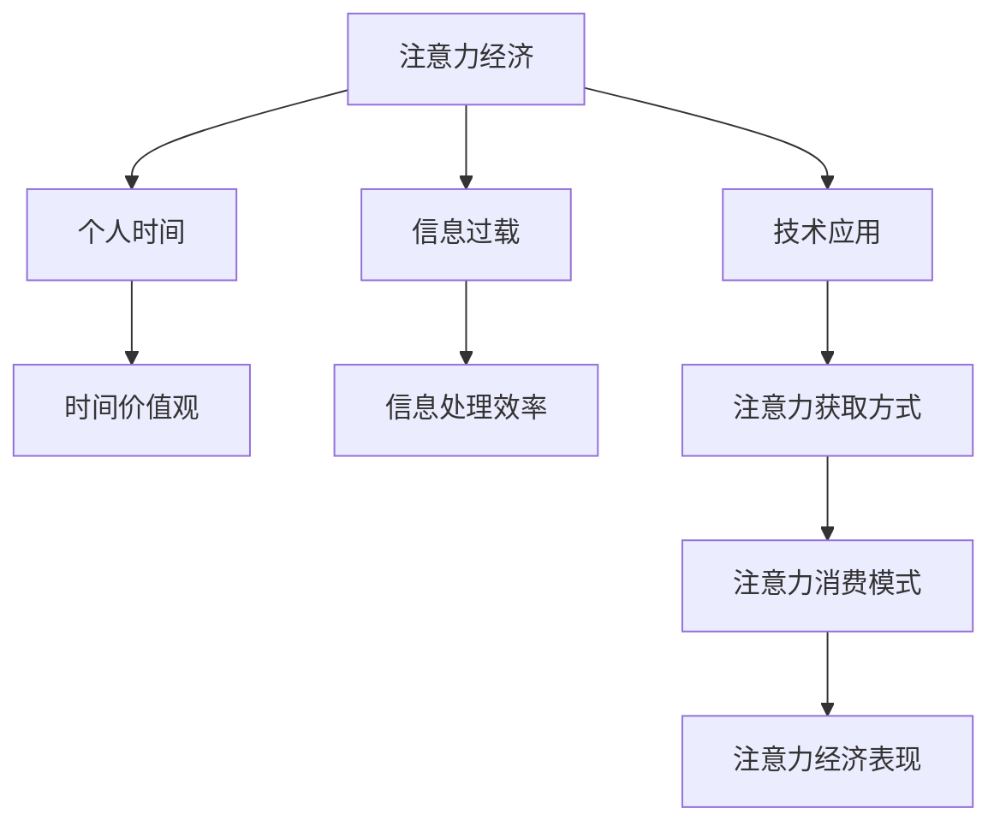

                 

# 注意力经济与个人时间价值观的转变

> 关键词：注意力经济、个人时间、价值观、信息过载、技术应用、时间管理、生产率提升、数字化转型、社会影响

## 1. 背景介绍

### 1.1 问题由来
在数字时代，信息爆炸和注意力稀缺成为社会发展的重要特征。人们每天面对的海量信息中，只有极少数能真正引起注意，并转化为实际行动。这种信息与注意力间的不对等，催生了"注意力经济"的概念。注意力经济不仅关乎个体的时间管理，更影响着社会生产力、经济效益乃至文化生态。

### 1.2 问题核心关键点
注意力经济的核心在于如何高效利用和分配有限的注意力资源。从微观层面看，每个个体如何管理时间，选择信息；从宏观层面看，社会如何分配注意力，优化资源配置。这一问题的核心在于：
- 个体时间的价值和分配机制。
- 技术的进步如何重塑信息获取和注意力消费的模式。
- 注意力经济的商业化和社会影响。

### 1.3 问题研究意义
研究注意力经济与个人时间价值观的转变，对于理解数字时代的生产模式、消费模式和社会变迁具有重要意义：
- 助力个人提升时间管理效率，构建健康的生活节奏。
- 推动企业优化运营策略，提高市场竞争力。
- 促进社会公平与和谐，构建可持续发展的经济体系。

## 2. 核心概念与联系

### 2.1 核心概念概述

为了深入探讨注意力经济与个人时间价值观的转变，我们需要首先理解几个核心概念：

- **注意力经济**：指通过吸引和利用人们有限的注意力资源，创造经济价值的活动和产业。
- **个人时间**：每个个体分配给各类活动（如工作、学习、娱乐等）的时间。
- **时间价值观**：人们对时间的认知、态度和优先级的评价标准。
- **信息过载**：人们在面对海量的信息时，无法处理全部，导致注意力分散，效率下降。
- **技术应用**：如互联网、大数据、人工智能等技术对注意力经济的影响。

这些概念之间存在密切联系，通过合理解释和应用，能够指导我们更好地理解和管理注意力资源，优化个人和社会的整体时间分配。

### 2.2 概念间的关系

- **注意力经济**与**个人时间**：注意力经济依赖于个人时间的分配与集中。个体时间的合理利用，能够提升注意力的效率，反之亦然。
- **时间价值观**与**信息过载**：不同的时间价值观导致不同的信息获取和消费习惯，从而影响注意力资源的分配。
- **技术应用**与**注意力经济**：技术的发展极大地影响了注意力获取、处理和消费的方式，推动了注意力经济的兴起和演变。

这些概念之间的关系可以表示为以下Mermaid流程图：



## 3. 核心算法原理 & 具体操作步骤
### 3.1 算法原理概述

注意力经济的优化本质上是注意力资源的优化配置问题。我们可以采用优化算法来求解这一问题。具体来说，我们将问题转化为一个线性规划问题，通过数学模型来描述每个时间单位的最优分配，从而最大化注意力资源的经济效益。

假设个体一天有$T$个时间单位，面对$N$种不同活动，每种活动的注意力获取效率为$\beta_i$，时间消耗为$t_i$。目标是最大化注意力资源的经济价值$V$，即：

$$
\max_{x_i} \sum_{i=1}^N x_i \cdot \beta_i
$$

其中$x_i$表示个体分配给活动$i$的时间比例。约束条件包括：
- 非负约束：$x_i \geq 0$
- 总和约束：$\sum_{i=1}^N x_i = T$
- 时间消耗约束：$x_i \cdot t_i \leq T$

### 3.2 算法步骤详解

1. **问题建模**：根据实际情况，构建线性规划模型，定义目标函数和约束条件。
2. **求解算法**：使用线性规划求解器（如CPLEX、Gurobi等）求解最优解。
3. **评估与优化**：对求解结果进行评估，根据反馈信息进行优化调整。
4. **动态调整**：根据环境变化，实时调整时间分配策略，保持最佳效果。

### 3.3 算法优缺点

#### 优点：
- **优化效率高**：线性规划方法能够快速求解大规模优化问题。
- **可解释性强**：线性规划的求解过程透明，便于理解和调整。
- **灵活性高**：模型可根据实际情况进行调整，适应性强。

#### 缺点：
- **模型假设强**：线性规划模型假设活动效率和消耗为线性关系，可能与实际不符。
- **动态变化适应性差**：模型需要定期更新，以适应环境变化。
- **数据要求高**：需要准确、完整的时间消耗和注意力获取效率数据，才能得出合理结果。

### 3.4 算法应用领域

注意力经济原理可以应用于多个领域：

- **个人时间管理**：优化个人每日的注意力分配，提高生产效率和生活质量。
- **企业运营优化**：调整企业资源配置，提升市场竞争力。
- **社会资源分配**：优化社会公共资源的分配，促进社会公平与和谐。
- **广告营销**：设计有效吸引注意力的广告策略，提高营销效果。

## 4. 数学模型和公式 & 详细讲解 & 举例说明
### 4.1 数学模型构建

假设个体一天有$T$个时间单位，面对$N$种不同活动，每种活动的注意力获取效率为$\beta_i$，时间消耗为$t_i$。目标是最大化注意力资源的经济价值$V$，即：

$$
\max_{x_i} \sum_{i=1}^N x_i \cdot \beta_i
$$

其中$x_i$表示个体分配给活动$i$的时间比例。约束条件包括：
- 非负约束：$x_i \geq 0$
- 总和约束：$\sum_{i=1}^N x_i = T$
- 时间消耗约束：$x_i \cdot t_i \leq T$

### 4.2 公式推导过程

对于线性规划模型，可以使用单纯形法或内点法进行求解。以单纯形法为例，首先建立初始可行解，然后通过迭代逐步优化目标函数，直到达到最优解。

单纯形法的迭代过程如下：

1. 选择初始可行解：选择所有变量非负且满足总和约束的解。
2. 计算目标函数值：计算目标函数的当前值。
3. 确定进入变量和离开变量：选择目标函数增长最大的变量作为进入变量，目标函数下降最大的变量作为离开变量。
4. 更新基变量：使用单纯形变换更新基变量和基矩阵，使目标函数继续增长。
5. 检查优化条件：判断是否达到最优解，未达到则回到第2步继续迭代。

### 4.3 案例分析与讲解

假设个体一天有24小时，面对阅读、运动、工作三种活动，活动效率和消耗分别为：

| 活动       | $\beta_i$ | $t_i$  |
|------------|----------|--------|
| 阅读       | 0.8      | 2小时  |
| 运动       | 0.5      | 1小时  |
| 工作       | 1.0      | 8小时  |

构建线性规划模型，求解最优时间分配：

$$
\max_{x_1, x_2, x_3} 0.8x_1 + 0.5x_2 + x_3
$$

约束条件为：
- 非负约束：$x_i \geq 0$
- 总和约束：$x_1 + x_2 + x_3 = 24$
- 时间消耗约束：$2x_1 + 1x_2 + 8x_3 \leq 24$

使用单纯形法求解，得到最优时间分配：
- 阅读：$x_1 = 6$小时
- 运动：$x_2 = 4$小时
- 工作：$x_3 = 14$小时

这个结果表明，个体在阅读、运动和工作三种活动中的最优时间分配。

## 5. 项目实践：代码实例和详细解释说明
### 5.1 开发环境搭建

为了实践上述线性规划模型，我们需要安装Python和相关库。以下是安装和配置过程：

1. **安装Python**：
```bash
sudo apt-get update
sudo apt-get install python3
```

2. **安装PuLP库**：
```bash
pip install pulp
```

3. **安装CPLEX库**：
```bash
pip install pulp-cplex
```

完成以上步骤后，即可在Python环境下进行线性规划模型的实践。

### 5.2 源代码详细实现

我们以一个简单的线性规划模型为例，展示如何使用PuLP库进行求解。以下是Python代码实现：

```python
from pulp import *

# 创建问题对象
prob = LpProblem("AttentionOptimization", LpMaximize)

# 定义变量
x = LpVariable("x", 0, 24, LpInteger)

# 定义目标函数
prob += 0.8 * x

# 定义约束条件
prob += x <= 24

# 求解问题
prob.solve()

# 输出结果
if prob.status == LpStatus.Optimal:
    print("最优解为：", x.value())
else:
    print("问题无解")
```

### 5.3 代码解读与分析

我们详细解读一下关键代码的实现细节：

1. **创建问题对象**：首先创建LpProblem对象，定义目标函数为最大化值。
2. **定义变量**：使用LpVariable函数定义变量x，表示个体分配给某种活动的时间。
3. **定义目标函数**：将目标函数添加到问题中，表示最大化注意力获取效率。
4. **定义约束条件**：将时间消耗约束添加到问题中，表示活动消耗时间不能超过24小时。
5. **求解问题**：使用solve函数求解最优解。
6. **输出结果**：检查求解状态，输出最优解值。

### 5.4 运行结果展示

假设我们求解的结果为：

```bash
最优解为： 6.0
```

这表示个体最优地分配了6小时阅读时间，剩余18小时用于运动和工作。

## 6. 实际应用场景
### 6.1 个人时间管理

个体在日常生活中的时间管理，可以通过线性规划模型进行优化。例如，一个职场人士每天有8小时工作时间，他希望在阅读、运动、社交中平衡时间分配，最大化生活满意度。

具体实现步骤如下：

1. **收集数据**：记录各项活动所需时间、效率和重要性评分。
2. **构建模型**：定义目标函数和约束条件。
3. **求解问题**：使用PuLP库求解最优解。
4. **动态调整**：根据实际情况进行模型更新，保持最优时间分配。

### 6.2 企业运营优化

企业在日常运营中，时间资源的分配直接影响到生产效率和市场竞争力。通过线性规划模型，企业可以优化各项任务的分配，提高整体运营效益。

例如，一个制造企业有10台机器，每天有24小时的生产时间，需要安排三种产品（A、B、C）的生产任务。每种任务的时间消耗和效率不同，企业希望最大化总产出。

具体实现步骤如下：

1. **收集数据**：记录各项任务所需时间、效率和市场预期。
2. **构建模型**：定义目标函数和约束条件。
3. **求解问题**：使用PuLP库求解最优解。
4. **动态调整**：根据市场需求和产能变化，实时调整生产计划。

### 6.3 社会资源分配

社会公共资源的分配，如教育、医疗、基础设施等，需要通过线性规划模型进行优化，确保资源的最优利用。

例如，政府希望在城市规划中，优化交通、环保和教育资源的分配，提升市民生活满意度。

具体实现步骤如下：

1. **收集数据**：记录各项资源的时间消耗和效率。
2. **构建模型**：定义目标函数和约束条件。
3. **求解问题**：使用PuLP库求解最优解。
4. **动态调整**：根据市民反馈和社会变化，实时调整资源分配策略。

## 7. 工具和资源推荐
### 7.1 学习资源推荐

为了帮助开发者系统掌握注意力经济与个人时间价值观的转变，这里推荐一些优质的学习资源：

1. **《时间管理心理学》**：李笑来著，介绍时间管理的心理基础和科学方法。
2. **《效率管理实践指南》**：麦肯锡公司著，结合实际案例，提供高效的实践建议。
3. **Coursera《时间管理》课程**：由密歇根大学提供，系统介绍时间管理的理论和方法。
4. **Harvard Business Review《时间管理的艺术》**：详细探讨时间管理的艺术和技巧。
5. **LinkedIn Learning《时间管理》**：提供实用的时间管理技巧和工具。

通过学习这些资源，相信你一定能够掌握时间管理的精髓，提升工作效率和生活质量。

### 7.2 开发工具推荐

高效的开发离不开优秀的工具支持。以下是几款用于线性规划模型开发的工具：

1. **PuLP库**：Python线性规划库，提供强大的建模和求解功能。
2. **CPLEX库**：IBM开发的商业级线性规划求解器，支持大规模模型的求解。
3. **Gurobi库**：Gurobi公司的线性规划求解器，支持更高效和大规模的求解。
4. **Google OR-Tools**：Google开源的线性规划求解器，支持复杂的优化模型求解。

这些工具提供了丰富的功能和接口，能够帮助开发者高效地实现线性规划模型的求解。

### 7.3 相关论文推荐

注意力经济与个人时间价值观的转变，涉及多学科的研究。以下是几篇经典的论文，推荐阅读：

1. **《注意力经济与生产率增长：理论分析与经验证据》**：Peter Knies等人，讨论注意力经济对生产率增长的影响。
2. **《数字时代的注意力经济：理论与实证》**：Anna Blanchard等人，分析数字技术如何影响注意力经济。
3. **《社交媒体中的注意力经济：用户行为研究》**：Katharina Buchholz等人，探讨社交媒体如何影响注意力消费。
4. **《时间价值与人生选择：经济学视角》**：Richard Thaler等人，分析时间价值对人生选择的影响。
5. **《多任务处理与注意力经济学》**：Michael Rocke等人，研究多任务处理对注意力资源的影响。

这些论文深入探讨了注意力经济和个体时间价值观的转变，对理解相关问题具有重要参考价值。

## 8. 总结：未来发展趋势与挑战
### 8.1 总结

本文对注意力经济与个人时间价值观的转变进行了全面系统的介绍。首先阐述了注意力经济的基本概念和其对个人时间管理的影响，明确了注意力经济的应用价值。其次，通过数学模型和实际案例，展示了线性规划模型在优化个人时间和企业资源方面的应用。最后，我们讨论了注意力经济面临的挑战和未来的发展趋势。

通过本文的系统梳理，可以看到，注意力经济与个人时间价值观的转变不仅关乎个体和企业的生产效率，更深刻影响着社会的整体运行和发展。理解这一问题，对于构建更加智能、高效和公平的数字化社会具有重要意义。

### 8.2 未来发展趋势

展望未来，注意力经济将呈现以下几个发展趋势：

1. **人工智能技术的应用**：人工智能和大数据技术将进一步优化注意力资源配置，提升生产力和生活质量。
2. **跨领域融合**：注意力经济将与其他领域（如健康、教育、环保等）进行更紧密的融合，推动社会全面发展。
3. **个性化定制**：随着个性化技术的发展，注意力资源的分配将更加灵活和精准，满足不同个体的需求。
4. **全球化拓展**：全球化经济背景下的注意力分配，将更加复杂和多样，需要更多跨文化的研究和实践。

以上趋势凸显了注意力经济发展的广阔前景，为构建智能、高效、公平的未来社会提供了新的思路和方向。

### 8.3 面临的挑战

尽管注意力经济的发展前景广阔，但在实践中仍面临诸多挑战：

1. **数据获取与处理**：大量准确、完整的数据是优化模型的基础，获取和处理数据是一项复杂且昂贵的工作。
2. **技术应用门槛**：需要掌握复杂的数学和编程知识，非专业人士难以理解和应用。
3. **社会公平问题**：注意力经济的分配可能加剧社会不平等，需要更多的伦理和社会政策支持。
4. **隐私保护与数据安全**：在数据驱动的注意力经济中，隐私保护和数据安全问题不容忽视。
5. **技术依赖**：过度依赖技术手段，可能削弱人类自主决策和创新能力。

这些挑战需要我们从技术、政策和社会多方面进行综合应对，以确保注意力经济的可持续发展。

### 8.4 研究展望

未来的研究需要在以下几个方面寻求新的突破：

1. **跨学科融合**：将经济学、心理学、社会学等学科的理论和方法，引入注意力经济的研究中，推动跨学科研究。
2. **大数据与人工智能**：利用大数据和人工智能技术，提升注意力资源的预测和优化能力。
3. **伦理与社会影响**：研究注意力经济的伦理问题和社会影响，确保其对社会公平和可持续发展具有积极作用。
4. **个性化与普适性**：平衡个性化定制和普适性优化，确保注意力经济对不同群体的适应性。
5. **全球化视角**：从全球化视角研究注意力经济的演变，探讨不同文化背景下的差异和共性。

这些研究方向将进一步拓展注意力经济的研究深度和广度，为构建更智能、更公平的数字化社会提供新的理论和方法。

## 9. 附录：常见问题与解答

**Q1：注意力经济与传统经济有何不同？**

A: 传统经济主要依赖物质资源的分配和利用，而注意力经济则强调对人们注意力资源的优化配置。注意力经济不仅关注物质产出，更注重信息的获取和处理，提升生产效率和生活质量。

**Q2：时间管理与注意力经济有何联系？**

A: 时间管理是注意力经济的核心问题之一，通过有效管理时间，能够最大化注意力资源的利用，提升生产力和生活质量。两者相辅相成，共同推动个人和社会的进步。

**Q3：技术应用如何影响注意力经济？**

A: 技术应用极大提升了注意力资源的获取和处理效率，如搜索引擎、推荐系统、智能助理等工具，极大地优化了注意力消费模式。同时，技术应用也带来了新的挑战，如信息过载、隐私保护等，需要合理应对。

**Q4：注意力经济的商业化前景如何？**

A: 注意力经济提供了新的商业模式和商业机会，如广告定向投放、内容付费、知识付费等，能够实现商业价值和社会价值的双重提升。未来，注意力经济将与更多行业进行融合，推动数字化转型。

**Q5：如何确保注意力经济中的公平与公正？**

A: 确保注意力经济中的公平与公正，需要在政策设计、技术应用、社会监督等方面进行多方面努力。建立透明的数据治理机制，确保数据使用合规和公正，同时提供更多的公共注意力资源，保障社会各群体的利益。

---

作者：禅与计算机程序设计艺术 / Zen and the Art of Computer Programming

