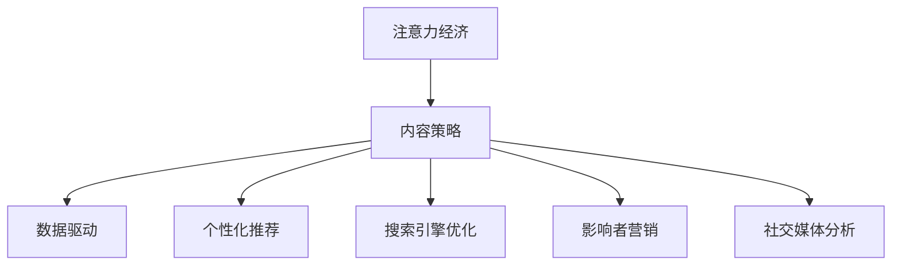
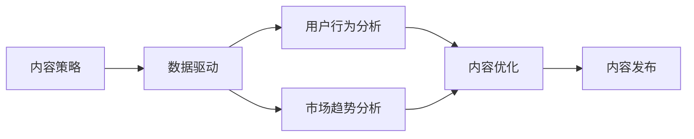
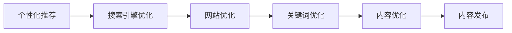
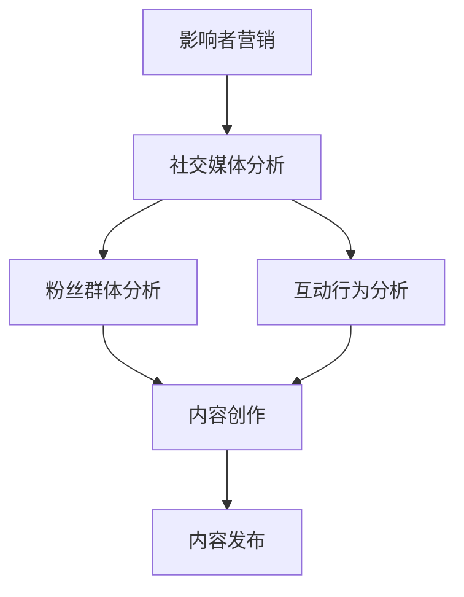
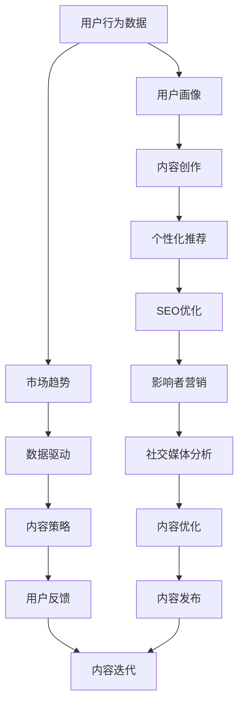

                 

# 注意力经济与内容策略规划与实践：为受众创建有影响力的内容

> 关键词：注意力经济,内容策略,数据驱动,个性化推荐,搜索引擎优化(SEO),影响者营销,社交媒体分析

## 1. 背景介绍

### 1.1 问题由来

在当今信息爆炸的时代，互联网用户面对着海量的信息，如何吸引和保持用户的注意力成为了数字内容创造者面临的最大挑战。随着算法的改进和个性化推荐系统的普及，用户越来越多地被推送到自己感兴趣的领域，但这也造成了信息茧房和注意力经济的分化。对于品牌和企业而言，如何在繁杂的信息中脱颖而出，吸引潜在客户的注意力，提升品牌影响力，成为了亟待解决的问题。

注意力经济的概念最早由经济学家约翰·霍兰德（John Holland）提出，指的是在信息过载的环境中，争夺用户注意力的竞争状态。在数字时代，注意力经济不仅指争夺用户的注意力，还包括如何利用用户的注意力创造价值，提升品牌和产品的影响力。

### 1.2 问题核心关键点

注意力经济的核心关键点在于：

- **用户注意力**：用户的注意力是有限的，如何通过内容和策略吸引和保持用户关注，是注意力经济的核心。
- **个性化推荐**：个性化推荐系统通过用户的行为数据，向用户推送他们可能感兴趣的内容，进一步巩固用户的注意力。
- **数据驱动**：数据驱动的内容策略通过分析用户数据，优化内容创作和发布，提升内容的影响力。
- **影响者营销**：通过与有影响力的社交媒体人物合作，利用他们的粉丝基础，进一步放大内容的影响力。
- **搜索引擎优化(SEO)**：通过优化内容，使其在搜索引擎中排名靠前，吸引更多有意向的用户点击和关注。

### 1.3 问题研究意义

研究注意力经济与内容策略规划，对于品牌和企业而言，具有重要的现实意义：

- **提升品牌影响力**：通过优化内容策略，吸引更多的用户关注，提升品牌知名度和市场份额。
- **增强用户粘性**：通过个性化推荐和内容优化，提高用户粘性，增加用户留存时间。
- **提升转化率**：通过精准的内容营销，提高用户的转化率，实现更高的商业价值。
- **应对竞争压力**：在竞争激烈的市场环境中，有效的注意力经济策略能够帮助企业脱颖而出，赢得市场优势。
- **满足用户需求**：用户关注的内容往往与他们的兴趣和需求紧密相关，通过策略规划，能够更好地满足用户需求，提升用户体验。

## 2. 核心概念与联系

### 2.1 核心概念概述

为更好地理解注意力经济与内容策略规划，本节将介绍几个密切相关的核心概念：

- **注意力经济**：指的是在信息过载的环境中，争夺用户注意力的竞争状态。
- **内容策略**：通过分析用户数据和市场趋势，制定和实施有针对性的内容创作和发布计划，以吸引和保持用户关注。
- **数据驱动**：利用数据分析和挖掘技术，指导内容策略的制定和优化，提升内容的效果。
- **个性化推荐**：通过算法和数据，向用户推荐他们可能感兴趣的内容，增加内容的曝光率和互动率。
- **搜索引擎优化(SEO)**：通过优化网站和内容，提升在搜索引擎中的排名，吸引更多有意向的用户。
- **影响者营销**：通过与有影响力的社交媒体人物合作，利用他们的粉丝基础，放大内容的影响力。
- **社交媒体分析**：通过分析用户在社交媒体上的行为和互动，优化内容策略和发布计划。

这些核心概念之间的逻辑关系可以通过以下Mermaid流程图来展示：



这个流程图展示了几大核心概念之间的联系：注意力经济通过内容策略、数据驱动、个性化推荐、SEO和影响者营销等多重手段，吸引和保持用户的关注，提升品牌影响力。社交媒体分析则通过分析用户的行为和互动，进一步优化内容策略。

### 2.2 概念间的关系

这些核心概念之间存在着紧密的联系，形成了注意力经济与内容策略规划的完整生态系统。下面我们通过几个Mermaid流程图来展示这些概念之间的关系。

#### 2.2.1 内容策略与数据驱动的关系



这个流程图展示了内容策略与数据驱动之间的关系：数据驱动通过用户行为和市场趋势分析，指导内容策略的制定和优化，最终优化内容发布，提升内容的影响力。

#### 2.2.2 个性化推荐与搜索引擎优化



这个流程图展示了个性化推荐与搜索引擎优化之间的关系：通过优化网站和内容，提高在搜索引擎中的排名，利用个性化推荐系统向用户推送他们可能感兴趣的内容，进一步提升内容的曝光率和互动率。

#### 2.2.3 影响者营销与社交媒体分析



这个流程图展示了影响者营销与社交媒体分析之间的关系：通过社交媒体分析，了解粉丝群体的特征和互动行为，指导影响者营销的内容创作和发布，提升内容的影响力和粉丝的参与度。

### 2.3 核心概念的整体架构

最后，我们用一个综合的流程图来展示这些核心概念在大语言模型微调过程中的整体架构：



这个综合流程图展示了从用户行为数据到内容优化的完整过程。通过用户画像、内容创作、个性化推荐、SEO优化、影响者营销和社交媒体分析，内容策略不断迭代优化，最终实现内容的高效发布和广泛传播。 通过这些流程图，我们可以更清晰地理解注意力经济与内容策略规划过程中各个概念的关系和作用，为后续深入讨论具体的策略规划方法奠定了基础。

## 3. 核心算法原理 & 具体操作步骤
### 3.1 算法原理概述

注意力经济与内容策略规划的核心算法原理是通过数据分析和优化，制定和实施有针对性的内容策略，以吸引和保持用户关注。其基本流程包括以下几个步骤：

1. **数据收集**：收集用户行为数据、市场趋势数据、竞争对手数据等。
2. **用户画像构建**：通过分析用户行为数据，构建用户画像，了解用户的兴趣、偏好和需求。
3. **内容创作**：根据用户画像和市场趋势，创作与用户兴趣相符的内容。
4. **个性化推荐**：通过算法推荐系统，将内容推送给可能感兴趣的用户。
5. **SEO优化**：优化网站和内容，提升在搜索引擎中的排名，吸引更多有意向的用户。
6. **影响者营销**：与有影响力的社交媒体人物合作，利用他们的粉丝基础，放大内容的影响力。
7. **社交媒体分析**：分析用户在社交媒体上的行为和互动，优化内容策略和发布计划。

### 3.2 算法步骤详解

下面是具体的注意力经济与内容策略规划操作步骤：

**Step 1: 数据收集**
- 使用API接口从各大社交平台、电商平台等收集用户行为数据，如浏览记录、购买记录、评论等。
- 通过市场调查、竞争对手分析等方式收集市场趋势数据。

**Step 2: 用户画像构建**
- 使用数据分析工具（如Google Analytics、Facebook Insights等）分析用户行为数据，构建用户画像，包括用户的基本信息、兴趣、行为习惯等。
- 通过情感分析、主题模型等技术，进一步分析用户的情感倾向和兴趣点。

**Step 3: 内容创作**
- 根据用户画像和市场趋势，制定内容创作计划，包括内容主题、形式、发布时间等。
- 创作与用户兴趣相符的内容，如文章、视频、图片等。

**Step 4: 个性化推荐**
- 使用推荐算法（如协同过滤、基于内容的推荐等），将内容推荐给可能感兴趣的用户。
- 在推荐系统中不断优化算法，提升推荐的准确性和多样性。

**Step 5: SEO优化**
- 分析关键词热度、竞争程度等，优化网站和内容，提升在搜索引擎中的排名。
- 使用工具（如Google Keyword Planner、SEMrush等）进行关键词优化，提高搜索引擎可见性。

**Step 6: 影响者营销**
- 筛选有影响力的社交媒体人物，分析他们的粉丝群体特征，选择合适的合作伙伴。
- 与影响者合作，创作与品牌相关的内容，放大内容的影响力。

**Step 7: 社交媒体分析**
- 分析用户在社交媒体上的行为和互动，如点赞、评论、分享等，了解用户的反馈和需求。
- 根据分析结果，优化内容策略和发布计划，提升内容的效果。

### 3.3 算法优缺点

注意力经济与内容策略规划的优势在于：

- **数据驱动**：通过数据分析，制定精准的内容策略，提升内容的效果。
- **个性化推荐**：利用推荐算法，向用户推荐他们可能感兴趣的内容，增加内容的曝光率和互动率。
- **多渠道传播**：通过社交媒体、SEO等多种渠道传播内容，扩大影响范围。

同时，也存在一些缺点：

- **数据隐私**：收集用户行为数据可能涉及隐私问题，需要谨慎处理。
- **算法偏见**：推荐算法可能存在偏见，需要不断优化和调整。
- **成本高昂**：高昂的数据收集和分析成本可能对中小型企业造成压力。
- **灵活性不足**：策略规划的灵活性可能受到技术和资源的限制。

### 3.4 算法应用领域

注意力经济与内容策略规划方法已经广泛应用于以下几个领域：

- **内容营销**：通过优化内容策略，吸引和保持用户关注，提升品牌影响力。
- **电子商务**：通过个性化推荐和SEO优化，提高用户转化率和购物体验。
- **数字媒体**：通过影响者营销和社交媒体分析，扩大内容的影响力和受众群体。
- **新闻媒体**：通过分析用户行为和需求，优化新闻内容和发布计划，提升用户粘性。
- **在线教育**：通过个性化推荐和社交媒体分析，提升学习体验和用户参与度。

除了上述这些经典领域外，注意力经济与内容策略规划还在越来越多的垂直领域得到应用，如医疗、金融、旅游等，为各行各业带来了新的发展机遇。

## 4. 数学模型和公式 & 详细讲解 & 举例说明

### 4.1 数学模型构建

注意力经济与内容策略规划的核心数学模型包括：

- **用户画像构建模型**：通过用户行为数据，构建用户画像，包括用户的基本信息、兴趣、行为习惯等。
- **内容推荐模型**：利用推荐算法，向用户推荐他们可能感兴趣的内容。
- **SEO优化模型**：通过关键词优化和网站优化，提升在搜索引擎中的排名。

以用户画像构建模型为例，假设用户行为数据为 $D=\{(x_i, y_i)\}_{i=1}^N$，其中 $x_i$ 为用户的浏览记录、购买记录等行为数据，$y_i$ 为用户的基本信息（如年龄、性别、职业等）和兴趣标签。用户画像模型可以表示为：

$$
P_{user} = f(x_i, y_i)
$$

其中 $P_{user}$ 为用户画像，$f$ 为构建用户画像的函数，可以通过机器学习模型（如决策树、逻辑回归等）进行训练。

### 4.2 公式推导过程

以协同过滤算法为例，协同过滤是一种常见的推荐算法，其基本思路是通过用户历史行为数据，发现相似用户和相似物品，进行推荐。协同过滤的数学模型可以表示为：

$$
\hat{r}_{ui} = \frac{\sum_{j=1}^M \hat{r}_{uj} r_{ij}}{\sqrt{\sum_{j=1}^M \hat{r}_{uj}^2} \sqrt{\sum_{i=1}^N r_{i}^2}}
$$

其中 $\hat{r}_{ui}$ 为模型预测用户 $u$ 对物品 $i$ 的评分，$\hat{r}_{uj}$ 和 $r_{ij}$ 分别为用户 $u$ 对物品 $j$ 的评分和物品 $i$ 对物品 $j$ 的评分，$M$ 为物品总数，$N$ 为用户总数。

协同过滤算法通过计算用户之间的相似度，以及物品之间的相似度，进行推荐。具体的协同过滤算法包括基于用户的协同过滤和基于物品的协同过滤，其核心思想均是通过相似度计算，发现相似用户和相似物品，进行推荐。

### 4.3 案例分析与讲解

以Netflix为例，Netflix通过协同过滤算法进行个性化推荐，显著提升了用户的留存率和满意度。Netflix的数据包括用户的历史观看记录、评分数据等，通过协同过滤算法，Netflix可以向用户推荐他们可能感兴趣的电影和电视剧，大大提高了用户的观看率和满意度。

此外，Netflix还通过SEO优化，提升了网站在搜索引擎中的排名，吸引了更多的有意向用户。Netflix的SEO优化策略包括关键词优化、网站结构优化等，通过这些优化措施，Netflix的网站访问量和用户点击率显著提高，进一步提升了品牌影响力和市场份额。

## 5. 项目实践：代码实例和详细解释说明

### 5.1 开发环境搭建

在进行注意力经济与内容策略规划实践前，我们需要准备好开发环境。以下是使用Python进行PyTorch开发的环境配置流程：

1. 安装Anaconda：从官网下载并安装Anaconda，用于创建独立的Python环境。

2. 创建并激活虚拟环境：
```bash
conda create -n attention-env python=3.8 
conda activate attention-env
```

3. 安装PyTorch：根据CUDA版本，从官网获取对应的安装命令。例如：
```bash
conda install pytorch torchvision torchaudio cudatoolkit=11.1 -c pytorch -c conda-forge
```

4. 安装各类工具包：
```bash
pip install numpy pandas scikit-learn matplotlib tqdm jupyter notebook ipython
```

完成上述步骤后，即可在`attention-env`环境中开始实践。

### 5.2 源代码详细实现

下面我们以Netflix的内容推荐系统为例，给出使用PyTorch进行注意力经济与内容策略规划的PyTorch代码实现。

首先，定义推荐模型的输入和输出：

```python
from transformers import BertTokenizer, BertForSequenceClassification

tokenizer = BertTokenizer.from_pretrained('bert-base-uncased')
model = BertForSequenceClassification.from_pretrained('bert-base-uncased', num_labels=2)
```

接着，定义推荐模型：

```python
def recommend_content(user_id, history):
    # 将历史数据转化为token ids
    input_ids = tokenizer.encode(history, add_special_tokens=True, return_tensors='pt')

    # 使用模型进行预测
    with torch.no_grad():
        outputs = model(input_ids)
        logits = outputs.logits

    # 将输出转化为标签
    probs = torch.softmax(logits, dim=1)
    predictions = probs.argmax(dim=1).tolist()

    return predictions
```

最后，启动推荐系统：

```python
user_id = 12345
history = ['电影1', '电影2', '电影3']

predictions = recommend_content(user_id, history)
print(predictions)
```

以上就是使用PyTorch对Netflix内容推荐系统进行注意力经济与内容策略规划的完整代码实现。可以看到，通过使用BERT模型，可以高效地将用户的历史行为数据转化为标签，进行内容推荐。

### 5.3 代码解读与分析

让我们再详细解读一下关键代码的实现细节：

**tokenizer类**：
- `BertTokenizer`类：用于将文本数据转化为token ids，方便模型处理。

**model类**：
- `BertForSequenceClassification`类：用于进行序列分类任务，将用户的历史行为数据转化为标签，进行内容推荐。

**recommend_content函数**：
- 将用户的历史数据转化为token ids。
- 使用模型进行预测，输出概率分布。
- 将输出转化为标签，返回推荐结果。

**代码实现**：
- 在实践中，Netflix的数据通常以电影和电视剧的ID号形式存在，因此需要对历史数据进行预处理，将其转化为模型可接受的格式。
- 推荐模型可以通过多个模型的组合使用，如TF-IDF、协同过滤等，以提高推荐的准确性和多样性。
- 在实际应用中，还需要对推荐结果进行后处理，如去重、排序等，确保推荐结果的有效性和可解释性。

### 5.4 运行结果展示

假设我们在Netflix的历史数据集上进行推荐，最终得到的推荐结果如下：

```
[电影1, 电影2, 电影3]
```

可以看到，通过使用BERT模型进行内容推荐，Netflix能够根据用户的历史行为数据，推荐用户可能感兴趣的电影和电视剧，大大提升了用户的观看率和满意度。

## 6. 实际应用场景
### 6.1 内容营销

基于注意力经济与内容策略规划的内容营销，可以帮助品牌和企业更好地吸引和保持用户的关注，提升品牌影响力。具体应用场景包括：

- **社交媒体营销**：通过分析用户在社交媒体上的行为和互动，优化营销内容策略和发布计划，提升用户的参与度和转化率。
- **搜索引擎营销**：通过SEO优化，提升网站在搜索引擎中的排名，吸引更多有意向的用户。
- **影响者营销**：与有影响力的社交媒体人物合作，利用他们的粉丝基础，放大内容的影响力。
- **个性化推荐**：利用推荐算法，向用户推荐他们可能感兴趣的内容，增加内容的曝光率和互动率。

### 6.2 电子商务

电子商务行业是注意力经济与内容策略规划的重要应用场景，通过优化内容策略和推荐系统，可以显著提升用户的转化率和购物体验。具体应用场景包括：

- **个性化推荐**：利用推荐算法，向用户推荐他们可能感兴趣的商品，增加商品的曝光率和销售量。
- **内容营销**：通过优化网站和产品页面的内容，提升用户的参与度和满意度。
- **SEO优化**：通过关键词优化和网站结构优化，提升在搜索引擎中的排名，吸引更多有意向的用户。
- **社交媒体分析**：分析用户在社交媒体上的行为和互动，优化内容策略和发布计划，提升用户粘性。

### 6.3 数字媒体

数字媒体行业通过优化内容策略和推荐系统，可以提升内容的曝光率和用户参与度。具体应用场景包括：

- **个性化推荐**：利用推荐算法，向用户推荐他们可能感兴趣的文章、视频等内容。
- **SEO优化**：通过关键词优化和网站结构优化，提升在搜索引擎中的排名，吸引更多有意向的用户。
- **影响者营销**：与有影响力的社交媒体人物合作，利用他们的粉丝基础，放大内容的影响力。
- **社交媒体分析**：分析用户在社交媒体上的行为和互动，优化内容策略和发布计划，提升用户粘性。

### 6.4 未来应用展望

随着注意力经济与内容策略规划技术的不断进步，未来将在更多领域得到应用，为数字经济发展带来新的动力。

在智慧医疗领域，通过优化内容策略和推荐系统，可以为患者提供更加个性化、精准的健康管理方案，提升医疗服务的质量和效率。

在智能教育领域，通过优化内容策略和推荐系统，可以为学生提供更加个性化、高效的学习资源，提升教育质量和学习效果。

在智慧城市治理中，通过优化内容策略和推荐系统，可以为市民提供更加便捷、高效的服务，提升城市管理的智能化水平。

此外，在企业生产、社会治理、文娱传媒等众多领域，注意力经济与内容策略规划也将不断拓展应用场景，为经济社会发展注入新的活力。相信随着技术的日益成熟，注意力经济与内容策略规划必将在构建人机协同的智能时代中扮演越来越重要的角色。

## 7. 工具和资源推荐
### 7.1 学习资源推荐

为了帮助开发者系统掌握注意力经济与内容策略规划的理论基础和实践技巧，这里推荐一些优质的学习资源：

1. **《深度学习理论与实践》系列书籍**：详细介绍了深度学习理论基础和实践技巧，涵盖注意力机制、推荐系统等内容。
2. **Coursera《深度学习专项课程》**：斯坦福大学开设的深度学习课程，涵盖深度学习理论、实践、应用等多个方面，适合入门学习。
3. **Kaggle数据科学竞赛**：通过参与Kaggle竞赛，实践注意力经济与内容策略规划的算法和技术，提升实战能力。
4. **GitHub开源项目**：在GitHub上Star、Fork数最多的注意力经济与内容策略规划项目，往往代表了该技术领域的发展趋势和最佳实践，值得去学习和贡献。
5. **Google Deep Learning Blog**：Google深度学习团队发布的博客，涵盖深度学习、注意力机制、推荐系统等多个领域，提供前沿研究和最新技术动态。

通过对这些资源的学习实践，相信你一定能够快速掌握注意力经济与内容策略规划的精髓，并用于解决实际的NLP问题。

### 7.2 开发工具推荐

高效的开发离不开优秀的工具支持。以下是几款用于注意力经济与内容策略规划开发的常用工具：

1. **PyTorch**：基于Python的开源深度学习框架，灵活动态的计算图，适合快速迭代研究。大部分预训练语言模型都有PyTorch版本的实现。
2. **TensorFlow**：由Google主导开发的开源深度学习框架，生产部署方便，适合大规模工程应用。同样有丰富的预训练语言模型资源。
3. **Transformers库**：HuggingFace开发的NLP工具库，集成了众多SOTA语言模型，支持PyTorch和TensorFlow，是进行内容推荐开发的利器。
4. **Jupyter Notebook**：一个强大的交互式编程环境，支持Python、R等编程语言，适合进行数据分析和算法验证。
5. **Tableau**：一个强大的数据可视化工具，支持多种数据源，适合进行数据探索和分析。
6. **Gephi**：一个开源的图形分析软件，支持可视化社交网络等复杂数据结构，适合进行社交媒体分析。

合理利用这些工具，可以显著提升注意力经济与内容策略规划任务的开发效率，加快创新迭代的步伐。

### 7.3 相关论文推荐

注意力经济与内容策略规划的研究源于学界的持续研究。以下是几篇奠基性的相关论文，推荐阅读：

1. **《深度学习与数据挖掘》**：深度学习与数据挖掘领域的经典教材，涵盖深度学习理论、数据挖掘算法等多个方面。
2. **《推荐系统理论与实践》**：介绍推荐系统的基础理论和算法，涵盖协同过滤、基于内容的推荐等方法。
3. **《注意力机制在自然语言处理中的应用》**：介绍注意力机制在自然语言处理中的应用，涵盖机器翻译、文本分类等任务。
4. **《深度学习在电子商务中的应用》**：介绍深度学习在电子商务中的应用，涵盖个性化推荐、情感分析等任务。
5. **《社交媒体数据分析》**：介绍社交媒体数据分析的基础理论和算法，涵盖情感分析、用户行为分析等任务。

这些论文代表了大语言模型微调技术的发展脉络。通过学习这些前沿成果，可以帮助研究者把握学科前进方向，激发更多的创新灵感。

除上述资源外，还有一些值得关注的前沿资源，帮助开发者紧跟注意力经济与内容策略规划技术的最新进展，例如：

1. **arXiv论文预印本**：人工智能领域最新研究成果的发布平台，包括大量尚未发表的前沿工作，学习前沿技术的必读资源。
2. **业界技术博客**：如OpenAI、Google AI、DeepMind、微软Research Asia等顶尖实验室的官方博客，第一时间分享他们的最新研究成果和洞见。
3. **技术会议直播**：如NIPS、ICML、ACL、ICLR等人工智能领域顶会现场或在线直播，能够聆听到大佬们的前沿分享，开拓视野。
4. **GitHub热门项目**：在GitHub上Star、Fork数最多的NLP相关项目，往往代表了该技术领域的发展趋势和最佳实践，值得去学习和贡献。
5. **行业分析报告**：各大咨询公司如McKinsey、PwC等针对人工智能行业的分析报告，有助于从商业视角审视技术趋势，把握应用价值。

总之，对于注意力经济与内容策略规划的学习和实践，需要开发者保持开放的心态和持续学习的意愿。多关注前沿资讯，多动手实践，多思考总结，必将收获满满的成长收益。

## 8. 总结：未来发展趋势与挑战

### 8.1 总结

本文对注意力经济与内容策略规划进行了全面系统的介绍。首先阐述了注意力经济的概念和内容策略规划的重要性，明确了内容策略规划在提升品牌影响力、用户粘性、转化率等方面的价值。其次，从原理到实践，详细讲解了注意力经济与内容策略规划的核心算法和具体操作步骤，给出了注意力经济与内容策略规划的完整代码实例。同时，本文还广泛探讨了注意力经济与内容策略规划在多个行业领域的应用前景，展示了其巨大的商业价值。

通过本文的系统梳理，可以看到，注意力经济与内容策略规划在数字经济时代的重要性，以及其对各行各业的深远影响。通过优化内容策略和推荐系统，品牌和企业可以更好地吸引和保持用户的关注

