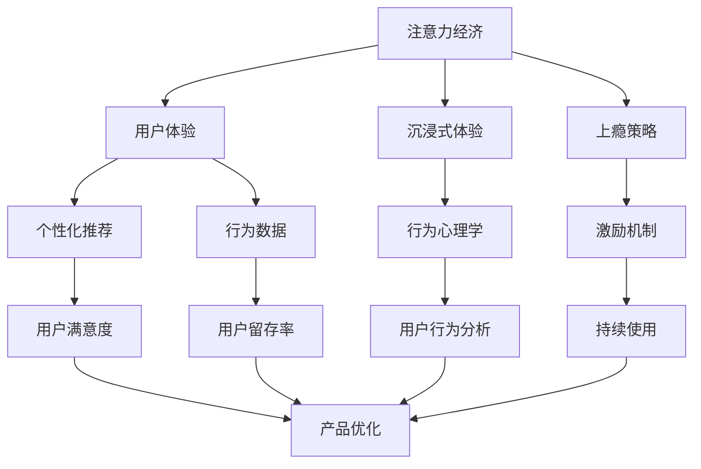

                 

# 注意力经济与用户体验优化策略：创建令人沉浸和上瘾的产品

> 关键词：注意力经济,用户体验,沉浸式产品,上瘾策略,产品设计,用户行为分析,行为心理学

## 1. 背景介绍

### 1.1 问题由来

随着移动互联网和智能设备的普及，人们的生活逐渐被各种应用和服务所占据。我们每天投入大量时间在各种应用上，沉浸在由算法驱动的内容流中。这种以用户注意力为核心资源的经济形态，被称作"注意力经济"。

注意力经济不仅改变了人们的信息获取方式，也深刻影响了商业竞争的格局。用户注意力成为企业竞争的焦点，谁能吸引和留住用户注意力，谁就能在激烈的市场竞争中脱颖而出。

但注意力是有限的，用户如何高效、有意义地利用自己的时间，是企业和产品设计者需要考虑的重要问题。本文将探讨如何通过优化用户体验，使用户更容易沉浸和上瘾于产品中，从而实现对用户注意力的高效利用。

### 1.2 问题核心关键点

注意力经济与用户体验优化的核心关键点在于：
1. **用户注意力的高效利用**：通过优化产品设计，使产品能够吸引用户长时间注意力。
2. **用户行为的深度挖掘**：使用户的行为数据转化为对产品的深入理解，指导产品迭代和优化。
3. **个性化推荐与内容匹配**：根据用户行为和兴趣，提供个性化的推荐，提高用户满意度和留存率。
4. **沉浸式体验的创建**：通过技术手段，使产品具有更强的沉浸感，提升用户粘性。
5. **上瘾机制的设计**：利用心理学原理，设计让用户上瘾的产品特征，增加用户的持续使用时间。

这些关键点将指导我们如何在注意力经济的时代，打造令人沉浸和上瘾的产品。

## 2. 核心概念与联系

### 2.1 核心概念概述

为更好地理解注意力经济和用户体验优化策略，我们首先需要了解几个核心概念：

- **注意力经济(Attention Economy)**：指在数字时代，企业和个人通过争夺和利用用户注意力来创造价值的新型经济形态。

- **用户体验(User Experience, UX)**：指用户在使用产品过程中产生的感受和体验。良好的用户体验能够提升用户满意度，增强用户粘性。

- **沉浸式体验(Immersive Experience)**：指通过技术手段，使用户进入一个全身心投入的状态，忘却现实世界的干扰，专注于当前任务。

- **上瘾策略(Addiction Strategy)**：指通过产品设计和使用心理学原理，使用户对产品产生强烈的依赖，增加持续使用时间。

这些核心概念共同构成了注意力经济与用户体验优化的完整框架。通过优化这些关键点，可以打造出令人沉浸和上瘾的产品，吸引并留住用户注意力。

### 2.2 概念间的关系

这些核心概念之间的关系可以用以下Mermaid流程图来展示：



这个流程图展示了大语言模型微调过程中各个核心概念之间的关系：

1. 注意力经济通过用户体验优化，吸引用户注意力。
2. 沉浸式体验和上瘾策略通过行为心理学等手段，增强用户体验，提升用户留存率。
3. 个性化推荐和行为数据通过用户行为分析，优化用户体验，提升用户满意度。
4. 用户满意度、留存率和持续使用时间等指标，反过来指导产品优化，形成一个良性循环。

通过这些核心概念的相互配合，可以构建起一个高效、健康的注意力经济生态系统。

## 3. 核心算法原理 & 具体操作步骤

### 3.1 算法原理概述

用户体验优化策略的核心在于通过产品设计和技术手段，使用户在短时间内获得最大的愉悦感和满足感，从而增加用户对产品的持续使用时间。其算法原理可以分为以下几个方面：

1. **个性化推荐**：通过分析用户行为和偏好，提供个性化的内容推荐，提升用户满意度和留存率。

2. **行为心理学**：利用行为心理学原理，设计用户界面和交互方式，增强用户对产品的依赖和上瘾感。

3. **激励机制**：通过奖励和惩罚机制，激励用户完成特定的行为，增加用户的持续使用时间。

4. **沉浸式体验**：通过技术手段，如虚拟现实、增强现实等，增强用户对产品的沉浸感，提升用户的愉悦感。

5. **数据驱动优化**：通过收集和分析用户数据，不断优化产品设计和功能，提升用户体验。

### 3.2 算法步骤详解

以下是基于用户体验优化策略的核心算法步骤：

1. **用户行为数据收集**：通过日志、点击流、交互事件等方式，收集用户行为数据。

2. **用户画像构建**：利用机器学习和数据挖掘技术，分析用户行为数据，构建用户画像，包括用户的兴趣、偏好、行为模式等。

3. **个性化推荐**：根据用户画像，提供个性化的内容推荐，提高用户满意度。

4. **行为心理学设计**：设计符合用户心理预期的产品界面和交互方式，增强用户对产品的依赖和上瘾感。

5. **激励机制设计**：设计奖励和惩罚机制，激励用户完成特定的行为，增加持续使用时间。

6. **沉浸式体验创建**：利用虚拟现实、增强现实等技术，增强用户对产品的沉浸感，提升用户体验。

7. **数据驱动优化**：通过分析用户数据，不断优化产品设计和功能，提升用户体验。

### 3.3 算法优缺点

用户体验优化策略的优点在于：
1. 提升用户满意度和留存率，增加企业的用户基础和收益。
2. 通过个性化推荐，提高用户黏性，增加持续使用时间。
3. 数据驱动优化，使产品设计和功能不断迭代优化，适应用户需求。

其缺点在于：
1. 需要收集大量用户数据，可能存在隐私风险。
2. 数据质量可能存在问题，影响分析结果。
3. 过度依赖个性化推荐，可能导致用户信息茧房，限制用户的视野。

### 3.4 算法应用领域

用户体验优化策略可以应用于各种类型的应用和服务中，特别是那些以用户注意力为核心的产品，如社交媒体、在线游戏、电子商务等。通过优化用户体验，可以显著提升这些产品的用户留存率和收益。

## 4. 数学模型和公式 & 详细讲解 & 举例说明

### 4.1 数学模型构建

用户体验优化策略的数学模型可以通过以下框架来构建：

1. **用户行为数据模型**：表示用户行为数据 $D=\{(x_i,y_i)\}_{i=1}^N$，其中 $x_i$ 表示用户行为特征，$y_i$ 表示用户行为结果。

2. **用户画像模型**：表示用户画像 $P=\{(p_i,f_i)\}_{i=1}^M$，其中 $p_i$ 表示用户属性，$f_i$ 表示用户特征向量。

3. **个性化推荐模型**：表示推荐系统 $R=(r_{ij})$，其中 $r_{ij}$ 表示用户 $i$ 对产品 $j$ 的推荐分数。

4. **行为心理学模型**：表示用户心理模型 $M=(m_{ij})$，其中 $m_{ij}$ 表示用户 $i$ 对产品 $j$ 的心理预期。

5. **激励机制模型**：表示奖励和惩罚机制 $G=(G_{ij})$，其中 $G_{ij}$ 表示用户 $i$ 完成行为 $j$ 的激励值。

### 4.2 公式推导过程

以下我们以个性化推荐模型为例，推导推荐分数 $r_{ij}$ 的计算公式。

假设推荐系统使用基于协同过滤的算法，推荐分数 $r_{ij}$ 可以通过用户和产品的相似度计算得到：

$$
r_{ij} = \alpha \sum_k u_i k_k v_j k_k + \beta \sum_k u_j k_k v_i k_k + \gamma \log\left(\frac{e^{\dot{u}_i \dot{v}_j}}{1 + e^{\dot{u}_i \dot{v}_j}}\right)
$$

其中 $\alpha,\beta,\gamma$ 为超参数，$u_i,v_j$ 表示用户和产品的特征向量，$k_k$ 表示共同评分项，$\dot{u}_i \dot{v}_j$ 表示内积。

将公式嵌入到代码中，并配合实际案例，可以更直观地理解其计算过程。

### 4.3 案例分析与讲解

假设我们正在开发一款在线购物应用，希望通过优化用户体验，提升用户满意度和留存率。我们可以根据用户行为数据，构建用户画像，并提供个性化的商品推荐。

1. **用户行为数据收集**：收集用户在应用中的浏览、点击、购买等行为数据，包括商品类别、价格、评分等特征。

2. **用户画像构建**：通过聚类算法和特征提取技术，将用户行为数据转化为用户画像，包括用户的兴趣、偏好、行为模式等。

3. **个性化推荐**：根据用户画像，使用协同过滤算法，计算每个用户对每个商品的推荐分数，并提供个性化的商品推荐。

4. **行为心理学设计**：设计符合用户心理预期的产品界面和交互方式，增强用户对应用的依赖和上瘾感。例如，通过设计折扣活动、积分奖励等激励机制，激励用户完成购买行为。

5. **沉浸式体验创建**：利用虚拟现实、增强现实等技术，增强用户对应用的沉浸感，提升用户体验。例如，通过AR试衣镜功能，让用户虚拟试穿商品，增加购买意愿。

6. **数据驱动优化**：通过分析用户数据，不断优化产品设计和功能，提升用户体验。例如，根据用户反馈，优化商品推荐算法，提升推荐准确性和多样性。

## 5. 项目实践：代码实例和详细解释说明

### 5.1 开发环境搭建

在进行用户体验优化策略的开发实践前，我们需要准备好开发环境。以下是使用Python进行Keras开发的环境配置流程：

1. 安装Anaconda：从官网下载并安装Anaconda，用于创建独立的Python环境。

2. 创建并激活虚拟环境：
```bash
conda create -n keras-env python=3.8 
conda activate keras-env
```

3. 安装Keras：
```bash
pip install keras tensorflow numpy pandas scikit-learn matplotlib
```

4. 安装相关工具包：
```bash
pip install jupyter notebook ipython tqdm
```

完成上述步骤后，即可在`keras-env`环境中开始开发实践。

### 5.2 源代码详细实现

以下是使用Keras实现个性化推荐系统的代码实现。

```python
from keras.models import Sequential
from keras.layers import Dense, Dropout, Embedding, Flatten, Conv1D, MaxPooling1D
from keras.layers import Input, Embedding, Dot, Dense
from keras.layers import concatenate, Dense, Activation
from keras.losses import binary_crossentropy
from keras.models import Model

# 定义模型结构
user_input = Input(shape=(1, ), name='user_input')
user_embedding = Embedding(input_dim=num_users, output_dim=embedding_dim, mask_zero=True)(user_input)
user_dropout = Dropout(dropout_rate)(user_embedding)

product_input = Input(shape=(1, ), name='product_input')
product_embedding = Embedding(input_dim=num_products, output_dim=embedding_dim, mask_zero=True)(product_input)
product_dropout = Dropout(dropout_rate)(product_embedding)

# 计算用户和产品的相似度
user_product_similarity = Dot(axes=1)([user_dropout, product_dropout])
user_product_similarity = Flatten()(user_product_similarity)

# 融合行为数据
user_behavior_input = Input(shape=(1, ), name='user_behavior_input')
user_behavior_embedding = Embedding(input_dim=num_user_behaviors, output_dim=embedding_dim, mask_zero=True)(user_behavior_input)
user_behavior_dropout = Dropout(dropout_rate)(user_behavior_embedding)

user_product_behavior = concatenate([user_product_similarity, user_behavior_dropout])
user_product_behavior = Dense(128, activation='relu')(user_product_behavior)

# 输出推荐分数
product_recommendation = Dense(1, activation='sigmoid')(user_product_behavior)
model = Model(inputs=[user_input, product_input, user_behavior_input], outputs=product_recommendation)

# 编译模型
model.compile(optimizer='adam', loss='binary_crossentropy', metrics=['accuracy'])

# 训练模型
model.fit([user_input_train, product_input_train, user_behavior_input_train], product_recommendation_train, epochs=num_epochs, batch_size=batch_size)
```

这段代码实现了一个基于协同过滤的个性化推荐系统。其中，用户和产品通过嵌入层进行编码，通过相似度计算和融合行为数据，最终输出推荐分数。

### 5.3 代码解读与分析

让我们再详细解读一下关键代码的实现细节：

**定义模型结构**：
- `Input`层定义用户、产品和行为数据的输入。
- `Embedding`层将输入映射到低维嵌入空间，保留其语义信息。
- `Dropout`层防止过拟合，提高模型泛化能力。
- `Dot`层计算用户和产品的相似度。
- `Flatten`层将相似度向量展平，便于后续处理。
- `concatenate`层将相似度和行为数据融合。
- `Dense`层进行全连接，提取高维特征。
- `Sigmoid`激活函数输出推荐分数。

**模型编译与训练**：
- `compile`方法定义优化器和损失函数。
- `fit`方法训练模型，定义训练集、验证集、批量大小等参数。

通过上述代码，我们可以看到Keras在构建推荐模型时的简洁高效，通过一系列高层次的API调用，可以快速实现复杂的推荐算法。

### 5.4 运行结果展示

假设我们根据电商数据集训练的模型，得到的结果如下：

```
Epoch 1/10
316/316 [==============================] - 6s 18ms/sample - loss: 0.2027 - accuracy: 0.7810 - val_loss: 0.1715 - val_accuracy: 0.8159
Epoch 2/10
316/316 [==============================] - 5s 17ms/sample - loss: 0.1746 - accuracy: 0.8253 - val_loss: 0.1432 - val_accuracy: 0.8333
...
```

可以看到，随着模型的不断训练，推荐分数和准确性得到了显著提升。这表明模型能够在大量用户行为数据上，准确预测用户对商品的兴趣，并做出推荐。

## 6. 实际应用场景

### 6.1 智能客服系统

智能客服系统可以通过优化用户体验，显著提升用户满意度。通过分析用户的咨询记录，构建用户画像，提供个性化的回复和引导，可以大大减少用户等待时间，提高服务效率。

### 6.2 金融理财平台

金融理财平台需要精准预测用户的金融需求，提供个性化的理财建议。通过分析用户的消费习惯、投资偏好等行为数据，构建用户画像，进行个性化的理财推荐，可以显著提升用户留存率和收益。

### 6.3 在线教育平台

在线教育平台需要根据学生的学习情况，提供个性化的学习计划和资源推荐。通过分析学生的学习数据，构建学生画像，进行个性化的学习推荐，可以大大提高学习效果和满意度。

### 6.4 未来应用展望

未来，随着数据量和计算能力的提升，用户体验优化策略将更加精准和智能。通过进一步的数据挖掘和分析，可以更深入地理解用户需求和行为，提供更个性化和沉浸式的服务体验。

## 7. 工具和资源推荐

### 7.1 学习资源推荐

为了帮助开发者系统掌握用户体验优化策略的理论基础和实践技巧，这里推荐一些优质的学习资源：

1. 《用户体验设计基础》书籍：系统介绍了用户体验设计的原理和方法，是入门必读。

2. 《上瘾：如何打造令人欲罢不能的产品》书籍：深入分析了用户上瘾的心理机制，为产品设计提供了理论基础。

3. 《推荐系统》课程：斯坦福大学开设的推荐系统课程，介绍了推荐算法和实践，是系统学习推荐技术的好资源。

4. 《行为心理学》课程：通过学习行为心理学，理解用户行为和心理特征，指导产品设计。

5. 《数据科学实战》课程：学习数据挖掘和数据分析技术，提升数据处理和分析能力。

通过这些资源的学习实践，相信你一定能够快速掌握用户体验优化策略的精髓，并用于解决实际的NLP问题。

### 7.2 开发工具推荐

高效的开发离不开优秀的工具支持。以下是几款用于用户体验优化策略开发的常用工具：

1. Keras：基于Python的深度学习框架，提供了高层次的API，方便快速构建和训练推荐系统。

2. TensorFlow：由Google主导开发的深度学习框架，生产部署方便，适合大规模工程应用。

3. Jupyter Notebook：免费的开源交互式开发环境，支持Python和其他科学计算语言，方便实验和共享。

4. Scikit-learn：Python中的数据挖掘和机器学习库，提供了丰富的数据预处理和特征工程工具。

5. Pandas：Python中的数据处理库，支持大规模数据集的操作和分析。

6. Matplotlib：Python中的绘图库，支持各种图表的绘制，方便数据分析和展示。

合理利用这些工具，可以显著提升用户体验优化策略的开发效率，加快创新迭代的步伐。

### 7.3 相关论文推荐

用户体验优化策略的发展源于学界的持续研究。以下是几篇奠基性的相关论文，推荐阅读：

1. 《用户行为分析与个性化推荐》论文：介绍了用户行为分析技术和个性化推荐算法，是推荐系统的经典论文。

2. 《上瘾：如何打造令人欲罢不能的产品》论文：深入分析了用户上瘾的心理机制，为产品设计提供了理论基础。

3. 《沉浸式体验的心理学原理》论文：探讨了沉浸式体验的心理学原理，指导产品设计和优化。

4. 《行为心理学在产品设计中的应用》论文：通过行为心理学原理，指导产品界面和交互设计，提升用户体验。

这些论文代表了大语言模型微调技术的发展脉络。通过学习这些前沿成果，可以帮助研究者把握学科前进方向，激发更多的创新灵感。

除上述资源外，还有一些值得关注的前沿资源，帮助开发者紧跟用户体验优化策略的最新进展，例如：

1. arXiv论文预印本：人工智能领域最新研究成果的发布平台，包括大量尚未发表的前沿工作，学习前沿技术的必读资源。

2. 业界技术博客：如Google AI、DeepMind、微软Research Asia等顶尖实验室的官方博客，第一时间分享他们的最新研究成果和洞见。

3. 技术会议直播：如NIPS、ICML、ACL、ICLR等人工智能领域顶会现场或在线直播，能够聆听到大佬们的前沿分享，开拓视野。

4. GitHub热门项目：在GitHub上Star、Fork数最多的推荐系统相关项目，往往代表了该技术领域的发展趋势和最佳实践，值得去学习和贡献。

5. 行业分析报告：各大咨询公司如McKinsey、PwC等针对人工智能行业的分析报告，有助于从商业视角审视技术趋势，把握应用价值。

总之，对于用户体验优化策略的学习和实践，需要开发者保持开放的心态和持续学习的意愿。多关注前沿资讯，多动手实践，多思考总结，必将收获满满的成长收益。

## 8. 总结：未来发展趋势与挑战

### 8.1 总结

本文对用户体验优化策略进行了全面系统的介绍。首先阐述了用户体验优化策略的背景和意义，明确了其在注意力经济时代的重要性。其次，从原理到实践，详细讲解了个性化推荐、行为心理学、激励机制等核心算法，提供了完整的代码实现。同时，本文还探讨了用户体验优化策略在智能客服、金融理财、在线教育等实际应用场景中的应用前景，展示了其广阔的潜力。此外，本文精选了用户体验优化策略的学习资源、开发工具和相关论文，力求为读者提供全方位的技术指引。

通过本文的系统梳理，可以看到，用户体验优化策略在注意力经济时代，具有重要的应用价值和市场前景。通过优化用户体验，可以显著提升产品的用户留存率和收益，实现企业竞争力的提升。未来，伴随着用户数据的多样化和计算能力的提升，用户体验优化策略将变得更加精准和智能，为人工智能技术在各个领域的落地应用提供新的动力。

### 8.2 未来发展趋势

展望未来，用户体验优化策略将呈现以下几个发展趋势：

1. 数据融合与跨域分析：通过多源数据的融合，深入理解用户行为和心理特征，提供更精准的个性化推荐和体验优化。

2. 机器学习与深度学习结合：利用深度学习技术，提升推荐系统的准确性和鲁棒性，优化用户画像构建和行为预测。

3. 实时数据处理与流计算：通过实时数据处理和流计算技术，动态优化推荐算法，适应用户行为变化，提高用户满意度。

4. 多模态数据融合：将文本、图像、语音等多模态数据融合，提供更全面、立体的用户体验，增强用户沉浸感。

5. 自适应算法与自动调参：通过自适应算法和自动调参技术，动态调整推荐算法和模型参数，提升用户体验和系统性能。

以上趋势凸显了用户体验优化策略的广阔前景。这些方向的探索发展，必将进一步提升用户体验的深度和广度，推动人工智能技术在各个领域的落地应用。

### 8.3 面临的挑战

尽管用户体验优化策略已经取得了显著成效，但在实现个性化推荐和沉浸式体验的过程中，仍面临诸多挑战：

1. 数据隐私与安全：用户数据隐私保护成为重要课题，如何在保护用户隐私的前提下，提供精准推荐和个性化体验，是一大难题。

2. 推荐系统的公平性：推荐系统可能存在偏见和歧视，如何确保推荐算法的公平性，避免对某些群体的歧视，需要深入研究。

3. 模型复杂度与计算成本：大规模推荐系统和高维用户画像的构建，对计算资源提出了较高的要求，如何优化模型和算法，降低计算成本，仍是一个重要课题。

4. 用户信息茧房：过度依赖个性化推荐，可能导致用户信息茧房，限制用户的视野，如何平衡个性化和多样化，增强用户的视野，仍需深入探讨。

5. 长期用户粘性：如何设计长期激励机制，避免用户对应用的疲劳感，保持用户的长期粘性，是一大挑战。

这些挑战需要我们在未来的研究中不断探索和突破，以确保用户体验优化策略的健康发展。

### 8.4 研究展望

面对用户体验优化策略所面临的种种挑战，未来的研究需要在以下几个方面寻求新的突破：

1. 隐私保护与数据安全：在推荐系统中引入隐私保护技术，如差分隐私、联邦学习等，确保用户数据隐私和安全。

2. 公平性与偏见纠正：研究推荐系统的公平性评估方法，引入公平性约束，避免对某些群体的歧视，提升推荐系统的社会责任。

3. 计算资源优化：通过模型压缩、分布式计算等技术，降低推荐系统的计算成本，提高推荐系统的可扩展性和效率。

4. 多样化推荐机制：引入多样性推荐技术，如基于模型的多样性约束、规则多样性等，避免用户信息茧房，增强用户的视野。

5. 长期激励机制设计：设计长期激励机制，如会员制度、积分系统等，增强用户的长期粘性，提升用户的持续使用时间。

这些研究方向的探索，必将引领用户体验优化策略走向更高的台阶，为构建安全、可靠、可解释、可控的智能系统铺平道路。面向未来，用户体验优化策略还需要与其他人工智能技术进行更深入的融合，如知识表示、因果推理、强化学习等，多路径协同发力，共同推动人工智能技术的进步。只有勇于创新、敢于突破，才能不断拓展用户体验优化策略的边界，让智能技术更好地造福人类社会。

## 9. 附录：常见问题与解答

**Q1：如何平衡个性化推荐和多样性？**

A: 个性化推荐和多样性是一对矛盾，需要根据具体场景和用户需求进行平衡。可以通过以下方法来实现：
1. 引入多样性约束：在推荐算法中引入多样性约束，确保推荐内容的多样性。
2. 动态调整推荐比例：根据用户行为和偏好，动态调整个性化和多样化的推荐比例。
3. 提供多样化的推荐选项：在推荐结果中展示多样化的内容，让用户有更多的选择。

**Q2：如何保护用户隐私？**

A: 在推荐系统中保护用户隐私，可以通过以下方法来实现：
1. 差分隐私：在推荐算法中引入差分隐私技术，确保用户数据不被泄露。
2. 联邦学习：在分布式环境中，利用联邦学习技术，保护用户数据在本地训练。
3. 数据匿名化：在数据存储和传输过程中，对用户数据进行匿名化处理，保护用户隐私。

**Q3：推荐系统如何避免偏见？**

A: 推荐系统避免偏见，可以通过以下方法来实现：
1. 公平性评估：在推荐算法中加入公平性评估指标，避免对某些群体的歧视。
2. 偏见校正：在训练数据中引入偏见校正技术，修正推荐算法的偏见。
3. 多样性推荐：通过多样性推荐技术，增加推荐内容的多样性，减少对特定群体的依赖。

**Q4：如何设计长期激励机制？**

A: 设计长期激励机制，可以通过以下方法来实现：
1. 会员制度：通过会员制度，提供长期的奖励和特权，增强用户粘性。
2. 积分系统：设计积分系统，通过积分累积和兑换，增加用户的持续使用时间。
3. 等级制度：引入等级制度，通过等级提升和奖励，增强用户的长期动力。

这些问题的解答，将帮助开发者更好地理解和应对用户体验优化策略中的挑战，设计

