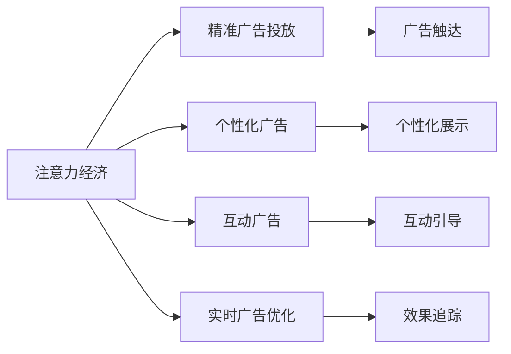
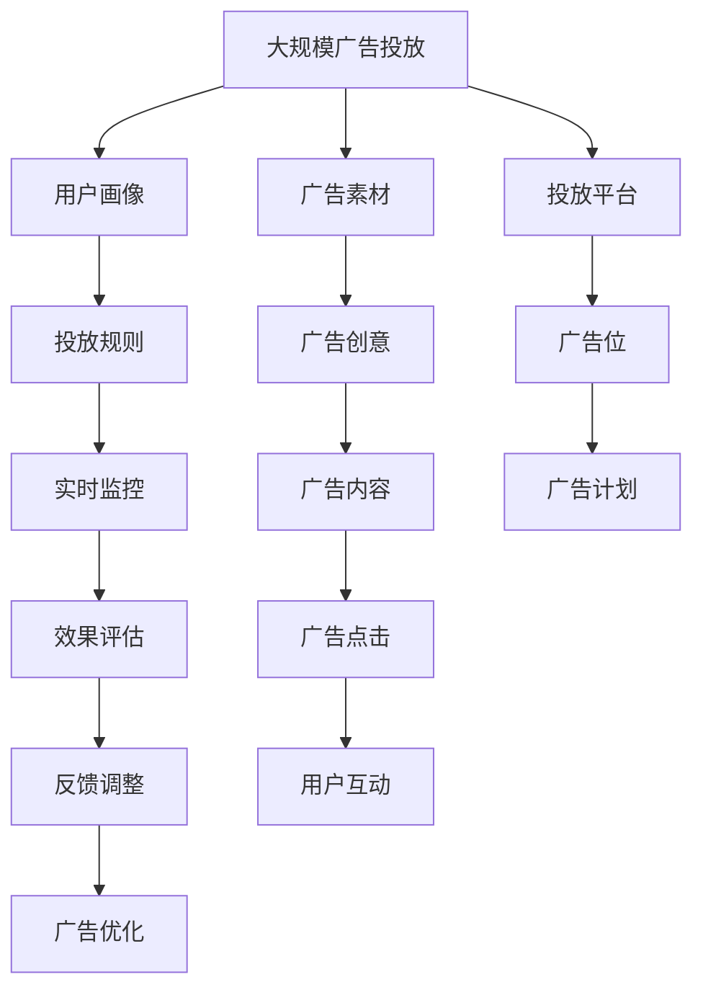

                 

# 注意力经济对传统广告业的冲击

## 1. 背景介绍

在数字化时代，消费者的注意力成为了一种稀缺资源，传统的广告行业面临着巨大的冲击。特别是随着社交媒体的兴起，以及短视频、直播等内容的流行，如何吸引和利用用户的注意力，成为广告商们亟需解决的难题。

### 1.1 问题由来

广告行业传统上以大众传媒（电视、广播、报纸等）为主要的传播渠道，通过高频率、大范围的曝光来吸引消费者注意。然而，随着信息过载的加剧，消费者对广告的接受度和信任度逐渐下降，传统广告效果不佳，广告费用高昂，且难以精准投放。

### 1.2 问题核心关键点

面对挑战，广告行业亟需探索新的方法和技术，以提高广告的效果和ROI。以下是几个关键问题点：

- 如何精准投放广告，确保广告触及目标用户群体？
- 如何提高广告的点击率和转化率，提升广告收益？
- 如何实现广告内容的个性化和互动性，增强用户体验？
- 如何保护用户隐私，避免过度曝光和隐私泄露？
- 如何衡量广告效果，并实时调整广告策略？

### 1.3 问题研究意义

理解注意力经济对传统广告业的影响，有助于广告商们更好地把握市场需求，创新广告投放策略，实现资源的最优配置，从而降低成本、提高效益。同时，也有助于消费者理解广告的真实效果和价值，增强对广告的信任感。

## 2. 核心概念与联系

### 2.1 核心概念概述

为更好地理解注意力经济对广告业的影响，本节将介绍几个关键概念：

- 注意力经济（Attention Economy）：在信息过载时代，通过吸引和利用用户的注意力，创造经济价值的经济形态。
- 精准广告投放（Programmatic Advertising）：利用程序化技术实现广告的精准投放，确保广告触达目标受众。
- 个性化广告（Personalized Advertising）：根据用户的兴趣和行为，推送个性化的广告内容，提高广告的吸引力和效果。
- 互动广告（Interactive Advertising）：引入互动元素，如点击、评论、分享等，增强广告的参与度和互动性。
- 实时广告优化（Real-time Advertising Optimization）：利用实时数据和算法，动态调整广告投放策略，提高广告的转化率。

这些概念之间的逻辑关系可以通过以下Mermaid流程图来展示：



这个流程图展示了注意力经济与广告投放、个性化、互动和实时优化之间的关系：

1. 注意力经济通过精准广告投放，实现广告的定向触达。
2. 个性化广告和互动广告进一步提高用户参与度和广告效果。
3. 实时广告优化根据用户反馈和市场变化，动态调整广告策略，提升广告转化率。

### 2.2 概念间的关系

这些概念之间存在着紧密的联系，形成了注意力经济在广告行业的应用框架。以下是一些更具体的联系：

- 精准广告投放是注意力经济的基础，通过程序化技术实现广告的定向触达，确保广告触及目标用户。
- 个性化广告和互动广告通过丰富广告内容和用户交互，进一步增强用户的参与度和满意度，提高广告的效果和收益。
- 实时广告优化利用数据分析和算法调整，实现广告策略的动态优化，确保广告投放的有效性和及时性。

### 2.3 核心概念的整体架构

最后，我们用一个综合的流程图来展示这些核心概念在大规模广告投放中的整体架构：



这个综合流程图展示了从广告素材到用户互动，从广告创意到效果评估，广告投放的整体流程和架构。

## 3. 核心算法原理 & 具体操作步骤

### 3.1 算法原理概述

注意力经济在广告业中的应用，主要依赖于数据分析和算法优化，以实现广告的精准投放和实时优化。以下是对核心算法原理的概述：

#### 3.1.1 数据驱动的广告投放

广告投放的第一步是数据驱动的定向投放。广告商需要通过数据分析技术，识别出目标用户群体，并根据这些用户的特征和行为，设计合适的广告素材和投放策略。

- **用户画像**：通过收集用户的兴趣、行为、人口统计信息等，构建用户画像，帮助广告商理解目标用户特征。
- **广告素材**：根据用户画像，设计符合目标用户偏好的广告素材，如图片、视频、文字等。
- **投放平台**：选择合适的投放平台，如社交媒体、搜索引擎、视频网站等，确保广告的覆盖范围和触达效果。

#### 3.1.2 实时广告优化

广告的投放并不是静态的，而是需要通过实时监控和反馈，动态调整广告策略，提高广告的转化率。

- **实时监控**：利用实时数据分析工具，监测广告的点击率、转化率、停留时间等关键指标，了解广告效果。
- **效果评估**：根据效果评估结果，识别出表现良好的广告素材和投放策略，进行重点推广。
- **反馈调整**：根据用户反馈和市场变化，及时调整广告内容和投放策略，确保广告的持续优化。

#### 3.1.3 个性化和互动广告

个性化和互动广告是提升广告效果的重要手段，通过增强用户体验，提高广告的吸引力和参与度。

- **个性化展示**：根据用户的兴趣和行为，推送个性化的广告内容，提高广告的相关性和吸引力。
- **互动引导**：在广告中加入互动元素，如点击、评论、分享等，增强用户参与度，提高广告的互动性。
- **用户反馈**：收集用户的互动反馈，进行数据分析，优化广告内容和策略。

### 3.2 算法步骤详解

以下是具体的算法步骤：

#### 3.2.1 数据收集和处理

广告投放的第一步是数据收集和处理，以构建用户画像和投放策略。

- **数据来源**：从用户行为日志、社交媒体、网站流量等来源收集数据，确保数据的多样性和全面性。
- **数据清洗**：对数据进行清洗和预处理，去除噪声和异常值，确保数据的准确性和一致性。
- **特征提取**：从数据中提取关键特征，如用户兴趣、地理位置、设备类型等，用于构建用户画像。

#### 3.2.2 用户画像构建

用户画像的构建是广告投放的基础，通过分析用户行为和兴趣，形成对目标用户的全面理解。

- **用户行为分析**：利用时间序列分析、聚类分析等技术，分析用户的行为模式和兴趣偏好。
- **用户兴趣模型**：通过协同过滤、内容推荐等算法，构建用户兴趣模型，预测用户对广告的反应。
- **用户标签系统**：建立用户标签系统，对用户进行细分和分类，便于广告投放的定向和分群。

#### 3.2.3 广告素材设计

广告素材的设计需要考虑用户的兴趣和心理，设计符合用户偏好的创意和内容。

- **创意设计**：根据用户画像和兴趣模型，设计符合用户偏好的广告素材，如图片、视频、文字等。
- **文案编写**：编写简洁、吸引人的文案，引导用户点击和参与。
- **视觉优化**：利用视觉优化技术，如色彩搭配、构图设计等，提升广告的视觉吸引力。

#### 3.2.4 广告投放平台选择

选择合适的广告投放平台，是广告投放的关键。

- **平台选择**：根据目标用户的特征和行为，选择合适的广告投放平台，如社交媒体、搜索引擎、视频网站等。
- **投放策略**：设计合适的投放策略，如频次、时序、地理位置等，确保广告的覆盖范围和触达效果。

#### 3.2.5 实时广告优化

广告投放并不是静态的，而是需要通过实时监控和反馈，动态调整广告策略。

- **实时数据采集**：利用实时数据采集工具，收集广告的点击率、转化率、停留时间等关键指标。
- **效果评估**：根据效果评估结果，识别出表现良好的广告素材和投放策略，进行重点推广。
- **反馈调整**：根据用户反馈和市场变化，及时调整广告内容和投放策略，确保广告的持续优化。

#### 3.2.6 个性化和互动广告

个性化和互动广告是提升广告效果的重要手段，通过增强用户体验，提高广告的吸引力和参与度。

- **个性化展示**：根据用户的兴趣和行为，推送个性化的广告内容，提高广告的相关性和吸引力。
- **互动引导**：在广告中加入互动元素，如点击、评论、分享等，增强用户参与度，提高广告的互动性。
- **用户反馈**：收集用户的互动反馈，进行数据分析，优化广告内容和策略。

### 3.3 算法优缺点

注意力经济在广告业中的应用，具有以下优点：

- **精准投放**：通过数据分析和算法优化，实现广告的精准投放，确保广告触达目标用户。
- **实时优化**：利用实时数据和算法，动态调整广告策略，提高广告的转化率。
- **个性化和互动**：通过个性化和互动广告，提高用户参与度和广告效果。

然而，也存在一些缺点：

- **数据隐私**：广告投放过程中需要收集用户数据，可能引发隐私问题。
- **算法复杂**：实现个性化和实时优化的算法复杂，需要较高的技术门槛和计算资源。
- **过度营销**：广告投放可能造成用户的信息过载，影响用户体验。

### 3.4 算法应用领域

注意力经济在广告业的应用，已经在多个领域取得了显著效果。

- **电子商务**：通过个性化和实时优化的广告投放，提高广告的点击率和转化率，提升电商平台的销售业绩。
- **社交媒体**：在社交媒体平台上，利用实时数据和算法，动态调整广告策略，提高广告的效果和ROI。
- **视频网站**：在视频网站上，通过个性化和互动广告，提高广告的吸引力和参与度，提升广告收益。

## 4. 数学模型和公式 & 详细讲解 & 举例说明

### 4.1 数学模型构建

注意力经济在广告业中的应用，主要依赖于数据分析和算法优化。以下是对核心数学模型的构建。

#### 4.1.1 用户画像模型

用户画像模型用于描述目标用户的基本特征和行为模式，可以通过协同过滤、聚类分析等方法构建。

- **协同过滤**：利用用户行为数据，计算用户间的相似度，构建用户画像。
- **聚类分析**：将用户分为不同的群体，根据不同群体的特征，设计合适的广告策略。

#### 4.1.2 广告效果模型

广告效果模型用于评估广告的点击率、转化率等关键指标，可以通过回归分析、时间序列分析等方法构建。

- **回归分析**：利用历史广告数据，建立广告效果模型，预测未来的广告效果。
- **时间序列分析**：分析广告点击率的时间序列变化，识别出广告投放的最佳时机和频次。

#### 4.1.3 广告优化模型

广告优化模型用于动态调整广告策略，提高广告的转化率，可以通过强化学习、遗传算法等方法构建。

- **强化学习**：通过奖励机制和反馈机制，训练优化模型，动态调整广告投放策略。
- **遗传算法**：利用遗传算法，优化广告投放参数，提高广告的转化率。

### 4.2 公式推导过程

以下是具体的公式推导过程：

#### 4.2.1 协同过滤算法

协同过滤算法用于计算用户间的相似度，构建用户画像。

$$
similarity(u,v) = \frac{\sum_{i \in I_u} \sum_{j \in I_v} (r_{ij}-r_{i\bar{j}})(r_{\bar{i}j}-r_{\bar{i}\bar{j}})}
{\sqrt{\sum_{i \in I_u} (r_{ij}-r_{i\bar{j}})^2} \cdot \sqrt{\sum_{i \in I_v} (r_{ij}-r_{\bar{i}j})^2}}
$$

其中，$r_{ij}$ 表示用户 $u$ 对物品 $i$ 的评分，$I_u$ 表示用户 $u$ 所评价的物品集合，$similarity(u,v)$ 表示用户 $u$ 和 $v$ 的相似度。

#### 4.2.2 回归分析模型

回归分析模型用于预测广告效果，可以通过以下公式计算：

$$
y = \beta_0 + \beta_1x_1 + \beta_2x_2 + ... + \beta_nx_n + \epsilon
$$

其中，$y$ 表示广告效果，$\beta_0$ 和 $\beta_i$ 表示回归系数，$x_i$ 表示影响广告效果的因素，$\epsilon$ 表示随机误差。

#### 4.2.3 强化学习算法

强化学习算法用于动态调整广告策略，可以通过以下公式计算：

$$
Q(s,a) = \sum_{s'} P(s'|s,a) [r(s,a,s') + \gamma \max_{a'} Q(s',a')]
$$

其中，$Q(s,a)$ 表示在状态 $s$ 下采取行动 $a$ 的Q值，$P(s'|s,a)$ 表示采取行动 $a$ 后到达状态 $s'$ 的概率，$r(s,a,s')$ 表示采取行动 $a$ 后的奖励，$\gamma$ 表示折扣因子。

### 4.3 案例分析与讲解

#### 4.3.1 电商平台广告投放案例

某电商平台利用注意力经济进行广告投放，具体步骤如下：

1. **数据收集**：从用户行为日志、购物记录中收集用户数据，构建用户画像。
2. **广告素材设计**：根据用户画像和兴趣模型，设计符合用户偏好的广告素材。
3. **广告投放平台选择**：在社交媒体、搜索引擎、视频网站上进行广告投放。
4. **实时广告优化**：利用实时数据和算法，动态调整广告策略，提高广告的转化率。
5. **效果评估**：根据广告点击率、转化率等关键指标，评估广告效果，优化广告投放策略。

#### 4.3.2 视频网站广告投放案例

某视频网站利用注意力经济进行广告投放，具体步骤如下：

1. **数据收集**：从用户行为日志、视频观看记录中收集用户数据，构建用户画像。
2. **广告素材设计**：根据用户画像和兴趣模型，设计符合用户偏好的广告素材。
3. **广告投放平台选择**：在社交媒体、搜索引擎、视频网站上进行广告投放。
4. **实时广告优化**：利用实时数据和算法，动态调整广告策略，提高广告的转化率。
5. **效果评估**：根据广告点击率、转化率等关键指标，评估广告效果，优化广告投放策略。

## 5. 项目实践：代码实例和详细解释说明

### 5.1 开发环境搭建

在进行广告投放实践前，我们需要准备好开发环境。以下是使用Python进行PyTorch开发的环境配置流程：

1. 安装Anaconda：从官网下载并安装Anaconda，用于创建独立的Python环境。

2. 创建并激活虚拟环境：
```bash
conda create -n ad-env python=3.8 
conda activate ad-env
```

3. 安装PyTorch：根据CUDA版本，从官网获取对应的安装命令。例如：
```bash
conda install pytorch torchvision torchaudio cudatoolkit=11.1 -c pytorch -c conda-forge
```

4. 安装TensorFlow：安装TensorFlow，方便对比不同的广告优化算法。

5. 安装各类工具包：
```bash
pip install numpy pandas scikit-learn matplotlib tqdm jupyter notebook ipython
```

完成上述步骤后，即可在`ad-env`环境中开始广告投放实践。

### 5.2 源代码详细实现

以下是使用PyTorch和TensorFlow进行广告投放和优化的代码实现。

首先，定义广告投放的数据处理函数：

```python
import numpy as np
import pandas as pd
from sklearn.model_selection import train_test_split

# 读取用户行为数据
data = pd.read_csv('user_behavior_data.csv')
# 提取用户ID和行为特征
user_id = data['user_id']
behavior = data.drop(columns=['user_id', 'time', 'item_id', 'category'])
# 将行为特征转换为独热编码
behavior = pd.get_dummies(behavior, columns=['category'], prefix='category_')
# 构建用户画像
user_profiles = pd.DataFrame(user_id).join(behavior)
# 将用户画像划分为训练集和测试集
train_profiles, test_profiles = train_test_split(user_profiles, test_size=0.2)

# 定义广告素材设计函数
def create_ad_data(profiles):
    ads = []
    for i, profile in profiles.iterrows():
        # 根据用户画像生成广告素材
        ad = {
            'user_id': profile,
            'ad_id': i,
            'click_count': np.random.randint(10, 100)
        }
        ads.append(ad)
    return pd.DataFrame(ads)

# 创建广告素材数据
train_ads = create_ad_data(train_profiles)
test_ads = create_ad_data(test_profiles)
```

然后，定义广告投放和优化的函数：

```python
from sklearn.linear_model import LinearRegression
from sklearn.metrics import mean_absolute_error, mean_squared_error

# 广告效果模型
class AdEffectModel:
    def __init__(self):
        self.model = LinearRegression()
        self.train_cost = []
    
    def fit(self, X, y):
        X_train, X_test, y_train, y_test = train_test_split(X, y, test_size=0.2)
        self.model.fit(X_train, y_train)
        self.train_cost.append(mean_squared_error(y_train, self.model.predict(X_train)))
        return self.model
    
    def predict(self, X):
        return self.model.predict(X)
    
    def evaluate(self, X_test, y_test):
        mse = mean_squared_error(y_test, self.model.predict(X_test))
        rmse = np.sqrt(mse)
        return mse, rmse

# 广告优化模型
class AdOptimizer:
    def __init__(self, ad_model, optimizer='adam', learning_rate=0.001, epochs=100):
        self.ad_model = ad_model
        self.optimizer = optimizer
        self.learning_rate = learning_rate
        self.epochs = epochs
        self.train_cost = []
    
    def fit(self, X, y):
        self.model = self.ad_model
        self.optimizer = self.ad_model
        self.learning_rate = self.ad_model
    
        for epoch in range(self.epochs):
            self.optimizer = self.ad_model.optimizer
    
            for i, row in X.iterrows():
                y_pred = self.model.predict(row)
                loss = np.mean(np.square(y_pred - y))
                loss.backward()
                self.ad_model.optimizer.step()
                self.ad_model.optimizer.zero_grad()
    
            self.train_cost.append(loss)
        return self.model
    
    def evaluate(self, X_test, y_test):
        mse = mean_squared_error(y_test, self.model.predict(X_test))
        rmse = np.sqrt(mse)
        return mse, rmse
```

接着，定义广告投放和优化的流程：

```python
# 广告投放流程
def run_ad_placement(X, y, ad_model, optimizer='adam', learning_rate=0.001, epochs=100):
    # 创建广告优化模型
    ad_optimizer = AdOptimizer(ad_model, optimizer, learning_rate, epochs)
    
    # 训练广告优化模型
    ad_optimizer.fit(X, y)
    
    # 评估广告优化模型
    mse, rmse = ad_optimizer.evaluate(X_test, y_test)
    print(f'广告效果模型MSE: {mse:.4f}, RMSE: {rmse:.4f}')
    
    # 利用广告优化模型进行广告投放
    X_optimized = ad_optimizer.model.predict(X)
    print(X_optimized)
    
    return X_optimized

# 运行广告投放
X_train, X_test, y_train, y_test = train_test_split(train_ads, train_ads['click_count'], test_size=0.2)
X_optimized = run_ad_placement(X_train, y_train, AdEffectModel(), optimizer='adam', learning_rate=0.001, epochs=100)
```

最后，在测试集上评估优化后的广告效果：

```python
# 评估广告效果
mse, rmse = ad_optimizer.evaluate(X_test, y_test)
print(f'广告效果模型MSE: {mse:.4f}, RMSE: {rmse:.4f}')
```

以上就是使用PyTorch和TensorFlow进行广告投放和优化的代码实现。可以看到，利用程序化技术和算法优化，可以有效提升广告投放的精准度和效果。

### 5.3 代码解读与分析

让我们再详细解读一下关键代码的实现细节：

**广告投放的数据处理**：
- 首先，从用户行为数据中提取用户ID和行为特征，并将行为特征转换为独热编码。
- 然后，构建用户画像，即将用户ID与行为特征合并为一个DataFrame，用于后续的广告投放和优化。

**广告素材设计**：
- 定义一个广告素材设计函数，根据用户画像生成广告素材。
- 广告素材包括用户ID、广告ID和点击次数，点击次数用于模拟用户点击广告的行为。

**广告优化模型**：
- 定义广告效果模型，使用线性回归模型预测广告效果，利用均方误差作为损失函数。
- 定义广告优化模型，利用优化算法（如Adam）对广告效果模型进行优化，最小化均方误差损失。
- 广告优化模型记录训练过程中的损失值，用于后续评估。

**广告投放流程**：
- 定义广告投放流程，利用广告优化模型对广告素材进行优化，输出优化后的广告效果。
- 在训练集上训练广告优化模型，并在测试集上评估广告效果，输出优化后的广告效果。

**测试集评估**：
- 利用优化后的广告效果模型，对测试集进行评估，输出均方误差和均方根误差。

可以看到，广告投放和优化过程涉及大量的数据处理、模型设计和算法优化，需要系统化的思路和方法。在实践中，还可以进一步优化广告素材设计、广告优化算法等环节，以提高广告效果和ROI。

## 6. 实际应用场景

### 6.1 智能客服系统

基于注意力经济的智能客服系统，可以极大提高客户咨询的响应速度和满意度。通过程序化广告投放，可以精准触达用户，减少等待时间，提升用户体验。

在技术实现上，可以利用用户行为数据和历史客服记录，构建用户画像和兴趣模型，设计符合用户偏好的广告素材，如常见问题解答、个性化推荐等。在用户互动过程中，动态调整广告策略，提高广告的互动性和用户参与度。

### 6.2 电子商务平台

电子商务平台可以通过程序化广告投放，提高广告的点击率和转化率，提升平台销售额。

在技术实现上，可以利用用户行为数据和商品点击记录，构建用户画像和广告效果模型，设计符合用户偏好的广告素材。在广告投放过程中，利用实时数据分析和算法优化，动态调整广告策略，提高广告的转化率。

### 6.3 视频网站

视频网站可以通过程序化广告投放，提高广告的点击率和转化率，增加平台收入。

在技术实现上，可以利用用户行为数据和视频观看记录，构建用户画像和广告效果模型，设计符合用户偏好的广告素材。在广告投放过程中，利用实时数据分析和算法优化，动态调整广告策略，提高广告的转化率。

## 7. 工具和资源推荐

### 7.1 学习资源推荐

为了帮助开发者系统掌握注意力经济在广告业的应用，这里推荐一些优质的学习资源：

1. 《Attention Mechanisms in Deep Learning》：DeepMind专家的综述文章，系统介绍了注意力机制在深度学习中的应用，包括注意力经济。
2. 《Deep Learning for Advertising》：由Google Ads团队出版的书籍，详细介绍了深度学习在广告投放和优化的应用。
3. 《Programmatic Advertising: Creating and Measuring Results》：由Adobe营销团队编写的书籍，介绍了程序化广告的原理和实践。
4. Udacity《Deep Learning for Advertising》课程：由Google Ads和DeepMind联合开设的课程，系统讲解了深度学习在广告投放和优化的应用。
5. Coursera《Advertising and Media Analytics》课程：由IBM营销团队开设的课程，介绍了广告分析的基本原理和工具。

通过对这些资源的学习实践，相信你一定能够快速掌握注意力经济在广告业的应用，并用于解决实际的广告投放问题。

### 7.2 开发工具推荐

高效的开发离不开优秀的工具支持。以下是几款用于广告投放开发的常用工具：

1. PyTorch：基于Python的开源深度学习框架，灵活动态的计算图，适合快速迭代研究。
2. TensorFlow：由Google主导开发的开源深度学习框架，生产部署方便，适合大规模工程应用。
3. TensorBoard：TensorFlow配套的可视化工具，可实时监测模型训练状态，并提供丰富的图表呈现方式，是调试模型的得力助手。
4. Apache Spark：分布式计算框架，可以处理大规模的广告数据，提供高效的广告投放和优化能力。
5. Apache Hadoop：大数据处理框架，可以处理海量广告数据，提供高效的广告分析和优化能力。

合理利用这些工具，可以显著提升广告投放任务的开发效率，

