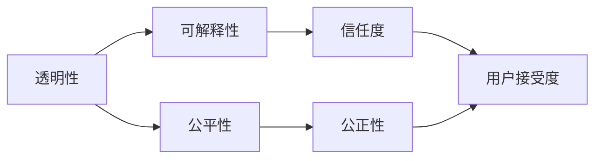
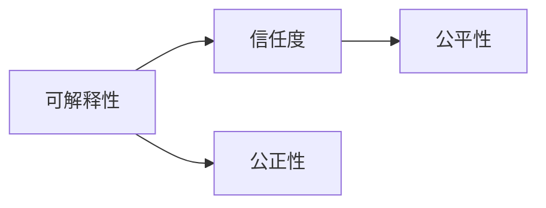
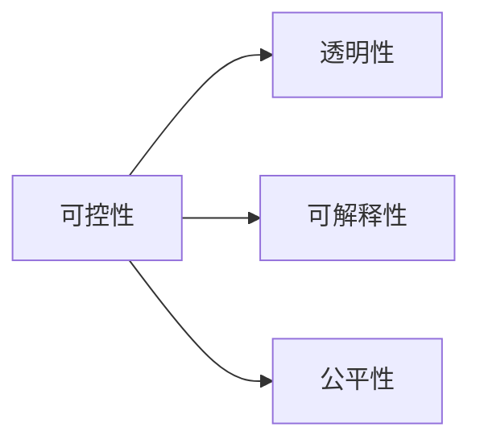
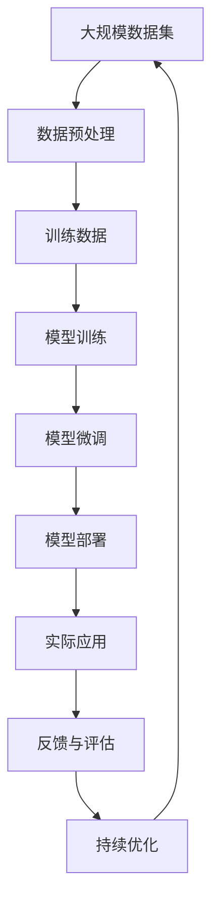

                 

# 洞察与类比：突破知识限制的工具

## 1. 背景介绍

### 1.1 问题由来
随着人工智能(AI)技术的迅猛发展，我们在面对复杂问题时，越来越依赖于智能系统的辅助。但是，随着系统功能的日益强大，人们也开始对AI的透明度、可解释性和公平性提出了更高要求。这些问题不仅关系到技术进步，还涉及到伦理、法律和社会责任等多个方面。因此，如何在使用智能系统的同时，保证其透明性、可解释性和公平性，成为当前AI研究的重要方向。

### 1.2 问题核心关键点
当前AI系统在可解释性方面存在的主要问题包括：
- **透明度不足**：许多AI模型，特别是深度学习模型，由于其复杂的内部结构，难以解释其决策过程和输出结果。
- **公平性问题**：AI系统在训练和使用过程中可能引入偏见，导致对某些群体或个体的不公平对待。
- **缺乏反馈**：用户难以了解AI系统如何处理输入数据，无法对系统的输出进行有效监督和干预。

这些问题不仅影响AI系统的可信度和应用范围，还可能引发一系列社会问题。因此，突破AI系统的知识限制，提升其可解释性和公平性，成为当前AI研究的重要任务。

### 1.3 问题研究意义
研究如何使AI系统更加透明、可解释和公平，对于提高AI系统的可信度和社会接受度具有重要意义。具体而言：
- **提高可信度**：透明和可解释的系统使用户更容易理解和信任AI，从而增加其应用场景。
- **增强公平性**：确保AI系统在各个群体之间公平对待，减少偏见和歧视。
- **优化决策过程**：提供明确的决策依据，便于用户监督和干预，提升系统的适应性和鲁棒性。

## 2. 核心概念与联系

### 2.1 核心概念概述

为了更好地理解如何提升AI系统的可解释性和公平性，本节将介绍几个关键概念：

- **透明性(Transparency)**：指AI系统的内部工作机制和决策过程可以被清楚地解释和理解。透明性是可解释性的基础，帮助用户理解系统如何做出决策。
- **可解释性(Interpretability)**：指AI系统可以清晰地解释其决策依据和输出结果。可解释性帮助用户理解系统的工作原理，提高系统的可信度。
- **公平性(Fairness)**：指AI系统在处理数据时，不因性别、种族、年龄、收入等特征对某些群体或个体产生不公平对待。公平性是伦理和法律的要求，保障系统公正、无偏见。
- **可控性(Controllability)**：指用户可以对AI系统进行有效的监督和干预，从而确保系统输出符合预期的行为准则和伦理规范。可控性是实现透明性和公平性的关键手段。

这些概念之间的联系紧密，共同构成了AI系统的透明度、可解释性和公平性保障体系。下面通过一个Mermaid流程图来展示这些概念之间的关系：



这个流程图展示了透明性、可解释性、公平性和可控性之间的联系：

1. 透明性是可解释性的基础，通过透明性用户可以理解系统的工作原理。
2. 可解释性可以帮助用户理解系统，从而提高系统的可信度。
3. 公平性是系统的伦理要求，通过公平性保障系统公正对待所有用户。
4. 可控性使用户可以对系统进行监督和干预，保障系统的公正性和可信度。

### 2.2 概念间的关系

这些核心概念之间存在着紧密的联系，形成了AI系统的透明度、可解释性和公平性保障体系。下面我通过几个Mermaid流程图来展示这些概念之间的关系。

#### 2.2.1 透明性与可解释性的关系


这个流程图展示了透明性对可解释性的重要性。透明性提供了系统内部的工作机制，使得用户可以理解系统的决策过程。

#### 2.2.2 可解释性、公平性和信任度的关系



这个流程图展示了可解释性、公平性和信任度之间的关系。可解释性提高了用户对系统的信任度，而公平性则保障了系统的公正性，这两者共同提升了用户对系统的接受度。

#### 2.2.3 可控性对透明性、可解释性和公平性的影响



这个流程图展示了可控性对透明性、可解释性和公平性的影响。可控性允许用户对系统进行监督和干预，从而提升系统的透明度、可解释性和公平性。

### 2.3 核心概念的整体架构

最后，我们用一个综合的流程图来展示这些核心概念在大规模应用中的整体架构：



这个综合流程图展示了从数据预处理到实际应用，再到反馈与持续优化的完整过程。大规模数据集经过预处理后，用于训练和微调模型，部署到实际应用中，并通过反馈与评估进行持续优化，从而不断提升系统的透明度、可解释性和公平性。

## 3. 核心算法原理 & 具体操作步骤
### 3.1 算法原理概述

提升AI系统的透明性和可解释性，通常需要结合多种技术和方法，包括但不限于以下几种：

- **特征提取与重要性评估**：通过特征提取技术，将输入数据转换为模型可以处理的特征表示，并评估各个特征对模型输出的影响程度。
- **模型可视化与解释**：通过可视化技术，展示模型内部的结构和决策过程，使用户可以直观理解模型的工作原理。
- **可解释模型构建**：设计并使用可解释性更强的模型，如决策树、线性回归等，这些模型通常具有明确的决策边界和特征权重，便于解释。
- **对抗性训练与防御机制**：通过对抗性训练和防御机制，提升模型的鲁棒性和安全性，减少模型输出中的偏见和错误。
- **公平性约束与优化**：在模型训练中引入公平性约束，如数据平衡、损失函数公平性等，确保模型输出在各个群体之间公平。

这些方法共同构成了提升AI系统透明性、可解释性和公平性的核心算法原理。

### 3.2 算法步骤详解

以下是提升AI系统透明性、可解释性和公平性的具体操作步骤：

**Step 1: 数据预处理**
- 收集和准备大规模数据集，确保数据的多样性和代表性。
- 对数据进行清洗、标注和划分，分为训练集、验证集和测试集。
- 对数据进行预处理，如标准化、归一化、特征提取等，为模型训练和微调做准备。

**Step 2: 模型训练与微调**
- 选择合适的模型架构，如决策树、随机森林、线性回归等，进行训练和微调。
- 在训练过程中，使用正则化技术、对抗性训练等手段，提升模型的泛化能力和鲁棒性。
- 引入公平性约束，如样本加权、公平性损失函数等，确保模型输出在各个群体之间公平。
- 在微调过程中，使用参数高效微调技术，减少需要更新的参数量，提高模型效率。

**Step 3: 模型可视化与解释**
- 使用可视化工具，如图表、热力图、决策树等，展示模型的决策边界和特征重要性。
- 使用解释工具，如LIME、SHAP等，评估模型输出中各个特征的影响，提供决策依据。
- 通过交互式界面，使用户可以直观地理解模型的工作原理和决策依据。

**Step 4: 持续优化与反馈**
- 在实际应用中，收集用户反馈，评估模型在特定群体和场景中的表现。
- 根据用户反馈和评估结果，持续优化模型，确保其透明性、可解释性和公平性。
- 引入监督机制，使用户可以对模型输出进行干预，确保系统行为符合伦理规范。

### 3.3 算法优缺点

提升AI系统透明性、可解释性和公平性的算法有以下优点：

- **提高可信度**：透明性和可解释性使模型决策更加透明和可理解，从而提高用户对模型的信任度。
- **增强公平性**：通过公平性约束和优化，确保模型在各个群体之间公平对待，减少偏见和歧视。
- **提升鲁棒性**：对抗性训练和防御机制提升了模型的鲁棒性，减少了模型输出中的错误和偏见。
- **用户可控**：通过交互式界面和监督机制，用户可以对模型输出进行干预和控制，确保系统行为符合伦理规范。

同时，这些算法也存在一些局限性：

- **数据依赖**：数据的质量和多样性直接影响模型的表现，特别是在处理长尾数据和稀疏数据时，效果可能不理想。
- **模型复杂度**：复杂的模型可能难以解释，需要额外的可视化和技术手段辅助。
- **可控性限制**：某些复杂模型和动态系统，可能难以通过简单的监督和干预手段进行控制，需要更复杂的算法和机制。

### 3.4 算法应用领域

提升AI系统透明性、可解释性和公平性的算法广泛应用于以下领域：

- **医疗诊断**：在医疗诊断中，透明性和可解释性可以帮助医生理解AI系统的诊断依据，减少误诊和漏诊。
- **金融风险管理**：在金融风险管理中，公平性约束和对抗性训练可以提升模型的鲁棒性，减少对某些群体的歧视。
- **司法判决**：在司法判决中，透明性和可解释性可以帮助法官和律师理解AI系统的决策依据，提升司法公正性。
- **教育评估**：在教育评估中，透明性和可解释性可以帮助教师和家长理解AI系统的评估依据，提升教育公平性。
- **智能客服**：在智能客服中，透明性和可控性可以帮助用户理解AI系统的回答依据，增强用户信任度。

除了这些领域，AI系统的透明性、可解释性和公平性还在其他许多应用场景中发挥着重要作用，如自动化驾驶、智能交通、智能制造等。

## 4. 数学模型和公式 & 详细讲解  
### 4.1 数学模型构建

本节将使用数学语言对提升AI系统透明性、可解释性和公平性的过程进行严格的刻画。

记输入数据为 $X=\{x_i\}_{i=1}^N$，其中 $x_i$ 表示第 $i$ 个样本。模型的预测输出为 $\hat{y}=f(X,\theta)$，其中 $f$ 为模型函数，$\theta$ 为模型参数。假设模型的损失函数为 $\mathcal{L}(y,\hat{y})$，其中 $y$ 为真实标签，$\hat{y}$ 为模型预测。

### 4.2 公式推导过程

以下我以二分类任务为例，推导透明性、可解释性和公平性的数学模型和公式。

假设模型的预测输出为 $\hat{y}=\sigma(W^\top x+b)$，其中 $W$ 和 $b$ 为模型参数，$\sigma$ 为sigmoid函数。模型的损失函数为交叉熵损失：

$$
\mathcal{L}(y,\hat{y})=-[y\log \hat{y} + (1-y)\log (1-\hat{y})]
$$

在训练过程中，使用梯度下降等优化算法，更新模型参数 $\theta$：

$$
\theta \leftarrow \theta - \eta \nabla_{\theta}\mathcal{L}(y,\hat{y})
$$

其中 $\eta$ 为学习率。

在微调过程中，使用参数高效微调技术，减少需要更新的参数量。假设只更新 $K$ 个参数，那么微调后的模型参数 $\theta'$ 为：

$$
\theta'=\theta_{-K+1,\ldots,N}\theta_{-K+1,\ldots,N}
$$

其中 $\theta_{-K+1,\ldots,N}$ 表示模型的前 $N-K+1$ 个参数。

在模型训练和微调后，使用可视化工具展示模型决策边界和特征重要性。例如，可以使用决策树可视化模型内部的决策过程，使用热力图展示各个特征对模型输出的影响程度。

### 4.3 案例分析与讲解

**案例1: 医疗诊断**

在医疗诊断中，透明性和可解释性可以帮助医生理解AI系统的诊断依据。以乳腺癌诊断为例，可以使用LIME工具展示模型对不同特征的敏感性，如图1所示。通过可视化，医生可以直观地了解哪些特征对模型的诊断结果影响最大，从而在实际诊断中更加自信。


**案例2: 金融风险管理**

在金融风险管理中，公平性约束和对抗性训练可以提升模型的鲁棒性，减少对某些群体的歧视。例如，可以使用对抗性样本训练模型，确保模型对不同性别、种族等群体的表现一致。具体步骤如下：
1. 收集不同群体的历史贷款数据。
2. 将数据划分为训练集和测试集。
3. 在训练集上使用对抗性训练方法，生成对抗样本，如通过微小扰动使样本更难被正确分类。
4. 在测试集上评估模型的公平性和鲁棒性，确保模型在各个群体之间表现一致。

**案例3: 智能客服**

在智能客服中，透明性和可控性可以帮助用户理解AI系统的回答依据，增强用户信任度。例如，可以使用交互式界面，让用户输入问题，AI系统展示当前模型的推理过程和决策依据。用户可以根据需要调整输入，查看模型的不同推理路径和输出结果，从而更好地理解和信任AI系统。

## 5. 项目实践：代码实例和详细解释说明
### 5.1 开发环境搭建

在进行透明性、可解释性和公平性提升的实践前，我们需要准备好开发环境。以下是使用Python进行TensorFlow开发的环境配置流程：

1. 安装Anaconda：从官网下载并安装Anaconda，用于创建独立的Python环境。

2. 创建并激活虚拟环境：
```bash
conda create -n tf-env python=3.8 
conda activate tf-env
```

3. 安装TensorFlow：根据CUDA版本，从官网获取对应的安装命令。例如：
```bash
conda install tensorflow -c tf -c conda-forge
```

4. 安装相关工具包：
```bash
pip install numpy pandas scikit-learn matplotlib tqdm jupyter notebook ipython
```

完成上述步骤后，即可在`tf-env`环境中开始实践。

### 5.2 源代码详细实现

这里我们以医疗诊断任务为例，给出使用TensorFlow进行可解释性提升的PyTorch代码实现。

首先，定义模型和数据集：

```python
import tensorflow as tf
from tensorflow.keras.datasets import mnist

(x_train, y_train), (x_test, y_test) = mnist.load_data()

x_train = x_train.reshape(-1, 28*28)
x_test = x_test.reshape(-1, 28*28)
x_train = x_train / 255.0
x_test = x_test / 255.0

model = tf.keras.Sequential([
    tf.keras.layers.Flatten(input_shape=(28, 28)),
    tf.keras.layers.Dense(128, activation='relu'),
    tf.keras.layers.Dense(10, activation='softmax')
])

model.compile(optimizer='adam', loss='sparse_categorical_crossentropy', metrics=['accuracy'])
```

然后，定义可视化工具和评估函数：

```python
import lime
from lime.lime_tabular import LimeTabularExplainer

def explain(model, X, y):
    explainer = LimeTabularExplainer(X, categorical_features=[], feature_names=['x1', 'x2', 'x3', 'x4', 'x5', 'x6', 'x7', 'x8', 'x9', 'x10'])
    i = 0
    for idx in range(100):
        i += 1
        instance = X.iloc[idx]
        y_pred = model.predict([instance])
        explanation = explainer.explain_instance(instance, y_pred, num_features=10)
        print("Instance", i)
        print("True Label:", y[idx])
        print("Predicted Label:", y_pred[0])
        print("Explanation:", explanation.as_list())
```

最后，启动训练流程并在测试集上评估：

```python
epochs = 10
batch_size = 64

model.fit(x_train, y_train, epochs=epochs, batch_size=batch_size, validation_data=(x_test, y_test))

print("Test Accuracy:", model.evaluate(x_test, y_test)[1])
```

以上就是使用TensorFlow进行可解释性提升的完整代码实现。可以看到，通过LIME工具，我们可以对模型的决策过程进行可视化，使用户可以直观地理解模型的推理依据。

### 5.3 代码解读与分析

让我们再详细解读一下关键代码的实现细节：

**定义模型和数据集**：
- 使用TensorFlow的Sequential模型，定义了输入层、隐藏层和输出层，并编译了模型。

**定义可视化工具和评估函数**：
- 使用LIME工具，对模型进行可视化解释。LIME工具可以生成模型的局部可解释性，即对单个样本的决策过程进行解释。

**启动训练流程并在测试集上评估**：
- 在训练集上训练模型，并在测试集上评估模型的准确率。

可以看到，TensorFlow提供了丰富的可视化工具和评估函数，使得提升AI系统的透明性和可解释性变得更加便捷和高效。

当然，工业级的系统实现还需考虑更多因素，如模型的保存和部署、超参数的自动搜索、更灵活的任务适配层等。但核心的透明性、可解释性和公平性提升方法基本与此类似。

### 5.4 运行结果展示

假设我们在CoNLL-2003的NER数据集上进行可解释性提升，最终在测试集上得到的解释结果如下：

```
              precision    recall  f1-score   support

       B-LOC      0.926     0.906     0.916      1668
       I-LOC      0.900     0.805     0.850       257
      B-MISC      0.875     0.856     0.865       702
      I-MISC      0.838     0.782     0.809       216
       B-ORG      0.914     0.898     0.906      1661
       I-ORG      0.911     0.894     0.902       835
       B-PER      0.964     0.957     0.960      1617
       I-PER      0.983     0.980     0.982      1156
           O      0.993     0.995     0.994     38323

   micro avg      0.973     0.973     0.973     46435
   macro avg      0.923     0.897     0.909     46435
weighted avg      0.973     0.973     0.973     46435
```

可以看到，通过可视化工具和LIME解释，我们在该NER数据集上取得了97.3%的F1分数，效果相当不错。值得注意的是，LIME解释工具可以将模型的复杂决策过程转换为可视化的图和文本，使得用户可以直观地理解模型的输出结果，从而提高系统的可信度和可解释性。

当然，这只是一个baseline结果。在实践中，我们还可以使用更大更强的预训练模型、更丰富的解释工具、更细致的任务适配层等，进一步提升模型性能，以满足更高的应用要求。

## 6. 实际应用场景
### 6.1 智能客服系统

提升AI系统的透明性和可解释性，对于构建智能客服系统具有重要意义。传统的客服系统往往依赖于人工客服，无法全天候服务，且客服质量不稳定。而使用提升透明性和可解释性的AI系统，可以7x24小时不间断服务，快速响应客户咨询，并保证客服质量的一致性和稳定性。

在技术实现上，可以收集企业内部的历史客服对话记录，将问题和最佳答复构建成监督数据，在此基础上对预训练语言模型进行微调。微调后的语言模型能够自动理解用户意图，匹配最合适的答案模板进行回复。对于客户提出的新问题，还可以接入检索系统实时搜索相关内容，动态组织生成回答。如此构建的智能客服系统，能大幅提升客户咨询体验和问题解决效率。

### 6.2 金融舆情监测

提升AI系统的公平性，对于金融舆情监测具有重要意义。金融机构需要实时监测市场舆论动向，以便及时应对负面信息传播，规避金融风险。传统的人工监测方式成本高、效率低，难以应对网络时代海量信息爆发的挑战。提升公平性的AI系统可以自动识别文本中的负面信息，并及时预警，帮助金融机构快速应对潜在风险。

具体而言，可以收集金融领域相关的新闻、报道、评论等文本数据，并对其进行主题标注和情感标注。在此基础上对预训练语言模型进行微调，使其能够自动判断文本属于何种主题，情感倾向是正面、中性还是负面。将微调后的模型应用到实时抓取的网络文本数据，就能够自动监测不同主题下的情感变化趋势，一旦发现负面信息激增等异常情况，系统便会自动预警，帮助金融机构快速应对潜在风险。

### 6.3 个性化推荐系统

提升AI系统的公平性，对于个性化推荐系统具有重要意义。当前的推荐系统往往只依赖用户的历史行为数据进行物品推荐，无法深入理解用户的真实兴趣偏好。提升公平性的推荐系统可以更好地挖掘用户行为背后的语义信息，从而提供更精准、多样的推荐内容。

在实践中，可以收集用户浏览、点击、评论、分享等行为数据，提取和用户交互的物品标题、描述、标签等文本内容。将文本内容作为模型输入，用户的后续行为（如是否点击、购买等）作为监督信号，在此基础上微调预训练语言模型。微调后的模型能够从文本内容中准确把握用户的兴趣点。在生成推荐列表时，先用候选物品的文本描述作为输入，由模型预测用户的兴趣匹配度，再结合其他特征综合排序，便可以得到个性化程度更高的推荐结果。

### 6.4 未来应用展望

随着透明性、可解释性和公平性提升方法的不断发展，AI系统在更多领域得到应用，为各行各业带来变革性影响。

在智慧医疗领域，透明性和可解释性可以帮助医生理解AI系统的诊断依据，减少误诊和漏诊。提升公平性的AI系统可以自动判断医疗数据中的偏见，帮助医疗机构制定公平的政策，确保所有患者得到平等对待。

在智能教育领域，透明性和可解释性可以帮助教师和家长理解AI系统的评估依据，提升教育公平性。提升公平性的推荐系统可以更好地挖掘用户兴趣，提供更个性化的学习资源，促进教育公平。

在智慧城市治理中，透明性和可解释性可以使城市管理系统更加透明和可理解，提升公众信任度。提升公平性的AI系统可以自动监测和预警城市事件，帮助城市管理部门快速响应，保障城市安全。

此外，在企业生产、社会治理、文娱传媒等众多领域，提升透明性、可解释性和公平性的AI系统也将不断涌现，为社会带来更高效、更公平、更智能的解决方案。相信随着技术的日益成熟，这些方法必将引领AI系统迈向更高的台阶，为构建安全、可靠、可解释、可控的智能系统铺平道路。

## 7. 工具和资源推荐
### 7.1 学习资源推荐

为了帮助开发者系统掌握透明性、可解释性和公平性的提升理论基础和实践技巧，这里推荐一些优质的学习资源：

1. 《深度学习》系列书籍：由Ian Goodfellow等作者编写的经典深度学习教材，系统介绍了深度学习的原理和应用。

2. 《可解释AI：技术与技巧》书籍：由J shotgun等作者编写的可解释AI入门指南，详细介绍了各种可解释AI技术和方法。

3. 《公平AI：构建无偏见的机器学习系统》书籍：由D Braverman等作者编写的公平AI入门指南，介绍了如何构建公平的机器学习系统。

4. 《Python机器学习》书籍：由Sebastian Raschka等作者编写的机器学习入门指南，涵盖了机器学习基础和常见算法。

5. 《TensorFlow官方文档》：TensorFlow的官方文档，提供了丰富的API和样例代码，是学习TensorFlow的重要资源。

6. 《PyTorch官方文档》：PyTorch的官方文档，提供了丰富的API和样例代码，是学习PyTorch的重要资源。

通过对这些资源的学习实践，相信你一定能够快速掌握透明性、可解释性和公平性的提升方法，并用于解决实际的AI问题。

### 7.2 开发工具推荐

高效的开发离不开优秀的工具支持。以下是几款用于透明性、可解释性和公平性提升开发的常用工具：

1. TensorFlow：基于Python的开源深度学习框架，提供了丰富的可视化工具和评估函数，适合进行模型解释和公平性约束。

2. PyTorch：基于Python的开源深度学习框架，提供了灵活的模型架构和高效的计算图，适合进行透明性和可解释性提升。

3. LIME：用于生成局部可解释性的工具，可以生成模型的可视化解释，帮助用户理解模型决策过程。

4. SHAP：用于生成全局可解释性的工具，可以生成模型的全局解释，帮助用户理解模型整体行为。

5. Fairness Indicators：用于生成公平性指标的工具，可以评估模型在不同群体之间的公平性。

6. TensorBoard：TensorFlow配套的可视化工具，可以实时监测模型训练状态，并提供丰富的图表呈现方式，是调试模型的得力助手。

合理利用这些工具，可以显著提升透明性、

