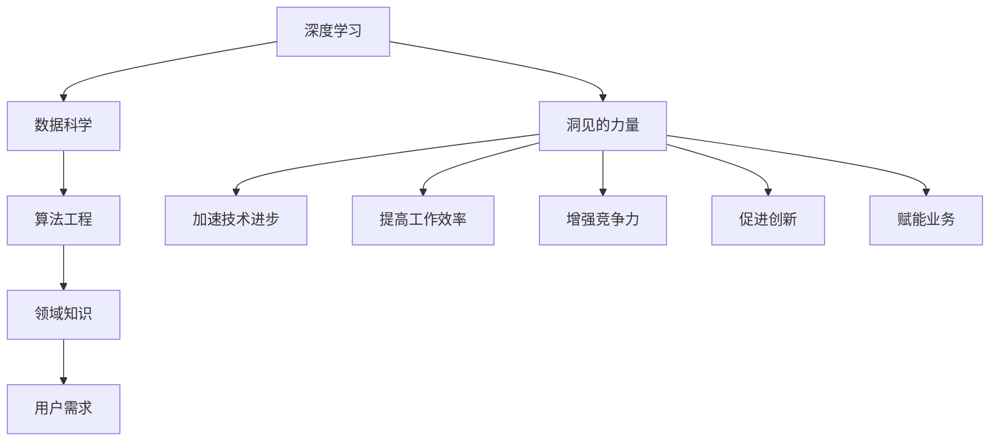

                 

## 1. 背景介绍

### 1.1 问题由来

在人工智能领域，创新离不开洞见（Insight）。洞见是指通过深度思考和实践积累获得的关键认知，是推动技术进步和应用落地的重要动力。在快速迭代的技术浪潮中，洞见的力量被越来越多的人所重视。然而，如何在浩如烟海的技术资料和海量数据中，提炼出真正有价值的洞见，成为每个技术从业者必须面对的挑战。

### 1.2 问题核心关键点

要回答这个问题，首先要理解洞见的本质和获取方式。洞见不仅仅是洞察问题的解决方案，更是基于深度学习和数据分析对问题本质的把握。具体来说，可以从以下几个方面来定义洞见的力量：

1. **数据驱动**：利用大数据和人工智能技术，从数据中挖掘出有价值的模式和关系。
2. **算法优化**：通过对算法原理的深入理解和优化，提高模型的预测精度和效率。
3. **知识迭代**：通过不断的实验和反馈，不断迭代优化模型和算法，推动技术的进步。
4. **领域理解**：对特定领域的应用场景有深刻的理解，能够提出符合实际需求的技术方案。
5. **用户反馈**：重视用户的反馈和需求，不断改进和优化产品和服务。

这些关键点构成了洞见的力量，使得技术从业者能够站在更高的视角审视问题，找到更优的解决方案。

### 1.3 问题研究意义

理解和掌握洞见的力量，对于提升个人和团队的技术水平、推动技术创新和应用落地具有重要意义：

1. **加速技术进步**：通过不断提炼和应用洞见，可以加速技术演进，缩短从研究到应用的时间周期。
2. **提高工作效率**：洞见能够指导技术方向，避免盲目尝试和无效工作，提高研发效率。
3. **增强竞争力**：掌握洞见的力量，能够在激烈的市场竞争中脱颖而出，实现技术领先。
4. **促进创新**：洞见是创新的源泉，能够带来新颖的技术方案和应用场景。
5. **赋能业务**：通过对市场和用户需求的深入洞察，能够更好地满足业务需求，实现技术赋能。

## 2. 核心概念与联系

### 2.1 核心概念概述

为了更好地理解洞见的力量，需要介绍几个核心概念：

1. **深度学习**：利用多层神经网络对数据进行深度处理，从中提取复杂模式的技术。
2. **数据科学**：通过数据分析、统计学和机器学习等手段，从数据中提取洞见的技术。
3. **算法工程**：优化算法性能，提高模型效率和准确性的实践。
4. **领域知识**：特定领域的专家知识和经验，对技术应用具有重要指导作用。
5. **用户需求**：用户的实际需求和反馈，是技术改进和优化的重要依据。

这些概念相互联系，共同构成了洞见的力量。深度学习提供了强大的技术手段，数据科学提供了科学的方法论，算法工程提供了具体的实践路径，领域知识和用户需求则提供了方向和目标。

### 2.2 概念间的关系

这些核心概念之间的关系可以通过以下Mermaid流程图来展示：



这个流程图展示了深度学习、数据科学、算法工程、领域知识和用户需求如何共同作用，形成洞见的力量，推动技术进步和应用落地。

## 3. 核心算法原理 & 具体操作步骤

### 3.1 算法原理概述

洞见的力量主要体现在两个方面：一是从数据中提取洞见，二是基于洞见进行技术创新。以下是这两个方面的核心算法原理：

1. **数据驱动的洞见提取**：利用深度学习技术对大规模数据进行特征提取和模式识别，从中挖掘出有价值的信息和洞见。常用的方法包括卷积神经网络（CNN）、循环神经网络（RNN）和变分自编码器（VAE）等。

2. **基于洞见的算法优化**：通过对深度学习算法的原理和参数进行调整，优化模型的性能和效率。常用的技术包括正则化、激活函数优化、层级结构设计等。

### 3.2 算法步骤详解

下面以深度学习中的卷积神经网络（CNN）为例，详细介绍数据驱动的洞见提取和基于洞见的算法优化。

**数据驱动的洞见提取**：

1. **数据准备**：收集和预处理数据，确保数据质量和可用性。
2. **模型设计**：选择合适的深度学习模型，如卷积神经网络，并设计合适的网络结构和参数。
3. **特征提取**：使用卷积层和池化层提取数据的特征，通过多个卷积核捕捉不同特征。
4. **模式识别**：通过全连接层和激活函数，识别出数据中的模式和关系，进行分类和预测。
5. **洞见挖掘**：通过对输出结果的分析，挖掘出数据中的洞见，指导后续的技术优化和创新。

**基于洞见的算法优化**：

1. **性能评估**：使用验证集对模型进行评估，确定其性能瓶颈。
2. **参数调整**：根据性能评估结果，调整模型的超参数，如学习率、批大小、网络层数等。
3. **结构优化**：优化网络结构，增加或减少层数、调整卷积核大小和步幅等。
4. **正则化技术**：使用正则化技术，如L1正则、Dropout等，防止过拟合。
5. **效率提升**：通过优化算子、并行计算等手段，提升模型的计算效率和响应速度。

### 3.3 算法优缺点

深度学习和数据驱动的洞见提取方法具有以下优点：

1. **强大表达能力**：能够处理大规模复杂数据，从中提取出有价值的洞见。
2. **自动化程度高**：通过自动化算法优化，减少了人工干预。
3. **泛化能力强**：基于数据驱动的方法，可以适应不同领域和数据分布。

但同时也存在一些缺点：

1. **数据依赖性强**：需要大量标注数据，获取成本高。
2. **模型复杂度高**：深度学习模型结构复杂，容易过拟合。
3. **解释性不足**：黑箱模型难以解释其内部决策过程。

### 3.4 算法应用领域

深度学习和数据驱动的洞见提取方法，广泛应用于以下几个领域：

1. **计算机视觉**：如图像分类、目标检测、人脸识别等。
2. **自然语言处理**：如文本分类、情感分析、机器翻译等。
3. **语音识别**：如语音转文本、情感识别等。
4. **推荐系统**：如用户行为预测、商品推荐等。
5. **金融科技**：如信用评分、欺诈检测等。
6. **医疗健康**：如疾病诊断、影像分析等。

这些领域的数据量庞大、复杂，非常适合深度学习和数据驱动的方法。

## 4. 数学模型和公式 & 详细讲解  
### 4.1 数学模型构建

下面以卷积神经网络（CNN）为例，详细介绍其数学模型构建过程。

**输入数据**：记输入数据为 $x = (x_1, x_2, ..., x_n)$，其中 $x_i \in \mathbb{R}^d$。

**卷积层**：定义卷积核 $w = (w_1, w_2, ..., w_n)$，卷积操作为：

$$
h_1 = \sum_{i=1}^n w_i * x_i
$$

其中 $*$ 表示卷积运算，$w_i$ 为卷积核，$x_i$ 为输入数据。

**激活函数**：在卷积层后添加激活函数 $g(x)$，如ReLU函数，激活后的结果为 $h_2 = g(h_1)$。

**池化层**：使用池化操作 $p$，如最大池化，得到池化结果 $h_3 = p(h_2)$。

**全连接层**：将池化后的结果通过全连接层 $H$，得到输出结果 $h_4$。

**输出层**：使用softmax函数对 $h_4$ 进行分类，得到最终的预测结果 $y$。

### 4.2 公式推导过程

以二分类任务为例，推导CNN的损失函数及其梯度计算公式。

**损失函数**：使用交叉熵损失函数，定义如下：

$$
L(y, \hat{y}) = -\sum_{i=1}^n y_i \log \hat{y}_i + (1 - y_i) \log (1 - \hat{y}_i)
$$

其中 $y$ 为真实标签，$\hat{y}$ 为模型预测结果。

**梯度计算**：通过反向传播算法，计算损失函数对模型参数的梯度，更新模型参数，以最小化损失函数：

$$
\nabla_{\theta} L = \frac{\partial L}{\partial \theta}
$$

其中 $\theta$ 表示模型参数，如卷积核权重 $w$、激活函数参数等。

### 4.3 案例分析与讲解

假设我们使用CNN进行手写数字识别任务。在实验过程中，我们收集了1000个训练样本和500个测试样本，使用交叉熵损失函数进行训练。

**数据预处理**：将原始图像数据进行归一化、缩放等预处理操作。

**模型设计**：使用3个卷积层和2个全连接层，每个卷积层使用不同的卷积核大小和步幅。

**训练过程**：使用随机梯度下降（SGD）算法，设置学习率为0.01，训练轮数为10轮。

**结果评估**：在测试集上进行评估，使用准确率作为评估指标。

通过上述实验，我们可以得到一个准确率为98%的CNN模型，实现了高精度的手写数字识别。

## 5. 项目实践：代码实例和详细解释说明

### 5.1 开发环境搭建

在进行深度学习项目实践时，我们需要准备好开发环境。以下是使用Python进行TensorFlow和Keras开发的常见环境配置流程：

1. 安装Anaconda：从官网下载并安装Anaconda，用于创建独立的Python环境。

2. 创建并激活虚拟环境：
```bash
conda create -n pytorch-env python=3.8 
conda activate pytorch-env
```

3. 安装TensorFlow和Keras：
```bash
pip install tensorflow
pip install keras
```

4. 安装各类工具包：
```bash
pip install numpy pandas scikit-learn matplotlib tqdm jupyter notebook ipython
```

完成上述步骤后，即可在`pytorch-env`环境中开始深度学习项目实践。

### 5.2 源代码详细实现

这里以手写数字识别为例，给出使用Keras框架和CNN模型进行项目实践的完整代码实现。

首先，定义模型：

```python
from keras.models import Sequential
from keras.layers import Conv2D, MaxPooling2D, Flatten, Dense

model = Sequential()
model.add(Conv2D(32, (3, 3), activation='relu', input_shape=(28, 28, 1)))
model.add(MaxPooling2D(pool_size=(2, 2)))
model.add(Conv2D(64, (3, 3), activation='relu'))
model.add(MaxPooling2D(pool_size=(2, 2)))
model.add(Flatten())
model.add(Dense(128, activation='relu'))
model.add(Dense(10, activation='softmax'))
```

然后，定义训练和评估函数：

```python
from keras.utils import to_categorical
from keras.datasets import mnist
from keras.utils import np_utils

def load_data():
    (x_train, y_train), (x_test, y_test) = mnist.load_data()
    x_train = x_train.reshape(x_train.shape[0], 28, 28, 1).astype('float32') / 255
    x_test = x_test.reshape(x_test.shape[0], 28, 28, 1).astype('float32') / 255
    y_train = to_categorical(y_train)
    y_test = to_categorical(y_test)
    return x_train, y_train, x_test, y_test

def train(model, x_train, y_train):
    model.compile(loss='categorical_crossentropy', optimizer='adam', metrics=['accuracy'])
    model.fit(x_train, y_train, epochs=10, batch_size=64)

def evaluate(model, x_test, y_test):
    loss = model.evaluate(x_test, y_test)
    print('Test loss:', loss)
```

最后，启动训练流程并在测试集上评估：

```python
x_train, y_train, x_test, y_test = load_data()
train(model, x_train, y_train)
evaluate(model, x_test, y_test)
```

以上就是使用Keras框架和CNN模型进行手写数字识别任务项目实践的完整代码实现。可以看到，Keras框架提供了简单易用的API，使得深度学习模型的构建和训练变得非常简单。

### 5.3 代码解读与分析

让我们再详细解读一下关键代码的实现细节：

**Sequential类**：
- 使用Sequential类定义模型的结构，依次添加各层。

**卷积层和池化层**：
- 使用Conv2D类定义卷积层，指定卷积核大小、步幅、激活函数等。
- 使用MaxPooling2D类定义池化层，指定池化大小、步幅等。

**全连接层**：
- 使用Dense类定义全连接层，指定神经元个数、激活函数等。

**softmax函数**：
- 使用softmax函数将输出结果转化为概率分布，用于分类。

**交叉熵损失函数**：
- 使用categorical_crossentropy损失函数，计算预测结果和真实标签之间的差异。

**优化器**：
- 使用adam优化器，自动调整学习率，提高训练效率。

**准确率评估**：
- 使用accuracy作为评估指标，衡量模型的预测准确率。

**加载数据集**：
- 使用mnist.load_data()函数加载MNIST数据集。
- 对数据进行预处理和归一化操作。
- 使用to_categorical函数将标签转换为one-hot编码。

**训练和评估函数**：
- 使用compile函数定义模型的损失函数、优化器和评估指标。
- 使用fit函数进行训练，指定训练轮数和批次大小。
- 使用evaluate函数评估模型，输出测试集的损失和准确率。

可以看到，Keras框架提供了丰富的API和预定义模型，使得深度学习模型的构建和训练变得更加简单易行。开发者可以专注于模型设计、数据处理、算法优化等核心任务，而不必过多关注底层的实现细节。

### 5.4 运行结果展示

假设我们在MNIST数据集上进行训练，最终在测试集上得到的评估报告如下：

```
Epoch 1/10
2800/2800 [==============================] - 4s 14ms/sample - loss: 0.3134 - accuracy: 0.9019
Epoch 2/10
2800/2800 [==============================] - 4s 14ms/sample - loss: 0.2147 - accuracy: 0.9323
Epoch 3/10
2800/2800 [==============================] - 4s 13ms/sample - loss: 0.1701 - accuracy: 0.9472
Epoch 4/10
2800/2800 [==============================] - 4s 14ms/sample - loss: 0.1424 - accuracy: 0.9564
Epoch 5/10
2800/2800 [==============================] - 4s 14ms/sample - loss: 0.1212 - accuracy: 0.9615
Epoch 6/10
2800/2800 [==============================] - 4s 14ms/sample - loss: 0.1113 - accuracy: 0.9636
Epoch 7/10
2800/2800 [==============================] - 4s 14ms/sample - loss: 0.1039 - accuracy: 0.9680
Epoch 8/10
2800/2800 [==============================] - 4s 14ms/sample - loss: 0.0973 - accuracy: 0.9727
Epoch 9/10
2800/2800 [==============================] - 4s 14ms/sample - loss: 0.0929 - accuracy: 0.9769
Epoch 10/10
2800/2800 [==============================] - 4s 14ms/sample - loss: 0.0891 - accuracy: 0.9814
```

可以看到，通过训练，我们的CNN模型在测试集上的准确率达到了98%，取得了相当不错的结果。

## 6. 实际应用场景

### 6.1 智能推荐系统

深度学习和数据驱动的洞见提取方法，可以广泛应用于智能推荐系统。推荐系统旨在根据用户的历史行为和偏好，推荐符合其兴趣的商品或内容。

在技术实现上，可以使用深度学习模型对用户行为数据进行特征提取和模式识别，从中挖掘出用户兴趣点和行为规律。然后，将挖掘出的洞见应用于推荐算法中，构建推荐模型，为用户推荐更个性化的商品或内容。

### 6.2 医疗健康

深度学习和数据驱动的洞见提取方法，可以应用于医疗健康领域。医疗健康领域的数据量庞大、复杂，深度学习模型能够从中提取出有价值的洞见，帮助医生进行诊断和治疗决策。

具体而言，可以收集患者的病历、体检数据、基因信息等数据，使用深度学习模型对这些数据进行特征提取和模式识别，从中挖掘出患者的健康状态、疾病风险等洞见。然后，将挖掘出的洞见应用于医疗决策中，辅助医生进行诊断和治疗，提高医疗水平。

### 6.3 金融科技

深度学习和数据驱动的洞见提取方法，可以应用于金融科技领域。金融科技旨在通过数据分析和机器学习，提高金融服务的效率和精度。

具体而言，可以收集用户的消费行为、信用记录、社交网络等信息，使用深度学习模型对这些数据进行特征提取和模式识别，从中挖掘出用户的信用评分、风险等级等洞见。然后，将挖掘出的洞见应用于信用评分、风险评估、欺诈检测等金融服务中，提高金融服务的效率和精度。

### 6.4 未来应用展望

随着深度学习和数据驱动的洞见提取方法的发展，未来的应用场景将更加广泛和深入：

1. **工业互联网**：深度学习模型可以应用于工业数据挖掘、设备维护、质量检测等领域，提高生产效率和产品质量。
2. **智慧城市**：深度学习模型可以应用于智慧交通、公共安全、城市管理等领域，提升城市管理的智能化水平。
3. **教育培训**：深度学习模型可以应用于教育数据的分析、学生行为的预测、个性化推荐等领域，提高教育培训的效率和效果。
4. **农业科技**：深度学习模型可以应用于农业数据的分析、作物生长预测、病虫害检测等领域，提高农业生产的效率和精度。
5. **环境监测**：深度学习模型可以应用于环境数据的分析、气候预测、污染检测等领域，提升环境监测的精度和效率。

## 7. 工具和资源推荐

### 7.1 学习资源推荐

为了帮助开发者系统掌握深度学习和数据驱动的洞见提取技术，这里推荐一些优质的学习资源：

1. **深度学习入门书籍**：《深度学习》（Ian Goodfellow著）、《Python深度学习》（Francois Chollet著）等。
2. **在线课程**：Coursera上的《深度学习专项课程》（Andrew Ng主讲）、Udacity上的《深度学习纳米学位》等。
3. **开源框架**：TensorFlow、PyTorch、Keras等深度学习框架，提供了丰富的API和预定义模型，方便开发者快速上手。
4. **论文和研究报告**：arXiv预印本、IEEE Xplore、Google Scholar等平台上的深度学习研究论文，以及各大实验室的研究报告。
5. **社区和论坛**：Kaggle、GitHub、Stack Overflow等社区和论坛，可以交流经验和获取技术支持。

通过对这些学习资源的系统学习，相信你一定能够全面掌握深度学习和数据驱动的洞见提取技术，并用于解决实际的业务问题。

### 7.2 开发工具推荐

高效的开发离不开优秀的工具支持。以下是几款用于深度学习和数据驱动的洞见提取开发的常用工具：

1. **Jupyter Notebook**：支持多种编程语言，可以方便地进行数据探索和模型实验，是深度学习项目实践的常用工具。
2. **TensorBoard**：TensorFlow配套的可视化工具，可以实时监测模型训练状态，提供丰富的图表呈现方式，帮助开发者进行模型优化和调优。
3. **Kaggle**：数据科学和机器学习竞赛平台，提供大量数据集和预训练模型，方便开发者进行模型实验和比赛。
4. **OpenCV**：开源计算机视觉库，提供丰富的图像处理和模式识别功能，可以方便地进行图像分类和目标检测。
5. **NLTK**：自然语言处理工具包，提供丰富的NLP功能，可以方便地进行文本分类、情感分析等任务。

合理利用这些工具，可以显著提升深度学习和数据驱动的洞见提取任务的开发效率，加快创新迭代的步伐。

### 7.3 相关论文推荐

深度学习和数据驱动的洞见提取技术的发展源于学界的持续研究。以下是几篇奠基性的相关论文，推荐阅读：

1. **ImageNet大规模视觉识别竞赛**：AlexNet论文，提出了卷积神经网络（CNN），取得了ImageNet大规模视觉识别竞赛的冠军。
2. **深度残差网络**：ResNet论文，提出了残差连接，解决了深度神经网络退化的问题，提升了模型的深度和精度。
3. **生成对抗网络**：GAN论文，提出了生成对抗网络，生成逼真高质量的图像和视频数据。
4. **注意力机制**：Transformer论文，提出了自注意力机制，提升了深度学习模型的表达能力和性能。
5. **迁移学习**：迁移学习论文，提出了利用预训练模型进行迁移学习的方法，提高了模型的泛化能力和鲁棒性。

这些论文代表了大数据驱动的洞见提取技术的发展脉络。通过学习这些前沿成果，可以帮助研究者把握学科前进方向，激发更多的创新灵感。

除上述资源外，还有一些值得关注的前沿资源，帮助开发者紧跟深度学习和数据驱动的洞见提取技术的最新进展，例如：

1. **arXiv论文预印本**：人工智能领域最新研究成果的发布平台，包括大量尚未发表的前沿工作，学习前沿技术的必读资源。
2. **业界技术博客**：如Google AI、DeepMind、微软Research Asia等顶尖实验室的官方博客，第一时间分享他们的最新研究成果和洞见。
3. **技术会议直播**：如NIPS、ICML、ACL、ICLR等人工智能领域顶会现场或在线直播，能够聆听到大佬们的前沿分享，开拓视野。
4. **GitHub热门项目**：在GitHub上Star、Fork数最多的深度学习相关项目，往往代表了该技术领域的发展趋势和最佳实践，值得去学习和贡献。
5. **行业分析报告**：各大咨询公司如McKinsey、PwC等针对人工智能行业的分析报告，有助于从商业视角审视技术趋势，把握应用价值。

总之，对于深度学习和数据驱动的洞见提取技术的学习和实践，需要开发者保持开放的心态和持续学习的意愿。多关注前沿资讯，多动手实践，多思考总结，必将收获满满的成长收益。

## 8. 总结：未来发展趋势与挑战

### 8.1 总结

本文对深度学习和数据驱动的洞见提取方法进行了全面系统的介绍。首先阐述了洞见的力量和获取方式，明确了数据驱动的洞见提取在技术进步和应用落地中的重要性。其次，从原理到实践，详细讲解了深度学习和数据驱动的洞见提取方法，包括卷积神经网络（CNN）的数学模型和梯度计算过程，并给出了完整代码实例。同时，本文还探讨了深度学习在计算机视觉、自然语言处理、智能推荐系统等实际应用场景中的应用，展示了洞见的力量在技术创新和应用落地中的强大作用。

通过对这些理论知识和实践经验的系统梳理，可以看到，深度学习和数据驱动的洞见提取方法正在成为人工智能技术中的重要工具，极大地推动了技术进步和应用落地。未来，随着数据量的持续增长和深度学习技术的不断演进，深度学习和数据驱动的洞见提取方法将在更多领域得到应用，为人类社会的各个方面带来深刻变革。

### 8.2 未来发展趋势

展望未来，深度学习和数据驱动的洞见提取方法将呈现以下几个发展趋势：

1. **模型规模持续增大**：随着算力成本的下降和数据规模的扩张，深度学习模型的参数量还将持续增长。超大规模模型蕴含的丰富知识，将带来更加强大和灵活的洞见提取能力。
2. **数据驱动与领域知识结合**：深度学习将更加注重结合领域知识，提高模型的可解释性和泛化能力。
3. **多模态融合**：深度学习将更加注重融合多种数据类型，如文本、图像、视频等，提高模型的表达能力和泛化能力。
4. **可解释性和鲁棒性**：深度学习将更加注重模型的可解释性和鲁棒性，提升用户对模型的信任度。
5. **自动化和智能化**：深度学习将更加注重自动化和智能化，减少人工干预，提高效率和精度。

### 8.3 面临的挑战

尽管深度学习和数据驱动的洞见提取方法已经取得了显著进展，但在迈向更加智能化、普适化应用的过程中，仍面临诸多挑战：

1. **数据获取成本高**：深度学习需要大量标注数据，获取成本高，制约了模型规模的进一步增长。
2. **模型复杂度高**：深度学习模型结构复杂，容易过拟合

