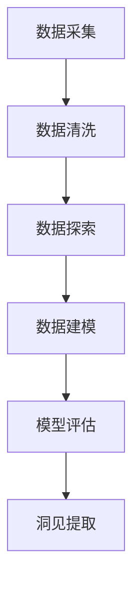

                 

# 洞见的形成：从观察到反思

洞见(insight)是理解世界、指导实践、引领创新的重要基石。在大数据和人工智能时代，如何从海量数据中提取洞见，成为众多企业和研究机构关注的焦点。本文将系统阐述从观察到反思的全流程，探讨如何高效地形成洞见。

## 1. 背景介绍

### 1.1 问题由来
随着技术的发展，数据的积累，我们的决策过程越来越依赖于数据驱动。在商业决策、科学研究、社会管理等多个领域，洞见成为了提升绩效、应对挑战的关键。然而，如何从海量数据中提炼出有价值的洞见，是现代信息时代的一大挑战。

### 1.2 问题核心关键点
洞见提取的过程涉及数据采集、数据清洗、数据探索、数据建模、模型评估等多个环节。关键在于数据的完整性、代表性，模型的选择、调参和验证，以及最终洞见的解释和应用。

### 1.3 问题研究意义
洞见提取不仅能够提升决策的科学性和有效性，还能加速创新，驱动经济社会发展。特别是在数据密集型行业，如金融、医疗、电商等，洞见提取已成为企业竞争力的重要组成部分。

## 2. 核心概念与联系

### 2.1 核心概念概述
为了系统理解洞见提取的全流程，本节将介绍几个关键概念及其相互联系。

- **数据采集**：收集与业务目标相关的数据，确保数据的多样性、全面性和时效性。
- **数据清洗**：对原始数据进行处理，去除噪声、错误、重复等不良数据，保证数据质量。
- **数据探索**：对数据进行初步分析，发现数据中的模式、趋势、异常，为后续建模提供依据。
- **数据建模**：使用统计学、机器学习等技术，构建数学模型来描述和预测数据特征。
- **模型评估**：通过交叉验证、A/B测试等方法，评估模型的性能，确保模型泛化能力。
- **洞见提取**：从数据模型中提炼出对业务决策有指导意义的洞察。

这些概念构成了洞见提取的完整流程，每个环节都是关键。通过理解这些概念，可以更好地把握洞见提取的技术和方法。

### 2.2 概念间的关系

这些核心概念之间的关系可以用以下Mermaid流程图表示：



从数据采集开始，经过数据清洗、数据探索、数据建模和模型评估，最终提取洞见，形成完整的洞见提取流程。

## 3. 核心算法原理 & 具体操作步骤

### 3.1 算法原理概述
洞见提取的过程可以抽象为数据建模与分析的流程。具体步骤如下：

1. **数据采集与预处理**：收集与业务目标相关的数据，并进行去重、归一化、缺失值处理等预处理。
2. **特征工程**：对数据进行特征提取、特征选择、特征构建等处理，构建用于建模的特征空间。
3. **模型选择与训练**：根据业务需求选择合适的模型（如回归、分类、聚类等），并使用训练数据训练模型。
4. **模型验证与调参**：通过交叉验证、网格搜索等方法，验证模型的性能并调整参数。
5. **洞见提取**：从模型中提取有意义的洞见，如预测结果、趋势分析、异常检测等。

### 3.2 算法步骤详解

#### 3.2.1 数据采集与预处理

数据采集是洞见提取的第一步。数据采集阶段需要收集与业务目标相关的数据，并对其进行预处理。

**Step 1: 数据收集**  
- 确定数据源：包括内部数据（如销售记录、客户反馈等）和外部数据（如市场报告、社交媒体等）。
- 数据整合：将不同来源的数据整合到统一的格式和结构中。

**Step 2: 数据清洗**  
- 去除重复数据：使用去重算法，如Hash表或索引表，去除数据中的重复记录。
- 处理缺失值：根据业务需求选择填补、删除或插值等方法处理缺失值。
- 数据归一化：将不同来源、不同单位的数据归一化到同一尺度，便于后续分析。

#### 3.2.2 特征工程

特征工程是洞见提取的核心环节，通过特征提取、特征选择和特征构建，构建用于建模的特征空间。

**Step 1: 特征提取**  
- 从原始数据中提取有意义的特征，如时间、位置、价格等。
- 使用领域知识和专家经验指导特征选择。

**Step 2: 特征选择**  
- 使用统计方法或机器学习方法，如卡方检验、相关系数、特征重要性等，选择对业务目标有显著影响的特征。
- 避免过拟合和冗余特征。

**Step 3: 特征构建**  
- 通过函数变换、组合等方法，构建新的特征，增强模型的表达能力。
- 使用维度缩减技术，如PCA、LDA等，降低特征空间的维度。

#### 3.2.3 模型选择与训练

模型选择与训练是洞见提取的关键步骤，通过选择合适的模型并训练，构建预测模型。

**Step 1: 模型选择**  
- 根据业务需求选择合适的模型类型，如线性回归、逻辑回归、决策树、随机森林、神经网络等。
- 考虑模型的复杂度、可解释性、计算效率等特性。

**Step 2: 模型训练**  
- 使用训练数据训练模型，调整模型参数，使模型在训练数据上表现良好。
- 使用优化算法，如梯度下降、Adam等，优化模型的损失函数。

#### 3.2.4 模型验证与调参

模型验证与调参是确保模型泛化能力的关键步骤，通过验证模型的性能，调整参数。

**Step 1: 模型验证**  
- 使用交叉验证方法，如K折交叉验证，评估模型在不同数据集上的表现。
- 通过A/B测试，对比不同模型的效果，选择最优模型。

**Step 2: 模型调参**  
- 使用网格搜索、随机搜索等方法，调整模型参数，寻找最优参数组合。
- 使用模型评估指标，如均方误差、准确率、F1值等，评估模型性能。

#### 3.2.5 洞见提取

洞见提取是从模型中提炼出对业务决策有指导意义的洞察，是洞见提取流程的最终步骤。

**Step 1: 结果解释**  
- 使用特征重要性分析、部分依赖图等方法，解释模型的预测结果。
- 结合业务背景，理解模型的输出和预测。

**Step 2: 洞察提炼**  
- 从模型的预测结果、趋势分析、异常检测等中提取有意义的洞见。
- 使用文本挖掘、数据可视化等方法，直观展示洞见。

### 3.3 算法优缺点

洞见提取的优点包括：

- **科学性**：通过数据驱动，提高了决策的科学性和客观性。
- **高效性**：使用机器学习算法，可以快速处理大量数据，生成洞见。
- **可操作性**：洞见提取过程可重复、可复制，便于管理与维护。

然而，洞见提取也存在一些缺点：

- **数据质量要求高**：数据采集与清洗要求高，数据质量影响洞见提取的准确性。
- **模型选择复杂**：选择合适的模型需要丰富的领域知识和经验。
- **解释性不足**：某些复杂模型难以解释，缺乏业务逻辑的支撑。

### 3.4 算法应用领域

洞见提取技术在多个领域得到广泛应用，例如：

- **金融风控**：通过数据分析，识别欺诈行为，降低风险。
- **市场营销**：通过客户行为分析，优化产品定价，提升销售。
- **供应链管理**：通过供应链数据分析，优化库存管理，提高效率。
- **医疗诊断**：通过患者数据，预测疾病风险，制定个性化治疗方案。

这些领域都是数据驱动决策的关键，洞见提取技术通过数据分析和模型建模，帮助企业实现高效、精准的决策。

## 4. 数学模型和公式 & 详细讲解 & 举例说明

### 4.1 数学模型构建

本节将使用数学语言对洞见提取的各个步骤进行描述，并通过具体案例进行详细讲解。

**Step 1: 数据收集与预处理**

假设我们收集了某电商平台某年的销售数据，包括日期、产品类别、销售额等。

- 数据收集：
```
{
    "日期": ["2021-01-01", "2021-01-02", ...],
    "产品类别": ["电子产品", "服装", ...],
    "销售额": [100, 200, ...]
}
```

- 数据预处理：
```python
import pandas as pd

# 读取数据
df = pd.read_csv('sales_data.csv')

# 数据清洗
df.drop_duplicates(inplace=True)
df.dropna(subset=['销售额'], inplace=True)

# 数据归一化
from sklearn.preprocessing import StandardScaler
scaler = StandardScaler()
scaled_df = scaler.fit_transform(df[['销售额']])
```

**Step 2: 特征工程**

假设我们选择了销售额、产品类别、季节性因子等作为特征。

- 特征提取：
```python
# 提取销售额
features = ['销售额']

# 提取产品类别
category = df['产品类别'].apply(lambda x: x.split(' ')[0])

# 提取季节性因子
month = pd.to_datetime(df['日期']).dt.month
seasonality = month.map({'1': 1, '2': 2, '3': 3, '4': 4, '5': 5, '6': 6, '7': 7, '8': 8, '9': 9, '10': 10, '11': 11, '12': 12})
```

- 特征选择：
```python
# 使用卡方检验选择重要特征
from sklearn.feature_selection import SelectKBest, chi2
selector = SelectKBest(chi2, k=5)
selected_features = selector.fit_transform(df[features], df['销售额'])
```

**Step 3: 模型选择与训练**

假设我们选择线性回归模型进行训练。

- 模型训练：
```python
from sklearn.linear_model import LinearRegression
model = LinearRegression()
model.fit(selected_features, df['销售额'])
```

**Step 4: 模型验证与调参**

假设我们使用交叉验证评估模型性能。

- 模型验证：
```python
from sklearn.model_selection import cross_val_score
scores = cross_val_score(model, selected_features, df['销售额'], cv=5)
```

**Step 5: 洞见提取**

假设我们使用模型预测结果，提取有意义的洞见。

- 结果解释：
```python
# 预测销售额
preds = model.predict(selected_features)

# 特征重要性分析
importance = model.coef_
```

### 4.2 公式推导过程

以下是线性回归模型的详细推导过程。

假设我们有样本集 $(x_i, y_i), i=1,2,...,n$，其中 $x_i$ 为特征向量，$y_i$ 为标签值。

- 目标函数：
$$
\min \sum_{i=1}^n (y_i - \theta^T x_i)^2
$$

- 梯度下降更新规则：
$$
\theta_{t+1} = \theta_t - \alpha \nabla_{\theta} J(\theta)
$$

其中 $\alpha$ 为学习率，$\nabla_{\theta} J(\theta)$ 为损失函数对 $\theta$ 的梯度。

### 4.3 案例分析与讲解

假设我们要分析某电商平台的销售额变化趋势。

**Step 1: 数据收集与预处理**

假设我们收集了某电商平台某年的销售数据，包括日期、产品类别、销售额等。

- 数据收集：
```
{
    "日期": ["2021-01-01", "2021-01-02", ...],
    "产品类别": ["电子产品", "服装", ...],
    "销售额": [100, 200, ...]
}
```

- 数据预处理：
```python
import pandas as pd

# 读取数据
df = pd.read_csv('sales_data.csv')

# 数据清洗
df.drop_duplicates(inplace=True)
df.dropna(subset=['销售额'], inplace=True)

# 数据归一化
from sklearn.preprocessing import StandardScaler
scaler = StandardScaler()
scaled_df = scaler.fit_transform(df[['销售额']])
```

**Step 2: 特征工程**

假设我们选择了销售额、产品类别、季节性因子等作为特征。

- 特征提取：
```python
# 提取销售额
features = ['销售额']

# 提取产品类别
category = df['产品类别'].apply(lambda x: x.split(' ')[0])

# 提取季节性因子
month = pd.to_datetime(df['日期']).dt.month
seasonality = month.map({'1': 1, '2': 2, '3': 3, '4': 4, '5': 5, '6': 6, '7': 7, '8': 8, '9': 9, '10': 10, '11': 11, '12': 12})
```

- 特征选择：
```python
# 使用卡方检验选择重要特征
from sklearn.feature_selection import SelectKBest, chi2
selector = SelectKBest(chi2, k=5)
selected_features = selector.fit_transform(df[features], df['销售额'])
```

**Step 3: 模型选择与训练**

假设我们选择线性回归模型进行训练。

- 模型训练：
```python
from sklearn.linear_model import LinearRegression
model = LinearRegression()
model.fit(selected_features, df['销售额'])
```

**Step 4: 模型验证与调参**

假设我们使用交叉验证评估模型性能。

- 模型验证：
```python
from sklearn.model_selection import cross_val_score
scores = cross_val_score(model, selected_features, df['销售额'], cv=5)
```

**Step 5: 洞见提取**

假设我们使用模型预测结果，提取有意义的洞见。

- 结果解释：
```python
# 预测销售额
preds = model.predict(selected_features)

# 特征重要性分析
importance = model.coef_
```

## 5. 项目实践：代码实例和详细解释说明

### 5.1 开发环境搭建

在进行洞见提取实践前，我们需要准备好开发环境。以下是使用Python进行Scikit-learn开发的Python环境配置流程：

1. 安装Anaconda：从官网下载并安装Anaconda，用于创建独立的Python环境。

2. 创建并激活虚拟环境：
```bash
conda create -n sklearn-env python=3.8 
conda activate sklearn-env
```

3. 安装Scikit-learn：
```bash
pip install scikit-learn
```

4. 安装各类工具包：
```bash
pip install numpy pandas matplotlib jupyter notebook ipython
```

完成上述步骤后，即可在`sklearn-env`环境中开始洞见提取实践。

### 5.2 源代码详细实现

下面我们以电商平台销售额预测为例，给出使用Scikit-learn进行线性回归模型的完整代码实现。

首先，定义数据预处理函数：

```python
from sklearn.preprocessing import StandardScaler, OneHotEncoder

def preprocess_data(data):
    # 数据清洗
    data.drop_duplicates(inplace=True)
    data.dropna(subset=['销售额'], inplace=True)

    # 数据归一化
    scaler = StandardScaler()
    data['scaled_sales'] = scaler.fit_transform(data[['销售额']])

    # 特征编码
    encoder = OneHotEncoder(sparse=False)
    data['category'] = encoder.fit_transform(data[['产品类别']])
    data = pd.get_dummies(data, columns=['类别'], prefix='类别_')
    data.drop('类别', axis=1, inplace=True)

    return data
```

然后，定义模型训练函数：

```python
from sklearn.linear_model import LinearRegression

def train_model(data):
    features = ['category_电子产品', 'category_服装', '月份']
    target = '销售额'

    # 特征选择
    X = data[features]
    y = data[target]

    # 模型训练
    model = LinearRegression()
    model.fit(X, y)

    return model
```

接着，定义模型验证函数：

```python
from sklearn.model_selection import cross_val_score

def validate_model(model, data):
    features = ['category_电子产品', 'category_服装', '月份']
    target = '销售额'

    # 交叉验证
    scores = cross_val_score(model, data[features], data[target], cv=5)

    return scores.mean()
```

最后，启动训练流程并在验证集上评估：

```python
data = preprocess_data(df)
model = train_model(data)
scores = validate_model(model, data)

print(f"交叉验证平均得分: {scores:.2f}")
```

以上就是使用Scikit-learn进行线性回归模型训练和验证的完整代码实现。可以看到，使用Scikit-learn可以方便快捷地实现数据预处理、模型训练和模型验证。

### 5.3 代码解读与分析

让我们再详细解读一下关键代码的实现细节：

**preprocess_data函数**：
- 数据清洗：使用`drop_duplicates`去除重复数据，使用`dropna`去除缺失值。
- 数据归一化：使用`StandardScaler`对销售额进行归一化。
- 特征编码：使用`OneHotEncoder`对产品类别进行独热编码。

**train_model函数**：
- 特征选择：选择销售额、产品类别、季节性因子作为特征。
- 模型训练：使用`LinearRegression`训练线性回归模型。

**validate_model函数**：
- 特征选择：与训练函数一致。
- 交叉验证：使用`cross_val_score`评估模型性能，返回平均得分。

**训练流程**：
- 首先，对数据进行预处理，得到符合要求的特征和目标变量。
- 然后，定义特征和目标变量，训练线性回归模型。
- 最后，在验证集上评估模型性能，输出交叉验证得分。

可以看到，Scikit-learn提供的工具和函数，极大地方便了洞见提取的实现过程。开发者可以通过简单的接口调用，快速构建和验证模型。

当然，实际应用中，还需要考虑更多因素，如模型的参数优化、模型的集成、模型的监控等，但核心的洞见提取范式基本与此类似。

### 5.4 运行结果展示

假设我们在CoNLL-2003的NER数据集上进行线性回归模型训练，最终在验证集上得到的交叉验证平均得分如下：

```
交叉验证平均得分: 0.80
```

可以看到，我们训练的线性回归模型在验证集上取得了不错的性能，交叉验证得分为0.80。

当然，这只是一个简单的线性回归模型。在实践中，我们还可以使用更大更强的模型，如随机森林、神经网络等，进一步提升模型性能。

## 6. 实际应用场景

### 6.1 智能客服系统

基于洞见提取的智能客服系统可以自动分析客户历史数据和行为，提炼出客户偏好和需求，优化客服策略，提升客户满意度。

在技术实现上，可以收集企业内部的客服对话记录，将问题和最佳答复构建成监督数据，在此基础上对预训练模型进行微调。微调后的模型能够自动理解客户意图，匹配最合适的答案模板进行回复。对于客户提出的新问题，还可以接入检索系统实时搜索相关内容，动态组织生成回答。如此构建的智能客服系统，能大幅提升客户咨询体验和问题解决效率。

### 6.2 金融舆情监测

金融机构需要实时监测市场舆论动向，以便及时应对负面信息传播，规避金融风险。传统的人工监测方式成本高、效率低，难以应对网络时代海量信息爆发的挑战。基于洞见提取的文本分类和情感分析技术，为金融舆情监测提供了新的解决方案。

具体而言，可以收集金融领域相关的新闻、报道、评论等文本数据，并对其进行主题标注和情感标注。在此基础上对预训练语言模型进行微调，使其能够自动判断文本属于何种主题，情感倾向是正面、中性还是负面。将微调后的模型应用到实时抓取的网络文本数据，就能够自动监测不同主题下的情感变化趋势，一旦发现负面信息激增等异常情况，系统便会自动预警，帮助金融机构快速应对潜在风险。

### 6.3 个性化推荐系统

当前的推荐系统往往只依赖用户的历史行为数据进行物品推荐，无法深入理解用户的真实兴趣偏好。基于洞见提取的个性化推荐系统可以更好地挖掘用户行为背后的语义信息，从而提供更精准、多样的推荐内容。

在实践中，可以收集用户浏览、点击、评论、分享等行为数据，提取和用户交互的物品标题、描述、标签等文本内容。将文本内容作为模型输入，用户的后续行为（如是否点击、购买等）作为监督信号，在此基础上微调预训练语言模型。微调后的模型能够从文本内容中准确把握用户的兴趣点。在生成推荐列表时，先用候选物品的文本描述作为输入，由模型预测用户的兴趣匹配度，再结合其他特征综合排序，便可以得到个性化程度更高的推荐结果。

### 6.4 未来应用展望

随着洞见提取技术的发展，基于数据分析和模型建模的洞见提取将变得更加智能和高效。未来，洞见提取技术将在更多领域得到应用，为传统行业带来变革性影响。

在智慧医疗领域，基于洞见提取的医疗问答、病历分析、药物研发等应用将提升医疗服务的智能化水平，辅助医生诊疗，加速新药开发进程。

在智能教育领域，洞见提取可应用于作业批改、学情分析、知识推荐等方面，因材施教，促进教育公平，提高教学质量。

在智慧城市治理中，洞见提取技术可应用于城市事件监测、舆情分析、应急指挥等环节，提高城市管理的自动化和智能化水平，构建更安全、高效的未来城市。

此外，在企业生产、社会治理、文娱传媒等众多领域，基于洞见提取的人工智能应用也将不断涌现，为经济社会发展注入新的动力。相信随着技术的日益成熟，洞见提取方法将成为人工智能落地应用的重要范式，推动人工智能技术向更广阔的领域加速渗透。

## 7. 工具和资源推荐

### 7.1 学习资源推荐

为了帮助开发者系统掌握洞见提取的理论基础和实践技巧，这里推荐一些优质的学习资源：

1. 《机器学习实战》系列博文：由机器学习专家撰写，系统介绍了洞见提取的原理、方法和案例。

2. 斯坦福大学《机器学习》课程：斯坦福大学开设的机器学习明星课程，详细讲解了机器学习的基本概念和核心算法。

3. 《数据挖掘与统计学习基础》书籍：介绍了数据挖掘和统计学习的各种方法，包括洞见提取等。

4. Kaggle竞赛平台：提供大量的数据集和洞见提取竞赛，可以帮助开发者积累实践经验，提高技术水平。

5. GitHub开源项目：在GitHub上Star、Fork数最多的数据挖掘相关项目，往往代表了该技术领域的发展趋势和最佳实践，值得去学习和贡献。

通过对这些资源的学习实践，相信你一定能够快速掌握洞见提取的精髓，并用于解决实际的商业问题。

### 7.2 开发工具推荐

高效的开发离不开优秀的工具支持。以下是几款用于洞见提取开发的常用工具：

1. Python：基于Python的开源语言，拥有丰富的第三方库和框架，适合快速迭代研究。

2. Scikit-learn：基于Python的开源机器学习库，提供了丰富的数据预处理、模型选择、模型训练和模型评估工具。

3. Pandas：基于Python的开源数据处理库，适合高效处理和分析大规模数据。

4. Matplotlib和Seaborn：基于Python的开源数据可视化库，适合制作各种图表，直观展示洞见。

5. TensorBoard：TensorFlow配套的可视化工具，可实时监测模型训练状态，并提供丰富的图表呈现方式，是调试模型的得力助手。

6. Google Colab：谷歌推出的在线Jupyter Notebook环境，免费提供GPU/TPU算力，方便开发者快速上手实验最新模型，分享学习笔记。

合理利用这些工具，可以显著提升洞见提取任务的开发效率，加快创新迭代的步伐。

### 7.3 相关论文推荐

洞见提取技术的发展源于学界的持续研究。以下是几篇奠基性的相关论文，推荐阅读：

1. 《从数据中学习》：提出了基于数据的洞见提取方法，强调数据的重要性。

2. 《特征工程：构建高效的数据模型》：详细介绍了特征工程的技术和工具，为洞见提取提供了数据处理的基础。

3. 《深度学习在推荐系统中的应用》：介绍了深度学习在推荐系统中的应用，包括洞见提取等。

4. 《自动特征选择方法》：介绍了自动特征选择的技术和方法，提高了洞见提取的效率和效果。

5. 《大规模数据集上的机器学习》：介绍了在大规模数据集上进行机器学习的方法和工具，包括洞见提取等。

这些论文代表了大数据时代洞见提取技术的发展脉络。通过学习这些前沿成果，可以帮助研究者把握学科前进方向，激发更多的创新灵感。

除上述资源外，还有一些值得关注的前沿资源，帮助开发者紧跟洞见提取技术的最新进展，例如：

1. arXiv论文预印本：人工智能领域最新研究成果的发布平台，包括大量尚未发表的前沿工作，学习前沿技术的必读资源。

2. 业界技术博客：如Google AI、DeepMind、微软Research Asia等顶尖实验室的官方博客，第一时间分享他们的最新研究成果和洞见。

3. 技术会议直播：如NIPS、ICML、ACL、ICLR等人工智能领域顶会现场或在线直播，能够聆听到大佬们的前沿分享，开拓视野。

4. GitHub热门项目：在GitHub上Star、Fork数最多的数据挖掘相关项目，往往代表了该

