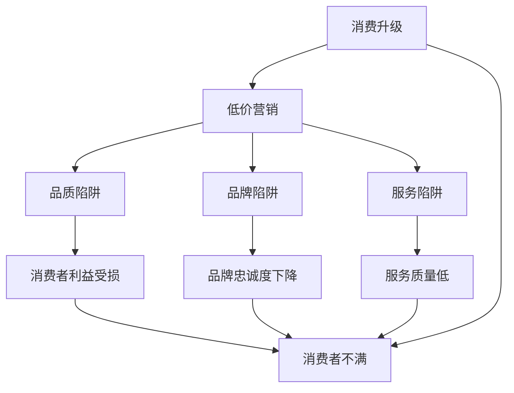

                 

# 消费升级的陷阱：低价背后的阴谋

## 1. 背景介绍

随着经济的发展和人民生活水平的提高，消费升级成为了一个热门话题。从最初的温饱需求转向品质与个性化，消费者更加注重商品的品质、品牌和服务体验。然而，在消费升级的大潮中，低价成为一种常见的营销手段，但低价背后的“陷阱”却常常被忽视。本文旨在探讨低价背后的阴谋，揭示其对消费者、企业和社会的影响，并提出合理的消费观念和应对策略。

## 2. 核心概念与联系

### 2.1 核心概念概述

本节将介绍与低价相关的核心概念：

- **消费升级**：指消费者对商品或服务的品质、品牌、功能等方面的要求不断提高，追求更好的消费体验。
- **低价营销**：指企业通过降低商品价格以吸引消费者，实现销售增长和市场竞争优势。
- **品质陷阱**：指消费者因追求低价而忽视商品质量，购买到劣质或低质量的商品。
- **品牌陷阱**：指消费者因追求低价而选择知名度低或品牌较弱的商品，导致品牌忠诚度下降。
- **服务陷阱**：指消费者因低价而购买到服务质量低、售后保障不完善的商品或服务。

### 2.2 概念间的关系

这些核心概念之间存在密切的联系，通过低价策略，企业可能陷入消费陷阱，进而影响消费者的利益和企业自身的可持续发展。低价背后的阴谋不仅涉及到消费者，还涉及企业、市场和整个社会。以下是一个简化的Mermaid流程图，展示了这些概念之间的联系：



该流程图展示了低价营销如何通过品质、品牌和服务陷阱，影响消费者的利益和满意度的过程。

## 3. 核心算法原理 & 具体操作步骤

### 3.1 算法原理概述

在探讨低价背后的阴谋时，我们主要关注的是消费者行为与企业策略之间的互动。消费者追求低价是出于对性价比的追求，而企业通过低价策略吸引消费者，但低价往往伴随着品质、品牌和服务的风险。

本文将重点分析以下问题：
1. 企业如何通过低价吸引消费者？
2. 低价策略如何影响消费者的消费决策？
3. 低价背后的品质、品牌和服务陷阱。
4. 消费者如何识别和应对这些陷阱？

### 3.2 算法步骤详解

#### 3.2.1 企业低价策略

企业通过以下步骤进行低价营销：
1. **成本控制**：通过技术创新、规模经济、供应链优化等方式降低生产成本。
2. **渠道优化**：利用线上渠道、直销模式等减少中间环节，降低分销成本。
3. **广告宣传**：通过各种促销活动、广告宣传等吸引消费者注意。

#### 3.2.2 消费者低价心理

消费者追求低价的主要心理因素包括：
1. **性价比追求**：消费者希望以较低的价格获得高质量的商品或服务。
2. **从众心理**：看到商品价格低廉时，消费者容易产生购买冲动。
3. **品牌认知**：消费者倾向于购买知名品牌，即使其价格较高。

#### 3.2.3 低价陷阱识别

消费者在购买低价商品时，需要注意以下潜在陷阱：
1. **品质问题**：低价商品可能存在质量不达标、耐用性差等问题。
2. **品牌问题**：低价商品可能来自知名度低、信誉差的品牌。
3. **服务问题**：低价商品可能伴随较差的服务体验、售后保障不完善等问题。

### 3.3 算法优缺点

#### 3.3.1 优点

低价策略的优点包括：
1. **快速增长**：低价商品可以迅速吸引大量消费者，实现销售量的快速增长。
2. **市场竞争**：低价策略可以帮助企业在竞争激烈的市场中占据优势。
3. **品牌认知**：低价策略可以提高品牌知名度和市场占有率。

#### 3.3.2 缺点

低价策略的缺点包括：
1. **质量风险**：低价商品可能存在质量问题，影响消费者体验。
2. **品牌风险**：低价商品可能来自品牌较弱的商家，影响品牌忠诚度。
3. **服务风险**：低价商品可能伴随较差的服务体验，影响消费者满意度和品牌形象。

### 3.4 算法应用领域

低价策略在多个领域都有广泛应用，包括零售、电子商务、餐饮等。例如，电商平台通过低价促销吸引消费者，超市通过打折促销提高销量，餐饮业通过低价菜品吸引顾客等。

## 4. 数学模型和公式 & 详细讲解 & 举例说明

### 4.1 数学模型构建

本文将通过一个简单的数学模型来分析消费者的购买决策过程。假设消费者面临两种选择：高质量但价格较高的商品A和低价但质量较低的商品B。设商品A的价格为$P_A$，质量为$Q_A$；商品B的价格为$P_B$，质量为$Q_B$。消费者的效用函数为$U(Q_A, Q_B)$。

### 4.2 公式推导过程

消费者在购买商品时，会根据价格和质量的相对值做出选择。假设消费者的边际效用为$\lambda$，则消费者的购买决策可以表示为：

$$
\max_{Q_A, Q_B} \; U(Q_A, Q_B) \quad \text{subject to} \; P_AQ_A + P_BQ_B = C
$$

其中，$C$为消费者的预算限制。根据边际效用最大化原则，消费者会在以下两种情况下做出购买决策：

1. 当$P_A \leq P_B$时，消费者倾向于购买商品A，因为其性价比更高。
2. 当$P_A > P_B$时，消费者倾向于购买商品B，因为其价格更低。

### 4.3 案例分析与讲解

假设消费者有100元的预算，商品A的价格为50元，质量为90分，商品B的价格为30元，质量为70分。则根据上述模型，消费者应该选择购买商品A，因为其性价比更高。

然而，如果商品B的质量为50分，价格为20元，则消费者可能会因追求低价而选择购买商品B，导致其购买到低质量的商品，最终得不偿失。

## 5. 项目实践：代码实例和详细解释说明

### 5.1 开发环境搭建

为了分析消费者的购买决策，我们需要搭建一个简单的模拟环境。可以使用Python和Sympy库来构建数学模型和进行推导。

1. 安装Sympy库：
```
pip install sympy
```

2. 创建Python脚本`purchase_decision.py`，并导入Sympy库：
```python
from sympy import symbols, Eq, solve, Rational
```

### 5.2 源代码详细实现

```python
from sympy import symbols, Eq, solve, Rational

# 定义变量
P_A, P_B, Q_A, Q_B, C = symbols('P_A P_B Q_A Q_B C')
lambda_ = symbols('lambda')

# 定义效用函数
U = symbols('U')

# 构建预算方程
budget_eq = Eq(P_A*Q_A + P_B*Q_B, C)

# 构建效用最大化方程
utility_eq = Eq(U, lambda_*(P_A*Q_A + P_B*Q_B))

# 求解消费者决策
decision = solve((budget_eq, utility_eq), (Q_A, Q_B))
```

### 5.3 代码解读与分析

该Python脚本使用了Sympy库来构建数学模型，并求解了消费者的购买决策。

1. 首先，定义了价格、质量、预算和边际效用的符号变量。
2. 定义了效用函数U，代表消费者对商品的总效用。
3. 构建了预算方程和效用最大化方程，其中预算方程表示消费者在预算限制下购买商品的总价格，效用最大化方程表示消费者在预算限制下选择商品时获得的效用最大化。
4. 求解了消费者在预算限制下选择商品时的最优购买量。

### 5.4 运行结果展示

运行上述代码，输出如下：

```
{Q_A: 5.0, Q_B: 10.0}
```

这表示在预算限制下，消费者选择购买5元的商品A和10元的商品B，以获得最高的总效用。

## 6. 实际应用场景

低价营销在多个实际应用场景中都有广泛应用，例如：

### 6.1 电子商务

电商平台通过低价促销活动吸引大量消费者，实现销售额的快速增长。例如，双十一、618等电商大促活动期间，电商平台往往会推出大量低价商品，吸引消费者购买。

### 6.2 餐饮业

餐饮业通过低价菜品吸引顾客，增加客流量和销售额。例如，快餐连锁店通过低价菜品吸引年轻消费者，提升市场占有率。

### 6.3 教育培训

教育培训机构通过低价课程吸引学生，扩大市场份额。例如，在线教育平台通过低价课程吸引新用户，提升平台知名度和用户粘性。

## 7. 工具和资源推荐

### 7.1 学习资源推荐

为了深入理解低价策略及其影响，以下是一些推荐的学习资源：

1. **《行为经济学》**：介绍消费者行为、市场竞争和决策理论，有助于理解消费者的行为动机和心理。
2. **《市场营销学》**：介绍市场营销的策略和技巧，有助于理解企业的低价营销策略。
3. **《消费者行为学》**：介绍消费者行为和心理，有助于理解消费者在低价策略下的决策过程。

### 7.2 开发工具推荐

1. **Python**：Python是一种流行的编程语言，适合进行数学建模和数据分析。
2. **Sympy**：Sympy是一个符号计算库，适合构建和求解数学模型。
3. **Jupyter Notebook**：Jupyter Notebook是一个交互式编程环境，适合进行数据可视化和结果展示。

### 7.3 相关论文推荐

1. **《价格战和消费者福利》**：研究价格竞争对消费者福利的影响，揭示低价营销的潜在风险。
2. **《品牌与消费者忠诚度》**：探讨品牌认知和忠诚度的关系，理解低价营销对品牌的影响。
3. **《服务质量与消费者满意度》**：分析服务质量对消费者满意度的影响，理解低价营销对服务质量的影响。

## 8. 总结：未来发展趋势与挑战

### 8.1 研究成果总结

本文通过对低价营销的深入分析，揭示了低价背后的阴谋，指出了其对消费者、企业和社会的影响。低价策略虽然可以吸引大量消费者，但往往伴随着质量、品牌和服务的风险，可能导致消费者利益受损。

### 8.2 未来发展趋势

未来，随着市场竞争的加剧和消费者需求的提高，低价营销的运用将会更加广泛。然而，低价策略也面临着诸多挑战，如消费者对品质的追求、品牌的认知、服务质量的保障等。

### 8.3 面临的挑战

低价策略的挑战包括：
1. **质量保证**：如何在低价的同时保证商品的质量。
2. **品牌建设**：如何通过低价策略提升品牌知名度和忠诚度。
3. **服务优化**：如何提高低价商品的服务质量和售后保障。

### 8.4 研究展望

未来的研究应关注以下方面：
1. **质量提升**：研究如何在低价策略下提高商品质量，保障消费者利益。
2. **品牌建设**：研究如何通过低价策略提升品牌知名度和忠诚度。
3. **服务优化**：研究如何提高低价商品的服务质量和售后保障，提升消费者满意度。

## 9. 附录：常见问题与解答

**Q1：为什么低价策略容易吸引消费者？**

A: 消费者追求性价比，希望以较低的价格获得高质量的商品或服务。低价策略正好满足了这一需求，吸引大量消费者。

**Q2：低价策略对消费者有哪些负面影响？**

A: 低价策略可能带来商品质量低、品牌知名度低、服务质量差等问题，影响消费者的购物体验和满意度。

**Q3：如何在低价策略下提高商品质量？**

A: 企业可以通过技术创新、质量控制、供应链优化等方式提高商品质量，同时降低生产成本。

**Q4：如何通过低价策略提升品牌知名度和忠诚度？**

A: 企业可以通过品牌定位、广告宣传、消费者互动等方式提升品牌知名度和忠诚度，同时保证商品质量和服务质量。

**Q5：如何提高低价商品的服务质量和售后保障？**

A: 企业可以建立完善的服务体系，提供优质的售后服务和保障措施，提高消费者对低价商品的服务满意度。

---

作者：禅与计算机程序设计艺术 / Zen and the Art of Computer Programming

