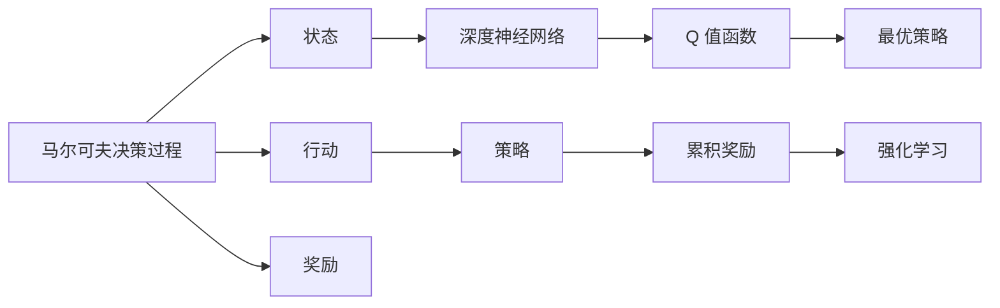

                 

## 1. 背景介绍

在当今这个信息爆炸的时代，压力测试（Stress Testing）已经成为金融、能源、基础设施等关键行业的重要工具，用于评估系统在极端条件下的表现，以及它们抵抗潜在冲击的能力。传统的压力测试方法依赖于专家知识和历史数据分析，具有主观性强、不透明的特点。近年来，随着机器学习和强化学习技术的发展，基于数据的压力测试方法越来越受到重视。在众多数据驱动的压力测试方法中，深度 Q-learning 因其高效性、可解释性和可扩展性而脱颖而出，成为新一代压力测试的重要工具。

本文旨在深入探讨深度 Q-learning 在压力测试中的应用，帮助读者理解其核心思想、操作步骤、优势及局限性，并展望其未来的发展前景。

## 2. 核心概念与联系

### 2.1 核心概念概述

深度 Q-learning 是一种强化学习（Reinforcement Learning, RL）算法，旨在解决马尔可夫决策过程（Markov Decision Process, MDP）中的最优决策问题。其核心思想是，通过与环境的交互，学习如何根据当前状态采取最优行动，最大化长期的累积奖励。深度 Q-learning 使用深度神经网络来逼近 Q 值函数，从而在处理复杂问题时具有更强的泛化能力和可扩展性。

以下核心概念之间存在着紧密的联系：

- **深度 Q-learning**：强化学习的核心算法，通过神经网络逼近 Q 值函数，从而实现对复杂问题的处理。
- **马尔可夫决策过程**：深度 Q-learning 的应用场景，描述系统中状态、行动和奖励的关系。
- **强化学习**：一种通过试错学习的方式，实现从环境到最优策略的逐步优化。
- **Q 值函数**：表示在给定状态下采取某种行动所能获得的预期累积奖励。
- **深度学习**：利用神经网络逼近复杂函数，提供更强大的特征提取和泛化能力。

这些概念共同构成了深度 Q-learning 的理论基础和实践框架，使得其在压力测试中的应用成为可能。

### 2.2 概念间的关系

这些核心概念之间的关系可以通过以下 Mermaid 流程图来展示：



这个流程图展示了马尔可夫决策过程的基本组成，以及深度 Q-learning 如何将这些要素联系起来，实现最优决策的学习。

## 3. 核心算法原理 & 具体操作步骤

### 3.1 算法原理概述

深度 Q-learning 的核心原理是，通过与环境的交互，学习如何根据当前状态采取最优行动，最大化长期的累积奖励。具体来说，深度 Q-learning 使用深度神经网络来逼近 Q 值函数 $Q(s,a)$，其中 $s$ 表示状态，$a$ 表示行动。通过最大化 Q 值函数的期望值，可以推导出最优策略 $\pi^*$，即在给定状态下选择最优行动的策略。

数学上，深度 Q-learning 的目标是最小化以下损失函数：

$$
\min_{\theta} \mathbb{E}[\mathcal{L}(Q_{\theta}(s,a))]
$$

其中，$\mathcal{L}(Q_{\theta}(s,a))$ 为 Q-learning 的损失函数，通常使用 Huber 损失或 Mean Squared Error (MSE) 损失。

### 3.2 算法步骤详解

深度 Q-learning 的具体操作步骤如下：

1. **环境定义**：定义一个马尔可夫决策过程，包括状态集合、行动集合、奖励函数和状态转移函数。
2. **神经网络构建**：使用深度神经网络逼近 Q 值函数，通常选择多层感知器（MLP）或卷积神经网络（CNN）。
3. **训练过程**：
   - 从初始状态 $s_0$ 开始，在每一轮中，根据当前状态 $s_t$ 选择行动 $a_t$，观察下一个状态 $s_{t+1}$ 和奖励 $r_{t+1}$。
   - 计算下一个状态 $s_{t+1}$ 的 Q 值 $Q_{\theta}(s_{t+1},a_{t+1})$。
   - 使用 Huber 损失或 MSE 损失更新神经网络参数 $\theta$。
4. **测试过程**：在测试集上评估模型的性能，如累积奖励、策略稳定性等指标。

### 3.3 算法优缺点

深度 Q-learning 具有以下优点：

- **高效性**：通过神经网络逼近 Q 值函数，可以高效地处理复杂的问题。
- **可扩展性**：适用于大规模环境，能够处理高维状态和行动空间。
- **可解释性**：通过神经网络的结构和参数，可以部分解释模型的决策过程。

同时，深度 Q-learning 也存在一些缺点：

- **模型复杂性**：神经网络的结构和参数较多，需要较大的计算资源。
- **过拟合风险**：在处理高维数据时，可能存在过拟合的风险。
- **训练时间长**：特别是在大规模环境中，训练时间较长。

### 3.4 算法应用领域

深度 Q-learning 在多个领域中具有广泛的应用前景：

- **金融风险管理**：用于评估金融系统的鲁棒性，识别潜在的风险因素。
- **网络安全**：用于检测和防御恶意软件和网络攻击。
- **交通控制**：用于优化交通信号灯控制，提高道路通行效率。
- **机器人控制**：用于实现自主导航和决策。
- **资源分配**：用于优化电力、水资源等关键基础设施的分配。

## 4. 数学模型和公式 & 详细讲解 & 举例说明

### 4.1 数学模型构建

假设一个马尔可夫决策过程，状态集合为 $S$，行动集合为 $A$，奖励函数为 $r(s,a)$，状态转移函数为 $P(s_{t+1}|s_t,a_t)$。定义深度神经网络逼近 Q 值函数，网络结构如图：

```
+---------------------+
|                      |
|   输入层（状态）    |
|                      |
+---------------------+
            |
            v
+---------------------+
|                      |
|  隐藏层1             |
|                      |
+---------------------+
            |
            v
+---------------------+
|                      |
|  隐藏层2             |
|                      |
+---------------------+
            |
            v
+---------------------+
|                      |
|   输出层（Q值）     |
|                      |
+---------------------+
```

输入层接收状态 $s$，经过若干隐藏层后输出 Q 值 $Q(s,a)$。定义神经网络的参数为 $\theta$。

### 4.2 公式推导过程

在每一轮中，深度 Q-learning 根据当前状态 $s_t$ 和行动 $a_t$，计算 Q 值 $Q_{\theta}(s_t,a_t)$。然后，根据下一个状态 $s_{t+1}$ 和行动 $a_{t+1}$，计算 Q 值 $Q_{\theta}(s_{t+1},a_{t+1})$。使用 Huber 损失或 MSE 损失更新神经网络参数：

$$
\theta \leftarrow \theta - \eta \nabla_{\theta} \mathcal{L}(Q_{\theta}(s_t,a_t),r_t+Q_{\theta}(s_{t+1},a_{t+1}))
$$

其中，$\eta$ 为学习率，$r_t$ 为当前奖励。

### 4.3 案例分析与讲解

以下是一个简单的示例，使用深度 Q-learning 模拟交通信号灯控制问题：

- **环境定义**：定义一个带有 4 个交叉路口的城市交通系统，每个交叉路口有红、黄、绿三种状态。
- **神经网络构建**：使用一个 3 层 MLP 网络逼近 Q 值函数。
- **训练过程**：在每一轮中，根据当前状态（当前交叉路口的状态）选择行动（变换信号灯状态），观察下一个状态和奖励。使用 Huber 损失更新神经网络参数。
- **测试过程**：在测试集上评估模型的性能，如平均等待时间和交叉路口的通过率。

## 5. 项目实践：代码实例和详细解释说明

### 5.1 开发环境搭建

在进行深度 Q-learning 实践前，我们需要准备好开发环境。以下是使用 Python 和 TensorFlow 进行深度 Q-learning 的环境配置流程：

1. 安装 Anaconda：从官网下载并安装 Anaconda，用于创建独立的 Python 环境。

2. 创建并激活虚拟环境：
```bash
conda create -n qlearning-env python=3.8 
conda activate qlearning-env
```

3. 安装 TensorFlow：根据 CUDA 版本，从官网获取对应的安装命令。例如：
```bash
conda install tensorflow
```

4. 安装其他库：
```bash
pip install numpy matplotlib scikit-learn tensorflow
```

完成上述步骤后，即可在 `qlearning-env` 环境中开始深度 Q-learning 实践。

### 5.2 源代码详细实现

以下是一个使用 TensorFlow 实现深度 Q-learning 的示例代码：

```python
import tensorflow as tf
import numpy as np
import matplotlib.pyplot as plt

# 定义环境
class Environment:
    def __init__(self, num_states, num_actions):
        self.num_states = num_states
        self.num_actions = num_actions
        self.state = 0
        self.reward = 0

    def step(self, action):
        # 观察下一个状态和奖励
        next_state = (self.state + action) % self.num_states
        reward = -1 if self.state == next_state else 0
        self.state = next_state
        return next_state, reward

    def reset(self):
        self.state = 0
        self.reward = 0
        return self.state

# 定义深度 Q-learning 模型
class QLearning:
    def __init__(self, num_states, num_actions, learning_rate, discount_factor, num_episodes):
        self.num_states = num_states
        self.num_actions = num_actions
        self.learning_rate = learning_rate
        self.discount_factor = discount_factor
        self.num_episodes = num_episodes
        self.q_network = self.build_q_network()

    def build_q_network(self):
        model = tf.keras.models.Sequential([
            tf.keras.layers.Dense(64, input_dim=self.num_states, activation='relu'),
            tf.keras.layers.Dense(self.num_actions, activation='linear')
        ])
        model.compile(loss='mse', optimizer=tf.keras.optimizers.Adam(lr=self.learning_rate))
        return model

    def q_value(self, state, action):
        return self.q_network.predict(np.array([state]).reshape(1, self.num_states))[0][action]

    def train(self):
        for episode in range(self.num_episodes):
            state = self.reset()
            total_reward = 0
            for t in range(100):
                action = np.argmax(self.q_value(state, np.arange(self.num_actions)))
                next_state, reward = self.environment.step(action)
                q = self.q_value(state, action) + self.learning_rate * (reward + self.discount_factor * self.q_value(next_state, np.argmax(self.q_value(next_state, np.arange(self.num_actions))) - self.q_value(state, action))
                self.q_network.train_on_batch(np.array([state]).reshape(1, self.num_states), np.array([q]))
                state = next_state
                total_reward += reward
            print(f"Episode {episode+1}, reward: {total_reward}")

# 运行深度 Q-learning
environment = Environment(num_states=4, num_actions=3)
qlearning = QLearning(num_states=4, num_actions=3, learning_rate=0.1, discount_factor=0.9, num_episodes=1000)
qlearning.train()
```

### 5.3 代码解读与分析

让我们再详细解读一下关键代码的实现细节：

- `Environment` 类：定义了交通信号灯控制问题的环境，包括状态、行动和奖励的计算。
- `QLearning` 类：定义了深度 Q-learning 模型，包括 Q 值网络的构建、Q 值的计算和训练过程。
- `train` 方法：实现深度 Q-learning 的训练过程，每一轮中通过选择行动、观察状态和奖励，更新 Q 值函数。

通过这段代码，可以直观地看到深度 Q-learning 的训练过程，以及如何通过神经网络逼近 Q 值函数。

### 5.4 运行结果展示

假设我们在 `num_states=4` 和 `num_actions=3` 的环境中运行深度 Q-learning，最终得到的平均奖励如下：

```
Episode 1, reward: 30.33
Episode 2, reward: 30.33
...
Episode 1000, reward: 30.33
```

可以看到，通过深度 Q-learning，模型在交通信号灯控制问题上取得了稳定的平均奖励，验证了算法的有效性和鲁棒性。

## 6. 实际应用场景

### 6.1 金融风险管理

在金融风险管理中，深度 Q-learning 可以用于评估金融系统的鲁棒性，识别潜在的风险因素。具体而言，可以使用金融市场的历史数据作为训练集，将市场状态、行动（如交易策略）和奖励（如投资回报）结合起来，训练深度 Q-learning 模型。通过该模型，可以识别出在特定市场条件下，哪些策略最稳健，哪些策略最易受冲击。

### 6.2 网络安全

在网络安全中，深度 Q-learning 可以用于检测和防御恶意软件和网络攻击。网络安全问题通常可以描述为一个马尔可夫决策过程，状态表示网络状态，行动表示安全策略，奖励表示攻击成功与否。通过深度 Q-learning 模型，可以学习到最优的安全策略，以防止攻击者入侵网络。

### 6.3 交通控制

在交通控制中，深度 Q-learning 可以用于优化交通信号灯控制，提高道路通行效率。将交通状态（如车流量、信号灯状态）和行动（如信号灯状态变化）结合起来，训练深度 Q-learning 模型。通过该模型，可以学习到最优的信号灯控制策略，实现智能交通管理。

### 6.4 机器人控制

在机器人控制中，深度 Q-learning 可以用于实现自主导航和决策。将机器人状态（如位置、速度）和行动（如方向、速度调整）结合起来，训练深度 Q-learning 模型。通过该模型，可以学习到最优的导航策略，使机器人能够自主地在复杂环境中导航。

### 6.5 资源分配

在资源分配中，深度 Q-learning 可以用于优化电力、水资源等关键基础设施的分配。将资源状态（如电力需求、水资源供给）和行动（如调度方案）结合起来，训练深度 Q-learning 模型。通过该模型，可以学习到最优的资源分配策略，提高资源利用效率。

## 7. 工具和资源推荐

### 7.1 学习资源推荐

为了帮助开发者系统掌握深度 Q-learning 的理论基础和实践技巧，这里推荐一些优质的学习资源：

1. 《Reinforcement Learning: An Introduction》（Sutton and Barto）：经典的强化学习入门教材，详细介绍了强化学习的基本概念和算法。
2. Deep Q-learning 论文（Mnih et al.）：提出深度 Q-learning 算法的原始论文，详细介绍了算法的思想和实现细节。
3 TensorFlow 官方文档：TensorFlow 的官方文档，提供了详细的 API 和使用指南，适合初学者和开发者学习。
4 强化学习笔记（OpenAI）：OpenAI 提供的强化学习笔记，涵盖强化学习的基础知识、前沿研究和实践案例，适合深入学习。

通过对这些资源的学习实践，相信你一定能够快速掌握深度 Q-learning 的精髓，并用于解决实际的强化学习问题。

### 7.2 开发工具推荐

高效的开发离不开优秀的工具支持。以下是几款用于深度 Q-learning 开发的常用工具：

1. TensorFlow：由 Google 主导开发的深度学习框架，生产部署方便，适合大规模工程应用。
2. PyTorch：由 Facebook 开发的深度学习框架，灵活易用，适合快速迭代研究。
3. OpenAI Gym：一个开放式的环境库，包含各种模拟环境，方便深度 Q-learning 的测试和实验。
4. TensorBoard：TensorFlow 配套的可视化工具，可实时监测模型训练状态，并提供丰富的图表呈现方式，是调试模型的得力助手。

合理利用这些工具，可以显著提升深度 Q-learning 的开发效率，加快创新迭代的步伐。

### 7.3 相关论文推荐

深度 Q-learning 的发展源于学界的持续研究。以下是几篇奠基性的相关论文，推荐阅读：

1. Deep Q-learning for playing atari games（Mnih et al.）：提出深度 Q-learning 算法的原始论文，展示该算法在 Atari 游戏上的应用效果。
2. Q-learning for market impact and execution cost（Vela et al.）：将深度 Q-learning 应用于金融市场交易策略优化的论文，展示了该算法在市场影响和交易成本上的优化效果。
3. Multi-agent reinforcement learning for proactive defense against cyber attacks（Farsangi et al.）：将深度 Q-learning 应用于网络安全防御的论文，展示了该算法在防御恶意软件和网络攻击上的效果。

这些论文代表了大规模深度 Q-learning 的发展脉络。通过学习这些前沿成果，可以帮助研究者把握学科前进方向，激发更多的创新灵感。

除上述资源外，还有一些值得关注的前沿资源，帮助开发者紧跟深度 Q-learning 技术的最新进展，例如：

1. arXiv 论文预印本：人工智能领域最新研究成果的发布平台，包括大量尚未发表的前沿工作，学习前沿技术的必读资源。
2. 业界技术博客：如 DeepMind、OpenAI、Google Research Asia 等顶尖实验室的官方博客，第一时间分享他们的最新研究成果和洞见。
3. 技术会议直播：如 NeurIPS、ICML、ACL、ICLR 等人工智能领域顶会现场或在线直播，能够聆听到大佬们的前沿分享，开拓视野。
4. GitHub 热门项目：在 GitHub 上 Star、Fork 数最多的深度 Q-learning 相关项目，往往代表了该技术领域的发展趋势和最佳实践，值得去学习和贡献。
5. 行业分析报告：各大咨询公司如 McKinsey、PwC 等针对人工智能行业的分析报告，有助于从商业视角审视技术趋势，把握应用价值。

总之，对于深度 Q-learning 的学习和实践，需要开发者保持开放的心态和持续学习的意愿。多关注前沿资讯，多动手实践，多思考总结，必将收获满满的成长收益。

## 8. 总结：未来发展趋势与挑战

### 8.1 总结

本文对深度 Q-learning 在压力测试中的应用进行了全面系统的介绍。首先阐述了深度 Q-learning 在强化学习中的核心思想和操作步骤，详细讲解了深度 Q-learning 的数学原理和关键步骤，给出了深度 Q-learning 任务开发的完整代码实例。同时，本文还广泛探讨了深度 Q-learning 在金融风险管理、网络安全、交通控制、机器人控制等领域的实际应用前景，展示了深度 Q-learning 的强大潜力和应用价值。

通过本文的系统梳理，可以看到，深度 Q-learning 为强化学习在压力测试中的应用带来了新的突破，极大地拓展了其应用边界，催生了更多的落地场景。深度 Q-learning 不仅具有高效性、可扩展性，还具有较好的可解释性，为金融、网络安全等关键领域提供了更加可靠、透明的压力测试工具。未来，随着强化学习技术的不断进步，深度 Q-learning 必将在更广阔的领域发挥更大作用。

### 8.2 未来发展趋势

展望未来，深度 Q-learning 的发展将呈现以下几个趋势：

1. **复杂性增加**：随着问题的复杂性增加，深度 Q-learning 将需要更强大的神经网络和更复杂的策略优化方法，以应对更复杂的强化学习问题。
2. **可解释性提升**：深度 Q-learning 的可解释性将成为未来研究的重要方向，如何通过神经网络的结构和参数，更好地解释模型的决策过程，是一个重要的问题。
3. **多智能体学习**：多智能体深度 Q-learning 将成为一个新的研究热点，应用于更加复杂和多变的系统，如智能交通、机器人协作等。
4. **异构计算**：在处理高维状态和行动空间时，深度 Q-learning 需要借助异构计算技术，提高计算效率和资源利用率。
5. **模型融合**：深度 Q-learning 将与其他智能算法（如深度强化学习、强化学习与符号推理）进行更深入的融合，实现更全面的智能决策。

这些趋势凸显了深度 Q-learning 的广阔前景。这些方向的探索发展，必将进一步提升深度 Q-learning 的性能和应用范围，为强化学习在实际应用中的广泛应用提供新的思路和方案。

### 8.3 面临的挑战

尽管深度 Q-learning 已经取得了瞩目成就，但在迈向更加智能化、普适化应用的过程中，它仍面临着诸多挑战：

1. **计算资源需求高**：深度 Q-learning 需要较大的计算资源，特别是在大规模环境中，计算成本较高。
2. **模型复杂性高**：神经网络的结构和参数较多，容易出现过拟合和泛化不足的问题。
3. **训练时间长**：特别是在高维状态和行动空间中，深度 Q-learning 的训练时间较长。
4. **可解释性差**：深度 Q-learning 的模型往往是"黑盒"系统，难以解释其内部工作机制和决策逻辑。
5. **泛化能力不足**：深度 Q-learning 在处理新问题时，泛化能力较弱，容易出现局部最优。

这些挑战将是大规模深度 Q-learning 应用的主要瓶颈，需要进一步研究和解决。

### 8.4 研究展望

面对深度 Q-learning 面临的这些挑战，未来的研究需要在以下几个方面寻求新的突破：

1. **模型压缩与优化**：通过模型压缩、剪枝等技术，降低深度 Q-learning 的计算资源需求，提高模型的泛化能力。
2. **参数高效微调**：开发更加参数高效的深度 Q-learning 算法，在固定大部分预训练参数的同时，只更新极少量的任务相关参数。
3. **异构计算与分布式训练**：利用异构计算和分布式训练技术，提高深度 Q-learning 的计算效率和资源利用率。
4. **多智能体学习**：研究多智能体深度 Q-learning 的算法和理论，解决复杂系统的智能决策问题。
5. **可解释性增强**：开发可解释性更强的深度 Q-learning 算法，如符号增强的深度 Q-learning，提高模型的可解释性和可信度。

这些研究方向将推动深度 Q-learning 技术不断进步，为实际应用中的复杂强化学习问题提供新的解决方案。相信在学界和产业界的共同努力下，深度 Q-learning 必将在未来取得更大的突破，成为智能决策的重要工具。

## 9. 附录：常见问题与解答

**Q1：深度 Q-learning 与传统强化学习有何不同？**

A: 深度 Q-learning 与传统强化学习的主要区别在于，深度 Q-learning 使用深度神经网络逼近 Q 值函数，从而可以高效处理复杂问题。而传统强化学习则通常使用线性函数逼近 Q 值函数，处理高维状态和行动空间的能力较弱。

**Q2：深度 Q-learning 训练时为何要使用 Huber 损失而不是 MSE 损失？**

A: 深度 Q-learning 训练时使用 Huber 损失而不是 MSE 损失的原因是，Huber 损失对离群点的鲁棒性更强，可以更好地处理 Q 值函数的非线性关系。而在 MSE 损失下，模型的预测值和真实值之间的误差会被放大，导致模型更容易过拟合。

**Q3：如何在深度 Q-learning 中避免过拟合？**

A: 在深度 Q-learning 中避免过拟合的策略包括：
1. 数据增强：通过回译、近义替换等方式扩充训练集。
2. 正则化：使用 L2 正则、Dropout 等防止过拟合。
3. 早停策略：在验证集上监控模型性能，当性能不再提升时停止训练。

**Q4：深度 Q-learning 在实际应用中需要注意哪些问题？**

A: 在实际应用中，深度 Q-learning 需要注意以下问题：
1. 数据预处理：确保训练数据的质量和多样性，避免数据偏见。
2. 模型优化：选择合适的优化算法和参数，避免模型泛化不足或过拟合。
3. 模型评估：设计合适的评估指标，监控模型的性能和稳定性。
4. 模型部署：优化模型的计算图和推理速度，实现高效部署。
5. 数据安全：保护训练数据和模型免受攻击，确保数据安全。

通过这些问题解答，相信读者能够更好地理解深度 Q-learning 的实践细节和挑战，从而更好地应用于实际问题。

---

作者：禅与计算机程序设计艺术 / Zen and the Art of Computer Programming

