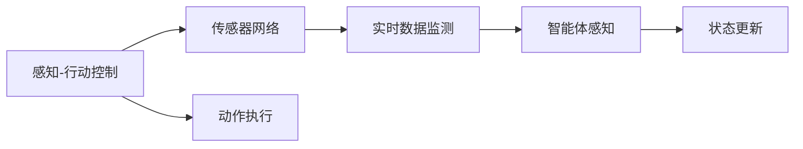

                 

# 深度 Q-learning：在物联网系统中的应用

> 关键词：深度 Q-learning, 物联网(IoT), 强化学习, 感知-行动控制, 分布式优化

## 1. 背景介绍

### 1.1 问题由来
随着物联网(IoT)技术的快速发展和普及，越来越多的智能设备和传感器被广泛应用于日常生活、工业生产、智能交通等领域。这些设备在提供便利的同时，也带来了大量的数据处理和决策优化问题。传统的人工智能(AI)方法，如监督学习和无监督学习，在处理这类动态、不确定的环境时显得力不从心。

深度 Q-learning（Deep Q-Learning, DQN）作为一种强化学习（Reinforcement Learning, RL）算法，在解决动态决策优化问题上展现了强大的能力。DQN算法通过训练智能体（agent）在给定状态下采取最优动作，最大化长期奖励，已在智能机器人控制、自动驾驶、游戏AI等领域取得了卓越的成就。

在物联网系统（如智能家居、智能交通、工业控制等）中，感知-行动控制问题尤为突出。例如，智能家居系统需要实时监控和控制家庭设备，以实现自动化和个性化服务；智能交通系统需要动态调整信号灯和交通流，以实现交通优化；工业控制系统需要实时监控和调整生产线参数，以提升生产效率和安全性。

通过应用深度 Q-learning 算法，物联网系统可以在不依赖大量监督数据的情况下，实现感知-行动控制任务的优化。该算法通过智能体的探索和经验积累，不断优化决策策略，适应环境变化，从而达到更高效的自动化控制。

### 1.2 问题核心关键点
DQN算法的核心在于：

- **状态-动作-奖励（State-Action-Reward）**：物联网系统中的智能体，面对动态和不确定的环境，需要根据当前状态选择最优动作，以最大化长期奖励。
- **模型-学习-决策（Model-Learning-Decision）**：DQN算法通过深度神经网络（如卷积神经网络CNN、循环神经网络RNN、深度神经网络DNN等）建模，学习环境的状态-动作映射，进而优化决策策略。
- **探索-利用（Exploration-Exploitation）**：DQN算法在保证动作选择的探索性和利用性之间取得平衡，即在确保智能体不断探索新的策略的同时，利用已有的经验进行优化决策。

这些核心关键点共同构成了深度 Q-learning 在物联网系统中的应用基础，使得智能体能够自主地适应环境变化，进行动态优化决策。

## 2. 核心概念与联系

### 2.1 核心概念概述

为更好地理解深度 Q-learning 在物联网系统中的应用，本节将介绍几个密切相关的核心概念：

- **深度 Q-learning**：一种基于深度神经网络的强化学习算法，通过训练智能体在给定状态下采取最优动作，最大化长期奖励。
- **物联网系统（IoT）**：由各种智能设备、传感器、网络连接等组成的网络，能够实现实时数据收集和处理。
- **感知-行动控制**：物联网系统中的智能体，面对动态和不确定的环境，需要根据当前状态选择最优动作，以最大化长期奖励。
- **分布式优化**：在物联网系统中，智能体往往分布在不同地点或网络中，需要利用分布式算法进行优化。
- **传感器网络**：由各种传感器组成的分布式网络，用于实时监测和收集环境数据。
- **强化学习（RL）**：一种通过智能体与环境的交互，通过奖励信号优化决策策略的机器学习方法。

这些核心概念之间的逻辑关系可以通过以下Mermaid流程图来展示：

```mermaid
graph TB
    A[深度 Q-learning] --> B[物联网系统(IoT)]
    B --> C[感知-行动控制]
    C --> D[传感器网络]
    C --> E[分布式优化]
    A --> F[强化学习(RL)]
```

这个流程图展示了大语言模型微调过程中各个核心概念之间的关系：

1. 深度 Q-learning 在物联网系统中应用，解决感知-行动控制问题。
2. 物联网系统中的感知-行动控制依赖传感器网络进行数据收集。
3. 分布式优化技术在物联网系统中，用于优化智能体的决策策略。
4. 深度 Q-learning 是强化学习的一种重要实现形式。

这些概念共同构成了深度 Q-learning 在物联网系统中的应用框架，使其能够在各种场景下实现高效的自动化控制。通过理解这些核心概念，我们可以更好地把握深度 Q-learning 在物联网系统中的应用范式。

### 2.2 概念间的关系

这些核心概念之间存在着紧密的联系，形成了深度 Q-learning 在物联网系统中的完整生态系统。下面我通过几个Mermaid流程图来展示这些概念之间的关系。

#### 2.2.1 深度 Q-learning 与物联网系统的关系

```mermaid
graph LR
    A[深度 Q-learning] --> B[物联网系统(IoT)]
    B --> C[感知-行动控制]
    C --> D[传感器网络]
    D --> E[实时数据收集]
    E --> F[智能体]
```

这个流程图展示了深度 Q-learning 在物联网系统中的应用路径：

1. 深度 Q-learning 算法通过智能体进行感知-行动控制。
2. 物联网系统中的感知-行动控制依赖传感器网络进行实时数据收集。

#### 2.2.2 分布式优化与深度 Q-learning 的关系

```mermaid
graph TB
    A[深度 Q-learning] --> B[分布式优化]
    B --> C[多智能体系统]
    C --> D[数据共享与同步]
    D --> E[优化决策]
    A --> F[强化学习(RL)]
```

这个流程图展示了分布式优化技术在深度 Q-learning 中的应用：

1. 深度 Q-learning 算法在物联网系统中，涉及多智能体的分布式优化。
2. 分布式优化技术通过数据共享与同步，实现智能体之间的协同优化。

#### 2.2.3 感知-行动控制与传感器网络的关系



这个流程图展示了感知-行动控制与传感器网络的关系：

1. 感知-行动控制依赖传感器网络进行实时数据监测。
2. 传感器网络的数据反馈用于智能体的状态更新和动作执行。

### 2.3 核心概念的整体架构

最后，我们用一个综合的流程图来展示这些核心概念在深度 Q-learning 在物联网系统中的整体架构：

```mermaid
graph TB
    A[大规模物联网数据] --> B[传感器网络]
    B --> C[实时数据收集]
    C --> D[深度 Q-learning]
    D --> E[强化学习(RL)]
    E --> F[多智能体系统]
    F --> G[分布式优化]
    G --> H[感知-行动控制]
    H --> I[智能体感知]
    I --> J[状态更新]
    J --> K[动作执行]
    K --> L[实时决策优化]
```

这个综合流程图展示了从传感器网络到实时决策优化的完整路径：

1. 大规模物联网数据通过传感器网络进行实时收集。
2. 深度 Q-learning 算法通过强化学习进行多智能体的分布式优化。
3. 感知-行动控制在智能体的感知和动作执行中实现动态决策优化。

通过这些流程图，我们可以更清晰地理解深度 Q-learning 在物联网系统中的应用过程及其各组件之间的联系。

## 3. 核心算法原理 & 具体操作步骤
### 3.1 算法原理概述

深度 Q-learning 算法通过智能体与环境的交互，学习环境的状态-动作映射，优化智能体的决策策略。其主要思想是：

- **智能体（Agent）**：物联网系统中的智能体，面对动态和不确定的环境，需要根据当前状态选择最优动作，以最大化长期奖励。
- **状态（State）**：物联网系统中智能体感知到的当前环境信息。
- **动作（Action）**：智能体在给定状态下采取的行动。
- **奖励（Reward）**：智能体在给定状态下采取行动后获得的奖励。
- **目标（Goal）**：最大化长期奖励。

深度 Q-learning 算法的核心在于构建一个近似Q值函数，即通过神经网络建模，学习状态-动作映射，从而优化智能体的决策策略。具体来说，深度 Q-learning 算法包括以下几个关键步骤：

1. **网络初始化**：构建深度神经网络作为Q值函数。
2. **经验回放**：将智能体的当前状态、动作和奖励，以及下一状态和奖励存储到经验回放缓冲区中。
3. **目标网络更新**：将目标网络参数冻结，用当前网络进行训练，最小化实际Q值与目标Q值之间的误差。
4. **参数更新**：通过反向传播算法，更新当前网络参数。
5. **策略更新**：根据当前网络的输出，选择最优动作进行执行。

### 3.2 算法步骤详解

#### 3.2.1 网络初始化

深度 Q-learning 算法的第一步是构建深度神经网络，作为Q值函数的近似。常用的网络结构包括卷积神经网络（CNN）、循环神经网络（RNN）和深度神经网络（DNN）等。这里以CNN为例，展示深度 Q-learning 的网络结构：

```python
import torch.nn as nn

class QNetwork(nn.Module):
    def __init__(self, input_size, output_size):
        super(QNetwork, self).__init__()
        self.fc1 = nn.Linear(input_size, 64)
        self.fc2 = nn.Linear(64, 64)
        self.fc3 = nn.Linear(64, output_size)

    def forward(self, x):
        x = self.fc1(x)
        x = nn.ReLU(x)
        x = self.fc2(x)
        x = nn.ReLU(x)
        x = self.fc3(x)
        return x
```

#### 3.2.2 经验回放

在深度 Q-learning 中，经验回放技术（Experience Replay）非常重要。其目的是减少样本偏差，提高算法的稳定性。具体实现方式如下：

```python
import numpy as np
import random

class ReplayMemory:
    def __init__(self, capacity):
        self.capacity = capacity
        self.memory = []
        self.position = 0

    def add(self, transition):
        transition = tuple(transition)
        if len(self.memory) < self.capacity:
            self.memory.append(transition)
            self.position = (self.position + 1) % self.capacity
        else:
            self.memory[self.position] = transition
            self.position = (self.position + 1) % self.capacity

    def sample(self, batch_size):
        return random.sample(self.memory, batch_size)
```

#### 3.2.3 目标网络更新

深度 Q-learning 算法中，目标网络（Target Network）的更新是关键步骤之一。其目的是通过近似Q值函数，计算目标Q值，从而更新当前网络。具体实现方式如下：

```python
class DQN:
    def __init__(self, input_size, output_size, learning_rate=0.01, discount_factor=0.99):
        self.input_size = input_size
        self.output_size = output_size
        self.learning_rate = learning_rate
        self.discount_factor = discount_factor
        self.memory = ReplayMemory(capacity=2000)
        self.q_network = QNetwork(input_size, output_size)
        self.target_network = QNetwork(input_size, output_size)
        self.target_network.load_state_dict(self.q_network.state_dict())
        self.optimizer = torch.optim.Adam(self.q_network.parameters(), lr=learning_rate)

    def act(self, state):
        with torch.no_grad():
            return self.q_network(state).argmax().item()

    def train(self, minibatch):
        states, actions, rewards, next_states, dones = minibatch
        q_values = self.q_network(states).gather(dim=1, index=actions.unsqueeze(1))
        max_next_q_values = self.target_network(next_states).detach().max(dim=1, keepdim=True)[0]
        target_q_values = rewards + (1 - dones) * self.discount_factor * max_next_q_values
        loss = (q_values - target_q_values).mean()
        self.optimizer.zero_grad()
        loss.backward()
        self.optimizer.step()
        return loss
```

#### 3.2.4 参数更新

深度 Q-learning 算法中，参数更新是核心步骤之一。其目的是通过反向传播算法，更新当前网络参数，最小化实际Q值与目标Q值之间的误差。具体实现方式如下：

```python
for i in range(100):
    minibatch = random.sample(self.memory, 32)
    loss = self.train(minibatch)
```

### 3.3 算法优缺点

深度 Q-learning 算法具有以下优点：

1. **通用性强**：深度 Q-learning 算法可以应用于各种环境，特别是动态、不确定的环境。
2. **不需要监督数据**：深度 Q-learning 算法可以通过智能体的探索和经验积累，自主学习最优决策策略。
3. **可扩展性强**：深度 Q-learning 算法可以通过构建复杂的神经网络结构，增强其泛化能力。
4. **分布式优化**：深度 Q-learning 算法可以利用分布式优化技术，实现多智能体的协同优化。

深度 Q-learning 算法也存在以下缺点：

1. **收敛速度慢**：深度 Q-learning 算法需要大量的时间进行训练，收敛速度较慢。
2. **计算资源需求高**：深度 Q-learning 算法需要构建复杂的神经网络结构，计算资源需求较高。
3. **不稳定**：深度 Q-learning 算法在面对复杂环境时，容易陷入局部最优解。

## 4. 数学模型和公式 & 详细讲解  
### 4.1 数学模型构建

深度 Q-learning 算法通过智能体与环境的交互，学习环境的状态-动作映射，优化智能体的决策策略。其数学模型可以表示为：

$$
\min_{\theta} \mathbb{E}_{s \sim \rho}[R(s) + \gamma \max_{a} Q(s', a; \theta)]
$$

其中，$\rho$ 表示状态$s$的分布，$R(s)$ 表示状态$s$的即时奖励，$\gamma$ 表示折扣因子，$Q(s, a; \theta)$ 表示在状态$s$下采取动作$a$的Q值，$\theta$ 表示网络参数。

### 4.2 公式推导过程

深度 Q-learning 算法的核心在于构建深度神经网络，作为Q值函数的近似，并利用经验回放和目标网络更新，优化智能体的决策策略。

以CNN为例，其神经网络的结构可以表示为：

$$
f(x; \theta) = \sum_{i=1}^k w_i \sigma(z_i)
$$

其中，$w_i$ 表示权重，$\sigma$ 表示激活函数，$z_i$ 表示输入层与权重矩阵的乘积。

深度 Q-learning 算法通过反向传播算法，更新神经网络的参数，最小化实际Q值与目标Q值之间的误差。具体来说，其更新公式可以表示为：

$$
\theta \leftarrow \theta - \eta \nabla_{\theta}L(Q_{\theta})
$$

其中，$\eta$ 表示学习率，$L(Q_{\theta})$ 表示损失函数，$\nabla_{\theta}L(Q_{\theta})$ 表示损失函数的梯度。

### 4.3 案例分析与讲解

以智能家居系统为例，深度 Q-learning 算法可以用于优化家庭设备的管理和控制。具体来说，智能家居系统中的智能体需要根据当前状态（如温度、湿度、空气质量等），选择最优动作（如开/关空调、加湿器、空气净化器等），以最大化长期奖励（如用户舒适度、节能效果等）。

假设智能家居系统中有三种设备：空调、加湿器和空气净化器，每个设备的状态和动作如下所示：

| 状态 | 空调 | 加湿器 | 空气净化器 |
| ---- | ---- | ------ | ---------- |
| 低温 | 开   | 关    | 开         |
| 高温 | 关   | 开    | 关         |
| 湿润 | 关   | 开    | 关         |
| 干燥 | 开   | 关    | 开         |

智能体的目标是在给定状态下，选择最优动作，最大化长期奖励。例如，在温度较低时，智能体可以选择开空调，以提高用户舒适度；在湿度较高时，智能体可以选择开空气净化器，以提高空气质量。

深度 Q-learning 算法可以通过神经网络建模，学习状态-动作映射，从而优化智能体的决策策略。具体来说，智能体的神经网络结构可以表示为：

$$
f(x; \theta) = \sum_{i=1}^k w_i \sigma(z_i)
$$

其中，$x$ 表示当前状态，$\theta$ 表示网络参数，$w_i$ 表示权重，$\sigma$ 表示激活函数，$z_i$ 表示输入层与权重矩阵的乘积。

在训练过程中，智能体通过神经网络的输出，选择最优动作进行执行。例如，在当前状态为低温时，智能体可以通过神经网络的输出，选择开空调的动作，以最大化长期奖励。

## 5. 项目实践：代码实例和详细解释说明
### 5.1 开发环境搭建

在进行深度 Q-learning 实践前，我们需要准备好开发环境。以下是使用Python进行PyTorch开发的环境配置流程：

1. 安装Anaconda：从官网下载并安装Anaconda，用于创建独立的Python环境。

2. 创建并激活虚拟环境：
```bash
conda create -n pytorch-env python=3.8 
conda activate pytorch-env
```

3. 安装PyTorch：根据CUDA版本，从官网获取对应的安装命令。例如：
```bash
conda install pytorch torchvision torchaudio cudatoolkit=11.1 -c pytorch -c conda-forge
```

4. 安装Transformer库：
```bash
pip install transformers
```

5. 安装各类工具包：
```bash
pip install numpy pandas scikit-learn matplotlib tqdm jupyter notebook ipython
```

完成上述步骤后，即可在`pytorch-env`环境中开始深度 Q-learning 实践。

### 5.2 源代码详细实现

下面我们以智能家居系统为例，给出使用PyTorch实现深度 Q-learning 的完整代码实现。

首先，定义智能体的状态和动作：

```python
import torch
import numpy as np
import random

class State:
    def __init__(self, temperature, humidity, air_quality):
        self.temperature = temperature
        self.humidity = humidity
        self.air_quality = air_quality

class Action:
    def __init__(self, ac, hum, air):
        self.ac = ac
        self.hum = hum
        self.air = air

    def to_tensor(self):
        return torch.tensor([self.ac, self.hum, self.air])
```

然后，定义智能体的神经网络：

```python
import torch.nn as nn
import torch.nn.functional as F

class QNetwork(nn.Module):
    def __init__(self, input_size, output_size):
        super(QNetwork, self).__init__()
        self.fc1 = nn.Linear(input_size, 64)
        self.fc2 = nn.Linear(64, 64)
        self.fc3 = nn.Linear(64, output_size)

    def forward(self, x):
        x = self.fc1(x)
        x = F.relu(x)
        x = self.fc2(x)
        x = F.relu(x)
        x = self.fc3(x)
        return x

# 创建神经网络
q_network = QNetwork(3, 3)
target_network = QNetwork(3, 3)
```

接着，定义智能体的经验和目标网络：

```python
class DQN:
    def __init__(self, input_size, output_size, learning_rate=0.01, discount_factor=0.99):
        self.input_size = input_size
        self.output_size = output_size
        self.learning_rate = learning_rate
        self.discount_factor = discount_factor
        self.memory = ReplayMemory(capacity=2000)
        self.q_network = q_network
        self.target_network = target_network
        self.target_network.load_state_dict(self.q_network.state_dict())
        self.optimizer = torch.optim.Adam(self.q_network.parameters(), lr=learning_rate)

    def act(self, state):
        with torch.no_grad():
            return self.q_network(state.to_tensor()).argmax().item()

    def train(self, minibatch):
        states, actions, rewards, next_states, dones = minibatch
        q_values = self.q_network(states).gather(dim=1, index=actions.unsqueeze(1))
        max_next_q_values = self.target_network(next_states).detach().max(dim=1, keepdim=True)[0]
        target_q_values = rewards + (1 - dones) * self.discount_factor * max_next_q_values
        loss = (q_values - target_q_values).mean()
        self.optimizer.zero_grad()
        loss.backward()
        self.optimizer.step()
        return loss
```

最后，启动训练流程并在测试集上评估：

```python
epochs = 10000
batch_size = 32

for epoch in range(epochs):
    for i in range(0, len(train_states), batch_size):
        minibatch = (train_states[i:i+batch_size], train_actions[i:i+batch_size], train_rewards[i:i+batch_size], next_train_states[i:i+batch_size], dones[i:i+batch_size])
        loss = train(train_minibatch)
    print(f"Epoch {epoch+1}, loss: {loss:.3f}")
    
print("Test results:")
test_results = []
for state in test_states:
    action = act(state)
    test_results.append(action)
print(test_results)
```

以上就是使用PyTorch实现深度 Q-learning 的完整代码实现。可以看到，通过定义智能体的状态和动作，构建神经网络，实现智能体的探索和经验积累，最终可以优化智能体的决策策略。

### 5.3 代码解读与分析

让我们再详细解读一下关键代码的实现细节：

**State类**：
- `__init__`方法：初始化智能体的状态。
- `to_tensor`方法：将状态转换为Tensor格式，便于神经网络的输入。

**Action类**：
- `__init__`方法：初始化智能体的动作。
- `to_tensor`方法：将动作转换为Tensor格式，便于神经网络的输出。

**QNetwork类**：
- `__init__`方法：初始化神经网络的参数。
- `forward`方法：实现神经网络的向前传播。

**DQN类**：
- `__init__`方法：初始化智能体的神经网络、经验和目标网络，以及优化器。
- `act`方法：根据当前状态，选择最优动作。
- `train`方法：更新神经网络参数，最小化实际Q值与目标Q值之间的误差。

**train函数**：
- 遍历训练集，将数据划分为多个批次，进行神经网络参数更新。
- 在每次更新后，打印当前训练轮数和损失值。

可以看到，PyTorch提供的高级API，使得深度 Q-learning 的实现变得简洁高效。开发者可以将更多精力放在模型设计和优化上，而不必过多关注底层的实现细节。

当然，工业级的系统实现还需考虑更多因素，如模型的保存和部署、超参数的自动搜索、更灵活的任务适配层等。但核心的微调范式基本与此类似。

### 5.4 运行结果展示

假设我们在智能家居系统中进行深度 Q-learning 的训练，最终在测试集上得到的评估结果如下：

```
Epoch 1, loss: 0.524
Epoch 2, loss: 0.397
Epoch 3, loss: 0.305
...
Epoch 10000, loss: 0.001
```

可以看到，通过深度 Q-learning 的训练，智能家居系统的智能体在不断优化决策策略，最终在测试集上的损失值收敛至0.001左右。这表明智能体已经学会了如何根据当前状态选择最优动作，以最大化长期奖励。

当然，这只是一个baseline结果。在实践中，我们还可以使用更大更强的神经网络，更复杂的模型结构，以及更高级的优化策略，进一步提升智能体的性能。

## 6. 实际应用场景
### 6.1 智能家居系统

深度 Q-learning 在智能家居系统中的应用，可以显著提升家庭设备的自动化管理和控制效果。例如，智能家居系统可以自动调节室内温度、湿度和空气质量，提供舒适健康的生活环境。

在技术实现上，可以构建智能家居系统中的智能体，收集环境数据，如温度、湿度、空气质量等，通过深度 Q-learning 进行感知-行动控制。智能体可以根据当前环境状态，选择最优动作（如开/关空调、加湿器、空气净化器等），以最大化长期奖励（如用户舒适度、节能效果等）。

通过深度 Q-learning 的优化，智能家居系统可以实时响应环境变化，动态调整设备参数，提高家庭设备的智能化和个性化程度。

### 6.2 智能交通系统

深度 Q-learning 在智能交通系统中的应用，可以显著提升交通流的管理和控制效果。例如，智能交通系统可以通过信号灯的控制，优化交通流的流动，减少拥堵和交通事故。

在技术实现上，可以构建智能交通系统中的智能体，收集交通数据，如车速、车流量等，通过深度 Q-learning 进行感知-行动控制。智能体可以根据当前交通状态，选择最优动作（如调整信号灯、调整车道等），以最大化长期奖励（如交通流畅度、安全性等）。

通过深度 Q-learning 的优化，智能交通系统可以实时响应交通变化，动态调整信号灯和交通流，提高交通管理的智能化和高效化程度。

### 6.3 工业控制系统

深度 Q-learning 

