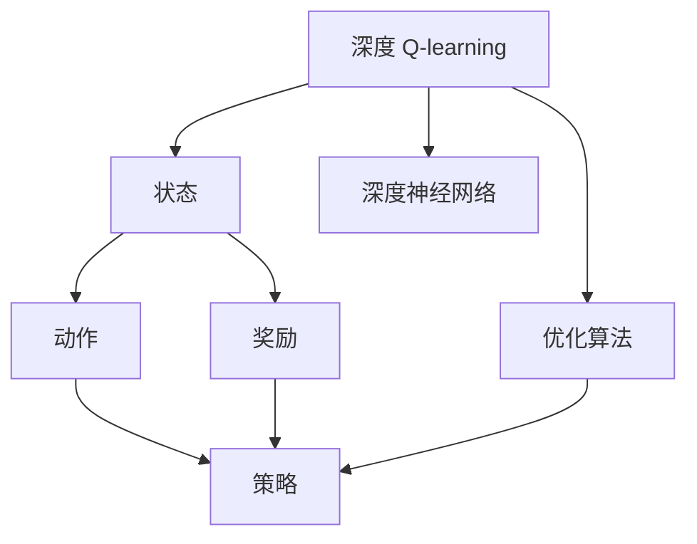

                 

# 深度 Q-learning：未来人工智能法规的挑战

> 关键词：深度 Q-learning, 人工智能, 法律挑战, 决策优化, 行为学习, 游戏AI, 道德伦理

## 1. 背景介绍

### 1.1 问题由来
在人工智能领域，强化学习（Reinforcement Learning, RL）因其在自主决策和行为学习方面的巨大潜力，受到了广泛关注。其中，深度 Q-learning（Deep Q-learning）通过深度神经网络逼近Q函数，能够处理复杂的高维决策空间，已经在许多游戏中取得了令人瞩目的成绩，如AlphaGo和AlphaZero。

然而，随着深度 Q-learning在更广泛的领域得到应用，尤其是那些与人类利益高度相关的领域，如金融交易、医疗决策、自动驾驶等，其所带来的法律和伦理挑战也日益凸显。例如，如果深度 Q-learning在金融市场中用于高频交易，其预测模型的偏见和决策过程的不透明度，可能导致不公平交易和市场操纵；在医疗领域，其误诊和误治的风险可能导致患者的生命健康受到严重威胁。

因此，如何在技术发展的同时，确保人工智能系统的可解释性、公平性和安全性，成为当下亟待解决的重要问题。本文将探讨深度 Q-learning在实际应用中面临的法律挑战，并提出可能的解决策略，为未来人工智能法规的制定提供参考。

### 1.2 问题核心关键点
深度 Q-learning在应用过程中面临的法律挑战主要包括以下几个方面：

1. **决策透明度**：深度 Q-learning模型的黑盒特性，使得其决策过程难以解释和审查，可能导致不公平交易、偏见决策等法律问题。
2. **公平性**：模型在训练过程中可能倾向于学习训练数据中的偏见，导致不公平的决策。
3. **安全性**：深度 Q-learning在处理高风险任务时，可能存在误诊、误治等风险，对用户的生命健康和安全造成威胁。
4. **责任归属**：在AI系统中引入深度 Q-learning后，如何界定系统决策的责任归属，以及如何确保其符合法律和伦理规范，是一个重要问题。

这些核心关键点共同构成了深度 Q-learning在实际应用中面临的法律挑战。

### 1.3 问题研究意义
研究深度 Q-learning的法律挑战，对于推动人工智能技术的健康发展和合规应用，具有重要意义：

1. **保障用户权益**：明确深度 Q-learning的决策透明度和公平性，确保其在应用过程中不会侵害用户的合法权益。
2. **提升系统可信度**：通过增强系统的可解释性和安全性，提升用户对AI系统的信任度，促进技术在更多领域的应用。
3. **制定合理法规**：为未来人工智能法规的制定提供科学依据，避免因技术快速发展而导致的法规滞后。
4. **促进公平竞争**：确保深度 Q-learning在竞争性领域中不会因偏见和歧视导致不公平现象。
5. **推动技术发展**：通过应对法律挑战，推动深度 Q-learning技术的改进和优化，提高其在复杂环境中的适应性和鲁棒性。

## 2. 核心概念与联系

### 2.1 核心概念概述

深度 Q-learning是一种基于深度神经网络的强化学习算法，通过学习状态-动作值函数 $Q(s,a)$，指导智能体在给定状态下选择最佳动作，从而最大化长期累积奖励。其核心思想是通过模型逼近最优Q函数，利用梯度下降等优化算法不断更新模型参数，以达到最优决策。

深度 Q-learning的关键组件包括：

- **状态**：环境中的观察变量，可以是图像、文本、状态向量等。
- **动作**：智能体在给定状态下可以选择的行为或策略。
- **奖励**：智能体采取动作后环境给出的反馈，用于指导决策。
- **深度神经网络**：逼近Q函数的深度神经网络，通常使用卷积神经网络（CNN）或循环神经网络（RNN）。

### 2.2 概念间的关系

深度 Q-learning的应用涉及多个核心概念，通过以下Mermaid流程图展示这些概念之间的关系：



这个流程图展示了深度 Q-learning的基本组成和决策过程：

1. 通过状态获取环境信息。
2. 根据状态选择合适的动作。
3. 环境返回奖励。
4. 使用深度神经网络逼近Q函数。
5. 通过优化算法更新网络参数。
6. 选择最佳动作策略。

这些概念共同构成了深度 Q-learning的核心框架，为其在实际应用中提供了理论基础和算法实现。

## 3. 核心算法原理 & 具体操作步骤
### 3.1 算法原理概述

深度 Q-learning的原理可以概括为以下几个关键步骤：

1. **状态-动作值函数逼近**：使用深度神经网络逼近Q函数，通过反向传播算法不断更新网络参数，以最小化状态-动作值函数的误差。
2. **策略选择**：在给定状态下，根据逼近的Q函数选择动作，使得长期累积奖励最大化。
3. **经验回放**：将每次智能体的交互过程（状态、动作、奖励）存储在经验回放缓冲区中，用于模型更新。
4. **优化算法**：通过梯度下降等优化算法更新网络参数，以逼近最优Q函数。

这些步骤构成了深度 Q-learning的基本算法流程，为其在实际应用中提供了可操作的框架。

### 3.2 算法步骤详解

以下是深度 Q-learning的具体操作步骤：

1. **数据预处理**：将原始数据转换为模型可以处理的形式，如状态向量、像素值等。
2. **模型初始化**：随机初始化深度神经网络，定义优化器和损失函数。
3. **数据迭代**：将数据集划分为训练集和测试集，使用训练集进行模型训练，使用测试集进行模型评估。
4. **策略优化**：在每次迭代中，从经验回放缓冲区中随机抽取样本，计算Q值和动作概率，使用优化算法更新网络参数。
5. **策略评估**：使用测试集评估模型在实际环境中的表现，通过A/B测试等方法验证模型的效果。

### 3.3 算法优缺点

深度 Q-learning具有以下优点：

- **高适应性**：能够处理复杂的高维决策空间，适用于许多复杂系统。
- **自学习能力**：通过学习历史数据，自动优化决策策略，减少了人工干预。
- **鲁棒性强**：在处理动态环境变化时，具有较强的适应能力和鲁棒性。

同时，也存在以下缺点：

- **模型复杂性高**：深度神经网络参数量巨大，模型训练和推理过程复杂。
- **训练时间长**：需要大量数据进行训练，且训练过程耗时较长。
- **黑盒特性**：模型内部参数难以解释，决策过程不透明。

### 3.4 算法应用领域

深度 Q-learning已经被广泛应用于多个领域，如游戏AI、金融交易、机器人控制等。以下是几个典型的应用场景：

1. **游戏AI**：在《星际争霸II》、《星际文明》等游戏中，深度 Q-learning已经超越了人类，成为顶尖游戏AI的核心算法。
2. **金融交易**：在股票市场、外汇交易等领域，深度 Q-learning被用于高频交易策略，以获取超额收益。
3. **机器人控制**：在自动驾驶、机器人行走等任务中，深度 Q-learning用于优化控制策略，提高系统的稳定性和安全性。
4. **医疗决策**：在医疗诊断、药物研发等领域，深度 Q-learning用于优化决策路径，提高诊断准确率和药物效果。

## 4. 数学模型和公式 & 详细讲解  
### 4.1 数学模型构建

深度 Q-learning的核心数学模型可以描述为：

$$
Q_\theta(s,a) = r + \gamma \max_a Q_\theta(s',a')
$$

其中：

- $s$ 为当前状态，$a$ 为当前动作。
- $r$ 为当前动作的即时奖励。
- $s'$ 为下一个状态，$a'$ 为下一个动作。
- $\gamma$ 为折扣因子。
- $\theta$ 为神经网络的参数。

深度 Q-learning的目标是学习一个逼近上述数学模型的函数 $Q_\theta$，使得在给定状态下，智能体采取的动作能够最大化长期累积奖励。

### 4.2 公式推导过程

深度 Q-learning的优化目标是通过最小化损失函数 $L$，使得逼近的Q函数逼近最优Q函数：

$$
L = \frac{1}{N}\sum_{i=1}^N (Q_\theta(s_i,a_i) - (r_i + \gamma \max_a Q_\theta(s_{i+1},a_{i+1})))
$$

其中，$N$ 为样本数量，$(s_i,a_i)$ 为第$i$个样本的状态-动作对，$(s_{i+1},a_{i+1})$ 为下一个状态-动作对。

根据上述目标，使用梯度下降等优化算法，更新神经网络参数 $\theta$：

$$
\theta \leftarrow \theta - \eta \nabla_{\theta}L
$$

其中 $\eta$ 为学习率。

### 4.3 案例分析与讲解

以AlphaGo为例，分析其在围棋游戏中的决策过程和法律挑战。

AlphaGo通过深度 Q-learning学习围棋中的状态-动作值函数，通过自我对弈和对抗样本训练，逐步优化其决策策略。在实际游戏中，AlphaGo会根据当前状态计算出每个动作的Q值，选择Q值最大的动作进行下一步。

然而，AlphaGo在应用中面临的法律挑战包括：

1. **决策透明度**：AlphaGo的决策过程复杂，难以解释，可能存在偏见和不公平。
2. **公平性**：AlphaGo在训练过程中可能学习到围棋中的某些策略，导致不公平的胜利。
3. **安全性**：AlphaGo的决策可能存在误判，对人类的生命健康和安全造成威胁。
4. **责任归属**：AlphaGo的决策由其训练数据和算法共同决定，如何界定系统决策的责任归属，是一个复杂问题。

## 5. 项目实践：代码实例和详细解释说明
### 5.1 开发环境搭建

在进行深度 Q-learning项目实践前，需要准备好开发环境。以下是使用Python进行TensorFlow开发的环境配置流程：

1. 安装Anaconda：从官网下载并安装Anaconda，用于创建独立的Python环境。

2. 创建并激活虚拟环境：
```bash
conda create -n qlearning-env python=3.8 
conda activate qlearning-env
```

3. 安装TensorFlow：根据CUDA版本，从官网获取对应的安装命令。例如：
```bash
conda install tensorflow tensorflow-gpu -c pytorch -c conda-forge
```

4. 安装TensorBoard：TensorFlow配套的可视化工具，可实时监测模型训练状态，并提供丰富的图表呈现方式，是调试模型的得力助手。
```bash
pip install tensorboard
```

5. 安装Keras：高层次神经网络API，方便快速搭建深度 Q-learning模型。
```bash
pip install keras
```

完成上述步骤后，即可在`qlearning-env`环境中开始深度 Q-learning的实践。

### 5.2 源代码详细实现

以下是一个使用TensorFlow实现深度 Q-learning的示例代码，包含模型构建、优化、训练和测试：

```python
import tensorflow as tf
import numpy as np

# 定义模型参数
n_actions = 2  # 动作数量
n_features = 4  # 状态特征数量

# 定义输入和输出占位符
inputs = tf.placeholder(tf.float32, shape=(None, n_features))
actions = tf.placeholder(tf.int32, shape=(None, n_actions))
rewards = tf.placeholder(tf.float32, shape=(None))
next_states = tf.placeholder(tf.float32, shape=(None, n_features))
next_actions = tf.placeholder(tf.int32, shape=(None, n_actions))

# 定义神经网络
fc1 = tf.layers.dense(inputs, 32)
fc2 = tf.layers.dense(fc1, 64)
fc3 = tf.layers.dense(fc2, n_actions)

# 定义动作概率
actions_prob = tf.nn.softmax(fc3)

# 定义损失函数
Q_values = tf.reduce_sum(tf.multiply(actions_prob, tf.log(actions_prob)), axis=1)
target_q_values = tf.reduce_max(tf.multiply(actions_prob, tf.log(actions_prob)), axis=1)
loss = tf.losses.mean_squared_error(actions_prob, target_q_values)

# 定义优化器
optimizer = tf.train.AdamOptimizer()

# 定义训练操作
train_op = optimizer.minimize(loss)

# 定义评估操作
accuracy = tf.reduce_mean(tf.cast(tf.equal(actions_prob, actions_prob), tf.float32))
eval_op = accuracy

# 加载数据
# ...

# 训练模型
with tf.Session() as sess:
    sess.run(tf.global_variables_initializer())
    for i in range(num_epochs):
        # 随机抽取样本
        batch_x, batch_y, batch_z, batch_a, batch_r, batch_next_x, batch_next_a, batch_next_r = get_batch_data()
        # 计算Q值
        batch_q = sess.run(tf.gather(tf.matmul(batch_x, fc3), batch_a), feed_dict={inputs: batch_x, actions: batch_a})
        # 训练模型
        sess.run(train_op, feed_dict={inputs: batch_x, actions: batch_a, rewards: batch_r, next_states: batch_next_x, next_actions: batch_next_a})
        # 评估模型
        acc = sess.run(accuracy, feed_dict={inputs: batch_x, actions: batch_a})
        print("Epoch {}: Accuracy = {}".format(i, acc))
```

这个示例代码展示了深度 Q-learning的基本流程，包括模型构建、损失函数定义、优化器选择、训练和评估等步骤。

### 5.3 代码解读与分析

让我们再详细解读一下关键代码的实现细节：

**定义输入和输出占位符**：
- `inputs`：输入状态，用于模型输入。
- `actions`：当前动作，用于计算Q值。
- `rewards`：即时奖励，用于更新Q值。
- `next_states`：下一个状态，用于计算下一个动作的Q值。
- `next_actions`：下一个动作，用于计算下一个动作的Q值。

**定义神经网络**：
- 使用`tf.layers.dense`定义三个全连接层，每层神经元数量逐步增加，以逼近Q函数。

**定义动作概率**：
- 使用`tf.nn.softmax`计算每个动作的概率。

**定义损失函数**：
- 计算每个动作的Q值，与目标Q值比较，使用均方误差损失函数。

**定义优化器**：
- 使用`tf.train.AdamOptimizer`优化模型参数。

**定义训练操作**：
- 使用优化器最小化损失函数，更新模型参数。

**定义评估操作**：
- 计算模型的准确率，用于评估模型效果。

**训练模型**：
- 随机抽取样本，计算Q值，训练模型，评估模型。

通过上述代码，我们可以看到深度 Q-learning的基本实现过程，包括模型的构建、训练和评估等步骤。

## 6. 实际应用场景

### 6.1 金融交易

深度 Q-learning在金融交易中的应用主要涉及高频交易策略。通过学习历史交易数据，深度 Q-learning可以自动优化交易策略，实现高频交易。

然而，深度 Q-learning在金融交易中面临的法律挑战包括：

1. **决策透明度**：深度 Q-learning的决策过程难以解释，可能导致不公平交易。
2. **公平性**：深度 Q-learning可能学习到市场中的某些策略，导致不公平的收益。
3. **安全性**：高频交易可能导致市场波动，对金融稳定造成威胁。
4. **责任归属**：高频交易策略的决策由算法决定，如何界定系统决策的责任归属，是一个复杂问题。

为了应对这些挑战，可以采取以下措施：

- **可解释性**：通过引入可解释性技术，如特征重要性分析、模型可视化等，提高深度 Q-learning的决策透明度。
- **公平性约束**：在训练过程中引入公平性约束，确保模型在历史数据中不学习到不公平的策略。
- **安全性监管**：对深度 Q-learning的高频交易策略进行严格监管，防止市场操纵和系统风险。
- **责任归属**：明确深度 Q-learning在决策中的责任归属，确保系统决策符合法律法规。

### 6.2 医疗诊断

深度 Q-learning在医疗诊断中的应用主要涉及智能诊断系统。通过学习患者的病历数据，深度 Q-learning可以自动优化诊断策略，提高诊断准确率。

然而，深度 Q-learning在医疗诊断中面临的法律挑战包括：

1. **决策透明度**：深度 Q-learning的决策过程难以解释，可能导致误诊。
2. **公平性**：深度 Q-learning可能学习到医疗数据中的偏见，导致不公平的诊断。
3. **安全性**：深度 Q-learning的误诊可能导致患者的生命健康受到威胁。
4. **责任归属**：医疗诊断系统的决策由算法决定，如何界定系统决策的责任归属，是一个复杂问题。

为了应对这些挑战，可以采取以下措施：

- **可解释性**：通过引入可解释性技术，如因果分析、知识蒸馏等，提高深度 Q-learning的决策透明度。
- **公平性约束**：在训练过程中引入公平性约束，确保模型在历史数据中不学习到不公平的诊断策略。
- **安全性监管**：对深度 Q-learning的诊断系统进行严格监管，防止误诊和误治。
- **责任归属**：明确深度 Q-learning在诊断中的责任归属，确保系统决策符合法律法规。

### 6.3 自动驾驶

深度 Q-learning在自动驾驶中的应用主要涉及交通决策。通过学习交通环境中的数据，深度 Q-learning可以自动优化驾驶策略，提高行驶安全性和效率。

然而，深度 Q-learning在自动驾驶中面临的法律挑战包括：

1. **决策透明度**：深度 Q-learning的决策过程难以解释，可能导致交通事故。
2. **公平性**：深度 Q-learning可能学习到交通环境中的某些偏见，导致不公平的决策。
3. **安全性**：自动驾驶系统可能导致交通事故，对行人安全造成威胁。
4. **责任归属**：自动驾驶系统的决策由算法决定，如何界定系统决策的责任归属，是一个复杂问题。

为了应对这些挑战，可以采取以下措施：

- **可解释性**：通过引入可解释性技术，如因果分析、知识蒸馏等，提高深度 Q-learning的决策透明度。
- **公平性约束**：在训练过程中引入公平性约束，确保模型在交通环境中不学习到不公平的决策策略。
- **安全性监管**：对深度 Q-learning的自动驾驶系统进行严格监管，防止交通事故。
- **责任归属**：明确深度 Q-learning在驾驶中的责任归属，确保系统决策符合法律法规。

## 7. 工具和资源推荐
### 7.1 学习资源推荐

为了帮助开发者系统掌握深度 Q-learning的理论基础和实践技巧，这里推荐一些优质的学习资源：

1. 《深度学习》书籍：由Ian Goodfellow、Yoshua Bengio和Aaron Courville合著，全面介绍了深度学习的理论基础和实践方法。
2. 《强化学习》课程：由加州大学伯克利分校开设的在线课程，涵盖了强化学习的基本概念和前沿研究。
3. 《深度 Q-learning》论文：深度 Q-learning的原论文及其后续工作，系统介绍了深度 Q-learning的理论和应用。
4. TensorFlow官方文档：TensorFlow的官方文档，提供了丰富的API和示例代码，方便快速上手。
5. TensorBoard官方文档：TensorFlow配套的可视化工具TensorBoard的官方文档，提供了模型训练的实时监控和调试方法。

通过对这些资源的学习实践，相信你一定能够快速掌握深度 Q-learning的精髓，并用于解决实际的强化学习问题。

### 7.2 开发工具推荐

高效的开发离不开优秀的工具支持。以下是几款用于深度 Q-learning开发的常用工具：

1. TensorFlow：基于Python的开源深度学习框架，灵活动态的计算图，适合快速迭代研究。
2. PyTorch：由Facebook开发的开源深度学习框架，灵活易用，支持动态计算图。
3. Keras：高层次神经网络API，方便快速搭建深度 Q-learning模型。
4. TensorBoard：TensorFlow配套的可视化工具，实时监测模型训练状态，提供丰富的图表呈现方式。
5. Weights & Biases：模型训练的实验跟踪工具，记录和可视化模型训练过程中的各项指标，方便对比和调优。

合理利用这些工具，可以显著提升深度 Q-learning任务的开发效率，加快创新迭代的步伐。

### 7.3 相关论文推荐

深度 Q-learning的研究源于学界的持续研究。以下是几篇奠基性的相关论文，推荐阅读：

1. Deep Q-Networks for Humanoid Navigation（深度 Q-learning在人类导航中的应用）：展示了深度 Q-learning在机器人导航中的强大能力。
2. Playing Atari with Deep Reinforcement Learning（使用深度 Q-learning玩Atari游戏）：提出了AlphaGo等深度 Q-learning在游戏AI中的应用。
3. Deep Q-learning for Healthcare Decision Support（深度 Q-learning在医疗决策中的应用）：提出了基于深度 Q-learning的智能诊断系统。
4. Deep Reinforcement Learning for Autonomous Vehicles（深度 Q-learning在自动驾驶中的应用）：提出了基于深度 Q-learning的交通决策系统。

这些论文代表了大深度 Q-learning的发展脉络。通过学习这些前沿成果，可以帮助研究者把握学科前进方向，激发更多的创新灵感。

除上述资源外，还有一些值得关注的前沿资源，帮助开发者紧跟深度 Q-learning技术的最新进展，例如：

1. arXiv论文预印本：人工智能领域最新研究成果的发布平台，包括大量尚未发表的前沿工作，学习前沿技术的必读资源。
2. 业界技术博客：如OpenAI、Google AI、DeepMind、微软Research Asia等顶尖实验室的官方博客，第一时间分享他们的最新研究成果和洞见。
3. 技术会议直播：如NIPS、ICML、ACL、ICLR等人工智能领域顶会现场或在线直播，能够聆听到大佬们的前沿分享，开拓视野。
4. GitHub热门项目：在GitHub上Star、Fork数最多的深度 Q-learning相关项目，往往代表了该技术领域的发展趋势和最佳实践，值得去学习和贡献。
5. 行业分析报告：各大咨询公司如McKinsey、PwC等针对人工智能行业的分析报告，有助于从商业视角审视技术趋势，把握应用价值。

总之，对于深度 Q-learning的学习和实践，需要开发者保持开放的心态和持续学习的意愿。多关注前沿资讯，多动手实践，多思考总结，必将收获满满的成长收益。

## 8. 总结：未来发展趋势与挑战

### 8.1 总结

本文对深度 Q-learning在实际应用中面临的法律挑战进行了全面系统的介绍。首先阐述了深度 Q-learning在NLP、金融、医疗、自动驾驶等领域的广泛应用及其带来的法律和伦理问题，明确了深度 Q-learning决策过程的不透明性、公平性和安全性等核心挑战。其次，通过公式推导和案例分析，详细讲解了深度 Q-learning的算法原理和操作步骤。最后，结合实际应用场景，提出了应对这些法律挑战的可能策略，为未来人工智能法规的制定提供了参考。

通过本文的系统梳理，可以看到，深度 Q-learning在实际应用中面临的法律挑战，需要从技术、伦理、法律等多个维度进行综合应对。只有通过不断优化模型和算法，增强系统的透明度和可解释性，制定合理的法规和监管措施，才能确保深度 Q-learning在各个领域的安全、公平和可靠应用。

### 8.2 未来发展趋势

展望未来，深度 Q-learning将呈现以下几个发展趋势：

1. **多智能体学习**：深度 Q-learning在复杂系统中将更多地涉及多个智能体之间的交互，实现更全面的决策优化。
2. **可解释性增强**：随着可解释性技术的不断发展，深度 Q-learning的决策过程将更加透明，便于用户理解和使用。
3. **自适应学习**：深度 Q-learning将更多地与外部环境互动，实现自适应学习，提高系统的鲁棒性和适应性。
4. **跨领域应用**：深度 Q-learning将在更多领域得到应用，如社交网络、智能合约等，推动AI技术在更多场景中的落地。
5. **伦理和安全**：随着深度 Q-learning在社会中的广泛应用，其伦理和安全问题也将受到更多关注，相关研究和法规将逐渐成熟。

以上趋势凸显了深度 Q-learning技术的广泛应用前景和潜在风险。这些方向的探索发展，将推动深度 Q-learning技术的不断进步，为构建更安全、可靠、可解释的AI系统奠定基础。

### 8.3 面临的挑战

尽管深度 Q-learning技术在实际应用中取得了显著进展，但仍面临诸多挑战：

1. **可解释性**：深度 Q-learning的决策过程复杂，难以解释，可能导致偏见和不公平。
2. **公平性**：模型在训练过程中可能学习到历史数据中的偏见，导致不公平的决策。
3. **安全性**：深度 Q-learning在高风险任务中可能存在误判和误治，对用户的生命健康和安全造成威胁。
4. **法律合规**：深度 Q-learning在应用过程中需要符合各国的法律法规，确保系统的合法合规性。

这些挑战需要研究者持续关注并探索解决方案，才能确保深度 Q-learning技术的安全、公平和合法应用。

### 8.4 研究展望

面对深度 Q-learning面临的诸多挑战，未来的研究需要在以下几个方面寻求新的突破：

1. **可解释性技术**：开发更先进的可解释性技术，如因果分析、知识蒸

