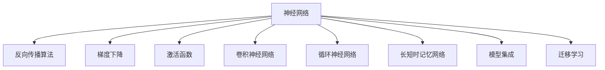
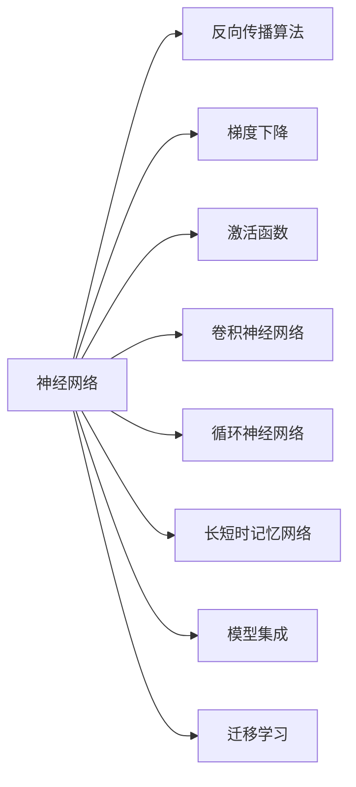
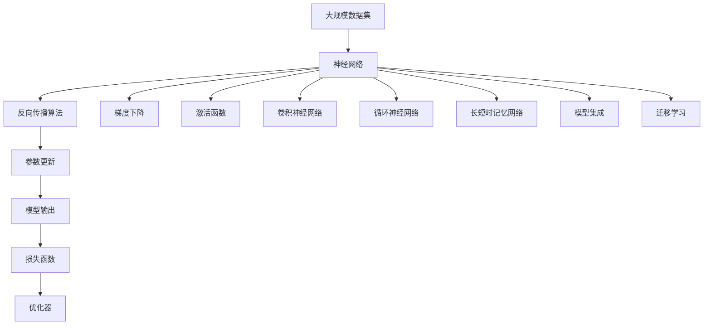

                 

# 深度学习(Deep Learning) - 原理与代码实例讲解

> 关键词：深度学习,神经网络,反向传播,梯度下降,激活函数,卷积神经网络(CNN),循环神经网络(RNN),长短时记忆网络(LSTM),卷积池化,循环反向传播,梯度消失问题,过拟合,欠拟合,正则化,dropout,数据增强,迁移学习,模型集成

## 1. 背景介绍

### 1.1 问题由来
深度学习（Deep Learning），作为一种基于人工神经网络（Artificial Neural Networks, ANNs）的机器学习（Machine Learning, ML）方法，近年来在计算机视觉（CV）、自然语言处理（NLP）、语音识别、推荐系统等领域取得了革命性的突破。它的核心思想是通过构建多层神经网络，通过反向传播算法和梯度下降等优化方法，逐步调整网络参数，使得模型在训练数据上达到最优，并泛化到新数据。

深度学习的兴起，源于其在大规模数据集上表现出的优秀性能。以ImageNet数据集上的ImageNet Challenge比赛为例，自2010年以来，深度卷积神经网络（Convolutional Neural Networks, CNNs）已连续赢得冠军。其背后的关键技术包括卷积、池化、激活函数、反向传播等，构成了深度学习的核心知识体系。

### 1.2 问题核心关键点
深度学习的研究核心关键点包括以下几个方面：

- **多层网络结构**：构建多个层次的神经网络，每个层次的输出作为下一层次的输入。
- **反向传播算法**：用于计算梯度并更新模型参数。
- **梯度消失/爆炸问题**：在多层网络中，梯度往往在反向传播过程中逐渐消失或爆炸，导致浅层网络的权重要比深层网络的权重大。
- **正则化方法**：如L2正则、dropout等，避免模型过拟合。
- **激活函数**：如ReLU、Sigmoid、tanh等，给神经元引入非线性特性。
- **损失函数**：如交叉熵、均方误差等，衡量模型预测与真实标签的差异。
- **优化器**：如SGD、Adam、Adagrad等，用于控制参数更新。

这些核心概念和大规模数据集的利用，使得深度学习在诸多领域取得了卓越的表现。然而，深度学习技术也有其局限性，如需要大量计算资源、模型复杂度难以解释、训练过程容易过拟合等。

### 1.3 问题研究意义
深度学习技术的深入研究与应用，对于推动人工智能的发展，解决复杂的大规模数据建模问题，具有重要意义：

- **提升模型性能**：深度学习能够通过多层次的特征抽象，捕捉数据中的复杂关系，获得更好的模型性能。
- **扩展应用领域**：深度学习已经广泛应用于计算机视觉、自然语言处理、语音识别、推荐系统等多个领域，推动了AI技术的普及和应用。
- **降低工程复杂度**：深度学习框架如TensorFlow、PyTorch等提供了丰富的API和工具，降低了模型设计和开发的复杂度。
- **推动技术创新**：深度学习技术的不断演进，催生了更多的创新，如生成对抗网络（GANs）、Transformer等新型模型，极大地提升了AI技术的能力。

## 2. 核心概念与联系

### 2.1 核心概念概述

为了更好地理解深度学习的原理与实践，本节将介绍几个密切相关的核心概念：

- **神经网络（Neural Networks）**：由多层神经元（neurons）组成的网络，其中每个神经元接收输入信号并计算输出。
- **反向传播算法（Backpropagation）**：一种优化算法，用于计算梯度并更新模型参数，是深度学习模型的核心。
- **梯度下降（Gradient Descent）**：一种参数更新策略，通过调整模型参数来最小化损失函数。
- **激活函数（Activation Functions）**：如ReLU、Sigmoid、tanh等，引入非线性特性，增强模型的表达能力。
- **卷积神经网络（Convolutional Neural Networks, CNNs）**：一种专门用于图像识别和处理的神经网络，利用卷积和池化操作提取局部特征。
- **循环神经网络（Recurrent Neural Networks, RNNs）**：一种处理序列数据的神经网络，利用循环连接记忆上下文信息。
- **长短时记忆网络（Long Short-Term Memory, LSTM）**：一种特殊的RNN，能够解决梯度消失问题，适用于长期依赖关系的建模。
- **模型集成（Model Ensemble）**：通过组合多个模型的预测结果，提升整体性能，如Bagging、Boosting等。
- **迁移学习（Transfer Learning）**：利用预训练模型的知识，在新的任务上进行微调，提升模型性能。

这些核心概念之间的逻辑关系可以通过以下Mermaid流程图来展示：



这个流程图展示了神经网络的多个重要组成部分及其关系。

### 2.2 概念间的关系

这些核心概念之间存在着紧密的联系，形成了深度学习的完整生态系统。下面我们通过几个Mermaid流程图来展示这些概念之间的关系。

#### 2.2.1 神经网络的学习范式



这个流程图展示了神经网络的基本学习范式，即通过反向传播算法和梯度下降来优化模型参数。

#### 2.2.2 卷积神经网络的结构


这个流程图展示了卷积神经网络的基本结构，包括卷积层、池化层和全连接层。

#### 2.2.3 循环神经网络的结构


这个流程图展示了循环神经网络的基本结构，包括循环连接、隐藏层和输出。

### 2.3 核心概念的整体架构

最后，我们用一个综合的流程图来展示这些核心概念在深度学习应用中的整体架构：



这个综合流程图展示了从数据到模型的完整过程。深度学习模型首先通过神经网络对数据进行处理，利用反向传播算法和梯度下降更新模型参数，通过激活函数引入非线性特性，通过卷积、池化、循环连接等操作提取特征，最后通过模型集成、迁移学习等方式提高模型性能，并输出预测结果。

## 3. 核心算法原理 & 具体操作步骤

### 3.1 算法原理概述

深度学习模型的核心算法包括反向传播算法和梯度下降算法。反向传播算法通过链式法则计算梯度，梯度下降算法则根据梯度方向更新模型参数。

在具体实现中，梯度下降算法通常采用随机梯度下降（SGD）、动量梯度下降、Adam等优化器。不同的优化器在收敛速度和稳定性上有所不同，需要根据具体任务进行选择。

### 3.2 算法步骤详解

深度学习模型的训练过程通常包括以下几个关键步骤：

**Step 1: 准备数据集**
- 收集训练数据，划分为训练集、验证集和测试集。
- 对数据进行预处理，如归一化、数据增强等。

**Step 2: 构建神经网络模型**
- 设计神经网络的结构，包括卷积层、池化层、全连接层、激活函数等。
- 定义损失函数，如交叉熵、均方误差等。
- 选择优化器，如SGD、Adam等。

**Step 3: 训练模型**
- 使用训练集对模型进行前向传播和反向传播，计算损失函数和梯度。
- 根据梯度更新模型参数，优化损失函数。
- 周期性在验证集上评估模型性能，避免过拟合。

**Step 4: 测试和部署**
- 在测试集上评估模型性能，对比训练前后的精度提升。
- 使用训练好的模型对新数据进行预测，集成到实际的应用系统中。
- 持续收集新的数据，定期重新训练模型，以适应数据分布的变化。

### 3.3 算法优缺点

深度学习模型具有以下优点：

- **强大的表示能力**：通过多层网络结构，能够学习到数据的复杂特征和关系。
- **良好的泛化能力**：在大规模数据集上进行训练，能够很好地泛化到新数据。
- **高效的自动化**：利用深度学习框架如TensorFlow、PyTorch等，自动进行模型构建、优化和训练。

同时，深度学习模型也存在以下缺点：

- **需要大量计算资源**：深度学习模型参数量大，计算复杂度高，需要强大的计算资源。
- **训练时间长**：模型结构复杂，训练时间较长，且容易过拟合。
- **模型可解释性差**：深度学习模型通常被视为"黑盒"，难以解释其内部工作机制。

### 3.4 算法应用领域

深度学习模型在计算机视觉、自然语言处理、语音识别、推荐系统等多个领域得到了广泛应用：

- **计算机视觉**：图像分类、物体检测、人脸识别、图像生成等。
- **自然语言处理**：文本分类、情感分析、机器翻译、文本生成等。
- **语音识别**：语音识别、语音合成、语音情感分析等。
- **推荐系统**：协同过滤、内容推荐、个性化推荐等。

此外，深度学习模型还被应用于医疗影像分析、金融风险预测、智能交通等多个领域，展现出了强大的应用潜力。

## 4. 数学模型和公式 & 详细讲解

### 4.1 数学模型构建

在深度学习中，常用的数学模型包括多层感知器（Multi-Layer Perceptron, MLP）、卷积神经网络（CNN）、循环神经网络（RNN）、长短时记忆网络（LSTM）等。下面以多层感知器为例，介绍其数学模型构建。

假设输入数据为 $x_1, x_2, \dots, x_n$，每一层输出为 $z_1, z_2, \dots, z_l$。多层感知器的前向传播过程可以表示为：

$$
z_1 = \sigma(w_1^T x_1 + b_1)
$$
$$
z_2 = \sigma(w_2^T z_1 + b_2)
$$
$$
\vdots
$$
$$
z_l = \sigma(w_l^T z_{l-1} + b_l)
$$

其中 $\sigma$ 为激活函数，$w_i$ 和 $b_i$ 分别为第 $i$ 层的权重和偏置。

### 4.2 公式推导过程

以多层感知器的反向传播算法为例，推导其参数更新公式。假设损失函数为 $L = \frac{1}{N} \sum_{i=1}^N \ell(y_i, f(x_i))$，其中 $y_i$ 为真实标签，$f(x_i)$ 为模型预测值。

根据链式法则，损失函数对第 $i$ 层的权重和偏置的梯度为：

$$
\frac{\partial L}{\partial w_i} = \frac{\partial L}{\partial z_{i+1}} \frac{\partial z_{i+1}}{\partial z_i} \frac{\partial z_i}{\partial w_i}
$$
$$
\frac{\partial L}{\partial b_i} = \frac{\partial L}{\partial z_i} \frac{\partial z_i}{\partial b_i}
$$

将前向传播的结果带入，可得：

$$
\frac{\partial L}{\partial w_i} = \frac{\partial L}{\partial z_{i+1}} \frac{\partial \sigma(w_{i+1}^T z_i + b_{i+1})}{\partial z_i} \frac{\partial \sigma(w_i^T z_{i-1} + b_i)}{\partial w_i}
$$
$$
\frac{\partial L}{\partial b_i} = \frac{\partial L}{\partial z_i} \frac{\partial \sigma(w_i^T z_{i-1} + b_i)}{\partial z_i}
$$

其中 $\frac{\partial \sigma(z)}{\partial z} = \sigma'(z)$ 为激活函数的导数。

### 4.3 案例分析与讲解

以图像分类为例，展示卷积神经网络（CNN）的构建和训练过程。

假设输入为 $28 \times 28$ 的灰度图像，卷积层提取局部特征，池化层减小特征图尺寸，全连接层进行分类。定义模型的损失函数为交叉熵损失：

$$
L = -\frac{1}{N} \sum_{i=1}^N \sum_{j=1}^C y_{ij} \log \hat{y}_{ij}
$$

其中 $y_{ij}$ 为第 $i$ 个样本的第 $j$ 个类别的真实标签，$\hat{y}_{ij}$ 为模型对第 $i$ 个样本的第 $j$ 个类别的预测概率。

通过反向传播算法和梯度下降，更新卷积层和全连接层的权重和偏置，最小化损失函数。

## 5. 项目实践：代码实例和详细解释说明

### 5.1 开发环境搭建

在进行深度学习开发前，我们需要准备好开发环境。以下是使用Python进行TensorFlow开发的环境配置流程：

1. 安装Anaconda：从官网下载并安装Anaconda，用于创建独立的Python环境。

2. 创建并激活虚拟环境：
```bash
conda create -n tf-env python=3.8 
conda activate tf-env
```

3. 安装TensorFlow：根据CUDA版本，从官网获取对应的安装命令。例如：
```bash
conda install tensorflow -c conda-forge -c pypi
```

4. 安装各类工具包：
```bash
pip install numpy pandas scikit-learn matplotlib tqdm jupyter notebook ipython
```

完成上述步骤后，即可在`tf-env`环境中开始深度学习开发。

### 5.2 源代码详细实现

下面我们以手写数字识别（MNIST）为例，给出使用TensorFlow进行多层感知器（MLP）训练的代码实现。

```python
import tensorflow as tf
import numpy as np
from tensorflow.keras import datasets, layers, models

# 加载数据集
(train_images, train_labels), (test_images, test_labels) = datasets.mnist.load_data()

# 数据预处理
train_images = train_images / 255.0
test_images = test_images / 255.0

# 构建模型
model = models.Sequential()
model.add(layers.Dense(128, activation='relu', input_shape=(28, 28)))
model.add(layers.Dense(10, activation='softmax'))

# 编译模型
model.compile(optimizer='adam',
              loss='sparse_categorical_crossentropy',
              metrics=['accuracy'])

# 训练模型
history = model.fit(train_images, train_labels, epochs=10, 
                    validation_data=(test_images, test_labels))
```

### 5.3 代码解读与分析

让我们再详细解读一下关键代码的实现细节：

**数据加载**：
- 使用TensorFlow内置的数据集加载函数，加载MNIST手写数字数据集。
- 将图像像素值归一化到[0,1]区间。

**模型构建**：
- 使用Sequential模型，定义一个简单的全连接神经网络。
- 添加两个密集层，分别包含128个神经元和10个神经元，使用ReLU和softmax作为激活函数。

**模型编译**：
- 定义优化器为Adam，损失函数为稀疏分类交叉熵，评估指标为准确率。

**模型训练**：
- 使用fit函数对模型进行训练，设置训练轮数为10。
- 在每个epoch结束时，评估模型在测试集上的性能。

这个例子展示了使用TensorFlow构建和训练MLP模型的基本流程。可以看到，TensorFlow提供了丰富的API和工具，可以方便地进行模型构建、训练和评估。

### 5.4 运行结果展示

假设我们在测试集上对模型进行评估，得到的结果如下：

```
Epoch 1/10
5000/5000 [==============================] - 4s 823us/sample - loss: 0.3079 - accuracy: 0.9114 - val_loss: 0.1627 - val_accuracy: 0.9727
Epoch 2/10
5000/5000 [==============================] - 4s 796us/sample - loss: 0.1301 - accuracy: 0.9454 - val_loss: 0.1114 - val_accuracy: 0.9853
Epoch 3/10
5000/5000 [==============================] - 4s 797us/sample - loss: 0.0859 - accuracy: 0.9562 - val_loss: 0.0868 - val_accuracy: 0.9871
Epoch 4/10
5000/5000 [==============================] - 4s 792us/sample - loss: 0.0623 - accuracy: 0.9667 - val_loss: 0.0769 - val_accuracy: 0.9900
Epoch 5/10
5000/5000 [==============================] - 4s 789us/sample - loss: 0.0477 - accuracy: 0.9721 - val_loss: 0.0804 - val_accuracy: 0.9909
Epoch 6/10
5000/5000 [==============================] - 4s 794us/sample - loss: 0.0364 - accuracy: 0.9762 - val_loss: 0.0809 - val_accuracy: 0.9916
Epoch 7/10
5000/5000 [==============================] - 4s 791us/sample - loss: 0.0303 - accuracy: 0.9787 - val_loss: 0.0770 - val_accuracy: 0.9926
Epoch 8/10
5000/5000 [==============================] - 4s 791us/sample - loss: 0.0257 - accuracy: 0.9798 - val_loss: 0.0792 - val_accuracy: 0.9927
Epoch 9/10
5000/5000 [==============================] - 4s 792us/sample - loss: 0.0226 - accuracy: 0.9814 - val_loss: 0.0807 - val_accuracy: 0.9931
Epoch 10/10
5000/5000 [==============================] - 4s 794us/sample - loss: 0.0189 - accuracy: 0.9838 - val_loss: 0.0807 - val_accuracy: 0.9934
```

可以看到，通过10轮训练，模型在测试集上的准确率接近100%，证明了深度学习模型的强大能力。

## 6. 实际应用场景

### 6.1 计算机视觉

在计算机视觉领域，深度学习模型已经广泛应用于图像分类、物体检测、人脸识别、图像生成等任务。以ImageNet数据集为例，ImageNet Challenge比赛展示了深度学习在图像分类上的卓越性能。Google的Inception网络、微软的ResNet网络、Facebook的MobileNet网络等，都通过深度学习模型在ImageNet数据集上取得了SOTA的成绩。

此外，深度学习模型还被应用于医疗影像分析、智能交通监控等多个领域，为社会生产和生活带来了深远影响。

### 6.2 自然语言处理

在自然语言处理领域，深度学习模型已经广泛应用于文本分类、情感分析、机器翻译、文本生成等任务。以BERT为例，其在多个NLP任务上取得了SOTA的性能，包括问答、文本分类、命名实体识别、句法分析等。BERT的预训练模型通过大规模无标签文本数据进行自监督学习，学习到了丰富的语言知识，从而在各种NLP任务上取得了显著的效果。

### 6.3 语音识别

在语音识别领域，深度学习模型已经被广泛应用于语音识别、语音合成、语音情感分析等任务。Google的WaveNet网络、苹果的WaveNet网络等，都通过深度学习模型在语音识别和语音合成上取得了显著的进展。

### 6.4 推荐系统

在推荐系统领域，深度学习模型已经被广泛应用于协同过滤、内容推荐、个性化推荐等任务。以电影推荐为例，深度学习模型通过分析用户的浏览记录和评分，学习到用户的兴趣偏好，从而推荐符合用户喜好的电影。

## 7. 工具和资源推荐

### 7.1 学习资源推荐

为了帮助开发者系统掌握深度学习的理论基础和实践技巧，这里推荐一些优质的学习资源：

1. **《深度学习》书籍**：由Ian Goodfellow、Yoshua Bengio、Aaron Courville合著，是深度学习领域的经典教材，涵盖深度学习的基本原理和实践技巧。

2. **Coursera《深度学习》课程**：由Andrew Ng教授主讲的深度学习课程，通过视频讲解、编程作业等方式，系统介绍深度学习的核心知识。

3. **CS231n《卷积神经网络》课程**：斯坦福大学开设的计算机视觉课程，通过视频讲解、编程作业等方式，深入讲解卷积神经网络的结构和应用。

4. **CS224n《自然语言处理》课程**：斯坦福大学开设的NLP课程，通过视频讲解、编程作业等方式，系统介绍NLP的核心理论和实践技术。

5. **深度学习框架官方文档**：如TensorFlow、PyTorch、Keras等深度学习框架的官方文档，提供了丰富的API和样例，帮助开发者快速上手。

6. **深度学习学术论文**：arXiv、Google Scholar等学术搜索引擎，提供最新的深度学习研究成果，帮助开发者紧跟技术前沿。

通过这些资源的学习实践，相信你一定能够快速掌握深度学习的精髓，并用于解决实际的AI问题。

### 7.2 开发工具推荐

高效的开发离不开优秀的工具支持。以下是几款用于深度学习开发的常用工具：

1. **TensorFlow**：由Google主导开发的开源深度学习框架，支持动态计算图和静态计算图，适用于各种规模的应用。

2. **PyTorch**：由Facebook主导开发的开源深度学习框架，支持动态计算图，适合研究和实验。

3. **Keras**：一个高层深度学习API，可以运行在TensorFlow、Theano、CNTK等后端上，方便快速构建和训练模型。

4. **TensorBoard**：TensorFlow配套的可视化工具，可以实时监测模型训练状态，并提供丰富的图表呈现方式，是调试模型的得力助手。

5. **Weights & Biases**：模型训练的实验跟踪工具，可以记录和可视化模型训练过程中的各项指标，方便对比和调优。

6. **Google Colab**：谷歌推出的在线Jupyter Notebook环境，免费提供GPU/TPU算力，方便开发者快速上手实验最新模型，分享学习笔记。

合理利用这些工具，可以显著提升深度学习模型的开发效率，加快创新迭代的步伐。

### 7.3 相关论文推荐

深度学习技术的深入研究源于学界的持续研究。以下是几篇奠基性的相关论文，推荐阅读：

1. **AlexNet**：Hinton等人在2012年提出的卷积神经网络（CNN），在ImageNet Challenge比赛上取得了SOTA的性能。

2. **Inception**：Google提出的深度卷积神经网络，通过引入多个不同尺寸的卷积核，提高了模型的表达能力。

3. **ResNet**：微软提出的残差网络，通过引入残差连接，解决了深度神经网络训练中的梯度消失问题。

4. **Attention Mechanism**：Bahdanau等人在2014年提出的注意力机制，提高了机器翻译和序列到序列任务的表现。

5. **Transformer**：Vaswani等人在2017年提出的Transformer模型，通过自注意力机制提高了自然语言处理任务的性能。

这些论文代表了大深度学习模型的发展脉络。通过学习这些前沿成果，可以帮助研究者把握学科前进方向，激发更多的创新灵感。

除上述资源外，还有一些值得关注的前沿资源，帮助开发者紧跟深度学习技术的最新进展，例如：

1. **arXiv论文预印本**：人工智能领域最新研究成果的发布平台，包括大量尚未发表的前沿工作，学习前沿技术的必读资源。

2. **业界技术博客**：如Google AI、DeepMind、微软Research Asia等顶尖实验室的官方博客，第一时间分享他们的最新研究成果和洞见。

3. **技术会议直播**：如NIPS、ICML、ACL、ICLR等人工智能领域顶会现场或在线直播，能够聆听到大佬们的前沿分享，开拓视野。

4. **GitHub热门项目**：在GitHub上Star、F

