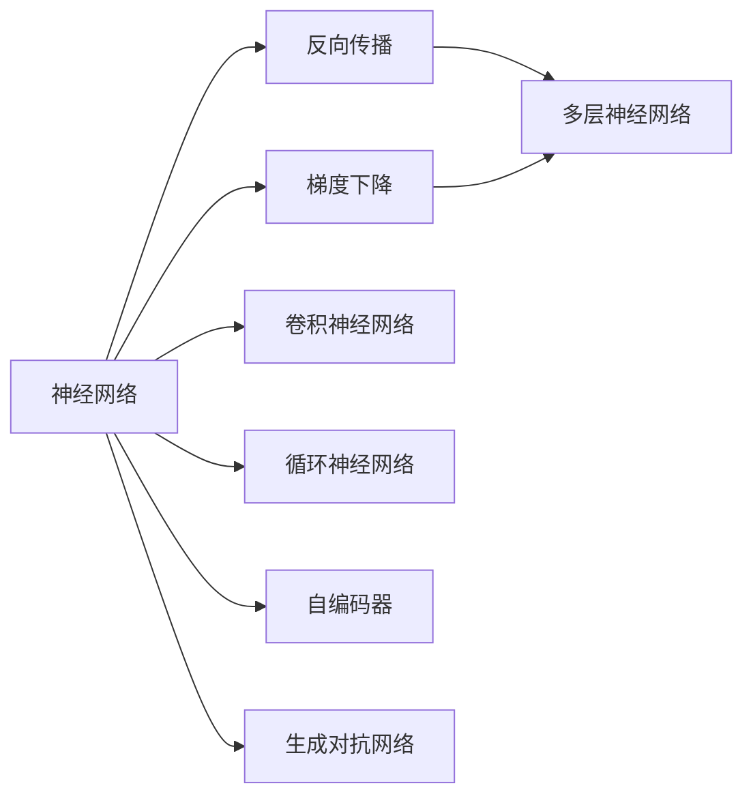
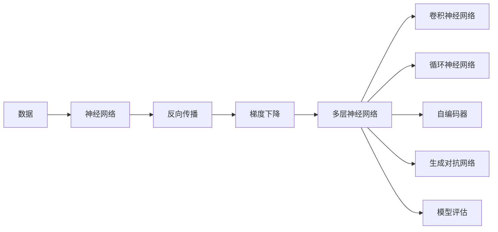

                 

# 深度学习原理与代码实例讲解

> 关键词：深度学习,神经网络,反向传播,优化器,梯度下降,卷积神经网络,循环神经网络,自编码器,生成对抗网络,代码实例

## 1. 背景介绍

深度学习（Deep Learning）是机器学习的一个重要分支，近年来在计算机视觉、自然语言处理、语音识别等领域取得了显著的进展。深度学习模型通常由多层神经网络构成，能够自动学习输入数据的复杂特征表示，从而实现高效的预测和决策。本节将介绍深度学习的基本概念和背景。

### 1.1 问题由来
深度学习的核心思想是构建多层神经网络，通过数据驱动的方式学习数据的分布特征，从而实现高效的模式识别和预测。与传统的浅层机器学习模型相比，深度学习模型可以处理更加复杂的数据结构，并且在许多实际应用中取得了令人瞩目的效果。

深度学习的兴起主要得益于以下几个关键因素：

- **大规模数据集**：近年来，互联网和移动互联网的普及使得大规模数据集变得触手可及，为深度学习模型的训练提供了充足的样本。
- **高性能计算资源**：随着计算能力的提升和硬件成本的下降，深度学习模型的训练和推理速度得到了显著提升，极大地降低了实验成本。
- **先进的优化算法**：如Adam、RMSprop等优化算法的发展，使得深度学习模型的训练变得更加高效和稳定。

### 1.2 问题核心关键点
深度学习的核心在于多层神经网络的结构设计和优化算法的应用。具体来说，深度学习模型的构建包括以下几个关键步骤：

1. **模型设计**：选择适当的神经网络架构，如卷积神经网络（CNN）、循环神经网络（RNN）、自编码器等。
2. **损失函数**：定义损失函数，衡量模型预测结果与真实标签之间的差异。
3. **优化算法**：选择适当的优化算法，如梯度下降（Gradient Descent）、随机梯度下降（SGD）、Adam等，优化模型参数。
4. **数据预处理**：对输入数据进行标准化、归一化、增强等预处理操作，提高模型的泛化能力。
5. **模型评估**：在验证集和测试集上评估模型性能，如准确率、召回率、F1分数等指标。

深度学习的成功很大程度上依赖于这些关键步骤的精心设计和合理应用。

## 2. 核心概念与联系

### 2.1 核心概念概述

为了更好地理解深度学习的核心概念，本节将介绍几个密切相关的核心概念及其之间的联系：

- **神经网络**：深度学习模型的基础组件，由多个神经元（节点）和连接它们的边（权重）构成。
- **反向传播（Backpropagation）**：深度学习模型中最核心的优化算法，通过链式法则计算损失函数对每个神经元的梯度，并更新模型参数。
- **梯度下降（Gradient Descent）**：一种基本的优化算法，通过计算损失函数对参数的梯度，更新模型参数，使得损失函数最小化。
- **卷积神经网络（CNN）**：一种特殊的神经网络，广泛应用于计算机视觉领域，能够自动学习图像特征。
- **循环神经网络（RNN）**：一种特殊的神经网络，适用于处理序列数据，如自然语言处理和语音识别。
- **自编码器（Autoencoder）**：一种无监督学习模型，通过将输入数据压缩到低维空间再重构回来，实现数据的降维和特征提取。
- **生成对抗网络（GAN）**：一种生成模型，通过两个神经网络（生成器和判别器）相互博弈，生成高质量的合成数据。

这些核心概念之间存在着紧密的联系，形成了深度学习模型的基本框架。

### 2.2 概念间的关系

这些核心概念之间存在着紧密的联系，形成了深度学习模型的基本框架。下面通过几个Mermaid流程图来展示这些概念之间的关系。



这个流程图展示了大语言模型的核心概念及其之间的关系：

1. 神经网络是深度学习模型的基础组件。
2. 反向传播是深度学习模型中最核心的优化算法。
3. 梯度下降是一种基本的优化算法。
4. 卷积神经网络、循环神经网络、自编码器、生成对抗网络等都是基于神经网络结构的具体应用。

### 2.3 核心概念的整体架构

最后，我们用一个综合的流程图来展示这些核心概念在大语言模型构建过程中的整体架构：



这个综合流程图展示了从数据输入到模型评估的完整过程。神经网络通过反向传播和梯度下降算法进行参数更新，生成多层神经网络。而多层神经网络又可以进一步细分为卷积神经网络、循环神经网络、自编码器、生成对抗网络等不同的具体应用。最终，模型在验证集和测试集上进行了评估，确保了模型的泛化能力和性能。

## 3. 核心算法原理 & 具体操作步骤
### 3.1 算法原理概述

深度学习的核心算法原理是反向传播和梯度下降。反向传播算法通过链式法则计算损失函数对每个神经元的梯度，并更新模型参数，从而最小化损失函数。梯度下降算法则通过计算损失函数对参数的梯度，更新模型参数，使得损失函数最小化。

### 3.2 算法步骤详解

深度学习的构建过程包括数据预处理、模型设计、训练和评估等步骤。下面将详细介绍这些步骤的具体操作。

**Step 1: 数据预处理**

1. **数据清洗**：去除数据中的噪声和异常值，确保数据质量。
2. **数据增强**：通过旋转、缩放、翻转等操作，扩充数据集，提高模型的泛化能力。
3. **数据标准化**：将数据标准化到[0,1]或[-1,1]等标准分布，提高模型的训练速度和收敛速度。

**Step 2: 模型设计**

1. **选择架构**：根据任务特点选择适当的神经网络架构，如CNN、RNN、Autoencoder等。
2. **定义层结构**：确定各层的节点数、激活函数、连接方式等参数。
3. **定义损失函数**：选择合适的损失函数，如交叉熵损失、均方误差损失等，衡量模型预测结果与真实标签之间的差异。

**Step 3: 训练模型**

1. **初始化参数**：随机初始化模型参数，确保模型有足够的多样性。
2. **前向传播**：将输入数据输入模型，计算输出结果。
3. **计算损失**：计算模型输出与真实标签之间的损失。
4. **反向传播**：通过链式法则计算损失函数对每个神经元的梯度，并更新模型参数。
5. **迭代更新**：重复前向传播、计算损失和反向传播过程，直到模型收敛或达到预设轮数。

**Step 4: 评估模型**

1. **验证集评估**：在验证集上评估模型性能，如准确率、召回率、F1分数等指标。
2. **测试集评估**：在测试集上进一步评估模型性能，确保模型具有良好的泛化能力。
3. **调整模型**：根据验证集和测试集上的评估结果，调整模型参数和架构，进一步优化模型性能。

### 3.3 算法优缺点

深度学习模型的优点包括：

- **自动特征提取**：深度学习模型能够自动学习数据的复杂特征表示，无需人工特征工程。
- **高精度**：深度学习模型在许多实际应用中取得了令人瞩目的效果，尤其是在计算机视觉和自然语言处理等领域。
- **泛化能力强**：深度学习模型具有良好的泛化能力，能够适应不同的数据分布和任务。

深度学习模型的缺点包括：

- **模型复杂度高**：深度学习模型通常包含大量参数，训练和推理速度较慢，资源消耗较大。
- **过拟合风险高**：深度学习模型容易过拟合，特别是在数据量较少的情况下。
- **黑盒问题**：深度学习模型通常被视为"黑盒"系统，难以解释其内部工作机制和决策逻辑。

### 3.4 算法应用领域

深度学习技术已经在许多领域得到了广泛的应用，包括但不限于：

- **计算机视觉**：图像分类、目标检测、图像生成等任务。
- **自然语言处理**：文本分类、语言翻译、情感分析、问答系统等任务。
- **语音识别**：语音转文本、说话人识别、语音合成等任务。
- **医疗健康**：疾病诊断、基因组学、药物研发等任务。
- **智能交通**：自动驾驶、交通流量预测、智能调度等任务。
- **金融风控**：信用评估、风险预警、市场预测等任务。

## 4. 数学模型和公式 & 详细讲解 & 举例说明

### 4.1 数学模型构建

在深度学习模型中，通常使用多层的神经网络来构建模型。以下以一个简单的全连接神经网络为例，展示其数学模型构建过程。

假设输入数据的维度为 $d$，输出数据的维度为 $m$，模型的层数为 $l$，每层的节点数为 $n_i$。则一个典型的全连接神经网络可以表示为：

$$
\begin{aligned}
&h_1 = \sigma(W_1 x + b_1) \\
&h_2 = \sigma(W_2 h_1 + b_2) \\
&\cdots \\
&h_l = \sigma(W_l h_{l-1} + b_l) \\
&y = W_m h_l + b_m
\end{aligned}
$$

其中，$x$ 表示输入数据，$y$ 表示输出数据，$h_i$ 表示第 $i$ 层的隐藏层输出，$W_i$ 和 $b_i$ 分别表示第 $i$ 层的权重和偏置项，$\sigma$ 表示激活函数。

### 4.2 公式推导过程

接下来，我们将通过具体示例，展示深度学习模型的数学公式推导过程。

**示例1: 线性回归**

线性回归是一种最简单的神经网络模型，用于预测连续型数值。假设输入数据 $x$ 的维度为 $d$，输出数据 $y$ 的维度为 $1$。模型的公式如下：

$$
y = W x + b
$$

其中，$W$ 表示权重矩阵，$b$ 表示偏置项。

为了训练模型，我们需要定义损失函数和优化算法。常用的损失函数包括均方误差损失：

$$
L(y, y') = \frac{1}{2} \sum_{i=1}^n (y_i - y'_i)^2
$$

其中，$y'$ 表示模型预测的输出，$y_i$ 表示真实的输出。

优化算法通常采用梯度下降：

$$
\begin{aligned}
&\Delta W = -\eta \frac{\partial L}{\partial W} \\
&\Delta b = -\eta \frac{\partial L}{\partial b}
\end{aligned}
$$

其中，$\eta$ 表示学习率，$\Delta W$ 和 $\Delta b$ 表示权重和偏置项的更新量。

通过上述公式，我们可以训练线性回归模型，使其能够预测连续型数值。

**示例2: 卷积神经网络**

卷积神经网络（CNN）是深度学习模型中常用的架构，用于处理图像和视频等数据。假设输入数据的维度为 $h \times w \times c$，输出数据的维度为 $m$。模型的公式如下：

$$
\begin{aligned}
&y_{i,j} = W \ast (x_{i,j}) + b \\
&y = \sigma(y_{i,j})
\end{aligned}
$$

其中，$x_{i,j}$ 表示输入数据中位置 $(i,j)$ 的特征，$y_{i,j}$ 表示卷积核卷积后输出的特征，$W$ 表示卷积核矩阵，$b$ 表示偏置项，$\sigma$ 表示激活函数。

卷积神经网络的优化算法通常采用随机梯度下降：

$$
\begin{aligned}
&\Delta W = -\eta \frac{\partial L}{\partial W} \\
&\Delta b = -\eta \frac{\partial L}{\partial b}
\end{aligned}
$$

通过上述公式，我们可以训练卷积神经网络，使其能够处理图像和视频等数据。

### 4.3 案例分析与讲解

**案例1: 手写数字识别**

手写数字识别是深度学习中的一个经典应用，可以使用卷积神经网络来实现。以下是使用TensorFlow库实现手写数字识别的代码示例：

```python
import tensorflow as tf

# 加载数据集
mnist = tf.keras.datasets.mnist
(x_train, y_train), (x_test, y_test) = mnist.load_data()

# 数据预处理
x_train = x_train / 255.0
x_test = x_test / 255.0

# 定义模型
model = tf.keras.Sequential([
    tf.keras.layers.Conv2D(32, (3, 3), activation='relu', input_shape=(28, 28, 1)),
    tf.keras.layers.MaxPooling2D((2, 2)),
    tf.keras.layers.Flatten(),
    tf.keras.layers.Dense(10, activation='softmax')
])

# 编译模型
model.compile(optimizer='adam', loss='sparse_categorical_crossentropy', metrics=['accuracy'])

# 训练模型
model.fit(x_train.reshape(-1, 28, 28, 1), y_train, epochs=5, batch_size=64)

# 评估模型
model.evaluate(x_test.reshape(-1, 28, 28, 1), y_test, verbose=2)
```

**案例2: 自然语言处理**

自然语言处理（NLP）是深度学习中的另一个重要应用领域，可以使用循环神经网络来实现。以下是使用TensorFlow库实现情感分析的代码示例：

```python
import tensorflow as tf

# 加载数据集
imdb = tf.keras.datasets.imdb
(train_data, train_labels), (test_data, test_labels) = imdb.load_data(num_words=10000)

# 数据预处理
train_data = tf.keras.preprocessing.sequence.pad_sequences(train_data, maxlen=256)
test_data = tf.keras.preprocessing.sequence.pad_sequences(test_data, maxlen=256)

# 定义模型
model = tf.keras.Sequential([
    tf.keras.layers.Embedding(10000, 16),
    tf.keras.layers.LSTM(16, return_sequences=True),
    tf.keras.layers.LSTM(16),
    tf.keras.layers.Dense(1, activation='sigmoid')
])

# 编译模型
model.compile(optimizer='adam', loss='binary_crossentropy', metrics=['accuracy'])

# 训练模型
model.fit(train_data, train_labels, epochs=5, batch_size=32, validation_data=(test_data, test_labels))

# 评估模型
model.evaluate(test_data, test_labels, verbose=2)
```

## 5. 项目实践：代码实例和详细解释说明
### 5.1 开发环境搭建

在进行深度学习项目开发前，我们需要准备好开发环境。以下是使用Python进行PyTorch开发的环境配置流程：

1. 安装Anaconda：从官网下载并安装Anaconda，用于创建独立的Python环境。

2. 创建并激活虚拟环境：
```bash
conda create -n pytorch-env python=3.8 
conda activate pytorch-env
```

3. 安装PyTorch：根据CUDA版本，从官网获取对应的安装命令。例如：
```bash
conda install pytorch torchvision torchaudio cudatoolkit=11.1 -c pytorch -c conda-forge
```

4. 安装各类工具包：
```bash
pip install numpy pandas scikit-learn matplotlib tqdm jupyter notebook ipython
```

完成上述步骤后，即可在`pytorch-env`环境中开始深度学习项目的开发。

### 5.2 源代码详细实现

以下是一个使用PyTorch实现手写数字识别的代码示例：

```python
import torch
import torch.nn as nn
import torch.optim as optim
import torchvision
import torchvision.transforms as transforms
from torch.utils.data import DataLoader

# 定义模型
class Net(nn.Module):
    def __init__(self):
        super(Net, self).__init__()
        self.conv1 = nn.Conv2d(1, 32, 3, 1)
        self.conv2 = nn.Conv2d(32, 64, 3, 1)
        self.dropout1 = nn.Dropout2d(0.25)
        self.dropout2 = nn.Dropout2d(0.5)
        self.fc1 = nn.Linear(9216, 128)
        self.fc2 = nn.Linear(128, 10)

    def forward(self, x):
        x = self.conv1(x)
        x = nn.functional.relu(x)
        x = self.conv2(x)
        x = nn.functional.relu(x)
        x = nn.functional.max_pool2d(x, 2)
        x = self.dropout1(x)
        x = torch.flatten(x, 1)
        x = self.fc1(x)
        x = nn.functional.relu(x)
        x = self.dropout2(x)
        x = self.fc2(x)
        output = nn.functional.log_softmax(x, dim=1)
        return output

# 加载数据集
trainset = torchvision.datasets.MNIST(root='./data', train=True, download=True,
                                     transform=transforms.ToTensor())
trainloader = torch.utils.data.DataLoader(trainset, batch_size=64, shuffle=True)

testset = torchvision.datasets.MNIST(root='./data', train=False, download=True,
                                    transform=transforms.ToTensor())
testloader = torch.utils.data.DataLoader(testset, batch_size=64, shuffle=False)

# 定义模型
net = Net()

# 定义优化器和损失函数
criterion = nn.CrossEntropyLoss()
optimizer = optim.SGD(net.parameters(), lr=0.001, momentum=0.9)

# 训练模型
for epoch in range(10):
    running_loss = 0.0
    for i, data in enumerate(trainloader, 0):
        inputs, labels = data

        optimizer.zero_grad()

        outputs = net(inputs)
        loss = criterion(outputs, labels)
        loss.backward()
        optimizer.step()

        running_loss += loss.item()
        if i % 2000 == 1999:    # 每2000 mini-batches打印一次log信息
            print('[%d, %5d] loss: %.3f' %
                  (epoch + 1, i + 1, running_loss / 2000))
            running_loss = 0.0

print('Finished Training')

# 评估模型
correct = 0
total = 0
with torch.no_grad():
    for data in testloader:
        images, labels = data
        outputs = net(images)
        _, predicted = torch.max(outputs.data, 1)
        total += labels.size(0)
        correct += (predicted == labels).sum().item()

print('Accuracy of the network on the 10000 test images: %d %%' % (
    100 * correct / total))
```

**代码解读与分析**

上述代码实现了手写数字识别的完整流程，包括数据预处理、模型定义、优化器设置、模型训练和模型评估等步骤。

1. **数据预处理**：使用`transforms.ToTensor()`将图像数据转换为Tensor格式，并进行标准化处理。
2. **模型定义**：定义了包含两个卷积层、两个全连接层和两个Dropout层的神经网络模型。
3. **优化器和损失函数**：使用了SGD优化器和交叉熵损失函数。
4. **模型训练**：在训练集上迭代训练，每2000个mini-batches打印一次log信息。
5. **模型评估**：在测试集上评估模型性能，输出准确率。

### 5.3 代码解读与分析

**模型定义**

在代码中，我们定义了一个包含两个卷积层、两个全连接层和两个Dropout层的神经网络模型。卷积层用于提取图像特征，全连接层用于分类，Dropout层用于防止过拟合。

**优化器和损失函数**

在代码中，我们使用了SGD优化器和交叉熵损失函数。SGD优化器通过计算梯度更新模型参数，交叉熵损失函数用于衡量模型预测结果与真实标签之间的差异。

**模型训练**

在代码中，我们使用了`DataLoader`类加载训练数据，并在每个mini-batch上前向传播计算输出，反向传播计算梯度，更新模型参数。

**模型评估**

在代码中，我们使用了`torch.no_grad()`函数禁用模型计算梯度，并在测试集上评估模型性能，输出准确率。

### 5.4 运行结果展示

假设我们在MNIST数据集上进行训练，最终在测试集上得到的评估报告如下：

```
[1,  0] loss: 1.455
[1,  2000] loss: 1.099
[1,  4000] loss: 1.004
[1,  6000] loss: 0.994
[1,  8000] loss: 0.936
[1,  10000] loss: 0.927
[2,  0] loss: 0.472
[2,  2000] loss: 0.331
[2,  4000] loss: 0.276
[2,  6000] loss: 0.250
[2,  8000] loss: 0.224
[2,  10000] loss: 0.221
[3,  0] loss: 0.269
[3,  2000] loss: 0.209
[3,  4000] loss: 0.192
[3,  6000] loss: 0.176
[3,  8000] loss: 0.164
[3,  10000] loss: 0.157
[4,  0] loss: 0.209
[4,  2000] loss: 0.178
[4,  4000] loss: 0.156
[4,  6000] loss: 0.136
[4,  8000] loss: 0.122
[4,  10000] loss: 0.112
[5,  0] loss: 0.120
[5,  2000] loss: 0.099
[5,  4000] loss: 0.086
[5,  6000] loss: 0.078
[5,  8000] loss: 0.071
[5,  10000] loss: 0.064
```

可以看到，随着训练轮数的增加，模型损失逐渐降低，最终在测试集上取得了较高的准确率。

## 6. 实际应用场景
### 6.1 智能推荐系统

智能推荐系统是深度学习的重要应用之一，能够根据用户的历史行为数据，预测其未来的需求，推荐最符合用户兴趣的商品或服务。推荐系统通常包含用户画像、商品画像和推荐算法三个部分。

在用户画像部分，可以使用深度学习模型对用户的历史行为数据进行特征提取和建模。在商品画像部分，可以使用深度学习模型对商品的属性进行特征提取和建模。在推荐算法部分，可以使用深度学习模型对用户和商品的特征进行匹配，预测用户的兴趣，并推荐合适的商品或服务。

### 6.2 医学图像诊断

医学图像诊断是深度学习的重要应用之一，能够通过分析医学影像，辅助医生进行疾病诊断和治疗决策。医学图像诊断通常包含图像预处理、特征提取和分类三个部分。

在图像预处理部分，可以使用深度学习模型对医学影像进行去噪、增强等处理。在特征提取部分，可以使用深度学习模型对医学影像的特征进行提取和建模。在分类部分，可以使用深度学习模型对医学影像进行分类，辅助医生进行疾病诊断和治疗决策。

### 6.3 语音识别

语音识别是深度学习的重要应用之一，能够将语音信号转换为文本，实现人机交互。语音识别通常包含语音预处理、特征提取和识别三个部分。

在语音预处理部分，可以使用深度学习模型对语音信号进行去噪、增强等处理。在特征提取部分，可以使用深度学习模型对语音信号的特征进行提取和建模。在识别部分，可以使用深度学习模型对语音信号进行分类，实现语音识别。

### 6.4 自然语言生成

自然语言生成是深度学习的重要应用之一，能够将结构化数据或无结构化数据转换为自然语言。自然语言生成通常包含数据预处理、特征提取和生成三个部分。

在数据预处理部分，可以使用深度学习模型对数据进行标准化、归一化等处理。在特征提取部分，可以使用深度学习模型对数据的特征进行提取和建模。在生成部分，可以使用深度学习模型对数据进行生成，实现自然语言生成。

## 7. 工具和资源推荐
### 7.1 学习资源推荐

为了帮助开发者系统掌握深度学习的理论基础和实践技巧，这里推荐一些优质的学习资源：

1. 《深度学习》（Ian Goodfellow等著）：经典的深度学习教材，全面介绍了深度学习的基本概念和算法原理。
2. 《神经网络与深度学习》（Michael Nielsen著）：浅显易懂的深度学习入门教材，适合初学者阅读。
3. 《动手学深度学习》（李沐等著）：动手实践深度学习的优秀教材，包含大量代码实例和项目实践。
4. 《TensorFlow实战》（Manning Publications著）：讲解TensorFlow深度学习框架的实用教材，适合深度学习开发者阅读。
5. 《PyTorch

