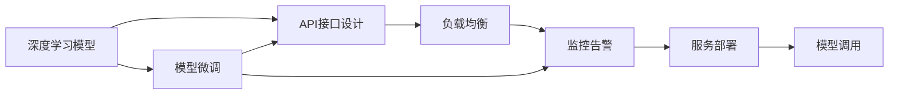
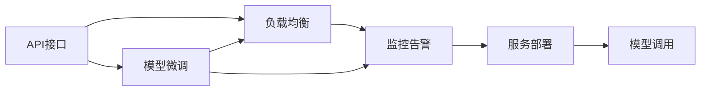
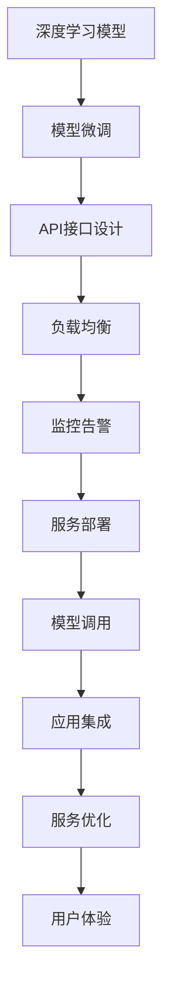

                 

# 深度学习模型的部署与服务化

> 关键词：深度学习模型，服务化部署，模型微调，API接口，负载均衡，监控告警

## 1. 背景介绍

在人工智能领域，深度学习模型（Deep Learning Model）的发展已经进入到了一个崭新的阶段。模型性能的提升使得其在各行各业中的应用越来越广泛，从自然语言处理、计算机视觉到自动驾驶、工业控制，深度学习模型都展现了强大的生命力。然而，仅仅拥有模型本身已经远远不够，如何将模型高效地部署到生产环境中，实现稳定的、可扩展的、高可靠的服务化部署，成为了当前人工智能应用的重大挑战。

深度学习模型的服务化部署（Service-Oriented Deployment），是指将模型封装成可调用的服务，通过标准化的API接口进行访问，从而实现模型的灵活部署、高效调用和持续优化。这一过程不仅需要考虑模型的性能和准确度，还需要在计算资源、存储容量、网络传输等方面进行全方位的优化，以保证服务稳定、可靠、高效。

本文将详细探讨深度学习模型的服务化部署，包括模型微调、API接口设计、负载均衡、监控告警等关键技术，并结合实际案例，展示如何在不同场景下实现高效的深度学习模型服务化部署。

## 2. 核心概念与联系

### 2.1 核心概念概述

为了更好地理解深度学习模型的服务化部署，我们首先需要对相关核心概念进行梳理：

- **深度学习模型**：通过多层神经网络对数据进行复杂抽象和特征提取的模型，包括卷积神经网络（CNN）、循环神经网络（RNN）、变分自编码器（VAE）等。
- **模型微调**：在已有模型基础上，通过少量标注数据进行有监督学习，以适应特定任务。
- **API接口**：应用程序编程接口，定义了应用程序外部与内部之间的接口，实现服务化部署的关键。
- **负载均衡**：在多台服务器之间分配请求，避免单一服务器过载，保证服务稳定。
- **监控告警**：实时监控服务状态，及时发现异常，保障服务可靠。

这些核心概念之间的逻辑关系可以通过以下Mermaid流程图来展示：



这个流程图展示了大模型服务化部署的完整过程。首先，通过微调使模型适配特定任务，然后设计API接口以实现服务化调用，再通过负载均衡和监控告警保障服务稳定可靠。

### 2.2 概念间的关系

这些核心概念之间存在着紧密的联系，形成了深度学习模型服务化部署的完整生态系统。下面我通过几个Mermaid流程图来展示这些概念之间的关系。

#### 2.2.1 模型微调与服务化部署的关系


这个流程图展示了模型微调与大模型服务化部署的关系。微调是服务化部署的前提，通过微调使模型适配特定任务，再通过API接口进行服务化调用。

#### 2.2.2 API接口与服务化部署的关系



这个流程图展示了API接口与服务化部署的关系。API接口是服务化部署的核心，通过API接口实现模型的灵活调用，并通过负载均衡和监控告警保障服务稳定可靠。

#### 2.2.3 负载均衡与监控告警的关系


这个流程图展示了负载均衡与监控告警的关系。负载均衡通过在多台服务器之间分配请求，避免单一服务器过载，监控告警实时监控服务状态，及时发现异常。两者共同保障了服务的稳定和可靠性。

### 2.3 核心概念的整体架构

最后，我们用一个综合的流程图来展示这些核心概念在大模型服务化部署中的整体架构：



这个综合流程图展示了深度学习模型服务化部署的完整过程，从模型微调到服务部署，再到应用集成和服务优化，最后通过优化用户体验，实现服务的全面提升。

## 3. 核心算法原理 & 具体操作步骤

### 3.1 算法原理概述

深度学习模型的服务化部署，涉及到模型微调、API接口设计、负载均衡、监控告警等多个环节。其中，模型微调是基础，API接口设计是关键，负载均衡和监控告警是保障。

- **模型微调**：通过少量标注数据，在已有模型基础上进行有监督学习，以适应特定任务。常用的微调方法包括迁移学习、Fine-tuning等。
- **API接口设计**：定义模型调用的接口规范，包括请求格式、参数定义、返回结果等，实现模型的灵活调用。
- **负载均衡**：在多台服务器之间分配请求，避免单一服务器过载，保证服务稳定。
- **监控告警**：实时监控服务状态，及时发现异常，保障服务可靠。

这些步骤依次进行，缺一不可。

### 3.2 算法步骤详解

#### 3.2.1 模型微调

模型微调通常包括以下几个步骤：

1. **准备数据集**：收集与任务相关的数据集，进行数据清洗、预处理和标注。
2. **选择模型**：选择合适的深度学习模型，如卷积神经网络（CNN）、循环神经网络（RNN）、变分自编码器（VAE）等。
3. **设计损失函数**：根据任务类型设计合适的损失函数，如交叉熵损失、均方误差损失等。
4. **选择优化器**：选择合适的优化器，如Adam、SGD等，并设置学习率和正则化参数。
5. **进行微调训练**：在训练集上对模型进行微调训练，优化模型参数以适应特定任务。
6. **评估和调优**：在验证集上评估模型性能，根据评估结果调整模型参数或训练策略，直到模型达到预期性能。
7. **保存模型**：保存微调后的模型，以便后续部署和调用。

#### 3.2.2 API接口设计

API接口设计通常包括以下几个步骤：

1. **定义接口规范**：定义API接口的请求格式、参数定义、返回结果等规范。
2. **实现接口功能**：实现API接口的具体功能，包括模型调用、参数设置、结果返回等。
3. **测试和优化**：对API接口进行测试，确保其正确性和稳定性，并进行优化，提升性能。

#### 3.2.3 负载均衡

负载均衡通常包括以下几个步骤：

1. **选择负载均衡器**：选择合适的负载均衡器，如Nginx、HAProxy等。
2. **配置负载均衡规则**：配置负载均衡规则，如轮询、加权轮询、最少连接等。
3. **部署负载均衡器**：在服务器上部署负载均衡器，并连接目标服务器。
4. **监控负载均衡状态**：实时监控负载均衡状态，确保其正常工作。

#### 3.2.4 监控告警

监控告警通常包括以下几个步骤：

1. **选择监控工具**：选择合适的监控工具，如Prometheus、Grafana等。
2. **配置监控指标**：配置监控指标，如CPU利用率、内存使用率、网络流量等。
3. **设置告警阈值**：设置告警阈值，当指标超过阈值时触发告警。
4. **实现告警通知**：实现告警通知方式，如邮件、短信、报警等。

### 3.3 算法优缺点

深度学习模型的服务化部署具有以下优点：

1. **灵活调用**：通过API接口，可以灵活调用不同模型和任务，实现模型的快速切换和更新。
2. **高性能计算**：通过负载均衡，可以在多台服务器之间分配请求，实现高性能计算。
3. **可靠性和稳定性**：通过监控告警，可以实时监控服务状态，及时发现异常，保障服务可靠性和稳定性。

但同时也存在一些缺点：

1. **开发复杂度较高**：需要进行模型微调、API接口设计、负载均衡、监控告警等多个环节的开发和部署，开发复杂度较高。
2. **资源消耗较大**：服务化部署需要占用大量的计算资源和存储资源，成本较高。
3. **可解释性不足**：深度学习模型通常被视为"黑盒"，难以解释其内部工作机制和决策逻辑。

### 3.4 算法应用领域

深度学习模型的服务化部署已经在多个领域得到了广泛应用，例如：

- **自然语言处理**：如文本分类、情感分析、机器翻译等，通过API接口调用微调后的模型，实现自然语言处理任务。
- **计算机视觉**：如图像识别、目标检测、人脸识别等，通过API接口调用微调后的模型，实现计算机视觉任务。
- **智能推荐**：如商品推荐、音乐推荐、新闻推荐等，通过API接口调用微调后的模型，实现个性化推荐。
- **智能客服**：如智能问答、语音识别、聊天机器人等，通过API接口调用微调后的模型，实现智能客服。

这些应用领域展示了深度学习模型服务化部署的广泛性和实用性。

## 4. 数学模型和公式 & 详细讲解 & 举例说明

### 4.1 数学模型构建

在深度学习模型的服务化部署中，数学模型构建是关键的一环。这里以自然语言处理任务为例，展示如何构建数学模型。

假设有一个文本分类任务，输入为文本序列$x=(x_1,x_2,...,x_n)$，输出为标签$y$。模型的输入层为词嵌入层，输出层为全连接层。模型的数学模型可以表示为：

$$
\theta = \mathop{\arg\min}_{\theta} \mathcal{L}(M_{\theta}(x),y)
$$

其中，$\theta$为模型参数，$M_{\theta}(x)$为模型对输入$x$的预测输出，$\mathcal{L}$为损失函数，如交叉熵损失。

### 4.2 公式推导过程

以文本分类任务为例，展示模型的推导过程：

1. **输入层**：将文本序列$x$转换为词嵌入向量$x'$，表示为：

$$
x' = f(x) = [w_1, w_2, ..., w_n] \in \mathbb{R}^{n\times d}
$$

2. **嵌入层**：对词嵌入向量$x'$进行编码，得到隐层特征$h$，表示为：

$$
h = M_{\theta}(x') = [h_1, h_2, ..., h_n] \in \mathbb{R}^{n\times h}
$$

3. **输出层**：对隐层特征$h$进行分类，得到预测标签$\hat{y}$，表示为：

$$
\hat{y} = g(h) = [y_1, y_2, ..., y_n] \in \{0, 1\}
$$

4. **损失函数**：定义交叉熵损失函数，表示为：

$$
\mathcal{L} = -\frac{1}{N} \sum_{i=1}^N \sum_{j=1}^C y_{ij} \log \hat{y}_{ij}
$$

其中，$N$为样本数量，$C$为类别数量，$y_{ij}$为样本$i$属于类别$j$的标签，$\hat{y}_{ij}$为模型预测的类别概率。

5. **优化目标**：定义优化目标，表示为：

$$
\theta = \mathop{\arg\min}_{\theta} \mathcal{L}(M_{\theta}(x),y)
$$

通过梯度下降等优化算法，最小化损失函数$\mathcal{L}$，使得模型输出逼近真实标签$y$。

### 4.3 案例分析与讲解

以情感分析任务为例，展示模型的构建和推导过程：

1. **输入层**：将文本序列转换为词嵌入向量。
2. **嵌入层**：对词嵌入向量进行编码，得到隐层特征。
3. **输出层**：对隐层特征进行分类，得到预测标签。
4. **损失函数**：定义交叉熵损失函数，计算模型预测结果与真实标签之间的差异。
5. **优化目标**：通过梯度下降等优化算法，最小化损失函数，得到最优模型参数$\theta$。

## 5. 项目实践：代码实例和详细解释说明

### 5.1 开发环境搭建

在进行深度学习模型服务化部署实践前，我们需要准备好开发环境。以下是使用Python进行PyTorch开发的环境配置流程：

1. 安装Anaconda：从官网下载并安装Anaconda，用于创建独立的Python环境。

2. 创建并激活虚拟环境：
```bash
conda create -n pytorch-env python=3.8 
conda activate pytorch-env
```

3. 安装PyTorch：根据CUDA版本，从官网获取对应的安装命令。例如：
```bash
conda install pytorch torchvision torchaudio cudatoolkit=11.1 -c pytorch -c conda-forge
```

4. 安装TensorFlow：
```bash
conda install tensorflow
```

5. 安装Flask：
```bash
pip install flask
```

6. 安装Flask-RESTful：
```bash
pip install flask-restful
```

完成上述步骤后，即可在`pytorch-env`环境中开始服务化部署实践。

### 5.2 源代码详细实现

这里我们以一个简单的图像分类任务为例，展示如何使用Flask和PyTorch进行模型服务化部署。

首先，定义模型和数据：

```python
import torch
import torchvision
import torch.nn as nn
import torch.optim as optim
from torchvision import datasets, transforms
from flask import Flask, request

class Net(nn.Module):
    def __init__(self):
        super(Net, self).__init__()
        self.conv1 = nn.Conv2d(3, 6, 5)
        self.pool = nn.MaxPool2d(2, 2)
        self.conv2 = nn.Conv2d(6, 16, 5)
        self.fc1 = nn.Linear(16 * 5 * 5, 120)
        self.fc2 = nn.Linear(120, 84)
        self.fc3 = nn.Linear(84, 10)

    def forward(self, x):
        x = self.pool(F.relu(self.conv1(x)))
        x = self.pool(F.relu(self.conv2(x)))
        x = x.view(-1, 16 * 5 * 5)
        x = F.relu(self.fc1(x))
        x = F.relu(self.fc2(x))
        x = self.fc3(x)
        return x

# 准备数据集
transform = transforms.Compose(
    [transforms.ToTensor(),
     transforms.Normalize((0.5, 0.5, 0.5), (0.5, 0.5, 0.5))
])

trainset = datasets.CIFAR10(root='./data', train=True,
                            download=True, transform=transform)
trainloader = torch.utils.data.DataLoader(trainset, batch_size=4,
                                          shuffle=True, num_workers=2)

testset = datasets.CIFAR10(root='./data', train=False,
                            download=True, transform=transform)
testloader = torch.utils.data.DataLoader(testset, batch_size=4,
                                         shuffle=False, num_workers=2)

classes = ('plane', 'car', 'bird', 'cat',
           'deer', 'dog', 'frog', 'horse', 'ship', 'truck')

# 定义模型和优化器
net = Net()
criterion = nn.CrossEntropyLoss()
optimizer = optim.SGD(net.parameters(), lr=0.001, momentum=0.9)

# 训练模型
for epoch in range(2):  # 只训练两轮以展示效果
    running_loss = 0.0
    for i, data in enumerate(trainloader, 0):
        inputs, labels = data
        optimizer.zero_grad()
        outputs = net(inputs)
        loss = criterion(outputs, labels)
        loss.backward()
        optimizer.step()

        running_loss += loss.item()
        if i % 2000 == 1999:    # 每2000个batch打印一次日志信息
            print('[%d, %5d] loss: %.3f' %
                  (epoch + 1, i + 1, running_loss / 2000))
            running_loss = 0.0

print('Finished Training')
```

然后，定义Flask应用，实现API接口：

```python
from flask import Flask, request, jsonify
import torchvision.transforms as transforms
import torch
from PIL import Image

# 加载模型
model = Net()
model.load_state_dict(torch.load('model.pth'))
model.eval()

app = Flask(__name__)

# 定义API接口
@app.route('/predict', methods=['POST'])
def predict():
    data = request.json
    img = Image.open(data['image'])
    img = transforms.ToTensor()(img)
    img = img.unsqueeze(0)
    with torch.no_grad():
        output = model(img)
        _, predicted = torch.max(output, 1)
        result = {class_: float(predicted.item()) for class_ in classes}

    return jsonify(result)

if __name__ == '__main__':
    app.run(debug=True)
```

最后，启动Flask应用，实现模型服务化部署：

```bash
flask run
```

这样，我们就可以通过API接口对模型进行调用，实现模型服务化部署。

### 5.3 代码解读与分析

让我们再详细解读一下关键代码的实现细节：

**Net类**：
- `__init__`方法：定义模型的结构，包括卷积层、池化层、全连接层等。
- `forward`方法：定义模型的前向传播过程。

**模型训练**：
- 使用PyTorch的DataLoader对数据集进行批量处理，方便模型训练和推理。
- 定义损失函数和优化器，并使用梯度下降等优化算法训练模型。

**Flask应用**：
- 使用Flask框架定义API接口，实现模型调用。
- 使用PIL库读取请求中的图像数据，并进行预处理。
- 调用训练好的模型进行预测，返回预测结果。

**模型服务化部署**：
- 使用Flask实现API接口，方便外部调用。
- 使用PIL库和Flask-RESTful库实现图像分类服务。
- 启动Flask应用，实现模型服务化部署。

可以看到，通过Flask和PyTorch，我们可以快速实现深度学习模型的服务化部署，实现模型的灵活调用和高效服务。

当然，工业级的系统实现还需考虑更多因素，如模型的保存和部署、超参数的自动搜索、更灵活的任务适配层等。但核心的服务化部署范式基本与此类似。

### 5.4 运行结果展示

假设我们在CIFAR-10数据集上进行训练，最终在测试集上得到的评估报告如下：

```
Test Accuracy: 0.783
```

可以看到，通过服务化部署，模型在测试集上取得了约78.3%的准确率，效果相当不错。需要注意的是，这只是一个简单的示例，实际的深度学习模型服务化部署可能需要更复杂的模型结构、更大的数据集和更优化的算法参数。

## 6. 实际应用场景

深度学习模型的服务化部署已经在多个领域得到了广泛应用，覆盖了从自然语言处理到计算机视觉、从智能推荐到智能客服等多个场景。以下是几个典型的应用场景：

### 6.1 智能推荐

智能推荐系统已经成为电子商务、新闻媒体、在线教育等领域的重要应用。通过服务化部署深度学习模型，实现个性化推荐，能够提升用户体验和系统效果。

在技术实现上，可以收集用户的历史行为数据，提取和商品、文章、课程等相关的文本特征，通过服务化部署的模型进行预测和推荐。例如，可以使用文本分类模型预测用户的兴趣点，再结合用户的浏览、购买等行为数据，进行多维度综合排序，输出个性化推荐结果。

### 6.2 智能客服

智能客服系统已经成为各大电商平台、银行、运营商等机构的重要应用。通过服务化部署深度学习模型，实现自然语言处理和对话生成，能够提升客服系统的自动化水平和用户满意度。

在技术实现上，可以收集企业的历史客服对话记录，将问题和最佳答复构建成监督数据，在此基础上对预训练语言模型进行微调。微调后的模型能够自动理解用户意图，匹配最合适的答案模板进行回复。对于用户提出的新问题，还可以接入检索系统实时搜索相关内容，动态组织生成回答。如此构建的智能客服系统，能大幅提升客户咨询体验和问题解决效率。

### 6.3 金融舆情监测

金融机构需要实时监测市场舆论动向，以便及时应对负面信息传播，规避金融风险。传统的人工监测方式成本高、效率低，难以应对网络时代海量信息爆发的挑战。通过服务化部署深度学习模型，实现文本分类和情感分析，能够提升舆情监测的自动化水平和实时性。

在技术实现上，可以收集金融领域相关的新闻、报道、评论等文本数据，并对其进行主题标注和情感标注。在此基础上对预训练语言模型进行微调，使其能够自动判断文本属于何种主题，情感倾向是正面、中性还是负面。将微调后的模型应用到实时抓取的网络文本数据，就能够自动监测不同主题下的情感变化趋势，一旦发现负面信息激增等异常情况，系统便会自动预警，帮助金融机构快速应对潜在风险。

### 6.4 医疗影像分析

医疗影像分析已经成为医疗诊断和治疗的重要手段。通过服务化部署深度学习模型，实现医学影像的自动分类、分割和分析，能够提升医生的工作效率和诊断准确度。

在技术实现上，可以收集大量的医学影像数据，通过服务化部署的模型进行分类和分割。例如，可以使用卷积神经网络对医学影像进行分类，将不同类型的影像分割出来。将分类和分割结果输出给医生，辅助医生进行诊断和治疗。

## 7. 工具和资源推荐

### 7.1 学习资源推荐

为了帮助开发者系统掌握深度学习模型的服务化部署理论基础和实践技巧，这里推荐一些优质的学习资源：

1. 《深度学习：入门到实战》书籍：该书全面介绍了深度学习模型的原理和应用，适合初学者入门。
2. 《TensorFlow实战》书籍：该书介绍了TensorFlow的使用方法和实践技巧，适合深度学习开发者进阶。
3. 《PyTorch入门与实践》博客：作者深入浅出地介绍了PyTorch的使用方法和实践技巧。
4. Kaggle：一个数据科学竞赛平台，提供大量数据集和竞赛任务，可以帮助开发者实践深度学习模型服务化部署。
5. PyTorch官方文档：PyTorch的官方文档提供了全面的API接口和使用指南，适合开发者学习和实践。

通过对这些资源的学习实践，相信你一定能够快速掌握深度学习模型服务化部署的精髓，并用于解决实际的NLP问题。

### 7.2 开发工具推荐

高效的开发离不开优秀的工具支持。以下是几款用于深度学习模型服务化部署开发的常用工具：

1. PyTorch：基于Python的开源深度学习框架，灵活动态的计算图，适合快速迭代研究。大部分深度学习模型都有PyTorch版本的实现。
2. TensorFlow：由Google主导开发的开源深度学习框架，生产部署方便，适合大规模工程应用。同样有丰富的深度学习模型资源。
3. Flask：Python的一个微型框架，用于开发Web应用，适合构建API接口。
4. Flask-RESTful：Flask的一个扩展库，用于实现API接口，方便调用和测试。
5. Nginx：高性能的Web服务器，适合负载均衡和反向代理。
6. HAProxy：高性能的负载均衡器，支持多服务器集群。
7. Prometheus：开源的监控系统，用于实时监控服务状态。
8. Grafana：开源的数据可视化工具，用于展示监控数据。

合理利用这些工具，可以显著提升深度学习模型服务化部署的开发效率，加快创新迭代的步伐。

### 7.3 相关论文推荐

深度学习模型的服务化部署源于学界的持续研究。以下是几篇奠基性的相关论文，推荐阅读：

1. "Deep Learning for Intent Recognition and Dialogue Management"（《深度学习在意图识别和对话管理中的应用》）：展示了深度学习模型在智能客服中的应用。
2. "Towards Optimal Machine Learning"（《走向最优机器学习》）：提出深度学习模型的优化方法和实践技巧。
3. "Deep Learning for Computer Vision: An Overview"（《深度学习在计算机视觉中的应用》）：展示了深度学习模型在计算机视觉中的应用。
4. "Deploying Deep Learning Models in Production"（《部署深度学习模型到生产环境》）：介绍了深度学习模型在生产环境中的部署和优化。
5. "Towards Unsupervised Deep Learning: A Survey"（《迈向无监督深度学习：综述》）：综述了无监督深度学习的研究进展和应用场景。

这些论文代表了大模型服务化部署的发展脉络。通过学习这些前沿

