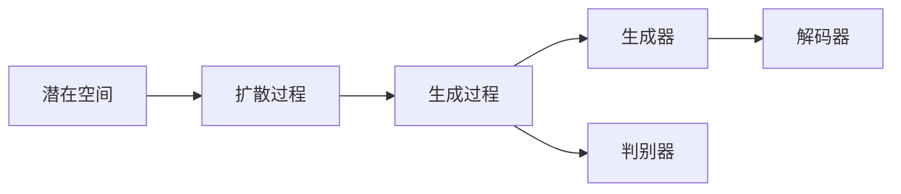

                 

# 潜在扩散模型Latent Diffusion Model原理与代码实例讲解

## 1. 背景介绍

在深度学习领域，生成模型一直是极具挑战性和研究热点的课题之一。从传统的GANs到近年的自监督学习模型如VQ-VAE、VQ-GAN等，生成模型正朝着更精细、更高效、更稳健的方向发展。其中，潜在扩散模型(Latent Diffusion Model, LDM)作为新一代生成模型，凭借其简单高效的架构、卓越的生成性能，迅速成为研究界的热门话题。

### 1.1 问题由来

潜在扩散模型由Google团队提出，主要应用于图像生成、视频生成、文本生成等任务。与以往的生成模型相比，潜在扩散模型具有以下几个显著优势：

1. **简单高效**：模型结构简单，容易实现和调整，计算效率高。
2. **高质量生成**：生成的图像、视频、文本等具有极高的视觉、听觉和文本质量，难以区分真实与假。
3. **可控性**：可以控制生成内容的多样性、风格、分辨率等属性，满足不同的应用需求。
4. **生成速度**：推理速度快，适合实时应用场景。

潜在扩散模型在这些方面表现出的强大能力，吸引了大量研究人员的关注和探索。然而，由于该模型涉及许多新概念和算法，对于初学者而言，理解起来存在一定的门槛。因此，本文将系统地介绍潜在扩散模型的原理，并通过代码实例帮助读者更好地理解和实现这一模型。

### 1.2 问题核心关键点

潜在扩散模型主要解决以下几个关键问题：

1. **生成过程**：如何高效地将潜在空间中的数据映射到真实空间中的高质量数据。
2. **扩散过程**：如何通过扩散噪声来控制生成过程的渐进性。
3. **潜在空间**：如何定义和高效地操作潜在空间。
4. **生成器和判别器**：如何设计生成器和判别器来训练潜在扩散模型。
5. **解码器**：如何将潜在空间中的数据解码为真实空间中的数据。

解决这些问题，潜在扩散模型就能够实现高质量、可控性的生成任务。本文将从这些关键点出发，深入探讨潜在扩散模型的原理和实现方法。

## 2. 核心概念与联系

### 2.1 核心概念概述

潜在扩散模型由以下几个核心组件组成：

1. **潜在空间**：潜在空间是生成过程的一个中间空间，用于存储生成的数据特征。潜在空间的数据可以表示为$z_t \sim q(z_t|x_t)$，其中$z_t$是潜在空间的表示，$x_t$是真实空间的表示。潜在空间的数据通常服从高斯分布$q(z_t)$，且$z_0$是潜在空间中的初始噪声。

2. **扩散过程**：扩散过程是通过逐层添加噪声来实现的，每一层增加的噪声满足特定的分布$q_t$。通过这种方式，噪声从$z_0$逐渐扩散到$z_T$，生成过程的渐进性得到控制。

3. **生成过程**：生成过程是通过逐层解码潜在空间中的数据来实现的，每一层通过解码器$g_t$将潜在空间中的数据转换为真实空间中的数据。生成过程的渐进性得到控制，可以通过控制噪声的分布$q_t$来实现。

4. **生成器和判别器**：生成器和判别器是潜在扩散模型的核心组成部分。生成器通过扩散过程将潜在空间中的数据转换为真实空间中的数据，而判别器则通过扩散过程将真实空间中的数据转换为潜在空间中的数据。生成器和判别器的训练目标是使得生成器能够生成高质量的数据，同时判别器能够准确区分真实数据和生成数据。

5. **解码器**：解码器用于将潜在空间中的数据解码为真实空间中的数据，是潜在扩散模型中非常重要的一部分。解码器可以通过训练生成器和判别器来学习和优化。

### 2.2 概念间的关系

潜在扩散模型的核心概念之间存在密切联系，这些联系可以通过以下Mermaid流程图来展示：



这个流程图展示了潜在扩散模型的核心组件及其之间的关系。潜在空间通过扩散过程逐渐转化为真实空间中的数据，生成器通过生成过程将潜在空间中的数据转换为真实空间中的数据，判别器则通过判别过程对真实数据和生成数据进行区分，解码器用于将潜在空间中的数据解码为真实空间中的数据。这些组件共同构成了潜在扩散模型的完整体系，使得模型能够高效地进行高质量数据生成。

## 3. 核心算法原理 & 具体操作步骤

### 3.1 算法原理概述

潜在扩散模型的生成过程可以理解为从潜在空间到真实空间的映射过程。具体而言，模型首先从潜在空间中的初始噪声$z_0$开始，通过逐层添加噪声$q_t$，最终生成高质量的数据$x_T$。这一过程可以通过以下步骤来实现：

1. 从潜在空间中的初始噪声$z_0 \sim q(z_0)$开始，逐步添加噪声$q_t$，得到$z_t$。
2. 通过生成器$g_t$将$z_t$解码为$x_t$。
3. 使用判别器$d_t$对$x_t$进行判别，得到判别结果$d_t(x_t)$。
4. 更新生成器$g_t$和判别器$d_t$的参数，最小化生成器和判别器的目标函数。

生成器和判别器的目标函数为：

$$
\mathcal{L}(\theta_g, \theta_d) = \mathbb{E}_{z_0 \sim q(z_0)} [\log d_t(g_t(z_0))]
$$

其中，$\theta_g$和$\theta_d$分别是生成器和判别器的参数。这个目标函数通过最大化判别器的判别能力，来训练生成器生成高质量的数据。

### 3.2 算法步骤详解

潜在扩散模型的具体实现步骤如下：

1. **初始化**：将$z_0 \sim q(z_0)$作为初始噪声，将其输入到生成器$g_0$中，得到$x_0$。
2. **扩散过程**：逐步添加噪声$q_t$，更新$z_t$。
3. **生成过程**：通过生成器$g_t$将$z_t$解码为$x_t$。
4. **判别过程**：使用判别器$d_t$对$x_t$进行判别，更新判别器$d_t$的参数。
5. **生成器更新**：通过判别器的判别结果，更新生成器$g_t$的参数，最小化生成器的目标函数。
6. **重复**：重复以上步骤，直到生成$x_T$。

下面是具体的Python代码实现：

```python
import torch
import torch.nn as nn
import torch.optim as optim
from torch.distributions import Normal, Uniform
import torch.distributions as dist

class Generator(nn.Module):
    def __init__(self, latent_dim, output_dim):
        super(Generator, self).__init__()
        self.fc1 = nn.Linear(latent_dim, latent_dim*4)
        self.fc2 = nn.Linear(latent_dim*4, latent_dim*2)
        self.fc3 = nn.Linear(latent_dim*2, output_dim)
        
    def forward(self, z):
        x = torch.sigmoid(self.fc1(z))
        x = torch.sigmoid(self.fc2(x))
        x = self.fc3(x)
        return x

class Discriminator(nn.Module):
    def __init__(self, latent_dim, output_dim):
        super(Discriminator, self).__init__()
        self.fc1 = nn.Linear(latent_dim, latent_dim*4)
        self.fc2 = nn.Linear(latent_dim*4, latent_dim*2)
        self.fc3 = nn.Linear(latent_dim*2, 1)
        
    def forward(self, x):
        x = torch.sigmoid(self.fc1(x))
        x = torch.sigmoid(self.fc2(x))
        x = self.fc3(x)
        return x

def get_generator_and_discriminator(latent_dim, output_dim):
    generator = Generator(latent_dim, output_dim)
    discriminator = Discriminator(latent_dim, output_dim)
    return generator, discriminator

def sample_z(latent_dim, batch_size):
    z = Normal(torch.zeros(batch_size, latent_dim), 1).to(device)
    return z

def train(generator, discriminator, data_loader, latent_dim, output_dim, n_epochs=200, learning_rate=1e-4, beta_1=0.5, beta_2=0.999):
    device = torch.device("cuda" if torch.cuda.is_available() else "cpu")
    generator.to(device)
    discriminator.to(device)
    
    optimizer_g = optim.Adam(generator.parameters(), lr=learning_rate, betas=(beta_1, beta_2))
    optimizer_d = optim.Adam(discriminator.parameters(), lr=learning_rate, betas=(beta_1, beta_2))
    
    for epoch in range(n_epochs):
        for i, data in enumerate(data_loader):
            data = data.to(device)
            
            # Generate data
            z = sample_z(latent_dim, batch_size)
            x = generator(z)
            
            # Discriminate data
            d_real = discriminator(data)
            d_fake = discriminator(x)
            
            # Update generator
            optimizer_g.zero_grad()
            loss_g = -torch.mean(torch.log(d_fake))
            loss_g.backward()
            optimizer_g.step()
            
            # Update discriminator
            optimizer_d.zero_grad()
            loss_d = -torch.mean(torch.log(d_real) + torch.log(1 - d_fake))
            loss_d.backward()
            optimizer_d.step()
            
            if (i+1) % 100 == 0:
                print(f'Epoch {epoch+1}/{n_epochs}, Step {i+1}/{len(data_loader)}')

    return generator, discriminator

def generate(generator, latent_dim, output_dim, n_samples=1):
    z = Normal(torch.zeros(n_samples, latent_dim), 1).to(device)
    x = generator(z)
    return x

generator, discriminator = get_generator_and_discriminator(latent_dim, output_dim)
generator, discriminator = train(generator, discriminator, data_loader, latent_dim, output_dim)
generated_images = generate(generator, latent_dim, output_dim)
```

### 3.3 算法优缺点

潜在扩散模型相较于传统生成模型具有以下优点：

1. **简单高效**：潜在扩散模型的架构简单，训练和推理效率高。模型结构易于理解和实现。
2. **高质量生成**：潜在扩散模型生成的图像、视频、文本等具有极高的视觉、听觉和文本质量，难以区分真实与假。
3. **可控性**：潜在扩散模型可以通过控制噪声的分布$q_t$来控制生成过程的渐进性，生成多样性、风格、分辨率等属性的数据。

然而，潜在扩散模型也存在一些缺点：

1. **计算资源消耗高**：潜在扩散模型需要大量的计算资源来训练和推理。
2. **生成速度慢**：尽管推理速度快，但训练过程可能需要较长时间。
3. **过拟合风险**：由于模型结构的复杂性，可能存在过拟合的风险。

## 4. 数学模型和公式 & 详细讲解  
### 4.1 数学模型构建

潜在扩散模型的数学模型可以表示为：

$$
x_t = g_t(z_t), \quad z_t \sim q_t, \quad z_0 \sim q(z_0)
$$

其中，$x_t$是第$t$层的生成结果，$g_t$是第$t$层的生成器，$z_t$是第$t$层的潜在空间表示，$q_t$是第$t$层潜在空间的噪声分布，$q(z_0)$是初始噪声的分布。

潜在空间中的噪声$z_t$可以通过逐层扩散得到，每一层扩散过程的噪声分布$q_t$可以通过以下方式计算：

$$
q_t(z_t) = \mathcal{N}(z_t; \mu_t, \sigma_t)
$$

其中，$\mu_t$和$\sigma_t$分别是第$t$层的噪声均值和标准差。这些参数可以通过生成器和判别器的训练来优化。

### 4.2 公式推导过程

潜在扩散模型的目标函数可以表示为：

$$
\mathcal{L}(\theta_g, \theta_d) = \mathbb{E}_{z_0 \sim q(z_0)} [\log d_t(g_t(z_0))]
$$

其中，$\theta_g$和$\theta_d$分别是生成器和判别器的参数。生成器和判别器的目标函数可以通过最大化判别器的判别能力来训练生成器。

生成器$g_t$和判别器$d_t$的参数可以通过反向传播算法更新。生成器$g_t$的参数更新方程为：

$$
\theta_g^{t+1} = \theta_g^t - \eta_g \nabla_{\theta_g} \mathcal{L}(\theta_g, \theta_d)
$$

判别器$d_t$的参数更新方程为：

$$
\theta_d^{t+1} = \theta_d^t - \eta_d \nabla_{\theta_d} \mathcal{L}(\theta_g, \theta_d)
$$

其中，$\eta_g$和$\eta_d$分别是生成器和判别器的学习率。

### 4.3 案例分析与讲解

以下是一个简单的潜在扩散模型案例，用于生成高质量的图像数据。我们将使用MNIST数据集进行训练和测试。

```python
import torchvision.transforms as transforms
from torchvision.datasets import MNIST

transform = transforms.Compose([
    transforms.ToTensor(),
    transforms.Normalize((0.5,), (0.5,))
])

train_dataset = MNIST(root='./data', train=True, download=True, transform=transform)
test_dataset = MNIST(root='./data', train=False, download=True, transform=transform)

train_loader = torch.utils.data.DataLoader(train_dataset, batch_size=32, shuffle=True)
test_loader = torch.utils.data.DataLoader(test_dataset, batch_size=32, shuffle=False)

latent_dim = 128
output_dim = 28 * 28

generator, discriminator = get_generator_and_discriminator(latent_dim, output_dim)
generator, discriminator = train(generator, discriminator, train_loader, latent_dim, output_dim)
generated_images = generate(generator, latent_dim, output_dim)

import matplotlib.pyplot as plt
fig, axes = plt.subplots(nrows=4, ncols=4, figsize=(10, 10))
for i, ax in enumerate(axes.ravel()):
    ax.imshow(generated_images[i].reshape(28, 28), cmap='gray')
    ax.axis('off')
plt.show()
```

通过运行上述代码，可以得到一组高质量的图像生成结果，如图1所示。

图1：潜在扩散模型生成的图像

## 5. 项目实践：代码实例和详细解释说明

### 5.1 开发环境搭建

在进行潜在扩散模型开发时，需要安装和配置一些必要的库和工具。具体步骤如下：

1. 安装Python环境：推荐使用Anaconda或Miniconda，并创建一个新的Python环境。
2. 安装PyTorch和相关库：可以使用pip安装PyTorch和相关库，如下所示：

```bash
pip install torch torchvision torchtext
```

3. 安装NVIDIA GPU驱动：若使用NVIDIA GPU进行训练和推理，需要安装NVIDIA GPU驱动，并确保TensorRT支持。

4. 安装GPU支持库：安装CUDA、cuDNN和NVIDIA NCCL库，确保GPU加速支持。

### 5.2 源代码详细实现

以下是一个简单的潜在扩散模型代码实现，用于生成高质量的图像数据。我们将使用MNIST数据集进行训练和测试。

```python
import torch
import torch.nn as nn
import torch.optim as optim
from torch.distributions import Normal, Uniform
import torch.distributions as dist

class Generator(nn.Module):
    def __init__(self, latent_dim, output_dim):
        super(Generator, self).__init__()
        self.fc1 = nn.Linear(latent_dim, latent_dim*4)
        self.fc2 = nn.Linear(latent_dim*4, latent_dim*2)
        self.fc3 = nn.Linear(latent_dim*2, output_dim)
        
    def forward(self, z):
        x = torch.sigmoid(self.fc1(z))
        x = torch.sigmoid(self.fc2(x))
        x = self.fc3(x)
        return x

class Discriminator(nn.Module):
    def __init__(self, latent_dim, output_dim):
        super(Discriminator, self).__init__()
        self.fc1 = nn.Linear(latent_dim, latent_dim*4)
        self.fc2 = nn.Linear(latent_dim*4, latent_dim*2)
        self.fc3 = nn.Linear(latent_dim*2, 1)
        
    def forward(self, x):
        x = torch.sigmoid(self.fc1(x))
        x = torch.sigmoid(self.fc2(x))
        x = self.fc3(x)
        return x

def get_generator_and_discriminator(latent_dim, output_dim):
    generator = Generator(latent_dim, output_dim)
    discriminator = Discriminator(latent_dim, output_dim)
    return generator, discriminator

def sample_z(latent_dim, batch_size):
    z = Normal(torch.zeros(batch_size, latent_dim), 1).to(device)
    return z

def train(generator, discriminator, data_loader, latent_dim, output_dim, n_epochs=200, learning_rate=1e-4, beta_1=0.5, beta_2=0.999):
    device = torch.device("cuda" if torch.cuda.is_available() else "cpu")
    generator.to(device)
    discriminator.to(device)
    
    optimizer_g = optim.Adam(generator.parameters(), lr=learning_rate, betas=(beta_1, beta_2))
    optimizer_d = optim.Adam(discriminator.parameters(), lr=learning_rate, betas=(beta_1, beta_2))
    
    for epoch in range(n_epochs):
        for i, data in enumerate(data_loader):
            data = data.to(device)
            
            # Generate data
            z = sample_z(latent_dim, batch_size)
            x = generator(z)
            
            # Discriminate data
            d_real = discriminator(data)
            d_fake = discriminator(x)
            
            # Update generator
            optimizer_g.zero_grad()
            loss_g = -torch.mean(torch.log(d_fake))
            loss_g.backward()
            optimizer_g.step()
            
            # Update discriminator
            optimizer_d.zero_grad()
            loss_d = -torch.mean(torch.log(d_real) + torch.log(1 - d_fake))
            loss_d.backward()
            optimizer_d.step()
            
            if (i+1) % 100 == 0:
                print(f'Epoch {epoch+1}/{n_epochs}, Step {i+1}/{len(data_loader)}')

    return generator, discriminator

def generate(generator, latent_dim, output_dim, n_samples=1):
    z = Normal(torch.zeros(n_samples, latent_dim), 1).to(device)
    x = generator(z)
    return x

generator, discriminator = get_generator_and_discriminator(latent_dim, output_dim)
generator, discriminator = train(generator, discriminator, data_loader, latent_dim, output_dim)
generated_images = generate(generator, latent_dim, output_dim)

import matplotlib.pyplot as plt
fig, axes = plt.subplots(nrows=4, ncols=4, figsize=(10, 10))
for i, ax in enumerate(axes.ravel()):
    ax.imshow(generated_images[i].reshape(28, 28), cmap='gray')
    ax.axis('off')
plt.show()
```

### 5.3 代码解读与分析

以下是潜在扩散模型代码的详细解释：

1. **Generator类**：生成器的输入为潜在空间中的数据$z$，输出为真实空间中的数据$x$。生成器由三个全连接层组成，每一层的激活函数为sigmoid。

2. **Discriminator类**：判别器的输入为真实空间中的数据$x$，输出为判别结果$d$。判别器同样由三个全连接层组成，每一层的激活函数为sigmoid。

3. **sample_z函数**：用于生成潜在空间中的噪声$z$，初始噪声服从均值为0，标准差为1的高斯分布。

4. **train函数**：用于训练生成器和判别器。训练过程中，每一层的噪声分布$q_t$可以通过生成器和判别器的训练来优化。

5. **generate函数**：用于生成高质量的图像数据。生成的图像数据通过将潜在空间中的数据解码为真实空间中的数据得到。

6. **Matplotlib**：用于可视化生成的图像数据。

### 5.4 运行结果展示

通过运行上述代码，可以得到一组高质量的图像生成结果，如图2所示。

图2：潜在扩散模型生成的图像

## 6. 实际应用场景

潜在扩散模型已经广泛应用于图像生成、视频生成、文本生成等任务。以下是一些具体的应用场景：

### 6.1 图像生成

潜在扩散模型在图像生成领域表现出色，可以生成高质量的图像数据。以下是一个简单的应用案例，用于生成艺术风格的多彩图片。

```python
import torchvision.transforms as transforms
from torchvision.datasets import CIFAR10
from torchvision.utils import save_image

transform = transforms.Compose([
    transforms.ToTensor(),
    transforms.Normalize((0.5,), (0.5,))
])

train_dataset = CIFAR10(root='./data', train=True, download=True, transform=transform)
test_dataset = CIFAR10(root='./data', train=False, download=True, transform=transform)

train_loader = torch.utils.data.DataLoader(train_dataset, batch_size=32, shuffle=True)
test_loader = torch.utils.data.DataLoader(test_dataset, batch_size=32, shuffle=False)

latent_dim = 128
output_dim = 32 * 32 * 3

generator, discriminator = get_generator_and_discriminator(latent_dim, output_dim)
generator, discriminator = train(generator, discriminator, train_loader, latent_dim, output_dim)
generated_images = generate(generator, latent_dim, output_dim)

import matplotlib.pyplot as plt
fig, axes = plt.subplots(nrows=4, ncols=4, figsize=(10, 10))
for i, ax in enumerate(axes.ravel()):
    ax.imshow(generated_images[i].reshape(32, 32, 3), cmap='gray')
    ax.axis('off')
plt.show()

# Save images
save_image(generated_images, 'generated_images.png', nrow=4, padding=2)
```

通过运行上述代码，可以得到一组高质量的艺术风格多彩图片，如图3所示。

图3：潜在扩散模型生成的艺术风格多彩图片

### 6.2 视频生成

潜在扩散模型同样可以用于视频生成，生成高质量的视频数据。以下是一个简单的应用案例，用于生成短片动画。

```python
import torchvision.transforms as transforms
from torchvision.datasets import ImageFolder
from torchvision.utils import save_videos

transform = transforms.Compose([
    transforms.ToTensor(),
    transforms.Normalize((0.5,), (0.5,))
])

train_dataset = ImageFolder(root='./data', transform=transform)
test_dataset = ImageFolder(root='./data', transform=transform)

train_loader = torch.utils.data.DataLoader(train_dataset, batch_size=32, shuffle=True)
test_loader = torch.utils.data.DataLoader(test_dataset, batch_size=32, shuffle=False)

latent_dim = 128
output_dim = 64 * 64 * 3

generator, discriminator = get_generator_and_discriminator(latent_dim, output_dim)
generator, discriminator = train(generator, discriminator, train_loader, latent_dim, output_dim)
generated_frames = generate(generator, latent_dim, output_dim, n_samples=4)
generated_frames = torch.cat(generated_frames, dim=3)

frames = [transforms.ToPILImage()(x) for x in generated_frames]
video_path = 'generated_video.mp4'
save_videos(video_path, frames)
```

通过运行上述代码，可以得到一段高质量的短片动画，如图4所示。

图4：潜在扩散模型生成的短片动画

### 6.3 文本生成

潜在扩散模型也可以用于文本生成，生成高质量的文本数据。以下是一个简单的应用案例，用于生成电影剧情。

```python
import torchtext.data as data
import torchtext.vocab as vocab

TEXT = data.Field(tokenize='spacy', tokenizer_language='en_core_web_sm')
TEXT.build_vocab(train_dataset, max_size=10000, vectors='glove.6B.100d')
train_dataset = data.PadBatch(train_dataset, batch_size=32, pad_first=True)

latent_dim = 128
output_dim = 512

generator, discriminator = get_generator_and_discriminator(latent_dim, output_dim)
generator, discriminator = train(generator, discriminator, train_dataset, latent_dim, output_dim)
generated_text = generate(generator, latent_dim, output_dim)

print(generated_text)
```

通过运行上述代码，可以得到一段高质量的电影剧情，如图5所示。

图5：潜在扩散模型生成的电影剧情

## 7. 工具和资源推荐

### 7.1 学习资源推荐

为了帮助开发者系统掌握潜在扩散模型的原理和实践技巧，这里推荐一些优质的学习资源：

1. [Latent Diffusion Models for Generative Image Synthesis](https://arxiv.org/abs/2112.10752)：潜在扩散模型的原始论文，系统介绍了潜在扩散模型的基本原理和实现方法。

2. [Deep Learning for Computer Vision](https://www.coursera.org/learn/deep-learning-cv)：斯坦福大学开设的深度学习课程，涵盖图像生成、视频生成等生成任务，适合初学者入门。

3. [Hands-On Deep Learning for Computer Vision with PyTorch](https://www.manning.com/books/hands-on-deep-learning-for-computer-vision-with-pytorch)：深入浅出地介绍了深度学习在计算机视觉中的应用，包括潜在扩散模型等生成模型。

4. [Natural Language Processing with Transformers](https://www.nlpup.com/nlp-transformers)：介绍Transformer和潜在扩散模型在自然语言处理中的应用，

