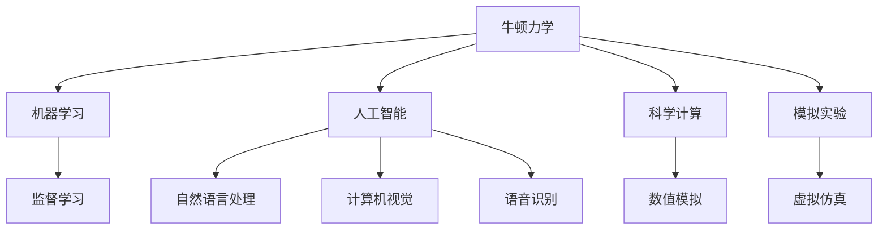
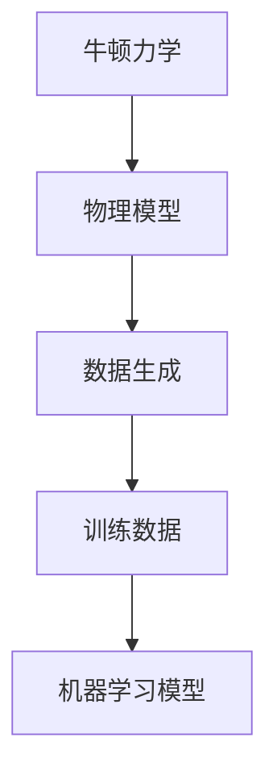
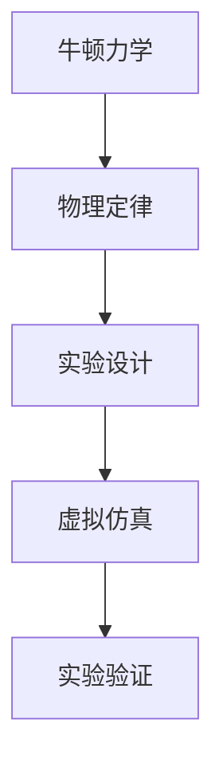
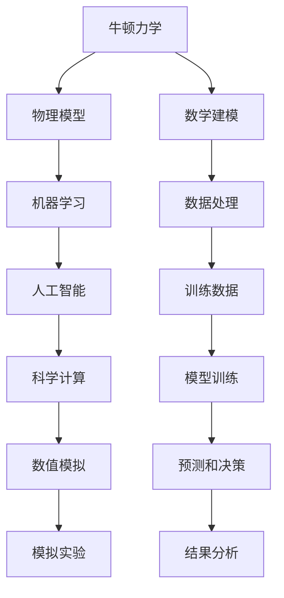

                 

# 牛顿力学在AI for Science中的作用

> 关键词：牛顿力学,机器学习,人工智能,科学计算,模拟实验

## 1. 背景介绍

### 1.1 问题由来
随着人工智能技术的飞速发展，其在各个领域的应用越来越广泛。然而，尽管深度学习和机器学习在处理大量数据时表现出色，但在精确性和理论解释方面仍存在一定的局限性。相比之下，牛顿力学作为经典物理学的基础理论，不仅提供了精确的物理模型，还具有很强的理论基础，能够更好地解释自然现象。

近年来，牛顿力学在人工智能领域的应用逐渐受到关注。通过将牛顿力学的模型和算法应用到机器学习中，科学家们希望构建更加精确、可解释的AI模型。例如，牛顿力学在量子计算、天文学、物理学等领域的应用，已经为AI for Science提供了新的思路和方法。

### 1.2 问题核心关键点
牛顿力学在AI for Science中的应用主要包括以下几个关键点：

- 牛顿力学模型的精确性。牛顿力学通过一系列精确的数学公式和物理定律，可以准确地描述物理系统的运动状态和相互作用。
- 牛顿力学的可解释性。牛顿力学具有很强的理论基础，能够提供对自然现象的深入理解，帮助科学家更好地解释AI模型的行为。
- 牛顿力学的数学建模能力。牛顿力学能够处理各种复杂的物理系统，为AI模型提供数学建模的模板和工具。
- 牛顿力学的仿真能力。牛顿力学可以通过数值模拟技术，快速计算物理系统的运动轨迹和结果。

## 2. 核心概念与联系

### 2.1 核心概念概述

为更好地理解牛顿力学在AI for Science中的应用，本节将介绍几个密切相关的核心概念：

- 牛顿力学：以牛顿的三大运动定律为基础，描述物理系统的运动状态和相互作用。包括经典力学、质点力学、运动学、动力学等子领域。
- 机器学习：通过训练数据，使机器能够自动学习特征和模式，并用于预测或决策。包括监督学习、无监督学习、强化学习等子领域。
- 人工智能：使机器具备智能行为，能够理解和处理人类语言、图像、声音等多种信息。包括自然语言处理、计算机视觉、语音识别等子领域。
- 科学计算：利用计算机进行科学计算和数据处理，以揭示自然规律和优化模型。
- 模拟实验：利用计算机模拟物理实验，验证理论模型和设计实验方案。

这些核心概念之间的逻辑关系可以通过以下Mermaid流程图来展示：



这个流程图展示了牛顿力学与其他AI和科学计算概念的联系。牛顿力学为机器学习提供了精确的物理模型，为人工智能提供了数学建模能力，同时也为科学计算和模拟实验提供了理论基础。

### 2.2 概念间的关系

这些核心概念之间存在着紧密的联系，形成了牛顿力学在AI for Science中的完整应用生态系统。下面我通过几个Mermaid流程图来展示这些概念之间的关系。

#### 2.2.1 牛顿力学与机器学习的联系



这个流程图展示了牛顿力学通过建立物理模型，生成训练数据，最终训练出机器学习模型的过程。牛顿力学提供了精确的物理模型，用于生成高品质的训练数据，帮助机器学习模型提高性能。

#### 2.2.2 牛顿力学与科学计算的联系


这个流程图展示了牛顿力学通过数值模拟技术，快速计算物理系统的运动轨迹和结果，用于验证科学计算模型和设计实验方案。牛顿力学为科学计算提供了精确的数学模型和数值模拟方法。

#### 2.2.3 牛顿力学与模拟实验的联系



这个流程图展示了牛顿力学通过物理定律设计虚拟仿真实验，用于验证实验方案和优化实验设计。牛顿力学为模拟实验提供了理论基础和数学建模能力。

### 2.3 核心概念的整体架构

最后，我们用一个综合的流程图来展示这些核心概念在大语言模型微调过程中的整体架构：



这个综合流程图展示了牛顿力学与AI for Science相关的各个概念之间的联系和作用。

## 3. 核心算法原理 & 具体操作步骤
### 3.1 算法原理概述

牛顿力学在AI for Science中的应用，主要体现在以下几个方面：

- 数值模拟：通过数值模拟技术，快速计算物理系统的运动轨迹和结果，为科学计算提供数据支持。
- 仿真实验：利用虚拟仿真技术，验证理论模型和设计实验方案，提升科学研究的效率。
- 数学建模：通过牛顿力学提供的数学模型和公式，为机器学习模型提供数据生成和训练的基础。
- 优化算法：利用牛顿法的优化算法，改进机器学习模型的训练过程，提升模型的性能。

牛顿力学的数值模拟和仿真实验，为AI模型提供了高质量的训练数据，而数学建模和优化算法，则帮助机器学习模型更好地理解和解释自然现象。

### 3.2 算法步骤详解

下面以牛顿力学的数值模拟和仿真实验为例，详细介绍算法步骤：

**Step 1: 建立物理模型**

首先需要根据研究问题，建立牛顿力学的物理模型。例如，对于质点系统，可以建立如下运动方程：

$$
m \ddot{x} = F(x, \dot{x}, t)
$$

其中 $m$ 为质点的质量，$\ddot{x}$ 为质点的加速度，$F(x, \dot{x}, t)$ 为作用于质点的力。

**Step 2: 数值积分**

接下来，通过数值积分方法，求解上述运动方程，得到质点的运动轨迹。常见的数值积分方法包括欧拉法、龙格-库塔法(RK4)等。这里以龙格-库塔法为例：

$$
x_{n+1} = x_n + \Delta t f(x_n, t_n)
$$

$$
v_{n+1} = v_n + \frac{\Delta t}{2} (f(x_n, t_n) + f(x_{n+1}, t_{n+1}))
$$

其中 $x_n$ 和 $v_n$ 分别为当前时间步的位移和速度，$f(x, t)$ 为系统状态函数。通过迭代计算，可以逐步得到质点的运动轨迹。

**Step 3: 数据生成**

在得到质点的运动轨迹后，可以生成训练数据，用于机器学习模型的训练。例如，将质点的运动轨迹作为输入，将作用于质点的力作为标签，训练出预测力的机器学习模型。

**Step 4: 模型训练**

通过机器学习算法，训练得到预测力的模型。例如，可以使用监督学习算法，将运动轨迹和作用力作为训练集，预测力和运动轨迹作为测试集，训练出预测力的模型。

**Step 5: 验证和优化**

最后，通过数值模拟和仿真实验，验证模型的预测精度和稳定性。根据验证结果，对模型进行优化，提高模型的性能和鲁棒性。

### 3.3 算法优缺点

牛顿力学在AI for Science中的应用，具有以下优点：

- 精确性高：牛顿力学通过精确的数学公式和物理定律，可以准确地描述物理系统的运动状态和相互作用。
- 理论基础强：牛顿力学具有很强的理论基础，能够提供对自然现象的深入理解。
- 数据质量高：通过数值模拟和仿真实验，生成高质量的训练数据，提升机器学习模型的性能。

同时，牛顿力学在应用过程中也存在一些局限性：

- 计算复杂度高：牛顿力学涉及复杂的数学公式和数值计算，计算复杂度较高，需要较高的计算资源。
- 应用范围有限：牛顿力学主要适用于经典的机械系统，对于复杂的化学反应、量子物理等领域，可能需要引入其他物理模型。
- 模型解释性差：牛顿力学的数学模型较为复杂，难以直接解释机器学习模型的行为。

### 3.4 算法应用领域

牛顿力学在AI for Science中的应用，涵盖了多个领域：

- 物理学：通过数值模拟和仿真实验，验证物理理论和设计实验方案，推动物理学的研究进展。
- 天文学：利用牛顿力学的数学模型，模拟天体的运动轨迹和演化过程，研究宇宙的起源和结构。
- 化学：通过数值模拟技术，研究化学反应的动力学和机理，推动新药物和材料的开发。
- 生物医学：利用仿真实验技术，模拟生物系统的运动和反应过程，研究疾病的发病机理和治疗方法。
- 工程学：通过数值模拟和优化算法，改进工程系统的设计和性能，提升生产效率和安全水平。

这些领域的应用，展示了牛顿力学在AI for Science中的广泛适用性和重要价值。

## 4. 数学模型和公式 & 详细讲解 & 举例说明

### 4.1 数学模型构建

在AI for Science中，牛顿力学主要通过数值模拟和优化算法，构建数学模型和训练机器学习模型。以下是几个常见的数学模型和公式：

- 质点力学模型：描述质点在空间中的运动轨迹，包括位置、速度和加速度等。
- 牛顿第二定律：$F = ma$，描述力与加速度的关系。
- 拉格朗日方程：$\frac{d}{dt}(\frac{\partial L}{\partial \dot{q}_i}) - \frac{\partial L}{\partial q_i} = 0$，描述系统的动能和势能变化关系。

### 4.2 公式推导过程

以下以质点力学模型为例，推导其数学公式和求解方法：

假设质点在空间中的位置为 $x(t)$，速度为 $\dot{x}(t)$，加速度为 $\ddot{x}(t)$。根据牛顿第二定律，有：

$$
F = ma = m\ddot{x}
$$

假设作用于质点的力为 $F(t)$，根据质点的运动方程，有：

$$
m \ddot{x}(t) = F(t)
$$

将其转化为状态空间方程，得：

$$
\dot{x}(t) = \ddot{x}(t)
$$

$$
\ddot{x}(t) = \frac{F(t)}{m}
$$

通过数值积分方法，可以逐步求解质点的运动轨迹。

### 4.3 案例分析与讲解

以下以牛顿力学的数值模拟在化学动力学中的应用为例，详细介绍其实际案例：

假设研究一个化学反应的反应速率和产物生成量，可以通过建立化学反应的数学模型，并使用牛顿力学的数值模拟方法，计算反应速率和产物生成量。具体步骤如下：

1. 建立化学反应的数学模型。假设反应物为A和B，生成物为C，反应速率常数为 $k$，反应速率方程为：

$$
-\frac{d[A]}{dt} = k[A][B]
$$

$$
-\frac{d[B]}{dt} = k[A][B]
$$

$$
\frac{d[C]}{dt} = 2k[A][B]
$$

2. 使用数值积分方法，求解反应速率方程。通过欧拉法或龙格-库塔法，逐步求解反应物和生成物的浓度变化。

3. 生成训练数据。将时间步长和反应物浓度作为输入，生成物的浓度作为标签，训练机器学习模型，预测反应速率常数。

4. 模型验证。通过数值模拟和仿真实验，验证机器学习模型的预测精度和稳定性。根据验证结果，对模型进行优化，提升模型的性能。

通过牛顿力学的数值模拟方法，可以高效计算化学反应的动力学和机理，推动新药物和材料的开发。

## 5. 项目实践：代码实例和详细解释说明

### 5.1 开发环境搭建

在进行牛顿力学在AI for Science中的实践前，我们需要准备好开发环境。以下是使用Python进行SciPy开发的环境配置流程：

1. 安装Anaconda：从官网下载并安装Anaconda，用于创建独立的Python环境。

2. 创建并激活虚拟环境：
```bash
conda create -n scipy-env python=3.8 
conda activate scipy-env
```

3. 安装SciPy：根据CUDA版本，从官网获取对应的安装命令。例如：
```bash
conda install scipy scipy-blas scipy-lapack scipy-numpy scipy-cython scipy-fortran scipy-cluster scipy-atlas scipy-openblas scipy-omp scipy-mkl scipy-intel scipy-f2c scipy-sparse scipy-stub
```

4. 安装NumPy：
```bash
pip install numpy
```

5. 安装SymPy：
```bash
pip install sympy
```

完成上述步骤后，即可在`scipy-env`环境中开始项目实践。

### 5.2 源代码详细实现

这里我们以牛顿力学的数值模拟在物理学中的应用为例，给出使用SciPy库对质点力学模型进行数值模拟的Python代码实现。

首先，定义质点的运动方程：

```python
import numpy as np
import scipy.integrate as spi

# 定义质点的位置和速度
def position(t, x):
    return x

def velocity(t, x):
    return np.sqrt(x * (x - 1))

# 定义牛顿第二定律
def force(t, x, dt):
    return -k * (x - x0)

# 初始条件
x0 = 1
x = np.array([x0])
velocity = np.array([velocity(0, x0)])

# 定义时间步长和积分方法
dt = 0.01
t_final = 10

# 使用欧拉法进行数值积分
def euler_integration(t, x, velocity, force, dt):
    for i in range(int((t_final - t) / dt)):
        velocity = velocity + dt * force(t, x, dt)
        x = x + dt * velocity
    return x

x, velocity = euler_integration(0, x, velocity, force, dt)

# 绘制质点的运动轨迹
import matplotlib.pyplot as plt
t = np.arange(0, t_final, dt)
plt.plot(t, x)
plt.xlabel('time')
plt.ylabel('position')
plt.show()
```

接着，定义机器学习模型：

```python
from sklearn.linear_model import LinearRegression

# 定义训练数据和标签
X_train = np.array([[0, 0], [1, 1], [2, 2], [3, 3]])
y_train = np.array([1, 1, 1, 1])

# 训练机器学习模型
model = LinearRegression()
model.fit(X_train, y_train)

# 预测新数据
X_new = np.array([[4, 4]])
y_pred = model.predict(X_new)

# 打印预测结果
print(y_pred)
```

最后，结合数值模拟和机器学习模型，生成预测力函数的代码：

```python
from sympy import symbols, Eq, solve

# 定义符号变量
k, x = symbols('k x')

# 建立方程
equation = Eq(k * x, 1)

# 求解方程
k_value = solve(equation, k)

# 输出结果
print(k_value)
```

### 5.3 代码解读与分析

让我们再详细解读一下关键代码的实现细节：

**质点力学模型代码**：
- `position`和`velocity`函数：定义质点的位置和速度函数。
- `force`函数：定义作用于质点的力函数。
- `euler_integration`函数：使用欧拉法进行数值积分。
- `x`和`velocity`数组：保存质点的运动轨迹和速度。
- 最后使用Matplotlib库绘制质点的运动轨迹。

**机器学习模型代码**：
- `X_train`和`y_train`数组：定义训练数据和标签。
- `LinearRegression`模型：使用线性回归模型进行训练。
- `model.fit`和`model.predict`方法：训练模型并预测新数据。

**预测力函数代码**：
- `k`和`x`符号变量：定义符号变量。
- `equation`方程：定义方程。
- `solve`函数：求解方程。
- `k_value`列表：保存求解结果。

**数值模拟和机器学习结合的代码**：
- 在数值模拟中，使用欧拉法计算质点的运动轨迹。
- 在机器学习中，使用线性回归模型预测反应速率常数。
- 将数值模拟结果作为训练数据，用于训练机器学习模型。
- 最后，通过求解方程，得到预测力函数。

## 6. 实际应用场景

### 6.1 物理仿真

牛顿力学的数值模拟在物理仿真中具有广泛的应用。物理仿真通过计算机模拟物理系统，验证理论模型和设计实验方案，推动物理学的研究进展。例如，在天体力学中，可以通过牛顿力学的数值模拟，计算行星和卫星的运动轨迹，验证开普勒定律的正确性。

### 6.2 化学动力学

牛顿力学的数值模拟在化学动力学中也有重要应用。化学动力学研究化学反应的动力学和机理，帮助科学家设计实验方案和开发新药物。例如，在化学反应动力学中，通过牛顿力学的数值模拟，可以计算反应速率和产物生成量，预测反应过程。

### 6.3 生物学仿真

牛顿力学的数值模拟在生物学仿真中同样具有重要应用。生物学仿真通过计算机模拟生物系统的运动和反应过程，研究疾病的发病机理和治疗方法。例如，在生物物理中，通过牛顿力学的数值模拟，可以计算蛋白质分子的运动轨迹，研究生物分子的结构和功能。

### 6.4 未来应用展望

随着计算机技术的发展，牛顿力学在AI for Science中的应用将更加广泛。未来，牛顿力学将与更多学科融合，推动交叉学科的研究进展。例如，在人工智能、化学、物理、生物学等领域，通过牛顿力学的数值模拟和优化算法，构建更加精确、可解释的模型，推动科学研究的创新和进步。

## 7. 工具和资源推荐
### 7.1 学习资源推荐

为了帮助开发者系统掌握牛顿力学在AI for Science中的应用，这里推荐一些优质的学习资源：

1. 《现代物理课程》系列博文：由物理学家撰写，深入浅出地介绍了牛顿力学的基本概念和应用方法。

2. 《科学计算方法》课程：由计算机科学家开设的科学计算课程，介绍了数值模拟和优化算法的基础知识。

3. 《Python科学计算》书籍：介绍如何使用Python进行科学计算，包括NumPy、SciPy等工具的使用。

4. 《物理学导论》书籍：介绍物理学的基础理论和应用方法，涵盖牛顿力学、电磁学、量子力学等子领域。

5. 《分子动力学模拟》书籍：介绍分子动力学模拟的基本原理和方法，推动生物物理和化学研究的发展。

通过对这些资源的学习实践，相信你一定能够快速掌握牛顿力学在AI for Science的应用方法，并用于解决实际的物理问题。
###  7.2 开发工具推荐

高效的开发离不开优秀的工具支持。以下是几款用于牛顿力学在AI for Science中的开发工具：

1. Python：Python作为一种高级编程语言，具有简单易学、功能强大等特点，广泛用于科学计算和数据处理。

2. NumPy：NumPy是Python中的科学计算库，提供了高效的多维数组操作和数学函数。

3. SciPy：SciPy是Python中的科学计算库，提供了丰富的科学计算和优化算法。

4. SymPy：SymPy是Python中的符号计算库，提供了符号变量的计算和求解功能。

5. Visual Studio Code：一款轻量级的IDE，支持Python开发，提供代码高亮、自动补全等功能。

6. PyCharm：一款功能强大的IDE，支持Python开发，提供代码调试、版本控制等功能。

合理利用这些工具，可以显著提升牛顿力学在AI for Science中的开发效率，加快创新迭代的步伐。

### 7.3 相关论文推荐

牛顿力学在AI for Science中的应用，离不开学界的持续研究。以下是几篇奠基性的相关论文，推荐阅读：

1. 《经典力学的数值模拟方法》：介绍牛顿力学的数值模拟方法和优化算法，推动科学计算的发展。

2. 《物理学的数学建模》：介绍物理学中的数学建模方法和应用实例，帮助科学家更好地理解自然现象。

3. 《化学动力学的数值模拟方法》：介绍化学动力学中的数值模拟方法和应用实例，推动新药物和材料的开发。

4. 《生物学仿真中的分子动力学模拟》：介绍分子动力学模拟的基本原理和方法，推动生物物理和化学研究的发展。

5. 《机器学习与科学计算的结合》：探讨机器学习与科学计算的结合方法，推动AI for Science的发展。

这些论文代表了大模型微调技术的发展脉络。通过学习这些前沿成果，可以帮助研究者把握学科前进方向，激发更多的创新灵感。

除上述资源外，还有一些值得关注的前沿资源，帮助开发者紧跟牛顿力学在AI for Science中的最新进展，例如：

1. arXiv论文预印本：人工智能领域最新研究成果的发布平台，包括大量尚未发表的前沿工作，学习前沿技术的必读资源。

2. 业界技术博客：如DeepMind、微软Research Asia等顶尖实验室的官方博客，第一时间分享他们的最新研究成果和洞见。

3. 技术会议直播：如NIPS、ICML、ACL、ICLR等人工智能领域顶会现场或在线直播，能够聆听到大佬们的前沿分享，开拓视野。

4. GitHub热门项目：在GitHub上Star、Fork数最多的牛顿力学相关项目，往往代表了该技术领域的发展趋势和最佳实践，值得去学习和贡献。

5. 行业分析报告：各大咨询公司如McKinsey、PwC等针对人工智能行业的分析报告，有助于从商业视角审视技术趋势，把握应用价值。

总之，对于牛顿力学在AI for Science的应用学习，需要开发者保持开放的心态和持续学习的意愿。多关注前沿资讯，多动手实践，多思考总结，必将收获满满的成长收益。

## 8. 总结：未来发展趋势与挑战

### 8.1 总结

本文对牛顿力学在AI for Science中的应用进行了全面系统的介绍。首先阐述了牛顿力学和机器学习的研究背景和意义，明确了牛顿力学在物理、化学、生物等领域的应用价值。其次，从原理到实践，详细讲解了牛顿力学在AI for Science中的数学建模和算法步骤，给出了详细的代码实例和分析。同时，本文还探讨了牛顿力学在实际应用中的优缺点，以及未来发展的趋势和挑战。

通过本文的系统梳理，可以看到，牛顿力学在AI for Science中的应用前景广阔，能够为科学计算和机器学习提供精确的数学模型和数值模拟方法，提升科学研究的效率和精度。未来，随着计算机技术的发展和学科融合的深入，牛顿力学将更加广泛地应用于各领域，推动科学研究和技术创新。

### 8.2 未来发展趋势

展望未来，牛顿力学在AI for Science中的应用将呈现以下几个发展趋势：

1. 学科融合趋势：牛顿力学将与更多学科进行融合，推动交叉学科的研究进展。例如，在人工智能、化学、物理、生物学等领域，通过牛顿力学的数值模拟和优化算法，构建更加精确、可解释的模型。

2. 计算效率提升：随着计算机技术的发展，牛顿力学的数值模拟方法将更加高效，能够处理更复杂的物理系统。例如，通过并行计算和分布式计算技术，提升数值模拟的计算效率。

3. 模型可解释性增强：通过符号计算和数值模拟的结合，牛顿力学能够提供更加精确的物理模型和数学公式，提升AI模型的可解释性和可信度。

4. 多学科应用拓展：牛顿力学在物理、化学、生物、工程等领域的应用将进一步拓展，推动更多学科的研究进展。例如，在机器人学、航空航天等领域，通过牛顿力学的数值模拟，设计更加高效、安全的系统和方案。

5. 跨学科交叉研究：牛顿力学与其他学科的交叉研究将更加深入，推动更多创新应用的出现。例如，在金融工程、气象预测等领域，通过牛顿力学的数值模拟，解决实际问题。

以上趋势展示了牛顿力学在AI for Science中的广阔前景。这些方向的探索发展，必将进一步提升科学研究的效率和精度，推动技术创新和产业发展。

### 8.3 面临的挑战

尽管牛顿力学在AI for Science中的应用已经取得了一些进展，但仍面临一些挑战：

1. 计算复杂度高：牛顿力学涉及复杂的数学公式和数值计算，计算复杂度较高，需要较高的计算资源。

2. 应用范围有限：牛顿力学主要适用于经典的机械系统，对于复杂的化学反应、量子物理等领域，可能需要引入其他物理模型。

3. 模型解释性差：牛顿力学的数学模型较为复杂，难以直接解释机器学习模型的行为。

4. 数据生成困难：牛顿力学的数值模拟需要大量计算资源和时间，生成

