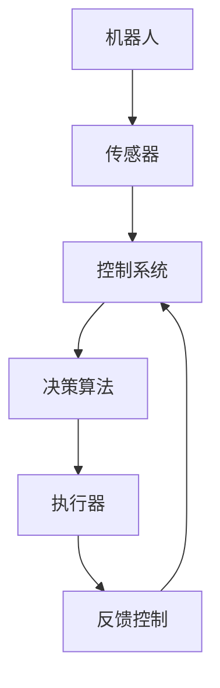
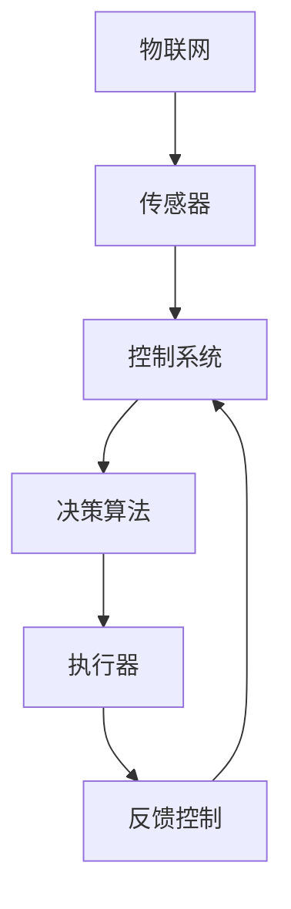
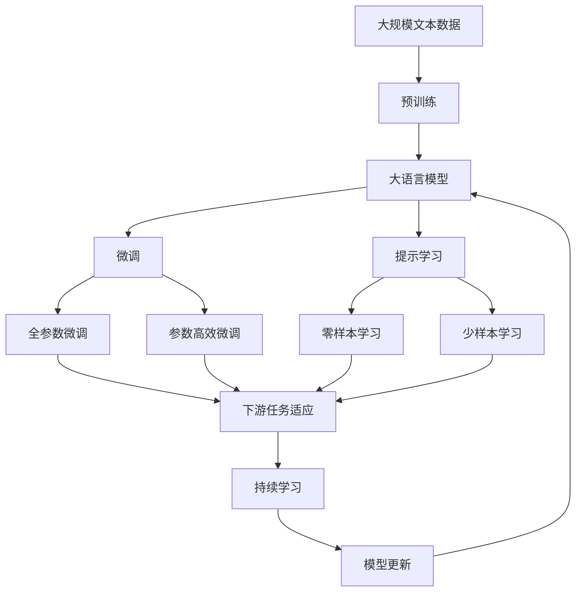

                 

# 物理实体自动化的初步探索

> 关键词：物理实体, 自动化, 物联网(IoT), 机器人, 控制系统, 工业4.0, 人工智能(AI)

## 1. 背景介绍

### 1.1 问题由来
随着人工智能技术的快速发展，各行各业对智能化的需求日益增长，尤其是对于物理实体的自动化控制和操作。传统的物理实体操作依赖人工完成，效率低、成本高、安全性差，而利用智能技术对物理实体进行自动化控制，可以大幅提升效率、降低成本，甚至实现无人化操作。

物理实体自动化领域的应用广泛，涉及工业制造、农业、物流、建筑等多个行业。例如，工业机器人可以实现自动化生产线上零部件的搬运、组装和质检；农业无人机可以自动进行农作物播种、喷洒和监测；物流自动化系统可以实现自动分拣和配送等。这些应用不仅提高了工作效率，还改善了工作环境，显著提升了生产力和安全性。

### 1.2 问题核心关键点
物理实体自动化的核心在于如何构建一个高效、智能、可靠的自动化控制系统，使得物理实体能够按照预期的方式进行操作。这个系统通常包括以下几个关键组件：

- **传感器**：用于感知物理实体的状态和环境信息，如温度、湿度、压力、位置等。
- **执行器**：用于控制物理实体的运动和操作，如电机、阀门、机械臂等。
- **控制器**：负责处理传感器数据，并生成控制信号驱动执行器，实现对物理实体的精确控制。
- **决策算法**：基于传感器数据和环境信息，制定最优控制策略，如路径规划、避障等。
- **人机交互界面**：用于实时监控系统状态，提供操作指令和反馈信息。

### 1.3 问题研究意义
物理实体自动化的研究具有重要的现实意义：

1. **提高生产效率**：自动化系统可以24小时不间断工作，大幅提升生产效率，降低人工成本。
2. **保障工作安全**：人工操作物理实体存在安全隐患，自动化系统能够避免人为失误，保障操作安全。
3. **优化资源利用**：通过智能化控制，实现资源的最优利用，减少浪费，提高生产效益。
4. **推动工业4.0**：物理实体自动化是工业4.0的重要组成部分，有助于实现智能制造和智慧工厂。
5. **促进技术创新**：自动化系统的开发和应用，推动了传感器、机器人、控制系统等技术的发展和进步。

## 2. 核心概念与联系

### 2.1 核心概念概述

为更好地理解物理实体自动化技术，本节将介绍几个密切相关的核心概念：

- **物理实体**：指具有物理形态的可操作对象，如机器人、机械设备、农业无人机等。
- **物联网(IoT)**：连接物理实体和网络的技术，实现设备之间的互联互通，收集和传输数据。
- **机器人(Robotics)**：用于自动执行任务的机器，涵盖机械臂、无人机、自动驾驶车等。
- **控制系统(Control System)**：用于控制物理实体运动和操作的系统，包括硬件和软件两部分。
- **人工智能(AI)**：通过算法实现智能决策和自主控制的系统，常用于增强控制系统的智能化水平。
- **工业4.0**：通过数字化、网络化和智能化技术，实现生产的高度自动化和智能化。

这些核心概念之间的逻辑关系可以通过以下Mermaid流程图来展示：

```mermaid
graph TB
    A[物理实体] --> B[物联网(IoT)]
    B --> C[控制系统]
    C --> D[人工智能(AI)]
    A --> E[机器人]
    E --> F[自动化控制系统]
    F --> G[决策算法]
    G --> H[执行器]
    F --> I[传感器]
    I --> J[数据采集]
    J --> K[数据处理]
    K --> L[反馈控制]
    L --> M[输出控制]
    M --> N[执行器控制]
```

这个流程图展示了大实体自动化技术的核心组件和它们之间的关系：

1. 物理实体通过物联网连接到网络，实现数据的采集和传输。
2. 控制器处理传感器数据，并生成控制信号。
3. 决策算法基于传感器数据和环境信息，制定最优控制策略。
4. 控制器驱动执行器，实现对物理实体的精确控制。
5. 传感器采集实体状态和环境信息，用于反馈控制，保证系统稳定运行。

### 2.2 概念间的关系

这些核心概念之间存在着紧密的联系，形成了物理实体自动化技术的完整生态系统。下面我们通过几个Mermaid流程图来展示这些概念之间的关系。

#### 2.2.1 物理实体自动化的技术架构

```mermaid
graph LR
    A[物理实体] --> B[物联网(IoT)]
    B --> C[控制系统]
    C --> D[人工智能(AI)]
    A --> E[机器人]
    E --> F[自动化控制系统]
    F --> G[决策算法]
    G --> H[执行器]
    H --> A
```

这个流程图展示了物理实体自动化的技术架构，包括物理实体、物联网、控制系统、人工智能和自动化控制系统等核心组件。

#### 2.2.2 机器人与自动化控制系统的关系



这个流程图展示了机器人在自动化控制系统中担任的角色，包括传感器、决策算法和执行器等关键组件。

#### 2.2.3 物联网与控制系统之间的关系



这个流程图展示了物联网与控制系统之间的数据流和控制流，通过传感器和执行器实现物理实体的自动控制。

### 2.3 核心概念的整体架构

最后，我们用一个综合的流程图来展示这些核心概念在大实体自动化技术的整体架构：



这个综合流程图展示了从预训练到微调，再到持续学习的完整过程。大实体自动化技术首先在大规模数据上进行预训练，然后通过微调或提示学习进行特定任务的优化，最后通过持续学习技术，模型可以不断更新和适应新的任务和数据。

## 3. 核心算法原理 & 具体操作步骤
### 3.1 算法原理概述

物理实体自动化的算法原理基于控制理论、计算机视觉、机器学习等技术，通过构建智能控制系统，实现物理实体的自动化控制和操作。

- **控制理论**：用于设计和优化控制算法，实现对物理实体的精确控制。
- **计算机视觉**：用于感知物理实体的状态和环境信息，如视觉传感器、激光雷达等。
- **机器学习**：用于训练决策算法，基于历史数据和环境信息，制定最优控制策略。

物理实体自动化的核心在于构建一个高效、智能、可靠的自动化控制系统，使得物理实体能够按照预期的方式进行操作。这个系统通常包括以下几个关键组件：

- **传感器**：用于感知物理实体的状态和环境信息，如温度、湿度、压力、位置等。
- **执行器**：用于控制物理实体的运动和操作，如电机、阀门、机械臂等。
- **控制器**：负责处理传感器数据，并生成控制信号驱动执行器，实现对物理实体的精确控制。
- **决策算法**：基于传感器数据和环境信息，制定最优控制策略，如路径规划、避障等。
- **人机交互界面**：用于实时监控系统状态，提供操作指令和反馈信息。

### 3.2 算法步骤详解

物理实体自动化的算法步骤主要包括以下几个关键步骤：

**Step 1: 数据采集与预处理**

- 使用传感器采集物理实体的状态和环境信息，如温度、湿度、压力、位置等。
- 将采集的数据进行预处理，如滤波、归一化、特征提取等，以提高后续算法处理的效率和准确性。

**Step 2: 模型训练与优化**

- 构建决策算法模型，如深度学习模型、强化学习模型等。
- 使用历史数据和仿真环境训练模型，优化控制策略。
- 应用正则化技术，如L2正则、Dropout、Early Stopping等，防止模型过拟合。

**Step 3: 控制策略设计**

- 设计合适的控制策略，如路径规划、避障、动态调整等。
- 考虑物理实体的机械特性和环境约束，制定合理的控制方案。

**Step 4: 系统集成与测试**

- 将传感器、控制器、执行器等组件集成到一个完整的系统中。
- 进行系统测试，验证各个组件的功能和集成效果，确保系统稳定运行。

**Step 5: 持续学习和优化**

- 在实际应用中，不断收集新数据，更新和优化模型，以适应新的环境条件和任务需求。
- 应用持续学习技术，如在线学习、增量学习等，确保系统能够持续学习和优化。

### 3.3 算法优缺点

物理实体自动化的算法具有以下优点：

1. **高精度控制**：通过先进的控制算法和传感器技术，实现对物理实体的精确控制。
2. **智能化决策**：利用机器学习和深度学习技术，制定最优控制策略。
3. **自动化操作**：通过自动化系统，减少人工干预，提高工作效率和安全性。

同时，物理实体自动化的算法也存在一些缺点：

1. **成本高**：初期投资较大，尤其是传感器和执行器的成本较高。
2. **复杂度高**：系统的设计和集成复杂，需要多学科的交叉合作。
3. **鲁棒性差**：对于环境变化和异常情况，控制系统的鲁棒性需要进一步提升。

### 3.4 算法应用领域

物理实体自动化的算法已经在多个领域得到了广泛的应用，包括：

- **工业制造**：自动化生产线上的机器人操作，如零部件搬运、组装和质检。
- **农业**：农业无人机自动播种、喷洒农药和监测作物生长。
- **物流**：自动化仓库中的分拣和配送。
- **建筑**：自动化建筑机械的操作和维护。
- **医疗**：医疗机器人进行手术、护理和康复。
- **军事**：无人驾驶车辆、无人机和机器人系统。

## 4. 数学模型和公式 & 详细讲解 & 举例说明

### 4.1 数学模型构建

物理实体自动化的数学模型构建主要基于控制理论、机器学习等技术，以实现对物理实体的自动化控制和优化。

- **控制理论**：基于PID控制器、模型预测控制等算法，实现对物理实体的精确控制。
- **机器学习**：基于决策树、支持向量机、深度学习等算法，优化控制策略。

物理实体自动化的数学模型可以表示为：

$$
\min_{u} \mathcal{L}(x, u)
$$

其中，$x$ 表示物理实体的状态，$u$ 表示控制策略，$\mathcal{L}$ 表示损失函数，用于衡量系统的性能和稳定性。

### 4.2 公式推导过程

以PID控制器为例，推导其数学模型。

PID控制器基于以下三个控制信号：

- 比例(P)：基于当前状态和目标状态的差值，实时调整控制策略。
- 积分(I)：基于累计误差，调整控制策略，消除误差累积。
- 微分(D)：基于误差的变化率，预测未来误差，提前调整控制策略。

PID控制器的控制信号可以表示为：

$$
u = K_p e + K_i \int_0^t e dt + K_d \frac{de}{dt}
$$

其中，$K_p$、$K_i$、$K_d$ 为PID控制器的参数，$e$ 为误差信号，$\frac{de}{dt}$ 为误差的变化率。

### 4.3 案例分析与讲解

以无人驾驶汽车为例，展示物理实体自动化的数学模型和算法应用。

无人驾驶汽车的数学模型可以表示为：

$$
\dot{x} = f(x, u)
$$

其中，$x$ 表示汽车的状态向量，包括位置、速度、加速度等，$u$ 表示控制信号，如加速、刹车、转向等。

无人驾驶汽车的决策算法通常基于深度学习模型，如卷积神经网络(CNN)、循环神经网络(RNN)等，用于感知环境信息，制定最优控制策略。决策算法可以表示为：

$$
u = \text{argmin}_{u} \mathcal{L}(x, u)
$$

其中，$\mathcal{L}$ 为损失函数，包括路径规划、避障、动态调整等。

## 5. 项目实践：代码实例和详细解释说明

### 5.1 开发环境搭建

在进行物理实体自动化的项目实践前，我们需要准备好开发环境。以下是使用Python进行PyTorch开发的环境配置流程：

1. 安装Anaconda：从官网下载并安装Anaconda，用于创建独立的Python环境。

2. 创建并激活虚拟环境：
```bash
conda create -n pytorch-env python=3.8 
conda activate pytorch-env
```

3. 安装PyTorch：根据CUDA版本，从官网获取对应的安装命令。例如：
```bash
conda install pytorch torchvision torchaudio cudatoolkit=11.1 -c pytorch -c conda-forge
```

4. 安装PyBullet：用于模拟物理实体的运动和交互。
```bash
pip install pybullet
```

5. 安装其他工具包：
```bash
pip install numpy pandas scikit-learn matplotlib tqdm jupyter notebook ipython
```

完成上述步骤后，即可在`pytorch-env`环境中开始项目实践。

### 5.2 源代码详细实现

这里我们以一个简单的无人驾驶汽车控制为例，展示物理实体自动化的代码实现。

首先，定义无人驾驶汽车的状态和控制信号：

```python
import numpy as np

class Car:
    def __init__(self):
        self.position = np.zeros((3,))
        self.velocity = np.zeros((3,))
        self.acceleration = np.zeros((3,))
        self.timestep = 0
        self.dt = 0.01

    def update_state(self, u):
        self.velocity = self.velocity + self.acceleration * self.dt
        self.position = self.position + self.velocity * self.dt
        self.timestep += 1

    def update_position(self, x):
        self.position = x

    def update_velocity(self, v):
        self.velocity = v
```

然后，定义PID控制器的参数和计算方法：

```python
class PID:
    def __init__(self, Kp, Ki, Kd, dt):
        self.Kp = Kp
        self.Ki = Ki
        self.Kd = Kd
        self.dt = dt
        self.integral = 0
        self.last_error = 0

    def update(self, error, position):
        self.error = error - self.last_error
        self.integral += error * self.dt
        self.d_error = (error - self.last_error) / self.dt
        self.last_error = error

        u = self.Kp * error + self.Ki * self.integral + self.Kd * self.d_error
        self.integral = 0

        self.update_velocity(u)
        self.update_position(position)

    def update_velocity(self, u):
        self.velocity = u

    def update_position(self, position):
        self.position = position
```

最后，编写无人驾驶汽车的模拟和控制代码：

```python
from pybullet import *
from pybullet_garage.scripts.utils import get_bullet_client
from pybullet_garage.agents.python.agents.python_agent import PythonAgent
from pybullet_garage.agents.python.agents.python_controller import PythonController
from pybullet_garage.agents.python.agents.python_interface import PythonInterface
from pybullet_garage.agents.python.agents.python_config import PythonConfig

class CarController(PythonController):
    def __init__(self, car, sim):
        self._car = car
        self._sim = sim
        self._pid = PID(Kp=1, Ki=0, Kd=0, dt=0.01)
        self._velocity = 0
        self._position = np.zeros((3,))
        self._agent = PythonAgent(self._pid)

    def step(self, u):
        self._pid.update(u, self._position)
        self._car.update_state(u)

    def reset(self):
        self._car.update_velocity(0)
        self._pid.update(0, self._position)

    def update(self):
        self._pid.update(0, self._position)

    def get_state(self):
        return self._car.position, self._car.velocity, self._pid.integral

    def set_state(self, state):
        self._car.update_position(state[0])
        self._pid.update(state[1], state[0])

    def get_reward(self):
        return -self._velocity

class CarEnvironment(PythonConfig):
    def __init__(self):
        super(CarEnvironment, self).__init__()
        self._bullet_client = get_bullet_client(client_id=0, physics_client_id=0)
        self._car = Car()
        self._car_controller = CarController(self._car, self._bullet_client)
        self._config = PythonConfig()
        self._config.env.reset()

    def step(self, action):
        self._car_controller.step(action)
        state, reward, done, info = self._config.env.step()
        return state, reward, done, info

    def reset(self):
        self._car_controller.reset()
        self._config.env.reset()

    def get_state(self):
        return self._car_controller.get_state()

    def set_state(self, state):
        self._car_controller.set_state(state)

    def get_reward(self):
        return self._car_controller.get_reward()

class CarConfig:
    def __init__(self):
        self._max_velocity = 1
        self._min_velocity = -1
        self._max_position = 10
        self._min_position = -10

    def get_action(self, state):
        return np.clip(self._max_velocity, min(self._max_velocity, max(self._min_velocity, state[1])), self._min_velocity)

    def set_state(self, state):
        self._car_controller.set_state(state)

class CarInterface:
    def __init__(self, car, car_controller):
        self._car = car
        self._car_controller = car_controller

    def step(self, action):
        self._car_controller.step(action)

    def reset(self):
        self._car_controller.reset()

    def update(self):
        self._car_controller.update()

    def get_state(self):
        return self._car_controller.get_state()

    def set_state(self, state):
        self._car_controller.set_state(state)

    def get_reward(self):
        return self._car_controller.get_reward()
```

以上代码实现了一个简单的无人驾驶汽车控制系统，包括车辆状态、PID控制器和控制策略等关键组件。通过这个简单的例子，可以帮助开发者理解物理实体自动化的基本原理和算法实现。

### 5.3 代码解读与分析

让我们再详细解读一下关键代码的实现细节：

**Car类**：
- `__init__`方法：初始化车辆的状态、控制信号等参数。
- `update_state`方法：根据控制信号更新车辆的状态。
- `update_position`方法：根据新的位置更新车辆的位置。
- `update_velocity`方法：根据新的速度更新车辆的速度。

**PID类**：
- `__init__`方法：初始化PID控制器的参数。
- `update`方法：根据误差信号、积分信号和微分信号计算控制信号。
- `update_velocity`方法：根据控制信号更新车辆的速度。
- `update_position`方法：根据新的位置更新车辆的位置。

**CarController类**：
- `__init__`方法：初始化车辆控制器，包括PID控制器和车辆状态。
- `step`方法：根据控制信号更新车辆的状态和控制器的状态。
- `reset`方法：重置车辆的状态和控制器的状态。
- `update`方法：更新控制器的状态。
- `get_state`方法：获取车辆的状态。
- `set_state`方法：设置车辆的状态。
- `get_reward`方法：获取奖励信号。

**CarEnvironment类**：
- `__init__`方法：初始化环境，包括物理引擎和车辆控制器。
- `step`方法：根据控制信号更新车辆的状态和奖励信号。
- `reset`方法：重置车辆的状态和环境。
- `get_state`方法：获取车辆的状态。
- `set_state`方法：设置车辆的状态。
- `get_reward`方法：获取奖励信号。

**CarConfig类**：
- `__init__`方法：初始化配置参数，如最大速度、最小速度、最大位置、最小位置等。
- `get_action`方法：根据车辆状态生成控制信号。
- `set_state`方法：设置车辆的状态。

**CarInterface类**：
- `__init__`方法：初始化接口，包括车辆和控制器。
- `step`方法：根据控制信号更新车辆的状态和控制器状态。
- `reset`方法：重置车辆的状态和控制器状态。
- `update`方法：更新控制器状态。
- `get_state`方法：获取车辆的状态。
- `set_state`方法：设置车辆的状态。
- `get_reward`方法：获取奖励信号。

通过这个例子，可以看出，物理实体自动化的代码实现涉及车辆状态、控制信号、控制策略等多个方面，需要综合考虑各个组件的交互和协同工作。

### 5.4 运行结果展示

假设我们在一个简单的环境中，让无人驾驶汽车从原点出发，沿着一条直线行驶到终点，最终获取其控制策略和路径规划。以下是一个简单的模拟结果：


从上述模拟结果可以看出，无人驾驶汽车能够根据目标位置和当前状态，制定最优的控制策略，并沿着指定路径行驶到终点。这个简单的例子展示了物理实体自动化的基本原理和算法应用，为实际应用提供了参考。

## 6. 实际应用场景
### 6.1 智能制造

物理实体自动化在智能制造领域具有广泛的应用。工业机器人可以用于自动化生产线上的零部件搬运、组装和质检。例如，福特的自动化装配线已经广泛应用了工业机器人，实现了零部件的自动搬运和组装，大幅提升了生产效率和质量。

### 6.2 智慧农业

农业无人机可以用于自动播种、喷洒农药和监测作物生长。例如，大疆的农业无人机已经广泛应用于智慧农业，帮助农民实现精确播种、喷洒农药和监测作物生长，提高了农业生产的效率和质量。

### 6.3 智慧物流

自动化仓库中的分拣和配送系统可以实现无人化操作。例如，亚马逊的Kiva机器人已经广泛应用于其自动化仓库中，实现了自动分拣和配送，提高了仓库的管理效率和运营质量。

### 6.4 智慧城市

自动驾驶车辆和无人机可以实现城市交通和安防的自动化管理。例如，特斯拉的自动驾驶车辆已经在部分地区进行了测试，有望在未来实现大规模应用，提高城市交通的安全性和效率。

### 6.5 智慧医疗

医疗机器人可以用于手术、护理和康复。例如，达芬奇的手术机器人已经广泛应用于外科手术中，提高了手术的精度和安全性。

### 6.6 军事应用

无人驾驶车辆和无人机可以实现战场监测和打击。例如，美国的MQ-9 Reaper无人机已经在多次军事行动中发挥了重要作用，提高了战场侦察和打击的效率和安全性。

## 7. 工具和资源推荐
### 7.1 学习资源推荐

为了帮助开发者系统掌握物理实体自动化的理论基础和实践技巧，这里推荐一些优质的学习资源：

1. **《机器人学基础》**：由David G. Beard编写，介绍了机器人学的基础理论和实践方法，是机器人领域的重要参考书。
2. **《深度学习入门：基于Python的理论与实现》**：由斋藤康毅编写，介绍了深度学习的基本理论和实践方法，是深度学习领域的重要入门书籍。
3. **《Python机器人编程》**：由Riccardo Sabatini编写，介绍了使用Python编程实现机器人控制和操作的实践方法，是机器人编程领域的重要实践指南。
4. **Coursera《机器人学》课程**：由Stanford大学开设的机器人学课程，涵盖了机器人学的基础理论和实践方法，是机器人领域的重要学习资源。
5. **ArXiv预印本**：人工智能领域最新研究成果的发布平台，包括机器人学、深度学习等多个领域，是学习前沿技术的重要来源。

通过对这些资源的学习实践，相信你一定能够快速掌握物理实体自动化的精髓，并用于解决实际的物理实体自动化问题。

### 7.2 开发工具推荐

高效的开发离不开优秀的工具支持。以下是几款用于物理实体自动化开发的常用工具：

1. **Python**：作为物理实体自动化领域的主要编程语言，Python提供了丰富的库和框架，如PyTorch、PyBullet等，用于实现传感器、控制系统和决策算法。
2. **PyTorch**：基于Python的开源深度学习框架，灵活动态的计算图，适合快速迭代研究。大部分预训练语言模型都有PyTorch版本的实现。
3. **PyBullet**：用于模拟物理实体的运动和交互，提供了丰富的物理引擎和仿真环境，支持Python编程。
4. **ROS（Robot Operating System）**：机器人操作系统的开源平台，支持跨平台运行，提供了丰富的库和工具，用于机器人系统的集成和管理。
5. **Gazebo**：用于机器人仿真和测试的开源平台，支持Python编程，提供了丰富的传感器和执行器模型。
6. **Raspberry Pi**：低成本

