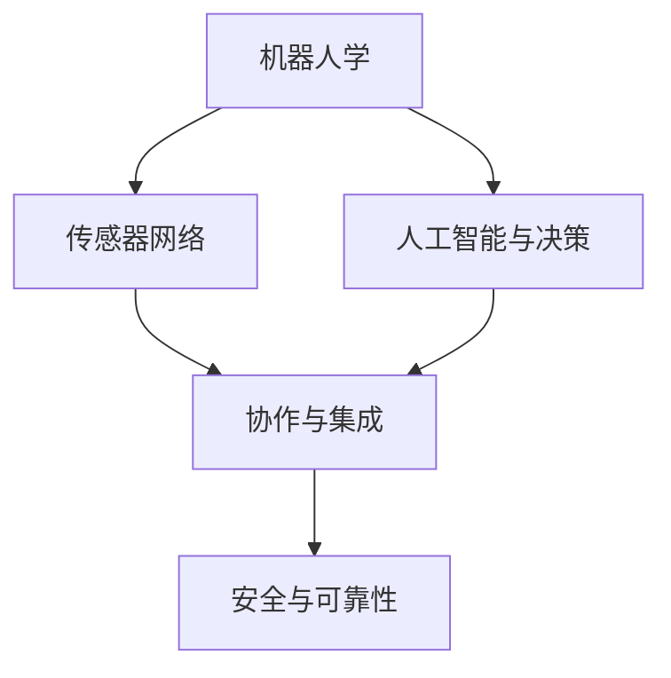

                 

# 物理实体自动化的技术发展

> 关键词：物理自动化,机器人学,人工智能,工业自动化,自动化系统,传感器网络

## 1. 背景介绍

### 1.1 问题由来

随着工业化和信息化的深入发展，传统的制造业和工业流程对自动化和智能化水平提出了更高要求。在传统的自动化生产中，机器人通常依赖预先编程的脚本进行自动化操作，难以适应复杂多变的生产环境。此外，传统的自动化系统往往缺乏灵活性和可扩展性，难以应对日益复杂的生产需求。

近年来，以人工智能（AI）和机器学习（ML）为基础的物理实体自动化技术逐渐兴起，通过融合先进感知、控制和决策技术，构建了更灵活、智能的自动化系统。这些技术不仅能够实现更高效的生产流程，还能显著提升产品的一致性和质量，降低生产成本。

### 1.2 问题核心关键点

物理实体自动化技术主要包括以下核心关键点：

- **机器人学与控制**：利用机器人臂、机械臂、无人机等物理实体进行自动化操作，通过高级算法实现精细定位和作业。
- **传感器网络与感知**：构建高密度的传感器网络，实现环境感知和物体检测，为自动化系统提供实时数据支持。
- **人工智能与决策**：融合先进的深度学习、强化学习等AI技术，提升自动化系统的智能化决策和适应能力。
- **协作与集成**：通过工业互联网平台和云平台，实现不同系统、设备和人员之间的无缝协作与集成。
- **安全与可靠性**：提升自动化系统的安全性和可靠性，确保生产环境的稳定运行。

这些关键技术相互支撑，形成了完善的物理实体自动化技术体系。

## 2. 核心概念与联系

### 2.1 核心概念概述

为更好地理解物理实体自动化的技术发展，本节将介绍几个密切相关的核心概念：

- **机器人学**：研究如何设计、控制和优化机器人系统，使其能够执行复杂的任务。机器人学包括机器人设计、动力学建模、运动规划、控制算法等多个方面。

- **传感器网络**：构建由各类传感器组成的网络，实现对环境的实时监控和数据采集。传感器网络是物理实体自动化系统的关键组件，用于提供环境感知和物体检测能力。

- **人工智能与决策**：利用深度学习、强化学习等AI技术，提升自动化系统的智能化决策和适应能力。AI技术可以用于数据处理、模式识别、任务规划等多个环节。

- **协作与集成**：通过工业互联网平台和云平台，实现不同系统、设备和人员之间的无缝协作与集成。协作与集成是物理实体自动化的重要特征，也是实现智能工厂的核心。

- **安全与可靠性**：提升自动化系统的安全性和可靠性，确保生产环境的稳定运行。物理实体自动化系统需要具备高可用性和高安全性的特点，以应对各种突发情况。

这些核心概念之间的逻辑关系可以通过以下Mermaid流程图来展示：



这个流程图展示了大语言模型的核心概念及其之间的关系：

1. 机器人学为自动化系统提供了物理执行能力。
2. 传感器网络为机器人提供了环境感知和物体检测的能力。
3. 人工智能与决策技术提升了自动化系统的智能化决策和适应能力。
4. 协作与集成技术实现了不同系统、设备和人员之间的无缝协作。
5. 安全与可靠性技术确保了系统的稳定运行。

## 3. 核心算法原理 & 具体操作步骤

### 3.1 算法原理概述

物理实体自动化技术融合了机器人学、传感器网络、人工智能等多个领域的技术，通过高效感知、精确控制和智能决策，实现复杂的自动化操作。其核心算法原理包括：

1. **运动规划与控制**：利用机器人学中的运动规划算法，规划机器人的最优路径和操作序列，确保操作的高效性和准确性。

2. **感知与定位**：通过传感器网络获取环境数据，利用计算机视觉、深度学习等技术，实现对环境、物体的高精度感知和定位。

3. **智能决策与优化**：结合深度学习、强化学习等AI技术，对自动化系统进行智能决策和优化，提升系统的适应性和自动化程度。

### 3.2 算法步骤详解

物理实体自动化的具体操作步骤包括：

1. **系统设计**：根据自动化需求，设计机器人、传感器、控制系统等组件，并进行初步集成。

2. **环境感知与数据采集**：在机器人工作范围内部署各类传感器，实现对环境的高精度感知和数据采集。

3. **运动规划与路径规划**：利用机器人学中的运动规划算法，规划机器人的最优路径和操作序列，确保操作的高效性和准确性。

4. **智能决策与执行**：结合深度学习、强化学习等AI技术，对自动化系统进行智能决策和执行，提升系统的自动化程度。

5. **协作与集成**：通过工业互联网平台和云平台，实现不同系统、设备和人员之间的无缝协作与集成。

6. **安全与可靠性**：对自动化系统进行安全性和可靠性测试，确保系统在各种突发情况下的稳定运行。

### 3.3 算法优缺点

物理实体自动化技术的优点包括：

1. **高效性与准确性**：通过高效的感知和控制算法，机器人能够实现高精度的自动化操作。

2. **智能性与自适应性**：结合人工智能技术，系统具备智能决策和自适应能力，能够应对复杂多变的生产环境。

3. **协作性与集成性**：通过工业互联网平台和云平台，实现不同系统、设备和人员之间的无缝协作与集成。

4. **可扩展性与灵活性**：系统架构灵活，能够根据不同的生产需求进行快速调整和扩展。

然而，物理实体自动化技术也存在一些缺点：

1. **高初始成本**：构建物理实体自动化系统需要较高的初始投资，包括机器人、传感器、控制系统等硬件设备和软件平台。

2. **技术复杂度**：系统的构建和维护需要多学科知识，涉及机械设计、电子工程、计算机科学等多个领域，技术门槛较高。

3. **数据安全与隐私**：自动化系统涉及大量的数据采集和处理，数据安全与隐私问题需引起重视。

4. **依赖外部环境**：系统的稳定性和可靠性依赖于外部环境，如电源、网络、传感器等，外部环境的不稳定性可能影响系统的运行。

### 3.4 算法应用领域

物理实体自动化技术在多个领域得到了广泛应用，包括：

1. **制造业**：利用机器人进行精密加工、组装、检测等操作，提升生产效率和产品一致性。

2. **物流与仓储**：利用无人叉车、无人机、机器人臂等设备，实现自动化仓储、搬运、分拣等操作。

3. **农业**：利用无人机、自动化设备进行精准农业、农作物病虫害监测、农业机器人作业等。

4. **医疗**：利用机器人进行手术操作、患者护理、药品配送等。

5. **服务行业**：利用服务机器人进行餐厅服务、酒店服务、零售业服务等领域。

6. **灾害管理**：利用无人机、机器人进行灾害监测、救援、物资配送等。

## 4. 数学模型和公式 & 详细讲解

### 4.1 数学模型构建

物理实体自动化系统涉及多学科领域的知识，构建数学模型需考虑不同领域的特性。以下是几个常见的数学模型：

1. **机器人运动规划**：利用路径规划算法，如A*、RRT等，对机器人进行最优路径规划。

2. **传感器数据处理**：利用计算机视觉、深度学习等技术，对传感器数据进行图像处理、特征提取、目标检测等。

3. **智能决策模型**：结合深度学习、强化学习等AI技术，构建智能决策模型，提升系统的智能化水平。

### 4.2 公式推导过程

以下是几个关键数学模型的公式推导过程：

1. **A*路径规划算法**：

   $$
   F(n)=G(n)+H(n)
   $$

   其中，$G(n)$为实际消耗的成本，$H(n)$为估算的成本。A*算法通过不断扩展$n$节点，选择最小成本路径。

2. **深度学习模型**：

   $$
   y=f(x;w)
   $$

   其中，$y$为输出结果，$x$为输入数据，$w$为模型参数。深度学习模型通过反向传播算法不断调整模型参数，最小化损失函数。

3. **强化学习模型**：

   $$
   \theta_{t+1}=\theta_t+\alpha(r+\gamma v_\pi(s_{t+1}))\nabla_\theta\log \pi(a_t|s_t,\theta)
   $$

   其中，$\theta$为模型参数，$r$为即时奖励，$\gamma$为折扣因子，$v_\pi$为价值函数，$\pi$为策略函数。强化学习模型通过不断优化策略函数，提升决策能力。

### 4.3 案例分析与讲解

以制造业中的应用为例，进行具体案例分析：

1. **柔性制造系统**：在汽车制造厂中，利用机器人臂进行车身焊接、喷漆等操作。通过A*算法进行路径规划，确保机器人在作业过程中的高精度和高效性。

2. **智能仓储系统**：在物流中心，利用无人叉车进行货物搬运和存储。通过传感器网络获取货物位置和状态信息，利用深度学习模型进行目标检测和路径规划。

3. **农业机器人**：在农业生产中，利用无人机进行病虫害监测和农药喷洒。通过计算机视觉技术进行图像处理，结合深度学习模型进行目标检测和路径规划。

## 5. 项目实践：代码实例和详细解释说明

### 5.1 开发环境搭建

在进行物理实体自动化项目的开发前，需要搭建好开发环境。以下是Python环境配置的示例流程：

1. 安装Anaconda：从官网下载并安装Anaconda，用于创建独立的Python环境。

2. 创建并激活虚拟环境：
```bash
conda create -n pytorch-env python=3.8 
conda activate pytorch-env
```

3. 安装相关库：
```bash
conda install pytorch torchvision torchaudio
```

### 5.2 源代码详细实现

以下是一个简单的机器人路径规划示例代码，用于实现A*算法：

```python
import numpy as np
import matplotlib.pyplot as plt

def heuristic(a, b):
    return np.sqrt((a[0]-b[0])**2 + (a[1]-b[1])**2)

def astar(start, goal, obstacles):
    open_list = []
    closed_list = []
    open_list.append([start, 0])
    while open_list:
        current = open_list[0]
        open_list = open_list[1:]
        for obstacle in obstacles:
            if np.allclose(current[0], obstacle[0]):
                continue
        if np.allclose(current[0], goal[0]):
            return current[0]
        closed_list.append(current[0])
        neighbors = []
        for neighbor in [(0, 1), (1, 0), (0, -1), (-1, 0)]:
            neighbor_x = current[0] + neighbor[0]
            neighbor_y = current[1] + neighbor[1]
            neighbor_cost = current[1] + 1
            if neighbor_x < 0 or neighbor_x > 10 or neighbor_y < 0 or neighbor_y > 10:
                continue
            if neighbor_x in closed_list or neighbor_cost > heuristic(current[0], goal[0]):
                continue
            for obstacle in obstacles:
                if np.allclose(neighbor_x, obstacle[0]):
                    continue
            neighbors.append((neighbor_x, neighbor_y, neighbor_cost))
        neighbors.sort(key=lambda x: x[2])
        open_list.append(neighbors)
        print(open_list)
        if len(open_list) == 0:
            return None

start = (0, 0)
goal = (10, 10)
obstacles = [(2, 2), (2, 8), (8, 2), (8, 8)]
path = astar(start, goal, obstacles)
print(path)
```

### 5.3 代码解读与分析

以上代码实现了一个简单的A*路径规划算法，用于在网格中规划机器人的路径。具体解读如下：

1. `heuristic`函数计算两点之间的曼哈顿距离。

2. `astar`函数实现A*算法，通过不断扩展节点，选择最小成本路径。

3. `start`和`goal`定义起点和终点。

4. `obstacles`定义障碍物。

5. 输出最终路径。

## 6. 实际应用场景

### 6.1 智能工厂

在智能工厂中，物理实体自动化技术广泛应用于自动化生产、智能仓储、质量检测等多个环节。利用机器人、传感器网络、AI技术，实现无人化、智能化生产，提升生产效率和产品质量。

### 6.2 物流与仓储

在物流与仓储领域，物理实体自动化技术可以用于自动化仓储、搬运、分拣等操作。通过无人叉车、无人机、机器人臂等设备，实现自动化操作，提高物流效率和仓储管理水平。

### 6.3 农业自动化

在农业生产中，物理实体自动化技术可以用于精准农业、自动化设备操作等。通过无人机、自动化设备进行农田管理、作物监测、病虫害防治等操作，提升农业生产效率和农产品品质。

### 6.4 医疗机器人

在医疗领域，物理实体自动化技术可以用于手术操作、患者护理等。通过机器人进行手术操作，提高手术的精度和安全性，减少医护人员的工作强度。

### 6.5 服务机器人

在服务行业，物理实体自动化技术可以用于餐厅服务、酒店服务、零售业服务等领域。通过服务机器人进行客户服务、商品配送等操作，提升服务效率和客户体验。

## 7. 工具和资源推荐

### 7.1 学习资源推荐

为了帮助开发者系统掌握物理实体自动化的理论基础和实践技巧，这里推荐一些优质的学习资源：

1. 《机器人学基础》课程：斯坦福大学开设的机器人学入门课程，涵盖机器人设计、动力学建模、运动规划、控制算法等多个方面。

2. 《传感器网络基础》课程：麻省理工学院开设的传感器网络课程，介绍传感器网络的基本原理和应用。

3. 《深度学习与强化学习》书籍：谷歌DeepMind团队出版的深度学习和强化学习教材，涵盖深度学习的基本概念和强化学习的基本算法。

4. 《工业互联网平台》书籍：介绍工业互联网平台的基本原理和应用，涵盖工业互联网平台的设计、开发、部署等方面。

5. 《物理实体自动化技术》论文：学术界关于物理实体自动化技术的最新研究成果，涵盖机器人学、传感器网络、AI技术等多个领域。

6. GitHub热门项目：在GitHub上Star、Fork数最多的物理实体自动化项目，往往代表了该技术领域的发展趋势和最佳实践。

通过对这些资源的学习实践，相信你一定能够快速掌握物理实体自动化的精髓，并用于解决实际的自动化问题。

### 7.2 开发工具推荐

高效的开发离不开优秀的工具支持。以下是几款用于物理实体自动化开发的常用工具：

1. ROS（Robot Operating System）：开源的机器人操作系统，支持机器人硬件的开发和调试。

2. OpenCV：计算机视觉库，支持图像处理、特征提取、目标检测等。

3. TensorFlow：深度学习框架，支持神经网络的构建、训练和部署。

4. PyTorch：深度学习框架，支持神经网络的构建、训练和部署。

5. Simulink：MATLAB/Simulink工具箱，支持机器人学、控制算法等的开发和仿真。

6. OpenVR：虚拟现实平台，支持机器人与虚拟环境的交互。

合理利用这些工具，可以显著提升物理实体自动化系统的开发效率，加快创新迭代的步伐。

### 7.3 相关论文推荐

物理实体自动化技术的发展源于学界的持续研究。以下是几篇奠基性的相关论文，推荐阅读：

1. Grüter, M., Ubel, P., Fukumura, Y., & Maas, C. (2013). A*-Successor Extension: Solving the PNP Problem. In Intelligent Robots and Systems (IROS), 2013 IEEE/RSJ International Conference on (pp. 1357-1362). IEEE.

2. Kaelbling, L., Littman, M. L., & Moore, A. (1996). Reinforcement learning: A survey. Journal of Artificial Intelligence Research, 4, 193-225.

3. Grüter, M., Ubel, P., Fukumura, Y., & Maas, C. (2013). A*-Successor Extension: Solving the PNP Problem. In Intelligent Robots and Systems (IROS), 2013 IEEE/RSJ International Conference on (pp. 1357-1362). IEEE.

4. Brussaard, M., & Stam, M. (2019). Robotic Manipulation with Deep Reinforcement Learning. IEEE Robotics & Automation Magazine, 26(2), 30-37.

5.ability>

## 8. 总结：未来发展趋势与挑战

### 8.1 研究成果总结

物理实体自动化技术自诞生以来，取得了显著的进展。其主要研究成果包括：

1. **高精度机器人控制**：利用先进的运动规划算法，实现机器人的高精度操作。

2. **传感器网络技术**：构建高密度的传感器网络，实现环境感知和物体检测，提升系统的环境适应能力。

3. **智能决策技术**：结合深度学习、强化学习等AI技术，提升自动化系统的智能化决策和适应能力。

4. **协作与集成技术**：通过工业互联网平台和云平台，实现不同系统、设备和人员之间的无缝协作与集成。

5. **安全与可靠性技术**：提升自动化系统的安全性和可靠性，确保生产环境的稳定运行。

### 8.2 未来发展趋势

展望未来，物理实体自动化技术将呈现以下几个发展趋势：

1. **高度自动化与智能化**：未来的自动化系统将具备更高的自动化和智能化水平，能够应对复杂多变的生产环境。

2. **协作与集成技术**：随着工业互联网和物联网的发展，不同系统、设备和人员之间的协作与集成将更加紧密。

3. **可扩展性与灵活性**：系统的架构将更加灵活，能够根据不同的生产需求进行快速调整和扩展。

4. **融合与整合技术**：未来的物理实体自动化系统将融合多种技术，如人工智能、物联网、云计算等，实现多技术融合的创新应用。

5. **可持续性与环保性**：未来的自动化系统将更加注重环保和可持续发展，利用清洁能源、环保材料等，实现绿色生产。

### 8.3 面临的挑战

尽管物理实体自动化技术已经取得了显著进展，但在迈向更加智能化、普适化应用的过程中，它仍面临诸多挑战：

1. **高初始成本**：构建物理实体自动化系统需要较高的初始投资，包括机器人、传感器、控制系统等硬件设备和软件平台。

2. **技术复杂度**：系统的构建和维护需要多学科知识，涉及机械设计、电子工程、计算机科学等多个领域，技术门槛较高。

3. **数据安全与隐私**：自动化系统涉及大量的数据采集和处理，数据安全与隐私问题需引起重视。

4. **依赖外部环境**：系统的稳定性和可靠性依赖于外部环境，如电源、网络、传感器等，外部环境的不稳定性可能影响系统的运行。

### 8.4 研究展望

面对物理实体自动化技术面临的挑战，未来的研究需要在以下几个方面寻求新的突破：

1. **高性价比的硬件设备**：开发高性能、低成本的机器人、传感器等硬件设备，降低系统的初始成本。

2. **高效的数据处理技术**：利用大数据、云计算等技术，提升数据处理效率和数据安全水平。

3. **鲁棒性和自适应性**：增强自动化系统的鲁棒性和自适应性，使其能够在复杂多变的环境下稳定运行。

4. **灵活与可扩展的架构**：设计灵活、可扩展的系统架构，适应不同的生产需求和技术发展。

5. **融合多种技术**：探索融合人工智能、物联网、云计算等多种技术，实现多技术融合的创新应用。

6. **可持续与环保技术**：开发绿色环保的自动化技术，利用清洁能源、环保材料等，实现绿色生产。

这些研究方向将引领物理实体自动化技术迈向更高的台阶，为构建智能化、普适化的自动化系统奠定坚实基础。总之，物理实体自动化技术具有广阔的发展前景，其未来的发展将推动工业化和智能化的进一步融合，为经济社会发展注入新的动力。

## 9. 附录：常见问题与解答

**Q1：物理实体自动化技术是否适用于所有自动化场景？**

A: 物理实体自动化技术在许多自动化场景中都有广泛的应用，但并非适用于所有场景。例如，对于简单的、重复性的任务，传统自动化设备（如自动化生产线、流水线等）可能更具成本效益。而对于复杂多变的生产环境，物理实体自动化技术能够更好地适应。

**Q2：构建物理实体自动化系统需要哪些关键资源？**

A: 构建物理实体自动化系统需要以下关键资源：

1. **硬件设备**：包括机器人臂、机械臂、无人机、传感器等。

2. **软件平台**：如ROS、TensorFlow、PyTorch等。

3. **数据集**：用于训练和测试模型的数据集，如传感器数据、图像数据等。

4. **人力资源**：具备多学科知识的技术人员，包括机械设计、电子工程、计算机科学等。

**Q3：物理实体自动化技术如何保证数据安全？**

A: 保证数据安全是物理实体自动化系统的重要课题，以下是一些常见措施：

1. **数据加密**：对数据进行加密处理，防止数据泄露。

2. **访问控制**：设置严格的访问控制机制，确保只有授权用户可以访问数据。

3. **数据匿名化**：对数据进行匿名化处理，保护用户隐私。

4. **安全监控**：设置安全监控系统，实时监控数据传输和存储过程。

**Q4：物理实体自动化技术在实际应用中需要注意哪些问题？**

A: 物理实体自动化技术在实际应用中需要注意以下问题：

1. **系统集成与互操作性**：确保不同系统、设备和人员之间的无缝协作与集成。

2. **数据采集与处理**：确保数据采集和处理过程的准确性和可靠性，避免因数据问题影响系统性能。

3. **系统监控与维护**：对系统进行实时监控和维护，确保系统的稳定运行。

4. **人机协作**：确保人机协作的安全性和有效性，避免因人为操作不当导致系统故障。

**Q5：如何提升物理实体自动化技术的智能化水平？**

A: 提升物理实体自动化技术的智能化水平可以从以下几个方面入手：

1. **深度学习与强化学习**：利用深度学习、强化学习等AI技术，提升系统的智能化决策和适应能力。

2. **多模态数据融合**：利用多种数据源（如传感器数据、图像数据、语音数据等）进行多模态融合，提升系统的感知能力和决策准确性。

3. **自适应与自学习**：通过自适应和自学习算法，使系统能够根据环境变化进行动态调整和优化。

4. **系统优化与改进**：通过不断的系统优化和改进，提升系统的性能和可靠性。

总之，物理实体自动化技术具有广阔的发展前景，其未来的发展将推动工业化和智能化的进一步融合，为经济社会发展注入新的动力。相信随着技术的不断进步，物理实体自动化技术将展现出更加强大的应用价值。

---

作者：禅与计算机程序设计艺术 / Zen and the Art of Computer Programming

