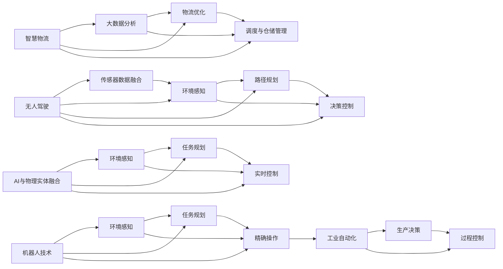
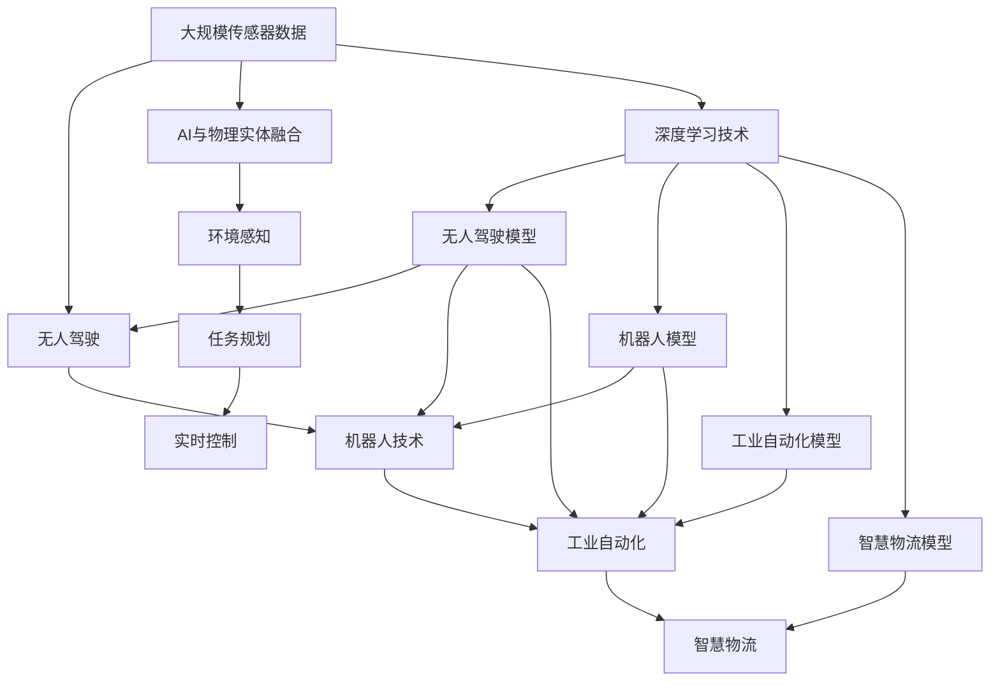
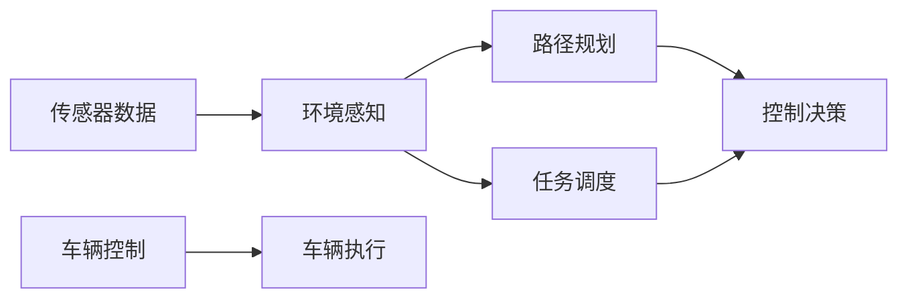
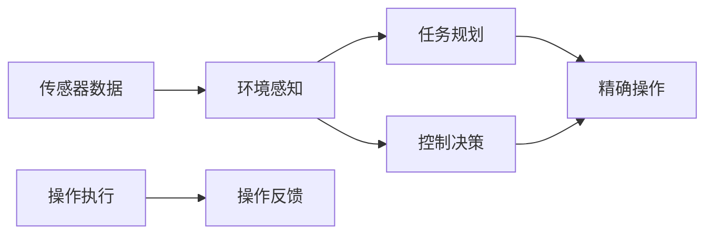
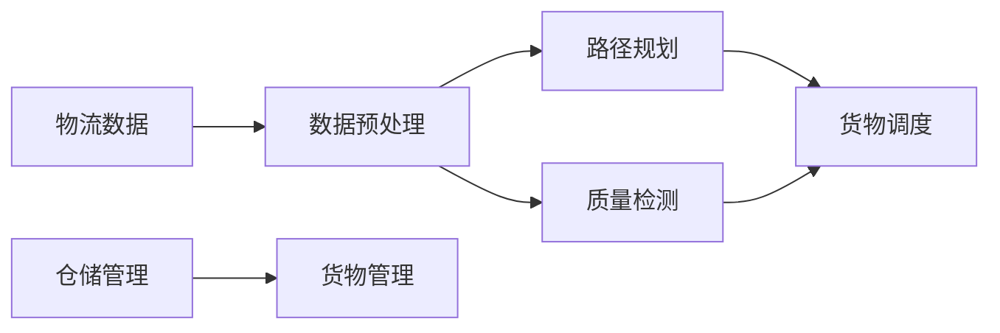

                 

# 物理实体自动化的未来发展

> 关键词：自动驾驶, 机器人技术, 工业自动化, 智慧物流, 人工智能

## 1. 背景介绍

### 1.1 问题由来
随着全球工业自动化和智能制造的快速发展，物理实体的自动化程度正在逐步提高。在制造业、物流业、零售业等领域，自动化技术的广泛应用不仅提升了效率，降低了成本，也为新的商业模式和价值创造提供了可能。当前，自动化技术正从传统的基于规则的自动化向基于深度学习的自动化演进。然而，在物理实体自动化领域，诸如无人车、机器人等设备依然面临着诸多技术挑战，如何通过深度学习算法来提升自动化设备的功能和效率，成为工业界和学术界关注的焦点。

### 1.2 问题核心关键点
物理实体自动化的核心在于将深度学习算法应用于无人车、机器人等设备的感知、决策和控制环节，实现从物理世界的复杂信息中提取有用信号、做出精准决策和精确控制。其主要挑战包括：
- 传感器数据的多源融合：如何整合来自多个传感器的数据，避免信息冗余和丢失，是实现高效感知的基础。
- 环境理解与任务规划：如何在动态复杂的环境中进行场景理解与任务规划，是做出精准决策的前提。
- 实时控制与策略优化：如何在实时环境中做出最优决策，并在物理世界中进行精准控制，是物理实体自动化的关键。
- 算法的可解释性与鲁棒性：如何增强算法的可解释性和鲁棒性，以应对实际应用中的各种干扰和不确定性，是保证系统稳定性的重要因素。

### 1.3 问题研究意义
物理实体自动化的研究和应用，对于提升制造业的生产效率、物流业的运输效率、零售业的库存管理效率，以及提高自动化系统的智能化水平，具有重要意义。通过深度学习技术，可以增强物理实体对复杂环境的适应能力，提高决策和控制的精确度，从而在减少人力投入的同时，提升经济效益和社会效益。

## 2. 核心概念与联系

### 2.1 核心概念概述
为更好地理解物理实体自动化的深度学习应用，本节将介绍几个关键概念：

- **无人驾驶**：一种基于深度学习的自动化驾驶技术，通过融合车辆周围的传感器数据，实现车辆对环境的感知、路径规划和控制。
- **机器人技术**：一类通过深度学习实现环境感知、任务规划和精确操作的自动化设备，广泛应用于制造业、物流业等领域。
- **工业自动化**：利用深度学习提升工业生产线的自动化水平，通过智能化的生产决策和控制，实现精益生产和质量提升。
- **智慧物流**：结合深度学习和大数据分析，优化物流系统的运营效率，提升货物调度和仓储管理的智能化水平。
- **AI与物理实体融合**：将深度学习算法与物理实体的感知、决策和控制环节相结合，实现从虚拟到物理世界的智能操作。

### 2.2 概念间的关系
这些核心概念之间的联系通过以下Mermaid流程图展示：



通过这个流程图，我们可以更清晰地看到各个概念之间的逻辑关系：

- 无人驾驶和机器人技术都依赖于环境感知和路径规划，而决策控制则是两者的核心功能。
- 工业自动化结合了生产决策和过程控制，而智慧物流则优化了物流系统的运营效率。
- AI与物理实体融合将深度学习算法应用于物理实体的各个环节，实现了从感知到决策再到控制的智能化。

### 2.3 核心概念的整体架构
最后，我们用一个综合的流程图来展示这些核心概念的整体架构：



这个综合流程图展示了深度学习在各个物理实体自动化任务中的应用，从数据获取到模型构建，再到具体应用，每个环节都与深度学习紧密相关。

## 3. 核心算法原理 & 具体操作步骤
### 3.1 算法原理概述
物理实体自动化的核心算法包括深度学习在感知、决策和控制环节的应用。本文重点介绍以下三个核心算法：

- **环境感知**：通过深度学习算法处理多源传感器数据，实现对环境的精确感知。
- **路径规划**：利用深度学习优化路径规划算法，实现无人车和机器人的高效移动。
- **实时控制**：通过深度学习算法优化控制策略，实现精准的物理实体操作。

### 3.2 算法步骤详解
以无人驾驶为例，其核心算法步骤包括：

1. **数据预处理**：将来自激光雷达、摄像头、GPS等多种传感器采集的数据，进行去噪、融合和标注。
2. **特征提取**：利用卷积神经网络(CNN)或循环神经网络(RNN)等深度学习模型，从传感器数据中提取环境特征。
3. **场景理解**：通过语义分割等技术，将环境特征转换为图像语义信息，识别道路、行人、车辆等关键要素。
4. **路径规划**：结合场景理解结果，使用深度强化学习算法，规划最优路径，避免障碍物。
5. **控制决策**：利用深度学习模型，根据路径规划结果，做出车辆控制决策，实现平稳驾驶。

### 3.3 算法优缺点
无人驾驶的深度学习算法具有以下优点：

- 高精度感知：深度学习模型能够处理复杂的传感器数据，实现对环境的精准感知。
- 动态适应：深度学习算法可以实时更新模型参数，适应动态变化的环境。
- 高鲁棒性：深度学习模型的泛化能力较强，可以应对不同场景的复杂情况。

但同时，这些算法也存在一些缺点：

- 高计算需求：深度学习模型需要大量的计算资源，特别是在实时控制阶段，对计算速度有较高要求。
- 数据依赖：深度学习模型的训练需要大量的标注数据，标注成本较高。
- 可解释性不足：深度学习模型通常被视为“黑盒”，难以解释其内部决策过程。

### 3.4 算法应用领域
物理实体自动化的深度学习算法可以应用于无人驾驶、机器人操作、工业自动化、智慧物流等多个领域。以下是一些具体应用示例：

- **无人驾驶**：实现无人车在复杂道路环境中的安全行驶，包括环境感知、路径规划和控制决策。
- **机器人操作**：应用于工业中的机械臂、手术机器人、无人机等设备，实现精准操作。
- **工业自动化**：用于生产线的智能调度、质量检测、故障诊断等，提升生产效率。
- **智慧物流**：优化物流中心的货物管理和运输路径，提升货物调度和仓储效率。

## 4. 数学模型和公式 & 详细讲解 & 举例说明
### 4.1 数学模型构建
以无人驾驶为例，深度学习模型的输入为传感器数据，输出为车辆控制指令。我们以CNN为例，构建无人驾驶的感知模型。

假设输入的传感器数据为 $\mathbf{I}$，输出为车辆控制指令 $\mathbf{u}$，则模型的数学表示为：

$$
\mathbf{u} = f_{\theta}(\mathbf{I})
$$

其中 $f_{\theta}$ 为CNN模型，$\theta$ 为模型参数。

### 4.2 公式推导过程
以卷积神经网络为例，其核心部分包括卷积层、池化层、全连接层等。以典型的无人驾驶感知模型为例，其卷积层和池化层的公式如下：

卷积层：

$$
f_{\text{conv}}(\mathbf{I}, \theta) = \sum_{i,j,k}\theta_{i,j,k}\ast \mathbf{I}
$$

池化层：

$$
f_{\text{pool}}(f_{\text{conv}}(\mathbf{I}, \theta), \theta_{\text{pool}}) = \sum_{i,j}f_{\text{conv}}(\mathbf{I}, \theta) \odot \theta_{\text{pool}}
$$

其中 $\odot$ 表示元素乘法。

### 4.3 案例分析与讲解
以无人驾驶的路径规划为例，我们可以使用强化学习算法，如Q-learning，来优化路径规划过程。

假设环境状态为 $s$，车辆动作为 $a$，路径规划的目标是最大化累计奖励 $R$。则Q-learning算法的更新公式为：

$$
Q_{s,a} \leftarrow Q_{s,a} + \alpha(r + \gamma \max Q_{s',a'})
$$

其中 $\alpha$ 为学习率，$r$ 为即时奖励，$s'$ 和 $a'$ 为下一状态和动作。

## 5. 项目实践：代码实例和详细解释说明
### 5.1 开发环境搭建
为了进行无人驾驶的深度学习应用开发，我们需要搭建一个基本的开发环境。以下是Python开发环境的搭建流程：

1. 安装Python：下载并安装Python 3.x版本，确保与深度学习库兼容。
2. 安装深度学习库：安装TensorFlow、PyTorch等深度学习框架。
3. 安装可视化工具：安装Matplotlib、TensorBoard等可视化工具，用于模型调试和结果展示。
4. 安装仿真软件：安装CARLA等无人驾驶仿真软件，用于模拟无人驾驶环境。

### 5.2 源代码详细实现
以下是无人驾驶感知模型的示例代码：

```python
import tensorflow as tf
import numpy as np

# 定义卷积层
def conv_layer(input, num_filters, filter_size, strides, padding):
    filter_shape = [filter_size, filter_size, input.shape[-1], num_filters]
    W = tf.Variable(tf.truncated_normal(filter_shape, stddev=0.1))
    b = tf.Variable(tf.zeros([num_filters]))
    conv = tf.nn.conv2d(input, W, strides=[1, strides, strides, 1], padding=padding)
    conv = tf.nn.bias_add(conv, b)
    conv = tf.nn.relu(conv)
    return conv

# 定义池化层
def pooling_layer(input, pool_size, strides, padding):
    pool = tf.nn.max_pool(input, ksize=[1, pool_size, pool_size, 1], strides=[1, strides, strides, 1], padding=padding)
    return pool

# 定义无人驾驶感知模型
class UnmannedDrivingModel:
    def __init__(self, input_shape, output_shape, num_filters=32, pool_size=2, strides=1):
        self.input_shape = input_shape
        self.output_shape = output_shape
        self.num_filters = num_filters
        self.pool_size = pool_size
        self.strides = strides
        
        self.conv1 = conv_layer(tf.zeros(input_shape), num_filters, 3, strides, 'SAME')
        self.pool1 = pooling_layer(self.conv1, pool_size, strides, 'SAME')
        self.conv2 = conv_layer(self.pool1, num_filters*2, 3, strides, 'SAME')
        self.pool2 = pooling_layer(self.conv2, pool_size, strides, 'SAME')
        self.fc1 = tf.layers.dense(self.pool2, output_shape, activation=tf.nn.relu)
        self.fc2 = tf.layers.dense(self.fc1, output_shape, activation=None)

    def call(self, x):
        conv1 = self.conv1(x)
        pool1 = self.pool1(conv1)
        conv2 = self.conv2(pool1)
        pool2 = self.pool2(conv2)
        fc1 = self.fc1(pool2)
        fc2 = self.fc2(fc1)
        return fc2
```

### 5.3 代码解读与分析
这里我们详细解读一下无人驾驶感知模型的代码实现：

- `conv_layer` 和 `pooling_layer` 分别实现了卷积层和池化层的基本功能。
- `UnmannedDrivingModel` 类定义了整个无人驾驶感知模型的结构，包括卷积层、池化层和全连接层。
- `call` 方法实现了模型的前向传播过程，从输入到输出，经过多层卷积和池化，最终输出车辆控制指令。

### 5.4 运行结果展示
在运行上述代码后，我们可以使用TensorBoard可视化模型的训练过程和性能指标。具体来说，可以在TensorBoard中查看模型的损失曲线、训练速度等关键指标，以及模型的参数分布和激活值变化。

## 6. 实际应用场景
### 6.1 无人驾驶
无人驾驶技术是物理实体自动化的典型应用之一，广泛应用于自动驾驶车辆、无人车配送等领域。无人驾驶系统通常由传感器、深度学习感知模型、路径规划和控制决策模块组成。以下是一个无人驾驶系统的示意图：



无人驾驶系统通过多源传感器数据采集环境信息，利用深度学习模型实现对环境的精确感知。基于感知结果，路径规划模块优化车辆行驶路径，控制决策模块做出车辆控制决策，最终通过车辆执行模块实现无人驾驶。

### 6.2 机器人操作
机器人操作也是物理实体自动化的重要应用领域，广泛应用于制造业中的机械臂操作、仓储物流中的自动搬运设备、医疗中的手术机器人等。机器人操作系统的核心在于精确操作和任务规划，以下是一个机器人操作系统的示意图：



机器人操作系统通过多源传感器数据采集环境信息，利用深度学习模型实现对环境的精确感知。基于感知结果，任务规划模块生成操作路径，控制决策模块做出精确操作决策，最终通过操作执行模块实现机器人操作。

### 6.3 智慧物流
智慧物流是物理实体自动化的另一个重要应用领域，通过深度学习和大数据分析，优化物流系统的运营效率。以下是一个智慧物流系统的示意图：



智慧物流系统通过数据预处理模块整合物流数据，利用深度学习模型优化路径规划和货物调度。基于感知结果，路径规划模块生成货物调度路径，货物管理模块实现库存管理，最终通过质量检测模块确保物流效率和质量。

## 7. 工具和资源推荐
### 7.1 学习资源推荐
为了帮助开发者掌握物理实体自动化的深度学习应用，以下是一些推荐的学习资源：

1. 《深度学习与无人驾驶》系列书籍：介绍了深度学习在无人驾驶中的应用，包括感知、决策和控制等多个环节。
2. 《机器人学习》系列课程：由斯坦福大学开设的机器人学习课程，涵盖了机器人的感知、决策和控制等多个主题。
3. 《工业自动化与深度学习》系列论文：研究了深度学习在工业自动化中的应用，包括生产调度、质量检测等多个环节。
4. 《智慧物流系统》系列论文：研究了深度学习在大数据分析和物流优化中的应用，涵盖了路径规划、货物管理等多个环节。
5. TensorFlow官方文档：提供了深度学习框架TensorFlow的详细文档和示例代码，适合初学者入门。
6. PyTorch官方文档：提供了深度学习框架PyTorch的详细文档和示例代码，适合用户进行实验和调试。

### 7.2 开发工具推荐
以下是一些推荐用于物理实体自动化开发的工具：

1. TensorFlow：由Google开发的深度学习框架，支持分布式计算和GPU加速，适合大规模深度学习应用。
2. PyTorch：由Facebook开发的深度学习框架，支持动态计算图和GPU加速，适合快速原型开发和实验。
3. CARLA：无人驾驶仿真平台，支持多传感器数据融合和深度学习模型训练，适合无人驾驶应用开发。
4. ROS：机器人操作系统的开发平台，支持多机器人协同和数据通信，适合机器人应用开发。
5. Google Colab：免费的在线Jupyter Notebook环境，支持GPU和TPU计算资源，适合深度学习实验和调试。

### 7.3 相关论文推荐
以下是一些推荐的研究论文，用于深入理解物理实体自动化的深度学习应用：

1. "End-to-End Training for Self-Driving Cars"（《自动驾驶车辆的端到端训练》）：介绍了使用深度学习训练自动驾驶车辆的感知、决策和控制模型。
2. "Learning to Drive"（《学习驾驶》）：研究了深度学习在自动驾驶车辆中的感知和决策问题。
3. "A Survey on Reinforcement Learning for Robot Manipulation"（《机器人操作中的强化学习综述》）：介绍了深度强化学习在机器人操作中的应用。
4. "Deep Learning for Robotic Grasping and Manipulation"（《机器人抓取和操作中的深度学习》）：研究了深度学习在机器人抓取和操作中的应用。
5. "Industrial Internet of Things: A Survey"（《工业物联网综述》）：介绍了深度学习在工业物联网中的应用，包括工业自动化和智慧物流等多个环节。
6. "Deep Learning for Logistics"（《深度学习在物流中的应用》）：研究了深度学习在物流路径规划和货物管理中的应用。

## 8. 总结：未来发展趋势与挑战
### 8.1 总结
本文对物理实体自动化的深度学习应用进行了全面系统的介绍。首先阐述了物理实体自动化的研究背景和意义，明确了深度学习在无人驾驶、机器人技术、工业自动化和智慧物流等领域的应用前景。其次，从原理到实践，详细讲解了深度学习在感知、决策和控制环节的应用，给出了无人驾驶感知模型的代码实现。同时，本文还广泛探讨了深度学习在实际应用中的挑战和优化策略，展示了深度学习在物理实体自动化中的巨大潜力。

通过本文的系统梳理，可以看到，深度学习技术在物理实体自动化中的应用已经取得了显著进展，但仍面临诸多挑战。未来，随着技术的发展和应用的深入，深度学习有望在更广泛的领域中发挥作用，推动物理实体自动化的全面智能化。

### 8.2 未来发展趋势
展望未来，物理实体自动化的深度学习应用将呈现以下几个发展趋势：

1. **多模态融合**：结合图像、激光雷达、GPS等多种传感器数据，实现更精准的环境感知。
2. **实时学习**：利用在线学习和自适应算法，实现物理实体在动态环境中的实时感知和决策。
3. **边缘计算**：在物理实体上部署深度学习模型，实现实时数据处理和决策，提升系统响应速度。
4. **人机协作**：通过深度学习技术，实现物理实体与人类的协同操作，提升用户体验和系统鲁棒性。
5. **多智能体系统**：构建多智能体系统，实现多物理实体间的协同控制，提升系统效率和可靠性。

### 8.3 面临的挑战
尽管深度学习在物理实体自动化领域已经取得了显著进展，但在迈向更广泛应用的过程中，仍面临诸多挑战：

1. **数据获取难度**：高质量的传感器数据和标注数据获取难度大，标注成本高。
2. **计算资源限制**：深度学习模型需要大量计算资源，特别是实时控制环节。
3. **模型鲁棒性不足**：深度学习模型对噪声和干扰敏感，鲁棒性有待提高。
4. **可解释性不足**：深度学习模型通常是“黑盒”，难以解释其内部决策过程。
5. **安全性和隐私**：深度学习模型可能存在安全漏洞和隐私风险，需要加强安全性保障。

### 8.4 研究展望
为了解决这些挑战，未来的研究需要在以下几个方向寻求新的突破：

1. **高效数据获取**：利用数据增强、迁移学习等方法，降低深度学习模型对标注数据的依赖。
2. **高效模型训练**：利用分布式计算和边缘计算技术，提高深度学习模型的训练和推理效率。
3. **鲁棒性增强**：结合噪声鲁棒性、对抗鲁棒性等方法，提高深度学习模型的鲁棒性。
4. **模型可解释性**：引入可解释性模型，增强深度学习模型的可解释性和可审计性。
5. **安全性保障**：利用加密技术、模型监控等方法，保障深度学习模型的安全性和隐私性。

通过这些研究方向的研究和突破，深度学习有望在物理实体自动化中发挥更大的作用，推动行业升级和智能化进程。

## 9. 附录：常见问题与解答
----------------------------------------------------------------

### Q1: 深度学习在物理实体自动化中的优势是什么？
A: 深度学习在物理实体自动化中的优势主要体现在以下几个方面：

1. **高精度感知**：深度学习模型能够处理复杂的传感器数据，实现对环境的精准感知。
2. **动态适应**：深度学习模型可以实时更新模型参数，适应动态变化的环境。
3. **高鲁棒性**：深度学习模型的泛化能力较强，可以应对不同场景的复杂情况。

### Q2: 深度学习在物理实体自动化中可能面临的挑战是什么？
A: 深度学习在物理实体自动化中可能面临的挑战主要包括以下几个方面：

1. **数据获取难度**：高质量的传感器数据和标注数据获取难度大，标注成本高。
2. **计算资源限制**：深度学习模型需要大量计算资源，特别是实时控制环节。
3. **模型鲁棒性不足**：深度学习模型对噪声和干扰敏感，鲁棒性有待提高。
4. **可解释性不足**：深度学习模型通常是“黑盒”，难以解释其内部决策过程。
5. **安全性和隐私**：深度学习模型可能存在安全漏洞和隐私风险，需要加强安全性保障。

### Q3: 深度学习在物理实体自动化中的应用有哪些？
A: 深度学习在物理实体自动化中的应用主要包括以下几个方面：

1. **无人驾驶**：实现无人车在复杂道路环境中的安全行驶，包括环境感知、路径规划和控制决策。
2. **机器人操作**：应用于制造业中的机械臂操作、仓储物流中的自动搬运设备、医疗中的手术机器人等。
3. **智慧物流**：优化物流系统的运营效率，提升货物调度和仓储管理的智能化水平。

### Q4: 如何增强深度学习模型在物理实体自动化中的鲁棒性？
A: 增强深度学习模型在物理实体自动化中的鲁棒性可以从以下几个方面入手：

1. **数据增强**：利用数据增强技术，增加训练数据的多样性，提高模型对噪声和干扰的鲁棒性。
2. **噪声鲁棒性**：利用噪声鲁棒性技术，训练鲁棒性更强的深度学习模型。
3. **对抗鲁棒性**：利用对抗鲁棒性技术，训练对对抗样本具有抵抗力的深度学习模型。
4. **模型融合**：利用模型融合技术，将多个深度学习模型进行组合，提高系统的鲁棒性。

### Q5: 如何在物理实体自动化中提高深度学习模型的实时性？
A: 在物理实体自动化中提高深度学习模型的实时性可以从以下几个方面入手：

1. **边缘计算**：在物理实体上部署深度学习模型，实现实时数据处理和决策，提升系统响应速度。
2. **模型压缩**：利用模型压缩技术，减小深度学习模型的计算量和存储空间，提高实时性。
3. **并行计算**：利用并行计算技术，加速深度学习模型的训练和推理过程，提高实时性。
4. **数据压缩**：利用数据压缩技术，减小数据传输和存储的带宽和时间，提高实时性。

总之，深度学习在物理实体自动化中的应用具有巨大的潜力，但也面临着诸多挑战。通过不断探索和突破，深度学习技术将为物理实体自动化带来革命性的变化，推动智能化进程的不断深入。

---

作者：禅与计算机程序设计艺术 / Zen and the Art of Computer Programming

