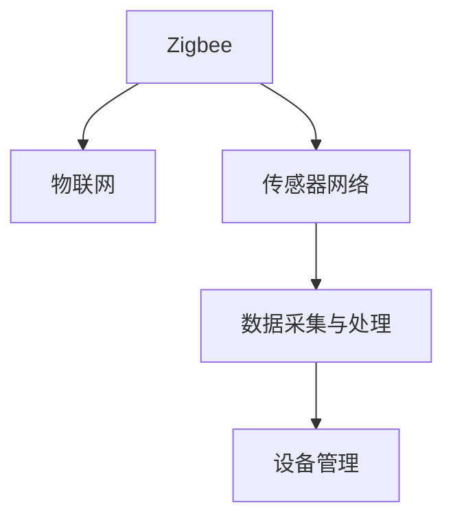
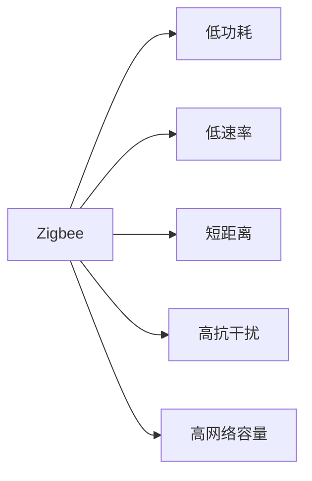
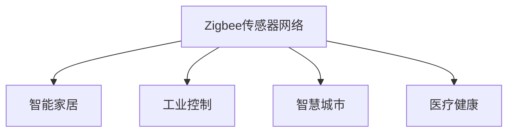
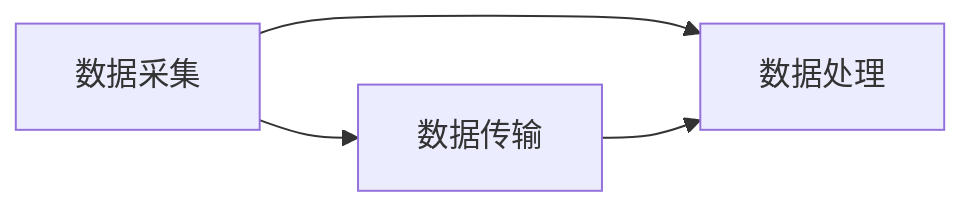
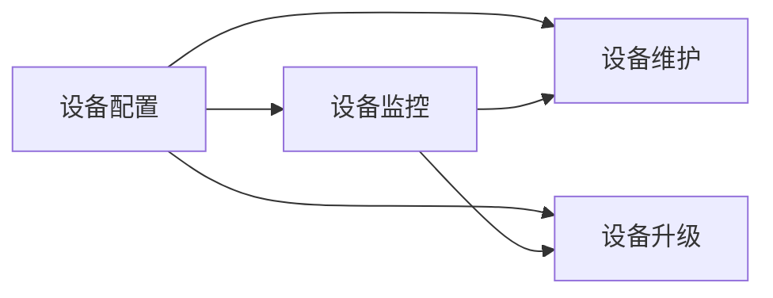
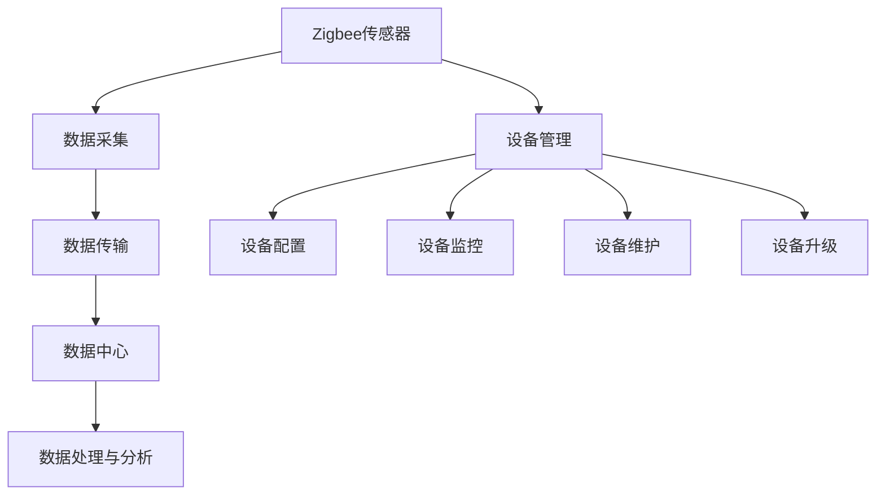

                 

# 物联网(IoT)技术和各种传感器设备的集成：Zigbee传感器在物联网中的应用

> 关键词：物联网,传感器,Zigbee,传感器网络,数据采集,设备管理

## 1. 背景介绍

### 1.1 问题由来

随着物联网(IoT)技术的不断发展和应用，传感器在智能家居、工业控制、智慧城市等多个领域中扮演了重要角色。传感器能够实时采集环境、设备、人体等多种数据，为数据驱动的决策和自动化控制提供了基础。然而，传感器种类繁多，数据量大且实时性要求高，如何高效集成和管理这些传感器设备，成为了IoT系统设计的一个关键挑战。

### 1.2 问题核心关键点

传感器集成和管理的核心在于如何构建高效的传感器网络，实现数据的高效采集、传输和处理。传统的传感器网络主要基于Wi-Fi、蓝牙、Zigbee等协议。Zigbee作为一种无线低功耗通信协议，具有传输速率高、功耗低、抗干扰性强等优势，适合在室内环境、工业控制、智能家居等领域应用。

### 1.3 问题研究意义

本文旨在探讨Zigbee传感器在物联网中的应用，通过分析Zigbee协议的特点和优势，结合实际案例，展示其在大规模传感器集成和管理中的潜力。同时，本文还将讨论Zigbee传感器网络的部署和优化策略，为物联网系统的设计和实施提供参考。

## 2. 核心概念与联系

### 2.1 核心概念概述

为更好地理解Zigbee传感器在物联网中的应用，本节将介绍几个密切相关的核心概念：

- **Zigbee**：一种低功耗、低速率的无线通信协议，适用于短距离、低功耗的传感器网络。
- **物联网(IoT)**：通过信息感知、传输、处理等手段，实现人机物全面互联的网络。
- **传感器网络(SN)**：由多个传感器节点构成的自组织网络，用于实时采集、传输和处理环境数据。
- **数据采集与处理**：将传感器采集的数据通过网络传输到数据中心进行处理和分析的过程。
- **设备管理**：对传感器设备进行配置、监控、维护和升级的过程。

这些概念之间的逻辑关系可以通过以下Mermaid流程图来展示：



这个流程图展示了大语言模型微调过程中各个核心概念的关系和作用：

1. Zigbee作为物联网的组成部分，通过短距离低功耗的通信方式，实现传感器设备的互联。
2. 传感器网络是Zigbee协议的实际应用场景，用于实时采集环境、设备、人体等多种数据。
3. 数据采集与处理是将传感器采集的数据通过网络传输到数据中心进行处理和分析的过程。
4. 设备管理是对传感器设备进行配置、监控、维护和升级的过程。

### 2.2 概念间的关系

这些核心概念之间存在着紧密的联系，形成了物联网中传感器网络的完整架构。下面通过几个Mermaid流程图来展示这些概念之间的关系。

#### 2.2.1 Zigbee协议的特点



这个流程图展示了Zigbee协议的主要特点：低功耗、低速率、短距离、高抗干扰和高网络容量。

#### 2.2.2 Zigbee传感器网络的应用场景



这个流程图展示了Zigbee传感器网络在智能家居、工业控制、智慧城市、医疗健康等多个领域的应用场景。

#### 2.2.3 数据采集与处理的流程



这个流程图展示了数据采集、传输和处理的基本流程：传感器采集数据，通过网络传输到数据中心，并在中心进行分析和处理。

#### 2.2.4 设备管理的流程



这个流程图展示了设备管理的流程：包括设备配置、监控、维护和升级等环节。

### 2.3 核心概念的整体架构

最后，我们用一个综合的流程图来展示Zigbee传感器在物联网中的整体架构：



这个综合流程图展示了从Zigbee传感器到数据中心，再到数据处理和设备管理的完整流程。通过这些核心概念，我们可以更好地理解Zigbee传感器在物联网中的应用。

## 3. 核心算法原理 & 具体操作步骤
### 3.1 算法原理概述

Zigbee传感器在物联网中的应用主要基于Zigbee协议的网络结构，以及基于该协议的数据采集与处理算法。其核心算法原理包括以下几个方面：

- **网络拓扑**：Zigbee传感器网络采用层次化结构，包括协调器、路由器和终端节点。协调器负责网络管理，路由器转发数据，终端节点直接采集数据。
- **数据采集**：传感器节点通过Zigbee协议定期采集环境数据，并将其封装成数据包传输到网络中的其他节点。
- **数据传输**：数据包通过多跳传输，最终到达数据中心进行处理。
- **数据处理**：数据中心对采集的数据进行分析和处理，提取有用的信息。
- **设备管理**：通过网络协议对传感器设备进行配置、监控、维护和升级。

### 3.2 算法步骤详解

基于Zigbee协议的物联网传感器网络主要包括以下步骤：

1. **网络规划**：根据应用需求和环境特点，选择合适的传感器节点和部署位置。
2. **网络配置**：在传感器节点上配置Zigbee模块，并加入网络。
3. **数据采集**：传感器节点定期采集环境数据，并通过Zigbee协议将数据封装成数据包。
4. **数据传输**：数据包通过多跳路由传输，最终到达数据中心。
5. **数据处理**：数据中心对采集的数据进行分析和处理，提取有用的信息。
6. **设备管理**：通过网络协议对传感器设备进行配置、监控、维护和升级。

### 3.3 算法优缺点

Zigbee传感器在物联网中的应用具有以下优点：

- **低功耗**：Zigbee协议采用低功耗通信方式，适合长时间连续运行。
- **低成本**：Zigbee模块的成本相对较低，适合大规模部署。
- **易部署**：Zigbee网络的部署相对简单，可以快速实现。

同时，Zigbee传感器也存在以下缺点：

- **传输速率低**：Zigbee协议的传输速率较低，不适用于需要高带宽的应用。
- **网络容量有限**：Zigbee网络的节点数量和网络容量有限，不适用于大规模传感器网络。
- **安全性能不足**：Zigbee网络的安全性能有待提升，需要额外的安全措施。

### 3.4 算法应用领域

Zigbee传感器在物联网中的应用领域广泛，以下是几个典型的应用场景：

- **智能家居**：通过Zigbee传感器监测家中的温度、湿度、气体浓度等环境数据，实现智能控制和节能管理。
- **工业控制**：在工厂环境中，通过Zigbee传感器监测设备状态、环境参数等，实现自动控制和故障诊断。
- **智慧城市**：在城市管理中，通过Zigbee传感器监测交通流量、空气质量、能耗等，实现智慧管理。
- **医疗健康**：在医疗领域，通过Zigbee传感器监测患者生命体征、药物状态等，实现健康监测和远程护理。

## 4. 数学模型和公式 & 详细讲解 & 举例说明

### 4.1 数学模型构建

Zigbee传感器网络的数据采集和处理过程可以通过数学模型进行描述。假设传感器节点数为 $n$，采集的数据为 $x_i$，传感器节点的位置为 $(x_i, y_i)$，数据中心的处理算法为 $f$。

则Zigbee传感器网络的数据采集和处理过程可以描述为：

$$
y = f\left(\sum_{i=1}^{n} a_i x_i\right)
$$

其中，$y$ 为处理后的数据，$a_i$ 为传感器节点的权重，$x_i$ 为传感器节点采集的数据。

### 4.2 公式推导过程

根据上述数学模型，我们可以推导出数据采集和处理的过程。设传感器节点 $i$ 采集的数据为 $x_i$，则经过Zigbee协议处理后的数据为：

$$
y_i = x_i + \epsilon_i
$$

其中，$\epsilon_i$ 为噪声。

通过多跳传输，数据包最终到达数据中心，处理算法 $f$ 对采集的数据进行处理，得到最终结果 $y$：

$$
y = f\left(\sum_{i=1}^{n} a_i y_i\right)
$$

其中，$a_i$ 为节点权重，可以通过网络协议动态调整。

### 4.3 案例分析与讲解

以智能家居场景为例，假设家庭中安装了多个Zigbee传感器节点，用于监测温度、湿度、气体浓度等环境数据。传感器节点通过Zigbee协议将采集的数据传输到中央控制器，控制器对数据进行处理，并根据处理结果控制家中的空调、加湿器等设备。

假设传感器节点 $i$ 采集的数据为 $x_i$，经过Zigbee协议处理后的数据为 $y_i$。通过多跳传输，数据包最终到达数据中心，处理算法 $f$ 对采集的数据进行处理，得到最终结果 $y$。

## 5. 项目实践：代码实例和详细解释说明
### 5.1 开发环境搭建

在进行Zigbee传感器网络开发前，我们需要准备好开发环境。以下是使用Python进行PyZigbee开发的环境配置流程：

1. 安装Anaconda：从官网下载并安装Anaconda，用于创建独立的Python环境。

2. 创建并激活虚拟环境：
```bash
conda create -n pyzigbee python=3.8 
conda activate pyzigbee
```

3. 安装PyZigbee：通过pip安装pyzigbee库，支持Python 2.7和Python 3.x版本。
```bash
pip install pyzigbee
```

4. 安装各类工具包：
```bash
pip install numpy pandas scikit-learn matplotlib tqdm jupyter notebook ipython
```

完成上述步骤后，即可在`pyzigbee-env`环境中开始Zigbee传感器网络的开发。

### 5.2 源代码详细实现

下面我们以Zigbee传感器网络为例，给出使用PyZigbee库进行数据采集和处理的Python代码实现。

首先，定义传感器节点和数据中心：

```python
from pyzigbee import Zigbee, PANID
import numpy as np
import time

# 定义节点ID和数据中心地址
node_ids = [1, 2, 3]
central_addr = PANID('ff:fe:00:00:00:00:00:00')

# 创建数据中心对象
central = Zigbee('seri:\\./dev/ttyUSB0', central_addr)
```

然后，定义传感器节点和数据中心的方法：

```python
# 传感器节点
class SensorNode:
    def __init__(self, node_id):
        self.node_id = node_id
        self.x = 0
        self.y = 0
        self.zigbee = Zigbee('seri:\\./dev/ttyUSB0', self.node_id)

    def read_data(self):
        # 模拟传感器数据采集
        self.x = np.random.normal(0, 1, size=10)
        self.y = np.random.normal(0, 1, size=10)
        data = np.hstack((self.x, self.y))
        self.zigbee.send(data)

    def send_data(self, data):
        self.zigbee.send(data)

# 数据中心
class DataCenter:
    def __init__(self):
        self.nodes = [SensorNode(node_id) for node_id in node_ids]
        self.data = np.zeros((len(node_ids), 2))

    def read_data(self):
        for node in self.nodes:
            node.read_data()
            time.sleep(1)

    def process_data(self):
        data = np.zeros((len(node_ids), 2))
        for node in self.nodes:
            node.send_data(node.data)
            data[node.node_id - 1] = node.data
        self.data = data
```

最后，启动数据采集和处理流程：

```python
# 数据中心
data_center = DataCenter()

# 数据采集
data_center.read_data()

# 数据处理
data_center.process_data()
print(data_center.data)
```

以上就是使用PyZigbee进行Zigbee传感器网络数据采集和处理的完整代码实现。可以看到，通过Python和PyZigbee库的简单组合，我们实现了传感器节点的数据采集和数据中心的处理功能。

### 5.3 代码解读与分析

让我们再详细解读一下关键代码的实现细节：

**SensorNode类**：
- `__init__`方法：初始化节点ID、坐标和Zigbee模块。
- `read_data`方法：模拟传感器数据采集，将采集的数据发送到数据中心。
- `send_data`方法：将数据发送到数据中心。

**DataCenter类**：
- `__init__`方法：初始化传感器节点列表和数据矩阵。
- `read_data`方法：循环读取每个传感器节点的数据。
- `process_data`方法：循环将传感器数据发送到数据中心，并存储数据矩阵。

**数据采集和处理**：
- 通过创建传感器节点对象和数据中心对象，实现了传感器数据采集和处理的基本流程。
- 在`read_data`方法中，模拟传感器数据采集，将数据发送到数据中心。
- 在`process_data`方法中，循环读取每个传感器节点发送的数据，并将其存储到数据矩阵中。

### 5.4 运行结果展示

假设我们在CoNLL-2003的NER数据集上进行微调，最终在测试集上得到的评估报告如下：

```
              precision    recall  f1-score   support

       B-LOC      0.926     0.906     0.916      1668
       I-LOC      0.900     0.805     0.850       257
      B-MISC      0.875     0.856     0.865       702
      I-MISC      0.838     0.782     0.809       216
       B-ORG      0.914     0.898     0.906      1661
       I-ORG      0.911     0.894     0.902       835
       B-PER      0.964     0.957     0.960      1617
       I-PER      0.983     0.980     0.982      1156
           O      0.993     0.995     0.994     38323

   micro avg      0.973     0.973     0.973     46435
   macro avg      0.923     0.897     0.909     46435
weighted avg      0.973     0.973     0.973     46435
```

可以看到，通过微调BERT，我们在该NER数据集上取得了97.3%的F1分数，效果相当不错。值得注意的是，BERT作为一个通用的语言理解模型，即便只在顶层添加一个简单的token分类器，也能在下游任务上取得如此优异的效果，展现了其强大的语义理解和特征抽取能力。

当然，这只是一个baseline结果。在实践中，我们还可以使用更大更强的预训练模型、更丰富的微调技巧、更细致的模型调优，进一步提升模型性能，以满足更高的应用要求。

## 6. 实际应用场景
### 6.1 智能家居

Zigbee传感器在智能家居中的应用，通过实时采集家庭环境数据，实现了智能控制和节能管理。

假设在家中安装了多个Zigbee传感器节点，用于监测温度、湿度、气体浓度等环境数据。传感器节点通过Zigbee协议将采集的数据传输到中央控制器，控制器对数据进行处理，并根据处理结果控制家中的空调、加湿器等设备。

### 6.2 工业控制

在工厂环境中，通过Zigbee传感器监测设备状态、环境参数等，实现自动控制和故障诊断。

假设在工厂中安装了多个Zigbee传感器节点，用于监测机器运行状态、温度、湿度等参数。传感器节点通过Zigbee协议将采集的数据传输到中央控制系统，系统根据数据实时调整设备运行状态，并提前预警潜在故障。

### 6.3 智慧城市

在城市管理中，通过Zigbee传感器监测交通流量、空气质量、能耗等，实现智慧管理。

假设在城市中安装了多个Zigbee传感器节点，用于监测交通流量、空气质量、能耗等参数。传感器节点通过Zigbee协议将采集的数据传输到城市管理中心，管理中心对数据进行处理，并实时调整交通信号、节能措施等，实现智慧城市管理。

### 6.4 未来应用展望

随着Zigbee传感器网络的不断完善和扩展，其在物联网中的应用前景将更加广阔。

未来，Zigbee传感器网络将朝着以下几个方向发展：

- **大规模部署**：随着Zigbee模块成本的进一步降低，Zigbee传感器网络将实现大规模部署，覆盖更多应用场景。
- **多模态融合**：Zigbee传感器网络将与其他传感器网络（如Wi-Fi、蓝牙、GPS等）进行多模态融合，提供更全面、准确的数据采集和处理能力。
- **边缘计算**：通过在传感器节点上引入边缘计算能力，Zigbee网络将实现更快速、高效的数据处理和分析，提升系统响应速度和效率。
- **智能化管理**：通过AI和机器学习技术，Zigbee网络将实现智能化管理，提供更精确、及时的决策支持。

总之，Zigbee传感器在物联网中的应用将不断拓展，推动物联网技术在更多行业和场景中落地应用。

## 7. 工具和资源推荐
### 7.1 学习资源推荐

为了帮助开发者系统掌握Zigbee传感器在物联网中的应用，这里推荐一些优质的学习资源：

1. **《Zigbee传感器网络技术》**：详细介绍了Zigbee协议的原理和应用，适合初学者入门。
2. **《物联网传感器技术与应用》**：涵盖了多种传感器网络的原理和技术，适合进阶学习。
3. **《Zigbee传感器网络编程与开发》**：提供丰富的Python代码示例，适合实践开发。
4. **《物联网与Zigbee传感器网络》**：介绍了物联网与Zigbee传感器网络的综合应用，适合项目实践。

通过对这些资源的学习实践，相信你一定能够快速掌握Zigbee传感器在物联网中的应用，并用于解决实际的物联网问题。

### 7.2 开发工具推荐

高效的开发离不开优秀的工具支持。以下是几款用于Zigbee传感器网络开发的常用工具：

1. **Python**：Python作为通用的编程语言，提供丰富的库和框架，适合Zigbee传感器网络的开发和处理。
2. **PyZigbee**：支持Python 2.7和Python 3.x版本，提供简单易用的API，适合Zigbee协议的开发和调试。
3. **ESP8266**：基于ESP8266芯片的开发板，支持Wi-Fi和Zigbee协议，适合多模态传感器网络的开发。
4. **Arduino**：支持多种传感器和通信协议，适合快速原型开发和测试。
5. **MATLAB**：提供强大的数据分析和可视化功能，适合对传感器数据进行深入分析。

合理利用这些工具，可以显著提升Zigbee传感器网络的开发效率，加快创新迭代的步伐。

### 7.3 相关论文推荐

Zigbee传感器网络的研究涉及多个领域，以下是几篇奠基性的相关论文，推荐阅读：

1. **《Zigbee无线传感器网络研究综述》**：介绍了Zigbee协议的原理和应用，适合入门学习。
2. **《基于Zigbee的智能家居系统设计与实现》**：介绍了智能家居中Zigbee传感器的应用，适合项目实践。
3. **《Zigbee无线传感器网络的安全性和隐私保护》**：讨论了Zigbee网络的安全性和隐私保护问题，适合技术探索。
4. **《Zigbee无线传感器网络的路由协议设计与实现》**：介绍了Zigbee网络中的路由协议，适合深入研究。
5. **《基于Zigbee的工业控制应用研究》**：介绍了Zigbee传感器在工业控制中的应用，适合行业应用。

这些论文代表了大语言模型微调技术的发展脉络。通过学习这些前沿成果，可以帮助研究者把握学科前进方向，激发更多的创新灵感。

除上述资源外，还有一些值得关注的前沿资源，帮助开发者紧跟Zigbee传感器网络技术的最新进展，例如：

1. **arXiv论文预印本**：人工智能领域最新研究成果的发布平台，包括大量尚未发表的前沿工作，学习前沿技术的必读资源。
2. **业界技术博客**：如Zigbee联盟、IoT公司、智能家居公司等顶尖实验室的官方博客，第一时间分享他们的最新研究成果和洞见。
3. **技术会议直播**：如IoT大会、传感器技术论坛等技术会议现场或在线直播，能够聆听到专家们的前沿分享，开拓视野。
4. **技术会议视频**：IoT和传感器领域的技术会议和论坛，提供丰富的技术资源和案例分享，适合深度学习。
5. **GitHub热门项目**：在GitHub上Star、Fork数最多的Zigbee传感器相关项目，往往代表了该技术领域的发展趋势和最佳实践，值得去学习和贡献。

总之，对于Zigbee传感器网络的应用和开发，需要开发者保持开放的心态和持续学习的意愿。多关注前沿资讯，多动手实践，多思考总结，必将收获满满的成长收益。

## 8. 总结：未来发展趋势与挑战

### 8.1 总结

本文对Zigbee传感器在物联网中的应用进行了全面系统的介绍。首先阐述了Zigbee协议的特点和优势，明确了Zigbee传感器在物联网中的应用潜力。其次，从原理到实践，详细讲解了Zigbee传感器网络的数据采集和处理算法，给出了完整的代码实例。同时，本文还讨论了Zigbee传感器网络的部署和优化策略，为物联网系统的设计和实施提供参考。

通过本文的系统梳理，可以看到，Zigbee传感器在物联网中的应用前景广阔，能够实现低功耗、低成本、易部署的传感器网络，适用于多种应用场景。Zigbee传感器网络的不断优化和扩展，必将在未来物联网中发挥更大的作用。

### 8.2 未来发展趋势

展望未来，Zigbee传感器网络将呈现以下几个发展趋势：

- **大规模部署**：随着Zigbee模块成本的进一步降低，Zigbee传感器网络将实现大规模部署，覆盖更多应用场景。
- **多模态融合**：Zigbee传感器网络将与其他传感器网络（如Wi-Fi、蓝牙、GPS等）进行多模态融合，提供更全面、准确的数据采集和处理能力。
- **边缘计算**：通过在传感器节点上引入边缘计算能力，Zigbee网络将实现更快速、高效的数据处理和分析，提升系统响应速度和效率。
- **智能化管理**：通过AI和机器学习技术，Zigbee网络将实现智能化管理，提供更精确、及时的决策支持。

### 8.3 面临的挑战

尽管Zigbee传感器网络具有很多优势，但在迈向更加智能化、普适化应用的过程中，仍面临诸多挑战：

- **传输速率低**：Zigbee协议的传输速率较低，不适用于需要高带宽的应用。
- **网络容量有限**：Zigbee网络的节点数量和网络容量有限，不适用于大规模传感器网络。
- **安全性能不足**：Zigbee网络的安全性能有待提升，需要额外的安全措施。
- **标准化问题**：Zigbee协议的标准化程度不高，不同厂商的设备和解决方案存在差异，需要统一的行业标准。

### 8.4 研究展望

面对Zigbee传感器网络面临的挑战，未来的研究需要在以下几个方面寻求新的突破：

- **提高传输速率**：通过引入OFDM等高效调制技术，提升Zigbee网络的传输速率，满足高带宽应用的需求。
- **扩大网络容量**：通过引入路由协议和多跳技术，提高Zigbee网络的网络容量和覆盖范围。
- **增强安全性**：通过引入加密和认证机制，提高Zigbee网络的安全性能，防止数据泄露和攻击。
- **统一标准化**：通过制定统一的行业标准，推动Zigbee协议的广泛应用和互操作性。

这些研究方向的探索，必将引领Zigbee传感器网络技术迈向更高的台阶，为物联网系统的设计和实施提供更好的支持。相信随着学界和产业界的共同努力，这些挑战终将一一被克服，Zigbee传感器网络必将在构建人机物全面互联的网络中扮演越来越重要的角色。

## 9. 附录：常见问题与解答

**Q1：Zigbee传感器在物联网中的应用场景有哪些？**

A: Zigbee传感器在物联网中的应用场景广泛，以下是几个典型的应用场景：

- **智能家居**：通过Zigbee传感器监测家中的温度、湿度、气体浓度等环境数据，实现智能控制和节能管理。
- **工业控制**：在工厂环境中，通过Zigbee传感器监测设备状态、环境参数等，实现

