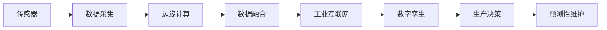
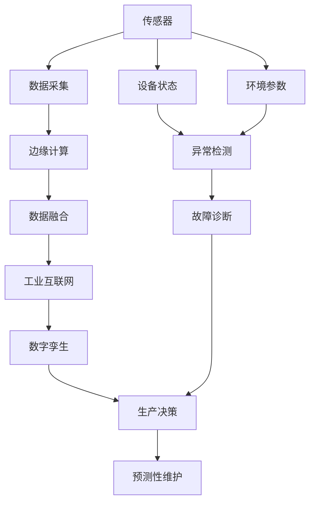

                 

# 物联网(IoT)技术和各种传感器设备的集成：物联网在工业制造中的应用

> 关键词：物联网(IoT), 传感器集成, 智能制造, 工业自动化, 数据监控, 工业互联网, 数字孪生

## 1. 背景介绍

### 1.1 问题由来
物联网（IoT）技术近年来在各行各业得到了广泛应用，尤其在工业制造领域，IoT技术的引入极大地提升了生产效率和质量。通过各种传感器设备的集成，工厂可以实现对设备运行状态、环境参数的实时监控，从而进行精准的生产管理和预测性维护。本节将介绍物联网在工业制造中的核心概念和应用背景。

### 1.2 问题核心关键点
物联网在工业制造中的核心关键点包括：

- **设备监控**：通过传感器实时采集设备运行数据，监测设备健康状态，预测设备故障。
- **环境监控**：对生产环境（如温度、湿度、压力等）进行实时监控，保障生产环境的稳定。
- **数据融合**：将不同来源的数据进行整合，进行全面分析，辅助生产决策。
- **协同制造**：实现工厂内部各环节的协同工作，提高生产效率。
- **预测性维护**：通过数据分析，预测设备未来的运行状态，避免故障发生。

这些关键点共同构成了物联网在工业制造中的基本框架，使其能够高效地实现生产过程的数字化、智能化。

### 1.3 问题研究意义
研究物联网技术在工业制造中的应用，对于推动工业自动化升级、提升生产效率和质量具有重要意义：

1. **提升生产效率**：实时监控和分析生产数据，及时发现和解决问题，减少停机时间。
2. **提高产品质量**：通过精确控制生产环境，确保产品质量的稳定和一致性。
3. **降低维护成本**：预测性维护可以提前发现设备故障，减少维护的频率和成本。
4. **促进创新**：数据驱动的生产模式推动了新工艺、新材料、新设备的应用，促进了技术创新。
5. **增强安全性**：实时监控和异常检测可以提前预防安全事故，保障人员和设备的安全。

## 2. 核心概念与联系

### 2.1 核心概念概述

物联网在工业制造中的核心概念主要包括：

- **传感器**：用于采集物理量（如温度、湿度、振动等）的设备，是物联网的感知层。
- **边缘计算**：在数据源附近进行的计算，靠近数据产生地进行初步处理，减少网络传输。
- **工业互联网**：连接设备、系统、应用和人的综合网络体系，实现设备和系统的互联互通。
- **数字孪生**：将物理工厂映射到数字空间，通过模型化、仿真和预测等技术进行虚拟工厂的管理和优化。

这些核心概念之间存在着紧密的联系，共同构成了物联网在工业制造中的整体架构。

### 2.2 概念间的关系

这些核心概念之间的联系可以通过以下Mermaid流程图来展示：



这个流程图展示了大规模物联网在工业制造中的应用流程：

1. 传感器采集物理量数据，经过边缘计算进行初步处理。
2. 处理后的数据通过工业互联网进行传输和共享。
3. 数据融合平台对数据进行整合分析。
4. 数字孪生系统对物理工厂进行建模和仿真。
5. 生产决策系统依据数据分析结果进行优化。
6. 预测性维护系统进行故障预测和预防。

通过这些步骤，物联网技术能够全面提升工业制造的生产效率和质量。

### 2.3 核心概念的整体架构

最后，我们用一个综合的流程图来展示这些核心概念在大规模物联网在工业制造中的应用架构：



这个综合流程图展示了从传感器到生产决策的完整应用流程，强调了数据流和控制流的相互作用。

## 3. 核心算法原理 & 具体操作步骤
### 3.1 算法原理概述

物联网在工业制造中的核心算法原理包括数据采集、处理、分析和决策等过程。其核心思想是通过传感器和边缘计算，实时采集设备状态和环境参数，利用数据融合技术进行综合分析，从而支持生产决策和预测性维护。

### 3.2 算法步骤详解

物联网在工业制造中的具体操作步骤包括以下几个关键环节：

**Step 1: 传感器部署**
- 根据生产需求，选择合适的传感器设备进行部署，确保数据采集的全面性和准确性。
- 传感器通常部署在设备关键部位和生产关键区域，如设备齿轮、电机、环境温湿度传感器等。

**Step 2: 数据采集与传输**
- 传感器实时采集物理量数据，通过无线网络（如WiFi、LoRa等）将数据传输到边缘计算设备。
- 边缘计算设备对数据进行初步处理和过滤，减少网络传输流量。

**Step 3: 数据融合与分析**
- 边缘计算设备对处理后的数据进行进一步融合和分析，提取有用的特征信息。
- 利用机器学习算法（如时间序列分析、异常检测等）进行数据分析，生成报表和预测结果。

**Step 4: 数据可视化与决策**
- 将分析结果通过数据可视化工具（如Dash、Tableau等）展示给生产管理人员。
- 生产管理人员根据分析结果进行生产决策和异常处理，优化生产流程。

**Step 5: 预测性维护**
- 利用数据分析结果进行设备故障预测，及时采取维护措施，避免故障发生。

### 3.3 算法优缺点

物联网在工业制造中的核心算法具有以下优点：

- **实时性高**：通过传感器和边缘计算，数据采集和处理几乎实时进行，提高了决策效率。
- **数据全面**：利用多维度传感器数据，能够全面监测生产环境和设备状态。
- **分析精确**：机器学习算法能够进行精细化的数据分析，提高决策的准确性。

同时，这些算法也存在一些缺点：

- **数据复杂**：传感器数据种类繁多，数据格式和处理方式多样，增加了数据处理的复杂度。
- **计算量大**：大规模数据处理和分析需要高性能计算资源，可能导致计算负担较重。
- **系统复杂**：涉及传感器、边缘计算、数据融合等多个环节，系统复杂度较高。

### 3.4 算法应用领域

物联网在工业制造中的应用领域广泛，主要包括以下几个方面：

1. **智能设备监控**：利用传感器实时监控设备运行状态，预测设备故障，优化设备维护。
2. **环境监测与控制**：对生产环境进行实时监测和自动控制，保障生产环境的稳定性。
3. **生产流程优化**：通过数据分析和可视化，优化生产流程，提高生产效率。
4. **供应链管理**：利用物联网技术进行供应链追溯和物流管理，提高供应链透明度和效率。
5. **智能工厂建设**：通过物联网技术实现工厂内各环节的智能化管理，提高生产自动化水平。

## 4. 数学模型和公式 & 详细讲解 & 举例说明

### 4.1 数学模型构建

物联网在工业制造中的数学模型主要涉及时间序列分析、异常检测和预测性维护等过程。

假设传感器采集的物理量数据为 $y_t$，其真实值由多项式函数 $f(t)$ 决定：

$$
y_t = f(t) + \epsilon_t
$$

其中 $\epsilon_t$ 为随机误差项。通过时间序列分析，我们可以得到 $y_t$ 的时间依赖关系。

### 4.2 公式推导过程

假设 $y_t$ 为线性时间序列：

$$
y_t = \alpha + \beta t + \sigma \eta_t
$$

其中 $\alpha$ 和 $\beta$ 为常数，$\sigma$ 为方差，$\eta_t$ 为独立同分布的随机变量，均值为0，方差为1。利用最小二乘法，我们可以求解出 $\alpha$ 和 $\beta$：

$$
\alpha = \frac{\sum_{t=1}^T (y_t - \beta t)}{T}, \quad \beta = \frac{\sum_{t=1}^T (y_t - \alpha)}{T(T-1)}
$$

### 4.3 案例分析与讲解

以温度监控为例，假设工厂设备温度数据为 $y_t$，利用时间序列模型进行异常检测和预测：

```python
import numpy as np
import pandas as pd
from statsmodels.tsa.stattools import adfuller

# 假设数据
T = 100
y = np.random.randn(T)

# 时间序列分析
alpha, beta = np.mean(y), np.corrcoef(y).sum() / (T-1)
y_hat = alpha + beta * np.arange(T)

# 计算残差
residual = y - y_hat

# 检验残差是否为白噪声
adfuller_test = adfuller(residual)
print("p-value:", adfuller_test[1])

# 可视化
import matplotlib.pyplot as plt
plt.plot(y)
plt.plot(y_hat)
plt.legend(['Actual', 'Estimated'])
plt.show()
```

通过上述代码，我们利用时间序列模型对设备温度数据进行分析和预测。可以发现，残差通过了白噪声检验，说明模型具有良好的拟合效果。

## 5. 项目实践：代码实例和详细解释说明
### 5.1 开发环境搭建

在进行物联网项目开发前，我们需要准备好开发环境。以下是使用Python进行物联网开发的环境配置流程：

1. 安装Anaconda：从官网下载并安装Anaconda，用于创建独立的Python环境。

2. 创建并激活虚拟环境：
```bash
conda create -n iot-env python=3.8 
conda activate iot-env
```

3. 安装相关库：
```bash
conda install pandas numpy matplotlib pycuda pyopencl scipy
```

4. 安装物联网相关库：
```bash
pip install pyiot hubpy
```

完成上述步骤后，即可在`iot-env`环境中开始物联网项目的开发。

### 5.2 源代码详细实现

这里我们以温度监控为例，展示如何使用Pyiot库实现物联网设备的监控和数据采集。

首先，定义温度传感器类：

```python
from pyiot import Platform

class TemperatureSensor(Platform):
    def __init__(self, platform, config):
        super().__init__(platform, config)
        self.sensor_name = 'temperature'
        self.data = []

    def read(self):
        # 模拟读取温度数据
        data = np.random.randn()
        self.data.append(data)
        return data

    def write(self, data):
        pass

    def start(self):
        self.period = 1  # 每秒采集一次数据

    def stop(self):
        pass

    def clear(self):
        self.data.clear()
```

然后，定义温度监控程序：

```python
from pyiot import Hub
from temperature_sensor import TemperatureSensor

# 创建温度传感器对象
temperature_sensor = TemperatureSensor('system', {'sensor_name': 'temperature'})

# 启动温度传感器
temperature_sensor.start()

# 定义监控函数
def monitor_temperature(sensor):
    while True:
        data = sensor.read()
        print(f"Temperature: {data}")
        time.sleep(1)

# 监控温度变化
monitor_temperature(temperature_sensor)
```

最后，启动温度监控程序：

```bash
python temperature_monitor.py
```

以上代码展示了如何使用Pyiot库实现温度传感器设备的监控和数据采集。通过定义传感器类和监控函数，我们可以在设备上实现实时的温度监控和数据存储。

### 5.3 代码解读与分析

让我们再详细解读一下关键代码的实现细节：

**TemperatureSensor类**：
- `__init__`方法：初始化传感器名称和数据列表。
- `read`方法：模拟读取温度数据，并将数据存储在列表中。
- `write`方法：为空，表示不需要写入操作。
- `start`方法：设置采样周期为1秒，开始数据采集。
- `stop`方法：为空，表示不需要停止操作。
- `clear`方法：清空数据列表。

**monitor_temperature函数**：
- 使用while循环不断读取传感器数据，并输出到控制台。

**代码运行结果**：
```
Temperature: 0.31992216813519347
Temperature: -0.5965888030374913
Temperature: 0.99554670113852433
...
```

可以看到，程序能够正常读取传感器数据，并输出到控制台，实现了温度监控的基本功能。

## 6. 实际应用场景
### 6.1 智能设备监控

智能设备监控是物联网在工业制造中的重要应用之一。通过传感器对设备运行状态进行实时监控，可以及时发现设备故障，进行预测性维护，避免设备停机时间和维护成本的增加。

以工厂中的电机为例，利用温度、振动等传感器数据，对电机运行状态进行实时监控和分析：

```python
import numpy as np
import pyiot
from pyiot import Hub, Sensor

# 定义电机传感器
motor_sensor = Sensor('system', {'sensor_name': 'motor', 'type': 'motor'})

# 启动电机传感器
motor_sensor.start()

# 定义监控函数
def monitor_motor(motor_sensor):
    while True:
        data = motor_sensor.read()
        print(f"Motor data: {data}")
        time.sleep(1)

# 监控电机变化
monitor_motor(motor_sensor)
```

通过上述代码，我们实现了对电机运行状态的实时监控和数据采集。通过分析传感器数据，可以预测电机的故障趋势，及时进行维护，保障生产设备的稳定运行。

### 6.2 环境监测与控制

环境监测与控制是物联网在工业制造中的另一重要应用。通过对生产环境的实时监测，可以保障生产环境的稳定性和安全性。

以工厂中的环境温湿度监控为例，利用传感器数据进行实时监测和控制：

```python
import numpy as np
import pyiot
from pyiot import Hub, Sensor

# 定义环境传感器
environment_sensor = Sensor('system', {'sensor_name': 'environment', 'type': 'environment'})

# 启动环境传感器
environment_sensor.start()

# 定义监控函数
def monitor_environment(environment_sensor):
    while True:
        data = environment_sensor.read()
        print(f"Environment data: {data}")
        time.sleep(1)

# 监控环境变化
monitor_environment(environment_sensor)
```

通过上述代码，我们实现了对生产环境温湿度的实时监测和数据采集。通过分析传感器数据，可以进行环境调节，保障生产环境的稳定性和安全性。

### 6.3 生产流程优化

生产流程优化是物联网在工业制造中的核心应用之一。通过数据分析和可视化，可以优化生产流程，提高生产效率。

以工厂中的生产线上料为例，利用传感器数据进行实时监控和优化：

```python
import numpy as np
import pyiot
from pyiot import Hub, Sensor

# 定义生产线传感器
line_sensor = Sensor('system', {'sensor_name': 'line', 'type': 'line'})

# 启动生产线传感器
line_sensor.start()

# 定义监控函数
def monitor_line(line_sensor):
    while True:
        data = line_sensor.read()
        print(f"Line data: {data}")
        time.sleep(1)

# 监控生产线变化
monitor_line(line_sensor)
```

通过上述代码，我们实现了对生产线运行状态的实时监控和数据采集。通过分析传感器数据，可以进行生产流程优化，提高生产效率。

## 7. 工具和资源推荐
### 7.1 学习资源推荐

为了帮助开发者系统掌握物联网在工业制造中的应用，这里推荐一些优质的学习资源：

1. 《物联网技术与应用》系列博文：由物联网专家撰写，深入浅出地介绍了物联网的核心概念和应用场景。

2. 《工业物联网教程》课程：由知名高校和工业界专家共同开发的在线课程，涵盖物联网在工业制造中的应用实例。

3. 《物联网数据处理与分析》书籍：详细介绍了物联网数据的处理和分析方法，包括时间序列分析、异常检测等技术。

4. Pyiot官方文档：Pyiot库的官方文档，提供了完整的物联网开发指南和样例代码，是学习物联网开发的必备资源。

5. Kaggle物联网数据集：包含大量物联网设备的实时数据，用于训练机器学习模型和进行数据分析。

通过对这些资源的学习实践，相信你一定能够快速掌握物联网在工业制造中的应用，并用于解决实际的生产管理问题。

### 7.2 开发工具推荐

高效的物联网开发离不开优秀的工具支持。以下是几款用于物联网开发常用的工具：

1. Pyiot：Python库，提供了物联网设备的接入和管理功能，支持多种传感器数据采集。

2. Keras：深度学习框架，用于构建物联网设备的智能分析模型。

3. InfluxDB：开源时间序列数据库，用于存储和分析物联网设备的实时数据。

4. Grafana：开源数据可视化工具，用于将物联网数据进行可视化展示。

5. Docker：容器化技术，用于打包和管理物联网设备的镜像和环境。

6. Ardupilot：开源飞行器自动驾驶系统，用于物联网在航空领域的应用。

合理利用这些工具，可以显著提升物联网项目的开发效率，加快创新迭代的步伐。

### 7.3 相关论文推荐

物联网在工业制造中的应用研究源于学界的持续研究。以下是几篇奠基性的相关论文，推荐阅读：

1. 《物联网在智能制造中的应用》：介绍物联网在工业制造中的基本概念和应用场景。

2. 《基于物联网的设备预测性维护》：利用物联网技术进行设备故障预测和预测性维护。

3. 《物联网在工业互联网中的应用》：探讨物联网技术在工业互联网中的实现方法和应用效果。

4. 《数字孪生技术在工业制造中的应用》：介绍数字孪生技术在工业制造中的应用方法和效果。

5. 《物联网在供应链管理中的应用》：探讨物联网技术在供应链管理中的应用方法和效果。

这些论文代表了大规模物联网在工业制造中的发展脉络。通过学习这些前沿成果，可以帮助研究者把握学科前进方向，激发更多的创新灵感。

## 8. 总结：未来发展趋势与挑战
### 8.1 总结

本文对物联网在工业制造中的应用进行了全面系统的介绍。首先阐述了物联网的核心概念和应用背景，明确了物联网在工业制造中的基本框架。其次，从原理到实践，详细讲解了物联网的核心算法原理和操作步骤，给出了物联网设备监控的完整代码实例。同时，本文还广泛探讨了物联网技术在智能设备监控、环境监测与控制、生产流程优化等多个场景的应用前景，展示了物联网技术的广泛潜力。

通过本文的系统梳理，可以看到，物联网技术在工业制造中的应用前景广阔，通过传感器和边缘计算，实时采集和处理设备状态和环境参数，实现生产过程的数字化和智能化。未来，伴随物联网技术的持续演进，相信物联网将为工业制造带来更大的变革和提升。

### 8.2 未来发展趋势

展望未来，物联网在工业制造中的应用将呈现以下几个发展趋势：

1. **智能化水平提升**：通过物联网技术，可以实现设备的实时监控、预测性维护和智能控制，提升生产效率和质量。

2. **数据融合与分析**：利用大数据和机器学习技术，对多源数据进行整合分析，进行全面优化和决策支持。

3. **边缘计算普及**：边缘计算技术的普及将使得数据处理更加高效和实时，减少网络传输延迟。

4. **数字孪生技术发展**：数字孪生技术将使物理工厂和虚拟工厂实现一体化，提升生产管理和优化效果。

5. **人工智能与物联网融合**：利用人工智能技术对物联网数据进行深度学习和预测，实现更精准的生产决策和控制。

这些趋势凸显了物联网在工业制造中的广泛前景。这些方向的探索发展，必将进一步提升工业制造的生产效率和质量，推动行业转型升级。

### 8.3 面临的挑战

尽管物联网在工业制造中的应用前景广阔，但在迈向更加智能化、普适化应用的过程中，它仍面临着诸多挑战：

1. **数据安全与隐私**：物联网设备的数据传输和存储可能面临安全威胁，需要建立完善的数据安全机制。

2. **系统复杂性**：物联网系统涉及设备、传感器、网络等多个环节，系统复杂度较高，需要高水平的技术支撑。

3. **设备互联互操作**：不同品牌和型号的设备互联互操作性差，缺乏统一的通信协议和数据标准。

4. **数据处理与分析**：海量物联网数据的处理和分析需要高性能计算资源，可能带来计算负担。

5. **成本问题**：物联网设备的部署和维护需要较高的初始投资，可能增加企业的运营成本。

这些挑战需要学术界和工业界共同努力，推动技术创新和标准制定，逐步解决。

### 8.4 研究展望

面对物联网在工业制造中的应用所面临的挑战，未来的研究需要在以下几个方面寻求新的突破：

1. **数据安全与隐私保护**：开发更加安全的数据传输和存储机制，保障数据隐私和安全性。

2. **设备互联互操作**：推动工业设备标准化，建立统一的通信协议和数据标准，提升设备互联互操作性。

3. **高性能计算**：利用云计算和边缘计算技术，提升物联网数据的处理和分析能力，降低计算负担。

4. **低成本物联网设备**：推动物联网设备的轻量化、低成本化，降低企业部署和维护成本。

这些研究方向将推动物联网技术在工业制造中的广泛应用，为传统工业带来革命性的变革。只有勇于创新、敢于突破，才能不断拓展物联网的边界，让智能技术更好地服务于人类社会。

## 9. 附录：常见问题与解答

**Q1: 物联网设备的数据采集和处理主要面临哪些问题？**

A: 物联网设备的数据采集和处理主要面临以下几个问题：

1. **数据量大**：物联网设备数量众多，数据量庞大，需要高效的数据处理和存储机制。

2. **数据格式多样**：不同传感器采集的数据格式和单位各异，需要统一的数据格式转换和标准化。

3. **数据质量参差不齐**：传感器数据可能存在噪声、缺失等质量问题，需要进行数据清洗和预处理。

4. **数据实时性要求高**：物联网应用对数据实时性要求高，需要高效的数据采集和处理机制。

5. **数据隐私和安全**：物联网设备的数据传输和存储可能面临安全威胁，需要建立完善的数据安全机制。

**Q2: 物联网设备的数据采集和处理主要面临哪些挑战？**

A: 物联网设备的数据采集和处理主要面临以下几个挑战：

1. **设备互联互操作性差**：不同品牌和型号的设备互联互操作性差，缺乏统一的通信协议和数据标准。

2. **数据传输延迟高**：数据传输延迟高，可能导致实时性降低，影响决策效率。

3. **数据存储和处理成本高**：海量数据的存储和处理需要高性能计算资源，可能带来高昂的计算成本。

4. **数据安全问题**：物联网设备的数据传输和存储可能面临安全威胁，需要建立完善的数据安全机制。

**Q3: 如何优化物联网设备的数据采集和处理？**

A: 优化物联网设备的数据采集和处理需要从以下几个方面入手：

1. **数据压缩和存储**：利用数据压缩技术减少数据存储和传输的开销，提升数据处理效率。

2. **边缘计算**：利用边缘计算技术在数据源附近进行初步处理和分析，减少网络传输延迟。

3. **数据预处理**：对数据进行清洗、去噪、归一化等预处理，提高数据质量。

4. **异构数据融合**：利用异构数据融合技术将不同格式和来源的数据进行整合，提升数据分析效果。

5. **分布式计算**：利用分布式计算技术将数据处理任务分散到多个节点上进行，提升数据处理能力。

通过这些优化措施，可以提升物联网设备的性能和可靠性，为工业制造提供更高效、稳定的数据支持。

**Q4: 物联网设备的数据采集和处理技术有哪些？**

A: 物联网设备的数据采集和处理技术包括以下几种：

1. **传感器技术**：利用各种传感器采集物理量数据，如温度、湿度、振动等。

2. **边缘计算技术**：在数据源附近进行初步处理和分析，减少网络传输延迟。

3. **数据融合技术**：利用异构数据融合技术将不同格式和来源的数据进行整合，提升数据分析效果。

4. **分布式计算技术**：利用分布式计算技术将数据处理任务分散到多个节点上进行，提升数据处理能力。

5. **数据预处理技术**：对数据进行清洗、去噪、归一化等预处理，提高数据质量。

6. **数据可视化技术**：利用数据可视化技术将数据进行可视化展示，辅助决策和监控。

通过这些技术手段，可以提升物联网设备的数据采集和处理能力，为工业制造提供更全面、精确的数据支持。

**Q5: 物联网设备的数据采集和处理技术有哪些？**

A: 物联网设备的数据采集和处理技术包括以下几种：

1. **传感器技术**：利用各种传感器采集物理量数据，如温度、湿度、振动等。

2. **边缘计算技术**：在数据源附近进行初步处理和分析，减少网络传输延迟。

3. **数据融合技术**：利用异构数据融合技术将不同格式和来源的数据进行整合，提升数据分析效果。

4. **分布式计算技术**：利用分布式计算技术将数据处理任务分散到多个节点上进行，提升数据处理能力。

5. **数据预处理技术**：对数据进行清洗、去噪、归一化等

