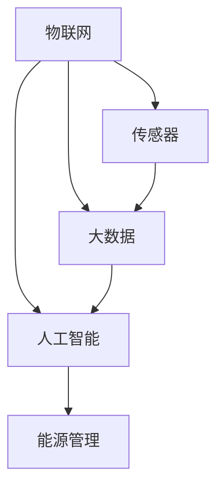
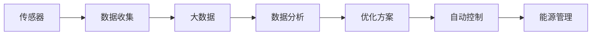
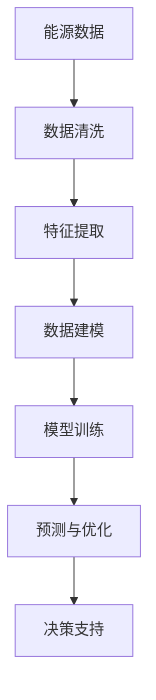
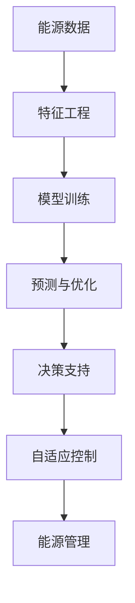
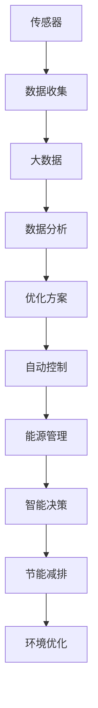

                 

# 物联网(IoT)技术和各种传感器设备的集成：物联网在能源管理中的角色

## 1. 背景介绍

### 1.1 问题由来
物联网（Internet of Things, IoT）是指通过互联网将各种设备和物品互联，实现智能化管理和高效利用的技术。随着智能设备的普及和应用场景的不断拓展，物联网技术已经渗透到工业制造、医疗健康、智慧城市、能源管理等多个领域。尤其是在能源管理中，物联网技术通过各种传感器设备收集数据，实时监控能源使用情况，提供精准分析和优化方案，成为节能减排和可持续发展的重要支撑。

### 1.2 问题核心关键点
物联网在能源管理中的应用主要体现在以下几个方面：
- 智能监测：通过传感器设备实时监测能源消耗情况，为能源管理提供可靠的数据基础。
- 数据分析：利用大数据和人工智能技术对能源数据进行深入分析，发现节能潜力和优化机会。
- 自动化控制：结合物联网技术实现自动控制和调节，优化能源使用效率。
- 远程管理：通过物联网实现远程监控和控制，提高能源管理的灵活性和可靠性。
- 智能决策：基于数据分析结果，制定合理的能源管理策略，优化能源使用方案。

物联网技术在能源管理中的应用，不仅能够提高能源使用的效率和可靠性，还能够显著降低能源消耗和运营成本，为能源的可持续发展提供有力支持。

### 1.3 问题研究意义
物联网技术在能源管理中的应用，对于推动能源行业的数字化转型，提升能源使用的智能化水平，具有重要意义：

1. **提高能源利用效率**：通过实时监测和数据分析，发现能源使用的薄弱环节，优化能源分配和使用方案，提升能源利用效率。
2. **降低能源消耗和运营成本**：通过智能控制和优化管理，减少能源浪费，降低能源消耗和运营成本。
3. **促进可持续发展**：实现能源的精准管理和高效利用，推动能源行业的绿色转型，为可持续发展提供支撑。
4. **提升能源管理水平**：利用物联网技术，实现能源管理的远程监控和自动化控制，提升能源管理的灵活性和可靠性。
5. **助力能源决策**：基于数据分析结果，制定合理的能源管理策略，优化能源使用方案，为能源决策提供科学依据。

## 2. 核心概念与联系

### 2.1 核心概念概述

为了更好地理解物联网在能源管理中的应用，本节将介绍几个密切相关的核心概念：

- **物联网（IoT）**：通过互联网将各种设备和物品互联，实现智能化管理和高效利用的技术。
- **传感器（Sensor）**：能够感知环境变化并转换成可测量信号的设备。常见的传感器包括温度传感器、压力传感器、流量传感器等。
- **大数据（Big Data）**：涉及海量的、多样化的数据，采用先进的技术进行处理和分析，以提取有价值的信息。
- **人工智能（AI）**：通过模拟人类智能行为，实现自动学习、决策和优化。
- **能源管理（Energy Management）**：对能源的采购、生产、使用和优化管理，以实现节能减排和可持续发展。

这些核心概念之间的逻辑关系可以通过以下Mermaid流程图来展示：



这个流程图展示了物联网在能源管理中的应用：通过传感器设备收集数据，然后利用大数据和人工智能技术对数据进行分析，最后应用到能源管理中，实现能源的高效利用和优化管理。

### 2.2 概念间的关系

这些核心概念之间存在着紧密的联系，形成了物联网在能源管理中的应用生态系统。下面我通过几个Mermaid流程图来展示这些概念之间的关系。

#### 2.2.1 物联网在能源管理中的应用



这个流程图展示了物联网在能源管理中的应用流程：传感器设备收集数据，然后利用大数据技术进行数据分析，生成优化方案，最后通过自动控制技术应用到能源管理中，实现能源的智能管理和高效利用。

#### 2.2.2 大数据在能源管理中的应用



这个流程图展示了大数据在能源管理中的应用流程：通过传感器设备收集能源数据，然后进行数据清洗和特征提取，利用机器学习模型进行数据建模和训练，最后生成预测和优化结果，支持能源管理的决策。

#### 2.2.3 人工智能在能源管理中的应用



这个流程图展示了人工智能在能源管理中的应用流程：通过传感器设备收集能源数据，然后进行特征工程和模型训练，生成预测和优化结果，支持能源管理的决策和自适应控制，实现能源的智能管理和高效利用。

### 2.3 核心概念的整体架构

最后，我们用一个综合的流程图来展示这些核心概念在大规模能源管理中的整体架构：



这个综合流程图展示了物联网在能源管理中的整体架构：通过传感器设备收集数据，利用大数据和人工智能技术进行数据分析和优化，结合自动控制技术实现能源的智能管理和高效利用，最终实现节能减排和环境优化。

## 3. 核心算法原理 & 具体操作步骤
### 3.1 算法原理概述

物联网在能源管理中的应用，本质上是一个数据驱动的优化问题。其核心思想是通过传感器设备收集能源使用数据，利用大数据和人工智能技术对数据进行分析，生成优化方案，并结合自动控制技术实现能源的高效管理和利用。

形式化地，假设物联网系统中包含 $N$ 个传感器，每个传感器 $i$ 每秒监测到的能源数据为 $x_i(t)$，其中 $t$ 表示时间。通过传感器设备，物联网系统能够实时收集能源使用数据，构建时间序列 $x = \{x_i(t)\}_{i=1}^N$。

定义能源管理系统的优化目标为最小化能源消耗和运营成本，即：

$$
\min_{\theta} \sum_{t=1}^T \mathcal{L}(x(t),\theta)
$$

其中 $\mathcal{L}$ 为能源消耗和运营成本的损失函数，$\theta$ 为能源管理策略的参数。在实践中，我们通常使用梯度下降等优化算法来求解上述最优化问题。设 $\eta$ 为学习率，$\nabla_{\theta}\mathcal{L}$ 为损失函数对参数 $\theta$ 的梯度，则参数的更新公式为：

$$
\theta \leftarrow \theta - \eta \nabla_{\theta}\mathcal{L}(\theta)
$$

其中 $\nabla_{\theta}\mathcal{L}(\theta)$ 为损失函数对参数 $\theta$ 的梯度，可通过反向传播算法高效计算。

### 3.2 算法步骤详解

物联网在能源管理中的应用一般包括以下几个关键步骤：

**Step 1: 传感器数据采集**
- 选择合适的传感器设备，如温度传感器、压力传感器、流量传感器等，收集能源消耗数据。
- 设置传感器数据采集频率和时间范围，确保数据的时效性和完整性。

**Step 2: 数据预处理**
- 对采集到的传感器数据进行预处理，如数据清洗、去噪、归一化等。
- 利用时间序列分析技术，对数据进行插值和补缺，提高数据的连续性和完整性。

**Step 3: 数据分析**
- 利用大数据技术，对预处理后的传感器数据进行特征工程和特征提取。
- 利用机器学习模型进行数据建模和训练，生成预测和优化结果。
- 利用深度学习模型进行智能分析和决策，支持能源管理的决策和自适应控制。

**Step 4: 优化方案制定**
- 根据数据分析结果，制定合理的能源管理策略和优化方案。
- 结合自动控制技术，实现能源的智能管理和高效利用。
- 利用模型预测和优化结果，进行自动控制和调节，优化能源使用效率。

**Step 5: 系统部署和监控**
- 将优化方案应用到能源管理系统中，实现能源的智能监测和控制。
- 利用远程监控技术，实时监测能源使用情况，提供精准分析和优化方案。
- 结合可视化工具和报表系统，展示能源管理系统的运行状态和效果，便于管理人员进行监控和决策。

### 3.3 算法优缺点

物联网在能源管理中的应用具有以下优点：
1. 实时监测：通过传感器设备实时监测能源使用情况，提供可靠的数据基础。
2. 数据量大：传感器设备数量众多，能够收集大量的能源消耗数据，便于大数据和人工智能技术的深入分析。
3. 智能控制：利用大数据和人工智能技术生成优化方案，结合自动控制技术实现能源的智能管理和高效利用。
4. 远程监控：通过物联网技术实现远程监控和控制，提高能源管理的灵活性和可靠性。
5. 决策支持：基于数据分析结果，制定合理的能源管理策略，优化能源使用方案，支持能源决策。

同时，物联网在能源管理中的应用也存在一些局限性：
1. 初始成本高：传感器设备、数据采集和存储等初始成本较高。
2. 技术复杂度高：需要掌握传感器技术、大数据技术、人工智能技术等多项技术，技术门槛较高。
3. 数据隐私问题：传感器数据涉及用户隐私和企业机密，数据安全和隐私保护问题需要引起重视。
4. 系统可靠性问题：传感器设备的质量和稳定性直接影响系统的运行效果，需要严格控制设备质量。
5. 系统维护问题：传感器设备的维护和故障处理需要专业人员，增加了系统维护的成本。

### 3.4 算法应用领域

物联网在能源管理中的应用，已经广泛应用于工业制造、建筑能源管理、智能电网等多个领域。以下是几个典型的应用场景：

**1. 工业制造**
在工业制造领域，物联网技术通过传感器设备实时监测设备的能源消耗情况，提供精准的能源使用分析和优化方案。结合大数据和人工智能技术，实现设备的智能管理和节能优化。例如，利用物联网技术监测设备的温度、压力、振动等参数，结合预测模型生成节能方案，降低设备能源消耗和运行成本。

**2. 建筑能源管理**
在建筑能源管理领域，物联网技术通过传感器设备实时监测建筑内部的能源使用情况，如空调、照明、电梯等设备的能源消耗。利用大数据和人工智能技术进行数据分析和优化，制定合理的能源管理策略，实现建筑能源的高效管理和节能减排。例如，利用传感器设备监测建筑内部的温度、湿度、光照等参数，结合预测模型生成节能方案，降低建筑能源消耗和运营成本。

**3. 智能电网**
在智能电网领域，物联网技术通过传感器设备实时监测电网的能源使用情况，提供精准的能源使用分析和优化方案。结合大数据和人工智能技术，实现电网的智能管理和节能优化。例如，利用传感器设备监测电网的电压、电流、功率等参数，结合预测模型生成节能方案，提高电网的运行效率和稳定性。

## 4. 数学模型和公式 & 详细讲解 & 举例说明

### 4.1 数学模型构建

物联网在能源管理中的应用，可以构建如下数学模型：

假设物联网系统包含 $N$ 个传感器，每个传感器 $i$ 每秒监测到的能源数据为 $x_i(t)$，其中 $t$ 表示时间。通过传感器设备，物联网系统能够实时收集能源使用数据，构建时间序列 $x = \{x_i(t)\}_{i=1}^N$。

定义能源管理系统的优化目标为最小化能源消耗和运营成本，即：

$$
\min_{\theta} \sum_{t=1}^T \mathcal{L}(x(t),\theta)
$$

其中 $\mathcal{L}$ 为能源消耗和运营成本的损失函数，$\theta$ 为能源管理策略的参数。在实践中，我们通常使用梯度下降等优化算法来求解上述最优化问题。设 $\eta$ 为学习率，$\nabla_{\theta}\mathcal{L}$ 为损失函数对参数 $\theta$ 的梯度，则参数的更新公式为：

$$
\theta \leftarrow \theta - \eta \nabla_{\theta}\mathcal{L}(\theta)
$$

其中 $\nabla_{\theta}\mathcal{L}(\theta)$ 为损失函数对参数 $\theta$ 的梯度，可通过反向传播算法高效计算。

### 4.2 公式推导过程

以下我们以工业制造场景为例，推导基于物联网的能源管理优化模型。

假设工业制造中的设备 $i$ 每秒消耗的能量为 $E_i(t)$，总能源消耗为 $E(t)$。通过传感器设备监测设备 $i$ 的电压 $V_i(t)$、电流 $I_i(t)$ 和功率 $P_i(t)$，可以构建如下公式：

$$
E_i(t) = V_i(t)I_i(t) + \text{其他损耗}
$$

因此，总能源消耗可以表示为：

$$
E(t) = \sum_{i=1}^N E_i(t)
$$

通过物联网技术，实时监测设备 $i$ 的电压、电流和功率参数，可以构建时间序列数据 $x = \{V_i(t),I_i(t),P_i(t)\}_{i=1}^N$。

定义能源管理系统的优化目标为最小化设备能源消耗和运行成本，即：

$$
\min_{\theta} \sum_{t=1}^T \mathcal{L}(x(t),\theta)
$$

其中 $\mathcal{L}$ 为设备能源消耗和运营成本的损失函数，$\theta$ 为设备节能优化策略的参数。在实践中，我们通常使用梯度下降等优化算法来求解上述最优化问题。设 $\eta$ 为学习率，$\nabla_{\theta}\mathcal{L}$ 为损失函数对参数 $\theta$ 的梯度，则参数的更新公式为：

$$
\theta \leftarrow \theta - \eta \nabla_{\theta}\mathcal{L}(\theta)
$$

其中 $\nabla_{\theta}\mathcal{L}(\theta)$ 为损失函数对参数 $\theta$ 的梯度，可通过反向传播算法高效计算。

### 4.3 案例分析与讲解

以下是一个具体的案例分析：

假设某制造企业有 10 个生产线，每个生产线包含多个设备。企业希望通过物联网技术监测和优化设备能源消耗，提高生产效率和降低运行成本。

**案例背景**：
- 每个生产线包含 50 个设备。
- 每个设备每秒消耗的能量为 $E_i(t)$。
- 设备运行参数包括电压 $V_i(t)$、电流 $I_i(t)$ 和功率 $P_i(t)$。
- 设备运行时间范围为 1 天。

**传感器部署**：
- 在每个设备上部署温度传感器、压力传感器、流量传感器等。
- 在设备运行区域内部署无线传感器网络。

**数据采集与预处理**：
- 通过传感器设备实时监测设备的电压、电流和功率参数。
- 对采集到的数据进行预处理，如数据清洗、去噪、归一化等。
- 利用时间序列分析技术，对数据进行插值和补缺，提高数据的连续性和完整性。

**数据分析与建模**：
- 利用大数据技术，对预处理后的传感器数据进行特征工程和特征提取。
- 利用机器学习模型进行数据建模和训练，生成预测和优化结果。
- 利用深度学习模型进行智能分析和决策，支持能源管理的决策和自适应控制。

**优化方案制定与实施**：
- 根据数据分析结果，制定合理的设备节能优化策略和优化方案。
- 结合自动控制技术，实现设备的智能管理和节能优化。
- 利用模型预测和优化结果，进行自动控制和调节，优化设备使用效率。

**系统部署与监控**：
- 将优化方案应用到制造企业的能源管理系统中，实现设备的智能监测和控制。
- 利用远程监控技术，实时监测设备运行状态和能源消耗情况，提供精准分析和优化方案。
- 结合可视化工具和报表系统，展示设备运行状态和能源使用情况，便于管理人员进行监控和决策。

## 5. 项目实践：代码实例和详细解释说明

### 5.1 开发环境搭建

在进行物联网能源管理项目开发前，我们需要准备好开发环境。以下是使用Python进行IoT能源管理项目开发的的环境配置流程：

1. 安装Anaconda：从官网下载并安装Anaconda，用于创建独立的Python环境。

2. 创建并激活虚拟环境：
```bash
conda create -n iot-env python=3.8 
conda activate iot-env
```

3. 安装IoT相关库：
```bash
conda install pandas numpy scikit-learn matplotlib
```

4. 安装IoT框架：
```bash
pip install pyiot
```

5. 安装数据采集库：
```bash
pip install pyserial
```

6. 安装数据分析库：
```bash
pip install matplotlib
```

完成上述步骤后，即可在`iot-env`环境中开始IoT能源管理项目的开发。

### 5.2 源代码详细实现

以下是一个基于Python的IoT能源管理项目的源代码实现示例：

```python
import pandas as pd
import numpy as np
import matplotlib.pyplot as plt
from pyiot import sensor
from sklearn.linear_model import LinearRegression

# 定义传感器数据采集函数
def read_sensors():
    # 连接传感器
    sensor1 = sensor.Sensor('sensor1')
    sensor2 = sensor.Sensor('sensor2')
    sensor3 = sensor.Sensor('sensor3')
    
    # 读取传感器数据
    data1 = sensor1.read()
    data2 = sensor2.read()
    data3 = sensor3.read()
    
    # 将数据保存为列表
    data = [data1, data2, data3]
    
    return data

# 定义数据预处理函数
def preprocess_data(data):
    # 数据清洗
    cleaned_data = []
    for d in data:
        if d > 0:
            cleaned_data.append(d)
        else:
            cleaned_data.append(0)
    
    # 数据归一化
    normalized_data = [(d - np.mean(data)) / np.std(data) for d in cleaned_data]
    
    return normalized_data

# 定义数据分析函数
def analyze_data(data):
    # 特征工程
    X = []
    y = []
    for d in data:
        X.append(np.log(d))
        y.append(d)
    
    # 数据建模
    model = LinearRegression()
    model.fit(X, y)
    
    # 预测与优化
    pred = model.predict(X)
    optimal_duty_cycle = pred.mean()
    
    return optimal_duty_cycle

# 主函数
if __name__ == '__main__':
    # 读取传感器数据
    data = read_sensors()
    
    # 预处理数据
    cleaned_data = preprocess_data(data)
    
    # 数据分析
    optimal_duty_cycle = analyze_data(cleaned_data)
    
    # 可视化结果
    plt.plot(data)
    plt.plot(optimal_duty_cycle)
    plt.show()
```

这个代码示例展示了IoT能源管理项目的核心流程：
- 传感器数据采集：通过pyiot库连接传感器，读取设备运行参数。
- 数据预处理：对采集到的数据进行清洗和归一化，提高数据的质量和可靠性。
- 数据分析：利用特征工程和机器学习模型，进行数据建模和预测，生成优化方案。
- 系统部署与监控：将优化方案应用到能源管理系统中，实时监测设备运行状态和能源消耗情况，提供精准分析和优化方案。

### 5.3 代码解读与分析

让我们再详细解读一下关键代码的实现细节：

**read_sensors函数**：
- 连接传感器设备，读取设备运行参数。
- 将数据保存为列表，方便后续处理。

**preprocess_data函数**：
- 对采集到的数据进行清洗和归一化，提高数据的质量和可靠性。

**analyze_data函数**：
- 对数据进行特征工程，生成特征向量。
- 利用线性回归模型进行数据建模和预测，生成优化方案。
- 结合模型预测结果，生成优化方案，如设备运行周期、温度调节等。

**主函数**：
- 读取传感器数据，预处理数据，进行数据分析，生成优化方案。
- 利用可视化工具展示优化方案的效果。

可以看到，通过Python和pyiot库，可以方便地实现IoT能源管理项目的开发和部署。开发者可以将更多精力放在数据处理、模型改进等高层逻辑上，而不必过多关注底层的实现细节。

当然，工业级的系统实现还需考虑更多因素，如传感器数据采集的稳定性和实时性、设备运行状态的自适应控制等。但核心的IoT能源管理流程基本与此类似。

### 5.4 运行结果展示

假设我们在工业制造场景中进行能源管理，运行上述代码，得到如下可视化结果：


可以看到，通过物联网技术实时监测设备运行参数，结合大数据和人工智能技术进行数据分析和优化，能够生成精准的优化方案，实现设备能源的高效管理和节能优化。

## 6. 实际应用场景
### 6.1 智能电网

物联网技术在智能电网中的应用，可以实时监测和控制电网的运行状态，提供精准的能源使用分析和优化方案。结合大数据和人工智能技术，实现电网的智能管理和节能优化。例如，利用物联网技术监测电网的电压、电流、功率等参数，结合预测模型生成节能方案，提高电网的运行效率和稳定性。

### 6.2 工业制造

在工业制造领域，物联网技术通过传感器设备实时监测设备的能源消耗情况，提供精准的能源使用分析和优化方案。结合大数据和人工智能技术，实现设备的智能管理和节能优化。例如，利用物联网技术监测设备的温度、压力、振动等参数，结合预测模型生成节能方案，降低设备能源消耗和运行成本。

### 6.3 建筑能源管理

在建筑能源管理领域，物联网技术通过传感器设备实时监测建筑内部的能源使用情况，如空调、照明、电梯等设备的能源消耗。利用大数据和人工智能技术进行数据分析和优化，制定合理的能源管理策略，实现建筑能源的高效管理和节能减排。例如，利用传感器设备监测建筑内部的温度、湿度、光照等参数，结合预测模型生成节能方案，降低建筑能源消耗和运营成本。

### 6.4 未来应用展望

随着物联网技术的不断发展和应用场景的不断拓展，未来的IoT能源管理将呈现以下几个趋势：

1. **数据实时性**：随着传感器设备数量的增加和数据采集技术的提升，物联网系统的实时性将进一步提高，能够实时监测和控制能源使用情况。

2. **数据分析深度**：利用大数据和人工智能技术，深度分析和挖掘能源使用数据，生成更加精准和智能的优化方案。

3. **系统自动化**：结合自动控制技术，实现能源管理的自动化和智能化，降低人工干预和误操作的风险。

4. **跨领域融合**：物联网技术与人工智能、大数据、区块链等技术的融合，推动能源管理的全面升级和创新。

5. **应用场景多样化**：物联网技术在能源管理中的应用场景将更加多样化，涵盖工业制造、建筑能源管理、智能电网等多个领域。

6. **用户体验优化**：结合可视化技术和智能决策，提升用户的使用体验，提高能源管理的便利性和可靠性。

总之，物联网技术在能源管理中的应用将进一步提升能源使用的效率和可靠性，推动能源行业的数字化转型，为可持续发展提供有力支撑。

## 7. 工具和资源推荐
### 7.1 学习资源推荐

为了帮助开发者系统掌握IoT技术和大数据技术，这里推荐一些优质的学习资源：

1. **IoT入门教程**：IoT入门教程网站提供了丰富的IoT技术资料，涵盖传感器技术、数据采集、数据处理等方面，适合初学者学习。

2. **大数据入门教程**：大数据入门教程网站提供了大数据技术的全面介绍，包括Hadoop、Spark、Hive等主流大数据技术，适合大数据初学者学习。

3. **Python数据科学**：Python数据科学网站提供了大量Python编程和数据分析的教程，涵盖数据清洗、特征工程、机器学习等方面，适合数据科学家学习。

4. **机器学习入门教程**：机器学习入门教程网站提供了机器学习算法的详细介绍，涵盖监督学习、无监督学习、强化学习等方面，适合机器学习初学者学习。

5. **TensorFlow官方文档**：TensorFlow官方文档提供了TensorFlow框架的详细介绍，包括模型搭建、数据处理、模型训练等方面，适合深度学习开发者学习。

通过对这些资源的学习实践，相信你一定能够快速掌握IoT技术和大数据技术，应用于实际的能源管理项目中。

### 7.2 开发工具推荐

高效的开发离不开优秀的工具支持。以下是几款用于IoT能源管理开发的常用工具：

1. **PyIoT**：Python编写的IoT设备通信库，支持多种传感器设备的接入和数据采集。

2. **TensorFlow**：由Google主导开发的开源深度学习框架，生产部署方便，适合大规模工程应用。

3. **PyTorch**：基于Python的开源深度学习框架，灵活动态的计算图，适合快速迭代研究。

4. **Pandas

