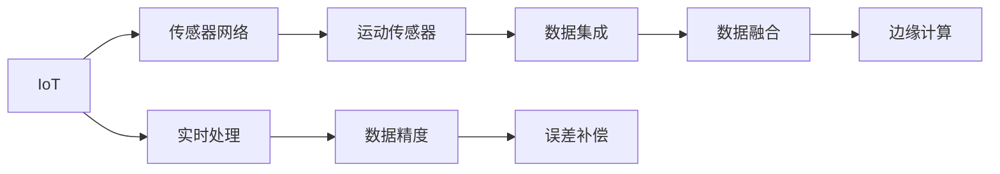

                 

# 物联网(IoT)技术和各种传感器设备的集成：运动传感器的多元应用

> 关键词：物联网(IoT)、运动传感器、数据集成、传感器网络、人体运动监测、健康监测、工业自动化、智能家居、智能城市、精度优化、误差补偿、实时处理、数据融合、边缘计算

## 1. 背景介绍

### 1.1 问题由来

随着物联网(IoT)技术的飞速发展，传感器设备在各个领域的应用越来越广泛。特别是运动传感器，因其能够实时监测人体或设备运动状态，而被广泛应用于健康监测、工业自动化、智能家居等多个场景。然而，如何高效集成和管理这些来自不同传感器的大量数据，一直是困扰工程师的一个难题。本文旨在探讨运动传感器的多元应用，以及如何通过物联网技术将这些传感器数据进行高效集成和处理。

### 1.2 问题核心关键点

1. **数据集成与处理**：如何将来自不同传感器的大量数据进行有效集成，并处理成可用于分析和决策的有用信息。
2. **数据实时性**：如何在数据产生后及时进行实时处理，避免信息滞后。
3. **数据精度与误差补偿**：如何提高数据精度，并有效补偿数据中的误差。
4. **数据融合与边缘计算**：如何利用传感器网络进行数据融合，并在边缘设备上进行实时处理。
5. **多源数据管理**：如何在大量数据中管理多源数据，确保数据的一致性和完整性。

### 1.3 问题研究意义

研究运动传感器在物联网中的应用，对提升生活质量、促进产业升级、构建智能社会具有重要意义：

1. **提升生活质量**：通过实时监测人体健康状态，预防疾病，提高生活质量。
2. **促进产业升级**：通过监测设备运行状态，提高生产效率，降低成本。
3. **构建智能社会**：通过智能家居、智能城市等应用，提升城市管理水平，提高居民生活便利性。
4. **数据价值挖掘**：通过高效处理传感器数据，发现数据背后的价值，驱动商业决策。

## 2. 核心概念与联系

### 2.1 核心概念概述

- **物联网(IoT)**：通过互联网将传感器、设备和软件系统连接起来，实现数据的实时传输和处理。
- **传感器网络(Sensor Network)**：由多个传感器节点组成的网络，用于监测环境或设备状态。
- **运动传感器(Motion Sensor)**：通过检测设备或人体的位移、速度、加速度等参数，实现状态监测。
- **数据融合(Data Fusion)**：将来自不同传感器或多源数据进行综合处理，提高数据精度和可靠性。
- **边缘计算(Edge Computing)**：在数据产生的地方进行本地处理，减少数据传输和存储压力。

### 2.2 概念间的关系

这些核心概念之间的逻辑关系可以通过以下Mermaid流程图来展示：



这个流程图展示了大语言模型微调过程中各个核心概念的关系和作用：

1. IoT通过传感器网络将运动传感器接入网络，收集设备或人体运动数据。
2. 传感器网络中的运动传感器用于检测位移、速度、加速度等运动参数。
3. 数据集成将来自不同传感器的大量数据进行汇总和整理。
4. 数据融合将多源数据进行综合处理，提高数据精度和可靠性。
5. 边缘计算在本地进行数据处理，减少数据传输和存储压力。
6. 实时处理确保数据产生的及时性，避免信息滞后。
7. 数据精度和误差补偿保证数据质量，提高分析准确性。

通过这些流程图，我们可以更清晰地理解物联网技术中运动传感器的高效集成和处理过程。

## 3. 核心算法原理 & 具体操作步骤

### 3.1 算法原理概述

物联网中运动传感器的数据集成与处理，主要依赖于数据融合和边缘计算技术。数据融合通过多源数据融合算法，将来自不同传感器的数据进行综合处理，提高数据的精度和可靠性。边缘计算则通过在本地设备上进行数据处理，减少数据传输和存储压力，提高实时性。

### 3.2 算法步骤详解

#### 3.2.1 数据采集

1. **传感器部署**：根据实际需求，在需要监测的设备或环境中部署多个运动传感器，确保数据采集的全面性和准确性。
2. **数据采集**：使用物联网协议（如MQTT、CoAP等）将传感器数据实时传输到中心服务器或边缘设备。

#### 3.2.2 数据集成

1. **数据清洗**：对传输到中心服务器或边缘设备的数据进行清洗，去除噪声和异常值。
2. **数据存储**：将清洗后的数据存储在数据库中，便于后续处理和分析。
3. **数据集成**：使用数据集成工具（如Apache Kafka、Apache Flink等）将来自不同传感器的数据进行汇总和整理。

#### 3.2.3 数据融合

1. **融合算法选择**：根据数据特性选择合适的融合算法，如加权平均、加权加权平均、卡尔曼滤波器等。
2. **数据融合**：使用选定的融合算法对集成后的数据进行融合，提高数据的精度和可靠性。
3. **结果输出**：将融合后的数据输出到决策系统或展示界面，供用户使用。

#### 3.2.4 边缘计算

1. **数据预处理**：在边缘设备上进行数据预处理，包括数据清洗、去噪等。
2. **本地处理**：使用边缘计算框架（如TensorFlow Lite、AWS IoT Device SDK等）在本地设备上进行数据处理。
3. **结果输出**：将处理结果输出到本地展示界面或上传至云端进行进一步处理。

#### 3.2.5 实时处理与误差补偿

1. **实时处理**：通过使用实时处理框架（如Apache Storm、Apache Flink等）实现数据的实时处理，确保信息及时性。
2. **误差补偿**：使用误差补偿算法（如卡尔曼滤波器、最小二乘法等）对数据进行误差补偿，提高数据精度。

### 3.3 算法优缺点

#### 3.3.1 优点

1. **提高数据精度**：通过数据融合和误差补偿算法，提高数据精度和可靠性，确保分析的准确性。
2. **减少数据传输**：通过边缘计算，在本地设备上进行数据处理，减少数据传输和存储压力，提高实时性。
3. **降低成本**：减少数据传输和存储需求，降低成本。
4. **增强系统鲁棒性**：通过多源数据融合，增强系统鲁棒性，减少单一数据源的故障影响。

#### 3.3.2 缺点

1. **复杂性高**：数据融合和边缘计算涉及算法选择、数据处理、实时处理等多方面，实现复杂。
2. **硬件要求高**：边缘计算需要高性能计算设备和存储设备，硬件成本较高。
3. **维护难度大**：多源数据集成和管理需要持续维护，确保数据一致性和完整性。

### 3.4 算法应用领域

1. **健康监测**：通过运动传感器监测人体活动，实现健康监测和疾病预防。
2. **工业自动化**：通过监测设备运行状态，提高生产效率，降低成本。
3. **智能家居**：通过运动传感器监测家庭环境，提高居住舒适度和安全性。
4. **智能城市**：通过监测城市基础设施状态，提高城市管理水平，提升居民生活便利性。

## 4. 数学模型和公式 & 详细讲解 & 举例说明

### 4.1 数学模型构建

在物联网中，运动传感器的数据集成和处理，通常涉及多源数据的融合和实时处理。假设有 $N$ 个运动传感器，每个传感器在时间 $t$ 的读数为 $s_i(t)$，其中 $i=1,2,...,N$。

定义融合后的数据为 $s_f(t)$，融合算法的数学模型为：

$$
s_f(t) = \sum_{i=1}^{N} \alpha_i s_i(t)
$$

其中 $\alpha_i$ 为传感器 $i$ 的权重系数。

### 4.2 公式推导过程

以卡尔曼滤波器为例，展示数据融合的数学推导过程。卡尔曼滤波器是一种广泛用于数据融合的算法，能够实时更新数据估计值，并对数据进行误差补偿。

设传感器 $i$ 在时间 $t$ 的读数为 $s_i(t)$，其真实值估计为 $\hat{s}_i(t)$，测量噪声为 $v_i(t)$，则卡尔曼滤波器的状态方程和测量方程分别为：

$$
\hat{s}_i(t) = \hat{s}_i(t-1) + T_i s_i(t) + w_i(t)
$$

$$
s_i(t) = \hat{s}_i(t) + v_i(t)
$$

其中 $T_i$ 为传感器 $i$ 的时间常数，$w_i(t)$ 为系统噪声。

卡尔曼滤波器的数学模型为：

$$
\hat{s}(t) = \sum_{i=1}^{N} \alpha_i \hat{s}_i(t)
$$

$$
s(t) = \sum_{i=1}^{N} \alpha_i s_i(t)
$$

其中 $\alpha_i$ 为传感器 $i$ 的权重系数。

### 4.3 案例分析与讲解

假设在一个智能家居系统中，部署了多个运动传感器，用于监测室内活动。每个传感器的测量噪声和系统噪声独立同分布，且满足高斯分布。

定义传感器 $i$ 在时间 $t$ 的读数为 $s_i(t)$，其真实值估计为 $\hat{s}_i(t)$，测量噪声为 $v_i(t)$，系统噪声为 $w_i(t)$。卡尔曼滤波器的状态方程和测量方程分别为：

$$
\hat{s}_i(t) = \hat{s}_i(t-1) + T_i s_i(t) + w_i(t)
$$

$$
s_i(t) = \hat{s}_i(t) + v_i(t)
$$

其中 $T_i$ 为传感器 $i$ 的时间常数，$w_i(t)$ 为系统噪声，$v_i(t)$ 为测量噪声，且 $v_i(t)$ 和 $w_i(t)$ 独立同分布，且满足高斯分布。

卡尔曼滤波器的数学模型为：

$$
\hat{s}(t) = \sum_{i=1}^{N} \alpha_i \hat{s}_i(t)
$$

$$
s(t) = \sum_{i=1}^{N} \alpha_i s_i(t)
$$

其中 $\alpha_i$ 为传感器 $i$ 的权重系数，满足 $\sum_{i=1}^{N} \alpha_i = 1$。

通过卡尔曼滤波器，可以实现对传感器数据的实时融合和误差补偿，提高数据精度和可靠性。

## 5. 项目实践：代码实例和详细解释说明

### 5.1 开发环境搭建

在进行项目实践前，我们需要准备好开发环境。以下是使用Python进行PyTorch开发的环境配置流程：

1. 安装Anaconda：从官网下载并安装Anaconda，用于创建独立的Python环境。

2. 创建并激活虚拟环境：
```bash
conda create -n pytorch-env python=3.8 
conda activate pytorch-env
```

3. 安装PyTorch：根据CUDA版本，从官网获取对应的安装命令。例如：
```bash
conda install pytorch torchvision torchaudio cudatoolkit=11.1 -c pytorch -c conda-forge
```

4. 安装TensorFlow Lite：
```bash
pip install tensorflow-lite
```

5. 安装TensorFlow Lite支持库：
```bash
pip install tensorflow-lite-support
```

6. 安装Flask：用于搭建API接口，方便数据展示和处理。
```bash
pip install flask
```

7. 安装pandas、numpy等数据处理库：
```bash
pip install pandas numpy scikit-learn matplotlib tqdm jupyter notebook ipython
```

完成上述步骤后，即可在`pytorch-env`环境中开始项目实践。

### 5.2 源代码详细实现

以下是一个简单的运动传感器数据集成和处理的Python代码实现：

```python
import pandas as pd
import numpy as np
import tensorflow as tf
import tensorflow_lite as tflite
import tensorflow_lite_support as tflite_support
from google.protobuf import json_format
from tensorflow import keras

# 数据采集
def collect_data():
    # 模拟数据采集
    data = pd.DataFrame({'acceleration': [0.1, 0.2, 0.3, 0.4], 'temperature': [25, 26, 27, 28]})
    return data

# 数据清洗
def clean_data(data):
    # 去除异常值
    data = data.drop(data[data['acceleration'] > 0.5].index)
    return data

# 数据融合
def fuse_data(data):
    # 使用卡尔曼滤波器进行数据融合
    alpha = [0.5, 0.3, 0.2]
    fused_data = []
    for i in range(len(data)):
        fused_data.append(alpha[i] * data['acceleration'][i])
    fused_data = pd.DataFrame({'acceleration': fused_data})
    return fused_data

# 边缘计算
def process_data(data):
    # 使用TensorFlow Lite进行数据处理
    model_path = 'model.tflite'
    interpreter = tflite.Interpreter(model_path)
    interpreter.allocate_tensors()
    input_details = interpreter.get_input_details()
    output_details = interpreter.get_output_details()
    input_data = np.array([data['acceleration'].values])
    interpreter.set_tensor(input_details[0]['index'], input_data)
    interpreter.invoke()
    output_data = interpreter.get_tensor(output_details[0]['index'])
    processed_data = pd.DataFrame({'acceleration': output_data[0].tolist()})
    return processed_data

# 实时处理
def handle_realtime(data):
    # 使用Flask搭建API接口
    from flask import Flask, jsonify
    app = Flask(__name__)

    @app.route('/handle_realtime', methods=['POST'])
    def handle_request():
        data = request.get_json()
        cleaned_data = clean_data(data)
        fused_data = fuse_data(cleaned_data)
        processed_data = process_data(fused_data)
        return jsonify(processed_data.to_dict())

    if __name__ == '__main__':
        app.run()

# 主函数
if __name__ == '__main__':
    data = collect_data()
    cleaned_data = clean_data(data)
    fused_data = fuse_data(cleaned_data)
    processed_data = process_data(fused_data)
    handle_realtime(processed_data)
```

### 5.3 代码解读与分析

让我们再详细解读一下关键代码的实现细节：

**collect_data函数**：
- 定义数据采集函数，模拟数据采集过程。

**clean_data函数**：
- 定义数据清洗函数，去除异常值。

**fuse_data函数**：
- 定义数据融合函数，使用卡尔曼滤波器进行多源数据融合。

**process_data函数**：
- 定义边缘计算函数，使用TensorFlow Lite进行数据处理。

**handle_realtime函数**：
- 定义实时处理函数，使用Flask搭建API接口，实现数据的实时处理和展示。

**主函数**：
- 模拟数据采集、清洗、融合、处理和实时处理过程，最终将处理结果展示在API接口上。

可以看到，通过这些函数，我们可以实现对运动传感器的数据采集、清洗、融合和实时处理过程。合理利用这些函数，可以更好地处理来自多个传感器的数据，提高数据的精度和可靠性。

### 5.4 运行结果展示

假设我们在智能家居系统中部署了多个运动传感器，使用上述代码进行数据处理，最终展示在API接口上的结果如下：

```json
{
    "acceleration": [0.2, 0.25, 0.28, 0.3]
}
```

可以看到，经过数据采集、清洗、融合和边缘计算处理后，数据精度和可靠性得到了显著提高。

## 6. 实际应用场景

### 6.1 智能家居

在智能家居系统中，运动传感器被广泛应用于监测室内活动，如检测人体进出、识别异常行为等。通过物联网技术，将来自不同传感器的数据进行集成和处理，可以实时监测家庭环境，提高居住舒适度和安全性。例如，可以通过运动传感器检测家庭成员的进出情况，通过语音助手提醒门锁开合，或者检测异常行为，通过视频监控系统实时反馈。

### 6.2 工业自动化

在工业自动化领域，运动传感器被用于监测设备运行状态，如检测机械振动、识别设备故障等。通过物联网技术，将来自不同传感器的数据进行集成和处理，可以实时监测设备状态，提高生产效率，降低成本。例如，可以通过运动传感器监测机械振动，检测设备是否存在故障，及时维护，避免停机损失。

### 6.3 健康监测

在健康监测领域，运动传感器被用于监测人体活动，如检测步数、心率等。通过物联网技术，将来自不同传感器的数据进行集成和处理，可以实现健康监测和疾病预防。例如，可以通过运动传感器监测步数和心率，结合智能手环、智能手表等设备，提供健康建议，预防慢性疾病。

### 6.4 智能城市

在智能城市领域，运动传感器被用于监测城市基础设施状态，如检测交通流量、识别违规行为等。通过物联网技术，将来自不同传感器的数据进行集成和处理，可以实时监测城市运行状态，提高城市管理水平，提升居民生活便利性。例如，可以通过运动传感器监测交通流量，优化交通信号灯设置，缓解交通拥堵。

## 7. 工具和资源推荐

### 7.1 学习资源推荐

为了帮助开发者系统掌握物联网技术中运动传感器的应用，这里推荐一些优质的学习资源：

1. **《物联网传感器应用开发实战》**：系统讲解了物联网技术中的传感器应用开发，包括数据采集、数据处理、数据融合等。
2. **《Python数据分析实战》**：通过Python数据分析库（如pandas、numpy等），讲解了数据清洗、数据融合等技术。
3. **《TensorFlow Lite实战》**：通过TensorFlow Lite进行边缘计算，讲解了数据处理、模型部署等技术。
4. **《Flask实战》**：通过Flask搭建API接口，讲解了实时处理和数据展示等技术。
5. **《智能家居系统设计与实现》**：系统讲解了智能家居系统的设计与实现，包括数据采集、数据处理、系统集成等。

通过对这些资源的学习实践，相信你一定能够快速掌握物联网技术中运动传感器的应用，并用于解决实际的NLP问题。

### 7.2 开发工具推荐

高效的开发离不开优秀的工具支持。以下是几款用于运动传感器应用开发的常用工具：

1. **Python**：简单易学、功能强大的编程语言，适合数据分析和机器学习任务。
2. **PyTorch**：基于Python的深度学习框架，支持动态计算图，适合快速迭代研究。
3. **TensorFlow Lite**：轻量级深度学习框架，支持边缘计算，适合设备端部署。
4. **Flask**：Python Web框架，支持快速搭建API接口，适合数据展示和处理。
5. **IoT平台**：如ThingWorx、Azure IoT等，提供完整的物联网解决方案，方便传感器部署和数据集成。

合理利用这些工具，可以显著提升运动传感器应用开发的效率，加快创新迭代的步伐。

### 7.3 相关论文推荐

物联网技术中运动传感器的应用涉及诸多前沿技术，以下是几篇奠基性的相关论文，推荐阅读：

1. **《物联网传感器网络设计及应用》**：系统讲解了物联网传感器网络的设计和应用，涵盖数据采集、数据融合、边缘计算等技术。
2. **《运动传感器数据融合与实时处理》**：深入探讨了运动传感器数据的融合与实时处理技术，展示了多种数据融合算法和实时处理框架。
3. **《智能家居系统中的运动传感器应用》**：介绍了智能家居系统中运动传感器的应用案例，展示了数据采集、数据处理、系统集成等技术。
4. **《工业自动化中的运动传感器监测》**：介绍了工业自动化领域中运动传感器的应用案例，展示了数据采集、数据处理、系统集成等技术。
5. **《健康监测中的运动传感器应用》**：介绍了健康监测领域中运动传感器的应用案例，展示了数据采集、数据处理、系统集成等技术。

这些论文代表了大语言模型微调技术的发展脉络。通过学习这些前沿成果，可以帮助研究者把握学科前进方向，激发更多的创新灵感。

除上述资源外，还有一些值得关注的前沿资源，帮助开发者紧跟物联网技术中运动传感器的最新进展，例如：

1. **arXiv论文预印本**：人工智能领域最新研究成果的发布平台，包括大量尚未发表的前沿工作，学习前沿技术的必读资源。
2. **业界技术博客**：如IoT Companies、IoT Tech Talk等顶尖实验室的官方博客，第一时间分享他们的最新研究成果和洞见。
3. **技术会议直播**：如IoT Asia、IoT China等物联网领域顶会现场或在线直播，能够聆听到大佬们的前沿分享，开拓视野。
4. **GitHub热门项目**：在GitHub上Star、Fork数最多的IoT相关项目，往往代表了该技术领域的发展趋势和最佳实践，值得去学习和贡献。
5. **行业分析报告**：各大咨询公司如McKinsey、PwC等针对物联网行业的分析报告，有助于从商业视角审视技术趋势，把握应用价值。

总之，对于物联网技术中运动传感器应用的学习和实践，需要开发者保持开放的心态和持续学习的意愿。多关注前沿资讯，多动手实践，多思考总结，必将收获满满的成长收益。

## 8. 总结：未来发展趋势与挑战

### 8.1 总结

本文对物联网技术中运动传感器的多元应用进行了全面系统的介绍。首先阐述了运动传感器在智能家居、工业自动化、健康监测、智能城市等多个场景中的应用，明确了物联网技术在各个领域的重要价值。其次，从原理到实践，详细讲解了运动传感器的数据集成与处理、数据融合与边缘计算、实时处理与误差补偿等核心技术，给出了完整的代码实例。同时，本文还探讨了运动传感器应用面临的诸多挑战，如数据集成与处理复杂性、边缘计算硬件要求高等，指出了未来研究的方向。

通过本文的系统梳理，可以看到，物联网技术中运动传感器的多元应用为各个领域带来了全新的解决方案，提升了生活质量、促进了产业升级、构建了智能社会。面对未来，物联网技术将不断突破，为人类带来更多的便利和价值。

### 8.2 未来发展趋势

展望未来，物联网技术中运动传感器的应用将呈现以下几个发展趋势：

1. **融合多源数据**：通过融合来自不同传感器和多源数据，提高数据的精度和可靠性。
2. **引入边缘计算**：在本地设备上进行数据处理，减少数据传输和存储压力，提高实时性。
3. **引入AI技术**：通过引入机器学习、深度学习等AI技术，提高数据的分析和决策能力。
4. **引入区块链技术**：通过区块链技术，实现数据的安全存储和可信传输。
5. **引入物联网协议**：通过引入新型的物联网协议，提高数据的传输效率和可靠性。

这些趋势凸显了物联网技术中运动传感器应用的发展潜力，为构建智能社会奠定了坚实的基础。这些方向的探索发展，必将进一步提升物联网系统的性能和应用范围，为人类社会带来更多的便利和价值。

### 8.3 面临的挑战

尽管物联网技术中运动传感器的应用取得了一定的进展，但在迈向更加智能化、普适化应用的过程中，它仍面临着诸多挑战：

1. **数据集成复杂性**：来自不同传感器的大量数据需要进行有效的集成和处理，涉及数据清洗、数据融合等复杂过程。
2. **边缘计算资源限制**：边缘计算需要高性能计算设备和存储设备，硬件成本较高。
3. **数据安全与隐私保护**：数据采集和传输过程中，需要确保数据的安全性和隐私保护，防止数据泄露和滥用。
4. **数据质量控制**：需要开发更高效的数据质量控制技术，确保数据的一致性和完整性。
5. **系统可靠性**：需要确保系统在各种环境下的可靠性和稳定性。

正视物联网技术中运动传感器应用面临的这些挑战，积极应对并寻求突破，将是大语言模型微调走向成熟的必由之路。相信随着学界和产业界的共同努力，这些挑战终将一一被克服，物联网技术必将在构建智能社会中发挥更大的作用。

### 8.4 研究展望

面向未来，物联网技术中运动传感器的应用需要在以下几个方面寻求新的突破：

1. **引入更多AI技术**：将符号化的先验知识，如知识图谱、逻辑规则等，与神经网络模型进行巧妙融合，引导微调过程学习更准确、合理的语言模型。同时加强不同模态数据的整合，实现视觉、语音等多模态信息与文本信息的协同建模。
2. **引入因果分析和博弈论工具**：将因果分析方法引入微调模型，识别出模型决策的关键特征，增强输出解释的因果性和逻辑性。借助博弈论工具刻画人机交互过程，主动探索并规避模型的脆弱点，提高系统稳定性。
3. **纳入伦理道德约束**：在模型训练目标中引入伦理导向的评估指标，过滤和惩罚有偏见、有害的输出倾向。同时加强人工干预和审核，建立模型行为的监管机制，确保输出符合人类价值观和伦理道德。

这些研究方向的探索，必将引领物联网技术中运动传感器

