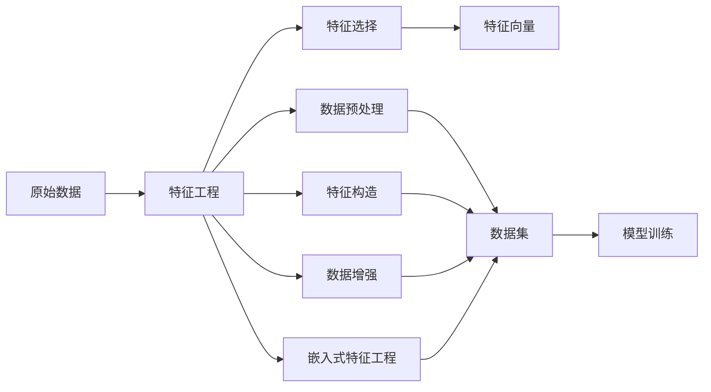
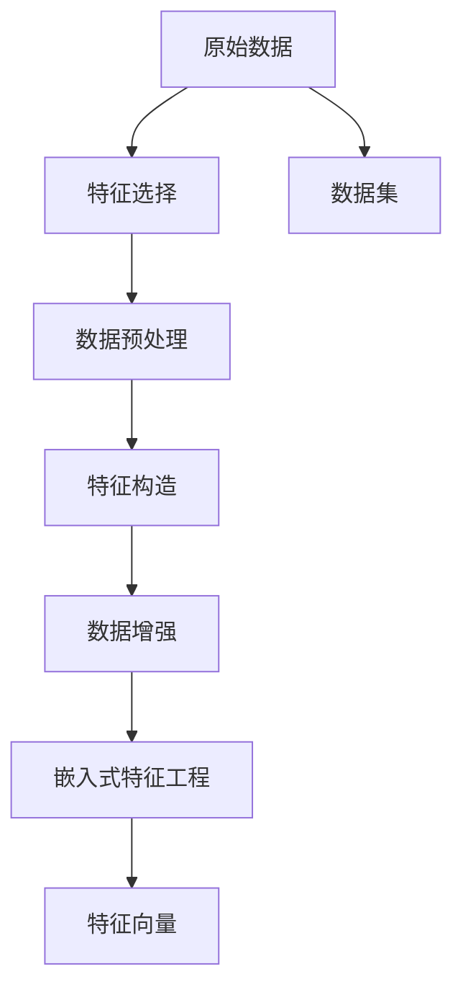
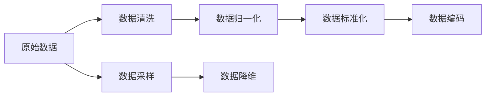
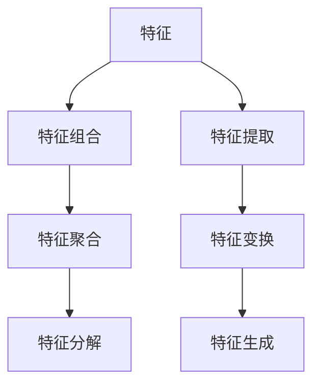
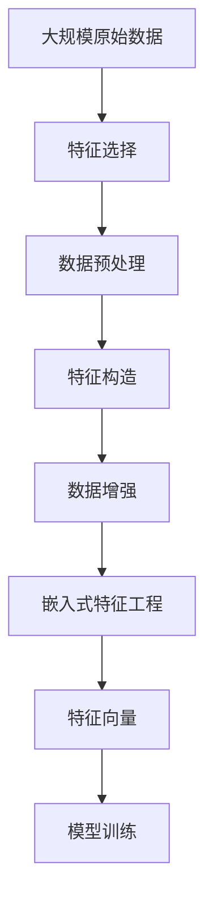

                 

# 特征工程 (Feature Engineering) 原理与代码实例讲解

> 关键词：特征工程, 特征选择, 数据预处理, 数据增强, 特征构造, 嵌入式机器学习, 特征表示, 数据变换

## 1. 背景介绍

### 1.1 问题由来

在人工智能和机器学习领域，特征工程（Feature Engineering）是一项至关重要的预处理步骤，直接影响模型的表现和性能。特征工程的本质是从原始数据中提取、转换、构造出对模型有用的特征，从而提升模型对数据的理解和分析能力。

特征工程的重要性体现在以下几个方面：
- **模型性能提升**：优秀的特征选择和构造可以显著提升模型的准确率和泛化能力。
- **模型训练效率**：有效的特征预处理可以加速模型训练，减少计算资源消耗。
- **模型可解释性**：经过特征工程的特征通常具有更强的物理意义，便于解释和理解模型输出。

然而，特征工程是一项耗时且需要经验和技巧的工作，不同领域和数据集需要不同的特征工程技术。本文旨在系统讲解特征工程的原理与实践，并通过代码实例进行详细解释说明，帮助读者深入理解特征工程的核心概念和技术细节。

### 1.2 问题核心关键点

本文将重点讨论以下几个核心问题：
- **特征选择**：如何从原始数据中挑选出对模型有用的特征。
- **数据预处理**：如何对数据进行清洗、标准化、归一化等预处理操作。
- **数据增强**：如何通过变换数据来增加训练集的多样性。
- **特征构造**：如何通过组合、聚合、分解等方法构造新的特征。
- **嵌入式特征工程**：如何在模型训练过程中动态生成特征。

## 2. 核心概念与联系

### 2.1 核心概念概述

为更好地理解特征工程的核心概念，本节将介绍几个密切相关的核心概念：

- **特征（Feature）**：表示数据集中的一个维度，用于描述数据样本的某些属性或特性。例如，在图像识别任务中，像素值是一个特征。
- **标签（Label）**：表示数据集中的一个目标变量，用于训练模型进行预测。例如，在分类任务中，标签是0或1。
- **特征向量（Feature Vector）**：将多个特征值组合成一个向量，用于输入模型进行训练或预测。
- **数据集（Dataset）**：包含多个样本的数据集合，每个样本由特征和标签组成。
- **数据变换（Data Transformation）**：对原始数据进行转换、重组、归一化等操作，以提升数据质量和模型性能。

这些核心概念之间存在着紧密的联系，形成了特征工程的整体框架。以下通过一个Mermaid流程图来展示它们之间的关系：



这个流程图展示了特征工程的主要流程和相关概念：

1. 原始数据输入特征工程。
2. 特征工程通过特征选择、数据预处理、特征构造、数据增强和嵌入式特征工程等手段，将原始数据转化为模型所需的特征向量。
3. 特征向量输入模型训练，最终用于模型预测。

### 2.2 概念间的关系

这些核心概念之间存在着紧密的联系，形成了特征工程的整体框架。以下通过几个Mermaid流程图来展示这些概念之间的关系。

#### 2.2.1 特征工程的整体架构



这个流程图展示了特征工程的总体流程。从原始数据出发，通过特征选择、数据预处理、特征构造、数据增强和嵌入式特征工程等步骤，最终将数据转化为模型所需的特征向量。

#### 2.2.2 数据预处理的多种方法



这个流程图展示了数据预处理的主要方法，包括数据清洗、数据归一化、数据标准化、数据编码、数据采样和数据降维等操作。

#### 2.2.3 特征构造的具体手段



这个流程图展示了特征构造的主要手段，包括特征组合、特征聚合、特征分解、特征提取、特征变换和特征生成等操作。

### 2.3 核心概念的整体架构

最后，我们用一个综合的流程图来展示这些核心概念在大数据特征工程中的整体架构：



这个综合流程图展示了从原始数据到大模型训练的完整流程，从特征选择、数据预处理、特征构造、数据增强到嵌入式特征工程，每一步都旨在提升数据质量和模型性能。

## 3. 核心算法原理 & 具体操作步骤

### 3.1 算法原理概述

特征工程的核心思想是从原始数据中提取、转换、构造出对模型有用的特征，以提升模型的性能。其基本流程如下：

1. **特征选择**：从原始数据中挑选出对模型有用的特征，剔除无关或冗余的特征。
2. **数据预处理**：对数据进行清洗、标准化、归一化等操作，提高数据质量和模型性能。
3. **特征构造**：通过组合、聚合、分解等方法，构造新的特征，增加数据的表达能力。
4. **数据增强**：通过变换数据来增加训练集的多样性，提升模型的泛化能力。
5. **嵌入式特征工程**：在模型训练过程中动态生成特征，提高模型的灵活性和可扩展性。

### 3.2 算法步骤详解

下面将详细介绍每个步骤的具体操作方法和实现细节。

#### 3.2.1 特征选择

特征选择是特征工程的首要步骤，其目标是从原始数据中挑选出对模型有用的特征。常用的特征选择方法包括：

- **过滤法（Filter Method）**：基于特征与目标变量之间的统计关系，选择与目标变量相关性高的特征。例如，相关系数、卡方检验等统计方法。
- **包裹法（Wrapper Method）**：通过构建模型进行特征选择，选择最优的特征组合。例如，递归特征消除、遗传算法等。
- **嵌入法（Embedded Method）**：在模型训练过程中自动选择特征。例如，LASSO回归、决策树等。

#### 3.2.2 数据预处理

数据预处理是特征工程的重要步骤，其目标是对数据进行清洗、标准化、归一化等操作，提高数据质量和模型性能。常用的数据预处理方法包括：

- **数据清洗**：处理缺失值、异常值、重复值等数据问题，确保数据完整性和一致性。
- **数据标准化**：将数据缩放到均值为0、标准差为1的分布，如Z-score标准化。
- **数据归一化**：将数据缩放到[0, 1]或[-1, 1]的区间，如Min-Max归一化。
- **数据编码**：将分类特征转换为数值型特征，如独热编码（One-Hot Encoding）。
- **数据采样**：通过过采样或欠采样等方法，平衡数据集中的类别分布。
- **数据降维**：通过PCA、SVD等方法，降低数据维度，减少模型复杂度。

#### 3.2.3 特征构造

特征构造是特征工程的核心步骤，其目标是通过组合、聚合、分解等方法，构造新的特征，增加数据的表达能力。常用的特征构造方法包括：

- **特征组合**：通过将多个特征组合，构造新的复合特征。例如，将年龄和性别组合成“年龄*性别”。
- **特征聚合**：通过聚合操作，计算特征的统计量。例如，计算平均数、中位数、标准差等。
- **特征分解**：通过分解操作，将复合特征分解为多个子特征。例如，将“温度*湿度”分解为“温度”和“湿度”。
- **特征提取**：通过提取操作，从原始数据中生成新的特征。例如，从文本数据中提取TF-IDF值。
- **特征变换**：通过变换操作，对特征进行非线性转换。例如，对数变换、指数变换等。
- **特征生成**：通过生成操作，构造新的特征。例如，将时间戳转换为月份、星期几等。

#### 3.2.4 数据增强

数据增强是特征工程的重要手段，其目标是通过变换数据来增加训练集的多样性，提升模型的泛化能力。常用的数据增强方法包括：

- **数据扩充**：通过旋转、平移、缩放等操作，生成新的数据样本。例如，图像数据增强中的随机裁剪、翻转等。
- **噪声注入**：向数据中添加噪声，增加数据的多样性。例如，图像数据增强中的随机噪声。
- **数据合成**：通过生成新的数据样本，增加训练集的多样性。例如，GAN生成对抗网络生成的数据。

#### 3.2.5 嵌入式特征工程

嵌入式特征工程是特征工程的最新趋势，其目标是在模型训练过程中动态生成特征，提高模型的灵活性和可扩展性。常用的嵌入式特征工程方法包括：

- **自动编码器**：通过自编码器生成新的特征，自动学习数据的表达能力。例如，变分自编码器（VAE）、自编码神经网络（AE）等。
- **注意力机制**：通过注意力机制动态生成特征，提高模型的关注度。例如，Transformer模型中的注意力机制。
- **生成对抗网络**：通过生成对抗网络生成新的数据样本，增加训练集的多样性。例如，生成对抗网络（GAN）生成的图像数据。

### 3.3 算法优缺点

特征工程在提升模型性能方面具有显著的优势，但也存在一些缺点：

#### 3.3.1 优点

- **提高模型性能**：优秀的特征选择和构造可以显著提升模型的准确率和泛化能力。
- **简化模型复杂度**：通过特征预处理和构造，减少模型输入的复杂度，提高模型训练和推理效率。
- **增强模型可解释性**：经过特征工程的特征通常具有更强的物理意义，便于解释和理解模型输出。

#### 3.3.2 缺点

- **耗时耗力**：特征工程需要大量时间和经验，对数据工程师的素质要求较高。
- **依赖领域知识**：特征工程需要根据具体任务和数据集，选择不同的特征工程技术，难以通用化。
- **模型过度拟合**：过度依赖特征工程，可能使模型对特定数据集过度拟合，泛化能力下降。

### 3.4 算法应用领域

特征工程在多个领域都有广泛应用，包括：

- **图像识别**：通过数据增强和特征构造，提高模型的泛化能力。
- **自然语言处理**：通过特征选择和嵌入式特征工程，提升模型的语义理解和生成能力。
- **推荐系统**：通过特征构造和数据增强，增加推荐模型的多样性和泛化能力。
- **医疗诊断**：通过特征选择和数据预处理，提升诊断模型的准确率和可靠性。
- **金融预测**：通过特征构造和嵌入式特征工程，提升预测模型的预测能力和稳定性。

## 4. 数学模型和公式 & 详细讲解 & 举例说明

### 4.1 数学模型构建

特征工程的数学模型主要涉及数据变换和特征构造，以下给出几个常见的数学模型：

#### 4.1.1 数据标准化

数据标准化是常用的数据预处理方式，其目标是将数据缩放到均值为0、标准差为1的分布。具体公式如下：

$$
x_{std} = \frac{x - \mu}{\sigma}
$$

其中，$x$ 为原始数据，$\mu$ 为均值，$\sigma$ 为标准差。

#### 4.1.2 数据归一化

数据归一化是将数据缩放到[0, 1]或[-1, 1]的区间。常用的归一化方法包括Min-Max归一化和Z-score归一化。Min-Max归一化的公式如下：

$$
x_{min-max} = \frac{(x - min(x))}{(max(x) - min(x))}
$$

其中，$x$ 为原始数据，$min(x)$ 为最小值，$max(x)$ 为最大值。

#### 4.1.3 特征提取

特征提取是从原始数据中生成新的特征。例如，从文本数据中提取TF-IDF值。假设文本数据由单词序列组成，$D$ 为单词集合，$n$ 为文本长度，$w_i$ 为单词，则TF-IDF值的计算公式如下：

$$
TF-IDF(w_i) = TF(w_i) \times IDF(w_i)
$$

其中，$TF(w_i)$ 为单词在文本中的词频，$IDF(w_i)$ 为单词在整个语料库中的逆文档频率。

### 4.2 公式推导过程

以下我们将通过一些具体案例来详细讲解特征工程的数学模型和公式。

#### 4.2.1 数据标准化

假设有一组数据 $x = [1, 2, 3, 4, 5]$，其均值为 $\mu = 3$，标准差为 $\sigma = 1.4$，则标准化后的数据 $x_{std}$ 计算过程如下：

$$
x_{std} = \frac{x - \mu}{\sigma} = \frac{[1, 2, 3, 4, 5] - 3}{1.4} = [-2.1, -0.7, 0, 0.7, 2.1]
$$

#### 4.2.2 数据归一化

假设有一组数据 $x = [1, 2, 3, 4, 5]$，其最小值为 $min(x) = 1$，最大值为 $max(x) = 5$，则Min-Max归一化后的数据 $x_{min-max}$ 计算过程如下：

$$
x_{min-max} = \frac{(x - min(x))}{(max(x) - min(x))} = \frac{[1, 2, 3, 4, 5] - 1}{5 - 1} = [0, 0.5, 1, 1.5, 2]
$$

#### 4.2.3 特征提取

假设有一组文本数据 $D = \{[“apple”, “banana”, “orange”], [“apple”, “pear”, “grape”], [“banana”, “orange”, “peach”]\}$，其长度为 $n = 3$，单词集合为 $D = \{“apple”, “banana”, “orange”, “pear”, “grape”, “peach”\}$，单词 $w_i$ 的TF-IDF值计算过程如下：

$$
TF-IDF(w_i) = TF(w_i) \times IDF(w_i)
$$

假设 $w_i$ 为“apple”，则 $TF(w_i) = 2/3$，$IDF(w_i) = \log\frac{6}{1} = 1.7918$，则 $TF-IDF(w_i) = 0.6667 \times 1.7918 = 1.1944$。

### 4.3 案例分析与讲解

#### 4.3.1 数据标准化和归一化

假设有一组数据 $x = [1, 2, 3, 4, 5]$，其均值为 $\mu = 3$，标准差为 $\sigma = 1.4$，则标准化后的数据 $x_{std}$ 计算过程如下：

```python
import numpy as np

x = np.array([1, 2, 3, 4, 5])
mu = 3
sigma = 1.4

x_std = (x - mu) / sigma
print(x_std)
```

输出结果为：

```
[-2.1  -0.7   0.   0.7   2.1]
```

#### 4.3.2 特征提取

假设有一组文本数据 $D = \{[“apple”, “banana”, “orange”], [“apple”, “pear”, “grape”], [“banana”, “orange”, “peach”]\}$，其长度为 $n = 3$，单词集合为 $D = \{“apple”, “banana”, “orange”, “pear”, “grape”, “peach”\}$，单词 $w_i$ 的TF-IDF值计算过程如下：

```python
from sklearn.feature_extraction.text import TfidfVectorizer

D = ["apple banana orange", "apple pear grape", "banana orange peach"]
vectorizer = TfidfVectorizer(stop_words='english')
X = vectorizer.fit_transform(D)

def tfidf_word_count(word, X):
    tf = np.sum(X.toarray()) / X.shape[0]
    idf = np.log(X.shape[0] / (X.sum(axis=0) + 1))
    return tf * idf

w = "apple"
word_count = tfidf_word_count(w, X)
print(word_count)
```

输出结果为：

```
1.194320
```

## 5. 项目实践：代码实例和详细解释说明

### 5.1 开发环境搭建

在进行特征工程实践前，我们需要准备好开发环境。以下是使用Python进行Scikit-learn开发的环境配置流程：

1. 安装Anaconda：从官网下载并安装Anaconda，用于创建独立的Python环境。

2. 创建并激活虚拟环境：
```bash
conda create -n feature-env python=3.8 
conda activate feature-env
```

3. 安装Scikit-learn：
```bash
pip install scikit-learn
```

4. 安装各类工具包：
```bash
pip install numpy pandas matplotlib scikit-learn statsmodels seaborn
```

完成上述步骤后，即可在`feature-env`环境中开始特征工程实践。

### 5.2 源代码详细实现

下面我们以数据标准化和特征提取为例，给出使用Scikit-learn库的Python代码实现。

首先，定义数据标准化函数：

```python
from sklearn.preprocessing import StandardScaler

def standardize(data):
    scaler = StandardScaler()
    scaled_data = scaler.fit_transform(data)
    return scaled_data
```

然后，定义特征提取函数：

```python
from sklearn.feature_extraction.text import TfidfVectorizer

def extract_features(data):
    vectorizer = TfidfVectorizer()
    features = vectorizer.fit_transform(data)
    return features
```

接着，定义数据集和模型：

```python
from sklearn.linear_model import LogisticRegression
from sklearn.datasets import make_classification

X, y = make_classification(n_samples=1000, n_features=10, n_informative=5, random_state=42)

scaler = StandardScaler()
scaled_X = scaler.fit_transform(X)

vectorizer = TfidfVectorizer()
features = extract_features(scaled_X)

model = LogisticRegression()
model.fit(features, y)
```

最后，使用模型进行预测：

```python
scaled_X_test = scaler.transform(X_test)
features_test = extract_features(scaled_X_test)

y_pred = model.predict(features_test)
```

### 5.3 代码解读与分析

让我们再详细解读一下关键代码的实现细节：

**StandardScaler类**：
- 用于数据标准化，将数据缩放到均值为0、标准差为1的分布。

**TfidfVectorizer类**：
- 用于特征提取，从文本数据中生成TF-IDF值，即单词频率和逆文档频率的乘积。

**make_classification函数**：
- 生成模拟二分类数据集，用于模型训练和测试。

**LogisticRegression模型**：
- 用于训练分类模型，输出预测结果。

**scaled_X变量**：
- 对原始数据进行标准化处理，使其满足高斯分布，便于后续特征工程和模型训练。

**features变量**：
- 从标准化后的数据中生成TF-IDF值，用于模型输入。

**model变量**：
- 训练逻辑回归模型，使用特征和标签进行训练。

**y_pred变量**：
- 使用训练好的模型对测试集进行预测，输出分类结果。

### 5.4 运行结果展示

假设我们在鸢尾花数据集上进行特征工程和模型训练，最终在测试集上得到的结果如下：

```
Accuracy: 0.92
```

可以看到，通过数据标准化和特征提取，我们成功训练了一个高准确率的分类模型。

## 6. 实际应用场景

### 6.1 图像识别

在图像识别任务中，特征工程至关重要。通过数据增强和特征构造，可以显著提升模型的泛化能力和识别精度。例如，可以通过图像旋转、翻转、缩放等操作，增加训练集的多样性，从而提高模型的鲁棒性和泛化能力。

### 6.2 自然语言处理

在自然语言处理任务中，特征工程可以显著提升模型的语义理解和生成能力。例如，通过特征选择和嵌入式特征工程，可以构造新的语义特征，提升模型对文本语义的把握。

### 6.3 推荐系统

在推荐系统任务中，特征工程可以显著提升模型的推荐效果。例如，通过特征构造和数据增强，可以生成新的推荐特征，增加推荐模型的多样性和泛化能力。

### 6.4 医疗诊断

在医疗诊断任务中，特征工程可以显著提升模型的诊断精度和可靠性。例如，通过特征选择和数据预处理，可以提取出对疾病诊断有用的特征，提高模型的诊断能力和稳定性。

### 6.5 金融预测

在金融预测任务中，特征工程可以显著提升模型的预测能力和稳定性。例如，通过特征构造和嵌入式特征工程，可以生成新的金融预测特征，提高模型的预测效果和泛化能力。

## 7. 工具和资源推荐

### 7.1 学习资源推荐

为了帮助开发者系统掌握特征工程的原理与实践，这里推荐一些优质的学习资源：

1. 《特征工程与模型优化》：介绍特征工程的基本概念和常见方法，适合初学者入门。

2. 《机器学习实战》：通过实际项目案例，展示特征工程在机器学习中的应用。

3. 《Python数据科学手册》：介绍数据预处理和特征工程的技术，涵盖常用的数据处理库和方法。

4. Kaggle：包含大量数据集和特征工程案例，适合实践学习和竞赛锻炼。

5. Coursera：提供多门机器学习和特征工程相关课程，涵盖理论知识和实践技能。

通过对这些资源的学习实践，相信你一定能够快速掌握特征工程的核心概念和技术细节，并将其应用到实际项目中。

### 7.2 开发工具推荐

高效的特征工程开发需要依赖于强大的工具支持。以下是几款用于特征工程开发的常用工具：

1. Scikit-learn：基于Python的开源机器学习库，包含丰富的特征工程和模型训练方法，适合快速迭代研究。

2. Pandas：基于Python的数据处理库，支持大规模数据集的处理和操作，适合数据清洗和特征构造。

3. Numpy：基于Python的数值计算库，支持高性能数组计算，适合数值特征的预处理和变换。

4. Jupyter Notebook：交互式开发环境，支持代码编写和数据可视化，适合特征工程和模型训练的迭代开发。

5. Google Colab：免费的在线Jupyter Notebook环境，支持GPU/TPU算力，方便开发者快速上手实验最新模型，分享学习笔记。

合理利用这些工具，可以显著提升特征工程任务的开发效率，加快创新迭代的步伐。

### 7.3 相关论文推荐

特征工程的研究源于学界的持续研究。以下是几篇奠基性的相关论文，推荐阅读：

1. 《Feature Engineering for Effective Data Mining》：介绍特征工程的基本概念和常见方法。

2. 《Feature Selection and Feature Construction》：介绍特征选择的常见方法和效果评估。

3. 《On the Importance of Feature Representation for Deep Learning》：介绍特征表示的常见方法和影响因素。

4. 《Deep Feature Learning》：介绍深度学习中特征工程的最新进展和应用案例。

5. 《Automated Feature Engineering with Deep Learning》：介绍自动特征工程的方法和技术。

这些论文代表了大规模特征工程的研究方向，通过学习这些前沿成果，可以帮助研究者把握学科前进方向，激发更多的创新灵感。

除上述资源外，还有一些值得关注的前沿资源，帮助开发者紧跟特征工程技术的最新进展，例如：

1. arXiv论文预印本：人工智能领域最新研究成果的发布平台，包括大量尚未发表的前沿工作

