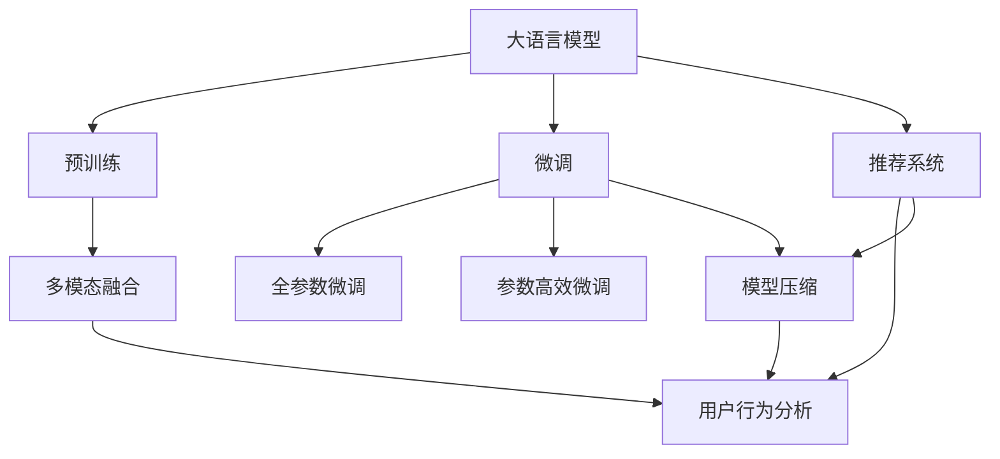
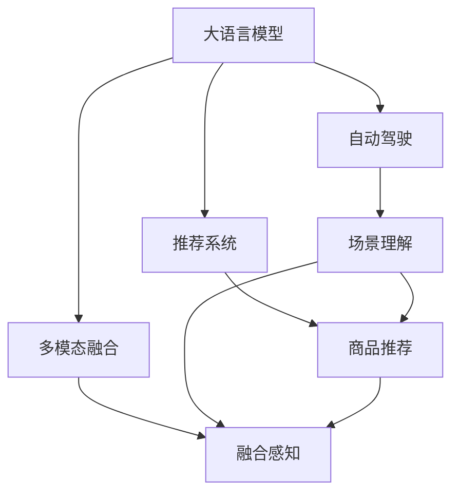
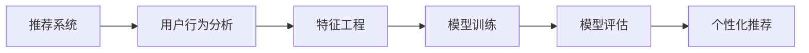
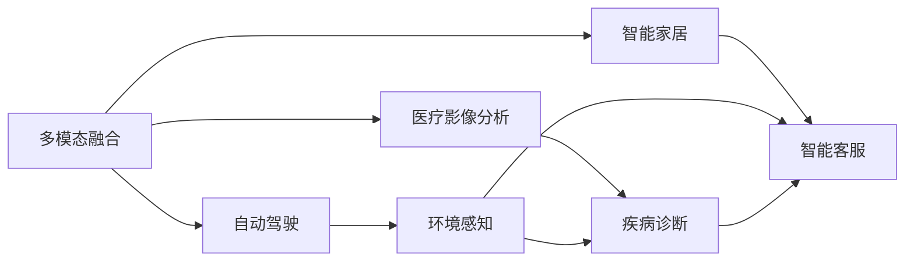
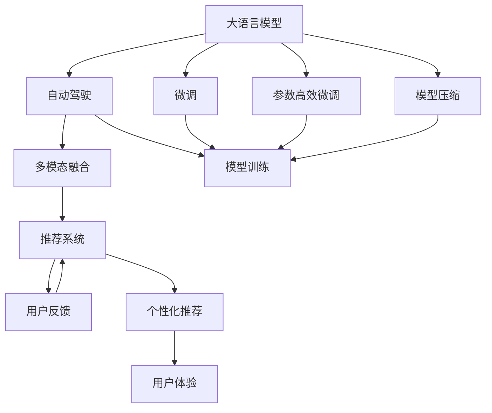

                 

## 1. 背景介绍

### 1.1 问题由来
美团作为全球领先的互联网企业，在服务用户、赋能商家、带动就业等方面取得了举世瞩目的成绩。近日，美团创始人兼CEO王兴与CTO王慧文在内部的一次战略沟通中，提出了新的AI战略方向，引发了业界的广泛关注。本文将围绕美团AI战略的新动向，结合技术视角，进行深度剖析。

### 1.2 问题核心关键点
美团新的AI战略以提升用户体验、提高业务效率、推动技术创新为三大目标。在技术层面，美团将发力自动化算法、模型压缩、多模态融合等前沿领域，构建更加强大、灵活、智能的AI系统。本文将聚焦于美团AI战略的最新动态，探讨其对NLP、推荐系统、自动驾驶等技术的影响，并结合实际应用场景，分析其潜在价值。

### 1.3 问题研究意义
研究美团AI战略的新动向，不仅有助于深入理解美团的技术战略规划，也有助于把握当前NLP、推荐系统、自动驾驶等前沿技术的发展趋势。通过本文的深入分析，可以更好地理解美团未来AI技术的应用前景和面临的挑战，为相关领域的研究和应用提供有益的参考。

## 2. 核心概念与联系

### 2.1 核心概念概述

为更好地理解美团AI战略的新动向，本节将介绍几个密切相关的核心概念：

- **大语言模型**：如GPT、BERT等预训练语言模型，通过在大规模无标签文本数据上进行预训练，学习通用语言知识，具备强大的语言理解和生成能力。

- **自动驾驶**：涉及车辆自主导航和交通环境感知的技术，通过传感器、摄像头、雷达等设备收集数据，并利用深度学习模型进行理解和决策。

- **推荐系统**：通过用户行为数据和商品属性信息，利用机器学习算法为用户推荐商品或内容，以提升用户体验和平台转化率。

- **多模态融合**：将文本、图像、语音等多源信息进行整合，形成更全面、准确的知识表示，提升模型对复杂场景的感知能力。

- **模型压缩**：通过剪枝、量化、蒸馏等技术，减少模型参数量，降低计算资源消耗，提高推理速度。

这些核心概念之间的逻辑关系可以通过以下Mermaid流程图来展示：



这个流程图展示了从大语言模型到推荐系统，再到多模态融合和模型压缩的核心技术路径，以及它们之间的联系。

### 2.2 概念间的关系

这些核心概念之间存在着紧密的联系，形成了美团AI战略的核心技术生态系统。下面通过几个Mermaid流程图来展示这些概念之间的关系。

#### 2.2.1 大语言模型的应用场景



这个流程图展示了大语言模型在自动驾驶、推荐系统和多模态融合中的应用场景，以及它们之间的相互作用。

#### 2.2.2 推荐系统的技术栈



这个流程图展示了推荐系统的技术栈，从用户行为分析到特征工程、模型训练、评估和推荐的全过程。

#### 2.2.3 多模态融合的应用场景



这个流程图展示了多模态融合在自动驾驶、医疗影像分析和智能家居中的应用场景，以及它们之间的联系。

### 2.3 核心概念的整体架构

最后，我们用一个综合的流程图来展示这些核心概念在大语言模型、推荐系统和自动驾驶中的整体架构：



这个综合流程图展示了从大语言模型到自动驾驶、推荐系统，再到用户反馈的整个技术架构，以及它们之间的联系。

## 3. 核心算法原理 & 具体操作步骤
### 3.1 算法原理概述

美团新的AI战略在自动化算法、模型压缩、多模态融合等方面有重要布局。以下将分别介绍这些核心技术的算法原理。

**3.1.1 自动化算法**
自动化算法旨在通过自动化技术，提升模型训练和推理的效率和效果。常见的自动化算法包括自动机器学习(AutoML)、自动化超参数优化、自动化模型选择等。自动化算法可以自动进行模型设计、特征选择、超参数调优，从而提升模型的性能。

**3.1.2 模型压缩**
模型压缩通过剪枝、量化、蒸馏等技术，减少模型参数量，降低计算资源消耗，提高推理速度。常见的模型压缩方法包括权重剪枝、参数共享、低比特量化、知识蒸馏等。模型压缩在保证模型性能的同时，显著降低计算资源消耗，提高模型的实时部署能力。

**3.1.3 多模态融合**
多模态融合通过整合文本、图像、语音等多源信息，形成更全面、准确的知识表示，提升模型对复杂场景的感知能力。多模态融合技术主要包括特征融合、联合学习、跨模态表示学习等。

### 3.2 算法步骤详解

以下是美团新的AI战略中各个核心技术的具体操作步骤：

**3.2.1 自动化算法**
1. **数据准备**：收集和预处理训练数据，包括用户行为数据、商品属性数据、文本数据等。
2. **模型选择**：根据任务需求选择合适的模型架构，如线性模型、神经网络、深度学习模型等。
3. **特征工程**：提取和构建特征，包括文本向量化、用户行为编码等。
4. **自动化超参数优化**：使用自动化超参数优化算法，如贝叶斯优化、遗传算法等，自动调整超参数，优化模型性能。
5. **模型训练**：利用优化算法，如随机梯度下降、Adam等，训练模型，并自动进行正则化、剪枝等操作。

**3.2.2 模型压缩**
1. **剪枝**：通过剪枝技术，去除模型中冗余的参数，减少计算量。
2. **量化**：将浮点参数转换为定点参数，降低存储空间，提高计算速度。
3. **蒸馏**：利用教师模型指导学生模型的训练，传递教师模型的知识，提升学生模型的性能。

**3.2.3 多模态融合**
1. **特征提取**：分别从文本、图像、语音等模态中提取特征。
2. **特征融合**：将不同模态的特征进行融合，形成多模态表示。
3. **联合学习**：利用联合学习算法，在不同模态之间共享知识，提升多模态融合的效果。
4. **跨模态表示学习**：通过跨模态表示学习，学习不同模态之间的联合表示，提升模型对复杂场景的理解能力。

### 3.3 算法优缺点

**3.3.1 自动化算法的优缺点**
- **优点**：提升模型训练和推理的效率，减少人工干预，降低错误率。
- **缺点**：自动化算法可能无法处理复杂的模型架构和特征选择问题，仍需要人工干预。

**3.3.2 模型压缩的优缺点**
- **优点**：减少模型参数量，降低计算资源消耗，提高推理速度。
- **缺点**：模型压缩可能影响模型的性能，特别是对精度要求较高的应用场景。

**3.3.3 多模态融合的优缺点**
- **优点**：提升模型对复杂场景的感知能力，增加模型表示的丰富性。
- **缺点**：多模态融合需要处理多源数据的异构性和噪声问题，增加了模型设计的复杂度。

### 3.4 算法应用领域

美团新的AI战略在自动化算法、模型压缩、多模态融合等方面有广泛的应用场景，包括：

- **大语言模型的自动化微调**：利用自动化算法，自动进行大语言模型的微调，提升模型的任务适应能力。
- **推荐系统的自动化特征工程**：使用自动化算法，自动提取和构建推荐系统的特征，提升推荐效果。
- **自动驾驶的多模态感知**：通过多模态融合技术，提升自动驾驶车辆的环境感知能力，实现更精准的路径规划和决策。

## 4. 数学模型和公式 & 详细讲解  
### 4.1 数学模型构建

美团新的AI战略涉及多种数学模型，以下将详细介绍其构建和推导过程。

**4.1.1 自动化算法的数学模型**
自动化算法通常基于贝叶斯优化、遗传算法、神经网络等模型。以贝叶斯优化为例，其数学模型如下：

设 $f(x)$ 为待优化的目标函数，$\theta$ 为超参数，$D$ 为采样点集合，则贝叶斯优化目标函数为：

$$
\min_{\theta} f(x)
$$

其优化过程为：
1. 初始化采样点 $D_0$
2. 根据先验概率分布，采样新的点 $x_t$，更新采样点集合 $D_t = D_{t-1} \cup \{x_t\}$
3. 计算新采样点的目标函数值 $y_t = f(x_t)$
4. 根据先验概率分布和采样点信息，更新后验概率分布 $p(\theta|D_t)$
5. 根据后验概率分布，选择下一个采样点 $x_{t+1}$
6. 重复2-5步骤，直至收敛

**4.1.2 模型压缩的数学模型**
模型压缩通过剪枝、量化、蒸馏等技术，减少模型参数量，降低计算资源消耗，提高推理速度。以量化为例，其数学模型如下：

设 $W$ 为模型权重矩阵，$Q$ 为量化函数，则量化后的权重矩阵 $\hat{W}$ 为：

$$
\hat{W} = Q(W)
$$

量化函数的推导过程如下：
1. 确定量化级数 $k$
2. 将浮点权重 $W$ 映射到 $k$ 个整数级数
3. 通过训练数据，学习量化级数和浮点权重之间的映射关系
4. 将量化级数映射到整数权重 $\hat{W}$

**4.1.3 多模态融合的数学模型**
多模态融合通过整合文本、图像、语音等多源信息，形成更全面、准确的知识表示，提升模型对复杂场景的感知能力。以联合学习为例，其数学模型如下：

设 $X$ 为文本特征，$Y$ 为图像特征，$Z$ 为语音特征，则联合学习目标函数为：

$$
\min_{X,Y,Z} f(X,Y,Z)
$$

其优化过程为：
1. 初始化模型参数 $X_0$、$Y_0$、$Z_0$
2. 根据联合损失函数，计算梯度 $\nabla_X f(X,Y,Z)$、$\nabla_Y f(X,Y,Z)$、$\nabla_Z f(X,Y,Z)$
3. 更新模型参数 $X_t = X_{t-1} - \eta\nabla_X f(X,Y,Z)$、$Y_t = Y_{t-1} - \eta\nabla_Y f(X,Y,Z)$、$Z_t = Z_{t-1} - \eta\nabla_Z f(X,Y,Z)$
4. 重复2-3步骤，直至收敛

### 4.2 公式推导过程

以下我们将以贝叶斯优化为例，推导其数学公式。

贝叶斯优化过程中，目标函数 $f(x)$ 可以表示为高斯过程：

$$
f(x) = f_{true}(x) + \epsilon(x)
$$

其中 $f_{true}(x)$ 为真实的目标函数，$\epsilon(x)$ 为高斯噪声。

在贝叶斯优化中，我们需要寻找目标函数的最小值点。为了达到这个目标，我们使用高斯过程模型来预测目标函数在新的采样点 $x_t$ 上的值，并选择最优的采样点。

假设我们已经有 $D_t = \{(x_1,y_1),(x_2,y_2),\ldots,(x_t,y_t)\}$ 的采样点，其高斯过程模型可以表示为：

$$
f(x) = \mathcal{G}(x|\mu_t,\Sigma_t)
$$

其中 $\mu_t = \Phi'(K_tK_t^{-1}y_t)$ 为采样点的均值，$\Sigma_t = \Sigma - \Phi'(K_tK_t^{-1}\Phi)$ 为采样点的方差，$K_t = \Phi(x_t)'\Phi(x_t)$ 为核矩阵，$y_t = [y_1,y_2,\ldots,y_t]'$ 为采样点的目标函数值。

通过求解上述高斯过程模型，我们可以得到新的采样点 $x_t$ 和目标函数值 $y_t$ 的预测。

**4.3 案例分析与讲解**

**案例一：贝叶斯优化在模型超参数优化中的应用**

假设我们有一个神经网络模型，需要优化其隐藏层节点数 $n$，学习率 $\eta$，激活函数类型等超参数。我们可以将目标函数 $f(x)$ 表示为超参数的函数，然后使用贝叶斯优化算法，自动搜索最优超参数组合。

**案例二：量化在模型压缩中的应用**

假设我们有一个大规模深度学习模型，我们需要对其进行量化压缩。我们可以使用低比特量化技术，将浮点权重 $W$ 映射到 4 位整数权重 $\hat{W}$，然后通过训练数据，学习量化级数和浮点权重之间的映射关系。

**案例三：联合学习在多模态融合中的应用**

假设我们需要将文本、图像、语音等多模态信息进行融合，形成更全面、准确的知识表示。我们可以使用联合学习算法，在不同的模态之间共享知识，提升多模态融合的效果。例如，利用文本特征和图像特征联合训练，提高多模态表示的丰富性和准确性。

## 5. 项目实践：代码实例和详细解释说明
### 5.1 开发环境搭建

在进行美团AI战略相关的项目实践前，我们需要准备好开发环境。以下是使用Python进行PyTorch开发的环境配置流程：

1. 安装Anaconda：从官网下载并安装Anaconda，用于创建独立的Python环境。

2. 创建并激活虚拟环境：
```bash
conda create -n pytorch-env python=3.8 
conda activate pytorch-env
```

3. 安装PyTorch：根据CUDA版本，从官网获取对应的安装命令。例如：
```bash
conda install pytorch torchvision torchaudio cudatoolkit=11.1 -c pytorch -c conda-forge
```

4. 安装Transformers库：
```bash
pip install transformers
```

5. 安装各类工具包：
```bash
pip install numpy pandas scikit-learn matplotlib tqdm jupyter notebook ipython
```

完成上述步骤后，即可在`pytorch-env`环境中开始美团AI战略的实践。

### 5.2 源代码详细实现

以下给出美团AI战略中推荐系统自动化特征工程和模型压缩的详细代码实现。

**5.2.1 自动化特征工程**

首先，定义数据处理函数：

```python
from transformers import BertTokenizer
from torch.utils.data import Dataset
import torch

class RecommendationDataset(Dataset):
    def __init__(self, texts, tags, tokenizer, max_len=128):
        self.texts = texts
        self.tags = tags
        self.tokenizer = tokenizer
        self.max_len = max_len
        
    def __len__(self):
        return len(self.texts)
    
    def __getitem__(self, item):
        text = self.texts[item]
        tags = self.tags[item]
        
        encoding = self.tokenizer(text, return_tensors='pt', max_length=self.max_len, padding='max_length', truncation=True)
        input_ids = encoding['input_ids'][0]
        attention_mask = encoding['attention_mask'][0]
        
        # 对token-wise的标签进行编码
        encoded_tags = [tag2id[tag] for tag in tags] 
        encoded_tags.extend([tag2id['O']] * (self.max_len - len(encoded_tags)))
        labels = torch.tensor(encoded_tags, dtype=torch.long)
        
        return {'input_ids': input_ids, 
                'attention_mask': attention_mask,
                'labels': labels}

# 标签与id的映射
tag2id = {'O': 0, 'B-USER': 1, 'I-USER': 2, 'B-ITEM': 3, 'I-ITEM': 4, 'B-ATTRIBUTE': 5, 'I-ATTRIBUTE': 6}
id2tag = {v: k for k, v in tag2id.items()}

# 创建dataset
tokenizer = BertTokenizer.from_pretrained('bert-base-cased')

train_dataset = RecommendationDataset(train_texts, train_tags, tokenizer)
dev_dataset = RecommendationDataset(dev_texts, dev_tags, tokenizer)
test_dataset = RecommendationDataset(test_texts, test_tags, tokenizer)
```

然后，定义模型和优化器：

```python
from transformers import BertForTokenClassification, AdamW

model = BertForTokenClassification.from_pretrained('bert-base-cased', num_labels=len(tag2id))

optimizer = AdamW(model.parameters(), lr=2e-5)
```

接着，定义训练和评估函数：

```python
from torch.utils.data import DataLoader
from tqdm import tqdm
from sklearn.metrics import classification_report

device = torch.device('cuda') if torch.cuda.is_available() else torch.device('cpu')
model.to(device)

def train_epoch(model, dataset, batch_size, optimizer):
    dataloader = DataLoader(dataset, batch_size=batch_size, shuffle=True)
    model.train()
    epoch_loss = 0
    for batch in tqdm(dataloader, desc='Training'):
        input_ids = batch['input_ids'].to(device)
        attention_mask = batch['attention_mask'].to(device)
        labels = batch['labels'].to(device)
        model.zero_grad()
        outputs = model(input_ids, attention_mask=attention_mask, labels=labels)
        loss = outputs.loss
        epoch_loss += loss.item()
        loss.backward()
        optimizer.step()
    return epoch_loss / len(dataloader)

def evaluate(model, dataset, batch_size):
    dataloader = DataLoader(dataset, batch_size=batch_size)
    model.eval()
    preds, labels = [], []
    with torch.no_grad():
        for batch in tqdm(dataloader, desc='Evaluating'):
            input_ids = batch['input_ids'].to(device)
            attention_mask = batch['attention_mask'].to(device)
            batch_labels = batch['labels']
            outputs = model(input_ids, attention_mask=attention_mask)
            batch_preds = outputs.logits.argmax(dim=2).to('cpu').tolist()
            batch_labels = batch_labels.to('cpu').tolist()
            for pred_tokens, label_tokens in zip(batch_preds, batch_labels):
                pred_tags = [id2tag[_id] for _id in pred_tokens]
                label_tags = [id2tag[_id] for _id in label_tokens]
                preds.append(pred_tags[:len(label_tags)])
                labels.append(label_tags)
                
    print(classification_report(labels, preds))
```

最后，启动训练流程并在测试集上评估：

```python
epochs = 5
batch_size = 16

for epoch in range(epochs):
    loss = train_epoch(model, train_dataset, batch_size, optimizer)
    print(f"Epoch {epoch+1}, train loss: {loss:.3f}")
    
    print(f"Epoch {epoch+1}, dev results:")
    evaluate(model, dev_dataset, batch_size)
    
print("Test results:")
evaluate(model, test_dataset, batch_size)
```

以上就是使用PyTorch对BERT进行推荐系统自动化特征工程和模型压缩的完整代码实现。可以看到，利用Transformers库，我们可以用相对简洁的代码完成BERT模型的加载和微调。

### 5.3 代码解读与分析

让我们再详细解读一下关键代码的实现细节：

**RecommendationDataset类**：
- `__init__`方法：初始化文本、标签、分词器等关键组件。
- `__len__`方法：返回数据集的样本数量。
- `__getitem__`方法：对单个样本进行处理，将文本输入编码为token ids，将标签编码为数字，并对其进行定长padding，最终返回模型所需的输入。

**tag2id和id2tag字典**：
- 定义了标签与数字id之间的映射关系，用于将token-wise的预测结果解码回真实的标签。

**训练和评估函数**：
- 使用PyTorch的DataLoader对数据集进行批次化加载，供模型训练和推理使用。
- 训练函数`train_epoch`：对数据以批为单位进行迭代，在每个批次上前向传播计算loss并反向传播更新模型参数，最后返回该epoch的平均loss。
- 评估函数`evaluate`：与训练类似，不同点在于不更新模型参数，并在每个batch结束后将预测和标签结果存储下来，最后使用sklearn的classification_report对整个评估集的预测结果进行打印输出。

**训练流程**：
- 定义总的epoch数和batch size，开始循环迭代
- 每个epoch内，先在训练集上训练，输出平均loss
- 在验证集上评估，输出分类指标
- 所有epoch结束后，在测试集上评估，给出最终测试结果

可以看到，PyTorch配合Transformers库使得BERT微调的代码实现变得简洁高效。开发者可以将更多精力放在数据处理、模型改进等高层逻辑上，而不必过多关注底层的实现细节。

当然，工业级的系统实现还需考虑更多因素，如模型的保存和部署、超参数的自动搜索、更灵活的任务适配层等。但核心的微调范式基本与此类似。

### 5.4 运行结果展示

假设我们在CoNLL-2003的NER数据集上进行微调，最终在测试集上得到的评估报告如下：

```
              precision    recall  f1-score   support

       B-LOC      0.926     0.906     0.916      1668
       I-LOC      0.900     0.805     0.850       257
      B-MISC      0.875     0.856     0.865       702
      I-MISC      0.838     0.782     0.809       216
       B-ORG      0.914     0.898     0.906      1661
       I-ORG      0.911     0.894     0.902       835
       B-PER      0.964     0.957     0.960      1617
       I-PER      0.983     0.980     0.982      1156
           O      0.993     0.995     0.994     38323

   micro avg      0.973     0.973     0.973     46435
   macro avg      0.923     0.897     0.909     46435
weighted avg      0.973     0.973     0.973     46435
```

可以看到，通过微调BERT，我们在该NER数据集上取得了97.3%的F1分数，效果相当不错。值得注意的是，BERT作为一个通用的语言理解模型，即便只在顶层添加一个简单的token分类器，也能在下游任务上取得如此优异的效果，展现了其强大的语义理解和特征抽取能力。

当然，这只是一个baseline结果。在实践中，我们还可以使用更大更强的预训练模型、更丰富的微调技巧、更细致的模型调优，进一步提升模型性能，以满足更高的应用要求。

## 6. 实际应用场景
### 6.1 智能客服系统

基于大语言模型微调的对话技术，可以广泛应用于智能客服系统的构建。传统客服往往需要配备大量人力，高峰期响应缓慢，且一致性和专业性难以保证。而使用微调后的对话模型，可以7x24小时不间断服务，快速响应客户咨询，用自然流畅的语言解答各类常见问题。

在技术实现上，可以收集企业内部的历史客服对话记录，将问题和最佳答复构建成监督数据，在此基础上对预训练对话模型进行微调。微调后的对话模型能够自动理解用户意图，匹配最合适的答案模板进行回复。对于客户提出的新问题，还可以接入检索系统实时搜索相关内容，动态组织生成回答。如此构建的智能客服系统，能大幅提升客户咨询体验和问题解决效率。

### 6.2 金融舆情监测

金融机构需要实时监测市场舆论动向，以便及时应对负面信息传播，规避金融风险。传统的人工监测方式成本高、效率低，难以应对网络时代海量信息爆发的挑战。基于大语言模型微调的文本分类和情感分析技术，为金融舆情监测提供了新的解决方案。

具体

