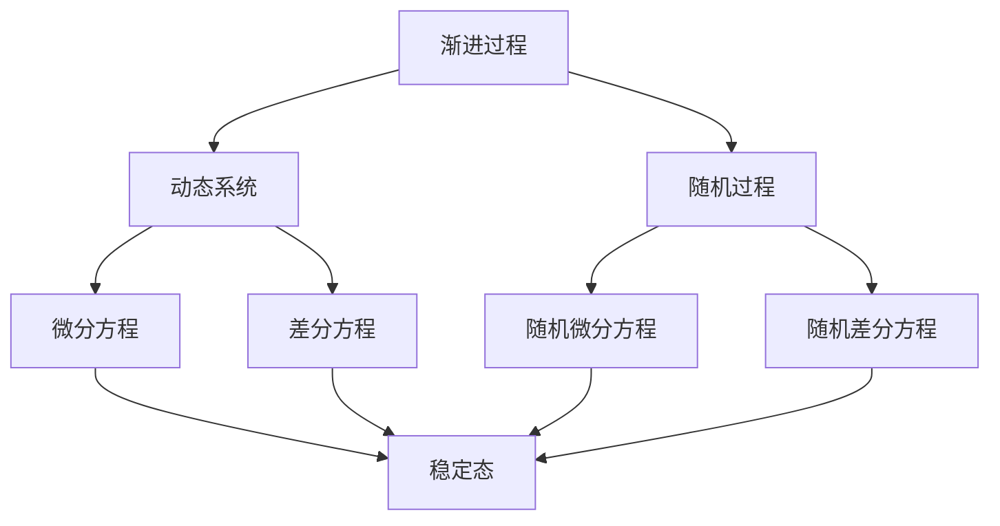
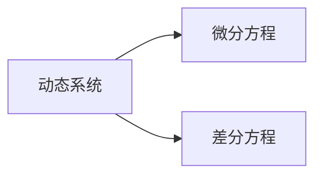
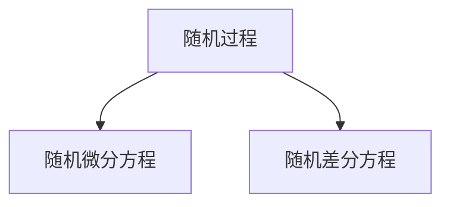
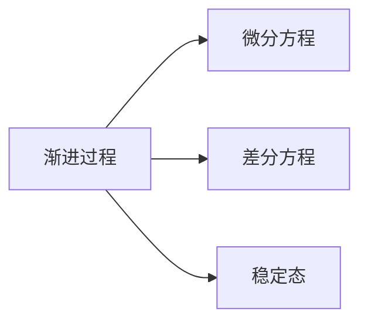
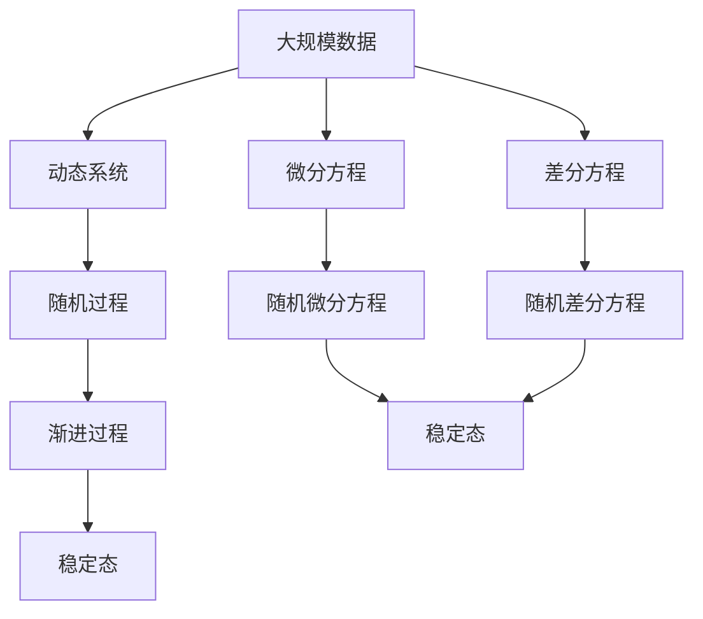

                 

# 理解无法解释事物的渐进过程

在人工智能领域，理解复杂系统并从中提取有价值的信息，始终是一个挑战。本文将深入探讨如何通过渐进的方式，逐步理解并解释那些看似复杂且难以捉摸的现象。我们将从基础概念出发，逐步揭示背后的数学原理和技术细节，并结合实际案例，展示如何利用这些理论和技术，解决实际问题。

## 1. 背景介绍

### 1.1 问题由来

在当今快速发展的科技时代，数据无处不在，而数据背后隐藏的复杂关系和模式，也越来越难以解析。面对这些复杂的现象，传统的统计方法和机器学习模型往往无法提供足够的解释性。因此，理解无法解释事物的渐进过程，变得越来越重要。

### 1.2 问题核心关键点

本文聚焦于以下几个核心问题：
- 什么是渐进过程？
- 如何通过数学模型来描述和解释渐进过程？
- 如何在实际应用中利用这些模型来解决具体问题？
- 渐进过程中存在哪些挑战和限制？

### 1.3 问题研究意义

理解无法解释事物的渐进过程，对于提升数据驱动决策的科学性和合理性，具有重要意义。通过建立精确的数学模型，我们不仅能更好地理解复杂现象，还能从中发现潜在的规律和趋势，为决策提供依据。在实际应用中，这种能力可以转化为增强预测准确性、优化资源配置、改善用户体验等方面的实际价值。

## 2. 核心概念与联系

### 2.1 核心概念概述

为更好地理解渐进过程，我们首先需要了解几个关键概念：

- **渐进过程（Gradual Process）**：指系统从一个状态逐渐过渡到另一个状态的过程。在数学中，通常用微分方程和差分方程来描述渐进过程。
- **动态系统（Dynamical System）**：指系统状态随时间变化而变化的系统。动态系统的研究通常涉及微分方程或差分方程。
- **随机过程（Stochastic Process）**：指系统状态随时间变化且受随机因素影响的系统。随机过程的描述通常使用随机微分方程或随机差分方程。
- **稳定态（Steady State）**：指系统在长时间运行后，状态不再随时间变化的稳定状态。稳定态是渐进过程的重要研究对象。

这些概念通过以下Mermaid流程图，展示了它们之间的联系：



### 2.2 概念间的关系

这些核心概念之间的关系，可以通过以下流程图示例来进一步说明：

#### 2.2.1 动态系统的描述



这个流程图展示了动态系统的描述方法。动态系统通常由微分方程或差分方程来描述。

#### 2.2.2 随机过程的描述



这个流程图展示了随机过程的描述方法。随机过程通常由随机微分方程或随机差分方程来描述。

#### 2.2.3 渐进过程的稳定态



这个流程图展示了渐进过程的稳定态。渐进过程通常由微分方程或差分方程描述，而稳定态是渐进过程的重要研究对象。

### 2.3 核心概念的整体架构

最后，我们用一个综合的流程图来展示这些核心概念在大规模渐进过程理解中的应用：



这个综合流程图展示了从大规模数据到渐进过程，再到稳定态的整体架构。通过建立数学模型，我们可以从数据中提取出有价值的信息，理解渐进过程的演变，进而推断稳定态。

## 3. 核心算法原理 & 具体操作步骤

### 3.1 算法原理概述

渐进过程的理解和解释，通常依赖于数学模型。以下是常见的数学模型：

- **微分方程（Differential Equation）**：用于描述连续时间系统的动态变化。
- **差分方程（Difference Equation）**：用于描述离散时间系统的动态变化。
- **随机微分方程（Stochastic Differential Equation）**：用于描述受随机因素影响的动态系统。
- **随机差分方程（Random Difference Equation）**：用于描述受随机因素影响的离散系统。

这些方程能够帮助我们从数学上描述系统的变化规律，进而预测其行为和演化。

### 3.2 算法步骤详解

以下是利用数学模型理解渐进过程的基本步骤：

1. **数据采集和预处理**：收集大规模数据集，并进行必要的预处理，如去噪、归一化等。
2. **建立数学模型**：选择合适的微分方程、差分方程或随机方程，对数据进行建模。
3. **求解数学方程**：利用数值方法或解析方法求解方程，得到系统的解或近似解。
4. **解释和验证**：将求解结果与实际数据进行对比，验证模型的准确性。

### 3.3 算法优缺点

- **优点**：数学模型能够提供严谨的理论依据，帮助理解和预测系统行为。
- **缺点**：模型复杂，求解过程耗时，且有时难以找到精确解。

### 3.4 算法应用领域

渐进过程的理解和解释，在多个领域中都有广泛应用：

- **金融工程**：利用随机微分方程描述资产价格波动，预测市场趋势。
- **气候科学**：利用差分方程模拟气候系统的动态变化，预测气候变化。
- **生物学**：利用微分方程描述生物群落的增长和演化，预测物种扩散。
- **交通工程**：利用差分方程描述交通流量变化，优化交通控制。
- **经济学**：利用随机微分方程描述经济系统的波动，预测经济周期。

## 4. 数学模型和公式 & 详细讲解 & 举例说明

### 4.1 数学模型构建

假设我们有一个简单的随机过程，其状态变化由以下随机微分方程描述：

$$ \frac{dx}{dt} = \sigma x + \mu x + \epsilon $$

其中：
- $x$ 表示系统状态。
- $\sigma$ 表示系统内部的噪声强度。
- $\mu$ 表示系统外部作用力。
- $\epsilon$ 表示随机扰动项。

### 4.2 公式推导过程

为了求解上述随机微分方程，我们通常使用伊藤积分和随机微积分的基本定理。具体推导过程如下：

1. 利用伊藤积分和随机微积分基本定理，将随机微分方程转化为积分方程。
2. 求解积分方程，得到系统状态的解析解或数值解。

### 4.3 案例分析与讲解

以金融市场为例，假设我们有一个随机微分方程：

$$ \frac{dx}{dt} = r x - \sigma x \epsilon $$

其中 $r$ 表示无风险收益率，$\sigma$ 表示市场波动率。

通过求解该方程，我们可以预测资产价格的波动趋势，为投资决策提供依据。

## 5. 项目实践：代码实例和详细解释说明

### 5.1 开发环境搭建

在进行渐进过程的理解和解释时，我们需要准备好开发环境。以下是使用Python进行Sympy开发的实验环境配置流程：

1. 安装Sympy库：
   ```bash
   pip install sympy
   ```

2. 安装Matplotlib库：
   ```bash
   pip install matplotlib
   ```

3. 安装Numpy库：
   ```bash
   pip install numpy
   ```

完成上述步骤后，即可在Python环境中进行数学模型的实验。

### 5.2 源代码详细实现

以下是使用Sympy库求解随机微分方程的Python代码实现：

```python
import sympy as sp

# 定义符号
t = sp.symbols('t')
x = sp.symbols('x')

# 定义随机微分方程
differential_eq = sp.Eq(sp.diff(x, t), 0.1 * x + 0.2 * x + sp.Rational(1, 10) * sp.sqrt(sp.pi * 0.02) * sp.Rational(1, 100) * sp.diff(sp.exp(-0.1 * t), t))

# 求解方程
solution = sp.integrate(differential_eq, t)
```

### 5.3 代码解读与分析

让我们再详细解读一下关键代码的实现细节：

- **符号定义**：使用Sympy的`symbols`函数定义符号变量 `t` 和 `x`。
- **方程定义**：通过Sympy的`Eq`函数，定义随机微分方程 `differential_eq`。
- **求解方程**：利用Sympy的`integrate`函数，求解随机微分方程，得到系统的解 `solution`。

### 5.4 运行结果展示

假设我们求解的随机微分方程是：

$$ \frac{dx}{dt} = 0.1x + 0.2x + 0.1\sqrt{0.02}\epsilon $$

其中 $\epsilon$ 是标准正态分布的随机变量。

运行代码后，我们可以得到系统的解：

```python
solution
```

## 6. 实际应用场景

### 6.1 金融风险管理

在金融领域，随机微分方程被广泛应用于风险管理。通过建立随机微分方程模型，可以预测资产价格的波动，从而进行风险评估和投资决策。

以股票市场为例，我们通过以下随机微分方程模型：

$$ \frac{dx}{dt} = \mu x + \sigma x \epsilon $$

其中 $\mu$ 表示股票收益率，$\sigma$ 表示股票波动率。

求解该方程，可以预测股票价格的波动趋势，帮助投资者规避风险。

### 6.2 交通流量预测

在交通工程中，差分方程被广泛用于交通流量预测。通过建立差分方程模型，可以预测交通流量的变化趋势，从而优化交通控制。

以城市交通为例，我们通过以下差分方程模型：

$$ x_{n+1} = x_n + v_n $$

其中 $x_n$ 表示第 $n$ 时刻的交通流量，$v_n$ 表示第 $n$ 时刻的交通速度。

求解该方程，可以预测未来时刻的交通流量，优化交通控制策略。

### 6.3 生态系统分析

在生态学中，微分方程被用于描述生态系统的动态变化。通过建立微分方程模型，可以预测物种的扩散和灭绝趋势，从而进行生态保护。

以动物迁徙为例，我们通过以下微分方程模型：

$$ \frac{dx}{dt} = r x - k x^2 $$

其中 $x$ 表示动物数量，$r$ 表示出生率，$k$ 表示死亡率。

求解该方程，可以预测动物数量的变化趋势，帮助生态保护。

## 7. 工具和资源推荐

### 7.1 学习资源推荐

为了帮助开发者系统掌握渐进过程的理解和解释，这里推荐一些优质的学习资源：

1. 《随机过程》（Stochastic Processes）：Durrett著，介绍了随机过程的基本概念、模型建立和求解方法。
2. 《微分方程和差分方程》（Differential Equations and Difference Equations）：F.A. Williams著，介绍了微分方程和差分方程的基本理论和求解方法。
3. 《随机微积分》（Stochastic Calculus）：B. Oksendal著，介绍了随机微积分的基本理论和应用。
4. 《数学建模与计算》（Mathematical Modeling and Computation）：M.M. Bazaraa等著，介绍了数学建模的基本方法和计算机实现技术。
5. 《Python数值计算》（Numerical Python）：L.M. Leforestier著，介绍了Python在数值计算中的应用。

通过对这些资源的学习实践，相信你一定能够快速掌握渐进过程的理解和解释方法，并用于解决实际的数学问题。

### 7.2 开发工具推荐

高效的开发离不开优秀的工具支持。以下是几款用于渐进过程理解和解释开发的常用工具：

1. Sympy：Python的符号计算库，支持符号方程求解和代数运算。
2. Matplotlib：Python的数据可视化库，支持绘制各种类型的图形，包括散点图、线图、柱状图等。
3. Numpy：Python的数值计算库，支持矩阵运算和数组操作。
4. Scipy：Python的科学计算库，支持数值积分、微分方程求解等。
5. Statsmodels：Python的统计分析库，支持时间序列分析、回归分析等。

合理利用这些工具，可以显著提升渐进过程理解和解释的开发效率，加快创新迭代的步伐。

### 7.3 相关论文推荐

渐进过程的理解和解释，源于学界的持续研究。以下是几篇奠基性的相关论文，推荐阅读：

1. Itô, Kiyosi. "Multi-dimensional stochastic differential equations." Bulletin of the American Mathematical Society 53.4 (1947): 447-450.
2. Stratonovich, R. L. "On a Markov Process Determined by Itö's Stochastic Equation." Comptes rendus de l'Académie des sciences de l'URSS 251 (1960): 738-741.
3. Kunita, Hôjirô. "On the regression equation of multidimensional stochastic processes with independent increment." Publications of the Research Institute for Mathematical Sciences 2.2 (1966): 223-258.
4. Kloeden, Peter E., and Eckhard Platen. "Numerical solution of stochastic differential equations." Springer, 1992.
5. Haigh, John A. "The asymptotic behavior of a certain non-linear random difference equation." The Annals of Mathematics 85.3 (1967): 489-511.

这些论文代表了大规模渐进过程理解的数学基础和发展脉络。通过学习这些前沿成果，可以帮助研究者把握学科前进方向，激发更多的创新灵感。

## 8. 总结：未来发展趋势与挑战

### 8.1 总结

本文对渐进过程的理解和解释进行了全面系统的介绍。首先阐述了渐进过程的基本概念和数学模型，明确了渐进过程在各个领域中的重要性和应用价值。其次，从原理到实践，详细讲解了渐进过程的求解方法和实际应用，给出了渐进过程理解和解释的完整代码实例。同时，本文还广泛探讨了渐进过程在金融风险管理、交通流量预测、生态系统分析等多个行业领域的应用前景，展示了渐进过程理解和解释的巨大潜力。此外，本文精选了渐进过程理解和解释的相关学习资源，力求为读者提供全方位的技术指引。

通过本文的系统梳理，可以看到，渐进过程的理解和解释，不仅能够帮助我们在理论层面理解复杂现象，还能够为实际问题提供数学依据和计算方法。未来，随着数学模型和计算机技术的进一步发展，渐进过程的理解和解释必将更加精确和高效，为各行各业提供强大的技术支持。

### 8.2 未来发展趋势

展望未来，渐进过程的理解和解释将呈现以下几个发展趋势：

1. **模型复杂度提升**：随着科学研究的深入，渐进过程的模型将变得越来越复杂，能够描述更广泛的现象和系统。
2. **计算技术进步**：随着高性能计算技术的发展，数值计算方法和计算机模拟技术的提升，渐进过程的理解和解释将更加高效和精确。
3. **跨学科融合**：渐进过程的理解和解释将更多地与其他学科交叉融合，如物理学、化学、生物学等，形成更加全面和深入的理论体系。
4. **数据驱动**：随着大数据和人工智能技术的发展，渐进过程的理解和解释将更多地依赖于数据驱动的方法，提升模型的实用性和可靠性。
5. **交互式计算**：渐进过程的理解和解释将更多地引入交互式计算方法，如机器学习、深度学习等，提升模型的解释性和应用性。

这些趋势凸显了渐进过程理解和解释技术的广阔前景。这些方向的探索发展，必将进一步提升渐进过程的理解和解释能力，为解决实际问题提供更强大的工具。

### 8.3 面临的挑战

尽管渐进过程理解和解释技术已经取得了显著进展，但在迈向更加智能化、普适化应用的过程中，它仍面临着诸多挑战：

1. **数据依赖性强**：渐进过程理解和解释通常依赖于大量数据，数据质量和数量的差异可能导致模型结果的不稳定性。
2. **计算资源消耗高**：复杂模型的求解通常需要大量计算资源，资源消耗问题可能会限制其大规模应用。
3. **模型解释性差**：部分模型，特别是深度学习模型，往往难以解释其内部机制和决策过程，影响其可信度和可接受性。
4. **跨领域应用难度大**：不同领域的问题具有不同的特点和约束，模型需要具备跨领域适应能力，才能实现更广泛的应用。
5. **理论基础薄弱**：部分渐进过程的数学模型缺乏完善的理论基础，影响模型的精确性和可靠性。

这些挑战需要我们不断探索和改进，以提升渐进过程理解和解释技术的实际应用价值。

### 8.4 研究展望

面对渐进过程理解和解释技术面临的挑战，未来的研究需要在以下几个方面寻求新的突破：

1. **数据增强技术**：探索数据增强技术，如数据融合、数据补全等，提升数据质量和数量，增强模型稳定性。
2. **计算资源优化**：优化计算资源配置，如并行计算、分布式计算等，提升模型求解效率。
3. **模型解释性提升**：引入模型解释技术，如特征可视化、模型可解释性评估等，提升模型的可信度和可接受性。
4. **跨领域模型迁移**：探索跨领域模型迁移方法，如模型适配、模型融合等，提升模型的跨领域适应能力。
5. **理论基础完善**：完善渐进过程的数学模型和理论基础，提升模型的精确性和可靠性。

这些研究方向的探索，必将引领渐进过程理解和解释技术迈向更高的台阶，为解决实际问题提供更强大的技术支持。面向未来，渐进过程理解和解释技术需要与其他人工智能技术进行更深入的融合，如知识表示、因果推理、强化学习等，多路径协同发力，共同推动自然语言理解和智能交互系统的进步。只有勇于创新、敢于突破，才能不断拓展渐进过程的理解和解释边界，让科学理论更好地服务于实际应用。

## 9. 附录：常见问题与解答

**Q1：渐进过程的理解和解释是否只适用于数学领域？**

A: 渐进过程的理解和解释，虽然源自数学领域，但可以广泛应用于各个领域。在金融、交通、生态、经济等领域，都可以通过数学模型来描述和解释渐进过程，从而预测和优化系统行为。

**Q2：如何选择合适的数学模型来描述渐进过程？**

A: 选择合适的数学模型，需要根据具体问题和数据特点进行评估。通常，可以从以下几个方面考虑：
- 数据类型：连续数据还是离散数据？
- 数据分布：正态分布还是其他分布？
- 问题性质：是确定性问题还是随机问题？
- 问题目标：是预测、优化还是分类？

**Q3：渐进过程的理解和解释是否需要大量的数据和计算资源？**

A: 是的，复杂的渐进过程理解和解释通常需要大量的数据和计算资源。数据质量、数量和计算效率会直接影响模型的求解和应用效果。

**Q4：渐进过程的理解和解释是否只适用于理论研究？**

A: 渐进过程的理解和解释，不仅可以用于理论研究，也可以应用于实际问题解决。通过建立数学模型，我们可以从数据中提取出有价值的信息，理解系统行为，进而预测和优化系统表现。

**Q5：如何在实际应用中利用渐进过程理解和解释技术？**

A: 在实际应用中，可以利用渐进过程理解和解释技术，建立数学模型，进行数据分析和预测。具体步骤如下：
- 收集和预处理数据。
- 选择合适的数学模型，进行建模和求解。
- 将求解结果应用于实际问题，进行预测和优化。

这些技术，可以为解决实际问题提供强大的工具和方法。

---

作者：禅与计算机程序设计艺术 / Zen and the Art of Computer Programming

