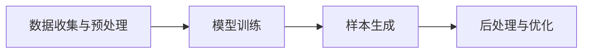

                 

# 生成式AIGC是金矿还是泡沫：第四部分：“让人尖叫”的用户体验

## 1. 背景介绍

生成式人工智能（Generative AI, AIGC）是当前人工智能领域的一个热门话题。随着技术的发展，生成式AIGC已经被应用于各种领域，如内容创作、视觉生成、游戏设计等，为用户提供了前所未有的体验。但与此同时，生成式AIGC也引发了诸多争议和质疑。一部分人认为生成式AIGC是未来科技的“金矿”，将彻底改变我们生活和工作的方式；而另一部分人则认为它可能只是“泡沫”，甚至会对社会带来潜在的负面影响。

在这篇博客的第四部分中，我们将探讨生成式AIGC在用户体验方面的表现和影响，以及如何平衡技术进步和用户需求之间的关系。我们将从以下几个方面进行分析：生成式AIGC的用户体验特点、用户心理与行为、实际应用中的用户体验优化、以及面临的挑战和解决方案。

## 2. 核心概念与联系

### 2.1 核心概念概述

生成式AIGC的核心在于利用先进的深度学习模型，从无到有地生成新的、与真实数据相匹配的内容。这些内容可以是文本、图像、音频、视频等。生成式AIGC的核心概念包括：

- **生成对抗网络（GANs）**：一种通过两个网络相互博弈生成高质量样本的深度学习框架。
- **变分自编码器（VAEs）**：一种用于生成数据并学习其分布的无监督学习算法。
- **扩散模型（Diffusion Models）**：一种新兴的生成模型，能够在高分辨率图像生成上取得卓越表现。
- **自回归模型（Auto-Regressive Models）**：一种通过预测前一时刻样本生成后一时刻样本的模型。
- **语言模型（Language Models）**：能够理解自然语言并生成文本的模型。

这些核心概念在实际应用中互相交织，共同构成了生成式AIGC的技术体系。

### 2.2 概念间的关系

生成式AIGC的技术架构可以概括为以下几层：

1. **数据收集与预处理**：收集真实数据并进行预处理，为生成式模型提供训练样本。
2. **模型训练**：使用各种生成式模型对数据进行训练，学习生成样本的规律。
3. **样本生成**：使用训练好的模型生成新的、符合要求的样本。
4. **后处理与优化**：对生成的样本进行后处理和优化，使其更加逼真或符合特定的需求。

这些层级之间的关系可以通过以下Mermaid流程图来展示：



## 3. 核心算法原理 & 具体操作步骤

### 3.1 算法原理概述

生成式AIGC的算法原理主要包括两部分：生成模型的设计和优化算法的选择。

- **生成模型**：包括GANs、VAEs、Diffusion Models等，用于学习生成样本的分布或直接生成样本。
- **优化算法**：包括梯度下降、变分推断等，用于最小化损失函数，提高生成样本的质量。

生成式AIGC的优化目标是使生成的样本尽可能逼近真实的样本，同时在时间和计算资源方面尽可能高效。这一过程通常涉及到大量的计算和数据处理，需要高性能的硬件设备和高效的算法。

### 3.2 算法步骤详解

生成式AIGC的算法步骤主要包括以下几个部分：

1. **数据准备**：收集并预处理训练数据，包括数据清洗、数据增强等步骤。
2. **模型选择与训练**：选择合适的生成模型，并使用训练数据进行模型训练。
3. **样本生成与后处理**：使用训练好的模型生成新的样本，并对生成的样本进行后处理和优化，以提高其质量和真实度。

以下是具体的步骤说明：

- **数据准备**：数据准备是生成式AIGC的第一步，主要包括以下几个步骤：
  - 数据收集：收集真实数据，包括文本、图像、音频等。
  - 数据清洗：去除数据中的噪声和异常值，确保数据的质量。
  - 数据增强：通过旋转、缩放、裁剪等方式，增加数据的多样性，以提高模型的泛化能力。

- **模型选择与训练**：模型选择与训练是生成式AIGC的核心步骤，主要包括以下几个方面：
  - 模型选择：选择适合生成任务的生成模型，如GANs、VAEs、Diffusion Models等。
  - 模型训练：使用训练数据对模型进行训练，最小化损失函数。
  - 超参数调优：通过实验调整模型的超参数，以提高模型的生成质量。

- **样本生成与后处理**：样本生成与后处理是生成式AIGC的最后一步，主要包括以下几个步骤：
  - 样本生成：使用训练好的模型生成新的样本。
  - 后处理：对生成的样本进行后处理和优化，包括去噪、颜色校正、图像裁剪等，以提高其质量和真实度。

### 3.3 算法优缺点

生成式AIGC具有以下优点：

- **高效生成**：通过生成模型可以高效地生成大量高质量的样本。
- **数据多样性**：生成模型可以生成多样化的数据，满足不同的应用需求。
- **创造性**：生成式AIGC在内容创作、设计、娱乐等领域具有很强的创造性。

但同时，生成式AIGC也存在一些缺点：

- **缺乏真实性**：生成的样本可能缺乏真实性，尤其是在细节和语义方面。
- **难以控制**：生成的样本难以完全控制，可能存在误差和不一致性。
- **依赖数据质量**：生成式AIGC的效果高度依赖于训练数据的质量，数据质量不佳会影响生成效果。

### 3.4 算法应用领域

生成式AIGC在多个领域都有广泛的应用，包括但不限于：

- **内容创作**：文本生成、图像生成、音乐生成等，为用户提供个性化和创意性的内容。
- **视觉设计**：图像生成、视频剪辑、3D建模等，提升设计效率和创意效果。
- **游戏与娱乐**：游戏角色生成、场景生成、虚拟现实等，丰富用户体验和游戏内容。
- **医疗与健康**：医学图像生成、病理分析、治疗方案设计等，辅助医生进行诊断和治疗。
- **教育与培训**：虚拟教师、模拟实验、在线课程等，提升教育培训效果。

## 4. 数学模型和公式 & 详细讲解 & 举例说明

### 4.1 数学模型构建

生成式AIGC的数学模型主要包括生成模型和优化算法。

- **生成模型**：通常使用神经网络来建模生成过程，如GANs、VAEs、Diffusion Models等。
- **优化算法**：通常使用梯度下降等优化算法，如Adam、SGD等。

以GANs为例，其数学模型可以表示为：

- **生成器（Generator）**：将随机噪声映射到生成的样本空间。
- **判别器（Discriminator）**：将样本空间映射到真实性分数。
- **损失函数**：通常使用Wasserstein距离或交叉熵等损失函数。

### 4.2 公式推导过程

以GANs为例，推导生成器（Generator）和判别器（Discriminator）的损失函数：

- **生成器损失函数**：
  $$
  L_G = \mathbb{E}_{z \sim p(z)} D(G(z))
  $$
  其中，$z$为随机噪声，$G(z)$为生成器生成的样本，$D(G(z))$为判别器对生成的样本的评分。

- **判别器损失函数**：
  $$
  L_D = \mathbb{E}_{x \sim p(x)} [D(x)] + \mathbb{E}_{z \sim p(z)} [1-D(G(z))]
  $$
  其中，$x$为真实样本，$D(x)$为判别器对真实样本的评分，$1-D(G(z))$为判别器对生成样本的评分。

### 4.3 案例分析与讲解

以GANs生成图像为例，推导其生成过程：

1. **生成器生成图像**：
  - 输入随机噪声 $z$，通过生成器生成图像 $x_G$。
  - 生成器模型 $G$ 通常为神经网络，将随机噪声 $z$ 映射到图像空间。

2. **判别器评分**：
  - 判别器 $D$ 对生成的图像 $x_G$ 进行评分，评分结果越接近1，表示图像越真实。
  - 判别器模型 $D$ 通常为神经网络，将图像 $x_G$ 映射到真实性分数。

3. **优化过程**：
  - 通过梯度下降等优化算法，不断更新生成器和判别器的参数，使得生成器生成的图像逼近真实图像。
  - 在每个迭代步骤中，生成器和判别器相互博弈，生成器希望生成更加逼真的图像，判别器希望正确区分真实和生成的图像。

## 5. 项目实践：代码实例和详细解释说明

### 5.1 开发环境搭建

进行生成式AIGC项目开发时，需要搭建好开发环境。以下是一个简单的Python开发环境搭建步骤：

1. **安装Python**：确保系统中安装了最新版本的Python，如Python 3.8以上。
2. **安装TensorFlow**：使用pip安装TensorFlow，如 `pip install tensorflow`。
3. **安装PyTorch**：使用pip安装PyTorch，如 `pip install torch`。
4. **安装Jupyter Notebook**：使用pip安装Jupyter Notebook，如 `pip install jupyter notebook`。
5. **安装OpenCV**：使用pip安装OpenCV，如 `pip install opencv-python`。

完成上述步骤后，即可开始生成式AIGC项目的开发。

### 5.2 源代码详细实现

以下是一个简单的生成式AIGC项目代码实现，用于生成手写数字图像：

```python
import tensorflow as tf
import numpy as np
import matplotlib.pyplot as plt
from tensorflow.keras import layers

# 定义生成器模型
def make_generator_model():
    model = tf.keras.Sequential()
    model.add(layers.Dense(7 * 7 * 256, use_bias=False, input_shape=(100,)))
    model.add(layers.BatchNormalization())
    model.add(layers.LeakyReLU())
    model.add(layers.Reshape((7, 7, 256)))
    assert model.output_shape == (None, 7, 7, 256)  # Note: None is the batch size

    model.add(layers.Conv2DTranspose(128, (5, 5), strides=(1, 1), padding='same', use_bias=False))
    assert model.output_shape == (None, 7, 7, 128)
    model.add(layers.BatchNormalization())
    model.add(layers.LeakyReLU())

    model.add(layers.Conv2DTranspose(64, (5, 5), strides=(2, 2), padding='same', use_bias=False))
    assert model.output_shape == (None, 14, 14, 64)
    model.add(layers.BatchNormalization())
    model.add(layers.LeakyReLU())

    model.add(layers.Conv2DTranspose(1, (5, 5), strides=(2, 2), padding='same', use_bias=False, activation='tanh'))
    assert model.output_shape == (None, 28, 28, 1)

    return model

# 定义判别器模型
def make_discriminator_model():
    model = tf.keras.Sequential()
    model.add(layers.Conv2D(64, (5, 5), strides=(2, 2), padding='same', input_shape=[28, 28, 1]))
    model.add(layers.LeakyReLU())
    model.add(layers.Dropout(0.3))

    model.add(layers.Conv2D(128, (5, 5), strides=(2, 2), padding='same'))
    model.add(layers.LeakyReLU())
    model.add(layers.Dropout(0.3))

    model.add(layers.Flatten())
    model.add(layers.Dense(1))

    return model

# 定义损失函数和优化器
cross_entropy = tf.keras.losses.BinaryCrossentropy(from_logits=True)

def discriminator_loss(real_output, fake_output):
    real_loss = cross_entropy(tf.ones_like(real_output), real_output)
    fake_loss = cross_entropy(tf.zeros_like(fake_output), fake_output)
    total_loss = real_loss + fake_loss
    return total_loss

def generator_loss(fake_output):
    return cross_entropy(tf.ones_like(fake_output), fake_output)

def make_gan_model(generator, discriminator):
    discriminator.trainable = False
    model = tf.keras.Sequential()
    model.add(generator)
    model.add(discriminator)
    return model

# 定义训练过程
def train_gan(generator, discriminator, real_images):
    batch_size = real_images.shape[0]
    for epoch in range(EPOCHS):
        random latent = np.random.normal(0, 1, (batch_size, 100))
        generated_images = generator(random latent)

        real_output = discriminator(real_images)
        fake_output = discriminator(generated_images)

        discriminator_loss_value = discriminator_loss(real_output, fake_output)
        generator_loss_value = generator_loss(fake_output)
        total_loss = discriminator_loss_value + generator_loss_value

        # Update the generator and discriminator
        discriminator.trainable = True
        discriminator_optimizer = tf.keras.optimizers.Adam(learning_rate=0.0002, beta_1=0.5)
        discriminator_optimizer.minimize(discriminator_loss, var_list=discriminator.trainable_variables)

        discriminator.trainable = False
        generator_optimizer = tf.keras.optimizers.Adam(learning_rate=0.0002, beta_1=0.5)
        generator_optimizer.minimize(generator_loss, var_list=generator.trainable_variables)

        if (epoch + 1) % 100 == 0:
            print('Epoch', epoch+1, 'completed.')
            print('discriminator loss:', discriminator_loss_value.numpy())
            print('generator loss:', generator_loss_value.numpy())
```

### 5.3 代码解读与分析

以上代码实现了一个简单的GANs生成手写数字图像的模型，具体解释如下：

- **生成器模型**：用于将随机噪声转换为图像。
- **判别器模型**：用于评估图像的真实性。
- **损失函数**：用于计算生成器和判别器之间的误差。
- **优化器**：用于更新生成器和判别器的参数。
- **训练过程**：通过不断迭代更新生成器和判别器的参数，提高生成图像的质量。

## 6. 实际应用场景

### 6.1 内容创作

生成式AIGC在内容创作方面具有广泛的应用，包括：

- **文本生成**：生成新闻报道、文章、故事、对话等。
- **图像生成**：生成艺术作品、广告图像、动画角色等。
- **音乐生成**：生成歌曲、配乐、背景音乐等。

这些应用不仅提高了创作效率，还丰富了创意表达，为用户提供了更加多样化的体验。

### 6.2 视觉设计

生成式AIGC在视觉设计方面也有许多应用，如：

- **图像生成**：生成具有创意的图像、插图、封面设计等。
- **视频剪辑**：生成高质量的视频片段，用于电影、广告、游戏等。
- **3D建模**：生成3D模型，用于虚拟现实、游戏、动画等。

这些应用不仅提高了设计效率，还提升了设计的创意性和创新性。

### 6.3 游戏与娱乐

生成式AIGC在游戏与娱乐方面有广泛的应用，如：

- **角色生成**：生成虚拟角色，用于游戏、动画、虚拟现实等。
- **场景生成**：生成虚拟场景，用于游戏、电影、虚拟现实等。
- **情节生成**：生成故事情节，用于游戏、小说、电影等。

这些应用不仅提高了娱乐体验，还丰富了互动性，增强了用户的沉浸感。

### 6.4 未来应用展望

随着技术的不断发展，生成式AIGC将在更多领域得到应用，为人类带来更丰富的体验和更高的效率。未来，生成式AIGC可能的应用场景包括：

- **医疗与健康**：生成医学图像、病理报告、治疗方案等，辅助医生进行诊断和治疗。
- **教育与培训**：生成虚拟教师、模拟实验、在线课程等，提升教育培训效果。
- **金融与投资**：生成财经新闻、投资报告、股票分析等，辅助投资者进行决策。
- **司法与法律**：生成法律文件、案件摘要、司法记录等，辅助律师进行工作。

总之，生成式AIGC在未来的发展潜力巨大，将在各个领域发挥重要作用，为人类带来更多便利和创新。

## 7. 工具和资源推荐

### 7.1 学习资源推荐

为了帮助开发者系统掌握生成式AIGC的理论基础和实践技巧，这里推荐一些优质的学习资源：

- **Coursera《深度学习》课程**：由斯坦福大学Andrew Ng教授开设，涵盖深度学习的基本概念和前沿技术。
- **Udacity《深度学习基础》课程**：由DeepMind的Deep Learning专家开设，详细讲解深度学习的基本原理和应用。
- **ArXiv预印本**：最新的人工智能研究成果发布平台，包含大量生成式AIGC的论文和报告。
- **Kaggle竞赛平台**：举办各类AI竞赛，提供丰富的数据集和模型代码，帮助开发者实践生成式AIGC技术。
- **GitHub开源项目**：生成式AIGC的许多项目在GitHub上开放源代码，开发者可以通过阅读和贡献代码，深入理解生成式AIGC的实现细节。

### 7.2 开发工具推荐

高效的开发离不开优秀的工具支持。以下是几款用于生成式AIGC开发的常用工具：

- **TensorFlow**：谷歌开源的深度学习框架，支持GPU加速，适用于大规模深度学习模型训练。
- **PyTorch**：Facebook开源的深度学习框架，易于使用，适用于研究和小规模模型训练。
- **OpenCV**：开源计算机视觉库，用于图像处理和生成。
- **Jupyter Notebook**：交互式编程环境，支持Python、R、Scala等多种语言，适合快速迭代和实验。
- **TensorBoard**：谷歌开源的可视化工具，用于监控和调试深度学习模型的训练过程。

### 7.3 相关论文推荐

生成式AIGC的研究始于上世纪末，近年来随着深度学习技术的发展，得到了广泛关注和研究。以下是几篇奠基性的相关论文，推荐阅读：

- **ImageNet Classification with Deep Convolutional Neural Networks**：Alex Krizhevsky等人在2012年提出的AlexNet模型，是深度学习领域的里程碑。
- **Generative Adversarial Nets**：Ian Goodfellow等人在2014年提出的GANs模型，开创了生成式AIGC的先河。
- **Wasserstein GAN**：Arjovskiy等人在2017年提出的WGAN模型，解决了GANs训练过程中的模式崩溃问题。
- **Progressive Growing of GANs for Improved Quality, Stability, and Variation**：Karras等人在2019年提出的PG-GAN模型，提升了GANs的生成质量和稳定性。
- **Improved Techniques for Training GANs**：Radford等人在2015年提出的DCGAN模型，通过简化网络结构，提高了GANs的生成质量。

这些论文代表了大规模生成式AIGC的发展脉络，帮助研究者把握学科前进方向，激发更多的创新灵感。

## 8. 总结：未来发展趋势与挑战

### 8.1 总结

生成式AIGC作为当前AI领域的热门话题，在多个领域展现出了巨大的潜力和应用前景。本文从用户体验的角度，详细探讨了生成式AIGC的实现过程和应用场景，并提出了一些优化建议和未来发展方向。

通过本文的系统梳理，可以看到，生成式AIGC不仅在技术上取得了突破，也在用户体验方面带来了革命性的改变。未来，随着技术的不断进步，生成式AIGC必将在更多领域得到广泛应用，为人类带来更丰富的体验和更高的效率。

### 8.2 未来发展趋势

展望未来，生成式AIGC将呈现以下几个发展趋势：

- **多模态生成**：结合图像、音频、视频等多模态数据，生成更加丰富和逼真的内容。
- **实时生成**：通过高效的算法和硬件，实现实时生成高质量的样本。
- **自适应生成**：根据用户需求和反馈，动态生成个性化的内容。
- **生成式对抗**：结合生成器和判别器，生成更加逼真和多样化的内容。
- **交互式生成**：实现用户与生成式模型之间的互动，提升用户体验。

以上趋势凸显了生成式AIGC的广阔前景，这些方向的探索发展，必将进一步提升生成式AIGC的效果和用户体验，为人类带来更丰富的创新和便利。

### 8.3 面临的挑战

尽管生成式AIGC在多个领域展现出了巨大的潜力和应用前景，但在实现过程中，仍面临着诸多挑战：

- **计算资源限制**：生成式AIGC通常需要大规模计算资源，这对硬件设备提出了很高的要求。
- **数据质量问题**：生成式AIGC的效果高度依赖于训练数据的质量，数据质量不佳会影响生成效果。
- **模型复杂性**：生成式AIGC的模型复杂度较高，难以优化和调试。
- **伦理和法律问题**：生成式AIGC可能引发伦理和法律问题，如版权、隐私保护等。
- **用户体验差异**：不同用户对生成内容的接受度不同，难以满足所有用户的需求。

### 8.4 研究展望

面对生成式AIGC所面临的诸多挑战，未来的研究需要在以下几个方面寻求新的突破：

- **优化算法**：开发更加高效的生成算法，提升生成效果和速度。
- **数据增强**：通过数据增强技术，提高生成式模型的泛化能力。
- **模型压缩**：通过模型压缩技术，减少生成式模型的计算资源占用。
- **用户体验优化**：结合用户体验反馈，优化生成式模型的生成效果。
- **伦理和法律合规**：研究生成式AIGC的伦理和法律问题，确保其应用合规。

这些研究方向的探索，必将引领生成式AIGC技术迈向更高的台阶，为人类带来更丰富和安全的创新体验。

## 9. 附录：常见问题与解答

### 9.1 问题：生成式AIGC是否会取代人类创作者？

**解答**：生成式AIGC在内容创作、设计等领域具有广泛的应用前景，但不会完全取代人类创作者。生成式AIGC可以作为辅助工具，提升创作者的效率和创意，帮助他们更好地完成工作。同时，生成式AIGC也需要人类的指导和监督，才能生成更加精准和有意义的内容。

### 9.2 问题：生成式AIGC在图像生成方面有什么优势？

**解答**：生成式AIGC在图像生成方面具有以下优势：

- **高效生成**：能够快速生成大量高质量的图像，节省时间和人力成本。
- **多样性**：生成的图像具有多样性，能够满足不同用户的需求。
- **自动化**：生成式AIGC能够自动生成图像，减少了人工干预，提高了效率。

### 9.3 问题：生成式AIGC在视频生成方面有什么挑战？

**解答**：生成式AIGC在视频生成方面面临以下挑战：

- **复杂性**：视频生成比图像生成更为复杂，需要考虑时间、空间等多个维度。
- **资源占用**：视频生成需要更多的计算资源和时间，对硬件设备提出了更高的要求。
- **质量控制**：视频生成的质量难以控制，可能存在模糊、抖动等问题。

### 9.4 问题：生成式AIGC在应用中需要注意什么？

**解答**：生成式AIGC在应用中需要注意以下问题：

- **数据质量**：确保生成式AIGC的训练数据具有高质量，以提升生成效果。
- **模型参数**：优化生成式AIGC的模型参数，以提高生成质量和效率。
- **用户体验**：结合用户体验反馈，优化生成式AIGC的生成效果。
- **伦理和法律合规**：研究生成式AIGC的伦理和法律问题，确保其应用合规。

### 9.5 问题：生成式AIGC在实际应用中有什么限制？

**解答**：生成式AIGC在实际应用中面临以下限制：

- **计算资源**：生成式AIGC需要大规模计算资源，这对硬件设备提出了很高的要求。
- **数据质量**：生成式AIGC的效果高度依赖于训练数据的质量，数据质量不佳会影响生成效果。
- **模型复杂性**：生成式AIGC的模型复杂度较高，难以优化和调试。
- **伦理和法律问题**：生成式AIGC可能引发伦理和法律问题，如版权、隐私保护等。
- **用户体验差异**：不同用户对生成内容的接受度不同，难以满足所有用户的需求。

---

作者：禅与计算机程序设计艺术 / Zen and the Art of Computer Programming

