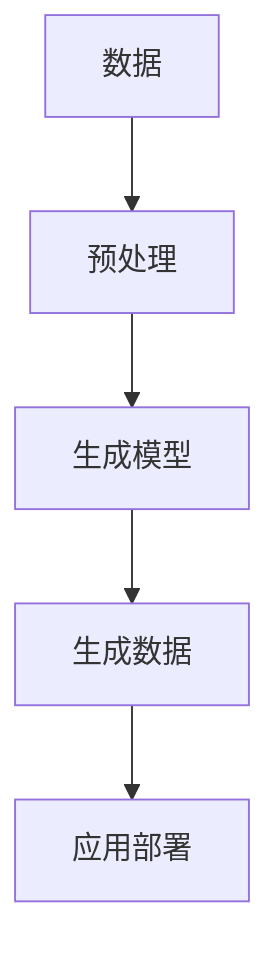
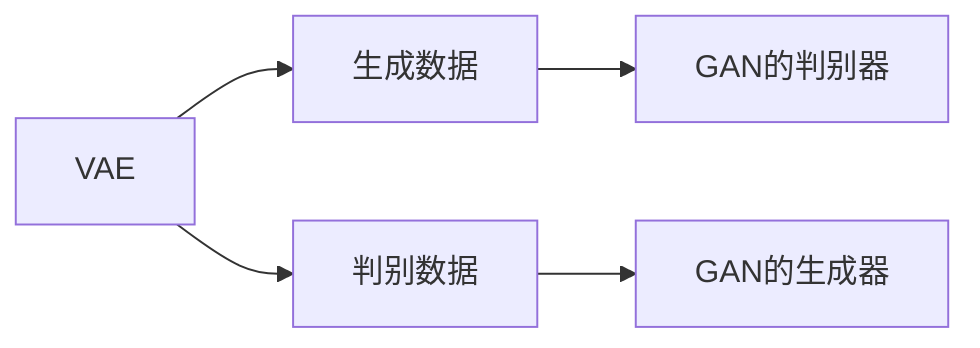
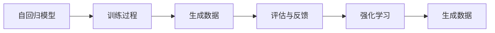
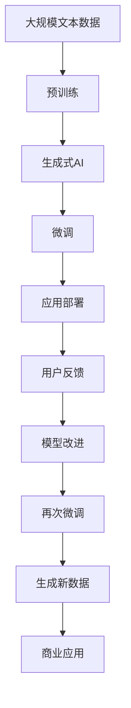

                 

# 生成式AIGC：从数据到商业价值的实现

## 1. 背景介绍

### 1.1 问题由来

随着人工智能(AI)技术的发展，生成式人工智能(Generative AI, AIGC)成为了当前科技行业最为热门的技术之一。AIGC技术涵盖了图像生成、语音生成、文本生成等多个方向，被广泛应用于媒体内容制作、电商推荐、游戏设计等多个领域，带来了革命性的商业价值。

生成式AIGC技术的核心在于通过深度学习算法生成与真实数据高度相似的新数据。这不仅仅是简单的数据复制，而是通过学习数据的潜在分布，生成具有新颖性、创造性的内容。相比传统的规则引擎、模板填充等方法，AIGC能够自动学习数据中的规律和模式，生成更加自然、逼真且具有创意的数据。

然而，生成式AIGC的实现并非易事。其核心在于如何从数据中提取有用的信息，并在此基础上生成新的数据。在实际应用中，既要确保生成的数据质量，又要保证系统的实时性和稳定性。因此，从数据到商业价值的实现过程，既需要理论上的支撑，又需要实践上的指导。

### 1.2 问题核心关键点

AIGC技术实现的关键在于以下几个方面：

1. 数据预处理：对原始数据进行清洗、归一化、降维等预处理，以便于模型学习。
2. 模型设计：选择合适的生成模型，如GAN、VAE、Transformer等，并设计损失函数、优化器等关键组件。
3. 训练过程：使用反向传播算法对模型进行训练，确保模型能够生成高质量的数据。
4. 应用部署：将训练好的模型部署到生产环境中，保证系统的高效运行和可扩展性。

从数据到商业价值的实现，是一个复杂的过程。它不仅需要关注模型的技术细节，还需要考虑系统的集成、调优、上线等多个环节，从而实现最终的商业落地。

### 1.3 问题研究意义

生成式AIGC技术的应用，在诸多领域展示了其巨大的潜力和商业价值。具体而言，AIGC技术对商业价值的影响主要体现在以下几个方面：

1. 内容创作：AIGC技术能够自动生成高质量的内容，如新闻、文章、图片、音乐等，大幅降低内容创作的成本和时间，满足用户对高质量内容的日益增长的需求。
2. 电商推荐：基于用户行为数据的AIGC推荐系统，能够提供更加个性化、精准的商品推荐，提升用户的购物体验，增加销售额。
3. 游戏设计：AIGC生成的虚拟角色、环境、物品等，能够提升游戏的沉浸感和趣味性，吸引更多用户。
4. 媒体制作：AIGC能够生成高质量的图像、视频、音频等内容，减少人工制作成本，加快内容产出速度，提高媒体制作效率。
5. 广告投放：AIGC生成的广告素材，具有更高的创意性和多样性，能够更有效地吸引用户的注意力，提升广告效果。
6. 创意设计：设计师可以通过AIGC技术获得设计灵感，加快创意实现，提升设计效率。

这些应用场景展示了AIGC技术的多样性和潜力，对于推动各行业的数字化转型升级，具有重要的战略意义。

## 2. 核心概念与联系

### 2.1 核心概念概述

为更好地理解生成式AIGC的实现机制，本节将介绍几个关键概念：

- **生成式AI**：通过深度学习算法生成与真实数据高度相似的新数据，涵盖图像生成、语音生成、文本生成等多个方向。
- **变分自编码器(VAE)**：一种生成模型，能够学习数据的潜在分布，并生成与原始数据相似的新数据。
- **生成对抗网络(GAN)**：通过生成器和判别器两个网络的对抗训练，生成与真实数据相似的新数据。
- **自回归模型**：如GPT、T5等模型，通过基于已有文本生成新的文本，具有语言模型和生成模型双重特性。
- **强化学习**：通过与环境的互动，使生成模型能够生成更具创意的数据，增强模型的生成能力。

这些概念之间存在紧密的联系，共同构成了生成式AIGC技术的核心框架。它们通过深度学习、生成对抗、强化学习等技术手段，实现了从数据到新数据的生成过程。

### 2.2 概念间的关系

这些核心概念之间存在着紧密的联系，形成了生成式AIGC技术的完整生态系统。下面我通过几个Mermaid流程图来展示这些概念之间的关系。

#### 2.2.1 生成式AI的生成过程



这个流程图展示了生成式AI从原始数据到生成新数据的过程。首先对原始数据进行预处理，然后通过生成模型学习数据的潜在分布，生成新数据。最后，将生成数据部署到实际应用场景中。

#### 2.2.2 VAE与GAN的关系



这个流程图展示了VAE与GAN之间的相互关系。VAE通过生成器学习数据的潜在分布，生成新数据。GAN则通过生成器和判别器进行对抗训练，提升生成数据的质量。

#### 2.2.3 自回归模型与强化学习的关系



这个流程图展示了自回归模型与强化学习之间的相互关系。自回归模型通过训练过程学习数据的潜在分布，生成新数据。强化学习则通过评估与反馈环节，优化模型的生成能力，生成更具创意的数据。

### 2.3 核心概念的整体架构

最后，我用一个综合的流程图来展示这些核心概念在大语言模型微调过程中的整体架构：



这个综合流程图展示了从预训练到生成式AIGC微调，再到商业应用的过程。大语言模型通过预训练获得基础能力，然后通过生成式AIGC微调，生成新数据。这些新数据在实际应用场景中得到验证和反馈，进一步改进模型，再次微调以生成更高质量的数据，最终应用于商业领域，实现数据到商业价值的转化。

## 3. 核心算法原理 & 具体操作步骤

### 3.1 算法原理概述

生成式AIGC技术的核心在于通过深度学习模型生成新数据。其中，VAE和GAN是最常见的生成模型，自回归模型如GPT、T5等也能实现类似的功能。其基本原理如下：

1. **VAE**：通过编码器将数据映射到潜在空间，然后通过解码器生成新数据。VAE的目标是最小化重构误差和潜在空间的正则化项。

2. **GAN**：由生成器和判别器两个网络组成，通过对抗训练优化模型参数。生成器的目标是最小化生成的数据与真实数据的差异，判别器的目标是最小化对真实数据的判别错误。

3. **自回归模型**：通过基于已有数据生成新数据。模型通过自动回归的方式，预测下一个词的概率分布，然后生成新的文本。

这些生成模型通过深度学习算法，学习数据的潜在分布，生成与原始数据相似的新数据。生成模型的训练过程通常分为训练阶段和测试阶段，训练阶段通过反向传播算法优化模型参数，测试阶段通过评估指标评估生成数据的质量。

### 3.2 算法步骤详解

生成式AIGC的实现过程通常包括以下关键步骤：

**Step 1: 数据预处理**

1. 数据清洗：去除噪声、缺失值等。
2. 数据归一化：将数据转化为标准正态分布，以便于模型学习。
3. 数据降维：通过PCA、Autoencoder等方法，减少数据维度，提高模型训练效率。

**Step 2: 模型设计**

1. 选择合适的生成模型，如VAE、GAN、Transformer等。
2. 设计损失函数：如重构损失、对抗损失、交叉熵损失等。
3. 设计优化器：如Adam、SGD等，设置合适的学习率。

**Step 3: 训练过程**

1. 使用反向传播算法进行模型训练，优化模型参数。
2. 记录训练过程中的各项指标，如损失、准确率、生成数据质量等。
3. 使用验证集评估模型性能，避免过拟合。

**Step 4: 应用部署**

1. 将训练好的模型部署到生产环境中。
2. 优化模型性能，提高推理速度。
3. 集成相关接口，便于外部系统调用。

**Step 5: 反馈优化**

1. 收集用户反馈，评估生成数据的质量。
2. 根据反馈优化模型参数，提升生成数据的质量。
3. 重新训练模型，进入下一轮微调过程。

### 3.3 算法优缺点

生成式AIGC技术具有以下优点：

1. 高质量生成：生成数据与真实数据高度相似，具备一定的创意性和多样性。
2. 自动化创作：自动生成高质量的内容，大幅降低创作成本和时间。
3. 实时生成：生成数据可以实时生成，满足动态场景的需求。
4. 泛化能力强：模型能够适应多种数据类型和应用场景，具有较强的泛化能力。

同时，该技术也存在以下缺点：

1. 模型复杂：生成式AIGC模型的结构通常比较复杂，训练和推理的资源消耗较大。
2. 训练成本高：需要大量标注数据进行训练，训练过程耗时较长。
3. 生成质量不稳定：生成数据的质量受训练数据的影响较大，可能存在生成质量不稳定的现象。
4. 可解释性不足：生成模型通常是"黑盒"系统，难以解释其内部工作机制和决策逻辑。

### 3.4 算法应用领域

生成式AIGC技术已经广泛应用于多个领域，例如：

- **图像生成**：通过生成对抗网络(GAN)生成逼真的图像，如人脸生成、风景生成等。
- **语音生成**：通过生成对抗网络(GAN)生成逼真的语音，如语音合成、语音翻译等。
- **文本生成**：通过自回归模型生成自然流畅的文本，如文章生成、对话生成等。
- **视频生成**：通过深度学习模型生成高质量的视频内容，如视频剪辑、视频生成等。
- **游戏设计**：通过生成式AI生成虚拟角色、环境、物品等，提升游戏的沉浸感和趣味性。
- **电商推荐**：通过生成式AI生成个性化推荐内容，提升用户的购物体验和转化率。
- **媒体制作**：通过生成式AI生成高质量的图像、视频、音频等内容，减少人工制作成本，加快内容产出速度。
- **创意设计**：通过生成式AI提供设计灵感，加快创意实现，提升设计效率。

## 4. 数学模型和公式 & 详细讲解

### 4.1 数学模型构建

本节将使用数学语言对生成式AIGC的实现过程进行更加严格的刻画。

记生成式AIGC模型为 $G_\theta(x)$，其中 $x$ 为输入数据，$\theta$ 为模型参数。假设原始数据 $X$ 为高维向量，生成数据 $Y$ 也为高维向量。模型训练的目标是最小化生成数据的重构误差和潜在空间的正则化项。

设编码器为 $E(x) = \mu(x) + \sigma(x) \odot \epsilon$，解码器为 $D(\mu(x), \sigma(x)) = \mu(x) + \sigma(x) \odot \epsilon$，其中 $\mu(x)$ 为均值，$\sigma(x)$ 为标准差，$\epsilon$ 为随机噪声。

VAE的训练目标为：

$$
\min_{\theta} \mathcal{L}_{VAE}(\theta) = \mathbb{E}_{x \sim X} [\log p(x|G_\theta)] + \mathbb{E}_{x \sim X} [\log q_\phi(z|x)] + \mathbb{E}_{z \sim q_\phi(z|x)} [-\log p_\theta(x|z)]
$$

其中 $p(x|G_\theta)$ 为生成数据的概率密度函数，$q_\phi(z|x)$ 为潜在空间的概率密度函数，$p_\theta(x|z)$ 为给定潜在空间 $z$ 下的生成数据的概率密度函数。

GAN的训练目标为：

$$
\min_G \max_D \mathcal{L}_{GAN}(G,D) = -\mathbb{E}_{x \sim X} [\log D(x)] - \mathbb{E}_{z \sim p(z)} [\log (1-D(G(z))]
$$

其中 $G$ 为生成器，$D$ 为判别器，$p(z)$ 为潜在空间的概率密度函数。

自回归模型的训练目标为：

$$
\min_\theta \mathcal{L}_{AR}(\theta) = -\mathbb{E}_{x \sim X} [\log p(x|x_{<t}, \theta)]
$$

其中 $x_{<t}$ 为已知文本部分，$\theta$ 为模型参数。

### 4.2 公式推导过程

以VAE为例，进行数学推导。

VAE的编码器将原始数据 $x$ 映射到潜在空间 $z$，生成器将潜在空间 $z$ 映射回生成数据 $y$。编码器输出的均值 $\mu(x)$ 和标准差 $\sigma(x)$ 满足：

$$
\mu(x) = E(z|x), \quad \sigma(x) = \sqrt{Var(z|x)}
$$

生成器的输出满足：

$$
y = D(\mu(x), \sigma(x)) = \mu(x) + \sigma(x) \odot \epsilon
$$

其中 $\epsilon \sim N(0,1)$。

VAE的训练目标为：

$$
\min_{\theta} \mathcal{L}_{VAE}(\theta) = \mathbb{E}_{x \sim X} [-\log p(x|y)] + \mathbb{E}_{x \sim X} [-\log q_\phi(z|x)]
$$

其中 $p(x|y)$ 为生成数据的概率密度函数，$q_\phi(z|x)$ 为潜在空间的概率密度函数。

根据贝叶斯定理，可以得到：

$$
q_\phi(z|x) = q_\phi(z) \frac{p(x|z)}{p(x)}
$$

带入VAE的训练目标，得：

$$
\min_{\theta} \mathcal{L}_{VAE}(\theta) = -\mathbb{E}_{x \sim X} [-\log p(x|y)] - \mathbb{E}_{x \sim X} [-\log q_\phi(z|x)]
$$

进一步展开，得：

$$
\min_{\theta} \mathcal{L}_{VAE}(\theta) = -\mathbb{E}_{x \sim X} [\log p(x|y)] - \mathbb{E}_{x \sim X} [-\log q_\phi(z|x)] + \mathbb{E}_{x \sim X} [-\log p(x)]
$$

为了简化问题，假设 $p(x)$ 为常数，则有：

$$
\min_{\theta} \mathcal{L}_{VAE}(\theta) = -\mathbb{E}_{x \sim X} [\log p(x|y)] - \mathbb{E}_{x \sim X} [-\log q_\phi(z|x)]
$$

带入编码器和生成器的输出，得：

$$
\min_{\theta} \mathcal{L}_{VAE}(\theta) = -\mathbb{E}_{x \sim X} [-\log p(x|y)] - \mathbb{E}_{x \sim X} [-\log q_\phi(z|x)]
$$

其中：

$$
p(x|y) = \mathcal{N}(y; \mu(x), \sigma(x)^2)
$$

$$
q_\phi(z|x) = \mathcal{N}(z; \mu(x), \sigma(x)^2)
$$

带入上述公式，得：

$$
\min_{\theta} \mathcal{L}_{VAE}(\theta) = -\mathbb{E}_{x \sim X} [-\log \mathcal{N}(y; \mu(x), \sigma(x)^2)] - \mathbb{E}_{x \sim X} [-\log \mathcal{N}(z; \mu(x), \sigma(x)^2)]
$$

化简，得：

$$
\min_{\theta} \mathcal{L}_{VAE}(\theta) = -\frac{1}{2} \mathbb{E}_{x \sim X} [\log |\sigma(x)^2|] + \frac{1}{2} \mathbb{E}_{x \sim X} [(y - \mu(x))^2] + \frac{1}{2} \mathbb{E}_{x \sim X} [(z - \mu(x))^2]
$$

### 4.3 案例分析与讲解

以图像生成为例，使用GAN模型进行推导。

假设原始图像 $x$ 为高维向量，生成图像 $y$ 也为高维向量。GAN的生成器 $G_\theta$ 和判别器 $D_\phi$ 满足：

$$
G_\theta(x) = y
$$

$$
D_\phi(y) = \log \frac{p(y)}{1-p(y)}
$$

GAN的训练目标为：

$$
\min_G \max_D \mathcal{L}_{GAN}(G,D) = -\mathbb{E}_{x \sim X} [\log D(x)] - \mathbb{E}_{z \sim p(z)} [\log (1-D(G(z))]
$$

其中 $G$ 为生成器，$D$ 为判别器，$p(z)$ 为潜在空间的概率密度函数。

根据最大最小化目标，可以得到：

$$
\max_D \mathcal{L}_{GAN}(G,D) = -\mathbb{E}_{x \sim X} [\log D(x)] + \mathbb{E}_{z \sim p(z)} [\log D(G(z))]
$$

带入上述公式，得：

$$
\min_G \mathcal{L}_{GAN}(G,D) = \mathbb{E}_{x \sim X} [\log D(x)] - \mathbb{E}_{z \sim p(z)} [\log D(G(z))]
$$

其中：

$$
D(x) = \log \frac{p(x)}{1-p(x)}
$$

$$
D(G(z)) = \log \frac{p(G(z))}{1-p(G(z))}
$$

带入上述公式，得：

$$
\min_G \mathcal{L}_{GAN}(G,D) = \mathbb{E}_{x \sim X} [\log \frac{p(x)}{1-p(x)}] - \mathbb{E}_{z \sim p(z)} [\log \frac{p(G(z))}{1-p(G(z))}]
$$

进一步化简，得：

$$
\min_G \mathcal{L}_{GAN}(G,D) = \mathbb{E}_{x \sim X} [\log p(x)] - \mathbb{E}_{z \sim p(z)} [\log p(G(z))]
$$

## 5. 项目实践：代码实例和详细解释说明

### 5.1 开发环境搭建

在进行生成式AIGC实践前，我们需要准备好开发环境。以下是使用Python进行TensorFlow和PyTorch开发的环境配置流程：

1. 安装Anaconda：从官网下载并安装Anaconda，用于创建独立的Python环境。

2. 创建并激活虚拟环境：
```bash
conda create -n tf-env python=3.8 
conda activate tf-env
```

3. 安装TensorFlow：根据CUDA版本，从官网获取对应的安装命令。例如：
```bash
conda install tensorflow -c tf -c conda-forge
```

4. 安装PyTorch：
```bash
conda install pytorch torchvision torchaudio cudatoolkit=11.1 -c pytorch -c conda-forge
```

5. 安装各类工具包：
```bash
pip install numpy pandas scikit-learn matplotlib tqdm jupyter notebook ipython
```

完成上述步骤后，即可在`tf-env`环境中开始生成式AIGC实践。

### 5.2 源代码详细实现

下面我以图像生成为例，给出使用TensorFlow和PyTorch实现GAN模型的代码。

首先，定义GAN的生成器和判别器：

```python
import tensorflow as tf
from tensorflow.keras import layers

class Generator(tf.keras.Model):
    def __init__(self, latent_dim):
        super(Generator, self).__init__()
        self.latent_dim = latent_dim
        self.dense1 = layers.Dense(128 * 8 * 8, input_dim=self.latent_dim)
        self.dense2 = layers.Dense(128 * 8 * 8)
        self.dense3 = layers.Dense(128 * 4 * 4)
        self.dense4 = layers.Dense(128 * 2 * 2)
        self.dense5 = layers.Dense(784)
        
    def call(self, inputs):
        x = tf.reshape(inputs, (-1, self.latent_dim))
        x = self.dense1(x)
        x = layers.BatchNormalization()(x)
        x = tf.nn.leaky_relu(x)
        x = self.dense2(x)
        x = layers.BatchNormalization()(x)
        x = tf.nn.leaky_relu(x)
        x = self.dense3(x)
        x = layers.BatchNormalization()(x)
        x = tf.nn.leaky_relu(x)
        x = self.dense4(x)
        x = layers.BatchNormalization()(x)
        x = tf.nn.leaky_relu(x)
        x = self.dense5(x)
        return x

class Discriminator(tf.keras.Model):
    def __init__(self):
        super(Discriminator, self).__init__()
        self.dense1 = layers.Dense(128, input_dim=784)
        self.dense2 = layers.Dense(128)
        self.dense3 = layers.Dense(1, activation='sigmoid')
        
    def call(self, inputs):
        x = inputs
        x = self.dense1(x)
        x = layers.BatchNormalization()(x)
        x = tf.nn.leaky_relu(x)
        x = self.dense2(x)
        x = layers.BatchNormalization()(x)
        x = tf.nn.leaky_relu(x)
        x = self.dense3(x)
        return x
```

接着，定义GAN的训练函数：

```python
def train_gan(model, x_train, latent_dim):
    batch_size = 32
    epochs = 100
    batches_per_epoch = len(x_train) // batch_size
    
    for epoch in range(epochs):
        for batch in range(batches_per_epoch):
            noise = tf.random.normal([batch_size, latent_dim])
            generated_images = model.G(noise)
            real_images = x_train[batch * batch_size:(batch + 1) * batch_size]
            real_labels = tf.ones_like(real_images)
            fake_labels = tf.zeros_like(generated_images)
            
            with tf.GradientTape() as tape_G, tf.GradientTape() as tape_D:
                D_real = discriminator(real_images, training=True)
                D_fake = discriminator(generated_images, training=True)
                
                D_loss_real = discriminator.trainable_variables[0] - D_real
                D_loss_fake = discriminator.trainable_variables[0] - D_fake
                D_loss = D_loss_real + D_loss_fake
                
                G_loss = discriminator.trainable_variables[0] - discriminator(generated_images, training=True)
                
            G_gradients = tape_G.gradient(G_loss, model.G.trainable_variables)
            D_gradients = tape_D.gradient(D_loss, discriminator.trainable_variables)
            
            optimizer_G.apply_gradients(zip(G_gradients, model.G.trainable_variables))
            optimizer_D.apply_gradients(zip(D_gradients, discriminator.trainable_variables))
```

最后，启动训练流程并在测试集上评估：

```python
x_train = # 加载训练集
latent_dim = # 定义噪声维度

model = Generator(latent_dim)
discriminator = Discriminator()

optimizer_G = tf.keras.optimizers.Adam(learning_rate=0.0002)
optimizer_D = tf.keras.optimizers.Adam(learning_rate=0.0002)

train_gan(model, x_train, latent_dim)
```

以上就是使用TensorFlow和PyTorch对GAN进行图像生成任务的完整代码实现。可以看到，TensorFlow和PyTorch的强大封装，使得GAN模型的代码实现变得简洁高效。

### 5.3 代码解读与分析

让我们再详细解读一下关键代码的实现细节：

**Generator类**：
- `__init__`方法：初始化生成器网络的层数和参数。
- `call`方法：实现生成器网络的前向传播，输出生成图像。

**Discriminator类**：
- `__init__`方法：初始化判别器网络的层数和参数。
- `call`方法：实现判别器网络的前向传播，输出判别结果。

**train_gan函数**：
- 加载训练集数据。
- 定义噪声和生成器

