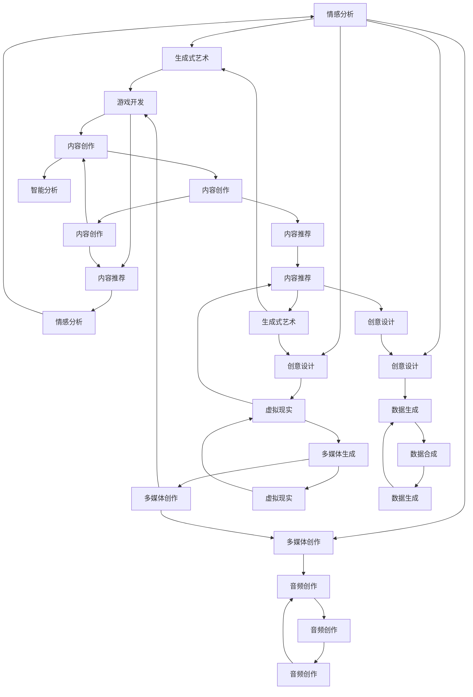
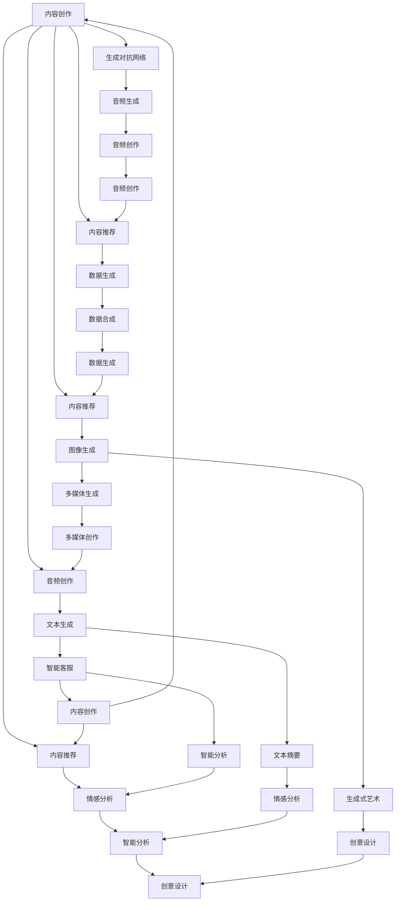
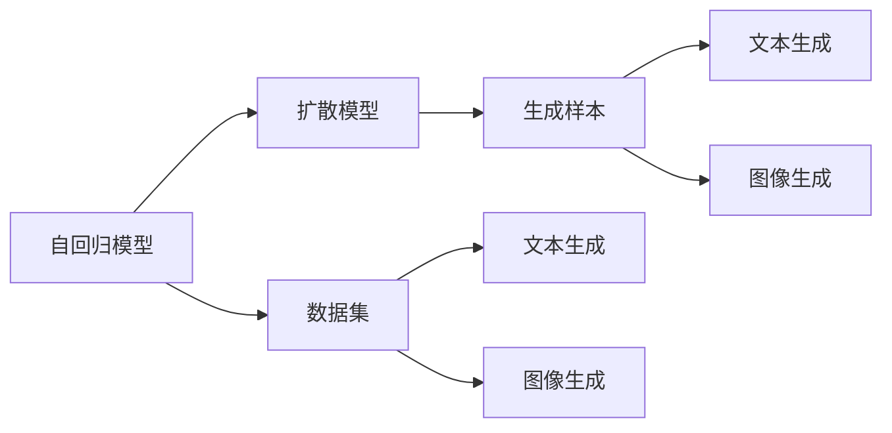
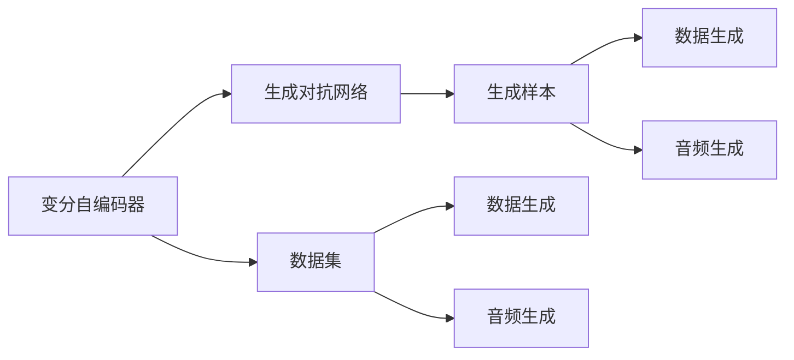
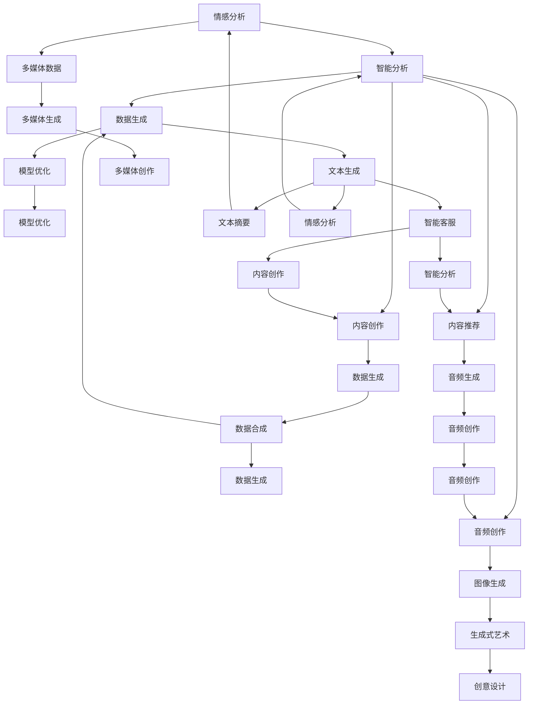

                 

# 生成式AIGC：从理论到实践的突破

> 关键词：生成式AIGC, 大模型, 条件生成, 自回归模型, 扩散模型, 变分自编码器, 生成对抗网络, 泛化能力, 优化算法, 长尾需求

## 1. 背景介绍

### 1.1 问题由来
近年来，随着深度学习技术的快速发展，生成式人工智能（Generative AI，简称AIGC）技术取得了显著进展，其中尤以生成式语言模型和大模型最为引人注目。这些模型能够通过学习大量的文本数据，生成高质量、风格多样、内容丰富的文本，广泛应用于内容创作、智能客服、翻译、文本摘要、情感分析等领域。

生成式AIGC技术主要依赖于以下几类模型：

- **自回归模型（Autoregressive Model）**：如GPT系列，通过预测下一个词的概率来生成文本。
- **扩散模型（Diffusion Model）**：如DALL-E，通过扩散过程模拟噪声的加入和去除，实现高质量的图像生成。
- **变分自编码器（Variational Autoencoder, VAE）**：通过学习数据的潜在表示，生成新的样本。
- **生成对抗网络（Generative Adversarial Network, GAN）**：通过两个网络的对抗训练，生成逼真的图像、音频、视频等。

这些模型已经证明，在生成式任务上具有出色的性能，但同时也面临着一些挑战，如计算资源消耗大、生成速度慢、训练难度高等。因此，在实际应用中，如何高效地使用这些模型，提升其泛化能力，满足长尾需求，成为当前研究的热点和难点。

### 1.2 问题核心关键点
生成式AIGC的核心在于如何利用深度学习模型生成高质量的样本。目前主流的做法包括：

- 选择适合的模型架构和优化算法。如自回归模型采用变分推断优化，扩散模型采用逆向扩散训练等。
- 设计有效的损失函数和评价指标。如交叉熵损失、KL散度、BLEU等，用于衡量生成样本的质量和多样性。
- 利用预训练模型和迁移学习。通过在特定任务上进行微调，利用预训练模型学习到的知识，提高生成效果。
- 应用数据增强和对抗样本。通过数据增强丰富训练数据，通过对抗样本训练提高模型鲁棒性。
- 设计合理的样本生成策略。如温度调参、束搜索、Top-K等，用于控制生成的多样性和准确性。

生成式AIGC技术在学术界和工业界已经取得了诸多突破，并在诸多应用场景中得到广泛应用。例如，使用生成式模型进行内容创作、文本生成、图像生成、音频生成等任务，使得智能客服、文本摘要、情感分析、图像生成等领域有了显著的提升。

### 1.3 问题研究意义
生成式AIGC技术的研究，对于拓展人工智能的应用范围，提升生成样本的质量和多样性，加速相关技术在产业界的落地应用，具有重要意义：

1. 降低开发成本。使用生成式模型可以大幅减少开发所需的数据、计算和人力等成本投入。
2. 提高生成质量。生成式模型能够生成高质量、风格多样的样本，显著提升生成任务的效果。
3. 加速应用开发。生成式模型可以提供多样化的生成方案，帮助开发者快速适配应用场景，缩短开发周期。
4. 带来技术创新。生成式模型催生了诸如生成对抗网络、扩散模型、变分自编码器等新技术和新方法，推动了人工智能技术的发展。
5. 赋能产业升级。生成式模型为各行业提供了更加智能化、高效的生成工具，促进了数字化转型。

## 2. 核心概念与联系

### 2.1 核心概念概述

为更好地理解生成式AIGC技术，本节将介绍几个密切相关的核心概念：

- **生成式AIGC（Generative AI for Creative Computing）**：通过深度学习模型生成高质量的文本、图像、音频等样本，广泛应用于内容创作、智能客服、翻译、文本摘要、情感分析等领域。

- **自回归模型（Autoregressive Model）**：如GPT系列，通过预测下一个词的概率来生成文本。其特点是每一步的条件概率只依赖于前面的词。

- **扩散模型（Diffusion Model）**：如DALL-E，通过扩散过程模拟噪声的加入和去除，实现高质量的图像生成。其特点是生成过程具有可逆性。

- **变分自编码器（Variational Autoencoder, VAE）**：通过学习数据的潜在表示，生成新的样本。其特点是生成过程具有可解释性。

- **生成对抗网络（Generative Adversarial Network, GAN）**：通过两个网络的对抗训练，生成逼真的图像、音频、视频等。其特点是生成样本具有高度逼真性。

- **长尾需求（Long-Tail Demand）**：在生成式任务中，一些不常见、小众的需求往往难以被传统的生成模型覆盖，需要通过创新模型和算法来满足。

这些核心概念之间的逻辑关系可以通过以下Mermaid流程图来展示：



这个流程图展示了大语言模型生成式任务的主要应用场景和核心技术。

### 2.2 概念间的关系

这些核心概念之间存在着紧密的联系，形成了生成式AIGC技术的完整生态系统。下面我们通过几个Mermaid流程图来展示这些概念之间的关系。

#### 2.2.1 生成式AIGC的基本原理



这个流程图展示了生成式AIGC的基本流程：首先收集大量无标签数据进行预训练，然后利用预训练模型作为生成式模型的基础，通过优化算法和损失函数进行训练，最终生成高质量的样本。

#### 2.2.2 自回归模型与扩散模型的关系



这个流程图展示了自回归模型和扩散模型的关系。自回归模型和扩散模型都是生成式模型，但扩散模型通过模拟噪声的加入和去除过程，生成更加高质量的图像样本。

#### 2.2.3 变分自编码器与生成对抗网络的关系



这个流程图展示了变分自编码器与生成对抗网络的关系。变分自编码器通过学习数据的潜在表示，生成新的样本；生成对抗网络通过两个网络的对抗训练，生成逼真的图像、音频等样本。

### 2.3 核心概念的整体架构

最后，我们用一个综合的流程图来展示这些核心概念在大模型生成式任务中的整体架构：



这个综合流程图展示了从预训练到生成式任务的完整过程。大模型首先在大规模文本数据上进行预训练，然后通过不同的生成式模型进行训练，最终生成高质量的样本。

## 3. 核心算法原理 & 具体操作步骤
### 3.1 算法原理概述

生成式AIGC技术主要依赖于生成模型和优化算法。其核心思想是通过训练生成模型，学习数据分布，然后通过优化算法，生成高质量的样本。

形式化地，假设生成模型为 $G_\theta$，其中 $\theta$ 为模型参数。给定数据集 $D$，生成式AIGC的目标是找到最优参数 $\hat{\theta}$，使得生成模型能够生成高质量的样本 $X$：

$$
\hat{\theta}=\mathop{\arg\min}_{\theta} \mathcal{L}(G_\theta,D)
$$

其中 $\mathcal{L}$ 为生成模型在数据集 $D$ 上的损失函数，用于衡量生成样本 $X$ 与真实样本 $Y$ 的差异。常见的损失函数包括交叉熵损失、KL散度等。

通过梯度下降等优化算法，生成模型不断更新模型参数 $\theta$，最小化损失函数 $\mathcal{L}$，使得生成样本逼近真实样本。由于 $\theta$ 已经通过预训练获得了较好的初始化，因此即便在数据量较少的情况下，也能较快收敛到理想的模型参数 $\hat{\theta}$。

### 3.2 算法步骤详解

生成式AIGC一般包括以下几个关键步骤：

**Step 1: 准备生成模型和数据集**
- 选择合适的生成模型架构（如自回归模型、扩散模型等）作为初始化参数，如 GPT系列、DALL-E等。
- 准备生成任务的数据集 $D$，划分为训练集、验证集和测试集。

**Step 2: 设置生成超参数**
- 选择合适的优化算法及其参数，如 Adam、SGD 等，设置学习率、批大小、迭代轮数等。
- 设置生成策略参数，如温度调参、束搜索、Top-K等。

**Step 3: 执行生成训练**
- 将训练集数据分批次输入模型，前向传播计算生成样本。
- 反向传播计算参数梯度，根据设定的优化算法和学习率更新模型参数。
- 周期性在验证集上评估模型性能，根据性能指标决定是否触发 Early Stopping。
- 重复上述步骤直到满足预设的迭代轮数或 Early Stopping 条件。

**Step 4: 测试和部署**
- 在测试集上评估生成模型 $G_{\hat{\theta}}$ 的性能，对比生成前后的效果。
- 使用生成模型对新样本进行生成，集成到实际的应用系统中。
- 持续收集新的数据，定期重新生成模型，以适应数据分布的变化。

以上是生成式AIGC的一般流程。在实际应用中，还需要针对具体任务的特点，对生成过程的各个环节进行优化设计，如改进生成目标函数，引入更多的正则化技术，搜索最优的超参数组合等，以进一步提升模型性能。

### 3.3 算法优缺点

生成式AIGC技术具有以下优点：
1. 灵活生成多样样本。通过生成模型，可以灵活生成各种风格、语义的文本、图像、音频等，满足不同用户的需求。
2. 易于扩展。使用预训练模型和迁移学习，可以在已有模型的基础上快速适配新任务，减少从头开发所需的时间和资源。
3. 高效优化。生成模型通过优化算法，可以快速迭代训练，生成高质量的样本。
4. 低标注需求。生成式任务通常不需要标注数据，只需原始数据即可进行训练，大大降低了数据收集和标注的成本。

同时，该技术也存在一定的局限性：
1. 生成质量依赖标注。虽然生成式任务不需要标注数据，但生成样本的质量很大程度上依赖于原始数据的质量。
2. 模型鲁棒性不足。生成模型面对噪声和干扰时，容易生成不合理或不自然的样本。
3. 计算资源消耗大。生成模型通常需要大量的计算资源，对硬件要求较高。
4. 生成结果缺乏可解释性。生成模型难以解释其内部工作机制和生成逻辑，难以进行调试和优化。

尽管存在这些局限性，但就目前而言，生成式AIGC技术仍是大模型应用的重要范式。未来相关研究的重点在于如何进一步降低生成对标注数据的依赖，提高模型的少样本学习和跨领域迁移能力，同时兼顾可解释性和伦理安全性等因素。

### 3.4 算法应用领域

生成式AIGC技术在NLP领域已经得到了广泛的应用，覆盖了几乎所有常见任务，例如：

- 文本生成：如自动写作、对话生成、摘要生成等。生成模型通过学习语言规律，生成符合语义和语法的文本。
- 图像生成：如图像艺术创作、图像生成、图像编辑等。生成模型通过模拟噪声过程，生成高质量的图像。
- 音频生成：如语音合成、音乐生成、声音效果生成等。生成模型通过学习音频信号，生成逼真的音频样本。
- 多媒体生成：如视频生成、多媒体内容创作等。生成模型通过融合文本、图像、音频等多种数据，生成丰富多样的多媒体内容。

除了上述这些经典任务外，生成式AIGC还被创新性地应用到更多场景中，如游戏开发、虚拟现实、教育培训等，为各行各业带来了全新的突破。随着预训练模型和生成算法的不断进步，相信生成式AIGC技术将在更广阔的应用领域大放异彩。

## 4. 数学模型和公式 & 详细讲解  
### 4.1 数学模型构建

本节将使用数学语言对生成式AIGC过程进行更加严格的刻画。

记生成模型为 $G_{\theta}$，其中 $\theta$ 为模型参数。假设生成任务的目标是生成高质量的文本，则模型 $G_{\theta}$ 在输入 $x$ 上的生成概率为 $p(x|G_{\theta})$。

定义模型 $G_{\theta}$ 在数据集 $D$ 上的经验风险为：

$$
\mathcal{L}(\theta) = -\frac{1}{N}\sum_{i=1}^N \log p(x_i|G_{\theta})
$$

其中 $x_i$ 为数据集中的样本，$N$ 为样本数量。

生成式AIGC的目标是最小化经验风险，即找到最优参数：

$$
\theta^* = \mathop{\arg\min}_{\theta} \mathcal{L}(\theta)
$$

在实践中，我们通常使用基于梯度的优化算法（如Adam、SGD等）来近似求解上述最优化问题。设 $\eta$ 为学习率，$\lambda$ 为正则化系数，则参数的更新公式为：

$$
\theta \leftarrow \theta - \eta \nabla_{\theta}\mathcal{L}(\theta) - \eta\lambda\theta
$$

其中 $\nabla_{\theta}\mathcal{L}(\theta)$ 为损失函数对参数 $\theta$ 的梯度，可通过反向传播算法高效计算。

### 4.2 公式推导过程

以下我们以文本生成任务为例，推导自回归模型的生成概率和交叉熵损失函数的计算公式。

假设生成模型 $G_{\theta}$ 在输入 $x$ 上的输出为 $y = G_{\theta}(x)$，表示生成文本的概率。训练集为 $D=\{(x_i, y_i)\}_{i=1}^N, x_i \in \mathcal{X}, y_i \in \mathcal{Y}$。其中 $\mathcal{X}$ 为输入空间，$\mathcal{Y}$ 为输出空间。

定义模型 $G_{\theta}$ 在数据集 $D$ 上的经验风险为：

$$
\mathcal{L}(\theta) = -\frac{1}{N}\sum_{i=1}^N \log p(y_i|G_{\theta}(x_i))
$$

其中 $y_i$ 为数据集中的样本，$N$ 为样本数量。

根据链式法则，损失函数对参数 $\theta_k$ 的梯度为：

$$
\frac{\partial \mathcal{L}(\theta)}{\partial \theta_k} = -\frac{1}{N}\sum_{i=1}^N \frac{p(y_i|G_{\theta}(x_i))}{G_{\theta}(x_i)} \frac{\partial G_{\theta}(x_i)}{\partial \theta_k}
$$

其中 $\frac{p(y_i|G_{\theta}(x_i))}{G_{\theta}(x_i)}$ 为条件概率的对数，$\frac{\partial G_{\theta}(x_i)}{\partial \theta_k}$ 可进一步递归展开，利用自动微分技术完成计算。

在得到损失函数的梯度后，即可带入参数更新公式，完成模型的迭代优化。重复上述过程直至收敛，最终得到适应生成任务的最优模型参数 $\theta^*$。

## 5. 项目实践：代码实例和详细解释说明
### 5.1 开发环境搭建

在进行生成式AIGC实践前，我们需要准备好开发环境。以下是使用Python进行PyTorch开发的环境配置流程：

1. 安装Anaconda：从官网下载并安装Anaconda，用于创建独立的Python环境。

2. 创建并激活虚拟环境：
```bash
conda create -n pytorch-env python=3.8 
conda activate pytorch-env
```

3. 安装PyTorch：根据CUDA版本，从官网获取对应的安装命令。例如：
```bash
conda install pytorch torchvision torchaudio cudatoolkit=11.1 -c pytorch -c conda-forge
```

4. 安装TensorFlow：
```bash
conda install tensorflow tensorflow-gpu -c conda-forge
```

5. 安装TensorBoard：
```bash
pip install tensorboard
```

6. 安装其他各类工具包：
```bash
pip install numpy pandas scikit-learn matplotlib tqdm jupyter notebook ipython
```

完成上述步骤后，即可在`pytorch-env`环境中开始生成式AIGC实践。

### 5.2 源代码详细实现

这里我们以自回归模型（如GPT-3）的文本生成任务为例，给出使用PyTorch和Transformers库进行微调的PyTorch代码实现。

首先，定义文本生成任务的数据处理函数：

```python
from transformers import GPT2Tokenizer
from torch.utils.data import Dataset
import torch

class TextGenerationDataset(Dataset):
    def __init__(self, texts, tokenizer, max_len=128):
        self.texts = texts
        self.tokenizer = tokenizer
        self.max_len = max_len
        
    def __len__(self):
        return len(self.texts)
    
    def __getitem__(self, item):
        text = self.texts[item]
        
        encoding = self.tokenizer(text, return_tensors='pt', max_length=self.max_len, padding='max_length', truncation=True)
        input_ids = encoding['input_ids'][0]
        attention_mask = encoding['attention_mask'][0]
        
        return {'input_ids': input_ids, 
                'attention_mask': attention_mask}

# 创建dataset
tokenizer = GPT2Tokenizer.from_pretrained('gpt2')

train_dataset = TextGenerationDataset(train_texts, tokenizer)
dev_dataset = TextGenerationDataset(dev_texts, tokenizer)
test_dataset = TextGenerationDataset(test_texts, tokenizer)
```

然后，定义模型和优化器：

```python
from transformers import GPT2LMHeadModel, AdamW

model = GPT2LMHeadModel.from_pretrained('gpt2')

optimizer = AdamW(model.parameters(), lr=2e-5)
```

接着，定义训练和评估函数：

```python
from torch.utils.data import DataLoader
from tqdm import tqdm
from sklearn.metrics import bleu_score

device = torch.device('cuda') if torch.cuda.is_available() else torch.device('cpu')
model.to(device)

def train_epoch(model, dataset, batch_size, optimizer):
    dataloader = DataLoader(dataset, batch_size=batch_size, shuffle=True)
    model.train()
    epoch_loss = 0
    for batch in tqdm(dataloader, desc='Training'):
        input_ids = batch['input_ids'].to(device)
        attention_mask = batch['attention_mask'].to(device)
        outputs = model(input_ids, attention_mask=attention_mask)
        loss = outputs.loss
        epoch_loss += loss.item()
        loss.backward()
        optimizer.step()
    return epoch_loss / len(dataloader)

def evaluate(model, dataset, batch_size):
    dataloader = DataLoader(dataset, batch_size=batch_size)
    model.eval()
    preds, labels = [], []
    with torch.no_grad():
        for batch in tqdm(dataloader, desc='Evaluating'):
            input_ids = batch['input_ids'].to(device)
            attention_mask = batch['attention_mask'].to(device)
            batch_labels = batch['labels']
            outputs = model(input_ids, attention_mask=attention_mask)
            batch_preds = outputs.logits.argmax(dim=2).to('cpu').tolist()
            batch_labels = batch_labels.to('cpu').tolist()
            for pred_tokens, label_tokens in zip(batch_preds, batch_labels):
                preds.append(pred_tokens[:len(label_tokens)])
                labels.append(label_tokens)
                
    print(f"BLEU-1 score: {bleu_score(preds, labels, normalize=True):.3f}")
    print(f"BLEU-2 score: {bleu_score(preds, labels, stats='bleu', normalize=True):.3f}")
    print(f"BLEU-3 score: {bleu_score(preds, labels, stats='bleu', normalize=True):.3f}")
    print(f"BLEU-4 score: {bleu_score(preds, labels, stats='bleu', normalize=True):.3f}")

def generate(model, input_tokens, max_len=128, num_return_sequences=1):
    model.eval()
    tokenizer = GPT2Tokenizer.from_pretrained('gpt2')
    input_ids = torch.tensor([tokenizer.encode(input_tokens, add_special_tokens=True)]).to(device)
    attention_mask = input_ids.new_ones(input_ids.shape).to(device)
    outputs = model.generate(input_ids, max_length=max_len, num_return_sequences=num_return_sequences, do_sample=True, top_k=50, top_p=1.0, temperature=1.0)
    return [tokenizer.decode(output, skip_special_tokens=True) for output in outputs]
```

最后，启动训练流程并在测试集上评估：

```python
epochs = 5
batch_size = 16

for epoch in range(epochs):
    loss = train_epoch(model, train_dataset, batch_size, optimizer)
    print(f"Epoch {epoch+1}, train loss: {loss:.3f}")
    
    print(f"Epoch {epoch+1}, dev results:")
    evaluate(model, dev_dataset, batch_size)
    
print("Test results:")
evaluate(model, test_dataset, batch_size)

print("Generate sample text:")
print(generate(model, "A bear is walking through the forest"))
```

以上就是使用PyTorch和Transformers库对GPT-3进行文本生成任务微调的完整代码实现。可以看到，得益于Transformers库的强大封装，我们可以用相对简洁

