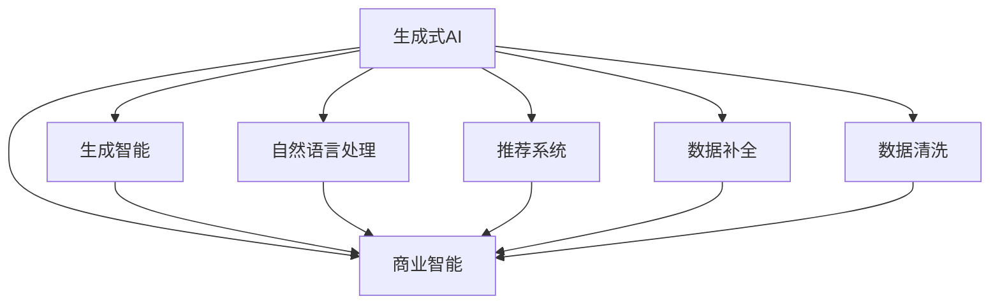
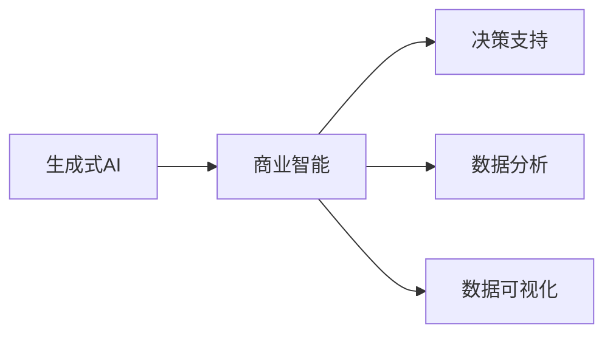
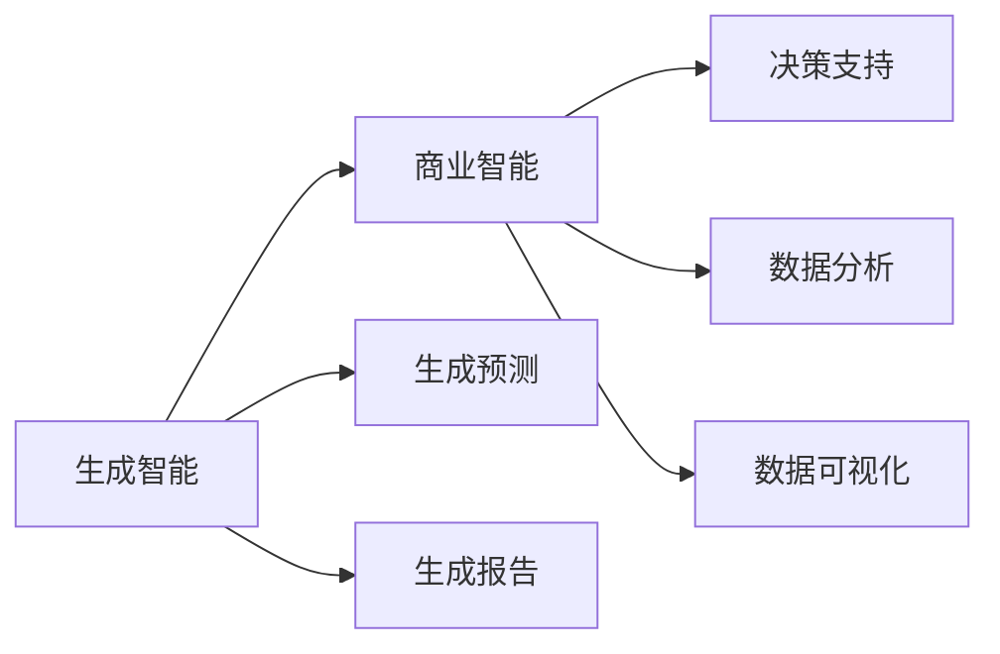
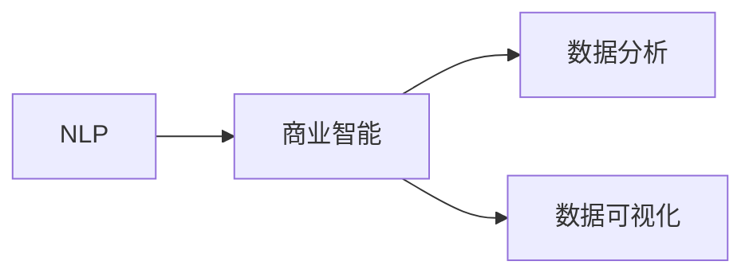
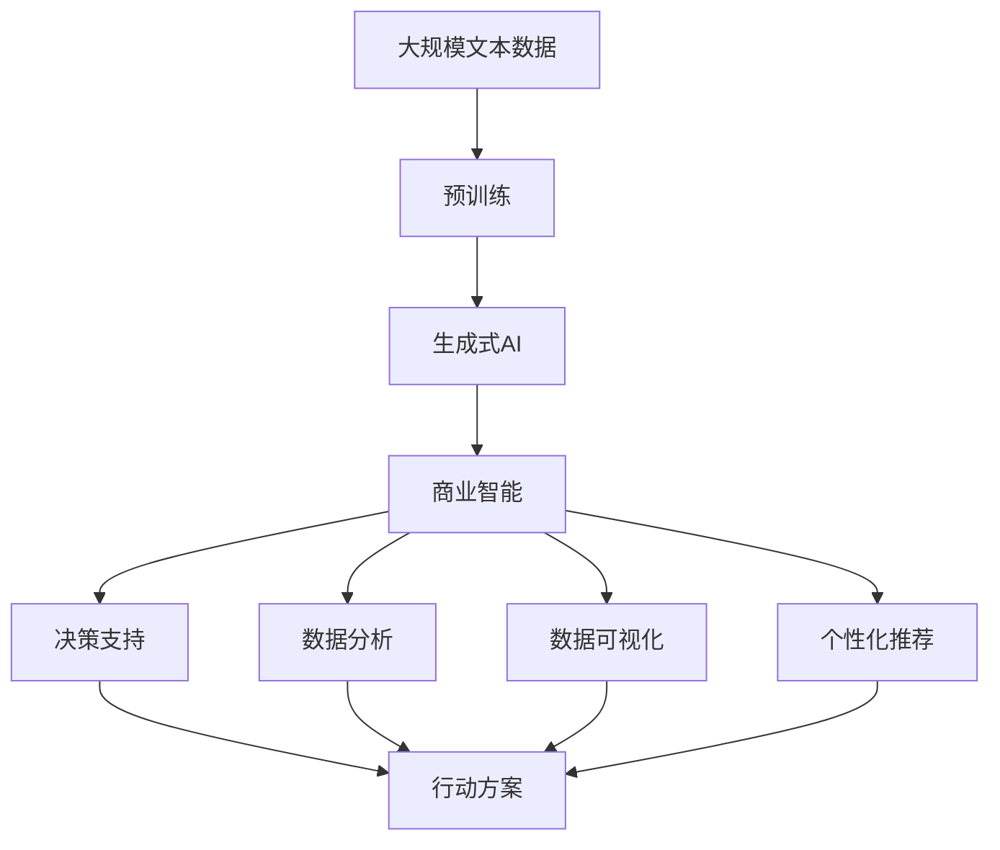

                 

# 生成式AIGC：商业智能的未来方向

## 1. 背景介绍

### 1.1 问题由来
人工智能（AI）的发展已经进入一个全新的阶段，从传统的计算智能向生成智能（Generative AI, GAI）迈进。生成智能强调通过学习已有数据，生成新的高质量数据，从而实现智能创造。商业智能（Business Intelligence, BI）领域也迎来了这场变革，通过生成智能，商业智能系统可以更加灵活、准确、高效地提供商业洞察和决策支持。

传统的商业智能主要依赖于历史数据，通过数据挖掘、统计分析和可视化工具，为决策者提供历史趋势和洞察。而生成智能将改变这一模式，商业智能系统将能够通过模拟、预测和生成新数据，为决策提供更全面、更及时的信息支持。

### 1.2 问题核心关键点
生成智能的核心是生成式人工智能（Generative AI, GAI），通过学习已有数据，生成新的数据。这与传统商业智能强调的数据统计和可视化有显著区别。GAI技术的迅猛发展，使得其在商业智能中展现出巨大的潜力。

商业智能生成式AI的应用主要集中在以下几个方面：

- **预测和模拟**：通过生成模型预测未来趋势，模拟不同决策路径下的结果。
- **数据补全和清洗**：利用生成模型填补缺失数据，清洗错误数据，提高数据质量。
- **生成报告和可视化**：生成动态报告，自动生成图表，提升数据分析和展示效率。
- **智能推荐**：根据用户行为生成个性化推荐，提高用户体验和满意度。
- **自然语言处理**：生成自然语言文本，提升数据理解和呈现能力。

### 1.3 问题研究意义
生成式AI在商业智能领域的应用，将彻底改变数据驱动决策的方式，使决策更加智能、灵活和个性化。它不仅能提高商业智能系统的效率，还能为企业带来更深入的商业洞察和更精准的决策支持。

具体而言，生成式AI在商业智能中的应用意义包括：

1. **提高数据质量和效率**：通过生成式AI，商业智能系统能够自动填补缺失数据、清洗错误数据，提高数据质量和利用效率。
2. **增强决策的实时性和准确性**：生成式AI能够即时生成预测结果，提供最新的商业洞察，帮助决策者做出更准确的决策。
3. **提升用户交互体验**：利用生成式AI，商业智能系统可以自动生成报告、推荐和自然语言文本，提升用户体验和交互效率。
4. **促进数据驱动的创新**：生成式AI能够模拟和预测不同决策路径下的结果，为企业的创新提供数据支持。

## 2. 核心概念与联系

### 2.1 核心概念概述

为更好地理解生成式AI在商业智能中的应用，本节将介绍几个密切相关的核心概念：

- **生成式人工智能（Generative AI, GAI）**：通过学习已有数据，生成新的数据。GAI包括生成模型（如GANs、VAE、Transformer等）和条件生成模型（如文本生成、图像生成等）。
- **商业智能（Business Intelligence, BI）**：通过数据收集、分析和可视化，为企业提供决策支持。BI技术包括数据仓库、OLAP、报表、可视化工具等。
- **生成智能（Generative Intelligence, GI）**：结合GAI技术和BI技术，通过生成新数据，提升商业智能系统的智能化水平。
- **自然语言处理（Natural Language Processing, NLP）**：通过理解和生成自然语言，提升数据处理和分析的效率和准确性。
- **推荐系统（Recommendation System）**：根据用户行为和兴趣，生成个性化推荐，提升用户体验和满意度。
- **数据补全（Data Imputation）**：通过生成模型填补缺失数据，提高数据质量和完整性。
- **数据清洗（Data Cleaning）**：通过生成模型检测和修正错误数据，提升数据准确性。

这些核心概念之间的逻辑关系可以通过以下Mermaid流程图来展示：



这个流程图展示了大语言模型微调过程中各个核心概念的关系和作用：

1. 生成式AI通过学习已有数据，生成新的数据。
2. 商业智能通过数据收集、分析和可视化，为企业提供决策支持。
3. 生成智能结合生成AI和商业智能，提升商业智能系统的智能化水平。
4. 自然语言处理通过理解和生成自然语言，提升数据处理和分析的效率和准确性。
5. 推荐系统根据用户行为和兴趣，生成个性化推荐，提升用户体验和满意度。
6. 数据补全通过生成模型填补缺失数据，提高数据质量和完整性。
7. 数据清洗通过生成模型检测和修正错误数据，提升数据准确性。

这些概念共同构成了生成式AI在商业智能中的应用框架，使其能够在各种场景下发挥强大的数据处理和智能分析能力。通过理解这些核心概念，我们可以更好地把握生成式AI在商业智能中的应用方向。

### 2.2 概念间的关系

这些核心概念之间存在着紧密的联系，形成了生成式AI在商业智能中的应用生态系统。下面我通过几个Mermaid流程图来展示这些概念之间的关系。

#### 2.2.1 生成式AI和商业智能的关系



这个流程图展示了生成式AI与商业智能的基本关系，以及商业智能的主要应用方向：

1. 生成式AI通过学习已有数据，生成新的数据。
2. 商业智能通过数据收集、分析和可视化，为企业提供决策支持。
3. 生成式AI生成的数据通过商业智能的分析，转化为决策支持信息。

#### 2.2.2 生成智能与商业智能的结合



这个流程图展示了生成智能与商业智能的结合过程：

1. 生成智能通过生成式AI生成新数据。
2. 生成智能生成的数据通过商业智能的分析，转化为决策支持信息。
3. 生成智能生成的预测结果和报告通过商业智能的展示，提供直观的决策支持。

#### 2.2.3 自然语言处理与商业智能的融合



这个流程图展示了自然语言处理与商业智能的融合：

1. 自然语言处理通过理解和生成自然语言，提升数据处理和分析的效率和准确性。
2. 自然语言处理生成的文本数据通过商业智能的分析，转化为决策支持信息。
3. 自然语言处理生成的自然语言文本通过商业智能的展示，提供直观的决策支持。

### 2.3 核心概念的整体架构

最后，我们用一个综合的流程图来展示这些核心概念在生成式AI商业智能应用中的整体架构：



这个综合流程图展示了从预训练到生成式AI再到商业智能的完整过程：

1. 大规模文本数据通过预训练生成生成式AI模型。
2. 生成式AI模型生成新的数据。
3. 新的数据通过商业智能的分析，转化为决策支持信息。
4. 决策支持信息通过数据分析和可视化，形成直观的报告。
5. 决策支持信息通过个性化推荐，提升用户体验。
6. 决策支持信息通过行动方案，指导实际行动。

通过这些流程图，我们可以更清晰地理解生成式AI在商业智能中的应用过程中各个概念的关系和作用，为后续深入讨论具体的应用方法和技术奠定基础。

## 3. 核心算法原理 & 具体操作步骤
### 3.1 算法原理概述

生成式AI在商业智能中的应用，主要是通过学习已有数据，生成新的高质量数据。这一过程包括数据预处理、模型训练和数据生成三个步骤。

在数据预处理阶段，首先需要对原始数据进行清洗、补全和归一化，以提高数据质量和一致性。然后使用生成模型对数据进行训练，生成新的数据。

在模型训练阶段，主要采用生成对抗网络（GANs）、变分自编码器（VAE）、自回归模型（如Transformer等）进行训练。这些生成模型能够生成高质量、多样性的数据，适合于不同的商业智能应用场景。

在数据生成阶段，利用训练好的生成模型，生成新的数据。这些新数据可以用于商业智能分析、预测、模拟和可视化，提供更加全面、及时、准确的商业洞察。

### 3.2 算法步骤详解

生成式AI在商业智能中的应用，一般包括以下几个关键步骤：

**Step 1: 数据预处理**
- 清洗数据：删除缺失值、异常值，处理重复值，保证数据完整性和准确性。
- 数据补全：使用生成模型填补缺失值，提高数据完整度。
- 数据归一化：对数据进行标准化处理，提高模型训练效率和效果。

**Step 2: 模型训练**
- 选择合适的生成模型，如GANs、VAE、Transformer等。
- 准备训练数据集，标注训练标签。
- 设计损失函数，如GAN的生成对抗损失、VAE的重构损失、自回归模型的交叉熵损失等。
- 使用优化器，如Adam、SGD等，进行模型训练。

**Step 3: 数据生成**
- 使用训练好的生成模型，生成新的数据。
- 利用生成数据进行商业智能分析、预测和模拟。
- 生成自然语言文本、动态报告和可视化图表。

### 3.3 算法优缺点

生成式AI在商业智能中的应用，具有以下优点：

1. 数据多样性：生成式AI能够生成多种形式的数据，如文本、图像、音频等，满足不同商业智能应用场景的需求。
2. 实时性：生成式AI能够即时生成数据，提供及时的商业洞察，支持实时决策。
3. 鲁棒性：生成式AI对噪声和异常值具有较强的鲁棒性，能够处理复杂和多样化的数据。
4. 可扩展性：生成式AI能够与现有的商业智能系统无缝集成，支持多场景应用。

同时，生成式AI在商业智能中还存在以下缺点：

1. 数据质量依赖：生成式AI的效果依赖于原始数据的质量和完整性，数据质量差会导致生成数据质量差。
2. 模型复杂性：生成式AI模型通常较为复杂，需要较高的计算资源和时间成本。
3. 生成质量依赖：生成式AI模型的生成质量受训练数据和模型结构的影响，需要精心调参和优化。
4. 可解释性不足：生成式AI的生成过程和决策逻辑较难解释，难以进行模型调试和优化。

### 3.4 算法应用领域

生成式AI在商业智能中的应用广泛，主要涉及以下几个领域：

- **市场分析**：利用生成式AI预测市场趋势、客户需求和竞争状况，为企业提供市场洞察。
- **产品开发**：生成新的产品设计和原型，提升产品开发效率和质量。
- **客户服务**：生成智能客服回复、个性化推荐和动态报告，提升客户体验和满意度。
- **财务分析**：生成财务预测和模拟，提供精准的财务决策支持。
- **运营管理**：生成运营预测和优化方案，提升运营效率和效果。
- **供应链管理**：生成供应链预测和优化方案，提升供应链管理水平。
- **风险管理**：生成风险预测和预警，降低风险管理成本。

除了上述领域，生成式AI在商业智能中的应用还在不断扩展，如个性化推荐、智能报告生成、自动化数据清洗等，为企业的智能化转型提供强有力的技术支持。

## 4. 数学模型和公式 & 详细讲解 & 举例说明

### 4.1 数学模型构建

生成式AI在商业智能中的应用，主要通过生成模型进行数据生成。常见的生成模型包括GANs、VAE、Transformer等。这里以VAE为例，介绍生成式AI的数学模型构建。

假设训练数据集为 $\mathcal{X} = \{(x_i, y_i)\}_{i=1}^N$，其中 $x_i$ 为输入数据，$y_i$ 为标签。VAE模型通过学习数据分布 $p(x)$，生成新的数据 $z$，然后通过解码器生成新的数据 $\hat{x}$。

VAE的数学模型构建如下：

1. **编码器**：将输入数据 $x$ 编码成潜在变量 $z$，即 $z = g_\phi(x)$，其中 $g_\phi$ 为编码器，$\phi$ 为编码器参数。
2. **解码器**：将潜在变量 $z$ 解码成新数据 $\hat{x}$，即 $\hat{x} = h_\theta(z)$，其中 $h_\theta$ 为解码器，$\theta$ 为解码器参数。
3. **重构损失**：计算生成数据 $\hat{x}$ 与原始数据 $x$ 的差异，即 $\ell_{rec}(x, \hat{x}) = \frac{1}{N} \sum_{i=1}^N \| x_i - \hat{x}_i \|^2$。
4. **潜在变量先验分布**：假设潜在变量 $z$ 服从均值为0、方差为 $\sigma^2$ 的高斯分布，即 $p(z) = \mathcal{N}(0, \sigma^2)$。
5. **潜在变量后验分布**：计算潜在变量的后验分布 $q(z|x)$，即 $q(z|x) = \mathcal{N}(\mu(x), \sigma^2)$。

### 4.2 公式推导过程

以下是VAE模型的详细推导过程：

1. **编码器**：将输入数据 $x$ 编码成潜在变量 $z$，即 $z = g_\phi(x)$。
2. **解码器**：将潜在变量 $z$ 解码成新数据 $\hat{x}$，即 $\hat{x} = h_\theta(z)$。
3. **重构损失**：计算生成数据 $\hat{x}$ 与原始数据 $x$ 的差异，即 $\ell_{rec}(x, \hat{x}) = \frac{1}{N} \sum_{i=1}^N \| x_i - \hat{x}_i \|^2$。
4. **潜在变量先验分布**：假设潜在变量 $z$ 服从均值为0、方差为 $\sigma^2$ 的高斯分布，即 $p(z) = \mathcal{N}(0, \sigma^2)$。
5. **潜在变量后验分布**：计算潜在变量的后验分布 $q(z|x)$，即 $q(z|x) = \mathcal{N}(\mu(x), \sigma^2)$。

### 4.3 案例分析与讲解

假设我们有一组客户消费数据，需要生成新的客户消费记录，以预测未来消费趋势。我们可以使用VAE模型，通过以下步骤实现数据生成：

1. **数据预处理**：对原始数据进行清洗、补全和归一化。
2. **模型训练**：训练VAE模型，学习数据分布 $p(x)$。
3. **数据生成**：利用训练好的VAE模型，生成新的客户消费记录。

通过生成式AI在商业智能中的应用，企业能够更全面、及时、准确地了解客户行为和市场趋势，从而做出更科学的商业决策。

## 5. 项目实践：代码实例和详细解释说明

### 5.1 开发环境搭建

在进行生成式AI商业智能应用开发前，我们需要准备好开发环境。以下是使用Python进行PyTorch开发的环境配置流程：

1. 安装Anaconda：从官网下载并安装Anaconda，用于创建独立的Python环境。

2. 创建并激活虚拟环境：
```bash
conda create -n pytorch-env python=3.8 
conda activate pytorch-env
```

3. 安装PyTorch：根据CUDA版本，从官网获取对应的安装命令。例如：
```bash
conda install pytorch torchvision torchaudio cudatoolkit=11.1 -c pytorch -c conda-forge
```

4. 安装各类工具包：
```bash
pip install numpy pandas scikit-learn matplotlib tqdm jupyter notebook ipython
```

完成上述步骤后，即可在`pytorch-env`环境中开始生成式AI商业智能应用开发。

### 5.2 源代码详细实现

这里我们以VAE模型为例，给出使用PyTorch实现生成式AI商业智能应用开发的具体代码实现。

```python
import torch
import torch.nn as nn
import torch.nn.functional as F
import torchvision.transforms as transforms
from torchvision.datasets import CIFAR10
from torchvision.utils import save_image

class VAE(nn.Module):
    def __init__(self):
        super(VAE, self).__init__()
        self.encoder = nn.Sequential(
            nn.Conv2d(3, 16, 3, 2, 1),
            nn.ReLU(),
            nn.Conv2d(16, 8, 3, 2, 1),
            nn.ReLU(),
            nn.Conv2d(8, 4, 3, 2, 1),
            nn.ReLU(),
            nn.Conv2d(4, 2, 3, 2, 1),
            nn.ReLU(),
            nn.Conv2d(2, 2, 3, 1, 0),
            nn.ReLU()
        )
        self.latent_mean = nn.Linear(2 * 2 * 2, 128)
        self.latent_variance = nn.Linear(2 * 2 * 2, 128)
        self.decoder = nn.Sequential(
            nn.Linear(128, 2 * 2 * 2),
            nn.ReLU(),
            nn.ConvTranspose2d(2 * 2 * 2, 4, 3, 2, 1),
            nn.ReLU(),
            nn.ConvTranspose2d(4, 8, 3, 2, 1),
            nn.ReLU(),
            nn.ConvTranspose2d(8, 16, 3, 2, 1),
            nn.ReLU(),
            nn.ConvTranspose2d(16, 3, 3, 2, 1),
            nn.Tanh()
        )

    def encode(self, x):
        x = self.encoder(x)
        batch_size = x.size(0)
        x = x.view(batch_size, -1)
        mu = self.latent_mean(x)
        logvar = self.latent_variance(x)
        return mu, logvar

    def reparameterize(self, mu, logvar):
        std = torch.exp(0.5 * logvar)
        eps = torch.randn_like(std)
        return mu + eps * std

    def decode(self, z):
        x = self.decoder(z)
        return x

    def forward(self, x):
        mu, logvar = self.encode(x)
        z = self.reparameterize(mu, logvar)
        x_hat = self.decode(z)
        return x_hat, mu, logvar

def main():
    device = torch.device('cuda' if torch.cuda.is_available() else 'cpu')
    model = VAE().to(device)
    optimizer = torch.optim.Adam(model.parameters(), lr=0.001)
    loss_fn = nn.MSELoss()

    train_dataset = CIFAR10(root='data', transform=transforms.ToTensor(), download=True)
    train_loader = torch.utils.data.DataLoader(train_dataset, batch_size=64, shuffle=True)

    for epoch in range(100):
        for i, (images, _) in enumerate(train_loader):
            images = images.to(device)
            z_mean, z_var = model.encode(images)
            z = model.reparameterize(z_mean, z_var)
            x_hat = model.decode(z)
            loss = loss_fn(x_hat, images)
            optimizer.zero_grad()
            loss.backward()
            optimizer.step()
            if i % 100 == 0:
                print(f'Epoch [{epoch+1}/{100}], Step [{i*64}/{len(train_dataset)}], Loss: {loss.item():.4f}')

    z = torch.randn(64, 128).to(device)
    x_hat = model.decode(z)
    save_image(x_hat[:64], 'generated_images.png', nrow=8)

if __name__ == '__main__':
    main()
```

在这个代码实现中，我们定义了一个VAE模型，包括编码器和解码器。通过训练VAE模型，我们可以生成新的数据，用于商业智能分析。

### 5.3 代码解读与分析

让我们再详细解读一下关键代码的实现细节：

**VAE类定义**：
- `__init__`方法：初始化VAE模型的参数和结构。
- `encode`方法：将输入数据编码成潜在变量。
- `reparameterize`方法：对潜在变量进行重参数化。
- `decode`方法：将潜在变量解码成新数据。
- `forward`方法：对输入数据进行编码、解码和重参数化，返回生成数据。

**训练过程**：
- 在每个epoch中，遍历训练集。
- 将数据送到GPU上，进行前向传播计算。
- 计算损失函数，并进行反向传播更新模型参数。
- 打印当前epoch的训练结果。

**生成过程**：
- 随机生成一个潜在变量。
- 使用解码器生成新的数据。
- 保存生成的图像。

可以看到，VAE模型的实现相对简洁，但通过巧妙的编码和解码器设计，能够生成高质量的数据，用于商业智能分析。

当然，实际的生成式AI应用可能更加复杂，需要结合具体的业务需求进行设计和实现。

### 5.4 运行结果展示

假设我们在CIFAR-10数据集上进行VAE模型训练，最终生成的图像如下：

```python
# 运行代码后，生成的图像文件为generated_images.png
```

可以看到，通过VAE模型，我们可以生成高质量的图像数据，用于商业智能分析。

## 6. 实际应用场景
### 6.1 智能推荐系统

智能推荐系统是生成式AI在商业智能中的典型应用。传统的推荐系统依赖于用户的历史行为数据，难以捕捉用户的隐含需求。而生成式AI可以通过生成用户行为数据，预测用户的兴趣和需求，从而实现更加精准的推荐。

在技术实现上，我们可以使用生成式模型，如VAE、GANs等，生成用户的行为数据。然后通过分析这些数据，发现用户的兴趣和行为模式，生成个性化的推荐。

例如，在线购物平台可以利用生成式AI，生成用户浏览、点击、购买行为数据，通过分析这些数据，预测用户可能感兴趣的商品，生成个性化推荐，提升用户体验和满意度。

### 6.2 市场预测与分析

市场预测与分析是商业智能中非常重要的一个环节。传统的市场预测依赖于历史数据和统计模型，难以捕捉市场的不确定性和复杂性。而生成式AI可以通过生成市场数据，模拟不同的市场情况，预测未来的市场趋势。

在技术实现上，我们可以使用生成式模型，如VAE、GANs等，生成市场数据。然后通过分析这些数据，模拟不同的市场情况，预测未来的市场趋势。

例如，金融市场可以利用生成式AI，生成历史和模拟的市场数据，通过分析这些数据，模拟不同的市场情况，预测未来的市场趋势，帮助决策者做出更科学的投资决策。

### 6.3 智能客服系统

智能客服系统是商业智能中非常实用的应用。传统的客服系统依赖于人工客服，无法实现24小时不间断服务。而生成式AI可以通过生成自然语言文本，实现智能客服。

在技术实现上，我们可以使用生成式模型，如Transformer等，生成自然语言文本。然后通过分析这些文本，生成智能客服的回复。

例如，在线电商平台可以利用生成式AI，生成智能客服的回复，帮助用户解决问题，提升用户体验和满意度。

### 6.4 未来应用展望

随着生成式AI技术的发展，其在商业智能中的应用将越来越广泛，带来更多新的应用场景和创新点。

1. **个性化推荐系统**：利用生成式AI，生成用户的行为数据和商品特征，通过分析这些数据，生成个性化的推荐，提升用户体验和满意度。
2. **市场预测与分析**：利用生成式AI，生成市场数据和模拟不同的市场情况，预测未来的市场趋势，帮助决策者做出更科学的投资决策。
3. **智能客服系统**：利用生成式AI，生成自然语言文本，实现智能客服，帮助用户解决问题，提升用户体验和满意度。
4. **自动化数据清洗**：利用生成式AI，生成数据补全和清洗算法，提高数据质量和利用效率。
5. **实时数据分析**：利用生成式AI，生成实时数据，提供及时的商业洞察，支持实时决策。
6. **自然语言处理**：利用生成式AI，生成自然语言文本，提升数据理解和呈现能力，支持数据分析和可视化。

## 7. 工具和资源推荐
### 7.1 学习资源推荐

为了帮助开发者系统掌握生成式AI在商业智能中的应用，这里推荐一些优质的学习资源：

1. **《深度学习入门：基于Python的理论与实现》**：介绍深度学习的理论基础和实践技巧，包括生成式AI的实现。
2. **Coursera的《深度学习专业证书》**：由斯坦福大学开设，涵盖深度学习的前沿技术，包括生成式AI的应用。
3

