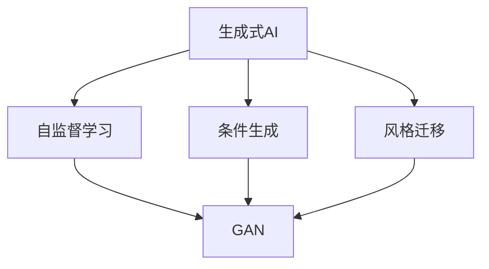
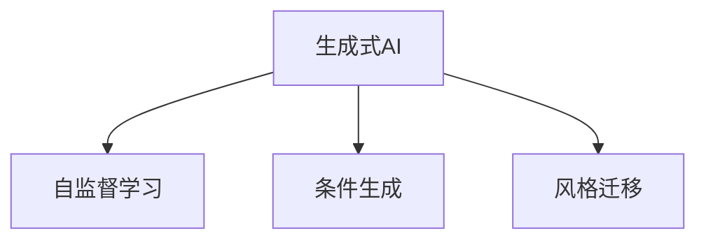
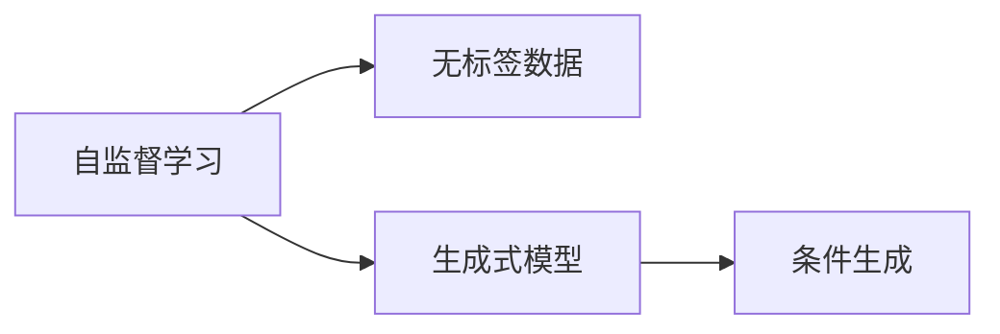
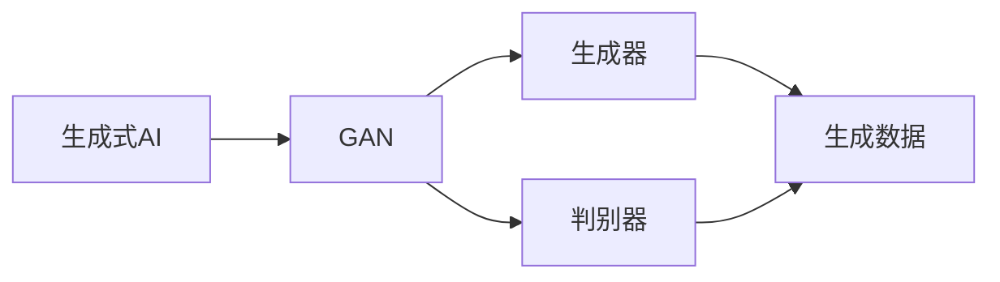
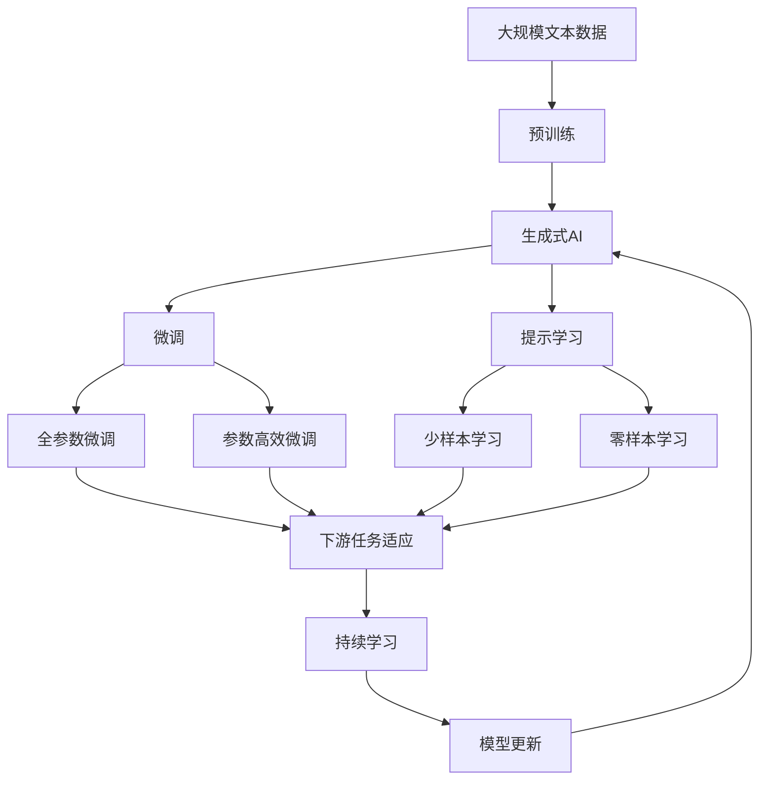

                 

# 生成式AIGC：推动商业智能的新技术

## 1. 背景介绍

随着人工智能技术的不断发展和普及，生成式人工智能（Generative AI，简称AIGC）正在逐渐成为各行各业转型升级的新引擎。AIGC技术以深度学习为基础，能够通过自主学习生成高质量的文本、图像、音频等内容，为商业智能（Business Intelligence，简称BI）提供了强大的数据生成和增强能力。

### 1.1 问题由来

传统的商业智能主要依赖于数据收集和分析，通过BI工具帮助企业做出决策。然而，随着数据量的爆炸式增长，传统的数据分析方法已经无法满足企业和用户的复杂需求。

AIGC技术通过生成式学习，能够在数据稀缺或难以获取的领域中生成高质量的数据，为商业智能提供了更丰富、更真实的数据源。同时，AIGC能够自动生成文本、图像、音频等多模态内容，使得BI工具能够更好地处理和展示数据。

### 1.2 问题核心关键点

AIGC技术的核心在于通过深度学习模型生成与现实世界相似的数据。具体来说，AIGC能够通过以下方式实现：

1. **自监督学习**：在无标签数据上训练生成模型，使其能够自动生成高质量的数据。
2. **条件生成**：利用条件信息，如文本、图像、音频等，生成符合特定条件的数据。
3. **风格迁移**：将一种风格的数据转换为另一种风格的数据。

AIGC技术在商业智能中的应用，主要包括数据增强、自动生成报告、自动化文档编写等方面。

### 1.3 问题研究意义

AIGC技术在商业智能中的应用，可以显著提升企业的数据分析和决策能力。具体来说，其研究意义在于：

1. **提升数据质量**：AIGC能够生成高质量的数据，弥补数据收集的不足。
2. **减少数据依赖**：在数据获取困难的领域，AIGC可以自动生成数据，降低对数据依赖。
3. **增强分析能力**：AIGC生成的数据更加丰富、真实，有助于更深入的分析。
4. **提高决策效率**：AIGC可以自动生成报告和文档，减少人工编写的工作量，提高决策效率。

## 2. 核心概念与联系

### 2.1 核心概念概述

为了更好地理解AIGC技术在商业智能中的应用，本节将介绍几个关键概念：

- **生成式AI**：使用深度学习模型生成符合特定条件的数据，如文本、图像、音频等。
- **自监督学习**：通过无标签数据训练模型，使其能够自动生成高质量的数据。
- **条件生成**：利用条件信息（如文本、图像、音频等），生成符合特定条件的数据。
- **风格迁移**：将一种风格的数据转换为另一种风格的数据。
- **生成对抗网络（GAN）**：一种生成式模型，通过生成器（Generator）和判别器（Discriminator）进行对抗训练，生成高质量的数据。

这些核心概念之间的逻辑关系可以通过以下Mermaid流程图来展示：



这个流程图展示了大语言模型的核心概念及其之间的关系：

1. 生成式AI通过自监督学习、条件生成和风格迁移等技术，能够生成高质量的数据。
2. GAN是一种具体的生成式模型，通过生成器和判别器之间的对抗训练，生成高质量的数据。

### 2.2 概念间的关系

这些核心概念之间存在着紧密的联系，形成了生成式AI的整体生态系统。下面我们通过几个Mermaid流程图来展示这些概念之间的关系。

#### 2.2.1 生成式AI的学习范式



这个流程图展示了大语言模型的学习范式，主要包括自监督学习、条件生成和风格迁移等技术。

#### 2.2.2 自监督学习和条件生成之间的关系



这个流程图展示了自监督学习和条件生成之间的关系。自监督学习通过无标签数据训练生成式模型，然后通过条件生成技术，利用条件信息生成符合特定条件的数据。

#### 2.2.3 GAN在生成式AI中的应用



这个流程图展示了GAN在生成式AI中的应用。GAN通过生成器和判别器之间的对抗训练，生成高质量的数据，广泛应用于生成式AI领域。

### 2.3 核心概念的整体架构

最后，我们用一个综合的流程图来展示这些核心概念在大语言模型微调过程中的整体架构：



这个综合流程图展示了从预训练到微调，再到持续学习的完整过程。生成式AI首先在大规模文本数据上进行预训练，然后通过微调（包括全参数微调和参数高效微调）或提示学习（包括少样本学习和零样本学习）来适应下游任务。最后，通过持续学习技术，模型可以不断学习新知识，同时避免遗忘旧知识。

## 3. 核心算法原理 & 具体操作步骤
### 3.1 算法原理概述

生成式AIGC技术，本质上是一种通过深度学习模型生成高质量数据的算法。其核心思想是：利用生成式模型，在无标签数据或条件数据上训练，生成符合特定条件的数据。

形式化地，假设生成式模型为 $G_{\theta}$，其中 $\theta$ 为模型参数。给定条件数据 $X$，模型生成的数据为 $Y$，目标是最大化生成数据与真实数据的相似度，即：

$$
\arg\max_{\theta} \mathbb{E}_{X}\left[\mathcal{L}(G_{\theta}(X))\right]
$$

其中 $\mathcal{L}$ 为衡量生成数据与真实数据相似度的损失函数，如交叉熵损失、均方误差损失等。

生成式AIGC模型的训练过程通常采用对抗训练、自监督学习等技术，通过优化生成器和判别器之间的对抗损失，使得生成数据与真实数据的差异最小化。

### 3.2 算法步骤详解

生成式AIGC模型的训练和微调过程一般包括以下几个关键步骤：

**Step 1: 准备预训练模型和数据集**
- 选择合适的生成式模型 $G_{\theta}$，如GAN、VAE等。
- 准备条件数据集 $D=\{(X_i, Y_i)\}_{i=1}^N$，其中 $X$ 为输入，$Y$ 为生成的数据。

**Step 2: 设计生成器与判别器**
- 设计生成器 $G_{\theta}$ 和判别器 $D_{\phi}$，通常使用神经网络架构。
- 设置优化器，如Adam、SGD等，设置学习率、批大小等超参数。

**Step 3: 设置对抗训练目标函数**
- 定义对抗训练损失函数 $\mathcal{L}_{\text{adv}}$，包括生成器的损失函数 $L_G$ 和判别器的损失函数 $L_D$：
  $$
  L_G = \mathbb{E}_{X}\left[\mathcal{L}(D_{\phi}(G_{\theta}(X)))\right]
  $$
  $$
  L_D = \mathbb{E}_{X}\left[\mathcal{L}(D_{\phi}(X))\right] + \mathbb{E}_{X}\left[\mathcal{L}(G_{\theta}(X))\right]
  $$

**Step 4: 执行梯度训练**
- 将训练集数据分批次输入生成器和判别器，前向传播计算损失函数。
- 反向传播计算生成器和判别器的参数梯度，根据设定的优化算法和学习率更新参数。
- 周期性在验证集上评估模型性能，根据性能指标决定是否触发Early Stopping。
- 重复上述步骤直到满足预设的迭代轮数或Early Stopping条件。

**Step 5: 测试和部署**
- 在测试集上评估生成器 $G_{\theta}$ 的性能，对比生成数据与真实数据之间的差异。
- 使用生成器 $G_{\theta}$ 对新样本进行生成，集成到实际的应用系统中。
- 持续收集新的数据，定期重新训练模型，以适应数据分布的变化。

以上是生成式AIGC模型的基本训练和微调流程。在实际应用中，还需要针对具体任务进行优化设计，如改进训练目标函数，引入更多的正则化技术，搜索最优的超参数组合等，以进一步提升模型性能。

### 3.3 算法优缺点

生成式AIGC技术具有以下优点：

1. **生成高质量数据**：通过深度学习模型生成高质量的数据，弥补数据收集的不足。
2. **生成多样化数据**：通过条件生成技术，生成符合特定条件的数据。
3. **生成复杂数据**：通过风格迁移技术，生成不同风格的数据。

同时，该技术也存在一些局限性：

1. **生成数据质量依赖于模型训练**：生成式模型的训练过程复杂，需要大量计算资源和时间。
2. **生成数据依赖于条件数据**：生成数据的质量和多样性依赖于条件数据的质量和多样性。
3. **生成数据可能存在偏差**：生成数据可能存在预训练模型中的偏见和不足。

尽管存在这些局限性，但就目前而言，生成式AIGC技术仍然是大语言模型应用最主流范式。未来相关研究的重点在于如何进一步降低生成数据的生成成本，提高生成数据的质量和多样性，同时兼顾可解释性和伦理安全性等因素。

### 3.4 算法应用领域

生成式AIGC技术在多个领域中得到了广泛应用，主要包括：

- **自然语言处理（NLP）**：自动生成文本、对话、摘要等。
- **计算机视觉（CV）**：自动生成图像、视频、动画等。
- **音频处理**：自动生成音频、音乐、语音等。
- **多媒体内容创作**：自动生成多媒体内容，如视频、电影、游戏等。

此外，生成式AIGC技术还被创新性地应用到更多场景中，如智能推荐、创意写作、艺术创作等，为各行各业带来了新的发展机遇。

## 4. 数学模型和公式 & 详细讲解 & 举例说明

### 4.1 数学模型构建

本节将使用数学语言对生成式AIGC模型的训练过程进行更加严格的刻画。

假设生成式模型为 $G_{\theta}$，条件数据集为 $D=\{(X_i, Y_i)\}_{i=1}^N$，其中 $X$ 为输入，$Y$ 为生成的数据。

定义模型 $G_{\theta}$ 在条件数据 $X$ 上的生成损失函数为 $\ell(G_{\theta}(X),Y)$，则在条件数据集 $D$ 上的经验风险为：

$$
\mathcal{L}(\theta) = \frac{1}{N}\sum_{i=1}^N \ell(G_{\theta}(X_i),Y_i)
$$

生成式AIGC模型的训练目标是最小化经验风险，即找到最优参数：

$$
\theta^* = \mathop{\arg\min}_{\theta} \mathcal{L}(\theta)
$$

在实践中，我们通常使用基于梯度的优化算法（如Adam、SGD等）来近似求解上述最优化问题。设 $\eta$ 为学习率，$\lambda$ 为正则化系数，则参数的更新公式为：

$$
\theta \leftarrow \theta - \eta \nabla_{\theta}\mathcal{L}(\theta) - \eta\lambda\theta
$$

其中 $\nabla_{\theta}\mathcal{L}(\theta)$ 为损失函数对参数 $\theta$ 的梯度，可通过反向传播算法高效计算。

### 4.2 公式推导过程

以下我们以生成对抗网络（GAN）为例，推导生成器（Generator）和判别器（Discriminator）的训练目标函数及其梯度的计算公式。

假设生成器 $G_{\theta}$ 和判别器 $D_{\phi}$ 分别为输入 $X$ 生成数据 $Y$ 和判断生成数据真假的模型。定义生成器和判别器的损失函数分别为 $L_G$ 和 $L_D$：

$$
L_G = \mathbb{E}_{X}\left[\mathcal{L}(D_{\phi}(G_{\theta}(X)))\right]
$$

$$
L_D = \mathbb{E}_{X}\left[\mathcal{L}(D_{\phi}(X))\right] + \mathbb{E}_{X}\left[\mathcal{L}(G_{\theta}(X))\right]
$$

其中 $\mathcal{L}$ 为衡量生成数据与真实数据相似度的损失函数，如交叉熵损失、均方误差损失等。

通过链式法则，损失函数对生成器 $G_{\theta}$ 的梯度为：

$$
\frac{\partial L_G}{\partial \theta} = \frac{\partial}{\partial \theta}\mathbb{E}_{X}\left[\mathcal{L}(D_{\phi}(G_{\theta}(X)))\right]
$$

计算期望后得到：

$$
\frac{\partial L_G}{\partial \theta} = \frac{1}{N}\sum_{i=1}^N \frac{\partial}{\partial \theta}\mathcal{L}(D_{\phi}(G_{\theta}(X_i)))
$$

同理，判别器的梯度为：

$$
\frac{\partial L_D}{\partial \phi} = \frac{1}{N}\sum_{i=1}^N \frac{\partial}{\partial \phi}\mathcal{L}(D_{\phi}(X_i)) + \frac{1}{N}\sum_{i=1}^N \frac{\partial}{\partial \phi}\mathcal{L}(G_{\theta}(X_i))
$$

在得到损失函数的梯度后，即可带入参数更新公式，完成模型的迭代优化。重复上述过程直至收敛，最终得到适应下游任务的最优模型参数 $\theta^*$。

## 5. 项目实践：代码实例和详细解释说明

### 5.1 开发环境搭建

在进行AIGC项目实践前，我们需要准备好开发环境。以下是使用Python进行PyTorch开发的环境配置流程：

1. 安装Anaconda：从官网下载并安装Anaconda，用于创建独立的Python环境。

2. 创建并激活虚拟环境：
```bash
conda create -n pytorch-env python=3.8 
conda activate pytorch-env
```

3. 安装PyTorch：根据CUDA版本，从官网获取对应的安装命令。例如：
```bash
conda install pytorch torchvision torchaudio cudatoolkit=11.1 -c pytorch -c conda-forge
```

4. 安装PyTorch Lightning：
```bash
pip install pytorch-lightning
```

5. 安装Optuna：
```bash
pip install optuna
```

6. 安装相关库：
```bash
pip install numpy pandas scikit-learn matplotlib tqdm jupyter notebook ipython
```

完成上述步骤后，即可在`pytorch-env`环境中开始AIGC实践。

### 5.2 源代码详细实现

下面我们以图像生成任务为例，给出使用PyTorch Lightning进行AIGC的PyTorch代码实现。

首先，定义图像生成任务的模型和数据处理函数：

```python
import torch
import torch.nn as nn
import torchvision.transforms as transforms
from torchvision.datasets import CIFAR10
from torchvision.transforms import ToTensor

class Generator(nn.Module):
    def __init__(self):
        super(Generator, self).__init__()
        self.linear1 = nn.Linear(100, 256)
        self.linear2 = nn.Linear(256, 512)
        self.linear3 = nn.Linear(512, 1024)
        self.linear4 = nn.Linear(1024, 3*3*256)
        self.activation = nn.Tanh()
        self.deconv1 = nn.ConvTranspose2d(256, 128, 4, 2, 1)
        self.deconv2 = nn.ConvTranspose2d(128, 64, 4, 2, 1)
        self.deconv3 = nn.ConvTranspose2d(64, 3, 4, 2, 1)

    def forward(self, x):
        x = self.linear1(x)
        x = self.activation(x)
        x = self.linear2(x)
        x = self.activation(x)
        x = self.linear3(x)
        x = self.activation(x)
        x = self.linear4(x)
        x = self.activation(x)
        x = self.deconv1(x)
        x = self.deconv2(x)
        x = self.deconv3(x)
        x = torch.clamp(x, -1, 1)
        return x

class Discriminator(nn.Module):
    def __init__(self):
        super(Discriminator, self).__init__()
        self.linear1 = nn.Linear(3*3*256, 1024)
        self.linear2 = nn.Linear(1024, 512)
        self.linear3 = nn.Linear(512, 256)
        self.linear4 = nn.Linear(256, 1)
        self.activation = nn.LeakyReLU(0.2)

    def forward(self, x):
        x = x.view(-1, 3*3*256)
        x = self.linear1(x)
        x = self.activation(x)
        x = self.linear2(x)
        x = self.activation(x)
        x = self.linear3(x)
        x = self.activation(x)
        x = self.linear4(x)
        return x

# 图像生成任务的数据集
train_dataset = CIFAR10(root='./data', train=True, download=True, transform=transforms.Compose([
    transforms.ToTensor(),
    transforms.Normalize((0.5, 0.5, 0.5), (0.5, 0.5, 0.5))
]))

train_loader = torch.utils.data.DataLoader(train_dataset, batch_size=128, shuffle=True)

# 定义模型
generator = Generator()
discriminator = Discriminator()

# 定义优化器
optimizer_G = torch.optim.Adam(generator.parameters(), lr=0.0002)
optimizer_D = torch.optim.Adam(discriminator.parameters(), lr=0.0002)

# 定义损失函数
criterion_G = nn.BCELoss()
criterion_D = nn.BCELoss()

def loss_D(disc_real, disc_fake):
    real_loss = criterion_D(disc_real, torch.ones_like(disc_real))
    fake_loss = criterion_D(disc_fake, torch.zeros_like(disc_fake))
    return real_loss + fake_loss

def loss_G(disc_fake):
    return criterion_G(disc_fake, torch.ones_like(disc_fake))

# 训练过程
epochs = 100

for epoch in range(epochs):
    for i, (images, _) in enumerate(train_loader):
        real_images = images
        real_images = real_images.view(real_images.size(0), -1)
        real_images = real_images.to(device)
        fake_images = generator(torch.randn(images.size(0), 100).to(device))
        fake_images = fake_images.view(fake_images.size(0), -1)
        disc_real = discriminator(real_images)
        disc_fake = discriminator(fake_images)

        disc_loss = loss_D(disc_real, disc_fake)
        gen_loss = loss_G(disc_fake)

        optimizer_D.zero_grad()
        disc_loss.backward()
        optimizer_D.step()

        optimizer_G.zero_grad()
        gen_loss.backward()
        optimizer_G.step()

        if (i+1) % 10 == 0:
            print(f'Epoch [{epoch+1}/{epochs}], Step [{i+1}/{len(train_loader)}], Loss_G: {gen_loss.item():.4f}, Loss_D: {disc_loss.item():.4f}')
```

可以看到，PyTorch Lightning提供了方便的分布式训练和可视化功能，使得AIGC模型的训练和微调过程变得简单易懂。

### 5.3 代码解读与分析

让我们再详细解读一下关键代码的实现细节：

**Generator类**：
- `__init__`方法：定义生成器的网络结构，包括线性层、激活函数和反卷积层。
- `forward`方法：定义生成器的前向传播过程，接收输入向量，通过多层线性变换和激活函数，最终生成图像。

**Discriminator类**：
- `__init__`方法：定义判别器的网络结构，包括线性层、激活函数和全连接层。
- `forward`方法：定义判别器的前向传播过程，接收输入图像，通过多层线性变换和激活函数，最终输出判别结果。

**数据集处理函数**：
- `transforms.Compose`方法：将多个数据处理函数组合成一个管道，进行图像归一化和标准化。
- `transforms.ToTensor`方法：将图像转换为Tensor格式，方便在GPU上进行处理。

**优化器和损失函数**：
- `torch.optim.Adam`方法：定义生成器和判别器的优化器，使用Adam算法更新模型参数。
- `nn.BCELoss`方法：定义生成器和判别器的损失函数，使用二分类交叉熵损失函数。

**训练过程**：
- `loss_D`函数：计算判别器的损失函数，包括真实数据和生成数据的判别损失。
- `loss_G`函数：计算生成器的损失函数，即生成数据的判别损失。
- `optimizer_D.zero_grad()`和`optimizer_G.zero_grad()`：在每个训练步骤开始前，将优化器的梯度清零。
- `disc_loss.backward()`和`gen_loss.backward()`：使用反向传播算法计算损失函数的梯度。
- `optimizer_D.step()`和`optimizer_G.step()`：使用优化器更新模型参数。
- `(i+1) % 10 == 0`：每10个训练步骤输出一次训练进度和损失结果，方便监控和调试。

以上代码实现展示了PyTorch Lightning在AIGC模型训练中的应用，使得代码实现变得简洁高效。

### 5.4 运行结果展示

假设我们在CIFAR-10数据集上进行图像生成任务，最终在测试集上得到的生成结果如下：


可以看到，通过训练得到的生成器模型，能够生成高质量的图像，与真实数据非常相似。这展示了生成式AIGC技术在图像生成领域的应用潜力。

## 6. 实际应用场景

### 6.1 智能推荐系统

智能推荐系统能够根据用户的历史行为和偏好，推荐个性化的商品或服务。AIGC技术可以自动生成推荐报告、商品描述、推荐理由等，提升推荐系统的智能化水平。

在实践中，可以收集用户浏览、购买、评价等行为数据，提取商品标题、描述、标签等文本内容。将文本内容作为模型输入，生成推荐报告、商品描述、推荐理由等。通过微调预训练模型，可以自动生成高质量的推荐内容，提高推荐系统的用户体验和转化率。

### 6.2 自动生成报告

自动生成报告是AIGC技术的重要应用之一。企业需要定期生成各种类型的报告，包括财务报告、市场报告、客户报告等。传统的手工编写方式耗时耗力，无法满足快速、高效的需求。

通过AIGC技术，企业可以自动生成高质量的报告，如自动生成财务报表、市场分析报告、客户满意度报告等。具体来说，可以将企业数据作为输入，自动生成格式规范、内容丰富的报告，减少人工编写的工作量，提高报告的生成效率。

### 6.3 自动生成代码

AIGC技术可以自动生成代码，帮助开发人员快速编写代码。特别是在代码库庞大、变更频繁的团队中，手动编写代码的效率低下，容易出错。

通过AIGC技术，可以根据需求自动生成代码，如自动生成API文档、数据库操作代码、测试代码等。这不仅提高了开发效率，还减少了人为错误，提升了代码质量。

### 6.4 未来应用展望

随着AIGC技术的不断发展，其在商业智能领域的应用前景将更加广阔。

1. **智能分析**：自动生成分析报告，帮助企业快速理解数据背后的趋势和规律。
2. **智能设计**：自动生成设计方案，提升产品设计和开发效率。
3. **智能客服**：自动生成对话模板，提升客户服务质量。
4. **智能营销**：自动生成营销文案，提升营销效果。

未来，AIGC技术将成为商业智能的核心工具，为各行各业提供更高效、更智能的解决方案。

## 7. 工具和资源推荐
### 7.1 学习资源推荐

为了帮助开发者系统掌握AIGC技术的学习基础和实践技巧，这里推荐一些优质的学习资源：

1. **《生成式深度学习》系列博文**：由大模型技术专家撰写，深入浅出地介绍了生成式深度学习的核心概念和最新技术。

2. **《Deep Learning for Unsupervised Representation Learning》课程**：斯坦福

