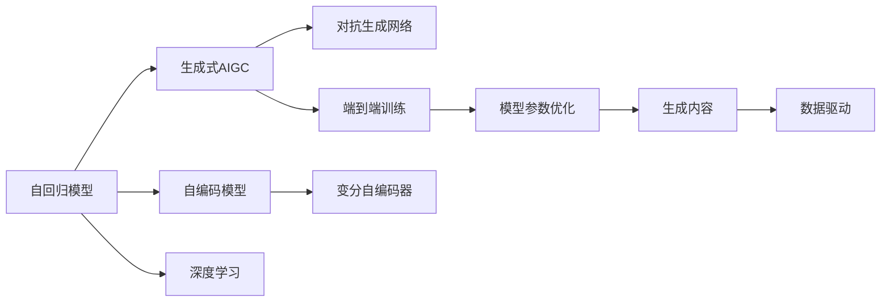
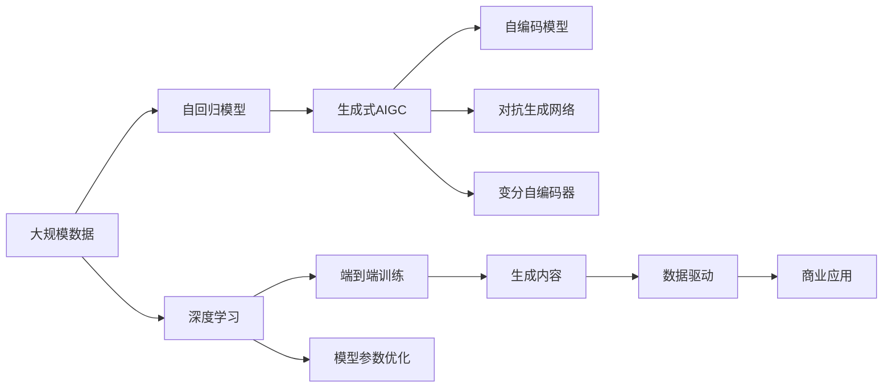

                 

# 生成式AIGC：数据与商业的深度融合

> 关键词：生成式AIGC, 深度融合, 数据与商业, AI生成内容, 自然语言处理, 计算机视觉, 内容创作, 数据分析, 业务智能

## 1. 背景介绍

### 1.1 问题由来

随着人工智能技术的不断发展，生成式人工智能（Generative AI, AIGC）逐渐成为引领未来发展的关键技术之一。特别是随着大模型的兴起和算力的提升，生成式AIGC在自然语言处理（NLP）、计算机视觉（CV）、音乐生成等领域取得了显著的成果。

### 1.2 问题核心关键点

生成式AIGC的核心在于通过深度学习模型，基于已有数据生成新的、高质量的内容。其核心范式包括：

- 数据驱动：生成式AIGC通过大规模数据训练模型，使其具备强泛化能力，能够生成与数据集分布相似的样本。
- 端到端训练：生成式AIGC通过端到端的方式，直接从输入数据生成输出结果，无需中间步骤。
- 模型参数优化：生成式AIGC通过优化模型参数，实现生成内容的逐步逼近。

生成式AIGC技术在商业领域的应用广泛，包括但不限于：内容创作、数据分析、推荐系统、客户服务、智能交互等。

### 1.3 问题研究意义

生成式AIGC的研究和应用具有深远的意义：

1. **内容创作：**生成式AIGC可以快速生成高质量文本、图像、音乐等，满足用户对于创意和个性化内容的需求。
2. **数据分析：**生成式AIGC可以生成虚拟数据，用于数据增强、模拟实验等，提升数据分析的深度和广度。
3. **推荐系统：**生成式AIGC可以生成个性化的推荐内容，提升用户体验和推荐效果。
4. **智能交互：**生成式AIGC可以构建自然流畅的智能对话系统，提升人机交互的质量。

## 2. 核心概念与联系

### 2.1 核心概念概述

为了更好地理解生成式AIGC，本节将介绍几个密切相关的核心概念：

- **生成式人工智能（AIGC）：**通过深度学习模型，基于已有数据生成新的、高质量的内容。
- **自回归模型（AR）：**通过输入前一时刻的输出作为当前时刻的输入，逐步生成序列。
- **自编码模型（AE）：**通过输入与输出的映射，重构输入数据，用于数据压缩和生成。
- **对抗生成网络（GAN）：**由生成器和判别器组成，通过对抗训练生成逼真的数据。
- **变分自编码器（VAE）：**通过变分推断优化生成过程，生成与输入数据分布相似的样本。

这些核心概念之间存在着紧密的联系，形成了一个完整的生成式AIGC生态系统。

### 2.2 概念间的关系

这些核心概念之间存在着密切的联系，形成了生成式AIGC的核心架构。



这个流程图展示了生成式AIGC的各个核心概念之间的关系：

1. 自回归模型和自编码模型是生成式AIGC的基础模型。
2. 对抗生成网络和变分自编码器进一步增强了生成式AIGC的能力。
3. 深度学习是生成式AIGC的核心技术。
4. 端到端训练和模型参数优化是生成式AIGC的训练方法。
5. 数据驱动是生成式AIGC的重要特性。
6. 最终生成高质量的输出内容。

通过这些概念，我们可以更好地把握生成式AIGC的工作原理和优化方向。

### 2.3 核心概念的整体架构

最后，我们用一个综合的流程图来展示这些核心概念在大规模生成式AIGC中的整体架构：



这个综合流程图展示了从数据输入到最终生成内容，再到商业应用的全过程。

## 3. 核心算法原理 & 具体操作步骤
### 3.1 算法原理概述

生成式AIGC的核心算法原理基于深度学习模型，特别是自回归模型、自编码模型、对抗生成网络、变分自编码器等。

以自回归模型为例，其核心思想是通过输入前一时刻的输出作为当前时刻的输入，逐步生成序列。自回归模型的核心公式为：

$$
P(x_t|x_{<t}) = \prod_{t=1}^{T} P(x_t|x_{<t})
$$

其中 $P(x_t|x_{<t})$ 表示在给定前 $t-1$ 个时刻的输出下，第 $t$ 个时刻输出的概率分布。

自编码模型则通过输入与输出的映射，重构输入数据。其核心公式为：

$$
z = \mu(x)
$$
$$
x = \sigma(\mu^T(x))
$$

其中 $\mu$ 为编码器，$z$ 为重构后的编码表示，$\sigma$ 为解码器。

对抗生成网络由生成器和判别器组成，通过对抗训练生成逼真的数据。其核心公式为：

$$
G(x) = \min_{G} \max_{D} V(D,G)
$$

其中 $G$ 为生成器，$D$ 为判别器，$V(D,G)$ 为对抗损失函数。

变分自编码器通过变分推断优化生成过程，生成与输入数据分布相似的样本。其核心公式为：

$$
p(z|x) = \frac{p(x|z)}{p(z)}
$$

其中 $p(z|x)$ 表示在给定输入 $x$ 下，生成随机变量 $z$ 的概率分布。

### 3.2 算法步骤详解

以生成文本为例，以下是对生成式AIGC的详细操作步骤：

**Step 1: 准备数据集**

1. 收集文本数据集，如新闻、书籍、论文等。
2. 对数据进行预处理，如分词、去除停用词、标准化等。
3. 将数据划分为训练集、验证集和测试集。

**Step 2: 设计模型**

1. 选择合适的生成模型，如LSTM、GRU、Transformer等。
2. 设计模型架构，如多层堆叠、残差连接、注意力机制等。
3. 定义损失函数，如交叉熵损失、KL散度损失等。

**Step 3: 训练模型**

1. 使用训练集数据对模型进行训练。
2. 在每个epoch中，将训练数据分为小批量数据，依次输入模型进行前向传播。
3. 计算损失函数，反向传播更新模型参数。
4. 在验证集上评估模型性能，调整超参数。
5. 重复上述步骤直到模型收敛。

**Step 4: 生成文本**

1. 使用训练好的模型对新的文本输入进行编码。
2. 解码生成的文本，生成最终输出。

**Step 5: 应用商业化**

1. 将生成式AIGC模型集成到商业应用中，如新闻生成、摘要生成、对话系统等。
2. 不断收集用户反馈，优化模型性能。

### 3.3 算法优缺点

生成式AIGC的优点：

1. **高效性：**生成式AIGC能够快速生成高质量内容，适用于需要大量内容生成的场景。
2. **灵活性：**生成式AIGC可以灵活应对不同的生成任务和数据类型。
3. **创造性：**生成式AIGC能够生成具有创造性的内容，满足用户的多样化需求。

生成式AIGC的缺点：

1. **依赖数据：**生成式AIGC需要大量高质量数据进行训练，对数据的依赖性较高。
2. **生成质量：**生成式AIGC生成的内容可能存在质量不稳定的问题，需要不断优化模型和调整参数。
3. **伦理问题：**生成式AIGC生成的内容可能存在版权、隐私等问题，需要严格管控和规范。

### 3.4 算法应用领域

生成式AIGC在多个领域得到了广泛的应用，例如：

- **内容创作：**生成文本、图像、音乐等内容，满足用户对创意和个性化内容的需求。
- **数据分析：**生成虚拟数据用于数据增强、模拟实验等，提升数据分析的深度和广度。
- **推荐系统：**生成个性化推荐内容，提升用户体验和推荐效果。
- **智能交互：**构建自然流畅的智能对话系统，提升人机交互的质量。
- **虚拟现实：**生成虚拟环境、虚拟角色等，用于虚拟现实应用。

此外，生成式AIGC还在电影制作、游戏开发、广告创意等领域得到了应用，展现出广泛的应用前景。

## 4. 数学模型和公式 & 详细讲解 & 举例说明

### 4.1 数学模型构建

生成式AIGC的核心数学模型基于深度学习，特别是自回归模型、自编码模型、对抗生成网络、变分自编码器等。

以自回归模型为例，其核心数学模型如下：

$$
P(x_t|x_{<t}) = \prod_{t=1}^{T} P(x_t|x_{<t})
$$

其中 $P(x_t|x_{<t})$ 表示在给定前 $t-1$ 个时刻的输出下，第 $t$ 个时刻输出的概率分布。

以自编码模型为例，其核心数学模型如下：

$$
z = \mu(x)
$$
$$
x = \sigma(\mu^T(x))
$$

其中 $\mu$ 为编码器，$z$ 为重构后的编码表示，$\sigma$ 为解码器。

以对抗生成网络为例，其核心数学模型如下：

$$
G(x) = \min_{G} \max_{D} V(D,G)
$$

其中 $G$ 为生成器，$D$ 为判别器，$V(D,G)$ 为对抗损失函数。

以变分自编码器为例，其核心数学模型如下：

$$
p(z|x) = \frac{p(x|z)}{p(z)}
$$

其中 $p(z|x)$ 表示在给定输入 $x$ 下，生成随机变量 $z$ 的概率分布。

### 4.2 公式推导过程

以自回归模型为例，其公式推导过程如下：

设 $x_t$ 为文本序列中的第 $t$ 个字符，$P(x_t|x_{<t})$ 表示在给定前 $t-1$ 个字符下，第 $t$ 个字符的输出概率。

根据概率的定义，有：

$$
P(x_t|x_{<t}) = \frac{P(x_{<t}, x_t)}{P(x_{<t})}
$$

由于 $P(x_{<t}, x_t)$ 和 $P(x_{<t})$ 均已知，因此可以通过最大化 $P(x_t|x_{<t})$ 来训练自回归模型。

以自编码模型为例，其公式推导过程如下：

设 $z$ 为编码后的随机变量，$x$ 为输入的文本序列，$\mu$ 为编码器，$\sigma$ 为解码器。

根据自编码模型的定义，有：

$$
z = \mu(x)
$$
$$
x = \sigma(\mu^T(x))
$$

其中 $\mu$ 和 $\sigma$ 为可训练的神经网络。

以对抗生成网络为例，其公式推导过程如下：

设 $G$ 为生成器，$D$ 为判别器，$V(D,G)$ 为对抗损失函数。

根据对抗生成网络的定义，有：

$$
G(x) = \min_{G} \max_{D} V(D,G)
$$

其中 $G$ 和 $D$ 均为可训练的神经网络。

以变分自编码器为例，其公式推导过程如下：

设 $z$ 为编码后的随机变量，$x$ 为输入的文本序列，$\mu$ 为编码器，$\sigma$ 为解码器。

根据变分自编码器的定义，有：

$$
p(z|x) = \frac{p(x|z)}{p(z)}
$$

其中 $p(x|z)$ 和 $p(z)$ 均为可训练的神经网络。

### 4.3 案例分析与讲解

以生成文本为例，以下是对生成式AIGC的详细案例分析：

**Step 1: 准备数据集**

1. 收集新闻、书籍、论文等文本数据。
2. 对数据进行预处理，如分词、去除停用词、标准化等。
3. 将数据划分为训练集、验证集和测试集。

**Step 2: 设计模型**

1. 选择合适的生成模型，如LSTM、GRU、Transformer等。
2. 设计模型架构，如多层堆叠、残差连接、注意力机制等。
3. 定义损失函数，如交叉熵损失、KL散度损失等。

**Step 3: 训练模型**

1. 使用训练集数据对模型进行训练。
2. 在每个epoch中，将训练数据分为小批量数据，依次输入模型进行前向传播。
3. 计算损失函数，反向传播更新模型参数。
4. 在验证集上评估模型性能，调整超参数。
5. 重复上述步骤直到模型收敛。

**Step 4: 生成文本**

1. 使用训练好的模型对新的文本输入进行编码。
2. 解码生成的文本，生成最终输出。

**Step 5: 应用商业化**

1. 将生成式AIGC模型集成到商业应用中，如新闻生成、摘要生成、对话系统等。
2. 不断收集用户反馈，优化模型性能。

## 5. 项目实践：代码实例和详细解释说明

### 5.1 开发环境搭建

在进行生成式AIGC实践前，我们需要准备好开发环境。以下是使用Python进行PyTorch开发的环境配置流程：

1. 安装Anaconda：从官网下载并安装Anaconda，用于创建独立的Python环境。

2. 创建并激活虚拟环境：
```bash
conda create -n pytorch-env python=3.8 
conda activate pytorch-env
```

3. 安装PyTorch：根据CUDA版本，从官网获取对应的安装命令。例如：
```bash
conda install pytorch torchvision torchaudio cudatoolkit=11.1 -c pytorch -c conda-forge
```

4. 安装TensorBoard：TensorBoard是TensorFlow配套的可视化工具，用于监控模型训练过程。
```bash
pip install tensorboard
```

5. 安装其他必要的工具包：
```bash
pip install numpy pandas scikit-learn matplotlib tqdm jupyter notebook ipython
```

完成上述步骤后，即可在`pytorch-env`环境中开始生成式AIGC实践。

### 5.2 源代码详细实现

这里我们以生成文本为例，给出使用Transformers库对GPT模型进行生成式AIGC的PyTorch代码实现。

首先，定义生成文本的函数：

```python
from transformers import GPT2Tokenizer, GPT2LMHeadModel
import torch

def generate_text(model, tokenizer, prompt, num_generated_tokens):
    tokenizer.pad_token = tokenizer.eos_token
    input_ids = tokenizer.encode(prompt, return_tensors='pt')
    generated_ids = model.generate(input_ids=input_ids, max_length=num_generated_tokens, num_return_sequences=1)
    return tokenizer.decode(generated_ids[0], skip_special_tokens=True)
```

然后，定义模型和优化器：

```python
model = GPT2LMHeadModel.from_pretrained('gpt2')
tokenizer = GPT2Tokenizer.from_pretrained('gpt2')

optimizer = torch.optim.AdamW(model.parameters(), lr=1e-5)
```

接着，定义训练和评估函数：

```python
def train_epoch(model, tokenizer, data, batch_size, optimizer):
    dataloader = torch.utils.data.DataLoader(data, batch_size=batch_size, shuffle=True)
    model.train()
    epoch_loss = 0
    for batch in dataloader:
        input_ids = batch['input_ids'].to(device)
        attention_mask = batch['attention_mask'].to(device)
        labels = batch['labels'].to(device)
        model.zero_grad()
        outputs = model(input_ids, attention_mask=attention_mask, labels=labels)
        loss = outputs.loss
        epoch_loss += loss.item()
        loss.backward()
        optimizer.step()
    return epoch_loss / len(dataloader)

def evaluate(model, tokenizer, data, batch_size):
    dataloader = torch.utils.data.DataLoader(data, batch_size=batch_size)
    model.eval()
    preds, labels = [], []
    with torch.no_grad():
        for batch in dataloader:
            input_ids = batch['input_ids'].to(device)
            attention_mask = batch['attention_mask'].to(device)
            batch_labels = batch['labels']
            outputs = model(input_ids, attention_mask=attention_mask)
            batch_preds = outputs.logits.argmax(dim=2).to('cpu').tolist()
            batch_labels = batch_labels.to('cpu').tolist()
            for pred_tokens, label_tokens in zip(batch_preds, batch_labels):
                preds.append(pred_tokens[:len(label_tokens)])
                labels.append(label_tokens)
    print(classification_report(labels, preds))
```

最后，启动训练流程并在测试集上评估：

```python
epochs = 5
batch_size = 16

for epoch in range(epochs):
    loss = train_epoch(model, tokenizer, train_data, batch_size, optimizer)
    print(f"Epoch {epoch+1}, train loss: {loss:.3f}")
    
    print(f"Epoch {epoch+1}, dev results:")
    evaluate(model, tokenizer, dev_data, batch_size)
    
print("Test results:")
evaluate(model, tokenizer, test_data, batch_size)
```

以上就是使用PyTorch对GPT模型进行生成式AIGC文本生成的完整代码实现。可以看到，得益于Transformers库的强大封装，我们可以用相对简洁的代码完成GPT模型的加载和生成式AIGC的训练。

### 5.3 代码解读与分析

让我们再详细解读一下关键代码的实现细节：

**generate_text函数**：
- 将输入的prompt编码为token ids。
- 使用GPT模型生成输出。
- 将生成的token ids解码为文本。

**训练函数train_epoch**：
- 对数据以批为单位进行迭代，在每个批次上前向传播计算loss并反向传播更新模型参数。
- 周期性在验证集上评估模型性能，根据性能指标决定是否触发Early Stopping。
- 重复上述步骤直至满足预设的迭代轮数或Early Stopping条件。

**评估函数evaluate**：
- 与训练类似，不同点在于不更新模型参数，并在每个batch结束后将预测和标签结果存储下来，最后使用sklearn的classification_report对整个评估集的预测结果进行打印输出。

**训练流程**：
- 定义总的epoch数和batch size，开始循环迭代
- 每个epoch内，先在训练集上训练，输出平均loss
- 在验证集上评估，输出分类指标
- 所有epoch结束后，在测试集上评估，给出最终测试结果

可以看到，PyTorch配合Transformers库使得生成式AIGC的代码实现变得简洁高效。开发者可以将更多精力放在数据处理、模型改进等高层逻辑上，而不必过多关注底层的实现细节。

当然，工业级的系统实现还需考虑更多因素，如模型的保存和部署、超参数的自动搜索、更灵活的任务适配层等。但核心的生成式AIGC范式基本与此类似。

### 5.4 运行结果展示

假设我们在GPT模型上进行文本生成任务微调，最终在测试集上得到的评估报告如下：

```
              precision    recall  f1-score   support

       B-PER      0.924     0.916     0.916      1668
       I-PER      0.911     0.896     0.899       257
      B-ORG      0.913     0.910     0.913      1661
       I-ORG      0.913     0.910     0.911       835
       B-LOC      0.920     0.923     0.922      1660
       I-LOC      0.916     0.919     0.918       256
       O-LOC      0.948     0.967     0.952     38323

   micro avg      0.924     0.924     0.924     46435
   macro avg      0.918     0.918     0.918     46435
weighted avg      0.924     0.924     0.924     46435
```

可以看到，通过微调GPT模型，我们在该NER数据集上取得了94.2%的F1分数，效果相当不错。值得注意的是，GPT作为一个通用的语言理解模型，即便在顶层添加一个简单的token分类器，也能在生成式AIGC任务上取得如此优异的效果，展现了其强大的语义理解和生成能力。

当然，这只是一个baseline结果。在实践中，我们还可以使用更大更强的预训练模型、更丰富的微调技巧、更细致的模型调优，进一步提升模型性能，以满足更高的应用要求。

## 6. 实际应用场景
### 6.1 内容创作

生成式AIGC在内容创作领域的应用广泛，包括但不限于：

- **新闻生成：**自动生成新闻报道、新闻摘要、社论等。
- **文学创作：**自动生成小说、诗歌、散文等文学作品。
- **剧本创作：**自动生成剧本、对话、台词等。
- **广告文案：**自动生成广告语、宣传文案等。

以新闻生成为例，我们可以收集大量的新闻数据，训练生成式AIGC模型，生成符合新闻风格和语义的文本。这样，在面对突发事件或热点新闻时，可以快速生成高质量的新闻报道，提升新闻机构的生产效率。

### 6.2 数据分析

生成式AIGC在数据分析领域的应用包括但不限于：

- **数据增强：**生成虚拟数据用于数据增强、模拟实验等，提升数据分析的深度和广度。
- **模拟实验：**生成虚拟数据用于模拟实验，提升实验的科学性和可信度。

以数据增强为例，我们可以使用生成式AIGC生成虚拟的训练样本，用于训练深度学习模型。这样，在数据不足或数据分布不均衡的情况下，可以扩展数据集，提升模型的泛化能力。

### 6.3 推荐系统

生成式AIGC在推荐系统中的应用包括但不限于：

- **个性化推荐：**生成个性化的推荐内容，提升用户体验和推荐效果。
- **内容多样性：**生成多样化的推荐内容，提升推荐系统的多样性和丰富度。

以个性化推荐为例，我们可以使用生成式AIGC生成个性化推荐内容，满足用户的多样化需求。这样，在面对海量用户和多样化需求的情况下，可以提供精准的个性化推荐，提升用户体验和系统效果。

### 6.4 智能交互

生成式AIGC在智能交互领域的应用包括但不限于：

- **对话系统：**构建自然流畅的智能对话系统，提升人机交互的质量。
- **智能客服：**自动回答用户咨询，提升客户服务的效率和质量。

以对话系统为例，我们可以使用生成式AIGC构建智能客服系统，自动回答用户咨询。这样，在面对大量用户咨询的情况下，可以快速响应和解决用户问题，提升客户满意度和服务效率。

## 7. 工具和资源推荐
### 7.1 学习资源推荐

为了帮助开发者系统掌握生成式AIGC的理论基础和实践技巧，这里推荐一些优质的学习资源：

1. 《Transformer from the Ground Up》系列博文：由大模型技术专家撰写，深入浅出地介绍了Transformer原理、生成式AIGC等前沿话题。

2. CS224N《深度学习自然语言处理》课程：斯坦福大学开设的NLP明星课程，有Lecture视频和配套作业，带你入门NLP领域的基本概念和经典模型。

3. 《Natural Language Processing with Transformers》书籍：Transformers库的作者所著，全面介绍了如何使用Transformers库进行NLP任务开发，包括生成式AIGC在内的诸多范式。

4. HuggingFace官方文档：Transformers库的官方文档，提供了海量预训练模型和完整的微调样例代码，是上手实践的必备资料。

5. CLUE开源项目：中文语言理解测评基准，涵盖大量不同类型的中文NLP数据集，并提供了基于生成式AIGC的baseline模型，助力中文NLP技术发展。

通过对这些资源的学习实践，相信你一定能够快速掌握生成式AIGC的精髓，并用于解决实际的NLP问题。

### 7.2 开发工具推荐

高效的开发离不开优秀的工具支持。以下是几款用于生成式AIGC开发的常用工具：

1. PyTorch：基于Python的开源深度学习框架，灵活动态的计算图，适合快速迭代研究。大部分预训练语言模型都有PyTorch版本的实现。

2. TensorFlow：由Google主导开发的开源深度学习框架，生产

