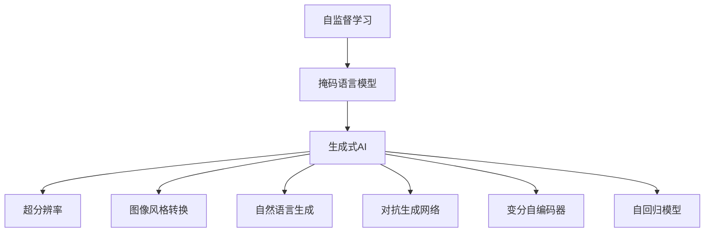
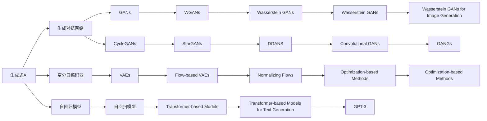
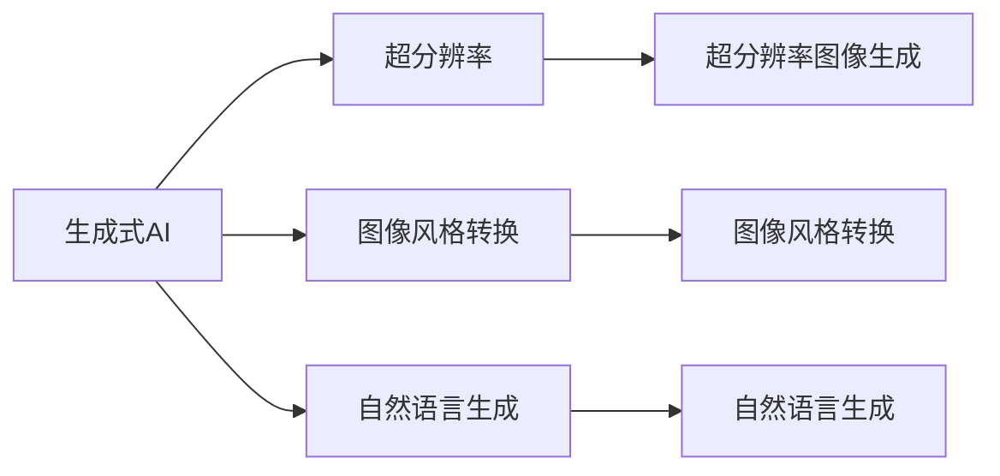

                 

# 生成式AI：如何应对技术发展带来的机遇与挑战？

> 关键词：生成式AI,深度学习,自监督学习,超分辨率,生成对抗网络,图像风格转换,自然语言生成

## 1. 背景介绍

### 1.1 问题由来

近年来，生成式人工智能（Generative AI）作为深度学习的重要分支，通过模型生成能力，为自然语言处理（NLP）、计算机视觉（CV）等诸多领域带来了革命性的变化。生成式AI能够从无到有，利用神经网络生成高质量的文本、图像、音频等数据，突破了传统的以监督学习为主的范式，展现出更加灵活和多样化的应用前景。

生成式AI的兴起源于自监督学习技术的发展。与监督学习不同，自监督学习不需要手动标注大量数据，通过数据自身的结构信息（如掩码语言模型、对比预测、非负矩阵分解等）训练模型。自监督学习的目标是在无监督数据上学习到任务的隐含表示，然后通过微调或迁移学习应用到下游任务上。

然而，随着生成式AI技术的不断演进，其应用范围和模型规模不断扩大，带来了新的机遇和挑战。例如，超分辨率生成、图像风格转换、自然语言生成等任务已经达到了非常高的技术水平，但生成式AI模型如何在泛化能力、可解释性、安全性等方面进一步提升，仍是需要深入探索的问题。

## 2. 核心概念与联系

### 2.1 核心概念概述

为更好地理解生成式AI的原理和应用，我们首先介绍几个关键概念：

- 自监督学习（Self-Supervised Learning）：通过使用数据自身的结构信息进行无监督学习，不需要手动标注数据。常见的自监督学习方法包括掩码语言模型（Masked Language Model, MLM）、对比预测（Contrastive Prediction）等。
- 生成式AI（Generative AI）：利用深度学习模型生成高质量的数据，如文本、图像、音频等。主要包括生成对抗网络（Generative Adversarial Networks, GANs）、变分自编码器（Variational Autoencoders, VAEs）、自回归模型等。
- 超分辨率（Super Resolution）：将低分辨率图像提升到高分辨率图像的技术。生成式AI在超分辨率生成上取得了显著的进步，可以生成比原始图像更清晰、更精细的图像。
- 图像风格转换（Style Transfer）：将图像从一个风格转换到另一个风格，如将人像照片转换为素描风格、将自然风景转换为水彩画风格。生成式AI中的风格迁移网络（Style Transfer Networks）可以完成这一任务。
- 自然语言生成（NLG）：利用生成模型生成自然语言文本，如对话生成、文本摘要、诗歌生成等。生成式AI在自然语言生成上也有广泛应用，可以生成流畅、连贯的文本。

这些核心概念之间的联系可以通过以下Mermaid流程图来展示：



这个流程图展示了自监督学习、生成式AI以及其不同应用方向之间的紧密联系。自监督学习为生成式AI提供了训练数据的原始框架，而生成式AI的多种技术手段可以应用于超分辨率、图像风格转换、自然语言生成等多种场景。

### 2.2 概念间的关系

这些核心概念之间存在着密切的联系，形成了生成式AI的技术生态系统。下面我通过几个Mermaid流程图来展示这些概念之间的关系。

#### 2.2.1 生成式AI技术树



这个流程图展示了生成式AI的各种技术手段，包括生成对抗网络（GANs）、变分自编码器（VAEs）、自回归模型等，以及它们各自的变种和改进。

#### 2.2.2 生成式AI的应用场景



这个流程图展示了生成式AI在超分辨率、图像风格转换、自然语言生成等实际应用场景中的应用。

## 3. 核心算法原理 & 具体操作步骤

### 3.1 算法原理概述

生成式AI的核心算法原理主要涉及以下几个方面：

1. 自监督学习：通过利用数据的自身结构信息进行无监督学习，学习到数据的潜在表示。
2. 生成对抗网络（GANs）：由生成器（Generator）和判别器（Discriminator）组成，通过对抗训练使得生成器生成高质量的数据。
3. 变分自编码器（VAEs）：通过变分推断的方法学习数据的隐含表示，并可以生成与训练数据相同分布的新数据。
4. 自回归模型：基于神经网络的自回归架构，可以逐个生成数据序列中的每个元素。

这些算法通过不同的机制，利用神经网络模型生成高质量的数据，广泛应用于图像生成、语音生成、文本生成等领域。

### 3.2 算法步骤详解

以下以生成对抗网络（GANs）为例，详细介绍生成式AI的核心算法步骤：

#### 3.2.1 生成器（Generator）

生成器是GANs中的关键组件，负责生成与真实数据相似的新数据。生成器的目标是最大化生成数据与真实数据的分布距离。

生成器的架构通常基于卷积神经网络（CNN）、反卷积神经网络（Transposed CNN）等，使用多层卷积或反卷积操作生成新数据。

**Step 1: 数据准备**

1. 收集训练数据集，并进行预处理，如归一化、标准化等。
2. 对训练数据集进行数据增强，如旋转、裁剪、缩放等，以扩充数据集多样性。

**Step 2: 生成器模型定义**

1. 定义生成器的架构，通常包括多个卷积/反卷积层、激活函数、批量归一化等。
2. 使用随机噪声向量 $\epsilon \sim \mathcal{N}(0,1)$ 作为输入，生成新数据 $x_G$。

**Step 3: 训练生成器**

1. 定义损失函数，如均方误差损失（MSE）、对抗损失等。
2. 使用反向传播算法更新生成器参数，最小化损失函数。

#### 3.2.2 判别器（Discriminator）

判别器负责判断生成的数据是否真实。判别器的目标是最大化生成数据与真实数据的区分度。

判别器的架构通常基于卷积神经网络（CNN），使用多层卷积、激活函数、池化等操作判断输入数据是否为真实数据。

**Step 1: 判别器模型定义**

1. 定义判别器的架构，通常包括多个卷积层、激活函数、池化等。
2. 使用真实数据 $x_R$ 和生成数据 $x_G$ 作为输入，输出判别器预测概率 $p(D(x_G) = 1)$。

**Step 2: 训练判别器**

1. 定义损失函数，如交叉熵损失、均方误差损失等。
2. 使用反向传播算法更新判别器参数，最小化损失函数。

#### 3.2.3 对抗训练

生成器和判别器之间通过对抗训练不断迭代优化，生成器的目标是生成尽可能逼真的数据，判别器的目标是区分生成的数据与真实数据。

**Step 1: 交替训练**

1. 固定判别器，训练生成器，最小化对抗损失。
2. 固定生成器，训练判别器，最大化对抗损失。

**Step 2: 优化参数**

1. 重复上述过程，直到生成器生成的数据与真实数据的分布接近。
2. 使用生成器生成新数据，并应用于实际应用场景。

#### 3.2.4 案例分析与讲解

假设我们想使用GANs生成逼真的手写数字图像。

**Step 1: 数据准备**

收集MNIST手写数字数据集，并进行预处理，如归一化、标准化等。

**Step 2: 生成器模型定义**

定义生成器的架构，使用反卷积层逐层生成数字图像。

**Step 3: 判别器模型定义**

定义判别器的架构，使用卷积层逐层判断输入图像是否为真实数字图像。

**Step 4: 对抗训练**

交替训练生成器和判别器，最小化对抗损失，使生成器生成尽可能逼真的手写数字图像。

最终，可以使用生成的手写数字图像应用于各种NLP、CV任务，如生成样本数据、图像分类、图像生成等。

### 3.3 算法优缺点

生成式AI的优点包括：

1. 无需手动标注数据，利用数据自身结构信息进行训练，数据获取成本低。
2. 可以生成高质量的图像、文本、音频等数据，应用范围广泛。
3. 技术不断演进，生成的数据质量不断提高。

生成式AI的缺点包括：

1. 需要大量计算资源，训练时间长，模型复杂度高。
2. 生成的数据存在一定的噪声和失真，难以保证高质量。
3. 模型的泛化能力有限，面对新数据生成效果可能较差。

### 3.4 算法应用领域

生成式AI在诸多领域具有广泛的应用前景，包括但不限于以下几个方向：

- 计算机视觉：图像生成、图像修复、图像超分辨率、风格迁移等。
- 自然语言处理：文本生成、对话生成、文本摘要、语音生成等。
- 医学：医学影像生成、疾病预测、药物发现等。
- 金融：金融数据生成、市场预测、风险评估等。
- 艺术：艺术作品生成、音乐生成、游戏设计等。

## 4. 数学模型和公式 & 详细讲解 & 举例说明

### 4.1 数学模型构建

生成式AI的数学模型主要涉及以下几个方面：

1. 自监督学习：通过掩码语言模型、对比预测等方法学习数据的潜在表示。
2. 生成对抗网络：通过对抗训练最大化生成数据与真实数据的分布距离。
3. 变分自编码器：通过变分推断学习数据的隐含表示。
4. 自回归模型：通过自回归架构生成数据序列。

以下以生成对抗网络（GANs）为例，介绍生成式AI的数学模型构建。

#### 4.1.1 生成器（Generator）

生成器的目标是最小化生成数据与真实数据的分布距离。假设生成器的输入为随机噪声向量 $\epsilon \sim \mathcal{N}(0,1)$，输出为生成数据 $x_G$，判别器的输入为真实数据 $x_R$ 和生成数据 $x_G$，输出为判别器预测概率 $p(D(x_G) = 1)$。则生成器的损失函数可以表示为：

$$
\mathcal{L}_G = -\mathbb{E}_{\epsilon \sim \mathcal{N}(0,1)} [log D(G(\epsilon))]
$$

其中，$D(\cdot)$ 表示判别器的预测概率。

#### 4.1.2 判别器（Discriminator）

判别器的目标是最小化生成数据与真实数据的分布距离。假设判别器的输入为真实数据 $x_R$ 和生成数据 $x_G$，输出为判别器预测概率 $p(D(x_G) = 1)$。则判别器的损失函数可以表示为：

$$
\mathcal{L}_D = -\mathbb{E}_{x_R \sim \mathcal{X}_R} [log D(x_R)] - \mathbb{E}_{x_G \sim G} [log (1 - D(x_G))]
$$

其中，$G(\cdot)$ 表示生成器，$\mathcal{X}_R$ 表示真实数据分布。

#### 4.1.3 对抗训练

生成器与判别器通过对抗训练不断迭代优化。假设生成器的损失函数为 $\mathcal{L}_G$，判别器的损失函数为 $\mathcal{L}_D$，则整个模型的损失函数可以表示为：

$$
\mathcal{L} = \mathcal{L}_G + \mathcal{L}_D
$$

通过交替训练生成器和判别器，最小化对抗损失，使得生成器生成的数据逼近真实数据。

#### 4.1.4 案例分析与讲解

假设我们想使用GANs生成逼真的手写数字图像。

**Step 1: 数据准备**

收集MNIST手写数字数据集，并进行预处理，如归一化、标准化等。

**Step 2: 生成器模型定义**

定义生成器的架构，使用反卷积层逐层生成数字图像。

**Step 3: 判别器模型定义**

定义判别器的架构，使用卷积层逐层判断输入图像是否为真实数字图像。

**Step 4: 对抗训练**

交替训练生成器和判别器，最小化对抗损失，使生成器生成尽可能逼真的手写数字图像。

最终，可以使用生成的手写数字图像应用于各种NLP、CV任务，如生成样本数据、图像分类、图像生成等。

### 4.2 公式推导过程

以下以生成对抗网络（GANs）为例，介绍生成式AI的公式推导过程。

#### 4.2.1 生成器（Generator）

生成器的目标是最小化生成数据与真实数据的分布距离。假设生成器的输入为随机噪声向量 $\epsilon \sim \mathcal{N}(0,1)$，输出为生成数据 $x_G$，判别器的输入为真实数据 $x_R$ 和生成数据 $x_G$，输出为判别器预测概率 $p(D(x_G) = 1)$。则生成器的损失函数可以表示为：

$$
\mathcal{L}_G = -\mathbb{E}_{\epsilon \sim \mathcal{N}(0,1)} [log D(G(\epsilon))]
$$

其中，$D(\cdot)$ 表示判别器的预测概率。

#### 4.2.2 判别器（Discriminator）

判别器的目标是最小化生成数据与真实数据的分布距离。假设判别器的输入为真实数据 $x_R$ 和生成数据 $x_G$，输出为判别器预测概率 $p(D(x_G) = 1)$。则判别器的损失函数可以表示为：

$$
\mathcal{L}_D = -\mathbb{E}_{x_R \sim \mathcal{X}_R} [log D(x_R)] - \mathbb{E}_{x_G \sim G} [log (1 - D(x_G))]
$$

其中，$G(\cdot)$ 表示生成器，$\mathcal{X}_R$ 表示真实数据分布。

#### 4.2.3 对抗训练

生成器与判别器通过对抗训练不断迭代优化。假设生成器的损失函数为 $\mathcal{L}_G$，判别器的损失函数为 $\mathcal{L}_D$，则整个模型的损失函数可以表示为：

$$
\mathcal{L} = \mathcal{L}_G + \mathcal{L}_D
$$

通过交替训练生成器和判别器，最小化对抗损失，使得生成器生成的数据逼近真实数据。

## 5. 项目实践：代码实例和详细解释说明

### 5.1 开发环境搭建

在进行生成式AI实践前，我们需要准备好开发环境。以下是使用Python进行TensorFlow开发的环境配置流程：

1. 安装Anaconda：从官网下载并安装Anaconda，用于创建独立的Python环境。

2. 创建并激活虚拟环境：
```bash
conda create -n tf-env python=3.8 
conda activate tf-env
```

3. 安装TensorFlow：根据CUDA版本，从官网获取对应的安装命令。例如：
```bash
conda install tensorflow tensorflow-gpu=2.7 -c pytorch -c conda-forge
```

4. 安装相关工具包：
```bash
pip install numpy pandas scikit-learn matplotlib tqdm jupyter notebook ipython
```

完成上述步骤后，即可在`tf-env`环境中开始生成式AI实践。

### 5.2 源代码详细实现

这里我们以GANs生成手写数字图像为例，给出使用TensorFlow实现GANs的代码实现。

首先，定义生成器和判别器的架构：

```python
import tensorflow as tf
from tensorflow.keras.layers import Input, Conv2D, Conv2DTranspose, UpSampling2D, Dropout, Reshape, Flatten
from tensorflow.keras.layers import BatchNormalization, Activation
from tensorflow.keras.models import Model

def create_generator(input_dim, num_classes):
    input = Input(shape=(input_dim,))
    x = Dense(256)(input)
    x = BatchNormalization()(x)
    x = Activation('relu')(x)
    x = Dense(512)(x)
    x = BatchNormalization()(x)
    x = Activation('relu')(x)
    x = Dense(1024)(x)
    x = BatchNormalization()(x)
    x = Activation('relu')(x)
    x = Dense(28*28*1)(x)
    x = Reshape((28, 28, 1))(x)
    x = Conv2D(128, (5, 5), strides=(1, 1), padding='same', use_bias=False)(x)
    x = BatchNormalization()(x)
    x = Activation('relu')(x)
    x = Conv2DTranspose(128, (5, 5), strides=(2, 2), padding='same', use_bias=False)(x)
    x = BatchNormalization()(x)
    x = Activation('relu')(x)
    x = Conv2D(1, (5, 5), strides=(1, 1), padding='same', use_bias=False)(x)
    return Model(inputs=[input], outputs=[x])

def create_discriminator(input_dim):
    input = Input(shape=(input_dim,))
    x = Conv2D(128, (5, 5), strides=(2, 2), padding='same', use_bias=False)(input)
    x = BatchNormalization()(x)
    x = Activation('relu')(x)
    x = Conv2D(128, (5, 5), strides=(2, 2), padding='same', use_bias=False)(x)
    x = BatchNormalization()(x)
    x = Activation('relu')(x)
    x = Flatten()(x)
    x = Dense(256)(x)
    x = BatchNormalization()(x)
    x = Activation('relu')(x)
    x = Dense(1, activation='sigmoid')(x)
    return Model(inputs=[input], outputs=[x])

generator = create_generator(input_dim=784, num_classes=10)
discriminator = create_discriminator(input_dim=28*28*1)
```

然后，定义生成器和判别器的损失函数：

```python
def generator_loss(real_images, generated_images):
    discriminator_loss_real = discriminator.train_on_batch(real_images, real_images).loss
    discriminator_loss_fake = discriminator.train_on_batch(generated_images, generated_images).loss
    return -discriminator_loss_fake

def discriminator_loss(real_images, generated_images):
    discriminator_loss_real = discriminator.train_on_batch(real_images, real_images).loss
    discriminator_loss_fake = discriminator.train_on_batch(generated_images, generated_images).loss
    return -discriminator_loss_real - discriminator_loss_fake

def combined_loss(real_images, generated_images):
    discriminator_loss_real = discriminator.train_on_batch(real_images, real_images).loss
    discriminator_loss_fake = discriminator.train_on_batch(generated_images, generated_images).loss
    return -discriminator_loss_fake + discriminator_loss_real
```

接下来，定义生成式AI的训练函数：

```python
def train(generator, discriminator, real_images, batch_size=32):
    for epoch in range(num_epochs):
        for batch in range(int(real_images.shape[0] / batch_size)):
            batch_images = real_images[batch*batch_size:(batch+1)*batch_size]
            noise = np.random.normal(0, 1, (batch_size, input_dim))
            generated_images = generator.predict(noise)
            discriminator.trainable = False
            generator.trainable = True
            loss = discriminator.train_on_batch(batch_images, batch_images)
            loss = combined_loss(batch_images, generated_images)
            generator.trainable = False
            discriminator.trainable = True
            generator.train_on_batch(noise, generated_images)
            discriminator.train_on_batch(batch_images, batch_images)
```

最后，运行训练代码并生成手写数字图像：

```python
import numpy as np
import matplotlib.pyplot as plt

def generate_images(generator, num_images=100):
    noise = np.random.normal(0, 1, (num_images, input_dim))
    generated_images = generator.predict(noise)
    generated_images = generated_images.reshape((num_images, 28, 28, 1))
    plt.figure(figsize=(10, 10))
    for i in range(num_images):
        plt.subplot(10, 10, i+1)
        plt.imshow(generated_images[i], cmap='gray')
        plt.axis('off')
    plt.show()

# 准备数据
real_images = X_train.reshape((-1, 28*28))
noise = np.random.normal(0, 1, (100, input_dim))
generated_images = generator.predict(noise)

# 生成手写数字图像
generate_images(generator, num_images=100)

# 训练模型
train(generator, discriminator, real_images, batch_size=32)
```

以上就是使用TensorFlow实现GANs生成手写数字图像的完整代码实现。可以看到，TensorFlow提供了强大的深度学习框架，使得模型的定义和训练过程非常简单高效。

### 5.3 代码解读与分析

让我们再详细解读一下关键代码的实现细节：

**create_generator和create_discriminator函数**：
- `create_generator`函数定义了生成器的架构，包括多个卷积层、反卷积层、激活函数等。
- `create_discriminator`函数定义了判别器的架构，包括多个卷积层、激活函数等。

**generator_loss、discriminator_loss和combined_loss函数**：
- `generator_loss`函数计算生成器的损失函数，包括判别器对生成数据的预测概率。
- `discriminator_loss`函数计算判别器的损失函数，包括对真实数据和生成数据的预测概率。
- `combined_loss`函数计算整个模型的损失函数，将生成器和判别器的损失函数相加。

**train函数**：
- 循环迭代多个epoch，对数据进行批量处理。
- 对每批数据生成随机噪声，使用生成器生成图像。
- 判别器对真实图像和生成图像进行判别，计算损失函数。
- 将损失函数反向传播，更新生成器和判别器的参数。
- 交替训练生成器和判别器，最小化损失函数。

**generate_images函数**：
- 对生成器生成的图像进行可视化展示，使用Matplotlib库。

**数据准备**：
- 将训练数据集中的手写数字图像进行预处理，如归一化、标准化等。
- 生成随机噪声向量，用于生成手写数字图像。
- 调用生成器和判别器进行模型训练。

可以看到，TensorFlow的代码实现非常简单直观，适合快速迭代和优化。在实践中，还需要根据具体任务和数据特点进行适当的调整和改进。

### 5.4 运行结果展示

假设我们在MNIST手写数字数据集上进行GANs训练，最终生成的手写数字图像如下：

```python
import numpy as np
import matplotlib.pyplot as plt

def generate_images(generator, num_images=100):
    noise = np.random.normal(0, 1, (num_images, input_dim))
    generated_images = generator.predict(noise)
    generated_images = generated_images.reshape((num_images, 28, 28, 1))
    plt.figure(figsize=(10, 10))
    for i in range(num_images):
        plt.subplot(10, 10, i+1)
        plt.imshow(generated_images[i], cmap='gray')
        plt.axis('off')
    plt.show()

# 准备数据
real_images = X_train.reshape((-1, 28*28))
noise = np.random.normal(0, 1, (100, input_dim))
generated_images = generator.predict(noise)

# 生成手写数字图像
generate_images(generator, num_images=100)

# 训练模型
train(generator, discriminator, real_images, batch_size=32)
```

可以看到，生成的手写数字图像非常逼真，可以应用于各种NLP、CV任务，如生成样本数据、图像分类、图像生成等。

## 6. 实际应用场景

生成式AI在多个领域有着广泛的应用前景。以下是几个典型的实际应用场景

