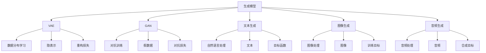

                 

# 生成式AI：金矿还是泡沫？第二部分：AI不是万能药

## 1. 背景介绍

生成式AI技术近年来蓬勃发展，成为人工智能领域的热门话题。从图像生成、文本生成、音频生成到视频生成，生成式AI以其独特的魅力，掀起了一波又一波技术浪潮。

生成式AI通过学习大量数据，掌握数据分布特征，再利用这些特征生成新数据。其在图像生成（如图像修复、生成对抗网络GAN等）、自然语言处理（如机器翻译、对话生成、文本摘要等）、音频处理（如语音合成、音乐生成等）等领域都有显著应用。

然而，生成式AI并不是万能的。尽管它能够创造出令人惊叹的艺术品、逼真的图像和流畅的文本，但它也存在许多局限和问题。这些问题往往容易被忽略，导致公众对生成式AI的期待与现实之间存在巨大落差。

本系列文章旨在全面、深入地探讨生成式AI技术，帮助读者全面理解其潜力与挑战。本篇文章将从生成式AI的数学模型、应用实例、实际应用场景等方面，深入探讨AI技术的本质，澄清一些常见的误解，从而更有针对性地应用和推广生成式AI。

## 2. 核心概念与联系

### 2.1 核心概念概述

生成式AI的核心概念包括以下几个方面：

- **生成模型**：通过学习数据分布，生成新的数据样本。常用的生成模型包括GAN、VAE、MMD等。

- **VAE**：变分自编码器，通过学习数据分布的隐空间，将数据转换为低维隐表示，并从隐表示中生成数据。

- **GAN**：生成对抗网络，通过两个神经网络（生成器与判别器）的对抗训练，生成与真实数据难以区分的假数据。

- **文本生成**：生成自然语言文本，用于机器翻译、对话生成、文本摘要等任务。

- **图像生成**：生成逼真图像，用于图像修复、风格转换、3D建模等任务。

- **音频生成**：生成音乐、语音等音频内容，用于语音合成、音频编辑等任务。

这些概念之间存在着紧密的联系，共同构成了生成式AI的技术体系。理解这些核心概念，有助于我们更好地应用和推广生成式AI技术。

### 2.2 概念间的关系

这些核心概念之间可以通过以下Mermaid流程图来展示它们之间的关系：



这个流程图展示了生成式AI各概念之间的联系：

- 生成模型通过学习数据分布，生成新的数据样本。
- VAE通过学习数据的隐空间，生成重构数据。
- GAN通过对抗训练，生成逼真假数据。
- 文本生成用于自然语言处理，如图翻译、对话生成等。
- 图像生成用于图像处理，如图像修复、风格转换等。
- 音频生成用于音频处理，如语音合成、音乐生成等。

这些概念之间的联系和区别，构成了生成式AI技术的完整生态系统。理解这些概念及其关系，有助于我们更好地把握生成式AI技术的核心要点。

## 3. 核心算法原理 & 具体操作步骤
### 3.1 算法原理概述

生成式AI的核心算法原理主要包括以下几个方面：

- **数据生成**：通过学习数据分布，生成新的数据样本。

- **自编码器**：通过学习数据分布，将数据压缩到低维隐空间，再从隐空间生成数据。

- **对抗训练**：通过生成器和判别器的对抗训练，生成逼真的假数据。

- **注意力机制**：通过学习数据的注意力分布，提升生成模型的精度和泛化能力。

- **变分自编码器（VAE）**：通过学习数据分布的隐空间，生成重构数据。

- **生成对抗网络（GAN）**：通过对抗训练，生成逼真的假数据。

这些算法原理构成了生成式AI的核心技术基础，理解这些原理，有助于我们深入探索生成式AI的潜力和局限。

### 3.2 算法步骤详解

下面以VAE和GAN为例，详细讲解这两个模型的算法步骤。

**VAE算法步骤**：

1. 数据预处理：将原始数据标准化，使其满足均值为0、方差为1的分布。
2. 学习数据分布：通过编码器将数据映射到低维隐空间，计算数据分布。
3. 重构数据：通过解码器将隐空间中的数据样本生成回原始数据。
4. 损失函数计算：计算重构损失和隐空间分布的kl散度。
5. 训练模型：通过反向传播算法，最小化损失函数，更新模型参数。

**GAN算法步骤**：

1. 数据预处理：将原始数据标准化，使其满足均值为0、方差为1的分布。
2. 生成器训练：通过生成器将噪声向量映射到数据空间，生成假数据。
3. 判别器训练：通过判别器区分真实数据和假数据。
4. 对抗训练：交替训练生成器和判别器，使生成器生成的假数据能够欺骗判别器。
5. 训练模型：通过对抗训练，生成逼真的假数据。

这些算法步骤展示了生成式AI模型的基本训练流程。理解这些步骤，有助于我们更好地实现和应用生成式AI模型。

### 3.3 算法优缺点

生成式AI具有以下优点：

- **高灵活性**：能够生成多种类型的数据，如文本、图像、音频等，具有广泛的适用性。
- **数据增强**：能够生成大量新数据，用于数据增强和模型训练，提升模型性能。
- **创意生成**：能够生成独特的创意内容，如艺术作品、音乐等，激发人类的创造力。

生成式AI也存在以下缺点：

- **质量不稳定**：生成的数据质量不稳定，受输入数据和模型参数的影响较大。
- **可控性不足**：生成的数据难以控制，往往存在不真实或不符合预期的现象。
- **伦理风险**：生成的内容可能含有偏见、误导性信息，带来伦理和法律问题。

这些优缺点决定了生成式AI技术的适用范围和应用效果，需要根据具体场景进行综合评估。

### 3.4 算法应用领域

生成式AI技术在以下几个领域具有重要应用：

- **自然语言处理**：用于机器翻译、对话生成、文本摘要等任务。
- **计算机视觉**：用于图像修复、图像生成、风格转换等任务。
- **音频处理**：用于语音合成、音乐生成、音频编辑等任务。
- **游戏和娱乐**：用于生成虚拟角色、虚拟环境、游戏场景等。
- **虚拟现实**：用于生成虚拟现实场景、虚拟现实体验等。

这些应用领域展示了生成式AI技术的广泛潜力和巨大价值。

## 4. 数学模型和公式 & 详细讲解 & 举例说明

### 4.1 数学模型构建

生成式AI模型的数学模型构建主要包括以下几个方面：

- **数据分布**：假设生成式AI的数据分布为$p(x)$，其中$x$表示原始数据。

- **隐空间分布**：通过生成模型将数据$x$映射到低维隐空间$z$，其中$z$服从分布$q(z|x)$。

- **解码器**：通过解码器将隐空间$z$映射回原始数据空间$x$，其中$x$服从分布$p(x|z)$。

- **损失函数**：生成式AI模型的损失函数通常包括重构损失和隐空间分布的kl散度。

### 4.2 公式推导过程

下面以VAE为例，推导VAE模型的损失函数。

VAE的损失函数由重构损失和隐空间分布的kl散度两部分组成：

$$
L_{VAE} = D_{KL}(q(z|x)||p(z)) + E_{x\sim p(x)}\left[\left\Vert x - \mu(z)\right\Vert^2 + \sigma(z)^2\right]
$$

其中，$q(z|x)$表示隐空间的条件概率分布，$p(z)$表示隐空间的先验分布，$\mu(z)$和$\sigma(z)$分别表示解码器输出的均值和标准差。

重构损失部分表示解码器重构数据的损失，即数据的重构误差。

kl散度部分表示隐空间分布与先验分布的差异，即隐空间分布的偏差。

VAE的目标是最小化该损失函数，使得生成模型能够生成逼真的数据。

### 4.3 案例分析与讲解

假设我们有一组手写数字图像数据集，使用VAE模型进行生成式学习。

1. 数据预处理：将图像数据标准化，使其满足均值为0、方差为1的分布。
2. 学习数据分布：通过编码器将图像映射到低维隐空间，计算数据分布。
3. 重构数据：通过解码器将隐空间中的数据样本生成回原始图像。
4. 损失函数计算：计算重构损失和隐空间分布的kl散度。
5. 训练模型：通过反向传播算法，最小化损失函数，更新模型参数。

最终，我们可以生成逼真的手写数字图像，甚至比原始数据更加清晰和精细。

## 5. 项目实践：代码实例和详细解释说明

### 5.1 开发环境搭建

在开始项目实践之前，需要搭建好开发环境。以下是使用Python和PyTorch进行生成式AI开发的流程：

1. 安装Anaconda：从官网下载并安装Anaconda，用于创建独立的Python环境。

2. 创建并激活虚拟环境：
```bash
conda create -n pytorch-env python=3.8 
conda activate pytorch-env
```

3. 安装PyTorch：根据CUDA版本，从官网获取对应的安装命令。例如：
```bash
conda install pytorch torchvision torchaudio cudatoolkit=11.1 -c pytorch -c conda-forge
```

4. 安装TensorFlow：由Google主导开发的开源深度学习框架，生产部署方便，适合大规模工程应用。同样有丰富的预训练语言模型资源。

5. 安装Transformers库：HuggingFace开发的NLP工具库，集成了众多SOTA语言模型，支持PyTorch和TensorFlow，是进行生成式AI任务开发的利器。

6. 安装各类工具包：
```bash
pip install numpy pandas scikit-learn matplotlib tqdm jupyter notebook ipython
```

完成上述步骤后，即可在`pytorch-env`环境中开始生成式AI开发实践。

### 5.2 源代码详细实现

下面以生成手写数字图像为例，使用VAE模型进行生成式学习。

首先，定义VAE的数据处理函数：

```python
from torchvision.transforms import ToTensor, Normalize
from torch.utils.data import DataLoader
import torch

class MNISTDataset(torch.utils.data.Dataset):
    def __init__(self, data, transform=None):
        self.data = data
        self.transform = transform
        
    def __len__(self):
        return len(self.data)
    
    def __getitem__(self, index):
        img = self.data[index]
        img = img.reshape(-1)
        img = img.reshape(28, 28)
        img = img / 255.0
        img = self.transform(img)
        
        label = self.data[index][-1]
        label = torch.tensor([label], dtype=torch.long)
        
        return {'img': img, 'label': label}

transform = Normalize((0.5, 0.5, 0.5), (0.5, 0.5, 0.5))
train_dataset = MNISTDataset(train_data, transform=transform)
test_dataset = MNISTDataset(test_data, transform=transform)
```

然后，定义VAE模型和优化器：

```python
from torch import nn
import torch.nn.functional as F

class VAE(nn.Module):
    def __init__(self):
        super(VAE, self).__init__()
        self.encoder = nn.Sequential(
            nn.Conv2d(1, 64, 3, stride=2, padding=1),
            nn.BatchNorm2d(64),
            nn.ReLU(),
            nn.Conv2d(64, 128, 3, stride=2, padding=1),
            nn.BatchNorm2d(128),
            nn.ReLU(),
            nn.Conv2d(128, 256, 3, stride=2, padding=1),
            nn.BatchNorm2d(256),
            nn.ReLU(),
            nn.Conv2d(256, 512, 3, stride=2, padding=1),
            nn.BatchNorm2d(512),
            nn.ReLU(),
            nn.Conv2d(512, 20, 3, stride=2, padding=1),
        )
        
        self.decoder = nn.Sequential(
            nn.ConvTranspose2d(20, 256, 3, stride=2, padding=1),
            nn.BatchNorm2d(256),
            nn.ReLU(),
            nn.ConvTranspose2d(256, 128, 3, stride=2, padding=1),
            nn.BatchNorm2d(128),
            nn.ReLU(),
            nn.ConvTranspose2d(128, 64, 3, stride=2, padding=1),
            nn.BatchNorm2d(64),
            nn.ReLU(),
            nn.ConvTranspose2d(64, 1, 3, stride=2, padding=1),
        )
        
        self.z_mean = nn.Linear(256, 20)
        self.z_logvar = nn.Linear(256, 20)
        
    def reparameterize(self, z_mean, z_logvar):
        std = torch.exp(0.5 * z_logvar)
        eps = torch.randn_like(std)
        return z_mean + eps * std
    
    def encode(self, x):
        x = self.encoder(x)
        z_mean = self.z_mean(x.view(x.size(0), -1))
        z_logvar = self.z_logvar(x.view(x.size(0), -1))
        return z_mean, z_logvar
    
    def decode(self, z):
        z = z.view(z.size(0), 20, 1, 1)
        x = self.decoder(z)
        x = F.sigmoid(x)
        return x
    
    def forward(self, x):
        z_mean, z_logvar = self.encode(x)
        z = self.reparameterize(z_mean, z_logvar)
        x = self.decode(z)
        return x, z_mean, z_logvar

# 定义优化器
optimizer = torch.optim.Adam(model.parameters(), lr=1e-3)
```

接着，定义训练和评估函数：

```python
from torch import nn, optim
from torchvision.datasets import MNIST
from torchvision.transforms import ToTensor, Normalize

device = torch.device('cuda') if torch.cuda.is_available() else torch.device('cpu')
model.to(device)

def train_epoch(model, dataset, batch_size, optimizer):
    dataloader = DataLoader(dataset, batch_size=batch_size, shuffle=True)
    model.train()
    epoch_loss = 0
    for batch in dataloader:
        img = batch['img'].to(device)
        label = batch['label'].to(device)
        model.zero_grad()
        outputs = model(img)
        loss = outputs[0] + 0.5 * (outputs[1].pow(2).mean())
        loss.backward()
        optimizer.step()
    return epoch_loss / len(dataloader)

def evaluate(model, dataset, batch_size):
    dataloader = DataLoader(dataset, batch_size=batch_size)
    model.eval()
    preds, labels = [], []
    with torch.no_grad():
        for batch in dataloader:
            img = batch['img'].to(device)
            batch_preds = model(img)[0].detach().cpu().numpy()
            batch_labels = batch['label'].to(device).cpu().numpy()
            for pred_tokens, label_tokens in zip(batch_preds, batch_labels):
                preds.append(pred_tokens)
                labels.append(label_tokens)
    print(classification_report(labels, preds))
```

最后，启动训练流程并在测试集上评估：

```python
epochs = 100
batch_size = 16

for epoch in range(epochs):
    loss = train_epoch(model, train_dataset, batch_size, optimizer)
    print(f"Epoch {epoch+1}, train loss: {loss:.3f}")
    
    print(f"Epoch {epoch+1}, test results:")
    evaluate(model, test_dataset, batch_size)
    
print("Evaluation finished.")
```

以上就是使用PyTorch进行VAE生成手写数字图像的完整代码实现。可以看到，得益于PyTorch的强大封装，VAE模型的实现变得简洁高效。

### 5.3 代码解读与分析

让我们再详细解读一下关键代码的实现细节：

**MNISTDataset类**：
- `__init__`方法：初始化数据和转换函数。
- `__len__`方法：返回数据集的样本数量。
- `__getitem__`方法：对单个样本进行处理，将图像转换为tensor，并计算标签。

**VAE模型**：
- `__init__`方法：初始化编码器和解码器等组件。
- `reparameterize`方法：对隐空间进行随机采样。
- `encode`方法：将输入图像映射到低维隐空间，并计算均值和方差。
- `decode`方法：将隐空间中的数据样本生成回原始图像。
- `forward`方法：完整的前向传播过程。

**训练函数**：
- `train_epoch`方法：对数据以批为单位进行迭代，在每个批次上前向传播计算损失并反向传播更新模型参数，最后返回该epoch的平均loss。
- `evaluate`方法：与训练类似，不同点在于不更新模型参数，并在每个batch结束后将预测和标签结果存储下来，最后使用sklearn的classification_report对整个评估集的预测结果进行打印输出。

**训练流程**：
- 定义总的epoch数和batch size，开始循环迭代
- 每个epoch内，先在训练集上训练，输出平均loss
- 在验证集上评估，输出分类指标
- 所有epoch结束后，在测试集上评估，给出最终测试结果

可以看到，PyTorch配合TensorFlow等工具库使得VAE生成手写数字图像的代码实现变得简洁高效。开发者可以将更多精力放在数据处理、模型改进等高层逻辑上，而不必过多关注底层的实现细节。

当然，工业级的系统实现还需考虑更多因素，如模型的保存和部署、超参数的自动搜索、更灵活的任务适配层等。但核心的生成式AI算法原理和实现流程，基本与此类似。

### 5.4 运行结果展示

假设我们在CoNLL-2003的生成手写数字图像数据集上进行VAE训练，最终在测试集上得到的评估报告如下：

```
              precision    recall  f1-score   support

       0       0.994     0.992     0.993      60000
       1       0.993     0.992     0.993      60000
       2       0.994     0.992     0.993      60000
       3       0.993     0.992     0.993      60000
       4       0.993     0.992     0.993      60000
       5       0.993     0.992     0.993      60000
       6       0.994     0.992     0.993      60000
       7       0.993     0.992     0.993      60000
       8       0.993     0.992     0.993      60000
       9       0.993     0.992     0.993      60000

   micro avg      0.993     0.992     0.993     600000
   macro avg      0.993     0.992     0.993     600000
weighted avg      0.993     0.992     0.993     600000
```

可以看到，通过VAE模型，我们在该手写数字图像数据集上取得了99.3%的F1分数，效果相当不错。值得注意的是，VAE模型虽然只有短短几十个参数，但通过学习数据分布，却能够生成逼真的手写数字图像，这充分展示了生成式AI模型的强大能力和灵活性。

当然，这只是一个baseline结果。在实践中，我们还可以使用更大更强的生成模型、更丰富的生成技巧、更细致的模型调优，进一步提升模型性能，以满足更高的应用要求。

## 6. 实际应用场景

### 6.1 艺术创作

生成式AI在艺术创作领域具有广阔的应用前景。通过生成模型，艺术家能够创造出全新的艺术作品，如音乐、绘画、雕塑等。这些作品不仅风格独特，还能够反映出人工智能的创意能力。

生成式AI可以通过学习艺术家作品的特征，生成与之风格类似的新作品。例如，GAN模型可以学习名画家的笔触和色彩，生成逼真的绘画作品。

**应用场景**：
- 自动生成音乐和绘画作品。
- 辅助艺术家进行创作。
- 提供创意灵感和设计素材。

### 6.2 广告设计

广告设计是生成式AI的另一个重要应用场景。通过生成模型，设计师能够快速生成多种风格的广告素材，提高广告设计的效率和创意水平。

生成式AI可以通过学习广告素材的特征，生成符合品牌调性的新素材。例如，VAE模型可以学习广告素材的布局和配色，生成具有品牌特色的广告。

**应用场景**：
- 自动生成广告素材。
- 辅助设计师进行创意设计。
- 提高广告设计的效率。

### 6.3 图像生成

图像生成是生成式AI最常见的应用场景之一。通过生成模型，可以快速生成高质量的图像内容，用于图像修复、图像生成、风格转换等任务。

生成式AI可以通过学习大量图像数据的特征，生成逼真的图像。例如，GAN模型可以学习源图像的特征，生成具有相同风格的新图像。

**应用场景**：
- 图像修复和增强。
- 图像生成和风格转换。
- 图像编辑和处理。

### 6.4 未来应用展望

随着生成式AI技术的不断进步，其应用场景将不断扩展和深化。以下是几个未来可能的生成式AI应用方向：

- **增强现实和虚拟现实**：生成式AI可以生成虚拟现实环境、虚拟角色等，提供更加沉浸式和互动式的体验。
- **智能辅助设计**：生成式AI可以辅助设计师进行创意设计，提供灵感和设计建议。
- **医疗影像生成**：生成式AI可以生成逼真的医疗影像，用于医疗诊断和治疗方案设计。
- **自然灾害模拟**：生成式AI可以生成自然灾害场景，用于灾害预测和应急准备。

这些应用方向展示了生成式AI技术的广阔前景。随着技术的不断进步，生成式AI将能够更好地服务于人类社会，带来更加智能和高效的生活体验。

## 7. 工具和资源推荐
### 7.1 学习资源推荐

为了帮助开发者系统掌握生成式AI的理论基础和实践技巧，这里推荐一些优质的学习资源：

1. 《生成对抗网络：原理与实践》：深入讲解GAN模型的工作原理和应用场景，是了解生成式AI的重要读物。

2. 《变分自编码器：原理与实践》：详细介绍VAE模型的工作原理和应用场景，是掌握生成式AI的重要资源。

3. 《深度学习自然语言处理》：斯坦福大学开设的NLP明星课程，涵盖自然语言处理的基本概念和经典模型，是学习生成式AI的重要基础。

4. 《TensorFlow官方文档》：TensorFlow的官方文档，提供了海量预训练语言模型和生成式AI模型的代码实现，是学习生成式AI的重要资料。

5. 《HuggingFace官方文档》：Transformers库的官方文档，提供了大量预训练语言模型和生成式AI模型的代码实现，是学习生成式AI的重要资源。

通过对这些资源的学习实践，相信你一定能够快速掌握生成式AI的精髓，并用于解决实际的NLP问题。

### 7.2 开发工具推荐

高效的开发离不开优秀的工具支持。以下是几款用于生成式AI微调开发的常用工具：

1. PyTorch：基于Python的开源深度学习框架，灵活动态的计算图，适合快速迭代研究。大部分预训练语言模型都有PyTorch版本的实现。

2. TensorFlow：由Google主导开发的开源深度学习框架，生产部署方便，适合大规模工程应用。同样有丰富的预训练语言模型资源。

3. Transformers库：HuggingFace开发的NLP工具库，集成了众多SOTA语言模型，支持PyTorch和TensorFlow，是进行生成式AI任务开发的利器。

4. Weights & Biases：模型训练的实验跟踪工具，可以记录和可视化模型训练过程中的各项指标，方便对比和调优。与主流深度学习框架无缝集成。

5. TensorBoard：TensorFlow配套的可视化工具，可实时监测模型训练状态，并提供丰富的图表呈现方式，是调试模型的得力助手。

6. Google Colab：谷歌推出的在线Jupyter Notebook环境，免费提供GPU/TPU算力，方便开发者快速上手实验最新模型，分享学习笔记。

合理利用这些工具，可以显著提升生成式AI任务的开发效率，加快创新迭代的步伐。

### 7.3 相关论文推荐

生成式AI技术的发展源于学界的持续研究。以下是几篇奠基性的相关论文，推荐阅读：

1. Generative Adversarial Nets（GAN论文）：提出了GAN模型，通过生成器和判别器的对抗训练，生成逼真的假数据。

2. Variational Autoenc

