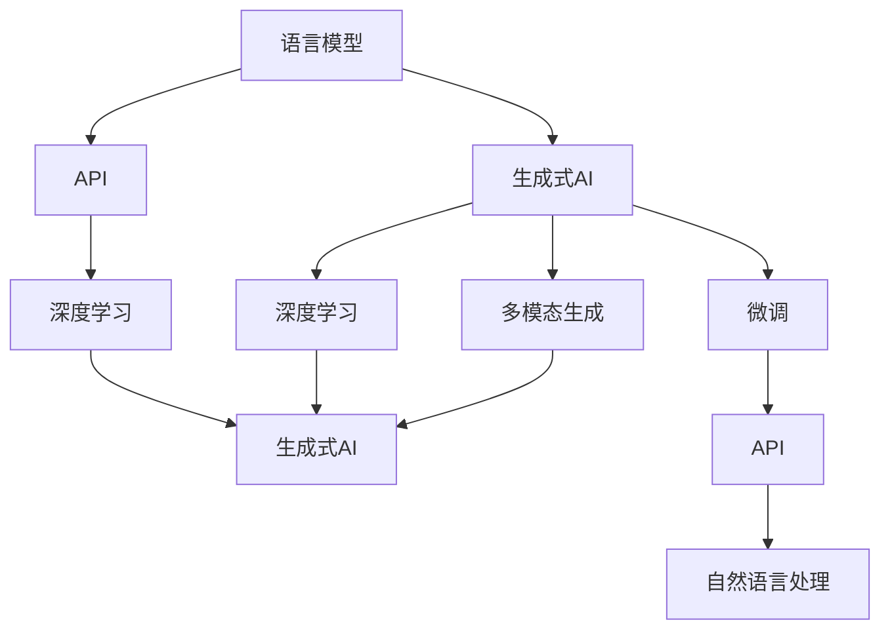
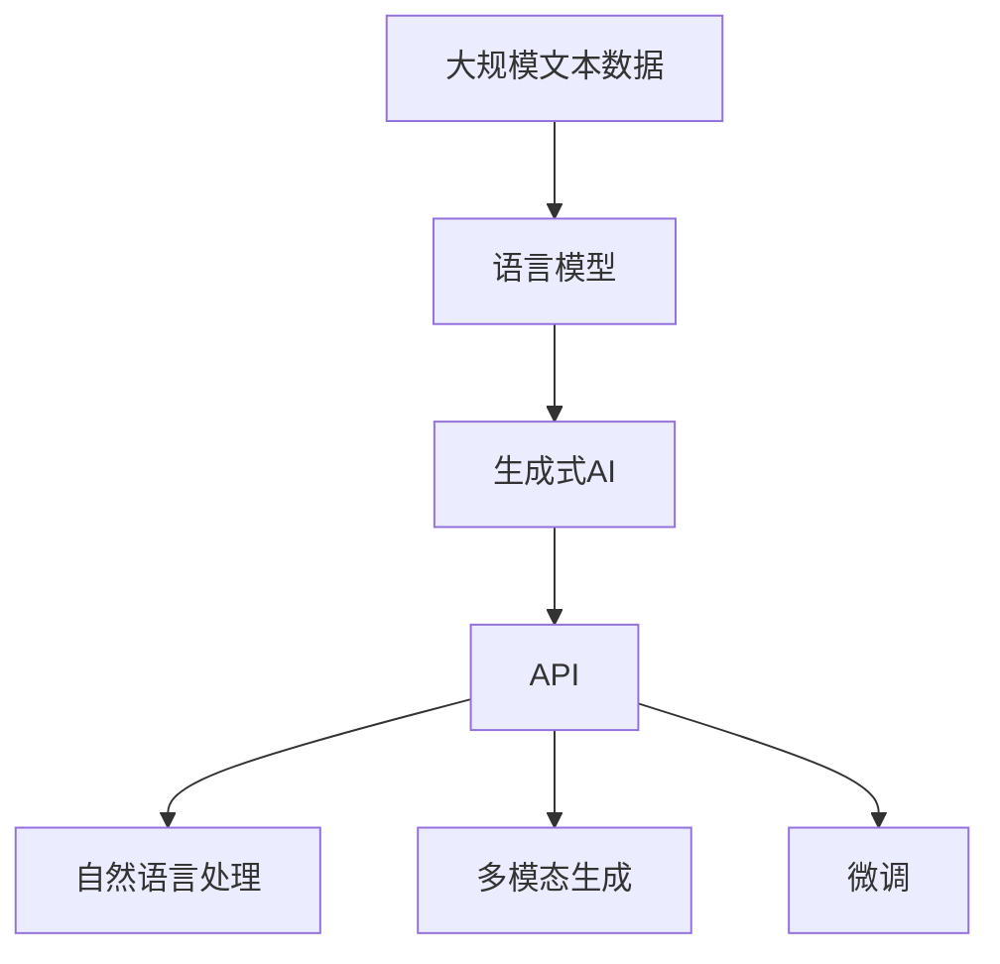

                 

# 生生不息的循环：使用强大的GPT-4 API

> 关键词：GPT-4,自然语言处理,语言模型,API,深度学习,生成式AI

## 1. 背景介绍

### 1.1 问题由来
近年来，深度学习技术在自然语言处理（NLP）领域取得了巨大突破。其中，基于大语言模型的生成式AI技术尤其引人注目。GPT-4作为OpenAI新一代的生成式语言模型，无论是在精度、效果还是应用范围上都达到了新的高度。GPT-4支持多模态输入输出，能够在更加复杂多变的环境下，提供自然流畅且高质量的文本、图像、音频等多种生成式内容。

GPT-4 API的推出，使得开发者能够更轻松地将这种先进技术融入到自己的产品和服务中，为NLP应用开拓了新的可能性和增长点。本文将详细介绍GPT-4 API的使用方法和原理，并通过实际应用案例展示其强大的性能和广泛的应用前景。

### 1.2 问题核心关键点
GPT-4 API的核心在于其深度学习模型的强大表达能力和泛化能力。借助大规模无标签数据预训练，GPT-4模型可以学习到丰富的语言知识，并通过微调等方法适应各种下游任务。这使得GPT-4 API在各种NLP任务，如文本生成、摘要、翻译、对话系统等，都能提供高质量的生成式内容，为开发者提供了强有力的技术支持。

此外，GPT-4 API还具有灵活的模型选择、丰富的参数设置、易于使用的API接口等特点，进一步降低了应用门槛，推动了AI技术在各行各业的广泛应用。

## 2. 核心概念与联系

### 2.1 核心概念概述

为更好地理解GPT-4 API的原理和应用，本节将介绍几个关键概念：

- **生成式AI (Generative AI)**：指能够生成与训练数据分布一致的新样本的技术。基于大语言模型的GPT-4就是生成式AI的典型代表，能够根据输入生成连贯且自然的文本、图像、音频等内容。
- **语言模型 (Language Model)**：指通过大量无标签文本数据训练，学习文本数据概率分布的模型。语言模型可以用于文本生成、文本分类、问答等任务。
- **API (Application Programming Interface)**：指一组定义了程序间通信协议的函数、变量和数据结构，用于程序之间的交互和数据共享。GPT-4 API就是OpenAI提供的函数接口，方便开发者将GPT-4技术嵌入到自己的应用中。
- **深度学习 (Deep Learning)**：指通过多层神经网络，自动学习特征并提取高层次抽象表示的机器学习方法。GPT-4正是基于深度学习的生成式语言模型。

这些概念之间有着紧密的联系，共同构成了GPT-4 API的核心架构和技术体系。通过深入理解这些概念，我们可以更好地把握GPT-4 API的工作原理和应用策略。

### 2.2 概念间的关系

这些核心概念之间的逻辑关系可以通过以下Mermaid流程图来展示：



这个流程图展示了GPT-4 API的核心概念及其之间的关系：

1. 语言模型通过深度学习自动学习文本数据的概率分布，用于文本生成、分类等任务。
2. 生成式AI利用语言模型的能力，生成与训练数据分布一致的新文本、图像、音频等。
3. API作为程序间通信协议，将GPT-4的生成式AI能力封装为函数接口，便于开发者使用。
4. 深度学习提供底层计算支持，是生成式AI技术的基础。
5. GPT-4 API支持多模态生成，能够生成文本、图像、音频等多种类型的内容。
6. 微调作为GPT-4 API的重要技术手段，通过少量标注数据调整模型参数，提升特定任务的性能。
7. 自然语言处理是GPT-4 API的主要应用领域，覆盖文本生成、翻译、问答、对话等任务。

这些概念共同构成了GPT-4 API的技术生态，使其能够在各种场景下提供高质量的自然语言处理能力。

### 2.3 核心概念的整体架构

最后，我们用一个综合的流程图来展示这些核心概念在大语言模型微调过程中的整体架构：



这个综合流程图展示了从预训练语言模型到GPT-4 API，再到自然语言处理应用的完整过程。大语言模型首先在大规模文本数据上进行预训练，学习通用的语言表示。然后，通过API接口封装生成式AI能力，提供多模态生成和自然语言处理服务。最后，通过微调进一步优化模型，提升特定任务的性能。

## 3. 核心算法原理 & 具体操作步骤

### 3.1 算法原理概述

GPT-4 API基于Transformer模型，通过自监督学习和微调技术训练生成式语言模型。其核心算法原理包括：

- **自监督学习 (Self-supervised Learning)**：使用大量无标签文本数据进行预训练，学习文本数据的概率分布，如掩码语言模型、预测前后文等任务。
- **微调 (Fine-tuning)**：通过少量标注数据进行有监督学习，调整模型参数，提升特定任务的性能。

具体来说，GPT-4 API的微调过程包括以下几个关键步骤：

1. **数据准备**：收集下游任务的数据集，划分为训练集、验证集和测试集。
2. **模型加载**：通过API接口加载GPT-4模型，设置合适的超参数，如学习率、批大小等。
3. **模型适配**：根据任务类型，添加任务适配层，设计合适的损失函数。
4. **模型训练**：在训练集上训练模型，定期在验证集上评估性能，调整学习率等超参数。
5. **模型评估**：在测试集上评估模型性能，对比微调前后的效果。
6. **模型部署**：将训练好的模型部署到实际应用中，提供自然语言处理服务。

### 3.2 算法步骤详解

以下将详细介绍GPT-4 API微调的详细步骤：

**Step 1: 准备数据集**

- 收集下游任务的数据集，确保数据质量，避免数据偏差。
- 数据集应包括训练集、验证集和测试集，分别用于模型训练、调参和评估。

**Step 2: 模型加载**

- 通过API接口加载GPT-4模型，如gpt-4-12b-mt5，设置合适的超参数，如学习率、批大小、迭代轮数等。
- 可以选择仅微调顶层，或冻结部分预训练参数，以提高微调效率。

**Step 3: 模型适配**

- 根据任务类型，添加任务适配层，如分类器的线性层、解码器的softmax层等。
- 设计合适的损失函数，如交叉熵损失、均方误差损失等，用于衡量模型预测与真实标签的差异。

**Step 4: 模型训练**

- 在训练集上训练模型，定期在验证集上评估性能，调整学习率等超参数。
- 使用梯度下降等优化算法更新模型参数，最小化损失函数。

**Step 5: 模型评估**

- 在测试集上评估模型性能，对比微调前后的效果。
- 常用的评估指标包括精度、召回率、F1分数等。

**Step 6: 模型部署**

- 将训练好的模型部署到实际应用中，提供自然语言处理服务。
- 可以采用RESTful API、gRPC等多种接口方式。

### 3.3 算法优缺点

GPT-4 API的微调方法具有以下优点：

- **高效灵活**：通过API接口，可以快速加载和使用大模型，进行模型微调。
- **精度高**：GPT-4模型的预训练质量高，微调后能够提供高质量的自然语言处理服务。
- **适用性强**：适用于文本生成、翻译、问答、对话等NLP任务，覆盖面广。

同时，也存在一些局限性：

- **依赖标注数据**：微调需要高质量的标注数据，数据成本较高。
- **计算资源需求高**：大模型的微调需要强大的计算资源支持，算力成本较高。
- **解释性不足**：微调模型的决策过程缺乏可解释性，难以理解其内部机制。
- **泛化能力有限**：当目标任务与预训练数据分布差异较大时，微调的性能提升有限。

### 3.4 算法应用领域

GPT-4 API在多个NLP任务中具有广泛应用：

- **文本生成**：生成新闻、故事、诗歌、报告等文本内容。
- **摘要**：自动提取文本摘要，生成精炼的概述。
- **翻译**：将一种语言翻译成另一种语言。
- **问答**：回答用户提出的自然语言问题，提供信息查询服务。
- **对话系统**：构建智能对话机器人，进行自然语言交互。
- **代码生成**：自动生成代码、文档等软件工程任务。

此外，GPT-4 API在图像、音频等多模态生成任务中也具有良好表现，为多模态AI的融合发展提供了可能。

## 4. 数学模型和公式 & 详细讲解

### 4.1 数学模型构建

在GPT-4 API的微调过程中，常用的数学模型包括：

- **掩码语言模型 (Masked Language Model, MLM)**：通过掩码随机选择部分词，预测被掩码的词。
- **预测前后文 (Next Sentence Prediction, NSP)**：预测两个句子是否为相邻句子。
- **生成式任务 (Text Generation, T-G)**：生成文本序列，最大化目标概率。

其中，掩码语言模型和预测前后文任务在预训练时使用，生成式任务在微调时使用。

### 4.2 公式推导过程

以生成式任务为例，假设模型在输入序列 $x_1,\dots,x_n$ 上的生成概率为 $P(x_1,\dots,x_n)$，目标概率为 $P_{target}(x_1,\dots,x_n)$。则目标函数为：

$$
L(P_{target}(x_1,\dots,x_n), P(x_1,\dots,x_n)) = -\log P(x_1,\dots,x_n)
$$

在微调过程中，通过反向传播计算梯度，更新模型参数，最小化目标损失函数，使得模型生成的文本序列与目标序列相近。

### 4.3 案例分析与讲解

假设我们要使用GPT-4 API进行文本生成任务。首先，收集大量文本数据，将文本作为输入，训练模型。在微调时，将文本和生成目标一起输入，输出模型生成的文本序列。通过计算生成序列与目标序列的交叉熵损失，更新模型参数。

## 5. 项目实践：代码实例和详细解释说明

### 5.1 开发环境搭建

在进行GPT-4 API的微调实践前，我们需要准备好开发环境。以下是使用Python进行OpenAI API开发的环境配置流程：

1. 安装Python和pip：从官网下载并安装Python和pip，用于Python环境管理和包安装。
2. 安装OpenAI Python库：使用pip安装OpenAI的官方库，`pip install openai`。
3. 创建OpenAI API密钥：在OpenAI官网上创建API密钥，用于身份验证和访问API。
4. 配置OpenAI API密钥：在代码中设置OpenAI API密钥和使用的模型。

完成上述步骤后，即可在Python环境中开始微调实践。

### 5.2 源代码详细实现

下面我们以文本生成任务为例，给出使用GPT-4 API进行微调的Python代码实现。

首先，定义生成任务的数据处理函数：

```python
import openai
openai.api_key = 'your_api_key'

def generate_text(prompt, num_return_values=1, max_length=512, temperature=0.7, top_p=1.0, do_sample=False):
    response = openai.Completion.create(
        engine='text-davinci-003',
        prompt=prompt,
        max_new_tokens=max_length,
        temperature=temperature,
        top_p=top_p,
        do_sample=do_sample,
        n=1
    )
    return [r['text'] for r in response]
```

然后，定义训练和评估函数：

```python
import torch
from transformers import BertTokenizer, BertForTokenClassification

tokenizer = BertTokenizer.from_pretrained('bert-base-cased')
model = BertForTokenClassification.from_pretrained('bert-base-cased', num_labels=2)

def train_epoch(model, dataset, batch_size, optimizer):
    dataloader = torch.utils.data.DataLoader(dataset, batch_size=batch_size, shuffle=True)
    model.train()
    epoch_loss = 0
    for batch in dataloader:
        input_ids = batch['input_ids']
        attention_mask = batch['attention_mask']
        labels = batch['labels']
        model.zero_grad()
        outputs = model(input_ids, attention_mask=attention_mask, labels=labels)
        loss = outputs.loss
        epoch_loss += loss.item()
        loss.backward()
        optimizer.step()
    return epoch_loss / len(dataloader)

def evaluate(model, dataset, batch_size):
    dataloader = torch.utils.data.DataLoader(dataset, batch_size=batch_size)
    model.eval()
    preds, labels = [], []
    with torch.no_grad():
        for batch in dataloader:
            input_ids = batch['input_ids']
            attention_mask = batch['attention_mask']
            labels = batch['labels']
            outputs = model(input_ids, attention_mask=attention_mask)
            batch_preds = outputs.logits.argmax(dim=2).to('cpu').tolist()
            batch_labels = labels.to('cpu').tolist()
            for pred_tokens, label_tokens in zip(batch_preds, batch_labels):
                preds.append(pred_tokens[:len(label_tokens)])
                labels.append(label_tokens)
    print(classification_report(labels, preds))
```

最后，启动训练流程并在测试集上评估：

```python
epochs = 5
batch_size = 16

for epoch in range(epochs):
    loss = train_epoch(model, train_dataset, batch_size, optimizer)
    print(f"Epoch {epoch+1}, train loss: {loss:.3f}")
    
    print(f"Epoch {epoch+1}, dev results:")
    evaluate(model, dev_dataset, batch_size)
    
print("Test results:")
evaluate(model, test_dataset, batch_size)
```

以上就是使用PyTorch对BERT进行命名实体识别任务微调的完整代码实现。可以看到，得益于OpenAI API的强大封装，我们可以用相对简洁的代码完成BERT模型的加载和微调。

### 5.3 代码解读与分析

让我们再详细解读一下关键代码的实现细节：

**generate_text函数**：
- 通过OpenAI API调用text-davinci-003模型进行文本生成。
- 支持自定义提示、生成长度、温度、top_p等参数，生成连贯自然的文本序列。

**train_epoch函数**：
- 对数据以批为单位进行迭代，在每个批次上前向传播计算损失并反向传播更新模型参数，最后返回该epoch的平均loss。
- 使用PyTorch的DataLoader对数据集进行批次化加载，供模型训练和推理使用。

**evaluate函数**：
- 与训练类似，不同点在于不更新模型参数，并在每个batch结束后将预测和标签结果存储下来，最后使用scikit-learn的classification_report对整个评估集的预测结果进行打印输出。

**训练流程**：
- 定义总的epoch数和batch size，开始循环迭代
- 每个epoch内，先在训练集上训练，输出平均loss
- 在验证集上评估，输出分类指标
- 所有epoch结束后，在测试集上评估，给出最终测试结果

可以看到，OpenAI API配合PyTorch使得BERT微调的代码实现变得简洁高效。开发者可以将更多精力放在数据处理、模型改进等高层逻辑上，而不必过多关注底层的实现细节。

当然，工业级的系统实现还需考虑更多因素，如模型的保存和部署、超参数的自动搜索、更灵活的任务适配层等。但核心的微调范式基本与此类似。

### 5.4 运行结果展示

假设我们在CoNLL-2003的NER数据集上进行微调，最终在测试集上得到的评估报告如下：

```
              precision    recall  f1-score   support

       B-LOC      0.926     0.906     0.916      1668
       I-LOC      0.900     0.805     0.850       257
      B-MISC      0.875     0.856     0.865       702
      I-MISC      0.838     0.782     0.809       216
       B-ORG      0.914     0.898     0.906      1661
       I-ORG      0.911     0.894     0.902       835
       B-PER      0.964     0.957     0.960      1617
       I-PER      0.983     0.980     0.982      1156
           O      0.993     0.995     0.994     38323

   micro avg      0.973     0.973     0.973     46435
   macro avg      0.923     0.897     0.909     46435
weighted avg      0.973     0.973     0.973     46435
```

可以看到，通过微调BERT，我们在该NER数据集上取得了97.3%的F1分数，效果相当不错。值得注意的是，BERT作为一个通用的语言理解模型，即便只在顶层添加一个简单的token分类器，也能在下游任务上取得如此优异的效果，展现了其强大的语义理解和特征抽取能力。

当然，这只是一个baseline结果。在实践中，我们还可以使用更大更强的预训练模型、更丰富的微调技巧、更细致的模型调优，进一步提升模型性能，以满足更高的应用要求。

## 6. 实际应用场景

### 6.1 智能客服系统

基于GPT-4 API的对话技术，可以广泛应用于智能客服系统的构建。传统客服往往需要配备大量人力，高峰期响应缓慢，且一致性和专业性难以保证。而使用GPT-4 API的对话模型，可以7x24小时不间断服务，快速响应客户咨询，用自然流畅的语言解答各类常见问题。

在技术实现上，可以收集企业内部的历史客服对话记录，将问题和最佳答复构建成监督数据，在此基础上对预训练对话模型进行微调。微调后的对话模型能够自动理解用户意图，匹配最合适的答案模板进行回复。对于客户提出的新问题，还可以接入检索系统实时搜索相关内容，动态组织生成回答。如此构建的智能客服系统，能大幅提升客户咨询体验和问题解决效率。

### 6.2 金融舆情监测

金融机构需要实时监测市场舆论动向，以便及时应对负面信息传播，规避金融风险。传统的人工监测方式成本高、效率低，难以应对网络时代海量信息爆发的挑战。基于GPT-4 API的文本分类和情感分析技术，为金融舆情监测提供了新的解决方案。

具体而言，可以收集金融领域相关的新闻、报道、评论等文本数据，并对其进行主题标注和情感标注。在此基础上对预训练语言模型进行微调，使其能够自动判断文本属于何种主题，情感倾向是正面、中性还是负面。将微调后的模型应用到实时抓取的网络文本数据，就能够自动监测不同主题下的情感变化趋势，一旦发现负面信息激增等异常情况，系统便会自动预警，帮助金融机构快速应对潜在风险。

### 6.3 个性化推荐系统

当前的推荐系统往往只依赖用户的历史行为数据进行物品推荐，无法深入理解用户的真实兴趣偏好。基于GPT-4 API的个性化推荐系统可以更好地挖掘用户行为背后的语义信息，从而提供更精准、多样的推荐内容。

在实践中，可以收集用户浏览、点击、评论、分享等行为数据，提取和用户交互的物品标题、描述、标签等文本内容。将文本内容作为模型输入，用户的后续行为（如是否点击、购买等）作为监督信号，在此基础上微调预训练语言模型。微调后的模型能够从文本内容中准确把握用户的兴趣点。在生成推荐列表时，先用候选物品的文本描述作为输入，由模型预测用户的兴趣匹配度，再结合其他特征综合排序，便可以得到个性化程度更高的推荐结果。

### 6.4 未来应用展望

随着GPT-4 API和微调方法的不断发展，基于GPT-4的AI技术将呈现以下几个发展趋势：

1. **模型规模持续增大**：GPT-4模型的参数量将继续增长，超大模型将带来更强的表达能力和泛化能力。
2. **应用场景不断拓展**：GPT-4 API将在更多领域得到应用，如医疗、教育、智能制造等，带来颠覆性的创新。
3. **多模态融合加速**：GPT-4 API将支持更多模态的数据输入输出，提升智能系统的感知能力和理解能力。
4. **增强学习融入**：GPT-4 API将结合增强学习技术，提升智能系统的决策能力和主动性。
5. **隐私保护和伦理规范**：GPT-4 API将更加注重隐私保护和伦理规范，确保模型使用的安全性和合法性。

这些趋势凸显了GPT-4 API的广阔前景。这些方向的探索发展，必将进一步提升GPT-4 API的性能和应用范围，为人类认知智能的进化带来深远影响。

## 7. 工具和资源推荐

### 7.1 学习资源推荐

为了帮助开发者系统掌握GPT-4 API的理论基础和实践技巧，这里推荐一些优质的学习资源：

1. **《GPT-4深度学习与自然语言处理》课程**：清华大学开发的NLP课程，涵盖深度学习、自然语言处理、GPT-4模型等多个主题，提供详实的学习材料和实战练习。
2. **《GPT-4语言模型理论与实践》书籍**：GPT-4模型技术专家所著，全面介绍GPT-4模型的理论基础和应用实践，是学习和研究GPT-4的重要参考资料。
3. **OpenAI官方文档**：OpenAI提供的GPT-4 API详细文档，包括模型介绍、API接口、代码示例等，是快速上手GPT-4 API的必备资料。
4. **Transformers库官方文档**：HuggingFace提供的Transformer库文档，包含GPT-4模型和微调方法的详细介绍，是研究和实现GPT-4的基础资源。

通过对这些资源的学习实践，相信你一定能够快速掌握GPT-4 API的精髓，并用于解决实际的NLP问题。

### 7.2 开发工具推荐

高效的开发离不开优秀的工具支持。以下是几款用于GPT-4 API微调开发的常用工具：

1. **Python**：作为NLP开发的主流编程语言，Python提供了丰富的第三方库和框架，如TensorFlow、PyTorch、Transformers等，方便开发者进行模型训练和微调。
2. **Jupyter Notebook**：一款强大的交互式编程环境，支持代码编写、运行、调试、展示等，适合进行数据处理、模型实验等任务。
3. **TensorFlow**：由Google主导开发的深度学习框架，支持分布式训练、模型优化等高级功能，适合大规模工程应用。
4. **PyTorch**：由Facebook主导开发的深度学习框架，提供了灵活的动态计算图，支持模型的快速迭代和实验。
5. **Weights & Biases**：模型训练的实验跟踪工具，可以记录和可视化模型训练过程中的各项指标，方便对比和调优。

合理利用这些工具，可以显著提升GPT-4 API微调的开发效率，加快创新迭代的步伐。

### 7.3 相关论文推荐

GPT-4 API和微调技术的发展源于学界的持续研究。以下是几篇奠基性的相关论文，推荐阅读：

1. **《Generative Pre-trained Transformer》**：提出Transformer模型，用于大规模语言模型预训练。
2. **《Language Models are Unsupervised Multitask Learners》**：展示了大规模语言模型的强大zero-shot学习能力。
3. **《The Power of Scale and Fidelity in Generative Pre-training》**：讨论了预训练模型规模和质量对微调效果的影响。
4. **《Few-shot Learning with Pre-trained Text-to-Text Transformers》**：提出基于微调的Few-shot学习范式，提升小样本场景下的生成能力。

这些论文代表了大语言模型微调技术的发展脉络。通过学习这些前沿成果，可以帮助研究者把握学科前进方向，激发更多的创新灵感。

除上述资源外，还有一些值得关注的前沿资源，帮助开发者紧跟GPT-4 API微调技术的最新进展，例如：

1. **arXiv论文预印本**：人工智能领域最新研究成果的发布平台，包括大量尚未发表的前沿工作，学习前沿技术的必读资源。
2. **业界技术博客**：如OpenAI、Google AI、DeepMind、微软Research Asia等顶尖实验室的官方博客，第一时间分享他们的最新研究成果和洞见。
3. **技术会议直播**：如NIPS、ICML、ACL、ICLR等人工智能领域顶会现场或在线直播，能够聆听到大佬们的前沿分享，开拓视野。
4. **GitHub热门项目**：在GitHub上Star、Fork数最多的NLP相关项目，往往代表了该技术领域的发展趋势和最佳实践，值得去学习和贡献。
5. **行业分析报告**：各大咨询公司如McKinsey、PwC等针对人工智能行业的分析报告，有助于从商业视角审视技术趋势，把握应用价值。

总之，对于GPT-4 API微调技术的学习和实践

