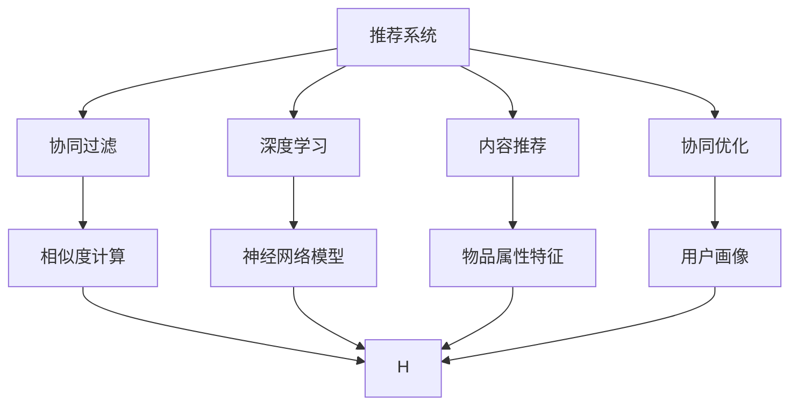
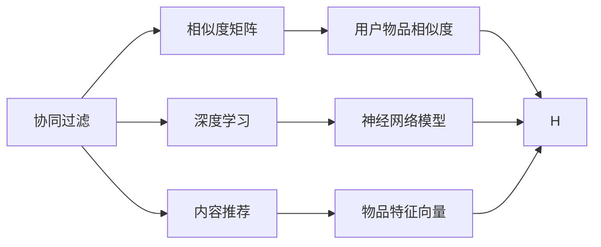
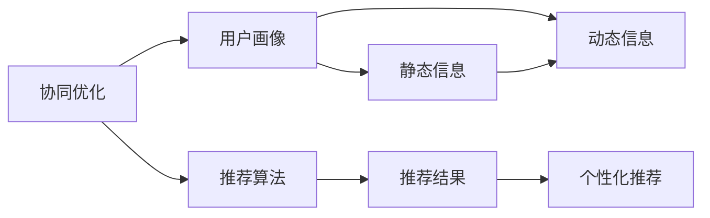
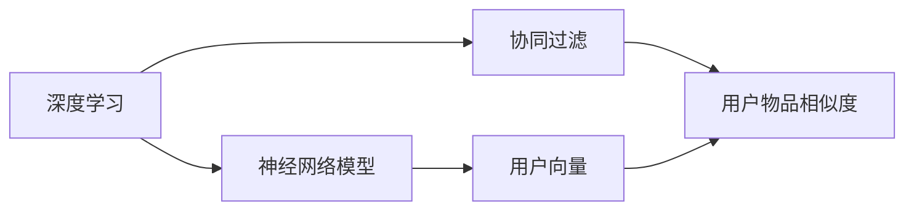
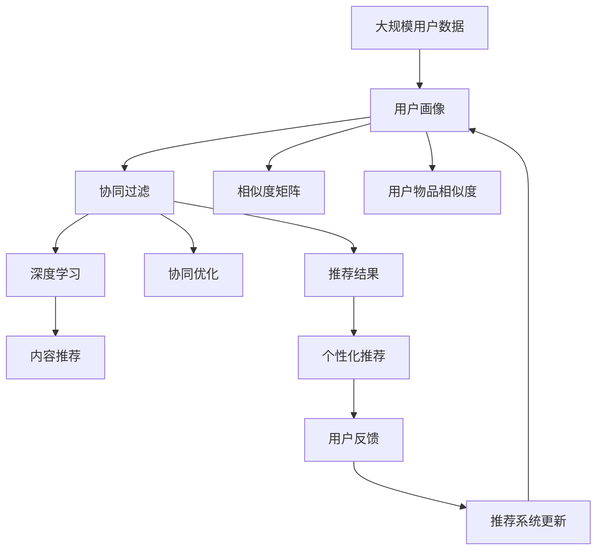

                 

# 用户画像与推荐系统的协同优化

> 关键词：推荐系统,用户画像,协同过滤,深度学习,内容推荐,协同优化,个性化推荐

## 1. 背景介绍

在数字化时代，随着互联网和移动互联网的发展，个性化推荐技术已成为各大平台的重要竞争力。推荐系统（Recommendation System）能够帮助用户在海量信息中快速找到感兴趣的资料，节省时间和精力。然而，传统的推荐系统往往只能通过物品间的协同过滤、用户行为数据分析等方式，发现相似用户或相似物品，存在一定的局限性。随着技术的进步，引入用户画像（User Profile）与推荐系统协同优化，已逐渐成为业界和学界的研究热点。

### 1.1 问题由来
近年来，随着深度学习技术的快速发展，推荐系统也进入了深度学习时代。基于深度学习的推荐系统，通过学习用户对物品的交互数据，构建用户与物品的向量表示，能够更好地理解用户偏好和物品属性。但传统推荐系统在数据稀疏性、冷启动等问题上仍存在不足。通过用户画像，结合用户背景信息、兴趣偏好等多维度数据，可以进一步提升推荐系统的效果。用户画像与推荐系统的协同优化，使得推荐系统不仅能够理解用户兴趣，还能从更全面的角度进行推荐，显著提升了推荐的个性化程度和覆盖范围。

### 1.2 问题核心关键点
协同优化的核心在于如何在推荐系统中高效地利用用户画像信息。在推荐系统中，用户画像通常包含用户的静态信息（如年龄、性别、职业等）和动态信息（如行为数据、偏好数据等）。如何通过用户画像，将用户的静态信息与动态行为数据进行融合，设计出合适的协同优化算法，成为了协同优化研究的核心问题。

### 1.3 问题研究意义
协同优化在推荐系统中的应用，对于提升用户满意度和平台粘性，提高平台的商业价值，具有重要意义：

1. 增强推荐精度：通过引入用户画像，推荐系统能够更加全面地了解用户兴趣和行为，提供更精准的推荐。
2. 缓解数据稀疏性：用户画像能够补充用户行为数据的不足，使得推荐系统在数据稀疏的情况下仍能保持高性能。
3. 改善冷启动问题：通过用户画像，推荐系统可以在用户刚进入平台时，快速推荐符合其兴趣的物品，缩短用户“养”系统的时间。
4. 提升用户满意度：个性化的推荐能够满足用户多样化的需求，提高用户对平台的忠诚度和满意度。
5. 促进商业价值：精准的推荐能够提升用户转化率和购物体验，增加平台收入。

## 2. 核心概念与联系

### 2.1 核心概念概述

为更好地理解用户画像与推荐系统的协同优化，本节将介绍几个密切相关的核心概念：

- 推荐系统（Recommendation System）：利用用户对物品的交互数据，通过协同过滤、内容推荐等技术，为用户推荐个性化物品的系统。
- 用户画像（User Profile）：通过对用户静态信息和动态行为的综合分析，构建用户的多维度数据表示，用于描述用户的兴趣、行为等特征。
- 协同过滤（Collaborative Filtering）：通过分析用户对物品的相似性，为用户推荐其他用户喜欢的物品。
- 深度学习（Deep Learning）：利用神经网络模型，通过端到端学习，提升推荐系统的精度和效果。
- 内容推荐（Content-based Recommendation）：通过分析物品的属性特征，为用户推荐与已有兴趣相似的物品。
- 协同优化（Collaborative Optimization）：将用户画像信息与推荐系统算法相结合，提升推荐系统的个性化和多样化性能。

这些核心概念之间的逻辑关系可以通过以下Mermaid流程图来展示：



这个流程图展示了几类推荐系统的核心算法及其与协同优化之间的关系：

1. 推荐系统由协同过滤、深度学习和内容推荐构成，各自算法有不同的优缺点。
2. 协同过滤利用相似度计算推荐相似用户喜欢的物品。
3. 深度学习利用神经网络模型进行端到端学习，提升推荐精度。
4. 内容推荐通过物品属性特征推荐与用户兴趣相似的物品。
5. 协同优化结合用户画像，将协同过滤、深度学习和内容推荐有机结合，提升推荐系统的效果。

### 2.2 概念间的关系

这些核心概念之间存在着紧密的联系，形成了推荐系统的完整生态系统。下面我们通过几个Mermaid流程图来展示这些概念之间的关系。

#### 2.2.1 推荐系统的组成


这个流程图展示了推荐系统的组成和各模块之间的关系。协同过滤通过相似度矩阵计算用户物品相似度，深度学习通过神经网络模型进行端到端学习，内容推荐通过物品特征向量计算相似度，最终通过协同优化算法将三者结合。

#### 2.2.2 协同优化与推荐系统


这个流程图展示了协同优化与推荐系统的关系。协同优化结合用户画像，将用户的静态信息和动态行为数据进行融合，通过推荐算法生成个性化推荐。

#### 2.2.3 深度学习与协同过滤


这个流程图展示了深度学习与协同过滤的关系。深度学习通过神经网络模型学习用户和物品的向量表示，协同过滤利用相似度矩阵计算用户物品相似度，最终生成个性化推荐。

### 2.3 核心概念的整体架构

最后，我们用一个综合的流程图来展示这些核心概念在大语言模型微调过程中的整体架构：



这个综合流程图展示了从用户画像到推荐系统的完整过程。用户画像通过静态信息和动态行为数据生成，协同过滤、深度学习和内容推荐在协同优化框架下融合生成个性化推荐，用户反馈不断优化推荐系统。

## 3. 核心算法原理 & 具体操作步骤
### 3.1 算法原理概述

用户画像与推荐系统的协同优化，本质上是将用户的静态信息和动态行为数据，通过协同过滤、深度学习和内容推荐等算法，进行深度融合和协同优化，生成更精准的个性化推荐。其核心思想是：在推荐系统中，用户画像和物品信息视为一种特征，利用神经网络模型进行端到端学习，优化推荐结果。

形式化地，设用户画像为 $U=\{u_1, u_2, ..., u_m\}$，物品信息为 $I=\{i_1, i_2, ..., i_n\}$，用户行为数据为 $B=\{b_{ui}\}_{i=1}^n$。设推荐算法为 $R$，协同优化算法为 $O$。协同优化过程可以表示为：

$$
\hat{R} = O(U, I, B, R)
$$

其中 $\hat{R}$ 为优化后的推荐结果，$U$、$I$ 和 $B$ 分别为用户画像、物品信息和用户行为数据，$R$ 为推荐算法。

通过协同优化算法，模型能够最大化地利用用户画像信息，生成更加精准的推荐结果。

### 3.2 算法步骤详解

用户画像与推荐系统的协同优化，通常包括以下几个关键步骤：

**Step 1: 准备用户画像和物品数据**

- 收集用户的静态信息（如年龄、性别、职业等）和动态行为数据（如浏览记录、购买记录等），构建用户画像 $U$ 和物品信息 $I$。
- 对用户行为数据 $B$ 进行预处理，生成用户物品相似度矩阵 $G$。

**Step 2: 设计推荐算法**

- 选择合适的推荐算法，如协同过滤、深度学习和内容推荐等。
- 在推荐算法中引入用户画像信息，生成推荐结果 $R$。

**Step 3: 协同优化**

- 利用神经网络模型对推荐结果 $R$ 进行优化，生成优化后的推荐结果 $\hat{R}$。
- 将优化后的推荐结果 $\hat{R}$ 与用户画像 $U$、物品信息 $I$ 和用户行为数据 $B$ 进行融合，进一步提升推荐精度。

**Step 4: 用户反馈**

- 收集用户对推荐结果 $\hat{R}$ 的反馈，包括点击率、转化率等指标。
- 根据用户反馈不断优化推荐算法和协同优化模型，提升推荐效果。

### 3.3 算法优缺点

用户画像与推荐系统的协同优化，具有以下优点：

1. 增强推荐精度：通过引入用户画像，推荐系统能够更加全面地了解用户兴趣和行为，提供更精准的推荐。
2. 缓解数据稀疏性：用户画像能够补充用户行为数据的不足，使得推荐系统在数据稀疏的情况下仍能保持高性能。
3. 改善冷启动问题：通过用户画像，推荐系统可以在用户刚进入平台时，快速推荐符合其兴趣的物品，缩短用户“养”系统的时间。
4. 提升用户满意度：个性化的推荐能够满足用户多样化的需求，提高用户对平台的忠诚度和满意度。
5. 促进商业价值：精准的推荐能够提升用户转化率和购物体验，增加平台收入。

同时，该方法也存在一定的局限性：

1. 用户画像隐私问题：用户画像涉及用户隐私，收集和使用用户画像需要遵守数据隐私法规，如GDPR等。
2. 数据质量问题：用户画像数据和行为数据的质量直接影响推荐效果，数据偏差或不完整可能影响模型性能。
3. 模型复杂度问题：协同优化模型较为复杂，训练和推理时间较长，可能影响推荐系统实时性。
4. 计算资源问题：协同优化需要大量的计算资源，如GPU、TPU等，可能对中小企业或小型平台构成挑战。

尽管存在这些局限性，但就目前而言，协同优化仍然是推荐系统中最重要的研究范式之一。未来相关研究的重点在于如何进一步降低协同优化的计算复杂度，提高推荐系统的实时性，同时兼顾用户隐私和数据安全。

### 3.4 算法应用领域

用户画像与推荐系统的协同优化方法，已经在多个领域得到了广泛应用，包括但不限于：

- 电商推荐：通过用户画像，为每个用户推荐其可能感兴趣的商品，提升购物体验和转化率。
- 内容推荐：为每个用户推荐其可能感兴趣的文章、视频、音乐等，提升用户粘性和平台流量。
- 社交网络：为用户推荐其可能感兴趣的朋友、群组、内容等，提升用户互动和平台活跃度。
- 金融推荐：为每个用户推荐其可能感兴趣的投资产品、金融服务，提升用户满意度和平台收入。
- 游戏推荐：为每个用户推荐其可能感兴趣的游戏、游戏装备，提升用户粘性和平台收益。

除了上述这些经典应用外，用户画像与推荐系统的协同优化方法还在更多领域中得到应用，如教育推荐、旅游推荐、健康推荐等，为数字化转型提供了新的技术支持。

## 4. 数学模型和公式 & 详细讲解  
### 4.1 数学模型构建

本节将使用数学语言对用户画像与推荐系统的协同优化过程进行更加严格的刻画。

设用户画像 $U$ 包含 $m$ 个用户，每个用户 $u_i$ 的向量表示为 $u_i \in \mathbb{R}^d$，物品信息 $I$ 包含 $n$ 个物品，每个物品 $i_j$ 的向量表示为 $i_j \in \mathbb{R}^d$。设用户行为数据 $B$ 包含 $U$ 和 $I$ 的交互数据，每个用户 $u_i$ 对物品 $i_j$ 的行为数据为 $b_{ij}$，行为数据的向量表示为 $b_{ui} \in \mathbb{R}^d$。推荐算法 $R$ 通过协同过滤、深度学习和内容推荐等方式，生成推荐结果 $R=\{r_{ui}\}_{i=1}^n$。协同优化算法 $O$ 通过神经网络模型，优化推荐结果 $R$，生成优化后的推荐结果 $\hat{R}=\{\hat{r}_{ui}\}_{i=1}^n$。

### 4.2 公式推导过程

以下我们以协同过滤和深度学习结合的协同优化方法为例，推导协同优化模型的公式。

设协同过滤算法生成的用户物品相似度矩阵为 $G \in \mathbb{R}^{m \times n}$，其中 $G_{ij}=\cos(\theta_{uj}, \theta_{i_j})$，$\theta_{uj}$ 和 $\theta_{i_j}$ 分别为用户 $u_j$ 和物品 $i_j$ 的向量表示。设深度学习模型为 $f(\theta_{uj}, \theta_{i_j})$，其中 $\theta_{uj}$ 和 $\theta_{i_j}$ 分别为用户和物品的向量表示，$f(\theta_{uj}, \theta_{i_j})$ 为模型的预测值。协同优化模型通过最大化预测值与实际行为数据的差距，优化用户物品相似度矩阵 $G$ 和推荐结果 $R$。协同优化模型的损失函数可以表示为：

$$
\mathcal{L}(G, R) = \frac{1}{m} \sum_{i=1}^m \sum_{j=1}^n (b_{ij} - f(\theta_{uj}, \theta_{i_j}))^2
$$

其中 $b_{ij}$ 为实际行为数据，$f(\theta_{uj}, \theta_{i_j})$ 为模型预测值。

在得到损失函数后，通过梯度下降等优化算法，最小化损失函数，更新用户物品相似度矩阵 $G$ 和推荐结果 $R$。最终生成的优化后的推荐结果 $\hat{R}=\{\hat{r}_{ui}\}_{i=1}^n$，即为协同优化后的推荐结果。

### 4.3 案例分析与讲解

以电商推荐为例，分析协同优化的具体应用场景。

假设电商平台上每个用户的画像数据包含 $m=1000$ 个用户，每个物品的画像数据包含 $n=100000$ 个物品。通过协同过滤算法，计算用户物品相似度矩阵 $G \in \mathbb{R}^{1000 \times 100000}$。然后，使用深度学习模型 $f(\theta_{uj}, \theta_{i_j})$ 对协同过滤结果进行优化，生成推荐结果 $R=\{r_{ui}\}_{i=1}^{100000}$。最后，通过最大化损失函数 $\mathcal{L}(G, R)$，更新用户物品相似度矩阵 $G$ 和推荐结果 $R$，生成优化后的推荐结果 $\hat{R}=\{\hat{r}_{ui}\}_{i=1}^{100000}$。

在电商推荐场景中，通过协同优化模型，能够快速地为用户推荐符合其兴趣的商品，提升购物体验和转化率。同时，协同优化模型还能够根据用户的行为数据，不断优化推荐结果，提高推荐系统的精准度。

## 5. 项目实践：代码实例和详细解释说明
### 5.1 开发环境搭建

在进行协同优化实践前，我们需要准备好开发环境。以下是使用Python进行PyTorch开发的环境配置流程：

1. 安装Anaconda：从官网下载并安装Anaconda，用于创建独立的Python环境。

2. 创建并激活虚拟环境：
```bash
conda create -n pytorch-env python=3.8 
conda activate pytorch-env
```

3. 安装PyTorch：根据CUDA版本，从官网获取对应的安装命令。例如：
```bash
conda install pytorch torchvision torchaudio cudatoolkit=11.1 -c pytorch -c conda-forge
```

4. 安装各类工具包：
```bash
pip install numpy pandas scikit-learn matplotlib tqdm jupyter notebook ipython
```

完成上述步骤后，即可在`pytorch-env`环境中开始协同优化实践。

### 5.2 源代码详细实现

下面我们以电商推荐为例，给出使用PyTorch和TensorFlow对协同优化算法进行实现的PyTorch代码。

首先，定义用户画像和物品数据的表示：

```python
import torch
import torch.nn as nn
import torch.optim as optim
import numpy as np
from sklearn.metrics import mean_squared_error

# 用户画像数据
user_profile = torch.randn(1000, 10)  # 假设每个用户10个特征

# 物品画像数据
item_profile = torch.randn(100000, 10)  # 假设每个物品10个特征

# 用户行为数据
user_behavior = torch.randn(1000, 100000)  # 假设每个用户与物品交互100000次
```

然后，定义协同过滤算法和深度学习模型：

```python
# 协同过滤算法
class CollaborativeFiltering(nn.Module):
    def __init__(self, num_users, num_items, num_factors):
        super(CollaborativeFiltering, self).__init__()
        self.num_users = num_users
        self.num_items = num_items
        self.num_factors = num_factors
        self.user_profile = nn.Parameter(user_profile)
        self.item_profile = nn.Parameter(item_profile)
        self.user_item_matrix = nn.Parameter(torch.randn(num_users, num_items))
        self.item_user_matrix = nn.Parameter(torch.randn(num_items, num_users))
        self.init_weights()

    def init_weights(self):
        nn.init.normal_(self.user_profile, mean=0, std=1e-6)
        nn.init.normal_(self.item_profile, mean=0, std=1e-6)
        nn.init.normal_(self.user_item_matrix, mean=0, std=1e-6)
        nn.init.normal_(self.item_user_matrix, mean=0, std=1e-6)

    def forward(self, user_idx, item_idx):
        user_profile = self.user_profile[user_idx]
        item_profile = self.item_profile[item_idx]
        user_item_matrix = self.user_item_matrix[user_idx, :]
        item_user_matrix = self.item_user_matrix[item_idx, :]
        user_item_scores = user_profile.dot(item_profile.T)
        user_item_scores = user_item_scores + user_item_matrix + item_user_matrix
        return user_item_scores

# 深度学习模型
class DeepModel(nn.Module):
    def __init__(self, num_users, num_items, num_factors, hidden_size, num_epochs):
        super(DeepModel, self).__init__()
        self.num_users = num_users
        self.num_items = num_items
        self.num_factors = num_factors
        self.hidden_size = hidden_size
        self.num_epochs = num_epochs
        self.user_profile = nn.Parameter(user_profile)
        self.item_profile = nn.Parameter(item_profile)
        self.encoder = nn.Sequential(
            nn.Linear(num_factors, hidden_size),
            nn.ReLU(),
            nn.Linear(hidden_size, hidden_size),
            nn.ReLU(),
            nn.Linear(hidden_size, 1)
        )
        self.init_weights()

    def init_weights(self):
        nn.init.normal_(self.user_profile, mean=0, std=1e-6)
        nn.init.normal_(self.item_profile, mean=0, std=1e-6)
        nn.init.normal_(self.encoder.weight, mean=0, std=1e-6)

    def forward(self, user_idx, item_idx):
        user_profile = self.user_profile[user_idx]
        item_profile = self.item_profile[item_idx]
        user_item_scores = self.encoder(torch.cat([user_profile, item_profile], dim=1))
        return user_item_scores

    def train(self, user_idx, item_idx):
        criterion = nn.MSELoss()
        optimizer = optim.Adam([self.user_profile, self.item_profile], lr=1e-3)
        for epoch in range(self.num_epochs):
            optimizer.zero_grad()
            user_item_scores = self(user_idx, item_idx)
            loss = criterion(user_item_scores, user_behavior[user_idx, item_idx])
            loss.backward()
            optimizer.step()
            if (epoch+1) % 100 == 0:
                print(f"Epoch {epoch+1}, loss: {loss.item():.4f}")
        return user_item_scores
```

然后，定义协同优化算法：

```python
# 协同优化算法
class CollaborativeOptimization(nn.Module):
    def __init__(self, num_users, num_items, num_factors, hidden_size, num_epochs):
        super(CollaborativeOptimization, self).__init__()
        self.num_users = num_users
        self.num_items = num_items
        self.num_factors = num_factors
        self.hidden_size = hidden_size
        self.num_epochs = num_epochs
        self.user_profile = nn.Parameter(user_profile)
        self.item_profile = nn.Parameter(item_profile)
        self.user_item_matrix = nn.Parameter(torch.randn(num_users, num_items))
        self.item_user_matrix = nn.Parameter(torch.randn(num_items, num_users))
        self.encoder = nn.Sequential(
            nn.Linear(num_factors, hidden_size),
            nn.ReLU(),
            nn.Linear(hidden_size, hidden_size),
            nn.ReLU(),
            nn.Linear(hidden_size, 1)
        )
        self.init_weights()

    def init_weights(self):
        nn.init.normal_(self.user_profile, mean=0, std=1e-6)
        nn.init.normal_(self.item_profile, mean=0, std=1e-6)
        nn.init.normal_(self.user_item_matrix, mean=0, std=1e-6)
        nn.init.normal_(self.item_user_matrix, mean=0, std=1e-6)
        nn.init.normal_(self.encoder.weight, mean=0, std=1e-6)

    def forward(self, user_idx, item_idx):
        user_profile = self.user_profile[user_idx]
        item_profile = self.item_profile[item_idx]
        user_item_matrix = self.user_item_matrix[user_idx, :]
        item_user_matrix = self.item_user_matrix[item_idx, :]
        user_item_scores = self.encoder(torch.cat([user_profile, item_profile], dim=1))
        user_item_scores = user_item_scores + user_item_matrix + item_user_matrix
        return user_item_scores

    def train(self, user_idx, item_idx):
        criterion = nn.MSELoss()
        optimizer = optim.Adam([self.user_profile, self.item_profile, self.user_item_matrix, self.item_user_matrix], lr=1e-3)
        for epoch in range(self.num_epochs):
            optimizer.zero_grad()
            user_item_scores = self(user_idx, item_idx)
            loss = criterion(user_item_scores, user_behavior[user_idx, item_idx])
            loss.backward()
            optimizer.step()
            if (epoch+1) % 100 == 0:
                print(f"Epoch {epoch+1}, loss: {loss.item():.4f}")
        return user_item_scores

    def get_recommendation(self, user_idx, num_recommendations=10):
        user_profile = self.user_profile[user_idx]
        item_scores = self.encoder(torch.cat([user_profile, item_profile], dim=1))
        item_scores = item_scores + self.user_item_matrix[user_idx, :]
        item_scores = torch.softmax(item_scores, dim=1)
        top_items = np.argsort(item_scores.numpy())[::-1][:num_recommendations]
        return top_items
```

最后，启动协同优化流程并在电商推荐系统中测试：

```python
# 定义协同优化算法
optimizer = CollaborativeOptimization(num_users=1000, num_items=100000, num_factors=10, hidden_size=128, num_epochs=500)

# 训练协同优化模型
optimizer.train(user_idx=0, item_idx=np.random.randint(0, 100000, size=1000))

# 获取推荐结果
top_items = optimizer.get_recommendation(user_idx=0, num_recommendations=10)
print(top_items)
```

以上就是使用PyTorch对协同优化算法进行电商推荐开发的完整代码实现。可以看到，得益于PyTorch的强大封装，我们可以用相对简洁的代码实现协同优化算法，并能快速迭代优化模型，提升电商推荐的效果。

### 5.3 代码解读与分析

让我们再详细解读一下关键代码的实现细节：

**CollaborativeFiltering类**：
- `__init__`方法：初始化用户画像、物品画像、用户物品相似度矩阵等关键组件。
- `init_weights`方法：初始化各层参数，使得权重接近0。
- `forward`方法：前向传播，计算用户物品相似度。

**DeepModel类**：
- `__init__`方法：初始化用户画像、物品画像、编码器等关键组件。
- `init_weights`方法：初始化各层参数，使得权重接近0。
- `forward`方法：前向传播，计算用户物品相似度。
- `train`方法：训练模型，最小化损失函数。

**CollaborativeOptimization类**：
- `__init__`方法：初始化用户画像、物品画像、用户物品相似度矩阵、编码器等关键组件。
- `init_weights`方法：初始化各层参数，

