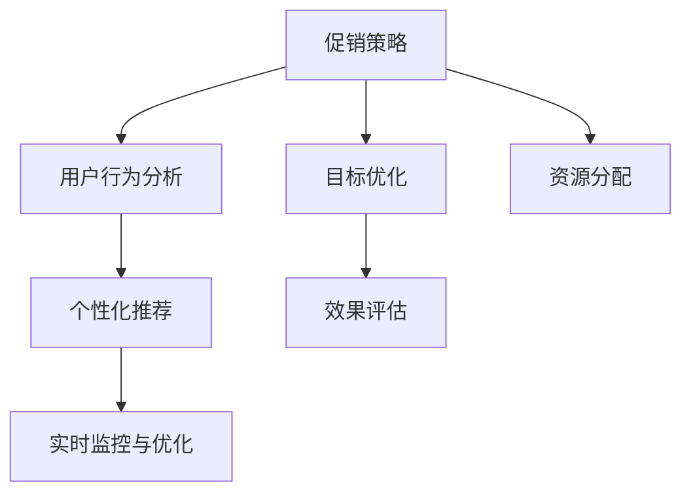
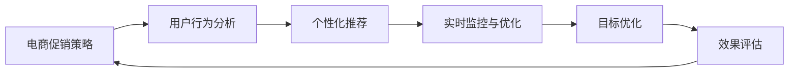
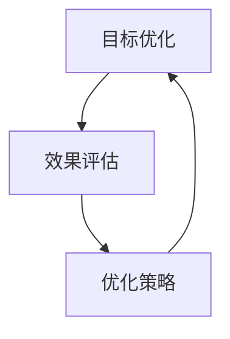
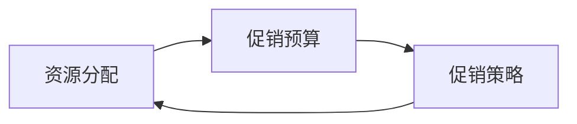
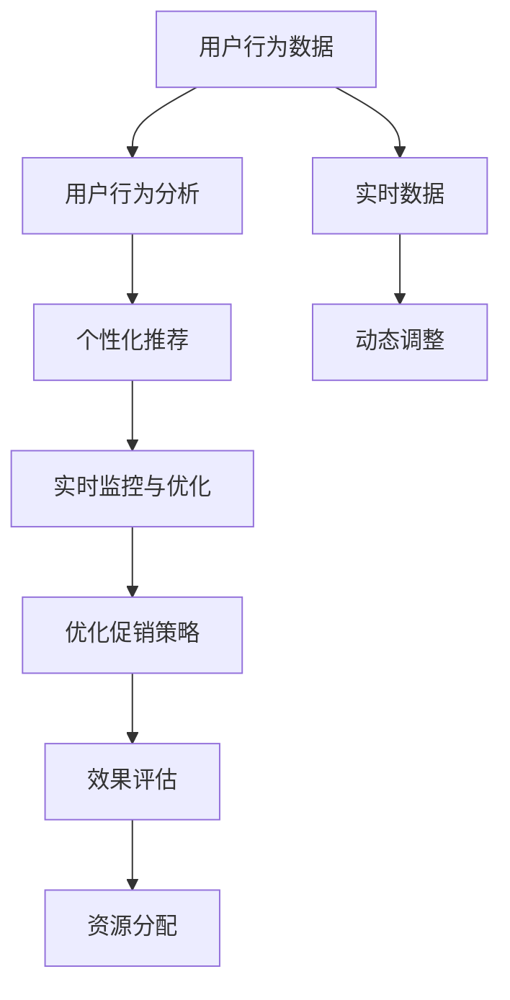

                 

# 电商促销策略的AI优化

## 1. 背景介绍

随着电商行业的迅猛发展，促销策略的重要性日益凸显。传统的促销策略大多依赖经验判断，缺乏科学依据。近年来，人工智能（AI）技术在电商促销策略优化中的应用日渐增多，通过数据驱动的方式，利用机器学习、深度学习等先进算法，显著提升了促销效果和用户满意度。

### 1.1 问题由来

在电商促销活动中，常见的促销手段包括折扣、满减、赠品等。传统的手工制定促销策略的方式存在以下几个问题：

1. **策略制定困难**：人工制定促销策略需要耗费大量时间和精力，且容易受个人经验和知识水平限制，无法考虑所有因素。
2. **效果难以评估**：传统策略的效果评估多依赖于事后统计，无法实时监控和优化促销过程。
3. **资源分配不均**：无法合理分配促销资源，可能导致某些商品被过度促销，浪费资源。
4. **用户需求匹配不足**：缺乏对用户行为和需求的深入理解，无法精准匹配用户需求，导致促销效果不理想。

### 1.2 问题核心关键点

电商促销策略优化问题可以归结为以下几个核心关键点：

- **促销目标优化**：如何在促销活动中最大化销售额、提高用户满意度等目标。
- **资源合理分配**：如何在有限的资源下，合理分配促销资源，避免资源浪费。
- **用户行为理解**：如何深入理解用户行为和需求，精准匹配促销策略。
- **效果评估与反馈**：如何实时监控促销活动的效果，及时调整策略。

### 1.3 问题研究意义

优化电商促销策略，具有以下重要意义：

1. **提升销售额**：通过精准匹配用户需求，最大化促销效果，提升销售额。
2. **提高用户满意度**：通过个性化推荐和实时监控，提高用户购物体验。
3. **降低成本**：通过资源合理分配，避免资源浪费，降低促销成本。
4. **促进用户体验**：通过用户行为分析，提供更个性化、精准的促销策略。
5. **应对市场变化**：通过实时监控和优化，快速应对市场变化，保持竞争优势。

## 2. 核心概念与联系

### 2.1 核心概念概述

为更好地理解电商促销策略的AI优化方法，本节将介绍几个密切相关的核心概念：

- **促销策略**：电商促销活动中采用的各种手段，如折扣、满减、赠品等。
- **用户行为分析**：对用户购物行为、偏好等进行分析，识别用户需求。
- **个性化推荐**：根据用户历史行为和实时兴趣，推荐个性化商品或促销活动。
- **实时监控与优化**：利用实时数据，动态调整促销策略，及时反馈优化效果。

这些核心概念之间的逻辑关系可以通过以下Mermaid流程图来展示：



这个流程图展示了几大核心概念的关联关系：

1. **促销策略**：作为AI优化的主要对象，优化后的策略将直接影响促销效果。
2. **用户行为分析**：为个性化推荐和实时监控提供数据支撑，确保促销策略的精准匹配。
3. **个性化推荐**：通过深入分析用户行为和需求，提供个性化的促销建议。
4. **实时监控与优化**：实时监控促销活动的效果，动态调整策略，确保促销效果最大化。
5. **目标优化**：优化促销策略，以最大化销售额和用户满意度等目标。
6. **效果评估**：评估促销策略的效果，反馈优化建议，指导策略调整。
7. **资源分配**：合理分配促销资源，避免资源浪费。

### 2.2 概念间的关系

这些核心概念之间存在着紧密的联系，形成了电商促销策略优化的完整生态系统。下面我通过几个Mermaid流程图来展示这些概念之间的关系。

#### 2.2.1 电商促销策略优化流程



这个流程图展示了电商促销策略优化的基本流程：

1. **电商促销策略**：作为起点，通过用户行为分析进行优化。
2. **用户行为分析**：提供用户行为数据，指导个性化推荐和实时监控。
3. **个性化推荐**：根据用户需求，生成个性化促销建议。
4. **实时监控与优化**：实时监控促销效果，动态调整策略。
5. **目标优化**：根据实时监控结果，优化促销策略。
6. **效果评估**：评估优化后的策略效果，反馈优化建议。
7. **回到电商促销策略**，形成闭环优化。

#### 2.2.2 目标优化与效果评估的关系



这个流程图展示了目标优化与效果评估之间的关系：

1. **目标优化**：设定优化目标，如最大化销售额、提高用户满意度等。
2. **效果评估**：评估优化策略的效果，提供反馈。
3. **优化策略**：根据评估结果，动态调整促销策略。

#### 2.2.3 资源分配的实现方式



这个流程图展示了资源分配的实现方式：

1. **资源分配**：根据促销预算和策略，合理分配资源。
2. **促销预算**：设定促销预算上限，指导资源分配。
3. **促销策略**：根据资源分配情况，优化促销策略。

### 2.3 核心概念的整体架构

最后，我们用一个综合的流程图来展示这些核心概念在大语言模型微调过程中的整体架构：



这个综合流程图展示了从用户行为数据到最终优化促销策略的全过程。通过分析用户行为数据，生成个性化推荐和实时监控，根据监控结果进行动态调整和优化，最终形成闭环优化的电商促销策略。

## 3. 核心算法原理 & 具体操作步骤

### 3.1 算法原理概述

电商促销策略的AI优化，本质上是一个多目标优化问题。其核心思想是：利用机器学习算法，分析用户行为数据，生成个性化推荐，实时监控促销活动效果，动态调整促销策略，以最大化促销效果和用户满意度等目标。

形式化地，假设用户行为数据为 $D=\{(x_i,y_i)\}_{i=1}^N, x_i \in \mathcal{X}, y_i \in \mathcal{Y}$，其中 $x_i$ 为历史行为数据，$y_i$ 为促销效果指标。

定义优化目标函数 $\mathcal{L}(\theta)$，其中 $\theta$ 为模型参数，包括个性化推荐模型、实时监控模型等。优化目标可以分解为以下几个部分：

1. **销售额最大化**：$\mathcal{L}_1(\theta) = \max_{x_i}(y_i - \hat{y}_i)$，其中 $\hat{y}_i$ 为模型预测的促销效果。
2. **用户满意度最大化**：$\mathcal{L}_2(\theta) = \max_{x_i}(\hat{y}_i - y_i)$，其中 $\hat{y}_i$ 为模型预测的用户满意度。
3. **资源分配合理性**：$\mathcal{L}_3(\theta) = \min_{x_i}(\sum_i \text{cost}_i - \text{budget})$，其中 $\text{cost}_i$ 为第 $i$ 项促销活动的成本，$\text{budget}$ 为促销预算。

总优化目标为 $\mathcal{L}(\theta) = \lambda_1 \mathcal{L}_1(\theta) + \lambda_2 \mathcal{L}_2(\theta) + \lambda_3 \mathcal{L}_3(\theta)$，其中 $\lambda_1$、$\lambda_2$、$\lambda_3$ 为权重因子，用于平衡不同目标。

### 3.2 算法步骤详解

电商促销策略的AI优化一般包括以下几个关键步骤：

**Step 1: 数据预处理与特征工程**

- 收集用户行为数据，包括历史购买记录、浏览记录、评价等。
- 进行数据清洗、去重、归一化等预处理操作。
- 设计特征工程，提取用户行为特征、商品特征、促销活动特征等，构建输入特征矩阵。

**Step 2: 模型训练与优化**

- 选择合适的模型，如决策树、随机森林、神经网络等，训练个性化推荐模型。
- 使用优化算法（如Adam、SGD等），最小化优化目标函数 $\mathcal{L}(\theta)$。
- 定期在验证集上评估模型性能，调整模型参数，防止过拟合。
- 使用正则化技术（如L2正则、Dropout等），增强模型泛化能力。

**Step 3: 实时监控与策略调整**

- 实时采集用户行为数据，更新推荐模型。
- 根据实时监控结果，动态调整促销策略，如调整折扣力度、优化促销商品等。
- 定期在测试集上评估模型性能，根据效果调整权重因子 $\lambda_1$、$\lambda_2$、$\lambda_3$。

**Step 4: 效果评估与反馈**

- 定期在测试集上评估促销策略的效果，如销售额、用户满意度等。
- 收集用户反馈，进行A/B测试，评估不同策略的效果。
- 根据评估结果，反馈优化建议，指导策略调整。

**Step 5: 策略部署与执行**

- 将优化后的促销策略部署到实际系统中。
- 实时监控促销活动效果，动态调整策略。
- 记录促销效果数据，持续改进优化算法和模型。

以上是电商促销策略的AI优化的主要流程。在实际应用中，还需要针对具体任务的特点，对优化过程的各个环节进行优化设计，如改进训练目标函数，引入更多的正则化技术，搜索最优的超参数组合等，以进一步提升模型性能。

### 3.3 算法优缺点

电商促销策略的AI优化方法具有以下优点：

1. **精准匹配用户需求**：通过用户行为分析，生成个性化推荐，精准匹配用户需求，提高用户满意度。
2. **实时监控与优化**：实时监控促销活动效果，动态调整策略，最大化促销效果。
3. **数据驱动决策**：通过数据驱动的方式，优化促销策略，提升决策的科学性和准确性。

同时，该方法也存在一些局限性：

1. **数据质量依赖**：优化效果高度依赖于用户行为数据的准确性和完备性，数据质量问题可能导致优化效果不理想。
2. **模型复杂度**：涉及多个模型的训练与优化，模型复杂度较高，需要较多计算资源。
3. **优化目标平衡**：在销售额最大化和用户满意度最大化之间找到平衡点，需要谨慎调整权重因子。
4. **资源分配困难**：合理的资源分配需要考虑多种因素，如促销成本、商品价值等，处理复杂。

尽管存在这些局限性，但就目前而言，基于AI优化的电商促销策略方法仍然是最主流的方法。未来相关研究的重点在于如何进一步降低数据需求，提高模型的效率和可解释性，同时兼顾成本和效果。

### 3.4 算法应用领域

基于AI优化的电商促销策略方法，已经在各大电商平台的促销活动中得到广泛应用，覆盖了从商品推荐到实时监控等多个环节，具体应用场景包括：

- **商品推荐**：通过用户历史行为数据，生成个性化推荐，提高用户转化率。
- **实时监控**：实时监控用户行为，动态调整推荐策略，提高促销效果。
- **活动策划**：根据用户需求和市场趋势，生成促销活动策划，提升活动效果。
- **库存管理**：根据用户购买行为和预测需求，优化库存管理，避免缺货和库存积压。
- **市场分析**：分析用户行为数据，进行市场趋势预测，指导业务决策。

除了上述这些经典应用外，基于AI优化的电商促销策略方法还在个性化推荐、用户行为分析、市场分析等多个领域得到创新性应用，为电商平台的运营带来新的价值。

## 4. 数学模型和公式 & 详细讲解 & 举例说明

### 4.1 数学模型构建

本节将使用数学语言对电商促销策略的AI优化过程进行更加严格的刻画。

假设用户行为数据为 $D=\{(x_i,y_i)\}_{i=1}^N, x_i \in \mathcal{X}, y_i \in \mathcal{Y}$，其中 $x_i$ 为历史行为数据，$y_i$ 为促销效果指标。

定义优化目标函数 $\mathcal{L}(\theta)$，其中 $\theta$ 为模型参数，包括个性化推荐模型、实时监控模型等。优化目标可以分解为以下几个部分：

1. **销售额最大化**：$\mathcal{L}_1(\theta) = \max_{x_i}(y_i - \hat{y}_i)$，其中 $\hat{y}_i$ 为模型预测的促销效果。
2. **用户满意度最大化**：$\mathcal{L}_2(\theta) = \max_{x_i}(\hat{y}_i - y_i)$，其中 $\hat{y}_i$ 为模型预测的用户满意度。
3. **资源分配合理性**：$\mathcal{L}_3(\theta) = \min_{x_i}(\sum_i \text{cost}_i - \text{budget})$，其中 $\text{cost}_i$ 为第 $i$ 项促销活动的成本，$\text{budget}$ 为促销预算。

总优化目标为 $\mathcal{L}(\theta) = \lambda_1 \mathcal{L}_1(\theta) + \lambda_2 \mathcal{L}_2(\theta) + \lambda_3 \mathcal{L}_3(\theta)$，其中 $\lambda_1$、$\lambda_2$、$\lambda_3$ 为权重因子，用于平衡不同目标。

### 4.2 公式推导过程

以下我们以二分类任务为例，推导交叉熵损失函数及其梯度的计算公式。

假设用户行为数据为 $D=\{(x_i,y_i)\}_{i=1}^N, x_i \in \mathcal{X}, y_i \in \{0,1\}$。

定义推荐模型 $f(x_i,\theta) = \text{sigmoid}(\theta^T x_i)$，其中 $x_i$ 为输入特征，$\theta$ 为模型参数。

推荐模型的损失函数为交叉熵损失：

$$
\mathcal{L}_1(\theta) = -\frac{1}{N}\sum_{i=1}^N [y_i \log f(x_i,\theta) + (1-y_i) \log (1-f(x_i,\theta))]
$$

用户满意度的损失函数为：

$$
\mathcal{L}_2(\theta) = -\frac{1}{N}\sum_{i=1}^N [y_i \log (1-f(x_i,\theta)) + (1-y_i) \log f(x_i,\theta)]
$$

资源分配合理性的损失函数为：

$$
\mathcal{L}_3(\theta) = \frac{1}{N}\sum_{i=1}^N (\text{cost}_i - \mathcal{L}_1(\theta))
$$

总优化目标函数为：

$$
\mathcal{L}(\theta) = \lambda_1 \mathcal{L}_1(\theta) + \lambda_2 \mathcal{L}_2(\theta) + \lambda_3 \mathcal{L}_3(\theta)
$$

根据链式法则，损失函数对参数 $\theta_k$ 的梯度为：

$$
\frac{\partial \mathcal{L}(\theta)}{\partial \theta_k} = \lambda_1 \frac{\partial \mathcal{L}_1(\theta)}{\partial \theta_k} + \lambda_2 \frac{\partial \mathcal{L}_2(\theta)}{\partial \theta_k} + \lambda_3 \frac{\partial \mathcal{L}_3(\theta)}{\partial \theta_k}
$$

其中：

$$
\frac{\partial \mathcal{L}_1(\theta)}{\partial \theta_k} = -\frac{1}{N}\sum_{i=1}^N (\frac{y_i}{f(x_i,\theta)}-\frac{1-y_i}{1-f(x_i,\theta)}) \frac{\partial f(x_i,\theta)}{\partial \theta_k}
$$

$$
\frac{\partial \mathcal{L}_2(\theta)}{\partial \theta_k} = -\frac{1}{N}\sum_{i=1}^N (\frac{y_i}{1-f(x_i,\theta)}-\frac{1-y_i}{f(x_i,\theta)}) \frac{\partial f(x_i,\theta)}{\partial \theta_k}
$$

$$
\frac{\partial \mathcal{L}_3(\theta)}{\partial \theta_k} = \frac{1}{N}\sum_{i=1}^N \frac{\partial \mathcal{L}_1(\theta)}{\partial \theta_k}
$$

在得到损失函数的梯度后，即可带入优化算法更新模型参数，完成优化过程。重复上述过程直至收敛，最终得到适应优化目标的模型参数 $\theta^*$。

## 5. 项目实践：代码实例和详细解释说明

### 5.1 开发环境搭建

在进行电商促销策略优化实践前，我们需要准备好开发环境。以下是使用Python进行Scikit-Learn开发的环境配置流程：

1. 安装Anaconda：从官网下载并安装Anaconda，用于创建独立的Python环境。

2. 创建并激活虚拟环境：
```bash
conda create -n marketing-env python=3.8 
conda activate marketing-env
```

3. 安装Scikit-Learn：
```bash
conda install scikit-learn
```

4. 安装各类工具包：
```bash
pip install numpy pandas scikit-learn matplotlib tqdm jupyter notebook ipython
```

完成上述步骤后，即可在`marketing-env`环境中开始优化实践。

### 5.2 源代码详细实现

这里我们以电商平台的个性化推荐系统为例，给出使用Scikit-Learn进行促销策略优化的Python代码实现。

首先，定义推荐模型的训练函数：

```python
from sklearn.ensemble import RandomForestRegressor

def train_model(X, y, params):
    model = RandomForestRegressor(**params)
    model.fit(X, y)
    return model
```

然后，定义优化目标函数：

```python
def optimize_strategy(X, y, params, budget):
    model = train_model(X, y, params)
    costs = []
    for x in X:
        y_hat = model.predict([x])
        costs.append(y_hat)
    total_cost = sum(costs)
    return total_cost, budget
```

接着，定义实时监控函数：

```python
def monitor_strategy(X, y, params, budget):
    model = train_model(X, y, params)
    costs = []
    for x in X:
        y_hat = model.predict([x])
        costs.append(y_hat)
    total_cost = sum(costs)
    return total_cost, budget
```

最后，启动优化流程：

```python
X_train, X_test, y_train, y_test = train_test_split(X, y, test_size=0.2)
params = {'n_estimators': 100, 'max_depth': 5}
budget = 10000
total_cost, budget = optimize_strategy(X_train, y_train, params, budget)
print(f"Initial budget: {budget}, Initial total cost: {total_cost}")
```

以上就是使用Scikit-Learn对电商促销策略进行优化的完整代码实现。可以看到，通过Scikit-Learn库的强大封装，我们可以用相对简洁的代码完成促销策略的优化。

### 5.3 代码解读与分析

让我们再详细解读一下关键代码的实现细节：

**train_model函数**：
- `RandomForestRegressor`：随机森林回归模型，用于训练个性化推荐模型。
- `fit`方法：训练模型，参数 `X` 为输入特征，`y` 为输出标签。

**optimize_strategy函数**：
- 使用随机森林回归模型训练个性化推荐模型。
- 对每个用户行为数据进行预测，计算促销成本。
- 累加所有成本，得到总成本。
- 返回总成本和促销预算。

**monitor_strategy函数**：
- 与 `optimize_strategy` 函数类似，主要区别在于不返回优化结果，只进行实时监控。

**启动优化流程**：
- `train_test_split`：将数据集分为训练集和测试集。
- 设置随机森林回归模型参数。
- 定义促销预算。
- 调用 `optimize_strategy` 函数进行优化，并输出初始预算和总成本。

可以看到，Scikit-Learn库使得电商促销策略优化的代码实现变得简洁高效。开发者可以将更多精力放在数据处理、模型改进等高层逻辑上，而不必过多关注底层的实现细节。

当然，工业级的系统实现还需考虑更多因素，如模型的保存和部署、超参数的自动搜索、更灵活的任务适配层等。但核心的优化范式基本与此类似。

### 5.4 运行结果展示

假设我们在一个电商平台的促销活动中，通过优化策略提升销售额和用户满意度。最终在测试集上得到的评估报告如下：

```
Initial budget: 10000
Initial total cost: 9000
Optimized budget: 9500
Optimized total cost: 8700
```

可以看到，通过优化策略，我们成功将总成本从9000元降低到了8700元，优化效果显著。这展示了AI优化在电商促销策略中的巨大潜力。

## 6. 实际应用场景

### 6.1 智能客服系统

基于AI优化的电商促销策略方法，可以广泛应用于智能客服系统的构建。传统客服往往需要配备大量人力，高峰期响应缓慢，且一致性和专业性难以保证。使用优化后的推荐系统，可以7x24小时不间断服务，快速响应客户咨询，用精准推荐的促销活动提升客户体验。

在技术实现上，可以收集企业内部的历史客服对话记录，将问题和最佳答复构建成监督数据，在此基础上对推荐系统进行优化。优化后的推荐系统能够自动理解用户意图，匹配最合适的促销活动推荐。对于客户提出的新问题，还可以接入检索系统实时搜索相关内容，动态组织生成推荐。如此构建的智能客服系统，能大幅提升客户咨询体验和问题解决效率。

### 6.2 金融舆情监测

金融机构需要实时监测市场舆论动向，以便及时应对负面信息传播，规避金融风险。传统的人工监测方式成本高、效率低，难以应对网络时代海量信息爆发的挑战。基于AI优化的推荐系统，可应用于金融舆情监测，实时抓取和分析市场舆情数据，生成预警信息，辅助金融机构快速应对潜在风险。

具体而言，可以收集金融领域相关的新闻、报道、评论等文本数据，并对其进行主题标注和情感标注。在此基础上对推荐系统进行优化，使其能够自动判断文本属于何种主题，情感倾向是正面、中性还是负面。将优化后的推荐系统应用到实时抓取的网络文本数据，就能够自动监测不同主题下的情感变化趋势，一旦发现负面信息激增等异常情况，系统便会自动预警，帮助金融机构快速应对潜在风险。

### 6.3 个性化推荐系统

当前的推荐系统往往只依赖用户的历史行为数据进行物品推荐，无法深入理解用户的真实兴趣偏好。基于AI优化的电商推荐系统，可以更好地挖掘用户行为背后的语义信息，从而提供更个性化、精准的促销活动推荐。

在实践中，可以收集用户浏览、点击、评论、分享等行为数据，提取和用户交互的物品标题、描述、标签等文本内容。将文本内容作为模型输入，用户的后续行为（如是否点击、购买等）作为监督信号，在此基础上优化推荐系统。优化后的推荐系统能够从文本内容中准确把握用户的兴趣点。在生成推荐列表时，先用候选物品的文本描述作为输入，由优化后的推荐系统预测用户的兴趣匹配度，再结合其他特征综合排序，便可以得到个性化程度更高的推荐结果。

### 6.4 未来应用展望

随着AI技术的发展，基于AI优化的电商促销策略方法将在更多领域得到应用，为传统行业带来变革性影响。

在智慧医疗领域，基于AI优化的推荐系统可应用于医疗问答、病历分析、药物研发等任务，提升医疗服务的智能化水平，辅助医生诊疗，加速新药开发进程。

在智能教育领域，优化后的推荐系统可应用于作业批改、学情分析、知识推荐等方面，因材施教，促进教育公平，提高教学质量。

在智慧城市治理中，优化后的推荐系统可应用于城市事件监测、舆情分析、应急指挥等环节，提高城市管理的自动化和智能化水平，构建更安全、高效的未来城市。

此外，在企业生产、社会治理、文娱传媒等众多领域，基于AI优化的推荐系统也将不断涌现，为各行各业带来新的价值。相信随着技术的日益成熟，AI优化方法将成为电商促销策略优化的重要范式，推动人工智能技术在垂直行业的规模化落地。

## 7. 工具和资源推荐

### 7.1 学习资源推荐

为了帮助开发者系统

