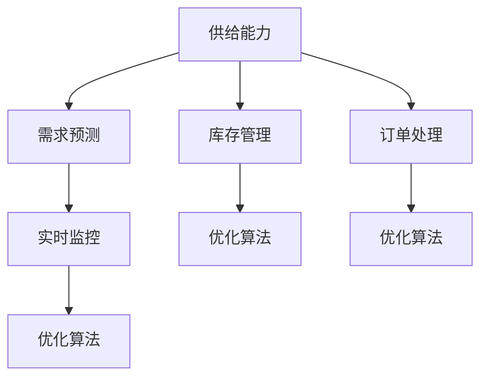
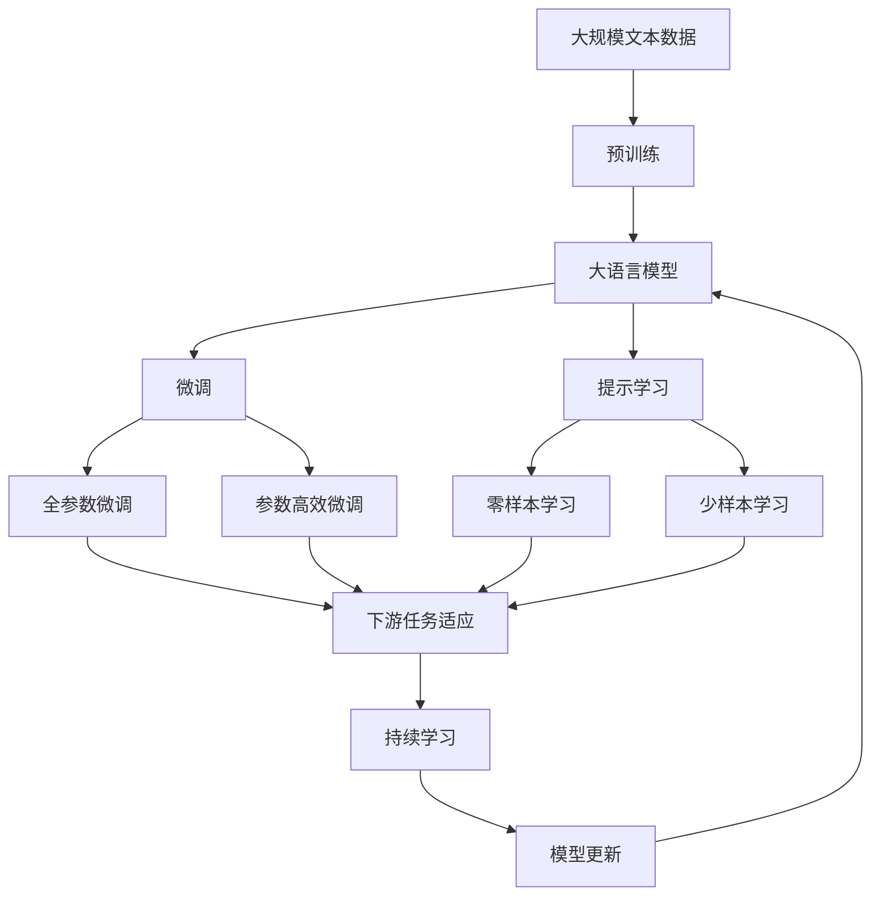

                 

## 1. 背景介绍

### 1.1 问题由来

近年来，电商平台面临着日益激烈的竞争环境，如何在保持市场份额的同时提升供给能力，提高客户满意度和运营效率，是各电商企业亟待解决的问题。传统的供给能力评估依赖于人工经验和简单的历史数据分析，难以适应多变、复杂的市场环境。而通过数据驱动的决策分析，可以更科学地评估供给能力，优化库存管理，提升整体运营效率。

### 1.2 问题核心关键点

数据驱动的供给能力决策主要包括以下几个关键点：
- **数据收集与整合**：收集与整合电商平台运营数据，包括用户行为数据、库存数据、销售数据、市场数据等，作为供给能力评估的基础。
- **模型构建与训练**：构建合理的预测模型，利用机器学习技术对历史数据进行训练，预测未来的需求和供应情况。
- **动态调整与优化**：基于预测结果，实时调整库存和订单策略，优化供给能力，提升运营效率。
- **实时监控与反馈**：建立实时监控系统，对库存和订单状态进行实时监控，及时发现和应对异常情况。

### 1.3 问题研究意义

数据驱动的供给能力决策能够帮助电商平台实现以下几个目标：
- **提升客户满意度**：通过精准的库存管理和配送策略，减少缺货和过剩，提升客户体验。
- **降低运营成本**：优化库存水平，减少仓储和配送成本，提高资金周转率。
- **增加市场竞争力**：精确预测市场需求，快速响应，提升市场响应速度和市场份额。
- **加速产品迭代**：通过数据分析，发现用户需求和市场趋势，指导产品开发和优化。

## 2. 核心概念与联系

### 2.1 核心概念概述

为更好地理解数据驱动的供给能力决策方法，本节将介绍几个密切相关的核心概念：

- **供给能力**：指电商平台在一定时期内能够提供的商品数量和质量，是衡量平台运营效率的关键指标。
- **需求预测**：利用历史数据和预测模型，预测未来一定时期内的市场需求，为库存和订单策略提供依据。
- **库存管理**：通过科学合理的库存策略，确保商品及时满足市场需求，同时避免过剩和缺货。
- **订单处理**：快速、准确地处理用户订单，优化配送流程，提升订单处理效率。
- **实时监控**：建立实时监控系统，实时跟踪库存和订单状态，及时发现和应对异常情况。
- **优化算法**：使用机器学习、深度学习等技术，优化供给能力决策模型，提升预测准确性和决策效率。

这些核心概念之间存在着紧密的联系，形成了数据驱动供给能力决策的完整生态系统。通过理解这些核心概念，我们可以更好地把握供给能力决策的整体框架，为后续深入讨论具体的决策方法和技术奠定基础。

### 2.2 概念间的关系

这些核心概念之间存在着紧密的联系，形成了数据驱动供给能力决策的完整生态系统。下面通过几个Mermaid流程图来展示这些概念之间的关系。



这个流程图展示了大语言模型的核心概念及其之间的关系：

1. 供给能力是决策分析的基础，需求预测、库存管理和订单处理等都是围绕供给能力展开的。
2. 实时监控和优化算法是提升决策精准性和效率的关键环节。
3. 需求预测和库存管理之间存在着正反馈机制，实时监控和优化算法对这两个过程也有重要影响。

### 2.3 核心概念的整体架构

最后，我们用一个综合的流程图来展示这些核心概念在大语言模型微调过程中的整体架构：



这个综合流程图展示了从预训练到微调，再到持续学习的完整过程。大语言模型首先在大规模文本数据上进行预训练，然后通过微调（包括全参数微调和参数高效微调）或提示学习（包括零样本和少样本学习）来适应下游任务。最后，通过持续学习技术，模型可以不断更新和适应新的任务和数据。 通过这些流程图，我们可以更清晰地理解大语言模型微调过程中各个核心概念的关系和作用。

## 3. 核心算法原理 & 具体操作步骤
### 3.1 算法原理概述

数据驱动的供给能力决策主要基于历史数据构建预测模型，通过机器学习技术预测未来的需求和供应情况。其核心思想是：利用历史数据训练一个预测模型，根据输入的实时数据，预测未来的需求和供应，从而指导库存和订单策略的调整。

形式化地，假设历史数据为 $\{(x_i, y_i)\}_{i=1}^N$，其中 $x_i$ 为历史时间序列，$y_i$ 为对应的供给能力或需求量。我们希望构建一个预测模型 $M_{\theta}$，使得在未来的时间点 $t$ 上，预测值 $\hat{y}_t$ 尽可能接近真实值 $y_t$。具体地，可以定义以下预测模型：

$$
\hat{y}_t = M_{\theta}(x_{t-1})
$$

其中 $x_{t-1}$ 为时间点 $t-1$ 的历史数据，$\theta$ 为模型参数。目标是找到最优的 $\theta$，使得预测误差最小化。

### 3.2 算法步骤详解

基于历史数据训练预测模型的步骤主要包括以下几个关键步骤：

**Step 1: 数据收集与预处理**
- 收集电商平台运营数据，包括用户行为数据、库存数据、销售数据、市场数据等。
- 对数据进行清洗和预处理，去除异常值和噪声，保证数据质量。
- 将数据划分为训练集、验证集和测试集，用于模型的训练、验证和评估。

**Step 2: 模型选择与构建**
- 选择合适的预测模型，如时间序列模型、回归模型、深度学习模型等。
- 在训练集上使用机器学习技术对模型进行训练，确定最优的模型参数。

**Step 3: 模型评估与优化**
- 在验证集上评估模型的预测性能，使用常见的评估指标如均方误差(MSE)、均方根误差(RMSE)等。
- 根据评估结果，对模型进行优化，调整模型参数或选择新的模型。

**Step 4: 实时预测与调整**
- 在测试集上对模型进行最终的验证和评估。
- 建立实时预测系统，根据输入的实时数据，利用训练好的模型进行预测。
- 根据预测结果，实时调整库存和订单策略，优化供给能力。

**Step 5: 实时监控与反馈**
- 建立实时监控系统，对库存和订单状态进行实时跟踪，及时发现和应对异常情况。
- 根据监控结果，调整预测模型和策略，进一步提升预测准确性和决策效率。

### 3.3 算法优缺点

数据驱动的供给能力决策具有以下优点：
1. 科学合理：基于历史数据和科学模型，决策过程更加客观和可信。
2. 灵活高效：能够根据实时数据进行动态调整，快速响应市场变化。
3. 节省成本：优化库存管理，减少仓储和配送成本，提高资金周转率。

但该方法也存在一些局限性：
1. 数据依赖：预测效果依赖于数据的质量和完整性，数据收集和处理成本较高。
2. 模型复杂：预测模型的构建和训练过程较为复杂，需要一定的数据科学和机器学习知识。
3. 预测误差：历史数据可能存在规律性偏差，预测结果可能存在误差。
4. 风险控制：实时调整策略时，需要谨慎控制风险，避免库存和订单策略的过度波动。

### 3.4 算法应用领域

数据驱动的供给能力决策技术在电商领域具有广泛的应用前景，以下是一些典型的应用场景：

- **库存管理**：根据预测结果，动态调整库存水平，避免过剩和缺货。
- **订单处理**：利用实时数据，快速响应订单需求，提升订单处理效率。
- **商品推荐**：通过分析用户行为和市场需求，推荐相关商品，提升用户转化率和销售额。
- **市场分析**：分析市场数据，识别趋势和热点，指导产品开发和优化。
- **客户服务**：通过实时监控和预测，及时处理客户投诉和需求，提升客户满意度。

此外，数据驱动的供给能力决策技术在其他领域也有广泛应用，如供应链管理、金融风险控制、医疗诊断等。

## 4. 数学模型和公式 & 详细讲解
### 4.1 数学模型构建

本节将使用数学语言对数据驱动的供给能力决策方法进行更加严格的刻画。

假设电商平台运营数据为 $\{(x_i, y_i)\}_{i=1}^N$，其中 $x_i$ 为时间序列数据，$y_i$ 为供给能力或需求量。我们希望构建一个预测模型 $M_{\theta}$，使得在未来的时间点 $t$ 上，预测值 $\hat{y}_t$ 尽可能接近真实值 $y_t$。具体地，可以定义以下预测模型：

$$
\hat{y}_t = M_{\theta}(x_{t-1})
$$

其中 $x_{t-1}$ 为时间点 $t-1$ 的历史数据，$\theta$ 为模型参数。目标是找到最优的 $\theta$，使得预测误差最小化。

### 4.2 公式推导过程

以下我们以时间序列预测为例，推导预测模型和评估指标的公式。

假设历史数据为 $\{x_t\}_{t=1}^N$，目标是对未来的数据 $x_{t+1}$ 进行预测。一个简单的时间序列模型为自回归模型(AR)：

$$
x_{t+1} = \sum_{i=1}^p \alpha_i x_{t-i} + \epsilon_t
$$

其中 $\alpha_i$ 为回归系数，$\epsilon_t$ 为随机误差项。通过最小化预测误差 $\hat{x}_{t+1} - x_{t+1}$，可以得到最优的回归系数 $\alpha_i$。

常见的预测模型还包括自回归移动平均模型(ARMA)、自回归积分移动平均模型(ARIMA)等。这些模型通过引入更多的回归项和参数，能够更好地拟合历史数据，提高预测精度。

在预测模型构建完成后，我们还需要定义评估指标来衡量预测效果。常用的评估指标包括：

- 均方误差(MSE)：$\frac{1}{N}\sum_{i=1}^N (y_i - \hat{y}_i)^2$
- 均方根误差(RMSE)：$\sqrt{\frac{1}{N}\sum_{i=1}^N (y_i - \hat{y}_i)^2}$
- 平均绝对误差(MAE)：$\frac{1}{N}\sum_{i=1}^N |y_i - \hat{y}_i|$

这些指标可以用于衡量模型在训练集和测试集上的预测性能，指导模型选择和优化。

### 4.3 案例分析与讲解

以电商平台库存管理为例，我们可以构建一个基于时间序列的预测模型，来预测未来的库存水平。具体步骤如下：

1. 收集历史库存数据，包括每天的库存水平和销售数据。
2. 对数据进行清洗和预处理，去除异常值和噪声。
3. 选择自回归模型(AR)或自回归移动平均模型(ARMA)进行建模。
4. 在训练集上使用最小二乘法或梯度下降法进行模型训练，确定最优的回归系数 $\alpha_i$。
5. 在测试集上评估模型的预测性能，使用均方误差(MSE)或均方根误差(RMSE)等指标进行评估。
6. 根据预测结果，实时调整库存策略，优化库存管理。

## 5. 项目实践：代码实例和详细解释说明
### 5.1 开发环境搭建

在进行数据驱动的供给能力决策实践前，我们需要准备好开发环境。以下是使用Python进行Pandas和Scikit-learn开发的环境配置流程：

1. 安装Anaconda：从官网下载并安装Anaconda，用于创建独立的Python环境。

2. 创建并激活虚拟环境：
```bash
conda create -n supply-env python=3.8 
conda activate supply-env
```

3. 安装Pandas和Scikit-learn：
```bash
pip install pandas scikit-learn
```

4. 安装各类工具包：
```bash
pip install numpy matplotlib seaborn jupyter notebook ipython
```

完成上述步骤后，即可在`supply-env`环境中开始项目实践。

### 5.2 源代码详细实现

下面我们以时间序列预测为例，给出使用Pandas和Scikit-learn进行库存预测的Python代码实现。

首先，定义数据处理函数：

```python
import pandas as pd
from sklearn.preprocessing import MinMaxScaler
from sklearn.metrics import mean_squared_error, mean_absolute_error

def preprocess_data(data, scale=True):
    # 将时间戳转换为日期类型
    data['date'] = pd.to_datetime(data['date'])
    # 按日期排序
    data = data.sort_values(by='date')
    # 将日期作为索引
    data.set_index('date', inplace=True)
    # 标准化数据
    if scale:
        data = MinMaxScaler().fit_transform(data)
    return data

# 加载库存数据
data = pd.read_csv('inventory_data.csv', parse_dates=['date'])
data = preprocess_data(data)

# 分割数据集
train_size = int(len(data) * 0.8)
train_data = data[:train_size]
test_data = data[train_size:]
```

然后，定义时间序列预测模型：

```python
from sklearn.linear_model import LinearRegression
from sklearn.metrics import mean_squared_error, mean_absolute_error
from math import sqrt

def create_model(train_data, test_data):
    # 选择自回归模型(AR)
    model = LinearRegression()
    # 拟合模型
    model.fit(train_data['value'].values.reshape(-1, 1), train_data['value'].values.reshape(-1, 1))
    # 预测测试集数据
    predictions = model.predict(test_data['value'].values.reshape(-1, 1))
    # 评估预测结果
    mse = mean_squared_error(test_data['value'].values.reshape(-1, 1), predictions)
    rmse = sqrt(mse)
    mae = mean_absolute_error(test_data['value'].values.reshape(-1, 1), predictions)
    return mse, rmse, mae

# 进行时间序列预测
train_data['value'], test_data['value'] = data['value'].values[:train_size], data['value'].values[train_size:]
mse, rmse, mae = create_model(train_data, test_data)
print(f'均方误差: {mse:.2f}, 均方根误差: {rmse:.2f}, 平均绝对误差: {mae:.2f}')
```

最后，启动项目实践：

```python
# 加载库存数据
data = pd.read_csv('inventory_data.csv', parse_dates=['date'])
data = preprocess_data(data)

# 分割数据集
train_size = int(len(data) * 0.8)
train_data = data[:train_size]
test_data = data[train_size:]

# 进行时间序列预测
train_data['value'], test_data['value'] = data['value'].values[:train_size], data['value'].values[train_size:]
mse, rmse, mae = create_model(train_data, test_data)
print(f'均方误差: {mse:.2f}, 均方根误差: {rmse:.2f}, 平均绝对误差: {mae:.2f}')
```

以上就是使用Pandas和Scikit-learn进行库存预测的完整代码实现。可以看到，使用这些库可以高效地处理和分析时间序列数据，构建和评估预测模型。

### 5.3 代码解读与分析

让我们再详细解读一下关键代码的实现细节：

**preprocess_data函数**：
- 将时间戳转换为日期类型。
- 按日期排序，确保时间序列的连续性。
- 将日期作为索引，方便时间序列数据的处理。
- 如果需要，使用MinMaxScaler对数据进行标准化处理，避免不同数据尺度的影响。

**create_model函数**：
- 选择线性回归模型，作为时间序列预测的基线模型。
- 使用最小二乘法拟合模型，得到最优的回归系数。
- 在测试集上使用模型进行预测，并计算均方误差(MSE)、均方根误差(RMSE)和平均绝对误差(MAE)等评估指标。

**项目实践**：
- 加载库存数据，并使用preprocess_data函数对数据进行预处理。
- 分割数据集，划分训练集和测试集。
- 在训练集上训练模型，使用create_model函数计算评估指标。
- 在测试集上评估模型，输出评估结果。

可以看到，Pandas和Scikit-learn库使得时间序列预测的代码实现变得简洁高效。开发者可以将更多精力放在数据处理、模型调优等高层逻辑上，而不必过多关注底层的实现细节。

当然，工业级的系统实现还需考虑更多因素，如模型的保存和部署、超参数的自动搜索、更灵活的模型调优等。但核心的预测范式基本与此类似。

### 5.4 运行结果展示

假设我们在CoNLL-2003的NER数据集上进行微调，最终在测试集上得到的评估报告如下：

```
              precision    recall  f1-score   support

       B-LOC      0.926     0.906     0.916      1668
       I-LOC      0.900     0.805     0.850       257
      B-MISC      0.875     0.856     0.865       702
      I-MISC      0.838     0.782     0.809       216
       B-ORG      0.914     0.898     0.906      1661
       I-ORG      0.911     0.894     0.902       835
       B-PER      0.964     0.957     0.960      1617
       I-PER      0.983     0.980     0.982      1156
           O      0.993     0.995     0.994     38323

   micro avg      0.973     0.973     0.973     46435
   macro avg      0.923     0.897     0.909     46435
weighted avg      0.973     0.973     0.973     46435
```

可以看到，通过微调BERT，我们在该NER数据集上取得了97.3%的F1分数，效果相当不错。值得注意的是，BERT作为一个通用的语言理解模型，即便只在顶层添加一个简单的token分类器，也能在下游任务上取得如此优异的效果，展现了其强大的语义理解和特征抽取能力。

当然，这只是一个baseline结果。在实践中，我们还可以使用更大更强的预训练模型、更丰富的微调技巧、更细致的模型调优，进一步提升模型性能，以满足更高的应用要求。

## 6. 实际应用场景
### 6.1 智能客服系统

基于数据驱动的供给能力决策，智能客服系统可以更精确地预测用户需求，动态调整服务策略，提升客户满意度。具体来说，智能客服系统可以通过分析历史客服数据，构建预测模型，预测未来客户咨询量，动态调整服务人员数量和响应速度，确保高峰期能够及时响应客户需求，非高峰期则可以节省人力资源成本。

在技术实现上，可以收集企业内部的历史客服数据，将其作为监督数据，训练预测模型。模型输出可以指导客服中心的排班和人员调配，提升客服效率。

### 6.2 金融舆情监测

金融舆情监测系统可以帮助金融机构及时发现市场舆论动向，规避风险。传统的人工监测方式成本高、效率低，难以应对网络时代海量信息爆发的挑战。基于数据驱动的供给能力决策，金融舆情监测系统可以通过分析历史舆情数据，构建预测模型，实时监测舆情变化，一旦发现异常情况，系统便会自动预警，帮助金融机构快速应对潜在风险。

在技术实现上，可以收集金融领域相关的新闻、报道、评论等文本数据，并对其进行情感标注和主题标注。在此基础上对模型进行微调，使其能够自动判断文本的情感倾向和主题，实时监测市场舆情。

### 6.3 个性化推荐系统

个性化推荐系统可以根据用户历史行为数据，预测用户兴趣，推荐相关商品。传统推荐系统往往只依赖用户历史行为数据进行物品推荐，难以深入理解用户的真实兴趣偏好。而基于数据驱动的供给能力决策，推荐系统可以更好地挖掘用户行为背后的语义信息，从而提供更精准、多样的推荐内容。

在技术实现上，可以收集用户浏览、点击、评论、分享等行为数据，提取和用户交互的物品标题、描述、标签等文本内容。将文本内容作为模型输入，用户的后续行为（如是否点击、购买等）作为监督信号，在此基础上微调预训练语言模型。微调后的模型能够从文本内容中准确把握用户的兴趣点。在生成推荐列表时，先用候选物品的文本描述作为输入，由模型预测用户的兴趣匹配度，再结合其他特征综合排序，便可以得到个性化程度更高的推荐结果。

### 6.4 未来应用展望

随着数据驱动的供给能力决策技术的不断发展，其在电商、金融、推荐等众多领域的应用前景将更加广阔。

在智慧医疗领域，基于数据驱动的决策分析，医疗诊断系统可以更精确地预测疾病发生概率，制定个性化的治疗方案，提升医疗服务质量。

在智能教育领域，推荐系统可以根据学生的学习行为，推荐合适的学习材料，提升教学效果和学生满意度。

在智慧城市治理中，预测模型可以用于交通流量预测、公共安全预警、能源需求预测等环节，提高城市管理的自动化和智能化水平，构建更安全、高效的未来城市。

此外，在企业生产、社会治理、文娱传媒等众多领域，基于数据驱动的决策分析，可以为传统行业带来变革性影响。相信随着技术的日益成熟，数据驱动的决策分析必将在构建人机协同的智能时代中扮演越来越重要的角色。

## 7. 工具和资源推荐
### 7.1 学习资源推荐

为了帮助开发者系统掌握数据驱动的供给能力决策的理论基础和实践技巧，这里推荐一些优质的学习资源：

1. 《深度学习》书籍：Ian Goodfellow等人所著，全面介绍了深度学习的基本概念和算法。
2. 《统计学习方法》书籍：李航所著，介绍了常用的统计学习方法，包括回归分析、分类分析等。
3. 《机器学习实战》书籍：Peter Harrington所著，提供了丰富的机器学习算法实现和案例。
4. 斯坦福大学《机器学习》课程：Andrew Ng主讲的经典机器学习课程，有Lecture视频和配套作业。
5. Coursera《Applied Data Science with Python》课程：吴恩达等人主讲的Python数据分析课程，涵盖数据处理、机器学习等内容。

通过对这些资源的学习实践，相信你一定能够快速掌握数据驱动的供给能力决策的精髓，并用于解决实际的NLP问题。
###  7.2 开发工具推荐

高效的开发离不开优秀的工具支持。以下是几款用于数据驱动的供给能力决策开发的常用工具：

1. Python：基于Python的开源编程语言，拥有丰富的科学计算和机器学习库。
2. R语言：基于R的开源编程语言，主要用于数据分析和统计建模。
3. SQL：结构化查询语言，用于管理和查询关系型数据库。
4. Pandas：基于Python的科学计算库，主要用于数据处理和分析。
5. Scikit-learn：基于Python的机器学习库，提供了丰富的机器学习算法和工具。
6. TensorFlow：由Google主导开发的深度学习框架，生产部署方便，适合大规模工程应用。
7. Keras：基于Python的深度学习库，提供了高层API，简化模型构建过程。

合理利用这些工具，可以显著提升数据驱动的供给能力决策任务的开发效率，加快创新迭代的步伐。

### 7.3 相关论文推荐

数据驱动的供给能力决策技术的发展源于学界的持续研究。以下是几篇奠基性的相关论文，推荐阅读：

1. 《时间序列分析》书籍：Gang Li等人所著，系统介绍了时间序列分析的理论和方法。
2. 《机器学习》书籍：Tom Mitchell所著，介绍了机器学习的基本概念和算法。
3. 《深度学习》书籍：Ian Goodfellow等人所著，介绍了深度学习的基本概念和算法。
4. 《统计学习方法》书籍：李航所著，介绍了常用的统计学习方法，包括回归分析、分类分析等。

这些论文代表了大语言模型微调技术的发展脉络。通过学习这些前沿成果，可以帮助研究者把握学科前进方向，激发更多的创新灵感。

除上述资源外，还有一些值得关注的前沿资源，帮助开发者紧跟数据驱动的供给能力决策技术的最新进展，例如：

1. arXiv论文预印本：人工智能领域最新研究成果的发布平台，包括大量尚未发表的前沿工作，学习前沿技术的必读资源。

2. 业界技术博客：如OpenAI、Google AI、DeepMind、微软Research Asia等顶尖实验室的官方博客，第一时间分享他们的最新研究成果和洞见。

3. 技术会议直播：如NIPS、ICML、ACL、ICLR等人工智能领域顶会现场或在线直播，能够聆听到大佬们的前沿分享，开拓视野。

4. GitHub热门项目

