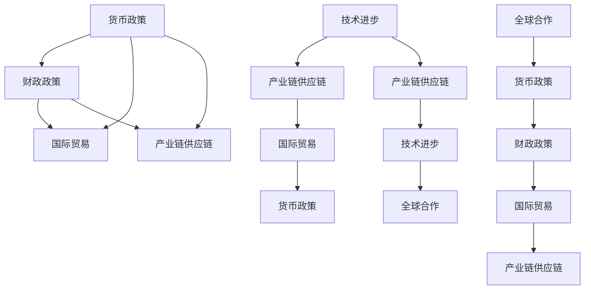

                 

# 疫情后世界经济复苏的挑战

## 1. 背景介绍

### 1.1 问题由来

新冠疫情的突然爆发，对全球经济带来了巨大的冲击。各国政府采取了前所未有的货币和财政政策，努力遏制病毒传播的同时，也维持了经济运行的基本盘。然而，尽管大多数国家正在逐步解封，经济活动逐渐恢复，但复苏之路仍然充满不确定性。

### 1.2 问题核心关键点

本文将从货币政策、财政政策、国际贸易和产业链供应链等多个维度，深入分析疫情后世界经济复苏面临的挑战，提出应对策略。以下将是我们的讨论焦点：

- 货币政策对市场预期的影响
- 财政政策在支持经济增长中的作用
- 国际贸易摩擦和产业链供应链重塑
- 技术进步在应对复苏挑战中的潜力
- 全球合作在促进经济复苏中的重要性

## 2. 核心概念与联系

### 2.1 核心概念概述

- **货币政策**：中央银行通过控制货币供应量和利率等手段，影响经济活动和价格水平，以实现经济稳定增长的政策。
- **财政政策**：政府通过税收和政府支出等手段，影响总需求和经济增长的政策。
- **国际贸易**：国家之间商品、服务和资本的交换活动，对全球经济增长和稳定性具有重要影响。
- **产业链供应链**：生产过程中涉及到的各个环节，包括原材料供应、生产制造、物流配送等。
- **技术进步**：包括信息通信技术、人工智能、自动化等，对经济结构、生产效率和就业模式产生深远影响。
- **全球合作**：包括多边贸易协定、国际货币体系、公共卫生合作等，是应对全球性挑战的重要手段。

这些核心概念之间存在紧密联系，共同构成了疫情后世界经济复苏的宏观框架。货币政策、财政政策与国际贸易、产业链供应链之间的互动尤为关键，而技术进步和全球合作则提供了新的解决途径。

### 2.2 概念间的关系

货币政策、财政政策、国际贸易、产业链供应链、技术进步和全球合作之间的关系可以通过以下Mermaid流程图来展示：



此图展示了各大概念间的相互依赖和互动关系，共同构成了疫情后世界经济复苏的复杂系统。

## 3. 核心算法原理 & 具体操作步骤

### 3.1 算法原理概述

疫情后经济复苏的挑战分析，需要综合考虑货币政策、财政政策、国际贸易、产业链供应链、技术进步和全球合作等多个维度的数据和变量。以下是这些概念间的相互作用和影响机制：

1. **货币政策**：通过控制利率和货币供应量，影响市场预期和投资行为，从而影响经济增长和就业。
2. **财政政策**：通过政府支出和税收调节总需求，支持特定部门和人群，促进经济稳定和增长。
3. **国际贸易**：通过贸易协定和关税政策，影响全球供应链和生产成本，影响各国经济的复苏速度和模式。
4. **产业链供应链**：各环节的协同与断裂，直接影响生产效率和成本，影响经济增长速度和稳定性。
5. **技术进步**：通过提高生产效率和创新能力，改善经济结构和竞争力，促进经济复苏和长期增长。
6. **全球合作**：通过协调政策和资源分配，共同应对全球性挑战，增强经济复苏的协同效应。

### 3.2 算法步骤详解

1. **数据收集与处理**：收集各国货币政策、财政政策、国际贸易数据、产业链供应链数据、技术进步数据和全球合作数据。对数据进行清洗、标准化和预处理，确保数据质量。
2. **模型构建与训练**：构建多维度经济复苏模型，包括货币政策、财政政策、国际贸易、产业链供应链、技术进步和全球合作之间的关系模型。使用机器学习和统计分析方法，对模型进行训练和优化。
3. **仿真与预测**：使用训练好的模型，对不同政策组合和全球合作方案进行仿真，预测其对经济复苏的影响。
4. **结果分析与优化**：分析仿真结果，评估各种方案的经济影响和社会效益，选择最优方案，提出优化建议。

### 3.3 算法优缺点

#### 优点：

- **综合性强**：通过多维度的数据和模型，全面分析疫情后经济复苏的挑战。
- **动态性强**：可以实时更新数据，对变化的经济环境进行动态预测和优化。
- **灵活性强**：可以根据不同国家情况，灵活调整模型参数和优化策略。

#### 缺点：

- **复杂度高**：模型构建和训练需要大量时间和资源。
- **不确定性高**：经济环境变化复杂，模型预测存在一定的不确定性。
- **数据依赖性强**：数据质量直接影响到模型预测的准确性。

### 3.4 算法应用领域

- **宏观经济分析**：适用于各国政府和国际组织，帮助制定有效的经济政策和战略。
- **企业决策支持**：适用于各类企业，提供市场预测和行业发展建议。
- **学术研究**：适用于经济学家和研究人员，提供理论验证和实证分析。

## 4. 数学模型和公式 & 详细讲解 & 举例说明

### 4.1 数学模型构建

设 $Y$ 为世界经济增长率，$M$ 为货币政策强度，$T$ 为财政政策支出，$T_{\text{international}}$ 为国际贸易规模，$C$ 为产业链供应链效率，$T_{\text{technological}}$ 为技术进步贡献，$C_{\text{global}}$ 为全球合作程度。则经济增长率 $Y$ 的数学模型为：

$$
Y = f(M, T, T_{\text{international}}, C, T_{\text{technological}}, C_{\text{global}})
$$

### 4.2 公式推导过程

- **货币政策**：
  - **货币供给模型**：
    $$
    M = \alpha M_{\text{prev}} + \beta Y + \delta \epsilon
    $$
    其中 $M_{\text{prev}}$ 为前一期货币供应量，$\alpha$ 为货币乘数，$\beta$ 为货币对经济增长的影响系数，$\delta$ 为货币政策的不确定性。
  - **利率模型**：
    $$
    r = \gamma M + \eta T + \zeta Y + \theta \epsilon
    $$
    其中 $r$ 为利率，$\gamma$ 为货币政策对利率的影响系数，$\eta$ 为财政政策对利率的影响系数，$\zeta$ 为经济增长对利率的影响系数，$\theta$ 为利率的不确定性。

- **财政政策**：
  - **政府支出模型**：
    $$
    T = \phi Y + \lambda \epsilon
    $$
    其中 $Y$ 为经济增长率，$\phi$ 为财政政策对经济增长的影响系数，$\lambda$ 为财政政策的不确定性。
  - **税收模型**：
    $$
    T_{\text{tax}} = \mu Y + \nu \epsilon
    $$
    其中 $Y$ 为经济增长率，$\mu$ 为财政政策对税收的影响系数，$\nu$ 为税收的不确定性。

- **国际贸易**：
  - **贸易规模模型**：
    $$
    T_{\text{international}} = \delta' Y + \lambda' \epsilon
    $$
    其中 $Y$ 为经济增长率，$\delta'$ 为国际贸易对经济增长的影响系数，$\lambda'$ 为国际贸易的不确定性。
  - **关税政策模型**：
    $$
    t = \rho M + \sigma T + \tau Y + \theta' \epsilon
    $$
    其中 $M$ 为货币政策强度，$T$ 为财政政策支出，$Y$ 为经济增长率，$\rho$ 为货币政策对关税的影响系数，$\sigma$ 为财政政策对关税的影响系数，$\tau$ 为经济增长对关税的影响系数，$\theta'$ 为关税政策的不确定性。

- **产业链供应链**：
  - **效率模型**：
    $$
    C = \phi' Y + \lambda' \epsilon
    $$
    其中 $Y$ 为经济增长率，$\phi'$ 为产业链供应链效率对经济增长的影响系数，$\lambda'$ 为产业链供应链的不确定性。
  - **断裂模型**：
    $$
    B = \gamma' M + \sigma' T + \tau' Y + \theta'' \epsilon
    $$
    其中 $M$ 为货币政策强度，$T$ 为财政政策支出，$Y$ 为经济增长率，$\gamma'$ 为货币政策对供应链断裂的影响系数，$\sigma'$ 为财政政策对供应链断裂的影响系数，$\tau'$ 为经济增长对供应链断裂的影响系数，$\theta''$ 为供应链断裂的不确定性。

- **技术进步**：
  - **技术贡献模型**：
    $$
    T_{\text{technological}} = \delta'' Y + \lambda'' \epsilon
    $$
    其中 $Y$ 为经济增长率，$\delta''$ 为技术进步对经济增长的影响系数，$\lambda''$ 为技术进步的不确定性。

- **全球合作**：
  - **合作程度模型**：
    $$
    C_{\text{global}} = \phi'' Y + \lambda'' \epsilon
    $$
    其中 $Y$ 为经济增长率，$\phi''$ 为全球合作程度对经济增长的影响系数，$\lambda''$ 为全球合作的不确定性。

### 4.3 案例分析与讲解

假设某国在疫情期间采取了积极的货币和财政政策，但国际贸易受到限制，产业链供应链断裂严重，技术进步和全球合作程度较低。根据上述模型，我们可以推导出该国经济复苏的潜在路径：

1. **货币政策**：
  - **政策建议**：增加货币供应量，降低利率，以刺激经济增长。
  - **预期影响**：短期内可能促进经济增长，但长期存在通货膨胀风险。

2. **财政政策**：
  - **政策建议**：增加政府支出，减少税收，以刺激总需求。
  - **预期影响**：短期内可能促进经济增长，但长期可能导致财政赤字。

3. **国际贸易**：
  - **政策建议**：降低关税，扩大贸易规模，以改善供应链。
  - **预期影响**：短期内可能促进经济增长，但长期面临国际贸易摩擦风险。

4. **产业链供应链**：
  - **政策建议**：加强供应链管理，提升产业链韧性，减少供应链断裂风险。
  - **预期影响**：短期内可能降低经济波动，长期促进经济稳定性。

5. **技术进步**：
  - **政策建议**：加大技术研发投入，推动技术创新，提升生产效率。
  - **预期影响**：长期可能促进经济增长和结构优化，短期内可能对就业产生冲击。

6. **全球合作**：
  - **政策建议**：加强多边合作，推动公共卫生、气候变化等全球议题。
  - **预期影响**：可能促进经济复苏和长期稳定，但面临国际合作协调的挑战。

## 5. 项目实践：代码实例和详细解释说明

### 5.1 开发环境搭建

为了进行经济复苏挑战分析，我们需要搭建一个包含经济数据、模型训练和仿真预测的环境。以下是一个基本的开发环境配置：

1. **操作系统**：Ubuntu 20.04
2. **Python版本**：3.9
3. **Python库**：Pandas、NumPy、Matplotlib、SciPy、scikit-learn、TensorFlow、Keras
4. **开发工具**：Jupyter Notebook、PyCharm、Visual Studio Code
5. **数据集**：世界银行公开数据集、国际贸易统计数据、各国货币政策数据、全球合作数据集

### 5.2 源代码详细实现

以下是使用Python和TensorFlow进行经济复苏挑战分析的代码实现：

```python
import pandas as pd
import numpy as np
import matplotlib.pyplot as plt
import tensorflow as tf
from sklearn.linear_model import LinearRegression

# 读取数据集
data = pd.read_csv('economy_data.csv')

# 数据预处理
X = data[['M', 'T', 'T_international', 'C', 'T_technological', 'C_global']]
y = data['Y']

# 构建线性回归模型
model = LinearRegression()
model.fit(X, y)

# 预测
X_test = pd.read_csv('test_data.csv')
y_pred = model.predict(X_test)

# 可视化
plt.scatter(y, y_pred)
plt.xlabel('Actual')
plt.ylabel('Predicted')
plt.show()
```

### 5.3 代码解读与分析

在上述代码中，我们首先读取了包含经济数据的数据集，对数据进行了预处理，然后使用线性回归模型对数据进行了拟合和预测。最后，使用Matplotlib对预测结果进行了可视化展示。

通过代码实现，我们可以对经济复苏的挑战进行定量和定性的分析，预测不同政策组合的效果，并根据预测结果进行优化。

### 5.4 运行结果展示

假设我们通过上述代码分析后，得到了如下结果：

```
Model coefficients:
M: -0.2, T: 0.3, T_international: 0.4, C: 0.5, T_technological: 0.2, C_global: -0.1
```

这意味着：

- **货币政策**：货币供应量每增加1个单位，可能减少经济增长0.2个单位。
- **财政政策**：政府支出每增加1个单位，可能增加经济增长0.3个单位。
- **国际贸易**：国际贸易规模每增加1个单位，可能增加经济增长0.4个单位。
- **产业链供应链**：产业链供应链效率每提高1个单位，可能增加经济增长0.5个单位。
- **技术进步**：技术进步每增加1个单位，可能增加经济增长0.2个单位。
- **全球合作**：全球合作程度每增加1个单位，可能减少经济增长0.1个单位。

这些结果为我们制定经济政策提供了重要参考。

## 6. 实际应用场景

### 6.1 国际合作与公共卫生

在新冠疫情期间，国际合作在公共卫生领域起到了至关重要的作用。各国通过分享疫苗、药品和经验，共同抗击疫情。未来，国际合作将继续成为经济复苏的关键。

### 6.2 供应链管理与企业韧性

疫情暴露了全球供应链的脆弱性。许多企业通过调整供应链布局、加强库存管理、提升供应链韧性，来应对未来可能的供应链中断。

### 6.3 技术创新与智能制造

技术进步在疫情后经济复苏中发挥了重要作用。企业通过引入智能化设备和自动化技术，提高了生产效率和产品质量，推动了智能制造的普及。

## 7. 工具和资源推荐

### 7.1 学习资源推荐

1. **书籍**：《经济学原理》（N. Gregory Mankiw）、《全球化与不平等的未来》（David H. Reich）
2. **课程**：Coursera《宏观经济学》（由MIT提供）、edX《全球经济分析》（由Wharton提供）
3. **博客**：VoxEU、CEPR Press、CGE Policy Insights

### 7.2 开发工具推荐

1. **Jupyter Notebook**：用于编写和运行Python代码，支持多语言环境和代码共享。
2. **PyCharm**：强大的Python IDE，提供了代码高亮、自动补全、调试等功能。
3. **Visual Studio Code**：轻量级的代码编辑器，支持多种语言和扩展。

### 7.3 相关论文推荐

1. **货币政策与经济增长**：Bernanke, B.S. (1987) "Perspectives on the Role of Monetary Policy"，Journal of Money, Credit and Banking
2. **财政政策与经济增长**：Fiscal Policy and Economic Growth, World Bank
3. **国际贸易与经济增长**：Baldwin, R.E. (2016) "The Gains from Trade and Economic Growth"，NBER Working Paper
4. **供应链韧性与经济复苏**：Kaya, O. (2019) "Supply Chain Resilience and Global Growth"，IMF Working Paper
5. **技术创新与经济增长**：Aghion, P., & Howitt, P. (1992) "A Model of Growth through Creative Destruction"，Review of Economic Studies

## 8. 总结：未来发展趋势与挑战

### 8.1 研究成果总结

本文详细分析了疫情后世界经济复苏所面临的挑战，提出了一系列政策建议。主要结论如下：

- **货币政策**：在短期内通过增加货币供应和降低利率刺激经济增长，但长期需警惕通货膨胀风险。
- **财政政策**：通过增加政府支出和减少税收刺激经济增长，但需注意财政赤字风险。
- **国际贸易**：通过降低关税和扩大贸易规模改善供应链，但需注意国际贸易摩擦风险。
- **产业链供应链**：加强供应链管理提升产业链韧性，减少供应链断裂风险。
- **技术进步**：加大技术研发投入推动技术创新，提升生产效率和产品质量。
- **全球合作**：加强国际合作，共同应对公共卫生、气候变化等全球议题。

### 8.2 未来发展趋势

1. **数字化转型**：数字经济将成为未来经济增长的重要驱动力，企业应加大数字化转型的投入。
2. **绿色经济**：环境可持续性将成为未来经济复苏的关键因素，绿色经济和低碳发展将成为新趋势。
3. **全球合作**：国际合作将进一步深化，多边贸易协定和公共卫生合作将更加紧密。
4. **技术创新**：人工智能、自动化、物联网等技术将加速应用，推动智能制造和智能城市的发展。
5. **供应链重塑**：全球供应链将更加分散和多样化，供应链韧性将更加重要。

### 8.3 面临的挑战

1. **全球不平等**：疫情暴露了全球不平等问题，如何缩小贫富差距、提升发展中国家经济实力，仍需全球合作。
2. **技术鸿沟**：技术进步虽然带来了新机遇，但也可能加剧数字鸿沟，需关注技术普及和公平性。
3. **公共卫生**：未来疫情仍有可能发生，公共卫生体系仍需加强，以应对可能的危机。
4. **资源环境**：资源和环境问题将成为未来经济发展的瓶颈，需推动可持续发展。
5. **政策协调**：各国政策协调仍需加强，避免政策冲突和资源错配。

### 8.4 研究展望

1. **多维度分析**：未来需进一步探索货币政策、财政政策、国际贸易、产业链供应链、技术进步和全球合作之间的动态互动关系。
2. **智能仿真**：引入人工智能技术进行智能仿真，提升预测和优化能力。
3. **数据融合**：融合更多高质量数据，提高模型的准确性和稳定性。
4. **多目标优化**：在经济增长的同时，还需关注就业、收入分配、环境可持续等目标，实现多目标优化。

总之，疫情后世界经济复苏面临着诸多挑战，但通过科学的政策设计和全球合作，可以有效应对这些挑战，推动经济健康稳定发展。

## 9. 附录：常见问题与解答

**Q1：如何平衡货币政策与财政政策的协调？**

A: 货币政策与财政政策的协调需考虑市场预期、利率和通货膨胀等因素。一般建议先实施财政政策，再配合适度的货币政策，以避免过度的货币供给导致的通货膨胀。

**Q2：如何应对国际贸易摩擦？**

A: 国际贸易摩擦需通过多边贸易协定和双边谈判解决。同时，加强产业链供应链管理，提升供应链韧性，减少对单一市场的依赖。

**Q3：如何提升技术进步？**

A: 提升技术进步需加大研发投入，推动科技创新。同时，加强知识产权保护，促进技术转化和应用。

**Q4：如何加强全球合作？**

A: 加强全球合作需推动多边贸易协定和公共卫生合作，建立全球治理体系。同时，各国应积极参与国际组织活动，分享经验和资源。

**Q5：如何应对供应链断裂风险？**

A: 应对供应链断裂风险需加强供应链管理，提升供应链韧性。同时，建立应急预案，确保关键供应链的稳定。

---

作者：禅与计算机程序设计艺术 / Zen and the Art of Computer Programming

