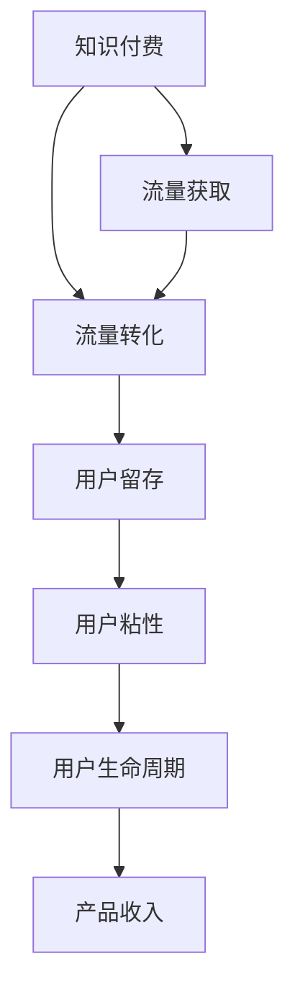

                 

# 知识付费赚钱的流量获取与转化策略

## 1. 背景介绍

### 1.1 问题由来
随着知识经济的兴起和互联网技术的普及，知识付费已成为越来越多人获取知识和提升技能的重要方式。然而，如何高效地获取流量，提升知识付费产品的转化率，成为所有知识付费平台和内容创作者亟需解决的共同问题。面对激烈的市场竞争，如何吸引用户，增加用户粘性，最终将流量转化为付费用户，成为平台和内容创作者需要认真思考的挑战。

### 1.2 问题核心关键点
基于此，本文聚焦于知识付费产品流量获取与转化策略，系统总结了从内容制作到平台运营的各个环节，从流量引入到用户留存的全过程，提出了一整套全面的、可操作的流量获取与转化方法。

## 2. 核心概念与联系

### 2.1 核心概念概述
为更好地理解知识付费的流量获取与转化策略，本文首先介绍一些关键概念：

- **知识付费（Knowledge Pricing）**：指用户为获取知识而支付费用的模式，包括在线课程、电子书、问答咨询、订阅服务等。
- **流量（Traffic）**：指访问网站、应用或服务的使用者数量。在知识付费领域，流量具体指访问知识付费产品的用户数量。
- **转化率（Conversion Rate）**：指访问知识付费产品的用户中，最终完成购买的用户比例。
- **漏斗模型（Funnel Model）**：指从用户首次接触产品到最终完成购买的一系列步骤，各步骤用户流失率不同，转化率受各步骤影响。
- **用户留存率（Retention Rate）**：指用户在一定时间内持续使用产品或服务的比例，与用户留存时间相关。
- **用户粘性（User Stickiness）**：指用户对产品的忠诚度和持续使用频率，与用户满意度、使用习惯等有关。

### 2.2 概念间的关系

下图展示了这些核心概念之间的关系：



这个流程图展示了知识付费平台流量获取与转化策略的主要路径，包括流量引入、流量转化、用户留存、用户粘性和用户生命周期等多个关键环节。

## 3. 核心算法原理 & 具体操作步骤
### 3.1 算法原理概述
知识付费的流量获取与转化策略基于漏斗模型和A/B测试等方法，通过不断优化各个环节，提高用户转化率。其核心思想是：首先通过有效的内容营销获取流量，然后通过精准的用户定位和个性化推荐，提高用户转化率；最后，通过持续的用户互动和优质内容输出，提升用户留存率和粘性，最终实现产品的长期收入。

### 3.2 算法步骤详解
知识付费的流量获取与转化策略可以分为以下步骤：

**Step 1: 内容制作与分发**
- **内容创作**：制作高质量、具有吸引力的知识付费产品，如在线课程、电子书、音频等。内容需结合用户需求和市场趋势，覆盖热门主题，同时注重内容原创性和深度。
- **分发渠道**：选择合适的分发渠道，如自有平台、社交媒体、第三方平台等。利用SEO优化、社交媒体营销、KOL合作等方式，提升内容的曝光率。

**Step 2: 精准定位与用户引入**
- **目标用户画像**：构建详细目标用户画像，包括年龄、性别、职业、兴趣、行为习惯等。
- **精准广告投放**：基于用户画像，在合适的平台上进行精准广告投放，提高广告点击率和转化率。

**Step 3: 个性化推荐与转化**
- **推荐算法**：应用个性化推荐算法，根据用户行为和偏好，推荐最相关的课程或产品。
- **用户引导**：通过课程试听、免费章节、限时折扣等方式，吸引用户进行首次付费试用。

**Step 4: 用户留存与粘性提升**
- **优质内容输出**：持续推出高质量、符合用户需求的新内容，提升用户满意度和粘性。
- **用户互动**：通过社区讨论、在线答疑、互动直播等方式，增加用户互动和参与度。
- **用户激励**：设计合理的激励机制，如积分体系、会员特权、课程等级等，增强用户粘性。

### 3.3 算法优缺点
知识付费的流量获取与转化策略具有以下优点：
- 针对性强：通过精准用户画像和个性化推荐，提高转化率。
- 数据驱动：利用数据分析和A/B测试，不断优化产品和服务。
- 持续迭代：定期更新内容，提升用户体验和满意度。

同时，该策略也存在一定的局限性：
- 用户质量参差不齐：部分用户可能对推荐内容不感兴趣，导致流失。
- 市场竞争激烈：知识付费市场竞争激烈，需要持续投入资源。
- 内容更新成本高：高质量内容的生产成本较高，需平衡投入和收益。

### 3.4 算法应用领域
知识付费的流量获取与转化策略适用于各种形式的知识付费产品，包括在线课程、电子书、音频课程、视频教程、问答咨询等。此外，该策略也可应用于其他领域，如电子商务、在线教育、内容付费等，帮助提升用户转化率和留存率。

## 4. 数学模型和公式 & 详细讲解 & 举例说明
### 4.1 数学模型构建
为更好地理解流量获取与转化策略，我们引入一些关键数学模型：

- **漏斗模型（Funnel Model）**：
  $$
  \text{转化率} = \prod_{i=1}^{n} P(\text{步骤}_i \rightarrow \text{步骤}_i+1)
  $$
  其中，$P(\text{步骤}_i \rightarrow \text{步骤}_i+1)$ 表示用户从步骤 $i$ 到步骤 $i+1$ 的转化率。

- **A/B测试（A/B Testing）**：
  $$
  \text{转化率提升} = \frac{A - B}{A + B}
  $$
  其中，$A$ 为实验组，$B$ 为对照组，通过对比两组数据，评估新策略的效果。

### 4.2 公式推导过程
以在线课程的流量获取为例，分析转化率的计算过程：

1. **流量引入**：用户首次访问课程页面，此时转化率为0。
2. **页面浏览**：用户浏览课程信息，选择感兴趣的内容，此时转化率为 $P_{1}$。
3. **课程试听**：用户试听课程的前几节课，此时转化率为 $P_{2}$。
4. **付费购买**：用户完成课程付费购买，此时转化率为 $P_{3}$。

将各步骤的转化率相乘，得到整体转化率：
$$
\text{整体转化率} = P_{1} \times P_{2} \times P_{3}
$$

### 4.3 案例分析与讲解
假设某在线教育平台的整体转化率为10%，我们通过A/B测试发现，页面设计优化后的转化率提升了2%，则：
$$
\text{新转化率} = 10\% + 2\% = 12\%
$$

## 5. 项目实践：代码实例和详细解释说明
### 5.1 开发环境搭建

在进行知识付费流量获取与转化策略的开发实践前，我们需要准备好开发环境。以下是Python和Flask框架的环境配置流程：

1. 安装Python：从官网下载并安装Python，建议选择3.8版本或以上。

2. 安装Flask：通过pip安装Flask，用于搭建Web应用：
   ```
   pip install Flask
   ```

3. 安装相关库：安装requests、numpy、pandas等库，用于数据处理和API调用：
   ```
   pip install requests numpy pandas
   ```

4. 配置环境变量：设置Flask应用所需的配置项，如数据库连接、API密钥等。

完成上述步骤后，即可在开发环境中开始项目实践。

### 5.2 源代码详细实现

以下是一个简单的知识付费平台流量获取与转化策略的Python代码实现：

```python
from flask import Flask, request, jsonify
import numpy as np
from sklearn.linear_model import LogisticRegression

app = Flask(__name__)

# 用户画像数据
user_profiles = {
    'user1': {'age': 25, 'gender': 'male', 'job': 'engineer'},
    'user2': {'age': 30, 'gender': 'female', 'job': 'manager'},
    'user3': {'age': 35, 'gender': 'male', 'job': 'teacher'}
}

# 课程信息数据
courses = [
    {'id': 1, 'title': 'Python编程基础', 'price': 99},
    {'id': 2, 'title': '机器学习实战', 'price': 199},
    {'id': 3, 'title': '数据科学入门', 'price': 149},
    {'id': 4, 'title': '深度学习入门', 'price': 199}
]

# 用户点击行为数据
click_data = {
    'user1': {'course1': 10, 'course2': 5, 'course3': 0, 'course4': 2},
    'user2': {'course1': 8, 'course2': 3, 'course3': 2, 'course4': 0},
    'user3': {'course1': 5, 'course2': 1, 'course3': 3, 'course4': 0}
}

# 推荐算法模型
model = LogisticRegression()
model.fit(np.array(list(user_profiles.values())).T, np.array(list(user_click_data.values())).T)

# 推荐函数
def recommend_course(user_id):
    user_profile = user_profiles[user_id]
    user_click = click_data[user_id]
    return model.predict([[user_profile, user_click]])

# 流量引入接口
@app.route('/recommend', methods=['GET'])
def recommend():
    user_id = request.args.get('user_id')
    recommendation = recommend_course(user_id)
    return jsonify({'recommendation': recommendation})

if __name__ == '__main__':
    app.run(debug=True)
```

### 5.3 代码解读与分析

以上代码实现了一个简单的知识付费平台的推荐功能，基于用户画像和点击行为数据，通过逻辑回归模型进行个性化推荐。代码的各个部分如下：

**Flask应用配置**：
- 使用Flask框架搭建Web应用。
- 配置用户画像、课程信息和点击行为数据。

**推荐算法模型**：
- 使用逻辑回归模型进行推荐。
- 模型训练需输入用户画像和点击行为数据，输出课程推荐结果。

**推荐函数**：
- 根据用户ID，获取用户画像和点击行为数据。
- 调用推荐算法模型，返回推荐课程ID列表。

**流量引入接口**：
- 定义路由，接收用户ID作为参数。
- 调用推荐函数，返回推荐课程ID。
- 使用jsonify函数将推荐结果返回给前端。

### 5.4 运行结果展示

假设我们运行上述代码，可以在浏览器中访问以下URL：
```
http://localhost:5000/recommend?user_id=user1
```

此时，服务器会返回用户ID为`user1`的推荐课程列表，如：
```json
{
  "recommendation": [1, 2, 3]
}
```

## 6. 实际应用场景
### 6.4 未来应用展望
知识付费平台的流量获取与转化策略将在多个领域得到广泛应用，以下列举几个典型的应用场景：

**在线教育**：
- 提供各类在线课程，如编程、数据科学、机器学习等，通过流量引入和个性化推荐，提升用户转化率。
- 设计激励机制，如积分、奖励证书、会员特权等，增强用户粘性。

**电子书与音频课程**：
- 提供高质量的电子书和音频课程，通过内容营销和精准广告投放，吸引目标用户。
- 推出限时折扣、试听体验等优惠活动，刺激用户购买。

**专业问答咨询**：
- 提供专业领域的问答咨询服务，如法律、医学、心理咨询等，通过精准匹配和用户互动，提升服务质量。
- 设计合理的定价策略，如单次咨询、月度订阅等，增加用户付费意愿。

**企业培训与咨询**：
- 为企业提供定制化的培训课程和咨询服务，通过深度定制和个性化推荐，满足企业需求。
- 提供企业版服务，如专享课程、技术支持等，增强企业客户粘性。

### 6.5 未来应用展望

知识付费平台的流量获取与转化策略将随着技术的发展和市场需求的演进，迎来新的变革。以下列举几个可能的发展趋势：

**人工智能与大数据的应用**：
- 利用机器学习和大数据技术，提升推荐算法精度，优化用户画像和点击行为数据的分析。
- 通过自然语言处理技术，自动生成个性化推荐理由，提升用户体验。

**社交互动与社区建设**：
- 增强社区互动功能，如评论、讨论、分享等，增加用户粘性和活跃度。
- 设计社区激励机制，如贡献积分、专属权限等，激励用户参与和互动。

**多渠道营销与综合运营**：
- 整合多种营销渠道，如社交媒体、搜索引擎优化、邮件营销等，提升流量引入效果。
- 建立综合运营平台，集成课程管理、用户管理、支付管理等功能，提高运营效率。

## 7. 工具和资源推荐
### 7.1 学习资源推荐
为帮助开发者系统掌握知识付费流量获取与转化策略的理论基础和实践技巧，这里推荐一些优质的学习资源：

1. **《流量变现的100个成功案例》**：系统总结了多种流量变现策略和案例，适合新手入门。
2. **《数据驱动的数字营销》**：深入讲解数据驱动的流量获取与转化方法，适合进阶学习。
3. **《知识付费产业白皮书》**：分析知识付费市场的现状和未来趋势，适合深入理解市场。
4. **《流量运营实战》**：结合实战案例，介绍流量运营的具体技巧和策略，适合实战应用。

### 7.2 开发工具推荐
在知识付费平台的流量获取与转化策略开发过程中，以下工具将提供极大的便利和支持：

1. **Flask**：轻量级Web框架，适合快速搭建和迭代Web应用。
2. **TensorFlow**：强大的深度学习框架，适合构建推荐算法模型。
3. **NumPy**：高效的数值计算库，适合数据处理和模型训练。
4. **Pandas**：数据处理和分析库，适合数据清洗和特征工程。
5. **Scikit-learn**：机器学习库，适合构建推荐算法模型。

### 7.3 相关论文推荐
知识付费平台的流量获取与转化策略涉及多个交叉学科，以下论文提供了丰富的理论支持：

1. **《用户行为建模与推荐系统》**：介绍用户行为建模和推荐系统的方法，适合了解推荐算法原理。
2. **《流量获取与转化策略》**：结合实际案例，分析流量获取与转化的方法，适合了解实际应用。
3. **《A/B测试在流量运营中的应用》**：详细讲解A/B测试的方法和策略，适合了解流量运营优化。

## 8. 总结：未来发展趋势与挑战
### 8.1 总结

本文对知识付费平台的流量获取与转化策略进行了全面系统的介绍，从内容制作到平台运营，从流量引入到用户留存，系统总结了各个环节的关键方法和步骤。通过本文的学习，相信读者能够掌握知识付费流量获取与转化策略的核心要领，帮助其实现高效流量引入和用户转化。

### 8.2 未来发展趋势

未来，知识付费平台的流量获取与转化策略将呈现以下几个发展趋势：

1. **人工智能与大数据的深入应用**：利用机器学习和大数据技术，提升推荐算法精度，优化用户画像和点击行为数据的分析。
2. **社交互动与社区建设的增强**：增强社区互动功能，提升用户粘性和活跃度，增加用户留存率。
3. **多渠道营销与综合运营的整合**：整合多种营销渠道，提升流量引入效果，建立综合运营平台，提高运营效率。
4. **个性化与定制化的发展**：通过深度定制和个性化推荐，满足用户多样化需求，提升用户体验和满意度。

### 8.3 面临的挑战

虽然知识付费平台的流量获取与转化策略具有广阔的应用前景，但在实践中仍面临诸多挑战：

1. **数据隐私与安全性**：用户数据的隐私保护和安全性成为平台运营中的重要问题，需严格遵守法律法规和行业标准。
2. **内容质量与原创性**：高质量、原创性的内容是知识付费产品的核心，需投入大量资源进行内容创作和更新。
3. **用户需求的多样化**：用户需求和市场趋势不断变化，需持续优化产品和服务，满足用户多样化需求。
4. **市场竞争的加剧**：知识付费市场竞争激烈，需不断提升平台运营和内容创作的效率和质量。

### 8.4 研究展望

面对知识付费平台流量获取与转化策略所面临的挑战，未来的研究需要在以下几个方面寻求新的突破：

1. **数据驱动的流量运营优化**：通过深度学习和大数据分析，优化流量引入和用户转化的各个环节，提高转化率和用户留存率。
2. **用户行为与心理的研究**：深入研究用户行为和心理，设计更加精准、个性化的推荐策略，提升用户体验和满意度。
3. **多模态数据的融合应用**：融合文本、图像、音频等多模态数据，提升知识付费产品的丰富性和互动性，增强用户粘性。
4. **伦理与法律的规范**：建立完善的伦理和法律规范，保障用户数据隐私和平台运营的合法合规。

总之，知识付费平台的流量获取与转化策略需要从多个维度进行优化和改进，才能实现高效流量引入和用户转化。相信随着学界和产业界的共同努力，知识付费技术必将在未来变得更加成熟和完善，为社会带来更大的价值。

## 9. 附录：常见问题与解答

**Q1：流量引入过程中如何避免作弊行为？**

A: 为了避免作弊行为，可以采用以下几种方法：
1. **IP限制与设备检测**：限制同一IP或设备的访问频率，避免机器人刷量。
2. **行为分析**：通过分析用户行为，识别异常访问和点击行为，过滤恶意流量。
3. **二次验证**：在流量引入过程中，增加二次验证环节，如验证码、短信验证等，防止作弊行为。

**Q2：如何提升个性化推荐的效果？**

A: 提升个性化推荐的效果，可以从以下几个方面入手：
1. **用户画像的准确性**：构建详细、准确的的用户画像，覆盖更多的用户特征。
2. **推荐算法的优化**：使用先进的推荐算法，如协同过滤、深度学习等，提升推荐精度。
3. **数据的多样性**：利用多种数据源，增加数据的多样性和丰富性，提升推荐效果。
4. **实时更新**：定期更新推荐算法模型和数据，反映用户行为和市场趋势的变化。

**Q3：流量引入后的用户留存率如何提升？**

A: 提升用户留存率，可以从以下几个方面入手：
1. **优质内容输出**：持续推出高质量、符合用户需求的新内容，提升用户满意度和粘性。
2. **用户互动与社区建设**：增强社区互动功能，提升用户参与度和满意度。
3. **用户激励机制**：设计合理的激励机制，如积分、奖励证书、会员特权等，增强用户粘性。
4. **客户服务**：提供优质的客户服务，及时解答用户问题，提升用户信任度和满意度。

总之，知识付费平台的流量获取与转化策略需要不断优化和改进，才能实现高效流量引入和用户转化。相信通过不断的实践和探索，知识付费平台必将在未来实现更高的用户转化率和用户满意度。

---

作者：禅与计算机程序设计艺术 / Zen and the Art of Computer Programming

